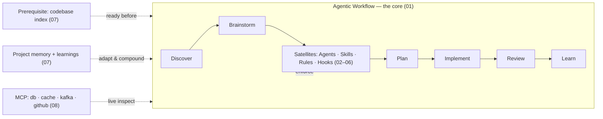

# ClaudeHut Design — 00. Overview

> Part of the **ClaudeHut** design document set. See [README](./README.md) for the full index and reading order.
> **Status:** Design v1 · **Audience:** plugin engineers · **Scope:** vision, goals, target user, glossary.

ClaudeHut is a **Claude Code plugin** for Java backend engineers whose center of gravity is an **agentic workflow**: against a pre-indexed codebase, the agent autonomously brainstorms codebase-adapted solutions, writes a spec, plans, implements test-first, reviews for full compliance, and learns — with every phase auto-enforced by native Claude Code mechanisms (skills, hooks, rules, subagents). This document fixes the vision and the canonical vocabulary that every other document in the set reuses verbatim.

## Table of Contents

- [1. Vision](#1-vision)
- [2. Goals (and non-goals)](#2-goals-and-non-goals)
- [3. Target user](#3-target-user)
- [4. The six pillars](#4-the-six-pillars)  <!-- Pillars P1–P6; not the same as the 7 workflow phases -->
- [5. Target tech stack](#5-target-tech-stack)
- [6. Glossary (canonical terms)](#6-glossary-canonical-terms)
- [7. Native Claude Code features the design relies on](#7-native-claude-code-features-the-design-relies-on)
- [8. Scope boundaries](#8-scope-boundaries)
- [9. Document map](#9-document-map)

---

## 1. Vision

A Java backend engineer installs one plugin and gets a disciplined senior teammate that **refuses to write code the wrong way**. Instead of jumping straight to an edit, the agent is structurally forced through a quality loop: against an already-indexed codebase, discover (ground the task in the codebase + prove reuse), brainstorm options, write a spec for the chosen approach, plan, implement test-first, review against every applicable rule and real evidence, and persist what it learned so the next session starts smarter.

The plugin is **opinionated for the Java/Spring stack** (see [§5](#5-target-tech-stack)) and **adaptive per project**: the same plugin, dropped into any repository, acquires that repository's own conventions, architecture, and vocabulary and then obeys them.

The differentiator is not the set of skills — it is the **workflow that orchestrates them and the enforcement that makes the workflow non-optional**.

## 2. Goals (and non-goals)

**Goals**

1. Make the 7-phase agentic workflow ([01](./01-agentic-workflow.md)) the default operating mode, enforced by hooks and skills rather than by hope.
2. Force *think-and-reuse before build* — the agent must discover (ground the task + reuse-scan) before brainstorming or writing anything new.
3. Adapt to each project's real conventions via generated, project-scoped memory.
4. Carry learnings across sessions so the agent compounds knowledge on a project.
5. Use **only native Claude Code mechanisms** — no bespoke runtime where a native feature exists.
6. Ship a coherent, proportionate set of agents/skills/rules/hooks where every item maps to exactly one workflow phase.

**Non-goals**

- Not a general-purpose agent framework. It is Java-backend-shaped.
- Not a replacement for CI/CD, linters, or IDEs — it *invokes* them.
- Not a code generator that emits large speculative scaffolds. Output is minimal and reuse-first.
- This document set is **design only**; it ships no plugin code (see [10](./10-build-roadmap.md) for the build plan).

## 3. Target user

A Java backend engineer (mid-to-senior) working in Spring-based services who wants Claude Code to behave like a careful, convention-respecting teammate. They value: correctness, test-first discipline, not reinventing existing utilities, and consistency with the team's architecture. They run Claude Code locally and/or on `claude.ai/code`.

## 4. The six pillars

Every document in this set serves these six pillars. They are the acceptance contract.

| # | Pillar | One-line definition | Primary documents |
|---|--------|---------------------|-------------------|
| P1 | **Agentic workflow as the core** | A 7-phase loop (over a pre-indexed codebase) is the plugin's center; the agent autonomously drives toward best-practice output. | [01](./01-agentic-workflow.md) |
| P2 | **Agents / Skills / Rules / Hooks as satellites** | A standard roster orbits and enforces the workflow; each binds to a phase + native mechanism. | [02](./02-architecture.md), [03](./03-agents.md), [04](./04-skills.md), [05](./05-rules.md), [06](./06-hooks.md) |
| P3 | **Project-adaptive memory** | Same plugin, different project: the agent acquires and obeys that project's context/architecture/style. | [07](./07-memory-architecture.md) |
| P4 | **Think-and-reuse before acting** | The workflow forces brainstorming and a reuse check before any new code is written. | [01](./01-agentic-workflow.md), [07](./07-memory-architecture.md) |
| P5 | **Continuous reinforcement learning across sessions** | Learnings are recorded during work and propagate to every agent in every later session of the same project. | [07](./07-memory-architecture.md) |
| P6 | **Native Claude Code integration** | Manifest, subagents, skills, hooks, slash commands, MCP, CLAUDE.md — used exactly as the official docs prescribe. | all |

## 5. Target tech stack

The plugin is opinionated for:

- **Language:** Java 11+
- **Frameworks:** Spring Boot, Spring MVC, Spring WebFlux
- **ORM / data:** Hibernate (JPA), R2DBC
- **Databases:** PostgreSQL, MySQL
- **Messaging:** Kafka, RabbitMQ, NATS
- **Caching:** Redis
- **Testing:** JUnit 5, WireMock, unit / integration / black-box tests

These choices drive the domain skills ([04](./04-skills.md)), the reviewer agents ([03](./03-agents.md)), the path-scoped rules ([05](./05-rules.md)), and the MCP servers ([08](./08-mcp-integration.md)).

## 6. Glossary (canonical terms)

These terms are **defined once here** and used identically across all documents. Do not introduce synonyms.

| Term | Definition |
|------|------------|
| **Workflow** | The 7-phase agentic loop: **Discover → Brainstorm → Spec → Plan → Implement → Review → Learn**. The plugin's core. **Codebase indexing is a prerequisite, not a phase** (see *Codebase index*). |
| **Phase** | One stage of the Workflow. Each phase has bound skills, agents, rules, and gates. |
| **Codebase index** | The prerequisite, queryable map of the project built **before** the Workflow runs — `reuse-index.json` + `architecture.md` produced at Bootstrap, plus the `understand-anything` knowledge graph when that plugin is enabled. The Workflow consumes it; it is never a phase. |
| **Discover** | Phase 1 (v0.4, NEW). Grounds the task in the existing codebase and settles the reuse question before any ideation. Runs explorer ∥ reuse-scanner concurrently in one message, writes the **Reuse-scan artifact**, records `set-reuse-scan`, and is the only phase the fast lane never skips. |
| **Brainstorm** | Phase 2 (formerly Phase 1). **Generic, domain-agnostic ideation** — generates ≥2 genuinely distinct candidate approaches (best-practice, smallest footprint, highest quality+performance), **consumes Discover's context + reuse DECISION**, and **determines the enforcement set**. Does NOT explore or reuse-scan — that is Discover's job (v0.4 reversal). |
| **Spec** | Phase 3 (formerly Phase 2, originally "Decide"). Produces the implementation spec: the chosen approach, acceptance criteria, and the enforcement manifest. |
| **Review** | Phase 6 (formerly Phase 5, originally "Verify"). The main thread spawns **dynamically selected** auditor subagents (test-runner + general reviewer always; specialists by enforcement-set + git-diff impact) that check the implementation against every applicable skill, rule, and memory item, looping until the outstanding set is empty. |
| **Complexity tier** | One of `trivial`, `small`, or `full` (default). Assessed at Phase 0 (triage) and recorded via `set-complexity`. Phases per tier: **trivial** = Discover → Implement → Review (min); **small** = Discover → Implement → Review → Learn; **full** = all 7 phases. Trivial/small skip the deliberation phases (Brainstorm/Spec/Plan) but **never skip safety rails** (Discover reuse-scan, test-first, Review). The write gate verifies the tier's bound deterministically (≤2 files, no security/auth/migration path). |
| **Enforcement set (manifest)** | The auditable list of skills + rules that apply to the current task at **≥1% match** (see *1% rule*), determined in Brainstorm, recorded in `state.json` and the spec, and checked by the Review auditors. It is a checklist, not a new enforcement engine — rules still auto-load by `paths:` and skills still trigger by `description`. |
| **1% rule** | The Superpowers enforcement principle, applied verbatim: *"If you think there is even a 1% chance a skill might apply to what you are doing, you ABSOLUTELY MUST invoke the skill."* Used to build the enforcement set and to gate Review. |
| **Outstanding set** | The set of applicable-but-unsatisfied {skills ∪ rules ∪ memory} items returned by the Review auditors each iteration. Review exits when it is empty (and evidence is green). |
| **understand-anything integration** | Conditional use of the `understand-anything` plugin's query/search skills during **Discover** (phase 1), **only when that plugin is enabled**. Detected by a SessionStart hook reading `enabledPlugins` (no native runtime cross-plugin branch exists). |
| **Phase gate** | A hook-enforced precondition that must hold before the Workflow may leave (or finish) a phase. |
| **Orchestrator skill** | `claudehut-workflow` — the bootstrap meta-skill injected at session start that establishes the phases and the skill-first law. |
| **Satellite** | Any agent, skill, rule, or hook that orbits and enforces the Workflow. |
| **Iron Law** | A non-negotiable rule stated inside a skill, paired with a concrete consequence (e.g. "no production code without a failing test — delete it and start over"). Borrowed from the superpowers enforcement pattern. |
| **Rationalization table** | A table inside an enforcement skill listing the excuses an agent typically uses to skip a step, each paired with a refutation. |
| **Project memory** | The generated, project-scoped context under `${CLAUDE_PROJECT_DIR}/.claude/claudehut/` describing this project's stack, architecture, vocabulary, and reusable components. |
| **Vocabulary lock** | `LANGUAGE.md` — the project's term glossary (e.g. which layer is "service" vs "adapter") that the agent must use consistently. |
| **Reuse index** | `reuse-index.json` — a generated catalog of the project's reusable components (services, utilities, configs) with signatures and locations. |
| **Reuse-scan artifact** | A per-task file (`.claude/claudehut/tasks/NNNN-<slug>/reuse-scan.md`) proving the agent checked the Reuse index and project before deciding to write new code. Its existence is a phase gate. |
| **Learnings store** | `learnings.jsonl` — the structured, queryable record of cross-session reinforcement learnings. |
| **Auto-memory** | Native Claude Code cross-session memory (`~/.claude/projects/<project>/memory/`), enabled via a subagent's `memory: project` frontmatter. It is **machine-local, user-scoped, not committable, and may be disabled**, so ClaudeHut treats it as an **optional non-authoritative mirror** — the canonical store is the committed `learnings.jsonl`. See [07 §1.1](./07-memory-architecture.md#11-where-memory-lives--and-why-not-native-auto-memory). |
| **MEMORY.md (committed index)** | `${CLAUDE_PROJECT_DIR}/.claude/claudehut/MEMORY.md` — the concise, committed, always-loaded index that names what is stored where; distinct from native auto-memory's `MEMORY.md`. The cost-aware loading mechanism is in [07 §1.2](./07-memory-architecture.md#12-cost-aware-context-loading). |
| **Phase-state file** | The **per-session** file `${CLAUDE_PROJECT_DIR}/.claude/claudehut/state/<session_id>.json` recording the current phase and the gate flags (session, reuse-scan done, enforcement set, spec path, plan path, review status, outstanding items, complexity tier). Per-session to stay collision-safe under concurrent worktrees. Authoritative schema + concurrency design in [01 §4](./01-agentic-workflow.md#4-the-phase-state-machine), [§4.1](./01-agentic-workflow.md#41-concurrency-and-worktree-isolation-collision-safe-state). "state.json" is shorthand for this file. |
| **State writer** | `bin/claudehut-state` — the command the agent runs to record a phase transition. Hooks only *read* the Phase-state file; this command is the only *writer*. Subcommands include `set-phase`, `set-reuse-scan`, `set-enforcement`, `set-spec`, `set-plan`, `set-review`, `set-outstanding`, `set-bypass`, `set-complexity`. |
| **Bootstrap** | The one-time, per-project generation of Project memory by `/claudehut:init`. |

## 7. Native Claude Code features the design relies on

Each is detailed in the document that depends on it; this is the index.

| Native feature | Used for | Authoritative doc |
|----------------|----------|-------------------|
| `plugin.json` manifest + `marketplace.json` | Packaging, distribution, user config | [09](./09-plugin-structure.md) |
| Subagents (`agents/*.md` frontmatter: `description`, `tools`, `model`, `effort`, `skills`, `memory`, `isolation`) | The specialist roster, auto-delegation, cross-session memory | [03](./03-agents.md) |
| Skills (`SKILL.md` progressive disclosure, `description`, `allowed-tools`, `disable-model-invocation`, `paths`) | Phase behavior + domain knowledge + enforcement; all phase skills run on the main thread and dispatch agent(s) via the Agent tool | [04](./04-skills.md) |
| Hooks (`SessionStart`, `UserPromptSubmit`, `PreToolUse`, `PostToolUse`, `Stop`, `SubagentStop`, `PreCompact`) | Bootstrap, phase gates, formatting, learning persistence | [06](./06-hooks.md) |
| Slash commands (skills with `disable-model-invocation` or flat `commands/`) | `/claudehut:init`, `/claudehut:phase`, etc. | [04](./04-skills.md), [09](./09-plugin-structure.md) |
| MCP (`.mcp.json`, `${CLAUDE_PLUGIN_ROOT}`, `${user_config.*}`) | Live DB/cache/messaging/Git inspection | [08](./08-mcp-integration.md) |
| Memory: CLAUDE.md hierarchy, `@import`, `.claude/rules/` path-scoping, native auto-memory | Project-adaptive memory + reinforcement learning | [07](./07-memory-architecture.md) |
| `${CLAUDE_PLUGIN_DATA}` / `${CLAUDE_PROJECT_DIR}` | State and memory placement that survives plugin updates and stays project-scoped | [07](./07-memory-architecture.md) |

## 8. Scope boundaries

- Plugin component directories (`agents/`, `skills/`, `hooks/`, etc.) live at the plugin root; only `plugin.json` lives in `.claude-plugin/`.
- **A plugin cannot ship `.claude/rules/` or `CLAUDE.md` directly** — those are project/user memory locations. ClaudeHut therefore ships rule *templates* and generates project rules during Bootstrap. This constraint shapes [05](./05-rules.md) and [07](./07-memory-architecture.md).
- **Plugin-shipped subagents cannot use `hooks`, `mcpServers`, or `permissionMode` frontmatter** (silently ignored). The roster in [03](./03-agents.md) respects this; subagent-scoped behavior comes from `skills:` preload and the plugin-level hooks instead.
- No state is written under `${CLAUDE_PLUGIN_ROOT}` (it changes on update); project state lives under `${CLAUDE_PROJECT_DIR}/.claude/claudehut/`.

## 9. Document map

| Doc | Title | Covers |
|-----|-------|--------|
| 00 | Overview | *(this document)* vision, glossary, scope |
| [01](./01-agentic-workflow.md) | Agentic Workflow | the 7 phases, the enforcement loop (centerpiece) |
| [02](./02-architecture.md) | Architecture | component map + the master matrix |
| [03](./03-agents.md) | Agents | full subagent roster with specs |
| [04](./04-skills.md) | Skills | full skill catalog with triggers + enforcement |
| [05](./05-rules.md) | Rules | path-scoped rule set + loading model |
| [06](./06-hooks.md) | Hooks | hook events, scripts, what each enforces |
| [07](./07-memory-architecture.md) | Memory Architecture | project-adaptive memory, reuse-scan index, reinforcement learning |
| [08](./08-mcp-integration.md) | MCP Integration | MCP servers/resources and why |
| [09](./09-plugin-structure.md) | Plugin Structure | directory layout, manifest, file-by-file map |
| [10](./10-build-roadmap.md) | Build Roadmap | phased plan to implement this design |
| [11](./11-execution-model-and-artifacts.md) | Execution Model + Artifacts | v0.3 redesign: task-dir layout, main-thread rule, approval gates, native task mirror, spec/plan templates |

---

**Next:** [01. Agentic Workflow →](./01-agentic-workflow.md)
