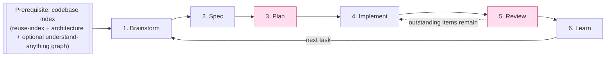
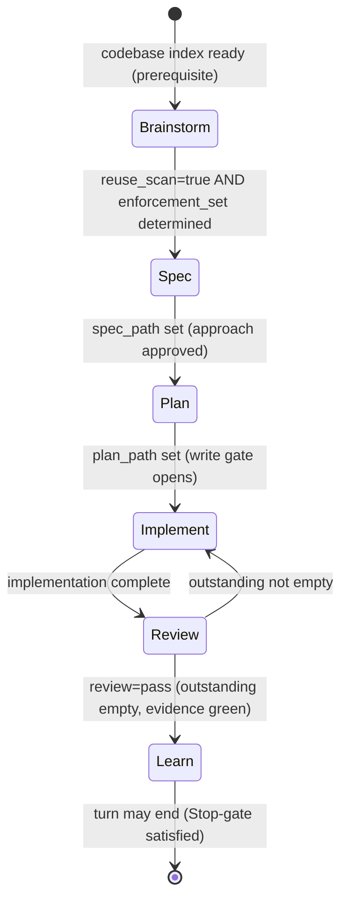
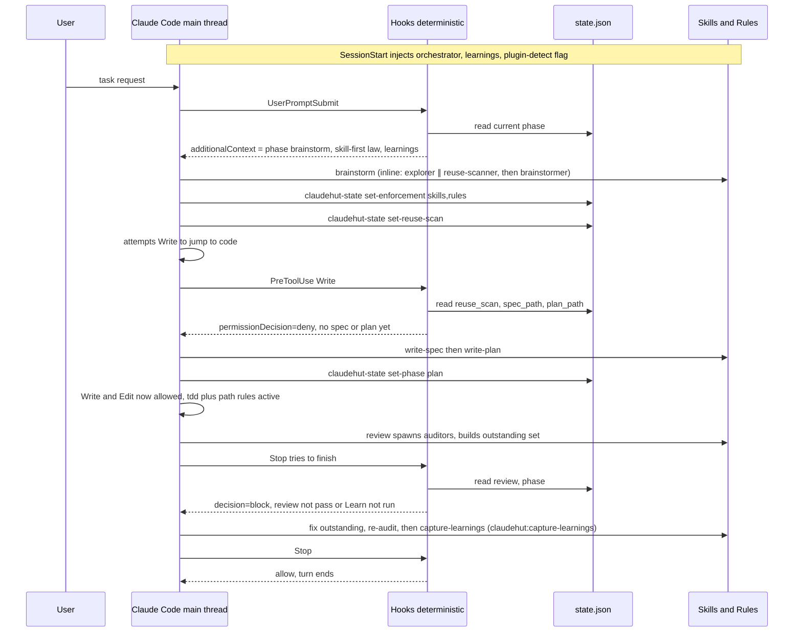
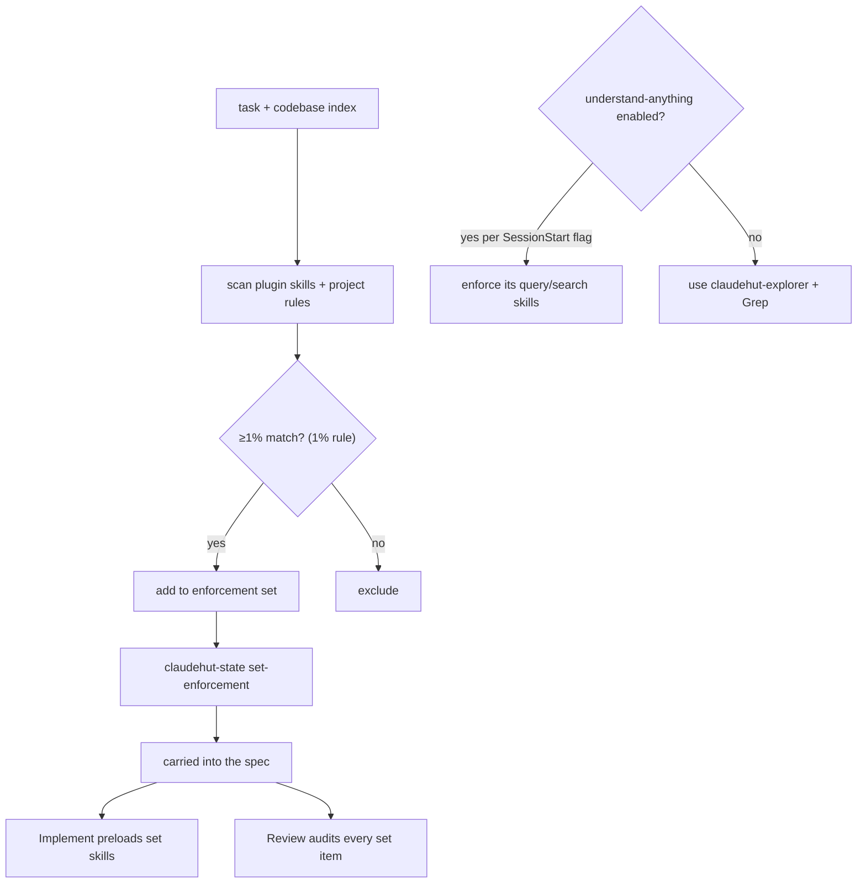
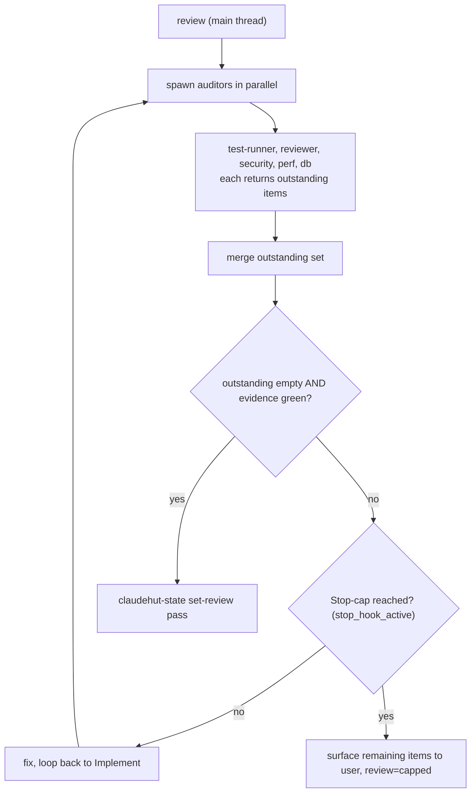
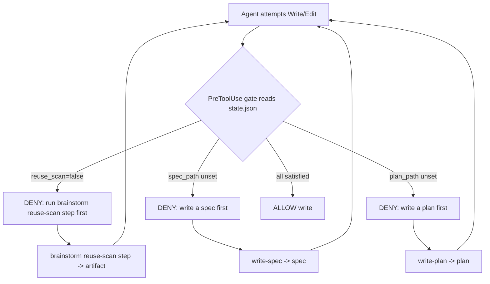

# ClaudeHut Design — 01. Agentic Workflow

> Part of the **ClaudeHut** design document set. See [README](./README.md) for the index. Terms are defined in [00. Overview §6](./00-overview.md#6-glossary-canonical-terms).
> **Status:** Design v1 · **Pillar focus:** P1 (workflow core), P4 (think-and-reuse). **This is the centerpiece document.**

The Workflow is the plugin. Everything else — agents, skills, rules, hooks, memory, MCP — exists to drive the agent through these phases and to make skipping a phase structurally hard. This document defines the **prerequisite** (codebase indexing), the **six phases** (Brainstorm → Spec → Plan → Implement → Review → Learn), the **enforcement loop** that auto-binds skills and auto-loads rules at each phase, the authoritative **phase-state schema**, and how each phase's behavior is carried **natively inside the skill/agent markdown** so handoff needs no external orchestration.

## Table of Contents

- [1. The loop at a glance](#1-the-loop-at-a-glance)
- [2. Design principle: enforcement over instruction](#2-design-principle-enforcement-over-instruction)
- [3. Prerequisite: the codebase index (not a phase)](#3-prerequisite-the-codebase-index-not-a-phase)
- [4. The phase-state machine](#4-the-phase-state-machine)
- [5. The six phases](#5-the-six-phases)
- [6. The enforcement loop (how each phase is auto-enforced)](#6-the-enforcement-loop-how-each-phase-is-auto-enforced)
- [7. The enforcement set: applying the 1% rule](#7-the-enforcement-set-applying-the-1-rule)
- [8. The Review loop and its exit condition](#8-the-review-loop-and-its-exit-condition)
- [9. Native handoff: flow lives inside the skill/agent markdown](#9-native-handoff-flow-lives-inside-the-skillagent-markdown)
- [10. Think-and-reuse: the hard gate](#10-think-and-reuse-the-hard-gate)
- [11. Worked example](#11-worked-example)
- [12. Escape hatches](#12-escape-hatches)

---

## 1. The loop at a glance



The Workflow runs **per task** (one user request = one pass) against an **already-indexed** codebase ([§3](#3-prerequisite-the-codebase-index-not-a-phase)). Phases are sequential; the **Plan→Implement** boundary is a hard action gate (no new code until reuse-scan + spec + plan exist) and **Review** is a hard completion gate that loops back to Implement until nothing applicable is left unsatisfied.

> **Why no Explore phase?** Exploration is not per-task work — it is a one-time prerequisite. Indexing the codebase once (and refreshing on demand) is cheaper and more reliable than re-exploring inside every task. Per-task *querying* of that index still happens, but it happens **inside Brainstorm** to ground the candidate solutions ([§5](#5-the-six-phases)), not as its own phase.

## 2. Design principle: enforcement over instruction

The research is unambiguous (see superpowers): **telling** an agent to follow a process is unreliable; the agent rationalizes its way out ("this is simple", "I'll review after", "let me just edit the file first"). ClaudeHut therefore encodes the process three ways, in increasing strength:

1. **Instruction** — the orchestrator skill describes the phases (weakest; the agent *can* ignore it).
2. **Intra-turn ordering** — phase skills carry Iron Laws + rationalization tables that order actions within a single turn (e.g. reuse-scan before new code). See [04. Skills](./04-skills.md).
3. **Hard gates** — hooks that *block* a tool call or a turn-end until a precondition holds. These cannot be rationalized away because they are deterministic code, not model judgment. See [06. Hooks](./06-hooks.md).

The honest scope of each gate type (do not overclaim):

| Mechanism | What it can enforce | What it cannot enforce |
|-----------|---------------------|------------------------|
| `PreToolUse` hook → `permissionDecision:deny` | Block a specific *action* (e.g. Write/Edit) until a precondition file exists | Force the agent to *think*; it only blocks the keystroke |
| `Stop` / `SubagentStop` hook → `decision:block` | Block *turn completion* — "you may not stop until Review passes and Learn is done" | Mid-turn phase ordering; and it is capped (`stop_hook_active`, ~8 consecutive blocks) — see [§8](#8-the-review-loop-and-its-exit-condition) |
| Skill Iron Law text | Intra-turn ordering and discipline | Anything across turns — it lives in context, not in code |
| `SessionStart` hook → `additionalContext` | Guarantee the orchestrator + learnings + plugin-detection load before turn 1 | Anything after the first turn |

## 3. Prerequisite: the codebase index (not a phase)

Before the Workflow can adapt a solution to *this* codebase, the codebase must be indexed. **Indexing is a Bootstrap prerequisite, established once and refreshed on demand — it is never a workflow phase.**

The index has two tiers, both consumed (never produced) by the Workflow:

| Tier | Built by | Native mechanism | Content |
|------|----------|------------------|---------|
| **Base index (always)** | `claudehut-init` at Bootstrap ([07 §3](./07-memory-architecture.md#3-bootstrapping-a-new-project)) | generated Project memory under `${CLAUDE_PROJECT_DIR}/.claude/claudehut/` | `reuse-index.json` (reusable components + signatures) + `architecture.md` (layer/package map) |
| **Graph index (conditional)** | the `understand-anything` plugin, **only if enabled** | that plugin's own skills/MCP | a queryable knowledge graph for richer explore/query/search |

**Detecting the conditional tier — natively honest.** There is **no native runtime field** by which one plugin branches on whether another is installed (`dependencies` is install-time coupling only). So the `bootstrap.sh` `SessionStart` hook ([06](./06-hooks.md)) reads `enabledPlugins` from settings (or shells `claude plugin list`) and injects an `additionalContext` flag: *"understand-anything is enabled → Brainstorm MUST use its query/search skills"* or *"not enabled → use `claudehut-explorer` + Grep."* Brainstorm's skill body branches on that injected flag. ClaudeHut does **not** declare `understand-anything` as a `dependencies` entry (that would hard-require it).

Per-task *querying* of the index happens inside Brainstorm as a step driven by the `brainstorm` skill / `claudehut-explorer` agent ([03](./03-agents.md)). Keep the distinction sharp: **indexing = prerequisite (Bootstrap); querying = a step inside Brainstorm.**

## 4. The phase-state machine

The single source of truth for "where are we" is the **Phase-state file**, written **per session** at `${CLAUDE_PROJECT_DIR}/.claude/claudehut/state/<session_id>.json` (the per-session path is the collision-safe fix — see [§4.1](#41-concurrency-and-worktree-isolation-collision-safe-state)). Throughout these docs "state.json" is shorthand for this per-session file. **This schema is authoritative; [06. Hooks](./06-hooks.md) and [09. Plugin Structure](./09-plugin-structure.md) cite it literally.**

```json
{
  "session": "<session_id>",
  "task": "add idempotency key to PaymentController",
  "phase": "implement",
  "reuse_scan": true,
  "reuse_scan_artifact": ".claude/claudehut/tasks/0007-payment-idempotency/reuse-scan.md",
  "enforcement_set": {
    "skills": ["implement", "review"],
    "rules":  ["controller.md", "persistence.md", "testing.md", "caching.md"]
  },
  "spec_path": ".claude/claudehut/tasks/0007-payment-idempotency/spec.md",
  "plan_path": ".claude/claudehut/tasks/0007-payment-idempotency/plan.md",
  "review": "pending",
  "outstanding": [],
  "bypass": false,
  "updated_by": "claudehut-state",
  "ts": "2026-06-02T10:31:00Z"
}
```

Field semantics:

| Field | Meaning | Set during |
|-------|---------|------------|
| `session` | the session id this state belongs to (also encoded in the filename) — the per-session key that isolates concurrent tasks ([§4.1](#41-concurrency-and-worktree-isolation-collision-safe-state)) | created at first transition |
| `phase` | one of `brainstorm` \| `spec` \| `plan` \| `implement` \| `review` \| `learn` | every transition |
| `reuse_scan` | reuse scan complete + artifact written | Brainstorm |
| `enforcement_set.skills` / `.rules` | the applicable skills/rules at ≥1% match — the checklist Review audits ([§7](#7-the-enforcement-set-applying-the-1-rule)) | Brainstorm |
| `spec_path` | the implementation spec exists | Spec |
| `plan_path` | the executable plan exists | Plan |
| `review` | `pending` \| `pass` — pass only when `outstanding` is empty and evidence is green | Review |
| `outstanding` | applicable-but-unsatisfied {skills ∪ rules ∪ memory} items from the auditors | Review (each iteration) |
| `bypass` | senior override; disables the gate hooks for the session | manual |

**Who writes it (critical, per native constraints):** a skill *cannot* reliably persist state on its own — skill text only lives in context. So the **only writer** is the `bin/claudehut-state` command, which the orchestrator and phase skills instruct the agent to run on each transition, e.g.:

```
claudehut-state --session ${CLAUDE_SESSION_ID} set-enforcement --skills implement,review --rules controller.md,persistence.md,testing.md,caching.md
claudehut-state --session ${CLAUDE_SESSION_ID} set-spec .claude/claudehut/tasks/0007-payment-idempotency/spec.md
claudehut-state --session ${CLAUDE_SESSION_ID} set-review pass        # only after outstanding == []
```

The skill body passes `${CLAUDE_SESSION_ID}` (a native skill string-substitution) so the writer targets the correct per-session file; gate hooks derive the same path from the `session_id` field in their hook-input JSON ([§4.1](#41-concurrency-and-worktree-isolation-collision-safe-state)). Subcommands: `set-phase`, `set-reuse-scan`, `set-enforcement`, `set-spec`, `set-plan`, `set-review`, `set-outstanding`, `set-bypass` (all take `--session`). **Hooks only read the state file; they never write it.** This separation is what makes the gates deterministic.



### 4.1 Concurrency and worktree isolation (collision-safe state)

**The risk.** ClaudeHut runs subagents with `isolation: worktree` and can run several tasks at once. A *single* project-wide `state.json` would be shared across all of them and could be clobbered.

**Verified native behavior (with citations):**

| Fact | Source | Status |
|------|--------|--------|
| `isolation: worktree` gives each subagent its **own** temporary git worktree (separate working dir), auto-created and auto-removed if unchanged | `code.claude.com/docs/en/worktrees.md`, `…/sub-agents.md` | ✅ documented |
| `${CLAUDE_PROJECT_DIR}` is "**the project root**" and is exported to hooks/MCP/LSP processes | `…/hooks.md` | ✅ documented |
| Whether `${CLAUDE_PROJECT_DIR}` is **remapped to the worktree** inside a worktree subagent (vs. staying pinned to the main repo root) | — | **[uncertain]** — docs say "project root" but do not state worktree behavior explicitly |
| Hook input JSON carries `cwd` (the actual working dir — the worktree path inside a worktree subagent) and `session_id` | `…/hooks.md` | ✅ documented |
| Subagents/background sessions run **concurrently**; subagents inherit the **parent `session_id`** (+ own `agent_id`) | `…/sub-agents.md` | ✅ documented |
| Any native file-locking / atomic-write / race guidance for shared files outside the worktree | — | **[NOT IN DOCS]** — ClaudeHut must provide its own |

**The design invariant that makes the fix correct (stated, not assumed):** *in ClaudeHut, exactly one component writes state per session — the main thread, via `claudehut-state`. Every subagent (explorer, scanner, planner, implementer, the five Review auditors, learner) is **read-only with respect to state**; it returns artifacts and the main thread records the transition. Concurrent workflows therefore run as **separate sessions**, each with a distinct `session_id`.* (If a future variant ran multiple independent full workflows inside one session — e.g. an agent-team where each teammate drives its own workflow — session-keying would be insufficient and state would have to be keyed off the per-worktree `cwd` instead; ClaudeHut's roster does not do this.)

**The fix — per-session state + atomic write:**
1. **Per-session path:** `…/.claude/claudehut/state/<session_id>.json`. The writer derives `<session_id>` from `${CLAUDE_SESSION_ID}`; gate hooks derive it from the hook-input `session_id`. Concurrent workflows = distinct sessions = distinct files → **no clobber**.
2. **Atomic write:** `claudehut-state` writes a temp file and `rename()`s it into place (atomic on POSIX), so a concurrent hook read never sees a torn file.

**Both-cases-safe under the `[uncertain]` items:**
- *If `${CLAUDE_PROJECT_DIR}` stays pinned to the main root* (the "project root" reading): all agents resolve the same `state/<session_id>.json`, and per-session keying prevents cross-task collision on that shared directory. ✅
- *If `${CLAUDE_PROJECT_DIR}` remaps to the worktree*: each worktree already has an isolated `.claude/claudehut/`, so state is isolated regardless. ✅
- *Writer/reader key agreement* — `${CLAUDE_SESSION_ID}` (skill substitution) and the hook-input `session_id` are both "the current session id"; the docs describe each as such but **do not explicitly state they are byte-identical** → **[uncertain]**. **Failure direction, stated honestly:** the gate hooks **fail open** on a missing state file (they `allow`/don't-block — [06 §5](./06-hooks.md#5-failure-modes-and-escape-hatches)), so a key mismatch would *silently disable enforcement* rather than wedge the user. Because the enforcement-critical gates (the main-thread `Stop` completion gate and the pre-dispatch `PreToolUse` gate) run **on the main thread** — same session as the writer — they agree by construction; the only fail-open exposure is a worktree subagent's own `PreToolUse`, which is non-critical (the main thread already cleared the gate before dispatching it). The build roadmap's gate tests ([10](./10-build-roadmap.md)) must assert writer/reader key agreement so this can never regress silently.

**Native worktree isolation: `origin/HEAD` base and no auto-merge.** Two additional verified behaviors (relevant to the parallel-implementer feature, documented in [11 §6](./11-execution-model-and-artifacts.md#6-parallel-execution--worktree-lifecycle)):

| Fact | Consequence |
|------|-------------|
| `isolation: worktree` branches from `origin/HEAD` — only committed+pushed content exists inside the worktree | Uncommitted main-tree files (plan.md, spec.md, state) are **invisible** to the implementer subagent. The dispatch prompt must carry plan rows verbatim; never pass a path to `tasks/…/plan.md` ("content-in-prompt rule"). |
| Native provides no auto-merge — a worktree with commits persists after the subagent exits | The main thread must merge each agent branch explicitly via `bin/claudehut-worktree reconcile`, then `sweep` to remove merged/clean worktrees. Without this helper, used agent branches accumulate as orphans. |

These two facts extend — and do not contradict — the existing per-session state isolation design: state is still the main thread's exclusive write domain (each session writes its own file), and the implementer is still read-only with respect to state. The `origin/HEAD` base reinforces "subagents are read-only w.r.t. state" — there is nothing to accidentally write to.

**Reconciliation after a worktree merges.** None is needed for state: `state/<session_id>.json` is **ephemeral workflow position, gitignored, never merged back**. A worktree merge carries only **code**; native provides no auto-merge, so `bin/claudehut-worktree reconcile` fills that gap (serialized, one branch per call, with conflict-abort and red-test rollback — see [11 §6](./11-execution-model-and-artifacts.md#6-parallel-execution--worktree-lifecycle)). The durable, team-shared artifacts live at the project root and are written by the main thread at low-frequency phase boundaries, with concurrency-safe writes:

| Durable shared file | Write pattern under concurrency |
|---------------------|----------------------------------|
| `tasks/NNNN-<slug>/reuse-scan.md`, `spec.md`, `plan.md`, `review.md` | per-task directories → no collision |
| `learnings.jsonl` | one JSON object per line, appended with a single atomic `O_APPEND` write (safe for line-sized records); the learner's dedup tolerates interleaved appends |
| `reuse-index.json` | atomic temp+`rename()` (last-writer-wins); **advisory** — Brainstorm re-scans the project each task, so a lost update is non-fatal |

## 5. The six phases

Each phase lists: **goal**, **bound skills**, **bound agents**, **rules that auto-load**, **artifact(s)**, and **exit gate**. The full cross-reference matrix lives in [02. Architecture §4](./02-architecture.md#4-the-master-matrix).

### Phase 1 — Brainstorm
- **Goal (rewritten):** brainstorm **candidate solutions that adapt to the current codebase**, optimizing three axes — the **most best-practice** approach, the **smallest change footprint**, and the **highest output quality and performance**. Then **determine the enforcement set**: which skills and rules the agent MUST honor during Implement and Review, applying the 1% rule ([§7](#7-the-enforcement-set-applying-the-1-rule)).
- **Skills:** `brainstorm` (runs inline on the main thread; carries the reuse Iron Law; conditionally enforces `understand-anything` query/search skills when that plugin is enabled). Inside `brainstorm`, the steps are: (1a) `claudehut-explorer` and (1b) `claudehut-reuse-scanner` dispatched **in one message** (concurrent — their inputs are independent), then (2) `claudehut-brainstormer` after both return (it needs both results).
- **Agents:** `claudehut-explorer`, `claudehut-reuse-scanner`, `claudehut-brainstormer`. Explorer and reuse-scanner are dispatched **concurrently in one message**; brainstormer is dispatched after both return.
- **Artifacts:** ≥2 candidate approaches + tradeoffs + a recommendation; the **Reuse-scan artifact** at `.claude/claudehut/tasks/NNNN-<slug>/reuse-scan.md`; the **enforcement set** recorded via `claudehut-state set-enforcement`. `state.json.reuse_scan = true`.
- **Exit gate:** reuse scan complete **and** enforcement set determined. The recommended approach is presented for approval (the superpowers design-gate principle); in interactive use the human confirms before Spec, in autonomous use the agent records its choice and rationale.

### Phase 2 — Spec  *(formerly "Decide")*
- **Goal:** produce the **implementation spec** — the chosen approach, acceptance criteria, the interfaces/contracts it touches, and the **enforcement manifest** (the applicable skills/rules/memory carried forward to Review). Framing the decision as a *specification* aligns with the core principle: the spec is the contract the implementation and Review are measured against.
- **Skills:** `write-spec`.
- **Agents:** none required — Spec is a main-thread act, informed by `brainstorm` output and the Vocabulary lock.
- **Artifact:** `.claude/claudehut/tasks/NNNN-<slug>/spec.md` (context · chosen approach · acceptance criteria · enforcement manifest · alternatives rejected). `state.json.spec_path` set **only after user approval** (via `AskUserQuestion`; non-interactive `-p` run records a draft note and proceeds). The spec **subsumes the old ADR** — rationale for the choice lives in the spec.
- **Exit gate:** spec approved and `spec_path` set.

### Phase 3 — Plan
- **Goal:** turn the spec into an executable, file-level plan (ordered steps, files to touch, tests to write first, verification commands per task).
- **Skills:** `write-plan` (runs inline on the main thread; dispatches `claudehut-planner` via the Agent tool to draft the plan, then owns the approval gate and the state write).
- **Agents:** `claudehut-planner`.
- **Artifact:** a plan file at `.claude/claudehut/tasks/NNNN-<slug>/plan.md` (T-xxx breakdown table, decision summary, deps); `state.json.plan_path` set **only after user approval** (via `AskUserQuestion`). On approval the main thread also calls `TaskCreate` per T-xxx row and wires `addBlockedBy` from the Depends-on column (native task list = per-session live mirror; `plan.md` = durable source of truth).
- **Exit gate (HARD):** `plan_path` must be set before any Write/Edit — enforced by the `PreToolUse` write gate ([§10](#10-think-and-reuse-the-hard-gate)).

### Phase 4 — Implement
- **Goal:** execute the plan **test-first**, honoring **every skill and rule in the enforcement set** plus the project's conventions and vocabulary.
- **Skills:** `implement` (carries the TDD Iron Law: no production code without a failing test; deep tech-stack playbooks live in `implement`'s `references/`).
- **Agents:** `claudehut-implementer` (optionally `isolation: worktree` for risky multi-file changes). Its **static** `skills:` frontmatter preloads a **fixed core** (`implement`) — frontmatter cannot hold a runtime list. The **per-task enforcement set** is passed in the **dispatch prompt** the main thread writes when calling the Agent tool, and the tech-stack standards **auto-load as path-scoped rules** as the agent touches matching files.
- **Rules auto-loaded (path-scoped):** `*Controller.java` → controller rules; `*Repository.java`/`*Entity.java` → persistence rules; `*Test.java` → testing rules; `*Redis*.java`/`*Cache*.java` → caching rules; etc. See [05. Rules](./05-rules.md).
- **Artifact:** code + tests; `state.json.phase = "implement"`. The main thread calls `TaskUpdate in_progress` before each step starts and `TaskUpdate completed` once its verify command passes (sourced from the implementer's per-step report).
- **Exit gate:** none here (Review is the gate).

### Phase 5 — Review  *(formerly "Verify")*
- **Goal:** the **main thread spawns auditor subagents** that enforce the rules, skills, and memory from **both the plugin and the project** to verify/review/audit the implemented task, confirming **full compliance** with every applicable item. This is a **loop** ([§8](#8-the-review-loop-and-its-exit-condition)).
- **Skills:** `review` (runs **inline on the main thread** — it must spawn subagents, and a subagent cannot spawn subagents; carries the completion Iron Law and the test-matrix for applicable tech stacks).
- **Agents (auditors, run in parallel, each returns its slice of the outstanding set):** `claudehut-test-runner`, `claudehut-reviewer`, `claudehut-security-auditor`, `claudehut-perf-reviewer`, `claudehut-db-reviewer`.
- **Artifact:** `.claude/claudehut/tasks/NNNN-<slug>/review.md` (per-auditor findings with citations + test evidence + outstanding items resolved across loops + final verdict); `state.json.review = "pass"` only when `outstanding == []` and evidence is green.
- **Exit gate (HARD):** the `Stop` hook blocks turn completion until `review == "pass"` **and** Learn has run; failures loop back to Implement. The loop honors the native Stop-cap (`stop_hook_active`) — see [§8](#8-the-review-loop-and-its-exit-condition).

### Phase 6 — Learn
- **Goal:** persist what was learned so the next session is smarter; update the Reuse index with anything newly built.
- **Skills:** `capture-learnings`.
- **Agents:** `claudehut-learner` (carries `memory: project` for native auto-memory).
- **Artifact:** new/updated records in `learnings.jsonl`; narrative appended to native auto-memory; `reuse-index.json` updated; `state.json.phase = "learn"`.
- **Exit gate:** Learn complete → the `Stop` hook now permits turn end. See [07. Memory](./07-memory-architecture.md).

## 6. The enforcement loop (how each phase is auto-enforced)

This is the mechanism the acceptance criteria require — "explicit phases plus the skill-enforcement and rule-loading mechanism."



The loop is self-correcting: when the agent tries to shortcut (jump to Write, or stop early), a hook bounces it back with `additionalContext`/`reason` naming exactly what is missing.

**Skill auto-binding (by `description`) vs rule auto-loading (by `paths:`).** Two distinct native mechanisms:

- **Skills** auto-load when their `description` ("what + when") matches; the orchestrator skill's phase→skill table tells the agent which to reach for. Enforcement skills (`brainstorm`, `implement`, `review`) carry Iron-Law bodies so once loaded they constrain ordering.
- **Rules** in `${CLAUDE_PROJECT_DIR}/.claude/rules/*.md` carry `paths:` globs and load **deterministically** the moment the agent touches a matching file — no model decision. Because rules are project-generated, the same plugin loads different rules per project (P3). See [05. Rules](./05-rules.md).

## 7. The enforcement set: applying the 1% rule

Brainstorm's second job is to decide **which skills and rules the agent will enforce** during Implement and Review. The selection principle is the Superpowers rule, applied verbatim:

> **"If you think there is even a 1% chance a skill might apply to what you are doing, you ABSOLUTELY MUST invoke the skill."**

So Brainstorm scans the plugin's skills and the project's rules and lists **every item with a ≥1% match** to the task. That list — the **enforcement set** — is recorded via `claudehut-state set-enforcement` and carried into the spec.

**What it is, and what it is NOT (native honesty, per P6).** The enforcement set is an **auditable checklist**, not a new enforcement engine:

- Rules still auto-load by `paths:`; skills still trigger by `description`. The set does not change those native mechanisms.
- Its job is to make applicability **explicit and reviewable**: during Implement the set's skills stay active (a fixed core via the implementer's static `skills:` preload, with tech-stack standards auto-loading as path-scoped rules), and **Review audits against the set** — every listed item must be confirmed satisfied before `review=pass`. The set never overrides `skills:` frontmatter (a static field); it is a checklist, not a preload mechanism.
- It is the bridge between "the 1% rule says this applies" (Brainstorm) and "prove it was satisfied" (Review).



## 8. The Review loop and its exit condition

Review is not a single pass — it **loops until full compliance**, honoring a real native limit.

**The loop (driven inline from the main thread, because subagents cannot spawn subagents):**

1. `review` (main thread) spawns the auditor subagents in parallel via the Agent tool. Each auditor enforces one lens against the enforcement set + project memory and returns its **outstanding items** (applicable skills/rules/memory not yet satisfied, with evidence).
2. The merged `outstanding` set is written via `claudehut-state set-outstanding`.
3. If `outstanding` is non-empty → fix (loop back to Implement or fix inline) → re-spawn auditors.
4. If `outstanding == []` **and** fresh test evidence is green → `claudehut-state set-review pass`.

**Exit condition (explicit):**

> Review exits when **`outstanding == []` AND fresh evidence is green** → `review=pass`. **OR** the native Stop-cap is reached (`stop_hook_active`; Claude Code blocks at most ~8 consecutive `Stop` hooks) → the `gate-done.sh` hook degrades gracefully: it stops blocking, marks `review` as `capped`, and **surfaces the remaining `outstanding` items to the user** rather than wedging the session.



This keeps correction 4 honest: "loop until zero applicable rules/memory unsatisfied" is the *goal*, and the cap is the *native ceiling* that prevents an infinite block.

## 9. Native handoff: flow lives inside the skill/agent markdown

Per correction 5, **each phase's conventions, instructions, and flow are encoded inside the skill/agent markdown files themselves** — so the main agent and subagents receive context natively and execute the flow natively, with no orchestration in prose outside the files. Three native mechanisms carry this:

1. **The orchestrator skill** (`claudehut-workflow`) is injected at `SessionStart` via `additionalContext`, so the phase→skill map and the skill-first + 1% laws are in context before turn 1.
2. **Each phase skill's SKILL.md body** carries: an **announcement**, the **flow steps**, its **Iron Law** (if any), and a **`REQUIRED NEXT`** pointer naming the next skill — the superpowers self-driving pattern. The model auto-loads the body when the `description` matches; the body then drives the phase and names its successor.
3. **Subagents receive the same context natively**: a subagent's `skills:` frontmatter **preloads the full skill bodies** into its context at startup, and the agent's own markdown body is its system prompt. So a forked auditor or implementer already "knows" the conventions and flow without any external handoff.

Skeleton of a phase skill (the flow is *in the file*, not in surrounding prose):

```markdown
---
name: write-spec
description: >
  Produce the implementation spec for the chosen approach (Spec phase). Use
  after Brainstorm, before Plan, when an approach has been selected. Records
  acceptance criteria and the enforcement manifest.
allowed-tools: "Read Grep Glob Write"
---
## Announce
State: "Using ClaudeHut write-spec (phase 2 — Spec)."

## Flow
1. Read the recommended approach + enforcement set from Brainstorm.
2. Write .claude/claudehut/tasks/NNNN-<slug>/spec.md: context, chosen approach,
   acceptance criteria, enforcement manifest (skills+rules), rejected alternatives.
3. Call AskUserQuestion for approval. Only after approval run: claudehut-state set-spec <path>

## REQUIRED NEXT
Invoke claudehut:write-plan. Do NOT write production code yet — the write gate is closed until a plan exists.
```

And the matching subagent carries its flow + preloaded skills natively:

```markdown
---
name: claudehut-implementer
description: Execute the plan test-first under the enforcement set. Use in the Implement phase for multi-file changes.
tools: Read, Edit, Write, Bash, Grep, Glob
skills: [implement]   # full body preloaded into this subagent; carries TDD Iron Law + tech-stack playbooks
isolation: worktree
---
You implement the plan one step at a time. For every step: write the failing test
first (TDD Iron Law, carried by `implement`), then the minimal code, then refactor.
Honor every rule that auto-loads for the files you touch. Return: files changed + which
enforcement-set items you satisfied. REQUIRED NEXT (main thread): claudehut:review.
```

Note the implementer's `skills:` lists only the **fixed core** — it is static frontmatter. The **per-task enforcement set** is written into the dispatch prompt the main thread sends to the Agent tool; the static field cannot hold a runtime list ([§7](#7-the-enforcement-set-applying-the-1-rule)).

This pattern holds for **every phase**: Brainstorm's `brainstorm`, Spec's `write-spec`, Plan's `write-plan`, Implement's `implement`, Review's `review`, and Learn's `capture-learnings` each carry their Announce → Flow → Iron Law → `REQUIRED NEXT` inside their own SKILL.md, and each phase agent's body carries its output contract. [03. Agents](./03-agents.md) and [04. Skills](./04-skills.md) show the per-component detail.

## 10. Think-and-reuse: the hard gate

Pillar P4 demands the agent think and reuse *before* writing. The mechanism is a two-part gate:

1. **Brainstorm produces a Reuse-scan artifact.** The reuse-scan step inside the `brainstorm` skill (driven by `claudehut-reuse-scanner`) queries `reuse-index.json` and greps the project for existing services/utilities/configs that already solve the task — the smallest-footprint axis. The result ("adopt/extend X at `a/b/C.java`" or "nothing reusable, justification: …") is written to `.claude/claudehut/tasks/NNNN-<slug>/reuse-scan.md`, and `claudehut-state set-reuse-scan` flips `reuse_scan=true`.
2. **The write gate refuses code until the prerequisites exist.** The `PreToolUse` hook on `Write|Edit|MultiEdit` reads `state.json`; if `reuse_scan` is false **or** `spec_path` is unset **or** `plan_path` is unset, it returns `permissionDecision: deny` with a reason telling the agent to finish the reuse scan, spec, and plan first.



The agent literally cannot create a new file until it has demonstrated it checked for reuse, specified the approach, and produced a plan. This converts P4 from a hope into a precondition — **provided the gate is armed**: the `PreToolUse` gate fails open on a missing state file, so the SessionStart hook now writes an initial state at turn 1 (opt #1) so the gate is live from the first keystroke. Without arming the claim held only once the agent voluntarily started the workflow (measured gap — EVAL-REPORT #2, now closed). The gate also requires the recorded reuse-scan/spec/plan **files to exist under `.claude/claudehut/`** (opt #4), not merely the state flags.

## 11. Worked example

> **Task:** "Add an idempotency key to `PaymentController.charge`."

1. **Brainstorm** — `brainstorm` runs inline: the index-query step (`claudehut-explorer`) queries the index (uses `understand-anything` if the SessionStart flag says it is enabled, else `claudehut-explorer` + Grep) and finds `PaymentController`, an existing `RequestKeyFilter`, and a Redis config. The reuse-scan step (`claudehut-reuse-scanner`) finds `RequestKeyFilter` already extracts idempotency keys → reuse-scan artifact records "extend `RequestKeyFilter`, back it with Redis." The options step (`claudehut-brainstormer`) weighs filter vs interceptor vs annotation and recommends extending the filter (smallest footprint, best-practice, fits the reactive path). **Enforcement set** determined at ≥1% match: skills `[implement, review]`, rules `[framework/webflux.md, framework/redis.md, performance/caching.md, testing/junit5.md]` → `claudehut-state set-enforcement`. `reuse_scan=true`.
2. **Spec** — `write-spec` produces `tasks/0007-payment-idempotency/spec.md`: chosen approach (extend `RequestKeyFilter`, Redis-backed store), acceptance criteria (duplicate request returns the cached response; key TTL 24h), enforcement manifest, rejected alternatives. User approves via `AskUserQuestion`; `spec_path` set.
3. **Plan** — `write-plan` dispatches `claudehut-planner`, which produces `tasks/0007-payment-idempotency/plan.md` with the T-xxx breakdown (failing `@SpringBootTest` first → Redis store → wire into the existing filter → black-box test). User approves; `plan_path` set; `TaskCreate` mirrors the T-xxx rows in the task panel.
4. **Implement** — agent attempts Write; the gate now allows. `claudehut-implementer` preloads `[implement]`; the TDD Iron Law (carried by `implement`) forces the failing test first; `framework/redis.md`/`performance/caching.md` rules auto-load on the relevant files.
5. **Review** — `review` (main thread) spawns the five auditors. `claudehut-security-auditor` flags one outstanding item: "the idempotency key is user-spoofable" → loop back to Implement, scope the key to the authenticated principal → re-audit → `outstanding == []`, tests green → `review=pass`.
6. **Learn** — `claudehut-learner` records "this project does idempotency via filters, not interceptors" + "`RequestKeyFilter` is the reuse point" into `learnings.jsonl` and updates `reuse-index.json`. The `Stop` gate now permits turn end.

Next session, SessionStart injects that learning, so a future idempotency task starts already knowing the project's pattern.

## 12. Escape hatches

Enforcement must not become a cage. Native, auditable overrides:

- `/claudehut:phase <name> --force` runs `claudehut-state` to jump phases for trivial tasks; the override is recorded in `state.json.updated_by` for auditability.
- Hooks honor a `state.json.bypass = true` flag (set only via the explicit command) so a senior engineer can disable gates for a session.
- The Review loop's Stop-cap (`stop_hook_active`) is itself a safety valve — it surfaces remaining items rather than blocking forever ([§8](#8-the-review-loop-and-its-exit-condition)).
- Per the docs, gates are `PreToolUse`/`Stop` hooks; a user can always disable all hooks via `disableAllHooks` in settings — ClaudeHut does not fight that.

The default, however, is **gates on** — the plugin's value is the discipline.

---

**Prev:** [← 00. Overview](./00-overview.md) · **Next:** [02. Architecture →](./02-architecture.md)
