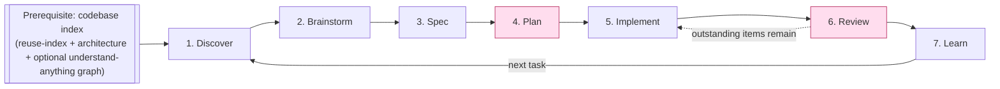
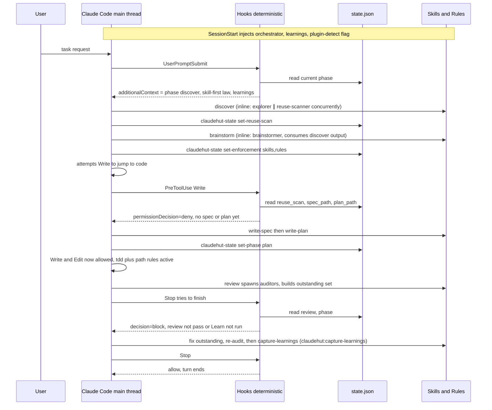
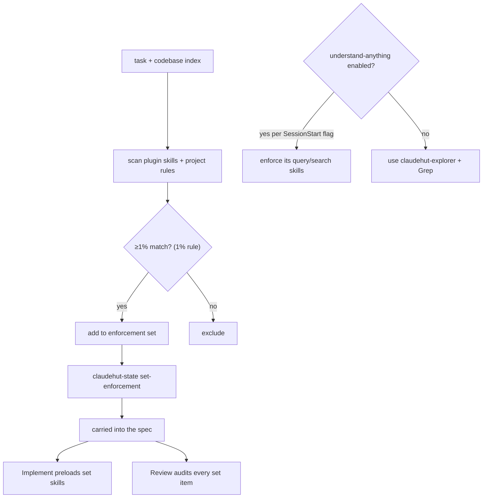
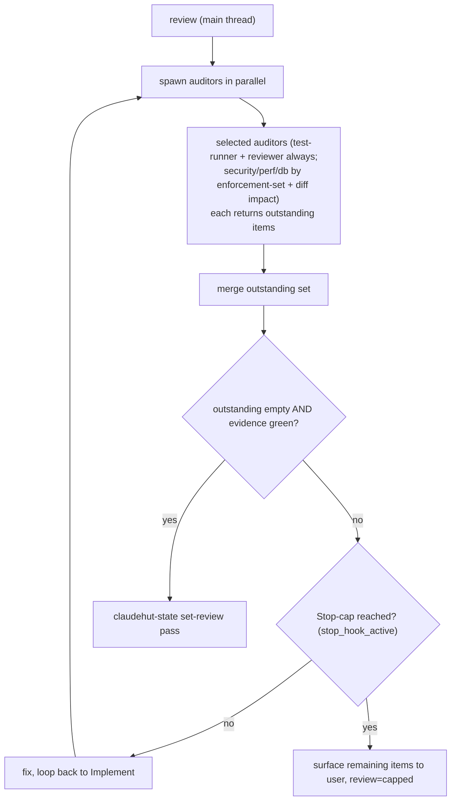
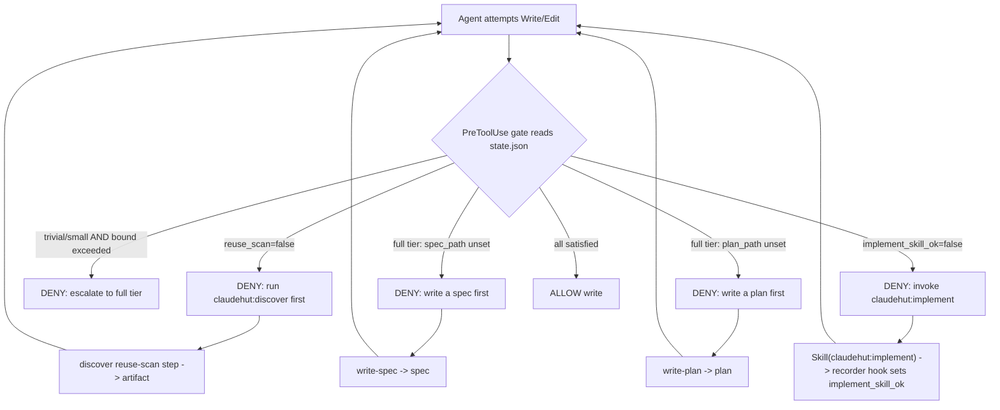

# ClaudeHut Design — 01. Agentic Workflow

> Part of the **ClaudeHut** design document set. See [README](./README.md) for the index. Terms are defined in [00. Overview §6](./00-overview.md#6-glossary-canonical-terms).
> **Status:** Design v1 · **Pillar focus:** P1 (workflow core), P4 (think-and-reuse). **This is the centerpiece document.**

The Workflow is the plugin. Everything else — agents, skills, rules, hooks, memory, MCP — exists to drive the agent through these phases and to make skipping a phase structurally hard. This document defines the **prerequisite** (codebase indexing), the **seven phases** (Discover → Brainstorm → Spec → Plan → Implement → Review → Learn), the **enforcement loop** that auto-binds skills and auto-loads rules at each phase, the authoritative **phase-state schema**, and how each phase's behavior is carried **natively inside the skill/agent markdown** so handoff needs no external orchestration.

## Table of Contents

- [1. The loop at a glance](#1-the-loop-at-a-glance)
- [2. Design principle: enforcement over instruction](#2-design-principle-enforcement-over-instruction)
- [3. Prerequisite: the codebase index (not a phase)](#3-prerequisite-the-codebase-index-not-a-phase)
- [4. The phase-state machine](#4-the-phase-state-machine)
- [5. The seven phases](#5-the-seven-phases)
- [6. The enforcement loop (how each phase is auto-enforced)](#6-the-enforcement-loop-how-each-phase-is-auto-enforced)
- [7. The enforcement set: applying the 1% rule](#7-the-enforcement-set-applying-the-1-rule)
- [8. The Review loop and its exit condition](#8-the-review-loop-and-its-exit-condition)
- [9. Native handoff: flow lives inside the skill/agent markdown](#9-native-handoff-flow-lives-inside-the-skillagent-markdown)
- [10. Think-and-reuse: the hard gate](#10-think-and-reuse-the-hard-gate)
- [11. Worked example](#11-worked-example)
- [12. Escape hatches](#12-escape-hatches)

---

## 1. The loop at a glance



The Workflow runs **per task** (one user request = one pass) against an **already-indexed** codebase ([§3](#3-prerequisite-the-codebase-index-not-a-phase)). Phases are sequential; the **Discover→Implement** path includes a hard action gate (no new code until reuse-scan exists; spec + plan also required for the `full` tier) and **Review** is a hard completion gate that loops back to Implement until nothing applicable is left unsatisfied.

> **Phase 0 — Complexity triage.** Before entering Discover, assess the request and set the tier (`trivial` / `small` / `full`, default `full`) via `claudehut-state set-complexity`. Trivial/small fast lanes skip the deliberation phases (Brainstorm/Spec/Plan) but **never skip the safety rails** (Discover reuse-scan, test-first via the implement skill rail, Review). The write gate verifies the tier's bound deterministically — a fast-lane write that grows past the bound (>2 files or a security/auth/migration path) is denied, telling the agent to escalate to `full`. See Phase 1 (Discover) in §5 below and the tier table in the `claudehut-workflow` skill.
>
> **Fast-path latency contract (Issue 2 — v0.4).** Measured floor: one 2-subagent dispatch ≈ 26s; the pre-fix `small` path cost ≥5 subagent round-trips for a ≤2-file change. The tiers therefore swap dispatches for inline work where a deterministic rail keeps it safe: **trivial** = inline Discover (≤3 Greps + inline reuse-scan artifact, 0 dispatches — the gate still requires the artifact + the implement skill rail), Review reduced to test-runner + reviewer (security-auditor skip is **gate-backed**: `fastlane_bound_ok` already denied any security/auth/migration path in the fast lane), no Learn. **small** = full Discover dispatch; security-auditor skip gate-backed as above; Learn may be a one-line inline record when nothing novel surfaced (the Stop gate checks content, not author). **full** = everything dispatches, security-auditor over-includes.
>
> **Why Discover is a separate phase (v0.4 decision).** Exploration + reuse-scan are _discovery_, not _ideation_ — folding them into Brainstorm over-fit Brainstorm to a single stack and killed creative breadth. Discover does the grounding; Brainstorm (phase 2) then ideates freely on top of it. Codebase indexing remains a Bootstrap prerequisite (built once, refreshed on demand), not a per-task phase.

## 2. Design principle: enforcement over instruction

The research is unambiguous (see superpowers): **telling** an agent to follow a process is unreliable; the agent rationalizes its way out ("this is simple", "I'll review after", "let me just edit the file first"). ClaudeHut therefore encodes the process three ways, in increasing strength:

1. **Instruction** — the orchestrator skill describes the phases (weakest; the agent _can_ ignore it).
2. **Intra-turn ordering** — phase skills carry Iron Laws + rationalization tables that order actions within a single turn (e.g. reuse-scan before new code). See [04. Skills](./04-skills.md).
3. **Hard gates** — hooks that _block_ a tool call or a turn-end until a precondition holds. These cannot be rationalized away because they are deterministic code, not model judgment. See [06. Hooks](./06-hooks.md).

The honest scope of each gate type (do not overclaim):

| Mechanism                                       | What it can enforce                                                                | What it cannot enforce                                                                                                                      |
| ----------------------------------------------- | ---------------------------------------------------------------------------------- | ------------------------------------------------------------------------------------------------------------------------------------------- |
| `PreToolUse` hook → `permissionDecision:deny`   | Block a specific _action_ (e.g. Write/Edit) until a precondition file exists       | Force the agent to _think_; it only blocks the keystroke                                                                                    |
| `Stop` / `SubagentStop` hook → `decision:block` | Block _turn completion_ — "you may not stop until Review passes and Learn is done" | Mid-turn phase ordering; and it is capped (`stop_hook_active`, ~8 consecutive blocks) — see [§8](#8-the-review-loop-and-its-exit-condition) |
| Skill Iron Law text                             | Intra-turn ordering and discipline                                                 | Anything across turns — it lives in context, not in code                                                                                    |
| `SessionStart` hook → `additionalContext`       | Guarantee the orchestrator + learnings + plugin-detection load before turn 1       | Anything after the first turn                                                                                                               |

## 3. Prerequisite: the codebase index (not a phase)

Before the Workflow can adapt a solution to _this_ codebase, the codebase must be indexed. **Indexing is a Bootstrap prerequisite, established once and refreshed on demand — it is never a workflow phase.**

The index has two tiers, both consumed (never produced) by the Workflow:

| Tier                          | Built by                                                                                           | Native mechanism                                                          | Content                                                                                       |
| ----------------------------- | -------------------------------------------------------------------------------------------------- | ------------------------------------------------------------------------- | --------------------------------------------------------------------------------------------- |
| **Base index (always)**       | `claudehut-init` at Bootstrap ([07 §3](./07-memory-architecture.md#3-bootstrapping-a-new-project)) | generated Project memory under `${CLAUDE_PROJECT_DIR}/.claude/claudehut/` | `reuse-index.json` (reusable components + signatures) + `architecture.md` (layer/package map) |
| **Graph index (conditional)** | the `understand-anything` plugin, **only if enabled**                                              | that plugin's own skills/MCP                                              | a queryable knowledge graph for richer explore/query/search                                   |

**Detecting the conditional tier — natively honest.** There is **no native runtime field** by which one plugin branches on whether another is installed (`dependencies` is install-time coupling only). So the `bootstrap.sh` `SessionStart` hook ([06](./06-hooks.md)) reads `enabledPlugins` from settings (or shells `claude plugin list`) and injects an `additionalContext` flag: _"understand-anything is enabled → Discover MUST use its query/search skills"_ or _"not enabled → use `claudehut-explorer` + Grep."_ The `discover` skill body branches on that injected flag. ClaudeHut does **not** declare `understand-anything` as a `dependencies` entry (that would hard-require it).

Per-task _querying_ of the index happens inside **Discover** as steps driven by the `discover` skill / `claudehut-explorer` + `claudehut-reuse-scanner` agents ([03](./03-agents.md)). Keep the distinction sharp: **indexing = prerequisite (Bootstrap); per-task grounding + reuse-scan = Discover (phase 1).**

## 4. The phase-state machine

The single source of truth for "where are we" is the **Phase-state file**, written **per session** at `${CLAUDE_PROJECT_DIR}/.claude/claudehut/state/<session_id>.json` (the per-session path is the collision-safe fix — see [§4.1](#41-concurrency-and-worktree-isolation-collision-safe-state)). Throughout these docs "state.json" is shorthand for this per-session file. **This schema is authoritative; [06. Hooks](./06-hooks.md) and [09. Plugin Structure](./09-plugin-structure.md) cite it literally.**

```json
{
  "session": "<session_id>",
  "task": "add idempotency key to PaymentController",
  "phase": "implement",
  "complexity": "full",
  "reuse_scan": true,
  "reuse_scan_artifact": ".claude/claudehut/tasks/0007-payment-idempotency/reuse-scan.md",
  "enforcement_set": {
    "skills": ["implement", "review"],
    "rules": ["controller.md", "persistence.md", "testing.md", "caching.md"]
  },
  "spec_path": ".claude/claudehut/tasks/0007-payment-idempotency/spec.md",
  "plan_path": ".claude/claudehut/tasks/0007-payment-idempotency/plan.md",
  "review": "pending",
  "outstanding": [],
  "bypass": false,
  "implement_skill_ok": true,
  "updated_by": "claudehut-state",
  "ts": "2026-06-02T10:31:00Z"
}
```

Field semantics:

| Field                               | Meaning                                                                                                                                                                                                                                                                                                                                                                                             | Set during                            |
| ----------------------------------- | --------------------------------------------------------------------------------------------------------------------------------------------------------------------------------------------------------------------------------------------------------------------------------------------------------------------------------------------------------------------------------------------------- | ------------------------------------- |
| `session`                           | the session id this state belongs to (also encoded in the filename) — the per-session key that isolates concurrent tasks ([§4.1](#41-concurrency-and-worktree-isolation-collision-safe-state))                                                                                                                                                                                                      | created at first transition           |
| `phase`                             | one of `discover` \| `brainstorm` \| `spec` \| `plan` \| `implement` \| `review` \| `learn`; **default `discover`**                                                                                                                                                                                                                                                                                 | every transition                      |
| `complexity`                        | `trivial` \| `small` \| `full`; **default `full`**; set by `set-complexity` at Phase 0 triage                                                                                                                                                                                                                                                                                                       | Phase 0 (triage)                      |
| `reuse_scan`                        | reuse scan complete + artifact written                                                                                                                                                                                                                                                                                                                                                              | **Discover** (required in every tier) |
| `enforcement_set.skills` / `.rules` | the applicable skills/rules at ≥1% match — the checklist Review audits ([§7](#7-the-enforcement-set-applying-the-1-rule))                                                                                                                                                                                                                                                                           | Brainstorm                            |
| `spec_path`                         | the implementation spec exists                                                                                                                                                                                                                                                                                                                                                                      | Spec (full tier only)                 |
| `plan_path`                         | the executable plan exists                                                                                                                                                                                                                                                                                                                                                                          | Plan (full tier only)                 |
| `review`                            | `pending` \| `pass` \| `capped` — pass only when `outstanding` is empty and evidence is green                                                                                                                                                                                                                                                                                                       | Review                                |
| `outstanding`                       | applicable-but-unsatisfied {skills ∪ rules ∪ memory} items from the auditors                                                                                                                                                                                                                                                                                                                        | Review (each iteration)               |
| `bypass`                            | senior override; disables the gate hooks for the session                                                                                                                                                                                                                                                                                                                                            | manual                                |
| `implement_skill_ok`                | **skill rail (Issue 1):** `claudehut:implement` was invoked for the _current task_ — set **only** by `record-skill.sh` (the `PreToolUse(Skill)` recorder hook, via `mark-skill`), reset to `false` by `set-phase discover\|brainstorm` / `mark-skill discover\|brainstorm` (the per-task boundary). `gate-write.sh` denies production writes in **every tier** until it is `true`. Default `false`. | Implement (via the Skill call itself) |

**Who writes it (critical, per native constraints):** a skill _cannot_ reliably persist state on its own — skill text only lives in context. So the **only writer** is the `bin/claudehut-state` command, which the orchestrator and phase skills instruct the agent to run on each transition, e.g.:

```
claudehut-state --session ${CLAUDE_SESSION_ID} set-enforcement --skills implement,review --rules controller.md,persistence.md,testing.md,caching.md
claudehut-state --session ${CLAUDE_SESSION_ID} set-spec .claude/claudehut/tasks/0007-payment-idempotency/spec.md
claudehut-state --session ${CLAUDE_SESSION_ID} set-review pass        # only after outstanding == []
```

The skill body passes `${CLAUDE_SESSION_ID}` (a native skill string-substitution) so the writer targets the correct per-session file; gate hooks derive the same path from the `session_id` field in their hook-input JSON ([§4.1](#41-concurrency-and-worktree-isolation-collision-safe-state)). Subcommands: `set-phase`, `set-reuse-scan`, `set-enforcement`, `set-spec`, `set-plan`, `set-review`, `set-outstanding`, `set-bypass`, `set-complexity`, `mark-skill` (all take `--session`). **Hooks only read the state file; they never write it** — with one deliberate exception: `record-skill.sh` (the `PreToolUse(Skill)` recorder) _calls the writer_ (`claudehut-state mark-skill`) rather than writing the file itself, preserving the single-writer invariant while letting the skill rail be armed by the actual Skill tool call instead of by model cooperation. This separation is what makes the gates deterministic.

```mermaid
stateDiagram-v2
    [*] --> Discover: codebase index ready (prerequisite); complexity tier set
    Discover --> Brainstorm: reuse_scan=true (full tier)
    Discover --> Implement: reuse_scan=true (trivial/small fast lane)
    Brainstorm --> Spec: enforcement_set determined
    Spec --> Plan: spec_path set (approach approved)
    Plan --> Implement: plan_path set (full tier)
    note right of Implement
        write gate opens only when implement_skill_ok=true —
        i.e. Skill(claudehut:implement) was INVOKED for this task
        (recorded by the PreToolUse(Skill) hook; reset each new task)
    end note
    Implement --> Review: implementation complete
    Review --> Implement: outstanding not empty
    Review --> Learn: review=pass (outstanding empty, evidence green)
    Learn --> [*]: turn may end (Stop-gate satisfied)
```



### 4.1 Concurrency and worktree isolation (collision-safe state)

**The risk.** ClaudeHut runs subagents with `isolation: worktree` and can run several tasks at once. A _single_ project-wide `state.json` would be shared across all of them and could be clobbered.

**Verified native behavior (with citations):**

| Fact                                                                                                                                            | Source                                                    | Status                                                                                  |
| ----------------------------------------------------------------------------------------------------------------------------------------------- | --------------------------------------------------------- | --------------------------------------------------------------------------------------- |
| `isolation: worktree` gives each subagent its **own** temporary git worktree (separate working dir), auto-created and auto-removed if unchanged | `code.claude.com/docs/en/worktrees.md`, `…/sub-agents.md` | ✅ documented                                                                           |
| `${CLAUDE_PROJECT_DIR}` is "**the project root**" and is exported to hooks/MCP/LSP processes                                                    | `…/hooks.md`                                              | ✅ documented                                                                           |
| Whether `${CLAUDE_PROJECT_DIR}` is **remapped to the worktree** inside a worktree subagent (vs. staying pinned to the main repo root)           | —                                                         | **[uncertain]** — docs say "project root" but do not state worktree behavior explicitly |
| Hook input JSON carries `cwd` (the actual working dir — the worktree path inside a worktree subagent) and `session_id`                          | `…/hooks.md`                                              | ✅ documented                                                                           |
| Subagents/background sessions run **concurrently**; subagents inherit the **parent `session_id`** (+ own `agent_id`)                            | `…/sub-agents.md`                                         | ✅ documented                                                                           |
| Any native file-locking / atomic-write / race guidance for shared files outside the worktree                                                    | —                                                         | **[NOT IN DOCS]** — ClaudeHut must provide its own                                      |

**The design invariant that makes the fix correct (stated, not assumed):** _in ClaudeHut, exactly one component writes state per session — the main thread, via `claudehut-state`. Every subagent (explorer, scanner, brainstormer, planner, implementer, the Review auditors, learner) is **read-only with respect to state**; it returns artifacts and the main thread records the transition. Concurrent workflows therefore run as **separate sessions**, each with a distinct `session_id`._ (If a future variant ran multiple independent full workflows inside one session — e.g. an agent-team where each teammate drives its own workflow — session-keying would be insufficient and state would have to be keyed off the per-worktree `cwd` instead; ClaudeHut's roster does not do this.)

**The fix — per-session state + atomic write:**

1. **Per-session path:** `…/.claude/claudehut/state/<session_id>.json`. The writer derives `<session_id>` from `${CLAUDE_SESSION_ID}`; gate hooks derive it from the hook-input `session_id`. Concurrent workflows = distinct sessions = distinct files → **no clobber**.
2. **Atomic write:** `claudehut-state` writes a temp file and `rename()`s it into place (atomic on POSIX), so a concurrent hook read never sees a torn file.

**Both-cases-safe under the `[uncertain]` items:**

- _If `${CLAUDE_PROJECT_DIR}` stays pinned to the main root_ (the "project root" reading): all agents resolve the same `state/<session_id>.json`, and per-session keying prevents cross-task collision on that shared directory. ✅
- _If `${CLAUDE_PROJECT_DIR}` remaps to the worktree_: each worktree already has an isolated `.claude/claudehut/`, so state is isolated regardless. ✅
- _Writer/reader key agreement_ — `${CLAUDE_SESSION_ID}` (skill substitution) and the hook-input `session_id` are both "the current session id"; the docs describe each as such but **do not explicitly state they are byte-identical** → **[uncertain]**. **Failure direction, stated honestly:** the gate hooks **fail open** on a missing state file (they `allow`/don't-block — [06 §5](./06-hooks.md#5-failure-modes-and-escape-hatches)), so a key mismatch would _silently disable enforcement_ rather than wedge the user. Because the enforcement-critical gates (the main-thread `Stop` completion gate and the pre-dispatch `PreToolUse` gate) run **on the main thread** — same session as the writer — they agree by construction; the only fail-open exposure is a worktree subagent's own `PreToolUse`, which is non-critical (the main thread already cleared the gate before dispatching it). The build roadmap's gate tests ([10](./10-build-roadmap.md)) must assert writer/reader key agreement so this can never regress silently.

**Native worktree isolation: `baseRef=head` base and no auto-merge.** Two additional verified behaviors (relevant to the parallel-implementer feature, documented in [11 §6](./11-execution-model-and-artifacts.md#6-parallel-execution--worktree-lifecycle)):

| Fact                                                                                                                                                                                                                                                                                                  | Consequence                                                                                                                                                                                                                                                                                                       |
| ----------------------------------------------------------------------------------------------------------------------------------------------------------------------------------------------------------------------------------------------------------------------------------------------------- | ----------------------------------------------------------------------------------------------------------------------------------------------------------------------------------------------------------------------------------------------------------------------------------------------------------------- |
| `isolation: worktree` forks from the **current branch HEAD** — ClaudeHut sets `worktree.baseRef=head` (via `claudehut-init`) so **committed prior-phase code IS present** inside the worktree (the default `origin/HEAD` base hid in-session commits and forced dependent phases inline — v0.4.0 fix) | A later phase's implementer builds on earlier phases' committed work. Only **uncommitted** main-tree files (in-flight plan.md/spec.md, state) are invisible, so the dispatch prompt carries plan rows verbatim ("content-in-prompt rule"), and each phase must be **committed before the next phase dispatches**. |
| Native provides no auto-merge — a worktree with commits persists after the subagent exits                                                                                                                                                                                                             | The main thread must merge each agent branch explicitly via `bin/claudehut-worktree reconcile`, then `sweep` to remove merged/clean worktrees. Without this helper, used agent branches accumulate as orphans.                                                                                                    |

These two facts extend — and do not contradict — the existing per-session state isolation design: state is still the main thread's exclusive write domain (each session writes its own file), and the implementer is still read-only with respect to state. Even with `baseRef=head`, `state/` is **uncommitted** (gitignored) so it is never carried into a worktree — reinforcing "subagents are read-only w.r.t. state": there is nothing to accidentally write to.

**Reconciliation after a worktree merges.** None is needed for state: `state/<session_id>.json` is **ephemeral workflow position, gitignored, never merged back**. A worktree merge carries only **code**; native provides no auto-merge, so `bin/claudehut-worktree reconcile` fills that gap (serialized, one branch per call, with conflict-abort and red-test rollback — see [11 §6](./11-execution-model-and-artifacts.md#6-parallel-execution--worktree-lifecycle)). The durable, team-shared artifacts live at the project root and are written by the main thread at low-frequency phase boundaries, with concurrency-safe writes:

| Durable shared file                                                  | Write pattern under concurrency                                                                                                                           |
| -------------------------------------------------------------------- | --------------------------------------------------------------------------------------------------------------------------------------------------------- |
| `tasks/NNNN-<slug>/reuse-scan.md`, `spec.md`, `plan.md`, `review.md` | per-task directories → no collision                                                                                                                       |
| `learnings.jsonl`                                                    | one JSON object per line, appended with a single atomic `O_APPEND` write (safe for line-sized records); the learner's dedup tolerates interleaved appends |
| `reuse-index.json`                                                   | atomic temp+`rename()` (last-writer-wins); **advisory** — Discover re-scans the project each task, so a lost update is non-fatal                          |

## 5. The seven phases

Each phase lists: **goal**, **bound skills**, **bound agents**, **rules that auto-load**, **artifact(s)**, and **exit gate**. The full cross-reference matrix lives in [02. Architecture §4](./02-architecture.md#4-the-master-matrix).

### Phase 1 — Discover _(NEW in v0.4)_

- **Goal:** ground the task in **this codebase** and settle the reuse question before any ideation. Runs explorer ∥ reuse-scanner concurrently, produces the **Reuse-scan artifact**, and arms the write gate. This phase was split out of Brainstorm (v0.4 decision reversal): exploration + reuse-scan are _discovery_, not _ideation_ — folding them into Brainstorm over-fit it and killed creative breadth.
- **Skills:** `discover` (runs inline on the main thread; carries the Reuse Iron Law; required in **every complexity tier** — the fast lane never skips it).
- **Agents:** `claudehut-explorer` and `claudehut-reuse-scanner`, dispatched **concurrently in one message** (their inputs are independent). Explorer maps the codebase; reuse-scanner writes the artifact.
- **Artifacts:** the **Reuse-scan artifact** at `.claude/claudehut/tasks/NNNN-<slug>/reuse-scan.md` (FOUND/none + DECISION: adopt/extend/new + justification); `state.json.reuse_scan = true` (flipped by main thread via `set-reuse-scan`).
- **Exit gate:** `reuse_scan=true` AND artifact file exists under `.claude/claudehut/`. **Required next:** `claudehut:brainstorm` (full tier) or directly to Implement (trivial/small fast lane).

### Phase 2 — Brainstorm _(formerly Phase 1)_

- **Goal:** **generic, domain-agnostic ideation** — turn a grounded problem into **≥2 genuinely distinct, well-reasoned approaches** and a recommendation. Consumes Discover's context + reuse DECISION. **Does NOT explore the codebase or run a reuse-scan** — that is Discover's job (v0.4 reversal). Then **determine the enforcement set**: which skills and rules the agent MUST honor during Implement and Review, applying the 1% rule ([§7](#7-the-enforcement-set-applying-the-1-rule)). The enforcement set is also the **primary source for dynamic reviewer selection** in Review.
- **Skills:** `brainstorm` (runs inline on the main thread; dispatches `claudehut-brainstormer`; owns the approval gate and the `set-enforcement` write).
- **Agents:** `claudehut-brainstormer` (generic ideation; consumes Discover's output; returns ≥2 distinct options + enforcement set candidate).
- **Artifacts:** ≥2 candidate approaches + tradeoffs + a recommendation; the **enforcement set** recorded via `claudehut-state set-enforcement`.
- **Exit gate:** enforcement set determined. The recommended approach is presented for approval (the superpowers design-gate principle); in interactive use the human confirms before Spec, in autonomous use the agent records its choice and rationale.
- **Fast lane:** skipped in `trivial` and `small` tiers.

### Phase 3 — Spec _(formerly Phase 2, originally "Decide")_

- **Goal:** produce the **implementation spec** — the chosen approach, acceptance criteria, the interfaces/contracts it touches, and the **enforcement manifest** (the applicable skills/rules/memory carried forward to Review). Framing the decision as a _specification_ aligns with the core principle: the spec is the contract the implementation and Review are measured against.
- **Skills:** `write-spec`.
- **Agents:** none required — Spec is a main-thread act, informed by `brainstorm` output and the Vocabulary lock.
- **Artifact:** `.claude/claudehut/tasks/NNNN-<slug>/spec.md` (context · chosen approach · acceptance criteria · enforcement manifest · alternatives rejected). `state.json.spec_path` set **only after user approval** (via `AskUserQuestion`; non-interactive `-p` run records a draft note and proceeds). The spec **subsumes the old ADR** — rationale for the choice lives in the spec.
- **Exit gate:** spec approved and `spec_path` set.
- **Fast lane:** skipped in `trivial` and `small` tiers.

### Phase 4 — Plan _(formerly Phase 3)_

- **Goal:** turn the spec into an executable, file-level plan (ordered steps, files to touch, tests to write first, verification commands per task).
- **Skills:** `write-plan` (runs inline on the main thread; dispatches `claudehut-planner` via the Agent tool to draft the plan, then owns the approval gate and the state write).
- **Agents:** `claudehut-planner`.
- **Artifact:** a plan file at `.claude/claudehut/tasks/NNNN-<slug>/plan.md` (T-xxx breakdown table, decision summary, deps); `state.json.plan_path` set **only after user approval** (via `AskUserQuestion`). On approval the main thread also calls `TaskCreate` per T-xxx row and wires `addBlockedBy` from the Depends-on column (native task list = per-session live mirror; `plan.md` = durable source of truth).
- **Exit gate (HARD):** `plan_path` must be set before any Write/Edit — enforced by the `PreToolUse` write gate in the `full` tier ([§10](#10-think-and-reuse-the-hard-gate)).
- **Fast lane:** skipped in `trivial` and `small` tiers.

### Phase 5 — Implement _(formerly Phase 4)_

- **Goal:** execute the plan **test-first**, honoring **every skill and rule in the enforcement set** plus the project's conventions and vocabulary.
- **Skills:** `implement` (carries the TDD Iron Law: no production code without a failing test; deep tech-stack playbooks live in `implement`'s `references/`). **Tier-aware preconditions:** `reuse_scan=true` is required in every tier; `spec_path` + `plan_path` required only in the `full` tier. The write gate verifies the fast-lane bound deterministically (≤2 files, no security/auth/migration path).
- **Agents:** `claudehut-implementer` (optionally `isolation: worktree` for risky multi-file changes). Its **static** `skills:` frontmatter preloads a **fixed core** (`implement`) — frontmatter cannot hold a runtime list. The **per-task enforcement set** is passed in the **dispatch prompt** the main thread writes when calling the Agent tool, and the tech-stack standards **auto-load as path-scoped rules** as the agent touches matching files.
- **Rules auto-loaded (path-scoped):** `*Controller.java` → controller rules; `*Repository.java`/`*Entity.java` → persistence rules; `*Test.java` → testing rules; `*Redis*.java`/`*Cache*.java` → caching rules; etc. See [05. Rules](./05-rules.md).
- **Artifact:** code + tests; `state.json.phase = "implement"`. The main thread calls `TaskUpdate in_progress` before each step starts and `TaskUpdate completed` once its verify command passes (sourced from the implementer's per-step report).
- **Exit gate:** none here (Review is the gate).

### Phase 6 — Review _(formerly Phase 5, originally "Verify")_

- **Goal:** the **main thread spawns dynamically selected auditor subagents** that enforce the rules, skills, and memory from **both the plugin and the project** to verify/review/audit the implemented task, confirming **full compliance** with every applicable item. This is a **loop** ([§8](#8-the-review-loop-and-its-exit-condition)).
- **Skills:** `review` (runs **inline on the main thread** — it must spawn subagents, and a subagent cannot spawn subagents; carries the completion Iron Law and the test-matrix for applicable tech stacks).
- **Agents (dynamically selected from the roster of five):** `claudehut-test-runner` + `claudehut-reviewer` always; `claudehut-security-auditor` unless confident no security surface; `claudehut-perf-reviewer` if perf/query/reactive impact; `claudehut-db-reviewer` if entity/repo/migration impact. A no-DB change does **not** spawn db-reviewer. See `skills/review/SKILL.md` for the full selection table.
- **Artifact:** `.claude/claudehut/tasks/NNNN-<slug>/review.md` (per-auditor findings with citations + test evidence + outstanding items resolved across loops + final verdict); `state.json.review = "pass"` only when `outstanding == []` and evidence is green.
- **Exit gate (HARD):** the `Stop` hook blocks turn completion until `review == "pass"` **and** Learn has run; failures loop back to Implement. The loop honors the native Stop-cap (`stop_hook_active`) — see [§8](#8-the-review-loop-and-its-exit-condition).

### Phase 7 — Learn _(formerly Phase 6)_

- **Goal:** persist what was learned so the next session is smarter; update the Reuse index with anything newly built.
- **Skills:** `capture-learnings`.
- **Agents:** `claudehut-learner` (carries `memory: project` for native auto-memory).
- **Artifact:** new/updated records in `learnings.jsonl`; narrative appended to native auto-memory; `reuse-index.json` updated; `state.json.phase = "learn"`.
- **Exit gate:** Learn complete → the `Stop` hook now permits turn end. See [07. Memory](./07-memory-architecture.md).
- **Fast lane:** skipped in `trivial` tier; runs in `small` and `full` tiers.

## 6. The enforcement loop (how each phase is auto-enforced)

This is the mechanism the acceptance criteria require — "explicit phases plus the skill-enforcement and rule-loading mechanism."



The loop is self-correcting: when the agent tries to shortcut (jump to Write, or stop early), a hook bounces it back with `additionalContext`/`reason` naming exactly what is missing.

**Skill auto-binding (by `description`) vs rule auto-loading (by `paths:`).** Two distinct native mechanisms:

- **Skills** auto-load when their `description` ("what + when") matches; the orchestrator skill's phase→skill table tells the agent which to reach for. Enforcement skills (`discover`, `implement`, `review`) carry Iron-Law bodies so once loaded they constrain ordering.
- **Rules** in `${CLAUDE_PROJECT_DIR}/.claude/rules/*.md` carry `paths:` globs and load **deterministically** the moment the agent touches a matching file — no model decision. Because rules are project-generated, the same plugin loads different rules per project (P3). See [05. Rules](./05-rules.md).

## 7. The enforcement set: applying the 1% rule

**Brainstorm's** job is to decide **which skills and rules the agent will enforce** during Implement and Review (Discover handles the codebase grounding and reuse-scan; Brainstorm consumes that and produces ideation + the enforcement set). The selection principle is the Superpowers rule, applied verbatim:

> **"If you think there is even a 1% chance a skill might apply to what you are doing, you ABSOLUTELY MUST invoke the skill."**

So Brainstorm scans the plugin's skills and the project's rules and lists **every item with a ≥1% match** to the task. That list — the **enforcement set** — is recorded via `claudehut-state set-enforcement` and carried into the spec.

**What it is, and what it is NOT (native honesty, per P6).** The enforcement set is an **auditable checklist**, not a new enforcement engine:

- Rules still auto-load by `paths:`; skills still trigger by `description`. The set does not change those native mechanisms.
- Its job is to make applicability **explicit and reviewable**: during Implement the set's skills stay active (a fixed core via the implementer's static `skills:` preload, with tech-stack standards auto-loading as path-scoped rules), and **Review audits against the set** — every listed item must be confirmed satisfied before `review=pass`. The set never overrides `skills:` frontmatter (a static field); it is a checklist, not a preload mechanism.
- It is the bridge between "the 1% rule says this applies" (Brainstorm) and "prove it was satisfied" (Review).



## 8. The Review loop and its exit condition

Review is not a single pass — it **loops until full compliance**, honoring a real native limit.

**The loop (driven inline from the main thread, because subagents cannot spawn subagents):**

1. `review` (main thread) spawns the auditor subagents in parallel via the Agent tool. Each auditor enforces one lens against the enforcement set + project memory and returns its **outstanding items** (applicable skills/rules/memory not yet satisfied, with evidence).
2. The merged `outstanding` set is written via `claudehut-state set-outstanding`.
3. If `outstanding` is non-empty → fix (loop back to Implement or fix inline) → re-spawn auditors.
4. If `outstanding == []` **and** fresh test evidence is green → `claudehut-state set-review pass`.

**Exit condition (explicit):**

> Review exits when **`outstanding == []` AND fresh evidence is green** → `review=pass`. **OR** the native Stop-cap is reached (`stop_hook_active`; Claude Code blocks at most ~8 consecutive `Stop` hooks) → the `gate-done.sh` hook degrades gracefully: it stops blocking, marks `review` as `capped`, and **surfaces the remaining `outstanding` items to the user** rather than wedging the session.



This keeps correction 4 honest: "loop until zero applicable rules/memory unsatisfied" is the _goal_, and the cap is the _native ceiling_ that prevents an infinite block.

## 9. Native handoff: flow lives inside the skill/agent markdown

Per correction 5, **each phase's conventions, instructions, and flow are encoded inside the skill/agent markdown files themselves** — so the main agent and subagents receive context natively and execute the flow natively, with no orchestration in prose outside the files. Three native mechanisms carry this:

1. **The orchestrator skill** (`claudehut-workflow`) is injected at `SessionStart` via `additionalContext`, so the phase→skill map and the skill-first + 1% laws are in context before turn 1.
2. **Each phase skill's SKILL.md body** carries: an **announcement**, the **flow steps**, its **Iron Law** (if any), and a **`REQUIRED NEXT`** pointer naming the next skill — the superpowers self-driving pattern. The model auto-loads the body when the `description` matches; the body then drives the phase and names its successor.
3. **Subagents receive the same context natively**: a subagent's `skills:` frontmatter **preloads the full skill bodies** into its context at startup, and the agent's own markdown body is its system prompt. So a forked auditor or implementer already "knows" the conventions and flow without any external handoff.

Skeleton of a phase skill (the flow is _in the file_, not in surrounding prose):

```markdown
---
name: write-spec
description: >
  Produce the implementation spec for the chosen approach (Spec phase). Use
  after Brainstorm, before Plan, when an approach has been selected. Records
  acceptance criteria and the enforcement manifest.
allowed-tools: "Read Grep Glob Write"
---

## Announce

State: "Using ClaudeHut write-spec (phase 2 — Spec)."

## Flow

1. Read the recommended approach + enforcement set from Brainstorm.
2. Write .claude/claudehut/tasks/NNNN-<slug>/spec.md: context, chosen approach,
   acceptance criteria, enforcement manifest (skills+rules), rejected alternatives.
3. Call AskUserQuestion for approval. Only after approval run: claudehut-state set-spec <path>

## REQUIRED NEXT

Invoke claudehut:write-plan. Do NOT write production code yet — the write gate is closed until a plan exists.
```

And the matching subagent carries its flow + preloaded skills natively:

```markdown
---
name: claudehut-implementer
description: Execute the plan test-first under the enforcement set. Use in the Implement phase for multi-file changes.
tools: Read, Edit, Write, Bash, Grep, Glob
skills: [implement] # full body preloaded into this subagent; carries TDD Iron Law + tech-stack playbooks
isolation: worktree
---

You implement the plan one step at a time. For every step: write the failing test
first (TDD Iron Law, carried by `implement`), then the minimal code, then refactor.
Honor every rule that auto-loads for the files you touch. Return: files changed + which
enforcement-set items you satisfied. REQUIRED NEXT (main thread): claudehut:review.
```

Note the implementer's `skills:` lists only the **fixed core** — it is static frontmatter. The **per-task enforcement set** is written into the dispatch prompt the main thread sends to the Agent tool; the static field cannot hold a runtime list ([§7](#7-the-enforcement-set-applying-the-1-rule)).

This pattern holds for **every phase**: Discover's `discover`, Brainstorm's `brainstorm`, Spec's `write-spec`, Plan's `write-plan`, Implement's `implement`, Review's `review`, and Learn's `capture-learnings` each carry their Announce → Flow → Iron Law → `REQUIRED NEXT` inside their own SKILL.md, and each phase agent's body carries its output contract. [03. Agents](./03-agents.md) and [04. Skills](./04-skills.md) show the per-component detail.

## 10. Think-and-reuse: the hard gate

Pillar P4 demands the agent think and reuse _before_ writing. The mechanism is a two-part gate:

1. **Discover produces a Reuse-scan artifact.** The reuse-scan step inside the `discover` skill (driven by `claudehut-reuse-scanner`) queries `reuse-index.json` and greps the project for existing services/utilities/configs that already solve the task — the smallest-footprint axis. The result ("adopt/extend X at `a/b/C.java`" or "nothing reusable, justification: …") is written to `.claude/claudehut/tasks/NNNN-<slug>/reuse-scan.md`, and `claudehut-state set-reuse-scan` flips `reuse_scan=true`. **Discover runs in every complexity tier — the fast lane never skips it.**
2. **The write gate refuses code until the prerequisites exist.** The `PreToolUse` hook on `Write|Edit|MultiEdit` reads `state.json`; if `reuse_scan` is false, it returns `permissionDecision: deny` in **every tier**. In the `full` tier, `spec_path` and `plan_path` must also be set. In `trivial`/`small` tiers, the gate additionally verifies the fast-lane bound deterministically (≤2 files, no security/auth/migration path) — exceed the bound and the gate denies, telling the agent to escalate to `full`.
3. **The skill rail (Issue 1) refuses code until the implement skill was actually invoked.** Artifacts alone are not enough — real usage measured **69% of tasks (11/16)** writing production code with every artifact in place but **zero `Skill(implement)` calls** (losing the Iron Law, the rules table, and the dispatch discipline in one skip). The gate therefore also requires `implement_skill_ok=true`, which only the `PreToolUse(Skill)` recorder hook sets when `claudehut:implement` genuinely fires, and which resets at every task boundary (`set-phase discover|brainstorm`).



The agent literally cannot create a new file until it has demonstrated it checked for reuse, specified the approach, and produced a plan. This converts P4 from a hope into a precondition — **provided the gate is armed**: the `PreToolUse` gate fails open on a missing state file, so the SessionStart hook now writes an initial state at turn 1 (opt #1) so the gate is live from the first keystroke. Without arming the claim held only once the agent voluntarily started the workflow (measured gap — EVAL-REPORT #2, now closed). The gate also requires the recorded reuse-scan/spec/plan **files to exist under `.claude/claudehut/`** (opt #4), not merely the state flags.

## 11. Worked example

> **Task:** "Add an idempotency key to `PaymentController.charge`."

1. **Discover** — `discover` runs inline: `claudehut-explorer` + `claudehut-reuse-scanner` are dispatched concurrently in one message. Explorer finds `PaymentController`, an existing `RequestKeyFilter`, and a Redis config. Reuse-scanner finds `RequestKeyFilter` already extracts idempotency keys → reuse-scan artifact records "extend `RequestKeyFilter`, back it with Redis." Main thread runs `set-reuse-scan`. `reuse_scan=true`.
2. **Brainstorm** — `brainstorm` dispatches `claudehut-brainstormer` with Discover's context + reuse DECISION. Brainstormer weighs filter vs interceptor vs annotation and recommends extending the filter (smallest footprint, best-practice, fits the reactive path). **Enforcement set** determined at ≥1% match: skills `[implement, review]`, rules `[framework/webflux.md, framework/redis.md, performance/caching.md, testing/junit5.md]` → `claudehut-state set-enforcement`.
3. **Spec** — `write-spec` produces `tasks/0007-payment-idempotency/spec.md`: chosen approach (extend `RequestKeyFilter`, Redis-backed store), acceptance criteria (duplicate request returns the cached response; key TTL 24h), enforcement manifest, rejected alternatives. User approves via `AskUserQuestion`; `spec_path` set.
4. **Plan** — `write-plan` dispatches `claudehut-planner`, which produces `tasks/0007-payment-idempotency/plan.md` with the T-xxx breakdown (failing `@SpringBootTest` first → Redis store → wire into the existing filter → black-box test). User approves; `plan_path` set; `TaskCreate` mirrors the T-xxx rows in the task panel.
5. **Implement** — agent attempts Write; the gate now allows (reuse-scan + spec + plan all exist; full tier). `claudehut-implementer` preloads `[implement]`; the TDD Iron Law (carried by `implement`) forces the failing test first; `framework/redis.md`/`performance/caching.md` rules auto-load on the relevant files.
6. **Review** — `review` (main thread) selects and spawns auditors: test-runner + reviewer always; security-auditor included (controller/auth surface). `claudehut-security-auditor` flags one outstanding item: "the idempotency key is user-spoofable" → loop back to Implement, scope the key to the authenticated principal → re-audit → `outstanding == []`, tests green → `review=pass`.
7. **Learn** — `claudehut-learner` records "this project does idempotency via filters, not interceptors" + "`RequestKeyFilter` is the reuse point" into `learnings.jsonl` and updates `reuse-index.json`. The `Stop` gate now permits turn end.

Next session, SessionStart injects that learning, so a future idempotency task starts already knowing the project's pattern.

## 12. Escape hatches

Enforcement must not become a cage. Native, auditable overrides:

- `/claudehut:phase <name> --force` runs `claudehut-state` to jump phases for trivial tasks; the override is recorded in `state.json.updated_by` for auditability.
- Hooks honor a `state.json.bypass = true` flag (set only via the explicit command) so a senior engineer can disable gates for a session.
- The Review loop's Stop-cap (`stop_hook_active`) is itself a safety valve — it surfaces remaining items rather than blocking forever ([§8](#8-the-review-loop-and-its-exit-condition)).
- Per the docs, gates are `PreToolUse`/`Stop` hooks; a user can always disable all hooks via `disableAllHooks` in settings — ClaudeHut does not fight that.

The default, however, is **gates on** — the plugin's value is the discipline.

---

**Prev:** [← 00. Overview](./00-overview.md) · **Next:** [02. Architecture →](./02-architecture.md)
