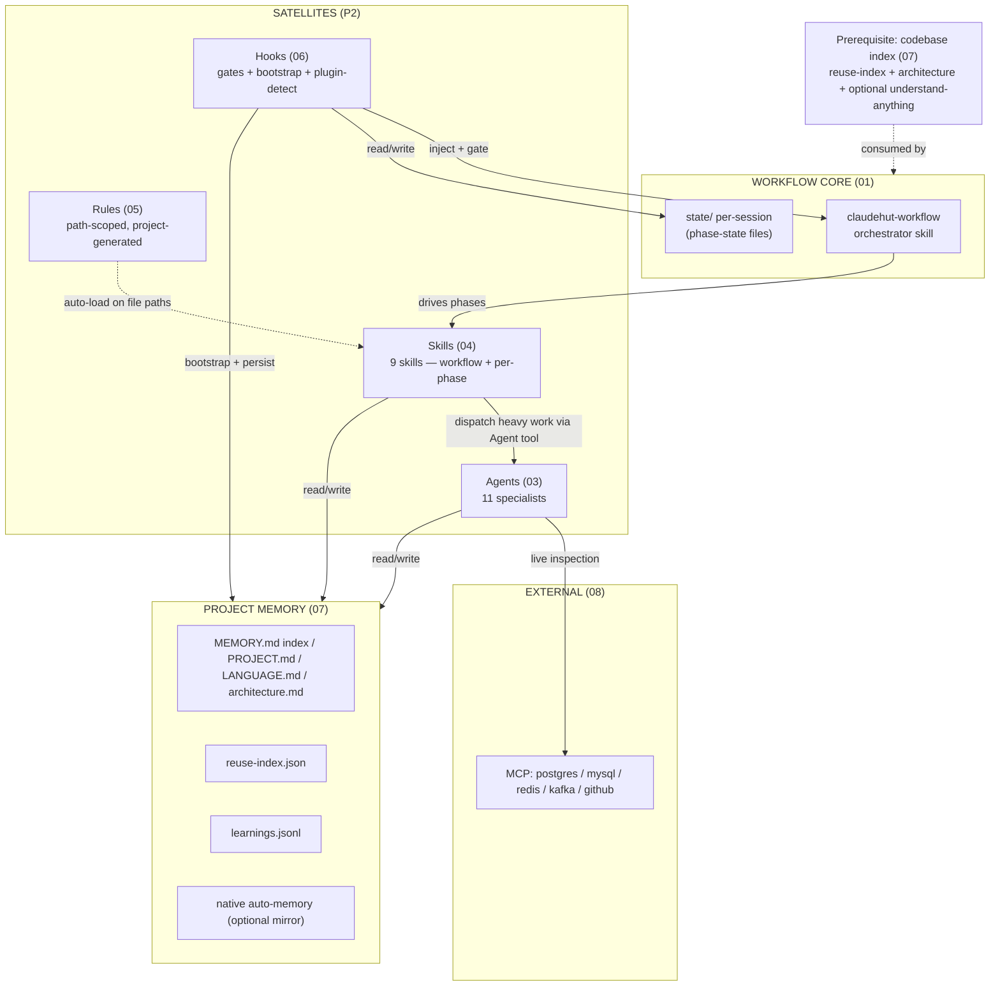
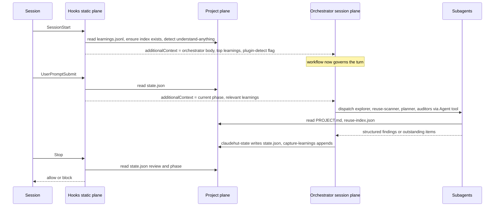

# ClaudeHut Design — 02. Architecture

> Part of the **ClaudeHut** design document set. See [README](./README.md). Terms: [00 §6](./00-overview.md#6-glossary-canonical-terms). Workflow: [01](./01-agentic-workflow.md).
> **Status:** Design v1 · **Pillar focus:** P2 (satellites), P6 (native integration).

This document is the **map**. It shows how the workflow core, the satellite components (agents/skills/rules/hooks), the project memory, and MCP interconnect, and it fixes the **master matrix** — the single authoritative table binding every component to a workflow phase and a native Claude Code mechanism. Documents [03](./03-agents.md)–[06](./06-hooks.md) each expand one slice of this matrix; they do not re-decide its rows.

## Table of Contents

- [1. Component map](#1-component-map)
- [2. The three planes](#2-the-three-planes)
- [3. Control flow: how a request moves through the planes](#3-control-flow-how-a-request-moves-through-the-planes)
- [4. The master matrix](#4-the-master-matrix)
- [5. Where each thing physically lives](#5-where-each-thing-physically-lives)
- [6. Native-mechanism rationale](#6-native-mechanism-rationale)
- [7. Coherence rules for the rest of the doc set](#7-coherence-rules-for-the-rest-of-the-doc-set)

---

## 1. Component map



## 2. The three planes

ClaudeHut is organised as three planes; understanding the split prevents category errors later.

| Plane | What it contains | Who can change it | Native basis |
|-------|------------------|-------------------|--------------|
| **Static plugin plane** | `plugin.json`, agents, skills, hook scripts, rule *templates*, `.mcp.json`, `bin/` | Plugin authors (read-only at runtime; replaced on update) | `${CLAUDE_PLUGIN_ROOT}` |
| **Project plane** | Generated `.claude/claudehut/` memory (incl. the codebase index), generated `.claude/rules/`, `@import`s into project `CLAUDE.md` | Bootstrap + the running agent | `${CLAUDE_PROJECT_DIR}`, CLAUDE.md hierarchy, `.claude/rules/` |
| **Session plane** | The loaded orchestrator skill, active phase skills, in-context rules, native auto-memory, the plugin-detection flag | Hooks (inject) + the model (load) | `SessionStart` `additionalContext`, skill progressive disclosure, auto-memory |

The plugin never writes to the static plane at runtime (it changes on update). All runtime state and learning live in the **project plane**, keyed to `${CLAUDE_PROJECT_DIR}` — which is exactly why "same plugin, different project" works (P3). The **codebase index** (the Workflow's prerequisite, [01 §3](./01-agentic-workflow.md#3-prerequisite-the-codebase-index-not-a-phase)) lives in the project plane too.

## 3. Control flow: how a request moves through the planes



Note that **subagents are dispatched only by the main thread** (the orchestrator), never by another subagent — a native constraint (see [§6](#6-native-mechanism-rationale)). This is why all phase skills run inline on the main thread.

## 4. The master matrix

**This table is authoritative.** Every satellite maps to exactly one primary phase and one native mechanism. Docs 03–06 expand the rows; they must not change the bindings. Phases are the seven of [01](./01-agentic-workflow.md): Discover · Brainstorm · Spec · Plan · Implement · Review · Learn (plus the Bootstrap prerequisite). (Anchor IDs are fixed here so cross-references resolve: e.g. [`claudehut-explorer`](./03-agents.md#claudehut-explorer).)

### 4.1 Agents — see [03](./03-agents.md)

| Component | Phase | Native mechanism | Trigger | Output |
|-----------|-------|------------------|---------|--------|
| `claudehut-explorer` | **Discover** | Subagent, `tools: Read,Grep,Glob,Bash`, read-only | dispatched by `discover` skill (concurrent with reuse-scanner in one message) | codebase query results, touch-points |
| `claudehut-reuse-scanner` | **Discover** | Subagent, `tools: Read,Grep,Glob` | dispatched by `discover` skill (concurrent with explorer in one message) | reuse-scan artifact |
| `claudehut-brainstormer` | Brainstorm | Subagent, `model: opus`, `effort: xhigh` | dispatched by `brainstorm` skill (after Discover output available) | ≥2 generic options + tradeoffs |
| `claudehut-planner` | Plan | Subagent, `tools: Read,Grep,Glob,Write` | invoked by `write-plan` skill | plan file |
| `claudehut-implementer` | Implement | Subagent, `skills:[implement]` preloaded (carries TDD Iron Law + tech-stack reference playbooks), `isolation: worktree` | dispatched for multi-file or `[P]` parallel changes | code + tests committed to worktree branch; returns `DONE (branch, commit)` |
| `claudehut-test-runner` | Review | Subagent, `tools: Bash,Read,Grep` | spawned by `review` skill | test results + outstanding items |
| `claudehut-reviewer` | Review | Subagent, read-only | spawned by `review` skill | general findings + outstanding items |
| `claudehut-security-auditor` | Review | Subagent, MCP-aware | spawned by `review` skill | OWASP/JWT findings + outstanding |
| `claudehut-perf-reviewer` | Review | Subagent, MCP-aware (DB) | spawned by `review` skill | JVM/query findings + outstanding |
| `claudehut-db-reviewer` | Review | Subagent, uses DB MCP | spawned by `review` skill | schema/JPA findings + outstanding |
| `claudehut-learner` | Learn | Subagent, `memory: project` | invoked by `capture-learnings` | learnings + reuse-index update |

### 4.2 Skills — see [04](./04-skills.md)

There is exactly **one skill per workflow phase** (plus two non-phase skills): **9 skills total** (7 phase + 2 orchestration). The principle: each phase has a single entry-point skill that owns its Iron Law and orchestrates any subagents it needs.

| Component | Phase | Native mechanism | Trigger | Enforcement |
|-----------|-------|------------------|---------|-------------|
| `claudehut-workflow` | all (meta) | Skill, injected via `SessionStart` | every session | establishes phases + skill-first + 1% laws; includes tier triage table |
| `claudehut-init` | Bootstrap (prerequisite) | Skill / `/claudehut:init` | new project / missing index | builds the codebase index + project memory + rules |
| `discover` | Discover | Skill, inline (main-thread); dispatches explorer ∥ reuse-scanner (one message) | before any new code (every tier) | Reuse Iron Law + reuse-scan artifact + `set-reuse-scan` |
| `brainstorm` | Brainstorm | Skill, inline (main-thread); dispatches brainstormer; consumes Discover output | full tier: after Discover | generic ideation — ≥2 options + enforcement set (drives dynamic reviewer selection) |
| `write-spec` | Spec | Skill | full tier: after approach chosen | writes the implementation spec |
| `write-plan` | Plan | Skill, inline (main-thread); dispatches planner via Agent tool; owns approval gate + state write + TaskCreate mirror | full tier: after the spec | writes plan file |
| `implement` | Implement | Skill, Iron Law (TDD); preloaded into `claudehut-implementer`; tier-aware preconditions | before writing prod code | no code without failing test; fast-lane bound verified by gate; tech-stack reference playbooks in `implement/references/` |
| `review` | Review | Skill, inline (main-thread), Iron Law | before any done-claim | **dynamically selects** auditors (test-runner + reviewer always; security/perf/db by enforcement-set + diff); loops until outstanding empty; persists `review.md` |
| `capture-learnings` | Learn | Skill, inline (main-thread); dispatches learner via Agent tool; owns state write | task end (full + small tiers) | appends learnings + updates reuse-index |

### 4.3 Rules (project-generated, path-scoped) — see [05](./05-rules.md)

Rules are generated into `.claude/rules/` by `claudehut-init` at bootstrap time (plugins cannot ship `.claude/rules/`; path-scoped auto-loading only works from `${CLAUDE_PROJECT_DIR}/.claude/rules/`). The rules are now **domain-organized** into six subdirectories and **stack-gated** (only rules relevant to the detected tech-stack are written). They carry the tech-stack STANDARDS formerly expressed as standalone domain skills; deep playbooks live in `implement/references/` and the test-matrix lives in `review/references/`.

| Domain folder | Contents (representative files) | Phase | Always-on or path-scoped |
|---------------|----------------------------------|-------|--------------------------|
| `project-structure.md`, `vocabulary.md` | project conventions | all | always-on (no `paths:`) |
| `architecture/` | ADR format, CQRS, DDD, hexagonal, package layout | all | always-on |
| `coding/` | exception handling, immutability, logging/MDC, naming, null-safety, Optional/Stream, records/sealed | Implement | path-scoped |
| `framework/` | Flyway naming, Jackson, JPA, Kafka consumer/producer, Lombok, MapStruct, migration safety, NATS, R2DBC, RabbitMQ, Redis, Spring MVC, WebFlux | Implement | path-scoped, stack-gated |
| `performance/` | backpressure, caching, connection pool, indexing, N+1 | Implement/Review | path-scoped |
| `security/` | actuator, deserialization, input validation, OWASP top 10, secret management, Spring Security | Implement/Review | path-scoped |
| `testing/` | coverage, given-when-then, JUnit 5, Mockito, StepVerifier, TDD cycle, Testcontainers, WireMock | Implement/Review | path-scoped |

> Rules are auto-loaded by `paths:` during Implement and **audited against the enforcement set** during Review. They appear in the enforcement manifest ([01 §7](./01-agentic-workflow.md#7-the-enforcement-set-applying-the-1-rule)).

### 4.4 Hooks — see [06](./06-hooks.md)

| Component | Event | Native mechanism | What it enforces |
|-----------|-------|------------------|------------------|
| `bootstrap.sh` | `SessionStart` (`startup\|clear\|compact`) | `additionalContext` + `watchPaths` (+ `systemMessage` if init fallback failed) | inject orchestrator + learnings; trigger Bootstrap if index missing; **detect understand-anything** from `enabledPlugins` and inject the flag |
| `inject-phase.sh` | `UserPromptSubmit` | `additionalContext` | remind current phase + inject prompt-relevant learnings |
| `gate-write.sh` | `PreToolUse` (`Write\|Edit\|MultiEdit`) | `permissionDecision: deny` | **action gate** — reuse-scan required every tier; spec+plan required full tier only; fast-lane bound verified deterministically (≤2 files, no security/auth/migration) |
| `format-java.sh` | `PostToolUse` (`Write\|Edit`, `if *.java`) | non-blocking exit | auto-format with google-java-format |
| `gate-done.sh` | `Stop` | `decision: block` | **completion gate** — no done before `review=pass` + Learn; honors the `stop_hook_active` cap |
| `verify-subagent.sh` | `SubagentStop` | `decision: block` | subagent must return its required artifact (auditors return the outstanding set) |
| `persist-state.sh` | `PreCompact` | non-blocking | flush state/learnings before context compaction |

### 4.5 MCP — see [08](./08-mcp-integration.md)

| Server | Phase(s) | Native mechanism | Why |
|--------|----------|------------------|-----|
| `postgres` | Discover, Review | `.mcp.json` stdio, `${user_config.pg_url}` | inspect real schema during grounding + auditing |
| `mysql` | Discover, Review | `.mcp.json` stdio | same for MySQL projects |
| `redis` | Implement, Review | `.mcp.json` stdio | cache inspection/debugging |
| `kafka` (custom) | Implement, Review | plugin `bin/`, stdio | topics/consumer-groups/offsets (gap in existing catalogs) |
| `github` | Plan, Review, Learn | `.mcp.json` http | PRs, issues, branch ops |

## 5. Where each thing physically lives

Forward reference to [09. Plugin Structure](./09-plugin-structure.md), summarised here so the matrix is grounded:

```
claudehut/                         # static plugin plane (${CLAUDE_PLUGIN_ROOT})
├── .claude-plugin/plugin.json
├── agents/claudehut-*.md          # 03
├── skills/*/SKILL.md              # 04 (incl. write-spec, review)
├── hooks/hooks.json               # 06
├── scripts/*.sh                   # 06 hook scripts (bootstrap detects understand-anything)
├── bin/claudehut-state            # the state writer (01 §4)
├── bin/claudehut-worktree         # worktree lifecycle helper: status/check-disjoint/reconcile/sweep (11 §6)
├── bin/kafka-mcp                  # 08 custom MCP
├── templates/rules/*.md           # 05 rule templates (copied into projects)
├── templates/*.tmpl               # 07 memory + index templates
└── .mcp.json                      # 08

<project>/.claude/                 # project plane (${CLAUDE_PROJECT_DIR})
├── claudehut/                     # 07 generated memory + prerequisite index
│   ├── MEMORY.md (committed index, always-loaded)  PROJECT.md  LANGUAGE.md  architecture.md (on-demand)
│   ├── reuse-index.json  learnings.jsonl  state/<session_id>.json (per-session)
│   └── tasks/NNNN-<slug>/         # one dir per task: reuse-scan.md  spec.md  plan.md  review.md
└── rules/*.md                     # 05 generated, path-scoped
```

`claudehut-state` (taking `--session`) writes the per-session `state/<session_id>.json`: subcommands `set-phase`, `set-reuse-scan`, `set-enforcement`, `set-spec`, `set-plan`, `set-review`, `set-outstanding`, `set-bypass`, `set-complexity` (schema + concurrency design in [01 §4](./01-agentic-workflow.md#4-the-phase-state-machine), [§4.1](./01-agentic-workflow.md#41-concurrency-and-worktree-isolation-collision-safe-state)).

## 6. Native-mechanism rationale

Per pillar P6, every plane and dispatch choice is forced by a native constraint, not preference:

- **Why all phase skills run on the main thread.** A **subagent cannot spawn another subagent** (the Agent tool is unavailable inside a subagent context), cannot use `AskUserQuestion` (main-loop-only), and most have no `Bash` (cannot run `claudehut-state`). Every phase skill therefore runs **inline on the main thread** and owns user gates, state writes, and native task mirroring — dispatching its agent(s) via the Agent tool. Discover dispatches explorer ∥ reuse-scanner concurrently (one message); Brainstorm dispatches brainstormer (after Discover); Review dispatches the **selected** auditors in parallel (one message — test-runner + reviewer always; security/perf/db by enforcement-set + diff); Spec has no agent; Plan dispatches `claudehut-planner`; Implement dispatches `claudehut-implementer` (or works inline for ≤2-file changes); Learn dispatches `claudehut-learner`. The uniform rule: **skills orchestrate on the main thread; subagents return data only**.
- **Why understand-anything is detected by a hook, not declared as a dependency.** There is **no native runtime mechanism** for one plugin to branch on whether another is installed; `plugin.json` `dependencies` is install/enable-time coupling only (and would *hard-require* understand-anything). So `bootstrap.sh` (`SessionStart`, command type) reads `enabledPlugins` (or `claude plugin list`) and injects a flag via `additionalContext`. This keeps the integration optional and honest. See [06](./06-hooks.md) and [01 §3](./01-agentic-workflow.md#3-prerequisite-the-codebase-index-not-a-phase).
- **Why the enforcement set is a checklist, not an engine.** Rules still auto-load by `paths:`; skills still trigger by `description`. The enforcement set (built in Brainstorm via the 1% rule) is an **auditable list** recorded in `state.json` + the spec and **checked by the Review auditors** — it does not replace the native trigger mechanisms. See [01 §7](./01-agentic-workflow.md#7-the-enforcement-set-applying-the-1-rule).
- **Why generated project rules, not plugin-shipped rules?** A plugin's component dirs are `agents/skills/commands/hooks/output-styles` plus `.mcp.json`/`.lsp.json` — there is no plugin `rules/` or `CLAUDE.md` slot. Path-scoped auto-loading only works from `${CLAUDE_PROJECT_DIR}/.claude/rules/`. So ClaudeHut ships templates and Bootstrap writes the real rules into the project. (See [00 §8](./00-overview.md#8-scope-boundaries).)
- **Why a `bin/` state writer, not a skill writing state?** Skills are context-only; they cannot durably persist a file across turns by themselves. A command (run by the model on transition) is the honest writer; hooks read it. (See [01 §4](./01-agentic-workflow.md#4-the-phase-state-machine).)
- **Why `SessionStart` for the orchestrator?** It is the only native point that guarantees content lands *before* turn 1, making the workflow non-optional (superpowers pattern), and the only place to inject the plugin-detection flag.
- **Why native auto-memory under the learnings store?** `memory: project` gives free cross-session narrative memory; the structured `learnings.jsonl` adds only what auto-memory lacks (queryable, dedup'd, phase-tagged). (See [07](./07-memory-architecture.md).)

## 7. Coherence rules for the rest of the doc set

To keep all twelve documents consistent, the expansion docs obey:

1. **No new components.** Only the components in [§4](#4-the-master-matrix) exist. If a doc needs a new one, it must be added here first.
2. **Fixed names + anchors.** Component names and their heading anchors are fixed (e.g. `### claudehut-explorer` in 03, `### review` in 04). Cross-references use these.
3. **One phase, one mechanism per component.** A component's primary phase and native mechanism match this matrix exactly.
4. **Native-first justification.** Each spec cites the native feature it relies on, per P6.
5. **Phase names are the seven of [01](./01-agentic-workflow.md).** No document references the retired "Explore", "Decide", or "Verify" phase names; "verify" survives only as an ordinary verb.

---

**Prev:** [← 01. Agentic Workflow](./01-agentic-workflow.md) · **Next:** [03. Agents →](./03-agents.md)
