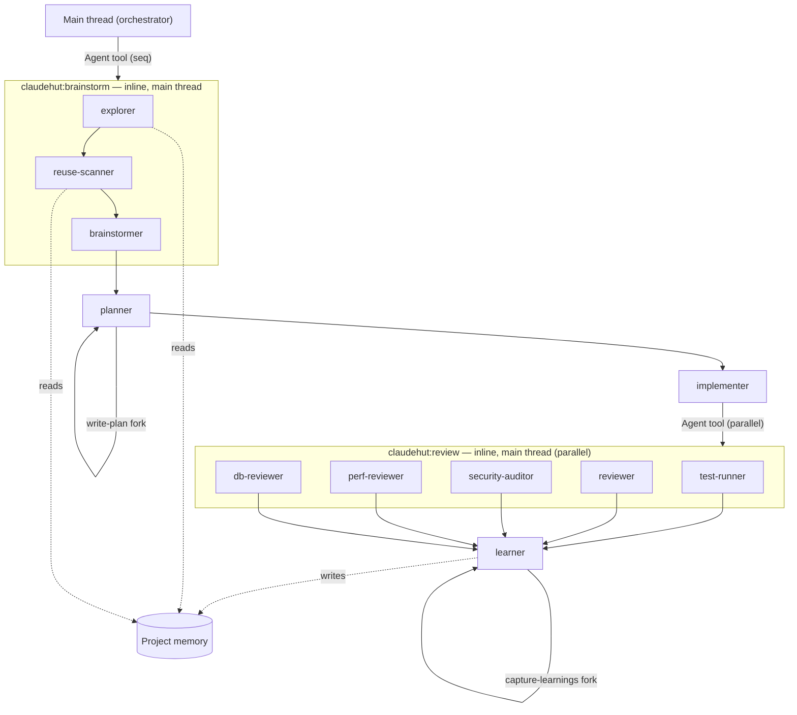

# ClaudeHut Design — 03. Agents

> Part of the **ClaudeHut** design document set. See [README](./README.md). Roster bindings are fixed in [02 §4.1](./02-architecture.md#41-agents--see-03).
> **Status:** Design v1 · **Pillar focus:** P2 (satellites). **Native mechanism:** subagents (`agents/*.md`).

This document specifies the eleven subagents that orbit the Workflow. Each maps to one phase ([01](./01-agentic-workflow.md)) and is invoked natively — either auto-delegated by Claude on `description` match, dispatched by a phase skill via `context: fork`, or dispatched **inline on the main thread** by a phase skill via the Agent tool ([04](./04-skills.md)). The Review auditors and the Brainstorm helpers are both dispatched **from the main thread** (a subagent cannot spawn another subagent — see [§1](#1-how-subagents-are-used-and-their-native-constraints)).

## Table of Contents

- [1. How subagents are used (and their native constraints)](#1-how-subagents-are-used-and-their-native-constraints)
- [2. Roster summary](#2-roster-summary)
- [3. Agent specs](#3-agent-specs)
  - [claudehut-explorer](#claudehut-explorer)
  - [claudehut-brainstormer](#claudehut-brainstormer)
  - [claudehut-reuse-scanner](#claudehut-reuse-scanner)
  - [claudehut-planner](#claudehut-planner)
  - [claudehut-implementer](#claudehut-implementer)
  - [claudehut-test-runner](#claudehut-test-runner)
  - [claudehut-reviewer](#claudehut-reviewer)
  - [claudehut-security-auditor](#claudehut-security-auditor)
  - [claudehut-perf-reviewer](#claudehut-perf-reviewer)
  - [claudehut-db-reviewer](#claudehut-db-reviewer)
  - [claudehut-learner](#claudehut-learner)
- [4. Dispatch and collaboration graph](#4-dispatch-and-collaboration-graph)

---

## 1. How subagents are used (and their native constraints)

Subagents run in **separate context windows**, so heavy exploration and multi-dimensional review do not pollute the main thread. Three invocation paths, all native:

- **Auto-delegation:** Claude reads each agent's `description` and invokes it via the Task tool when a request matches. Descriptions are written `"<role> — Use when <trigger>"`.
- **Skill-routed fork:** a phase skill with `context: fork` + `agent: <name>` runs that skill's turn inside the named subagent. Used for `write-plan` (planner) and `capture-learnings` (learner).
- **Inline main-thread dispatch:** a phase skill runs on the main thread and dispatches one or more subagents sequentially or in parallel via the Agent tool. Used by `claudehut:brainstorm` (sequential: explorer → reuse-scanner → brainstormer) and `claudehut:review` (parallel: 5 auditors). This path exists because **a subagent cannot spawn another subagent** — the skill must run on the main thread to call the Agent tool.

**Plugin-agent constraints (must be respected by every spec below):**

| Constraint | Consequence for ClaudeHut |
|------------|---------------------------|
| Plugin agents ignore `hooks`, `mcpServers`, `permissionMode` frontmatter | Subagent-scoped behavior comes from `skills:` preload + the plugin-level hooks ([06](./06-hooks.md)); MCP access is via servers configured in `.mcp.json` ([08](./08-mcp-integration.md)), not per-agent; **MCP is opt-in per project** — agents that use DB MCP tools degrade gracefully to static review when the server is not connected |
| `tools` omitted ⇒ inherit all | We set `tools` explicitly to keep read-only agents read-only |
| `model: inherit` is default | We override only where a phase needs more/less reasoning |
| `description` drives delegation | Each `description` lists concrete triggers + a "do NOT use when" guard |
| **A subagent cannot spawn another subagent** (the Agent tool is unavailable inside a subagent) | The **Review** auditors and the **Brainstorm** helpers are dispatched by the **main thread** (the inline `claudehut:review` and `claudehut:brainstorm` skills respectively), never by another subagent. Skills that fork (`write-plan`, `capture-learnings`) each fork at most **one** subagent. |

**Native handoff (correction-5).** Each agent's markdown *body* is its system prompt and carries the agent's flow + output contract; its `skills:` frontmatter **preloads the full bodies** of a **fixed set** of skills into the subagent at startup (`skills:` is static frontmatter, so the list is authored at build time, not computed per task). A runtime **per-task enforcement set** is conveyed in the dispatch prompt instead. So a forked subagent receives its conventions and flow natively, with no orchestration in prose outside the file. See [01 §9](./01-agentic-workflow.md#9-native-handoff-flow-lives-inside-the-skillagent-markdown).

A representative full frontmatter (the rest of the specs show only the deltas):

```markdown
---
name: claudehut-explorer
description: >
  Read-only codebase query agent. Use during Brainstorm to query the pre-built
  codebase index, locate where something is implemented, and surface the modules
  a task will touch so the candidate solutions adapt to this codebase. Do NOT use
  to write code or propose fixes — it only reports.
model: sonnet
effort: medium
tools: Read, Grep, Glob, Bash
color: cyan
---
You are ClaudeHut's codebase-query agent for the Brainstorm phase. Goal: ground
the candidate solutions in what already exists, not propose solutions.
1. Load the prerequisite index (PROJECT.md, architecture.md, reuse-index.json).
2. If the SessionStart flag says understand-anything is enabled, prefer its
   query/search skills; otherwise use Grep/Glob.
3. Map the packages/classes the task touches; cite file:line.
4. Return: entry points, key types, existing related code, and candidate reuse
   points (feed the reuse scanner).
Never edit. Never propose a fix. End with "Reuse candidates: …".
---
```

> **Enrichment conventions (applied to all agent bodies):** each agent file includes a Mermaid per-phase flow diagram showing its internal steps; reviewer agents carry per-tech-stack checklists and an adversarial "do not trust the report" framing to avoid anchoring on the implementer's summary; the implementer uses the DONE / DONE_WITH_CONCERNS / BLOCKED status protocol to surface partial progress; DB-using auditors (security, perf, db) include an explicit MCP graceful-degradation clause: "if DB MCP connected → run read-only EXPLAIN/schema queries; else review statically and note the limitation."

## 2. Roster summary

| Agent | Phase | Model | Tools (allowlist) | Returns |
|-------|-------|-------|-------------------|---------|
| `claudehut-explorer` | Brainstorm | sonnet | Read, Grep, Glob, Bash | codebase query results + reuse candidates |
| `claudehut-brainstormer` | Brainstorm | opus | Read, Grep, Glob, WebFetch | 2–3 codebase-adapted options + tradeoffs |
| `claudehut-reuse-scanner` | Brainstorm | sonnet | Read, Grep, Glob | reuse-scan artifact |
| `claudehut-planner` | Plan | sonnet | Read, Grep, Glob, Write | plan file |
| `claudehut-implementer` | Implement | inherit | Read, Edit, Write, Bash, Grep, Glob | code + tests (worktree) |
| `claudehut-test-runner` | Review | sonnet | Bash, Read, Grep | test output + outstanding items |
| `claudehut-reviewer` | Review | sonnet | Read, Grep, Bash | general findings + outstanding items |
| `claudehut-security-auditor` | Review | opus | Read, Grep, Bash + DB MCP (opt-in) | OWASP/JWT findings + outstanding |
| `claudehut-perf-reviewer` | Review | sonnet | Read, Grep, Bash + DB MCP (opt-in) | perf findings + outstanding |
| `claudehut-db-reviewer` | Review | sonnet | Read, Grep + DB MCP (opt-in) | schema/JPA findings + outstanding |
| `claudehut-learner` | Learn | haiku | Read, Write, Grep | learnings + reuse-index update |

> **Proportionality (per the simplicity constraint):** eleven agents across the six phases — Brainstorm has three (explorer/scanner/brainstormer), Plan and Implement one each, Review has five lenses (test/general/security/perf/db), Learn one; **Spec is a main-thread act with no agent**. The five Review auditors are kept separate deliberately — Java backend review fails in distinct ways (a security hole, an N+1, a missing migration) and a single combined reviewer reliably under-weights one lens. No agent exists that does not map to a phase.

## 3. Agent specs

Each spec: **Purpose · Phase · Trigger · Inputs · Outputs · Native invocation · Notes**.

### claudehut-explorer
- **Purpose:** Query the prerequisite codebase index during Brainstorm so candidate solutions adapt to what already exists — without touching code.
- **Phase:** Brainstorm.
- **Trigger:** step 1 of `claudehut:brainstorm`, dispatched inline from the main thread via the Agent tool; also auto-delegated on "understand / where is / how does / map this".
- **Inputs:** task description; the codebase index (`PROJECT.md`, `architecture.md`, `reuse-index.json`); the SessionStart `understand-anything` flag.
- **Outputs:** codebase query results (entry points, key types, related existing code), explicit "Reuse candidates" list that seeds the reuse scanner.
- **Native invocation:** subagent; `tools: Read, Grep, Glob, Bash`; `model: sonnet`. When the SessionStart flag reports `understand-anything` enabled, it prefers that plugin's query/search skills.
- **Notes:** read-only by tool allowlist — cannot write even if it tries. It *queries* the index; it does not *build* it (that is the Bootstrap prerequisite, [07 §3](./07-memory-architecture.md#3-bootstrapping-a-new-project)).

### claudehut-brainstormer
- **Purpose:** Generate ≥2 genuinely distinct **codebase-adapted** approaches scored on three axes — most best-practice, smallest change footprint, highest output quality + performance — and recommend one.
- **Phase:** Brainstorm.
- **Trigger:** step 3 of `claudehut:brainstorm`, dispatched inline from the main thread via the Agent tool; also auto-delegated when the user/agent is weighing approaches.
- **Inputs:** explorer query results, reuse-scan artifact, `LANGUAGE.md`, relevant learnings.
- **Outputs:** options table (approach · pros · cons · fit-with-project · footprint · perf), a recommendation, and the candidate **enforcement set** (applicable skills/rules at ≥1% match) for the main thread to record via `claudehut-state set-enforcement`.
- **Native invocation:** subagent; `model: opus`, `effort: high`; `tools: Read, Grep, Glob, WebFetch` (WebFetch for current best-practice/library docs).
- **Notes:** must reference the reuse-scan result so "adopt existing" is always considered as option 0 (the smallest-footprint axis).

### claudehut-reuse-scanner
- **Purpose:** Enforce P4 — find existing implementations before new code is written.
- **Phase:** Brainstorm.
- **Trigger:** step 2 of `claudehut:brainstorm`, dispatched inline from the main thread via the Agent tool.
- **Inputs:** task, `reuse-index.json`, learnings tagged `reuse`.
- **Outputs:** the **reuse-scan artifact** (`.claude/claudehut/reuse-scan-<task>.md`): found components + locations + "adopt/extend/none + justification".
- **Native invocation:** subagent; `tools: Read, Grep, Glob`; `model: sonnet`.
- **Notes:** its artifact is the precondition the `gate-write.sh` `PreToolUse` hook checks ([06](./06-hooks.md)); it does **not** write `state.json` (that is `bin/claudehut-state`).

### claudehut-planner
- **Purpose:** Produce an executable, file-level plan.
- **Phase:** Plan.
- **Trigger:** invoked by `write-plan` (`context: fork`).
- **Inputs:** the implementation spec (`specs/<task>.md`), reuse-scan artifact, architecture map.
- **Outputs:** plan file (`.claude/claudehut/plans/<task>.md`): ordered steps, files to touch, tests to write first, verification commands.
- **Native invocation:** subagent; `tools: Read, Grep, Glob, Write`.
- **Notes:** writes only into `.claude/claudehut/plans/` — not production code.

### claudehut-implementer
- **Purpose:** Execute the plan test-first under project conventions.
- **Phase:** Implement.
- **Trigger:** dispatched for multi-file changes; otherwise the main thread implements with the same skills.
- **Inputs:** plan file, path-scoped rules ([05](./05-rules.md)), `implement` skill (preloaded) + per-task enforcement set (passed in dispatch prompt).
- **Outputs:** code + tests, ideally in an isolated worktree for safe parallel/risky work.
- **Native invocation:** subagent; static `skills:` frontmatter preloads `[implement]` (frontmatter is static — it cannot hold a runtime list); `isolation: worktree`; `tools: Read, Edit, Write, Bash, Grep, Glob`; `model: inherit`.
- **Notes:** preloading `implement` puts the test-first Iron Law and all implementation conventions in-context from turn 1 inside the subagent. Tech-stack standards are now carried by path-scoped `.claude/rules/` (auto-applied by path match) and deep playbooks live in `implement/references/` inside the skill. The **per-task enforcement set** (from Brainstorm, [01 §7](./01-agentic-workflow.md#7-the-enforcement-set-applying-the-1-rule)) is **passed in the dispatch prompt** the main thread sends to the Agent tool. `isolation: worktree` keeps a failed attempt from corrupting the working tree. The implementer uses a **status protocol** — each turn ends with one of `DONE`, `DONE_WITH_CONCERNS`, or `BLOCKED` so the orchestrator knows whether to proceed, flag, or intervene.

### claudehut-test-runner
- **Purpose:** Run the suite and diagnose failures with real output.
- **Phase:** Review.
- **Trigger:** spawned by `claudehut:review` (from the main thread) each Review iteration.
- **Inputs:** the build tool (Maven/Gradle, detected in `PROJECT.md`), test selectors.
- **Outputs:** raw test output + a failure classification (assertion / flaky / env / config) + any failing checks as **outstanding items**.
- **Native invocation:** subagent; `tools: Bash, Read, Grep`; `model: sonnet`.
- **Notes:** the "fresh evidence" the `claudehut:review` Iron Law requires comes from here.

### claudehut-reviewer
- **Purpose:** General code review (correctness, readability, convention adherence, dead code).
- **Phase:** Review.
- **Trigger:** spawned by `claudehut:review` each Review iteration; checks the diff against the enforcement set.
- **Inputs:** the diff, the enforcement set, rules, `LANGUAGE.md`.
- **Outputs:** findings as `path:line: severity: problem → fix`, returned as **outstanding items** until resolved.
- **Native invocation:** subagent; read-only `tools: Read, Grep, Bash`; `model: sonnet`.
- **Notes:** skips style nits already auto-fixed by `format-java.sh` ([06](./06-hooks.md)). Uses adversarial framing — "do not trust the implementer's report; read the diff independently" — and carries per-tech-stack red-flag checklists in its body.

### claudehut-security-auditor
- **Purpose:** Spring-security-aware review — OWASP, authn/authz, injection, secret handling.
- **Phase:** Review.
- **Trigger:** changes to controllers, security config, auth, or data exposure.
- **Inputs:** diff, `security.md` rules, optionally DB MCP to confirm what data is reachable.
- **Outputs:** severity-tagged security findings with exploit reasoning.
- **Native invocation:** subagent; `model: opus`; `tools: Read, Grep, Bash` + DB MCP tools.
- **Notes:** uses adversarial framing ("do not trust the report") and carries OWASP + Spring-security red-flag checklists in its body. **MCP graceful degradation:** if DB MCP is connected, runs read-only `EXPLAIN`/schema queries to confirm parameterisation against the real schema; if not connected, reviews statically and notes the limitation explicitly.

### claudehut-perf-reviewer
- **Purpose:** JVM and data-access performance review — N+1, missing indexes, blocking calls on reactive paths, allocation hot spots.
- **Phase:** Review.
- **Trigger:** changes to repositories, queries, hot paths, reactive code.
- **Inputs:** diff, `performance/` + `framework/` rules (n-plus-one, indexing, webflux, backpressure), DB MCP (`EXPLAIN`, when connected).
- **Outputs:** perf findings with evidence (query plan, fetch counts).
- **Native invocation:** subagent; `tools: Read, Grep, Bash` + DB MCP (when connected); `model: sonnet`.
- **Notes:** uses adversarial framing ("do not trust the report") and carries N+1/reactive/JVM hot-spot red-flag checklists. **MCP graceful degradation:** if DB MCP is connected, runs read-only `EXPLAIN` to provide query-plan evidence; if not connected, reviews statically and notes the limitation.

### claudehut-db-reviewer
- **Purpose:** Persistence-layer correctness — JPA mappings, fetch strategies, migration safety (Flyway/Liquibase), transaction boundaries.
- **Phase:** Review.
- **Trigger:** changes to entities, repositories, migrations.
- **Inputs:** diff, real schema via DB MCP (when connected), `framework/jpa.md`/`r2dbc.md`/`migration-safety.md` + `performance/n-plus-one.md` rules.
- **Outputs:** mapping/migration findings; confirms migration is reversible.
- **Native invocation:** subagent; `tools: Read, Grep` + DB MCP (when connected); `model: sonnet`.
- **Notes:** uses adversarial framing ("do not trust the report") and carries JPA/Flyway/Liquibase red-flag checklists. **MCP graceful degradation:** if DB MCP is connected, queries the real schema to verify mappings and confirm migration is reversible; if not connected, reviews statically and notes the limitation.

### claudehut-learner
- **Purpose:** Persist cross-session learnings and update the reuse index (P5).
- **Phase:** Learn.
- **Trigger:** invoked by `capture-learnings` at task end.
- **Inputs:** the session's decisions, surprises, reuse points, review findings.
- **Outputs:** appended/deduped records in `learnings.jsonl`; narrative appended to native auto-memory; updated `reuse-index.json`.
- **Native invocation:** subagent; `memory: project` (native auto-memory); `tools: Read, Write, Grep`; `model: haiku` (cheap, structured task).
- **Notes:** `memory: project` is the *only* place native auto-memory is enabled — see [07 §5](./07-memory-architecture.md#5-p5--cross-session-reinforcement-learning).

## 4. Dispatch and collaboration graph



The Brainstorm trio (`explorer → reuse-scanner → brainstormer`) and the five Review auditors are all dispatched **by the main thread** via the Agent tool (`claudehut:brainstorm` and `claudehut:review` run inline on the main thread — not inside a subagent). The five Review auditors run in parallel as independent lenses; each returns its slice of the **outstanding set**, the loop repeats until that set is empty ([01 §8](./01-agentic-workflow.md#8-the-review-loop-and-its-exit-condition)), then `claudehut-learner` (the single writer of cross-session memory) runs. `write-plan` and `capture-learnings` use the `context: fork` path (one subagent each). Spec has no agent.

---

**Prev:** [← 02. Architecture](./02-architecture.md) · **Next:** [04. Skills →](./04-skills.md)
