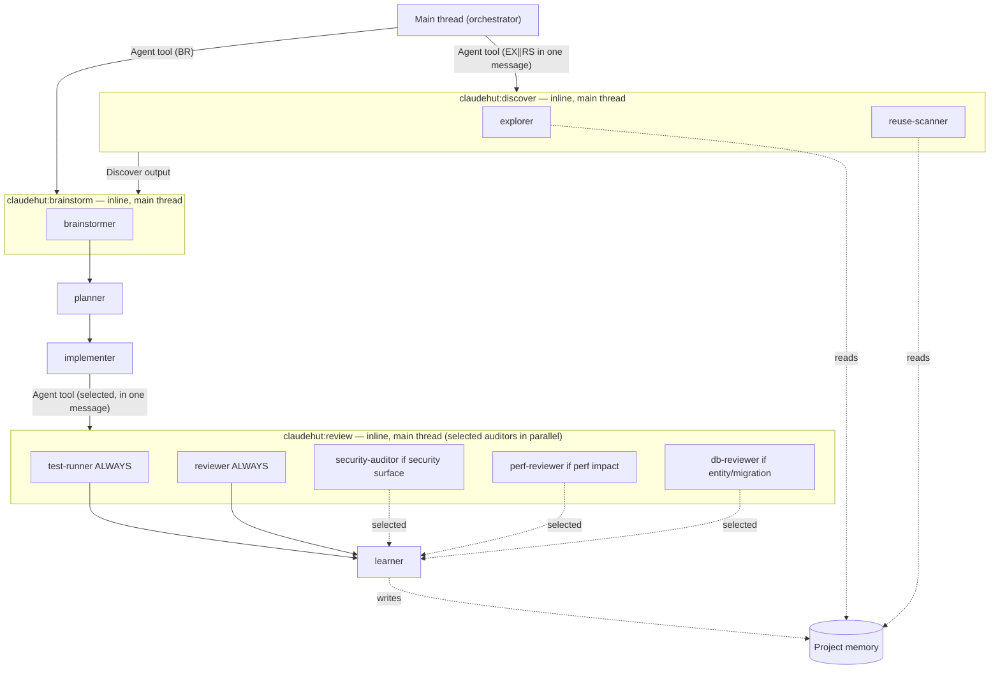

# ClaudeHut Design — 03. Agents

> Part of the **ClaudeHut** design document set. See [README](./README.md). Roster bindings are fixed in [02 §4.1](./02-architecture.md#41-agents--see-03).
> **Status:** Design v1 · **Pillar focus:** P2 (satellites). **Native mechanism:** subagents (`agents/*.md`).

This document specifies the eleven subagents that orbit the Workflow. Each maps to one phase ([01](./01-agentic-workflow.md)) and is invoked natively — either auto-delegated by Claude on `description` match or dispatched **inline on the main thread** by a phase skill via the Agent tool ([04](./04-skills.md)). All phase-skill dispatches happen from the main thread (a subagent cannot spawn another subagent — see [§1](#1-how-subagents-are-used-and-their-native-constraints)). Explorer and reuse-scanner now belong to **Discover** (phase 1); brainstormer now belongs to **Brainstorm** (phase 2, generic ideation — v0.4 reversal).

## Table of Contents

- [1. How subagents are used (and their native constraints)](#1-how-subagents-are-used-and-their-native-constraints)
- [2. Roster summary](#2-roster-summary)
- [3. Agent specs](#3-agent-specs)
  - [claudehut-explorer](#claudehut-explorer)
  - [claudehut-brainstormer](#claudehut-brainstormer)
  - [claudehut-reuse-scanner](#claudehut-reuse-scanner)
  - [claudehut-planner](#claudehut-planner)
  - [claudehut-implementer](#claudehut-implementer)
  - [claudehut-test-runner](#claudehut-test-runner)
  - [claudehut-reviewer](#claudehut-reviewer)
  - [claudehut-security-auditor](#claudehut-security-auditor)
  - [claudehut-perf-reviewer](#claudehut-perf-reviewer)
  - [claudehut-db-reviewer](#claudehut-db-reviewer)
  - [claudehut-learner](#claudehut-learner)
- [4. Dispatch and collaboration graph](#4-dispatch-and-collaboration-graph)

---

## 1. How subagents are used (and their native constraints)

Subagents run in **separate context windows**, so heavy exploration and multi-dimensional review do not pollute the main thread. Three invocation paths, all native:

- **Auto-delegation:** Claude reads each agent's `description` and invokes it via the Task tool when a request matches. Descriptions are written `"<role> — Use when <trigger>"`.
- **Inline main-thread dispatch (all phase skills):** every phase skill runs on the main thread and dispatches its agent(s) via the Agent tool. This path exists because **a subagent cannot spawn another subagent**, cannot use `AskUserQuestion`, and most have no `Bash` — so orchestration duties (user gates, state writes, task mirroring) must stay on the main thread. `claudehut:discover` dispatches explorer ∥ reuse-scanner **in one message** (concurrent — their inputs are independent); `claudehut:brainstorm` dispatches brainstormer after Discover returns; `claudehut:review` dispatches the **selected** auditors **in one message** (parallel — test-runner + reviewer always; security/perf/db by enforcement-set + diff); `claudehut:write-plan` and `claudehut:capture-learnings` each dispatch one agent.

**Plugin-agent constraints (must be respected by every spec below):**

| Constraint | Consequence for ClaudeHut |
|------------|---------------------------|
| Plugin agents ignore `hooks`, `mcpServers`, `permissionMode` frontmatter | Subagent-scoped behavior comes from `skills:` preload + the plugin-level hooks ([06](./06-hooks.md)); MCP access is via servers configured in `.mcp.json` ([08](./08-mcp-integration.md)), not per-agent; **MCP is opt-in per project** — agents that use DB MCP tools degrade gracefully to static review when the server is not connected |
| `tools` omitted ⇒ inherit all | We set `tools` explicitly to keep read-only agents read-only |
| `model: inherit` is default | We override only where a phase needs more/less reasoning |
| `description` drives delegation | Each `description` lists concrete triggers + a "do NOT use when" guard |
| **A subagent cannot spawn another subagent** (the Agent tool is unavailable inside a subagent) | All **Review** auditors (selected per task) and all **Discover** + **Brainstorm** agents are dispatched by the **main thread**; so are the **planner** and **learner**. Subagents return data only — they never write state, never ask the user. |

**Native handoff (correction-5).** Each agent's markdown *body* is its system prompt and carries the agent's flow + output contract; its `skills:` frontmatter **preloads the full bodies** of a **fixed set** of skills into the subagent at startup (`skills:` is static frontmatter, so the list is authored at build time, not computed per task). A runtime **per-task enforcement set** is conveyed in the dispatch prompt instead. So a forked subagent receives its conventions and flow natively, with no orchestration in prose outside the file. See [01 §9](./01-agentic-workflow.md#9-native-handoff-flow-lives-inside-the-skillagent-markdown).

A representative full frontmatter (the rest of the specs show only the deltas):

```markdown
---
name: claudehut-explorer
description: >
  Read-only codebase query agent. Use during Discover to query the pre-built
  codebase index, locate where something is implemented, and surface the modules
  a task will touch so the work is grounded in this codebase. Do NOT use
  to write code or propose fixes — it only reports.
model: sonnet
effort: xhigh
tools: Read, Grep, Glob, Bash
color: cyan
---
You are ClaudeHut's codebase-query agent for the Discover phase. Goal: ground
the task in what already exists, not propose solutions.
1. Load the prerequisite index (PROJECT.md, architecture.md, reuse-index.json).
2. If the SessionStart flag says understand-anything is enabled, prefer its
   query/search skills; otherwise use Grep/Glob.
3. Map the packages/classes the task touches; cite file:line.
4. Return: entry points, key types, existing related code, and candidate reuse
   points (feed the reuse scanner).
Never edit. Never propose a fix. End with "Reuse candidates: …".
---
```

> **Enrichment conventions (applied to all agent bodies):** each agent file includes a Mermaid per-phase flow diagram showing its internal steps; reviewer agents carry per-tech-stack checklists and an adversarial "do not trust the report" framing to avoid anchoring on the implementer's summary; the implementer uses the DONE / DONE_WITH_CONCERNS / BLOCKED status protocol to surface partial progress; DB-using auditors (security, perf, db) include an explicit MCP graceful-degradation clause: "if DB MCP connected → run read-only EXPLAIN/schema queries; else review statically and note the limitation."

## 2. Roster summary

| Agent | Phase | Model | Effort | Tools (allowlist) | Returns |
|-------|-------|-------|--------|-------------------|---------|
| `claudehut-explorer` | **Discover** | sonnet | xhigh | Read, Grep, Glob, Bash | codebase query results + reuse candidates |
| `claudehut-reuse-scanner` | **Discover** | sonnet | xhigh | Read, Grep, Glob | reuse-scan artifact |
| `claudehut-brainstormer` | Brainstorm | opus | xhigh | Read, Grep, Glob, WebFetch | 2–3 generic options + tradeoffs (consumes Discover output) |
| `claudehut-planner` | Plan | opus | xhigh | Read, Grep, Glob, Write | plan file |
| `claudehut-implementer` | Implement | **opus** | **xhigh** | Read, Edit, Write, Bash, Grep, Glob | code + tests (worktree) |
| `claudehut-test-runner` | Review | sonnet | xhigh | Bash, Read, Grep | test output + outstanding items |
| `claudehut-reviewer` | Review | **opus** | xhigh | Read, Grep, Bash | coverage table + outstanding items |
| `claudehut-security-auditor` | Review | opus | xhigh | Read, Grep, Bash + DB MCP (opt-in) | coverage table (OWASP/JWT) + outstanding |
| `claudehut-perf-reviewer` | Review | **opus** | xhigh | Read, Grep, Bash + DB MCP (opt-in) | coverage table (perf) + outstanding |
| `claudehut-db-reviewer` | Review | **opus** | xhigh | Read, Grep + DB MCP (opt-in) | coverage table (schema/JPA) + outstanding |
| `claudehut-learner` | Learn | sonnet | xhigh | Read, Write, Grep | learnings + reuse-index update |

> **v0.5 reasoning-depth pass.** `effort: xhigh` is the default for **all** agents (native `effort` frontmatter — Claude Code model-config docs; `xhigh` falls back to `high` on Sonnet 4.6/Opus 4.6). The **implementer** and the **three code reviewers** (reviewer/perf/db) were raised to **opus** so the agents that write and that gate-ship code reason at the same depth as the brainstormer/planner — measured root cause was that 4/5 auditors ran sonnet at default effort, *below* the ideation agent. Mechanical agents (explorer, reuse-scanner, test-runner, learner) stay on sonnet — `xhigh→high` there buys little and adds some latency, accepted for a uniform default.
> **Cost/latency trade (explicit):** four opus+`xhigh` code reviewers in parallel + a validation pass on every full-tier task materially raise per-task tokens and wall-clock vs the v0.4 sonnet reviewers. This is the intended price of "highest output quality"; the trivial/small fast lanes spawn fewer reviewers, so the cost lands on `full`-tier work where it's warranted.
> **Environment caveat (verified, out-of-repo).** A user-global `CLAUDE_CODE_SUBAGENT_MODEL` env var overrides **every** `model:` here at highest precedence (so all subagents run that one model) — leave it unset for per-agent selection to take effect. `CLAUDE_CODE_DISABLE_ADAPTIVE_THINKING=1` switches **Sonnet** agents from adaptive reasoning to a fixed budget (`MAX_THINKING_TOKENS`); with that flag set and `MAX_THINKING_TOKENS` unset, `effort` no longer drives Sonnet thinking. **Opus 4.7+/4.8 are always adaptive and ignore that flag, so `effort` works on the opus agents regardless.** (Claude Code sub-agents + model-config docs.)

> **Proportionality (per the simplicity constraint):** eleven agents across the seven phases — Discover has two (explorer/scanner), Brainstorm has one (brainstormer, generic ideation), Plan and Implement one each, Review has five lenses (test/general/security/perf/db — **dynamically selected per task**), Learn one; **Spec is a main-thread act with no agent**. The five Review auditors are kept separate deliberately — Java backend review fails in distinct ways (a security hole, an N+1, a missing migration) and a single combined reviewer reliably under-weights one lens. Selection is per-task (not all five every run); test-runner + reviewer always; security/perf/db by enforcement-set + diff impact. No agent exists that does not map to a phase.

## 3. Agent specs

Each spec: **Purpose · Phase · Trigger · Inputs · Outputs · Native invocation · Notes**.

### claudehut-explorer
- **Purpose:** Query the prerequisite codebase index during **Discover** so the grounding is in what already exists — without touching code.
- **Phase:** Discover (phase 1).
- **Trigger:** dispatched by `claudehut:discover` concurrently with reuse-scanner in one message; also auto-delegated on "understand / where is / how does / map this".
- **Inputs:** task description; the codebase index (`PROJECT.md`, `architecture.md`, `reuse-index.json`); the SessionStart `understand-anything` flag.
- **Outputs:** codebase query results (entry points, key types, related existing code), explicit "Reuse candidates" list that seeds the reuse scanner.
- **Native invocation:** subagent; `tools: Read, Grep, Glob, Bash`; `model: sonnet`. When the SessionStart flag reports `understand-anything` enabled, it prefers that plugin's query/search skills.
- **Notes:** read-only by tool allowlist — cannot write even if it tries. It *queries* the index; it does not *build* it (that is the Bootstrap prerequisite, [07 §3](./07-memory-architecture.md#3-bootstrapping-a-new-project)).

### claudehut-brainstormer
- **Purpose:** Generate ≥2 genuinely distinct approaches for **any problem type** (feature, bug, refactor, performance, design, non-code) scored on three axes — most best-practice, smallest change footprint, highest output quality + performance — and recommend one. **Generic ideation: not stack-fitted.** Consumes Discover's context + reuse DECISION; does NOT re-explore or re-scan (v0.4 reversal — decoupling ideation from discovery widens creative breadth).
- **Phase:** Brainstorm (phase 2).
- **Trigger:** dispatched by `claudehut:brainstorm` after Discover output is available; also auto-delegated when the user/agent is weighing approaches.
- **Inputs:** Discover's context (explorer output, reuse-scan DECISION), `LANGUAGE.md`, relevant learnings.
- **Outputs:** options table (approach · pros · cons · fit-with-project · footprint · perf), a recommendation, and the candidate **enforcement set** (applicable skills/rules at ≥1% match) for the main thread to record via `claudehut-state set-enforcement`.
- **Native invocation:** subagent; `model: opus`, `effort: xhigh`; `tools: Read, Grep, Glob, WebFetch` (WebFetch for current best-practice/library docs).
- **Notes:** must reference the reuse-scan result so "adopt existing" is always considered as option 0 (the smallest-footprint axis).

### claudehut-reuse-scanner
- **Purpose:** Enforce P4 — find existing implementations before new code is written.
- **Phase:** Discover (phase 1).
- **Trigger:** dispatched by `claudehut:discover` concurrently with explorer in one message.
- **Inputs:** task, `reuse-index.json`, learnings tagged `reuse`.
- **Outputs:** the **reuse-scan artifact** (`.claude/claudehut/tasks/NNNN-<slug>/reuse-scan.md`): found components + locations + "adopt/extend/none + justification".
- **Native invocation:** subagent; `tools: Read, Grep, Glob`; `model: sonnet`.
- **Notes:** its artifact is the precondition the `gate-write.sh` `PreToolUse` hook checks ([06](./06-hooks.md)); it does **not** write `state.json` (that is `bin/claudehut-state`).

### claudehut-planner
- **Purpose:** Produce an executable, file-level plan.
- **Phase:** Plan.
- **Trigger:** dispatched by `write-plan` skill from the main thread via the Agent tool.
- **Inputs:** the implementation spec (`tasks/NNNN-<slug>/spec.md`), reuse-scan artifact (same dir), architecture map, `plan-template.md`.
- **Outputs:** plan file (`.claude/claudehut/tasks/NNNN-<slug>/plan.md`): T-xxx breakdown table (failing test first + exact verify command per task, Depends-on, req-ref), decision summary at §1. Returns the plan path + 5-line summary for the main thread's approval question.
- **Native invocation:** subagent; `model: opus` (plan quality drives all downstream execution); `tools: Read, Grep, Glob, Write`.
- **Notes:** writes only into the task dir — not production code. The main thread asks the user for approval and records `claudehut-state set-plan` — the planner does NOT ask the user and does NOT write state (no `AskUserQuestion`, no `Bash`).

### claudehut-implementer
- **Purpose:** Execute the plan test-first under project conventions.
- **Phase:** Implement.
- **Trigger:** dispatched for multi-file changes or parallel `[P]` tasks; otherwise the main thread implements with the same skills.
- **Inputs:** T-xxx rows + acceptance criteria + enforcement set carried **verbatim in the dispatch prompt** (not by path — the worktree forks from the current branch HEAD via `worktree.baseRef=head`: committed prior-phase code IS present and the implementer builds on it, only **uncommitted** main-tree artifacts like the in-flight plan.md are absent). For parallel dispatch: an **exclusive file-ownership list** ("create/edit ONLY these paths").
- **Outputs:** code + tests, committed to the worktree branch. Status line: `DONE (branch: <name>, commit: <sha>)`.
- **Native invocation:** subagent; static `skills:` frontmatter preloads `[implement]` (frontmatter is static — it cannot hold a runtime list); `isolation: worktree`; `tools: Read, Edit, Write, Bash, Grep, Glob`; `model: opus`, `effort: xhigh` (v0.5 — writing code is where reasoning depth pays off; the plan scopes *what*, but correct test-first implementation under the rules is not mechanical).
- **Notes:** preloading `implement` puts the test-first Iron Law and all implementation conventions in-context from turn 1 inside the subagent. Tech-stack standards are now carried by path-scoped `.claude/rules/` (auto-applied by path match) and deep playbooks live in `implement/references/` inside the skill. The **per-task enforcement set** (from Brainstorm, [01 §7](./01-agentic-workflow.md#7-the-enforcement-set-applying-the-1-rule)) is **passed in the dispatch prompt** the main thread sends to the Agent tool. `isolation: worktree` keeps a failed attempt from corrupting the working tree. **Commit-before-DONE contract:** the implementer must `git add -A && git commit` before returning `DONE`; an uncommitted worktree strands work as an orphan (the main thread merges the **branch**, not uncommitted files). **BLOCKED-immediately rule:** if a precondition is missing or a test cannot be made to pass, return `BLOCKED: <reason>` immediately — never wait or retry-loop (a waiting subagent presents as a hang). Run Gradle with `--no-daemon` (parallel daemons contend on shared caches). Full lifecycle: [11 §6](./11-execution-model-and-artifacts.md#6-parallel-execution--worktree-lifecycle).

### claudehut-test-runner
- **Purpose:** Run the suite and diagnose failures with real output.
- **Phase:** Review.
- **Trigger:** spawned by `claudehut:review` (from the main thread) each Review iteration.
- **Inputs:** the build tool (Maven/Gradle, detected in `PROJECT.md`), test selectors.
- **Outputs:** raw test output + a failure classification (assertion / flaky / env / config) + any failing checks as **outstanding items**.
- **Native invocation:** subagent; `tools: Bash, Read, Grep`; `model: sonnet`.
- **Notes:** the "fresh evidence" the `claudehut:review` Iron Law requires comes from here.

### claudehut-reviewer
- **Purpose:** General code review (correctness, readability, convention adherence, dead code).
- **Phase:** Review.
- **Trigger:** spawned by `claudehut:review` each Review iteration; checks the diff against the enforcement set.
- **Inputs:** the diff, the enforcement set, rules, `LANGUAGE.md`.
- **Outputs:** a **coverage table** (one row per enforcement-set item + defect class → ✓/✗/n-a + `file:line` evidence); ✗ at MED+ returned as **outstanding items** until resolved.
- **Native invocation:** subagent; read-only `tools: Read, Grep, Bash`; `model: opus`, `effort: xhigh` (v0.5 — the gate that decides shipping reasons at full depth).
- **Notes:** skips style nits already auto-fixed by `format-java.sh` ([06](./06-hooks.md)). Carries the **review-rigor contract** (v0.5): `ultrathink`, refute-don't-confirm framing, evidence-per-claim (a `✓` needs a cited line, not a name inference), and the shared severity scale. See [01 §8](./01-agentic-workflow.md#8-the-review-loop-and-its-exit-condition).

### claudehut-security-auditor
- **Purpose:** Spring-security-aware review — OWASP, authn/authz, injection, secret handling.
- **Phase:** Review.
- **Trigger:** changes to controllers, security config, auth, or data exposure.
- **Inputs:** diff, `security.md` rules, optionally DB MCP to confirm what data is reachable.
- **Outputs:** severity-tagged security findings with exploit reasoning.
- **Native invocation:** subagent; `model: opus`, `effort: xhigh`; `tools: Read, Grep, Bash` + DB MCP tools.
- **Notes:** carries the review-rigor contract (`ultrathink`, refute framing, coverage table, severity scale) + OWASP + Spring-security defect-class floor. **MCP graceful degradation:** if DB MCP is connected, runs read-only `EXPLAIN`/schema queries to confirm parameterisation against the real schema; if not connected, reviews statically and notes the limitation explicitly.

### claudehut-perf-reviewer
- **Purpose:** JVM and data-access performance review — N+1, missing indexes, blocking calls on reactive paths, allocation hot spots.
- **Phase:** Review.
- **Trigger:** changes to repositories, queries, hot paths, reactive code.
- **Inputs:** diff, `performance/` + `framework/` rules (n-plus-one, indexing, webflux, backpressure), DB MCP (`EXPLAIN`, when connected).
- **Outputs:** a coverage table with a **required call-chain trace floor** (every finder→loop, every collection iterated post-finder, every Mono/Flux for `.block()`) + evidence (query plan, fetch counts).
- **Native invocation:** subagent; `tools: Read, Grep, Bash` + DB MCP (when connected); `model: opus`, `effort: xhigh`.
- **Notes:** carries the review-rigor contract + the call-chain trace floor (v0.5 RC-7 — the common N+1/EAGER/blocking-in-reactive defects hid in "pure logic" diffs that skipped this reviewer; selection is now default-on for any data-access/reactive surface). **MCP graceful degradation:** if DB MCP is connected, runs read-only `EXPLAIN` for query-plan evidence; if not connected, reviews statically and notes the limitation.

### claudehut-db-reviewer
- **Purpose:** Persistence-layer correctness — JPA mappings, fetch strategies, migration safety (Flyway/Liquibase), transaction boundaries.
- **Phase:** Review.
- **Trigger:** changes to entities, repositories, migrations.
- **Inputs:** diff, real schema via DB MCP (when connected), `framework/jpa.md`/`r2dbc.md`/`migration-safety.md` + `performance/n-plus-one.md` rules.
- **Outputs:** mapping/migration findings; confirms migration is reversible.
- **Native invocation:** subagent; `tools: Read, Grep` + DB MCP (when connected); `model: opus`, `effort: xhigh`.
- **Notes:** carries the review-rigor contract + JPA/Flyway/Liquibase defect-class floor (coverage table, evidence per row). **MCP graceful degradation:** if DB MCP is connected, queries the real schema to verify mappings and confirm migration is reversible; if not connected, reviews statically and notes the limitation.

### claudehut-learner
- **Purpose:** Persist cross-session learnings and update the reuse index (P5).
- **Phase:** Learn.
- **Trigger:** invoked by `capture-learnings` at task end.
- **Inputs:** the session's decisions, surprises, reuse points, review findings.
- **Outputs:** appended/deduped records in `learnings.jsonl`; narrative appended to native auto-memory; updated `reuse-index.json`.
- **Native invocation:** subagent; `memory: project` (native auto-memory); `tools: Read, Write, Grep`; `model: sonnet` (policy: opus for critical phases, sonnet default).
- **Notes:** `memory: project` is the *only* place native auto-memory is enabled — see [07 §5](./07-memory-architecture.md#5-p5--cross-session-reinforcement-learning).

## 4. Dispatch and collaboration graph



All agents are dispatched **by the main thread** via the Agent tool — no skill uses `context: fork`. `claudehut:discover` dispatches explorer ∥ reuse-scanner concurrently (one message); `claudehut:brainstorm` dispatches brainstormer after Discover; `claudehut:review` dispatches the **selected** auditors in parallel (one message — test-runner + reviewer always; security/perf/db by enforcement-set + diff); `claudehut:write-plan` and `claudehut:capture-learnings` each dispatch one agent; the main thread owns approval gates, state writes, and task mirroring in every case. Review auditors run in parallel as independent lenses; each returns its slice of the **outstanding set**, the loop repeats until that set is empty ([01 §8](./01-agentic-workflow.md#8-the-review-loop-and-its-exit-condition)), then `claudehut-learner` (the single writer of cross-session memory) runs. Spec has no agent.

---

**Prev:** [← 02. Architecture](./02-architecture.md) · **Next:** [04. Skills →](./04-skills.md)
