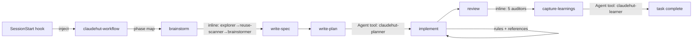

# ClaudeHut Design — 04. Skills

> Part of the **ClaudeHut** design document set. See [README](./README.md). Skill bindings are fixed in [02 §4.2](./02-architecture.md#42-skills--see-04).
> **Status:** Design v2 · **Pillar focus:** P1, P2, P4. **Native mechanism:** Agent Skills (`skills/<name>/SKILL.md`).
>
> **Revision note (v2):** The 17-skill multi-skill-per-phase design has been superseded by a deliberate consolidation to **8 skills — exactly one per workflow phase plus 2 non-phase orchestration skills**. Domain skills were eliminated as a class; their tech-stack depth now lives in `.claude/rules/` (terse always-applied standards, see [05](./05-rules.md)) and in `implement/references/` (deep playbooks loaded on demand).

Skills are how the Workflow's behavior is delivered and enforced inside the conversation. This catalog defines every skill, its trigger (`description`), what it loads, and — for enforcement skills — the Iron-Law pattern that makes a phase non-skippable.

## Table of Contents

- [1. Skill conventions (locked)](#1-skill-conventions-locked)
- [2. The two skill classes](#2-the-two-skill-classes)
- [3. Orchestration skills](#3-orchestration-skills)
- [4. Phase skills](#4-phase-skills)
- [5. Enforcement skills (Iron Laws)](#5-enforcement-skills-iron-laws)
- [6. Tech-stack depth: rules + `implement` references](#6-tech-stack-depth-rules--implement-references)
- [7. Slash commands](#7-slash-commands)
- [8. How skills auto-trigger and chain](#8-how-skills-auto-trigger-and-chain)

---

## 1. Skill conventions (locked)

Adopted from the mattpocock + superpowers research, fixed for the whole catalog:

1. **`description` = `"<what it does>. Use when <concrete triggers>."`** — the only routing surface. Triggers list verbatim phrases, intents, and contexts. Truncated at 1,536 chars, so the trigger comes first.
2. **Enforcement skills lead with their Iron Law**, then a **rationalization table**, then the process. (The table is the mechanism, not decoration.)
3. **SKILL.md ≤ ~120 lines.** Heavy reference goes in companion files (`references/*.md`) loaded on demand (progressive disclosure).
4. **Cross-reference with the `claudehut:` namespace**, never `@import` (which force-loads and burns tokens): "REQUIRED SUB-SKILL: `claudehut:brainstorm`".
5. **Announce on invoke** — each skill instructs "state: *Using ClaudeHut <skill> (phase N)*" so phase progress is observable.
6. **All phase skills run on the main thread.** A subagent cannot spawn subagents, cannot use `AskUserQuestion`, and most have no `Bash` — so orchestration duties (user gates, state writes, native task mirroring) must stay on the main thread. Every phase skill dispatches its agent(s) via the Agent tool from the main thread. `brainstorm` dispatches three agents sequentially; `review` dispatches five in parallel; `write-plan` and `capture-learnings` dispatch one agent each.
7. **Self-driving flow (correction-5).** Each SKILL.md body carries its flow natively: **Announce → Flow steps → Iron Law (if any) → `REQUIRED NEXT`** naming the next skill. Subagents receive this same flow via `skills:` preload (full body injected). No phase handoff lives in prose outside the files — see [01 §9](./01-agentic-workflow.md#9-native-handoff-flow-lives-inside-the-skillagent-markdown).

## 2. The two skill classes

| Class | Purpose | Native traits |
|-------|---------|---------------|
| **Orchestration** | Establish + bootstrap the Workflow | injected at `SessionStart`; user-invocable commands |
| **Phase / Enforcement** | Drive and gate each phase | auto-trigger by `description`; Iron-Law bodies; all run inline on the main thread, dispatching agent(s) via the Agent tool |

One skill per phase (6 phases × 1 skill) plus 2 orchestration skills = **8 skills total**.

## 3. Orchestration skills

### claudehut-workflow
- **Class:** orchestration (the bootstrap meta-skill). **Phase:** all.
- **Purpose:** Establish the 6 phases, the phase→skill map, and the two laws — the **skill-first law** and the **1% rule** (verbatim from superpowers: *"If you think there is even a 1% chance a skill might apply to what you are doing, you ABSOLUTELY MUST invoke the skill."*). This is the superpowers `using-superpowers` analogue.
- **Trigger:** injected wholesale by the `bootstrap.sh` `SessionStart` hook as `additionalContext` — it does not wait to be discovered.
- **Inputs:** none. **Outputs:** none directly; it governs the turn.
- **Native invocation:** Skill body injected via hook; also user-invocable as `/claudehut:workflow` to re-anchor.
- **Body shape:**
  ```
  ## ClaudeHut Workflow — you are always in one of 6 phases (the codebase is pre-indexed)
  Brainstorm → Spec → Plan → Implement → Review → Learn
  ### Laws
  1. Skill-first: check ClaudeHut skills before acting.
  2. 1% rule: if there is even a 1% chance a skill/rule applies, you MUST invoke it
     (this builds the enforcement set in Brainstorm).
  3. Reuse-first: never write new code before the reuse-scan step inside claudehut:brainstorm (gated).
  4. Test-first: never write prod code before a failing test (claudehut:implement — TDD Iron Law).
  5. Compliance-first: never claim done before claudehut:review shows
     zero outstanding items (gated).
  ### Phase → skill map  (table)
  ### Record transitions with: claudehut-state set-phase <name> ...
  ```

### claudehut-init
- **Class:** orchestration (Bootstrap prerequisite). **Phase:** Bootstrap — the prerequisite step, run once before the Workflow; **builds the codebase index** ([01 §3](./01-agentic-workflow.md#3-prerequisite-the-codebase-index-not-a-phase)).
- **Purpose:** Generate Project memory + project rules + the codebase index for a new repository (P3). **Script-backed (deterministic):** the skill runs `bin/claudehut-init`, which detects the stack and *writes* `MEMORY.md`/`PROJECT.md`/`LANGUAGE.md`/`architecture.md`/`reuse-index.json` + the stack-gated `.claude/rules/` tree + the `@import` slice — with zero model reliance. The file writes were moved out of model judgment because, measured, the model treated init as "analyze" and produced no files (EVAL-REPORT #3). The skill then *optionally enriches* the script's `TBD — refine` stubs (reuse-index components, architecture narrative) — best-effort, non-critical.
- **Trigger:** `/claudehut:init`; **or** auto-suggested by `bootstrap.sh` (which emits a `systemMessage` when `.claude/claudehut/` is absent and the deterministic fallback could not run).
- **Inputs:** the repo (build files, package tree). **Outputs:** the full Project memory tree ([07 §3](./07-memory-architecture.md#3-bootstrapping-a-new-project)).
- **Native invocation:** Skill / slash command; body is essentially `!`"${CLAUDE_PLUGIN_ROOT}/bin/claudehut-init" "${CLAUDE_PROJECT_DIR}"`` + a verify `ls` + the optional enrich pass.

## 4. Phase skills

These 6 skills cover the 6 workflow phases one-for-one. Each is the **sole** skill for its phase.

### brainstorm
- **Phase:** Brainstorm. **Trigger:** start of Brainstorm; "understand / map / where is … / what are the options / how should I approach …".
- **Purpose:** Three-step inline orchestration: (1) explore the codebase, (2) reuse scan, (3) produce options + enforcement set.
- **Runs INLINE on the main thread** — dispatches three subagents in sequence via the Agent tool:
  1. [`claudehut-explorer`](./03-agents.md#claudehut-explorer) — explore step: queries the codebase index and maps relevant code.
  2. [`claudehut-reuse-scanner`](./03-agents.md#claudehut-reuse-scanner) — reuse-scan step: produces `.claude/claudehut/tasks/NNNN-<slug>/reuse-scan.md` (adopt/extend/none + justification); the main thread then runs `claudehut-state set-reuse-scan`.
  3. [`claudehut-brainstormer`](./03-agents.md#claudehut-brainstormer) — options step: ≥2 codebase-adapted options scored on three axes (most best-practice · smallest footprint · highest quality+performance), a recommendation, and the **enforcement set** (applicable skills+rules at ≥1% match).
- **Must run inline on the main thread** because it dispatches multiple subagents — no phase skill uses `context: fork`.
- **Iron Law (reuse):** *"NO NEW CLASS, SERVICE, UTILITY, CONFIG, OR ENDPOINT BEFORE A REUSE SCAN. If you wrote new code without a reuse-scan artifact, delete it and scan first."*
- **Rule:** must present "adopt existing" as an explicit option when the reuse scan found a candidate; the main thread records the enforcement set via `claudehut-state set-enforcement` ([01 §7](./01-agentic-workflow.md#7-the-enforcement-set-applying-the-1-rule)).
- **I/O:** in: task + codebase index; out: reuse-scan artifact + ≥2 options + enforcement set. **REQUIRED NEXT:** `claudehut:write-spec`.

### write-spec
- **Phase:** Spec. **Trigger:** after an approach is chosen in Brainstorm.
- **Runs on the main thread.** Owns the `AskUserQuestion` approval gate and the `claudehut-state set-spec` write — both unavailable to subagents.
- **I/O:** out: the implementation spec at `.claude/claudehut/tasks/NNNN-<slug>/spec.md` (context · chosen approach · acceptance criteria · enforcement manifest · rejected alternatives — it **subsumes the old ADR**), right-sized by type (`feature` → full template; `refactor`/`bugfix` → reduced subset). `AskUserQuestion` approval required before `set-spec`; on non-interactive `-p` runs the skill proceeds with a draft and records it in the spec header. **REQUIRED NEXT:** `claudehut:write-plan`.

### write-plan
- **Phase:** Plan. **Trigger:** after the spec is approved.
- **Runs on the main thread.** Dispatches [`claudehut-planner`](./03-agents.md#claudehut-planner) via the Agent tool to draft the plan. Owns the `AskUserQuestion` approval gate, `claudehut-state set-plan` write, and the native task mirror (`TaskCreate` per T-xxx row + `addBlockedBy` deps).
- **I/O:** out: plan file at `tasks/NNNN-<slug>/plan.md` (T-xxx breakdown with failing test first, exact verify command, Depends-on, req-ref; decision summary at §1). `AskUserQuestion` approval required before `set-plan`; on non-interactive `-p` runs the skill proceeds with a draft. On approval also runs `TaskCreate` per plan task and `addBlockedBy` from the Depends-on column; then `set-phase implement` to open the write gate. **REQUIRED NEXT:** `claudehut:implement`.

### implement
- **Phase:** Implement. **Trigger:** after the plan is written; "implement / write / code / build".
- **Native:** skill; preloaded into [`claudehut-implementer`](./03-agents.md#claudehut-implementer) via `skills:`.
- **Iron Law (TDD):** *"NO PRODUCTION CODE WITHOUT A FAILING TEST FIRST. Wrote code before the test? Delete it. Start over."*
- **Rationalization table (excerpt):**
  | Excuse | Refutation |
  |--------|------------|
  | "too simple to test" | Write the one-line test. |
  | "I'll test after" | After never comes, and the test no longer drives the design. |
  | "need to explore first" | Exploration is throwaway — restart with a failing test. |
- **Process:** RED (failing test) → GREEN (minimal code) → REFACTOR.
- **Tech-stack depth** (Java/Spring): terse always-applied standards come from `.claude/rules/` path-scoped rules ([05](./05-rules.md)); deep playbooks are loaded on demand from `references/`: `junit5-patterns.md`, `jpa.md`, `backpressure.md`, `dlq.md`, `exactly-once.md`, `cache-aside.md`, `method-security.md`.
- **I/O:** in: plan + spec + enforcement set; out: tested, passing implementation. **REQUIRED NEXT:** `claudehut:review`.

### review
- **Phase:** Review. **Trigger:** after implementation; "review / check / audit / does this comply".
- **Runs INLINE on the main thread** — spawns the five auditor agents in parallel via the Agent tool.
- **Iron Law (review-completion):** *"NO COMPLETION CLAIM WHILE ANY APPLICABLE SKILL, RULE, OR MEMORY ITEM REMAINS UNSATISFIED — AND NONE WITHOUT FRESH REVIEW EVIDENCE. If you have not re-run the auditors in this turn, you cannot say it passes."*
- **What it does (the Review loop):** dispatches the five auditor agents; each enforces one lens against the enforcement set + project rules/memory and returns its **outstanding items**. The skill merges them via `claudehut-state set-outstanding`. When `outstanding == []` and evidence is green, persists **`tasks/NNNN-<slug>/review.md`** (per-auditor findings + test evidence + items resolved across loops + final verdict) — the review artifact that closes the per-task evidence loop.
- **Auditors dispatched:** [`claudehut-test-runner`](./03-agents.md#claudehut-test-runner) plus the four other auditors defined in [03](./03-agents.md).
- **Test matrix** for Java/Spring (slice tests, WireMock, Testcontainers): `references/test-matrix.md`.
- **Exit condition:** loop (fix → re-spawn auditors) until `outstanding == []` **and** fresh test evidence is green → `claudehut-state set-review pass`. **OR** the native Stop-cap (`stop_hook_active`, ~8 consecutive blocks) is reached → surface the remaining items to the user and mark `review=capped` rather than wedge ([01 §8](./01-agentic-workflow.md#8-the-review-loop-and-its-exit-condition)).
- **Gate function (per claim):** IDENTIFY the auditors + commands → RUN them fresh → READ outputs → VERIFY `outstanding == []` → THEN claim. Skipping a step = lying.
- **Red-flag phrases that force a halt:** "should work", "probably passes", "seems fine", "looks compliant", expressing satisfaction before the auditors have re-run.
- **Native:** skill, inline on the main thread (dispatches five auditors via Agent tool); the `Stop` hook blocks turn end until `state.json.review=pass` (or `capped`). **Pairs with:** the `gate-done.sh` completion gate ([06](./06-hooks.md)). **REQUIRED NEXT:** `claudehut:capture-learnings`.

### capture-learnings
- **Phase:** Learn. **Trigger:** after a successful review; end of task; "capture / record / learnings".
- **Runs on the main thread.** Dispatches [`claudehut-learner`](./03-agents.md#claudehut-learner) via the Agent tool for the recording work. Owns `claudehut-state set-phase learn` (the learner has no `Bash`).
- **Iron Law (learn-must-run):** *"NO TASK ENDS WITHOUT A LEARN PASS. If you learned a project pattern, a pitfall, or a reuse point, record it before stopping."*
- **Process:** dispatch learner (extract + dedup against `learnings.jsonl` + append/merge + update `reuse-index.json` + refresh `MEMORY.md` + optional auto-memory mirror) → main thread closes the phase with `set-phase learn`.
- **Pairs with:** the `gate-done.sh` completion gate (Learn must run, [06](./06-hooks.md)). See [07 §5](./07-memory-architecture.md#5-p5--cross-session-reinforcement-learning).

## 5. Enforcement skills (Iron Laws)

The 4 Iron Laws are each hosted inside their phase skill. Summary table:

| Iron Law | Host skill | Paired gate |
|----------|-----------|-------------|
| **Reuse-first** — no new code before a reuse-scan artifact | `brainstorm` | `gate-write.sh` action gate ([06](./06-hooks.md)) |
| **TDD** — no production code before a failing test | `implement` | intra-turn ordering (honest scope) |
| **Review-completion** — no completion claim without fresh auditor evidence | `review` | `gate-done.sh` completion gate ([06](./06-hooks.md)) |
| **Learn-must-run** — no task end without a Learn pass | `capture-learnings` | `gate-done.sh` completion gate ([06](./06-hooks.md)) |

All four laws follow the same structure inside their skill: **Iron Law statement → rationalization table → process steps**. The rationalization table is the load-bearing mechanism, not decoration — it pre-empts the most common evasion moves.

## 6. Tech-stack depth: rules + `implement` references

There are no standalone domain skills. The Java/Spring tech-stack knowledge is split across two layers:

| Layer | Where it lives | When it applies | Depth |
|-------|---------------|----------------|-------|
| **Always-applied standards** | `.claude/rules/` path-scoped rules ([05](./05-rules.md)), organized by domain: `architecture/`, `coding/`, `framework/`, `performance/`, `security/`, `testing/` | Automatically injected by Claude Code when file paths match the rule's `paths:` globs | Terse directives — enough to enforce conventions without burning tokens |
| **Deep playbooks** | `implement/references/`: `junit5-patterns.md`, `jpa.md`, `backpressure.md`, `dlq.md`, `exactly-once.md`, `cache-aside.md`, `method-security.md` | Loaded on demand by `implement` when the task touches the relevant domain | Full depth — rationale, examples, edge cases |

This split replaces the former 6 domain skills (`spring-conventions`, `hibernate-jpa-patterns`, `reactive-webflux-r2dbc`, `kafka-patterns`, `redis-caching`, `spring-security`). The conventions themselves are unchanged; only the delivery mechanism changed. See [05](./05-rules.md) for the rules tree in detail.

## 7. Slash commands

User-invocable entry points (skills with `user-invocable: true`; some `disable-model-invocation` so they are user-only):

| Command | Does | Backing |
|---------|------|---------|
| `/claudehut:init` | Bootstrap project memory + rules | `claudehut-init` skill |
| `/claudehut:workflow` | Re-anchor the workflow mid-session | `claudehut-workflow` skill |
| `/claudehut:phase <name> [--force]` | Record/override a phase transition | runs `bin/claudehut-state` |
| `/claudehut:reuse <topic>` | Run a reuse scan on demand | `brainstorm` skill (reuse-scan step via `claudehut-reuse-scanner`) |
| `/claudehut:review` | Force a Review pass (spawn auditors, build outstanding set) | `review` skill |
| `/claudehut:learn` | Force a Learn pass now | `capture-learnings` skill |
| `/claudehut:memory` | Print the current Project memory summary | reads `.claude/claudehut/` |

## 8. How skills auto-trigger and chain



- **Discovery:** only `name` + `description` preload (cheap). Bodies load on invoke. The orchestrator's phase→skill table tells the agent which to reach for, so chaining is reliable, not accidental.
- **Chaining:** each skill names the next required skill (`REQUIRED NEXT: claudehut:write-spec`), mirroring superpowers' terminal-state pattern, so the phases self-sequence.
- **All phase skills run inline on the main thread** and dispatch agent(s) via the Agent tool. `brainstorm` and `review` dispatch multiple agents (sequential/parallel); `write-plan` and `capture-learnings` dispatch one agent each; `write-spec` and `implement` run without dispatching an agent for most cases (Implement may dispatch `claudehut-implementer` for multi-file changes).

---

**Prev:** [← 03. Agents](./03-agents.md) · **Next:** [05. Rules →](./05-rules.md)
