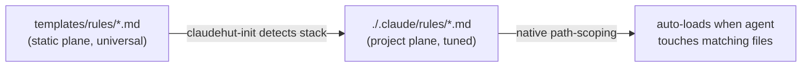
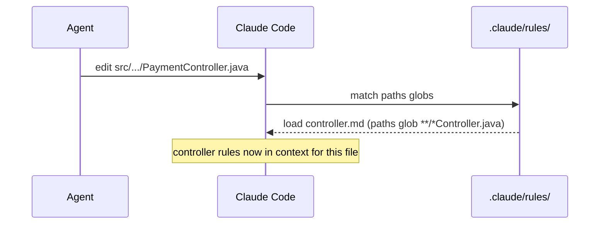

# ClaudeHut Design — 05. Rules

> Part of the **ClaudeHut** design document set. See [README](./README.md). Rule bindings are fixed in [02 §4.3](./02-architecture.md#43-rules-project-generated-path-scoped--see-05).
> **Status:** Design v1 · **Pillar focus:** P3 (project-adaptive), P6 (native). **Native mechanism:** `.claude/rules/*.md` path-scoping + CLAUDE.md hierarchy.

Rules are the project's coding standards expressed so they **auto-load exactly when relevant** — when the agent touches a matching file — with zero model decision. This document defines the rule set, the path-scoping model, and the critical native constraint that forces rules to be *project-generated*, not plugin-shipped.

## Table of Contents

- [1. The native constraint that shapes everything](#1-the-native-constraint-that-shapes-everything)
- [2. How rule loading works](#2-how-rule-loading-works)
- [3. Templates → generated rules (the adaptation step)](#3-templates--generated-rules-the-adaptation-step)
- [4. The rule set](#4-the-rule-set)
- [5. Rule file anatomy](#5-rule-file-anatomy)
- [6. Always-on vs path-scoped](#6-always-on-vs-path-scoped)
- [7. Rules vs skills — when to use which](#7-rules-vs-skills--when-to-use-which)

---

## 1. The native constraint that shapes everything

A Claude Code **plugin cannot ship `.claude/rules/` or `CLAUDE.md`**. A plugin's recognised component directories are `agents/`, `skills/`, `commands/`, `hooks/`, `output-styles/`, `themes/`, plus `.mcp.json` and `.lsp.json`. There is no plugin `rules/` slot, and path-scoped auto-loading only operates on files physically under `${CLAUDE_PROJECT_DIR}/.claude/rules/` (or `~/.claude/rules/`).

**Consequence (this is the whole design of rules):** ClaudeHut ships rule **templates** in the static plane (`${CLAUDE_PLUGIN_ROOT}/templates/rules/`), and the `claudehut-init` Bootstrap ([04 §3](./04-skills.md#claudehut-init)) **generates** the real, project-tuned rules into `${CLAUDE_PROJECT_DIR}/.claude/rules/`. This is not a workaround — it is exactly why the same plugin produces *different* rules per project (P3). The templates carry universal Java/Spring best practice; Bootstrap fills in the project's detected specifics (package roots, layer names, build tool, chosen messaging tech).



## 2. How rule loading works

Two native behaviors, both from the memory/CLAUDE.md system:

- **Always-on rules** — a `.claude/rules/*.md` file with **no `paths:` frontmatter** loads at session start, same priority as `.claude/CLAUDE.md`.
- **Path-scoped rules** — a file with `paths:` globs loads **on demand** the moment the agent reads or writes a file matching the glob. Pattern syntax: `**/*.java`, `src/**/*`, `*.{java,kt}`.

This gives ClaudeHut precise, low-token control: a Controller standard is in context only while editing a controller, not bloating every turn.



## 3. Templates → generated rules (the adaptation step)

During Bootstrap, `claudehut-init` performs detection and **stack-gated** emission (the templates carry a
`stack:` frontmatter tag; init emits a stack-tagged rule only when the detected stack matches):

| Detected | Drives |
|----------|--------|
| Build tool (`pom.xml` / `build.gradle`) | verify command referenced in `testing/*`; `coding/logging-mdc.md` |
| Base package (most common package root) | always-on `project-structure.md` / `vocabulary.md` content; optional `paths:` narrowing |
| Layer convention (controller/service/repository packages) | always-on `project-structure.md` |
| Web stack (MVC vs WebFlux) | emit `framework/spring-mvc.md` **or** `framework/webflux.md` + `performance/backpressure.md` + `testing/stepverifier.md` |
| ORM (Hibernate/JPA vs R2DBC) | emit `framework/jpa.md` **or** `framework/r2dbc.md` |
| Messaging tech (Kafka/RabbitMQ/NATS) | emit the matching `framework/{kafka-consumer,kafka-producer,rabbitmq,nats}.md` |
| Cache (Redis) | emit `framework/redis.md` + `performance/caching.md` |
| MapStruct present | emit `framework/mapstruct.md` |

Universal rules (all of `coding/`, `architecture/`, `security/`, the non-reactive `testing/` files, and the
Lombok/`records-sealed` style rules) are emitted regardless of stack. Generated rules are **committed to the
repo** by the team, so they become shared project memory — and a human can edit them. ClaudeHut treats a
hand-edited rule as authoritative and will not overwrite it on re-Bootstrap (it diffs and asks). See [07 §3](./07-memory-architecture.md#3-bootstrapping-a-new-project).

## 4. The rule set — organized by tech-stack domain

Bound to phases per [02 §4.3](./02-architecture.md#43-rules-project-generated-path-scoped--see-05). Phase is mostly **Implement** (rules govern how code is written), with the always-on rules supporting **Brainstorm** (grounding the codebase-adapted options) and **every rule audited in Review** against the enforcement set ([01 §7](./01-agentic-workflow.md#7-the-enforcement-set-applying-the-1-rule)).

Rules are the project's **tech-stack depth layer** — terse, concrete DO/DON'T standards with correct/anti-pattern examples, auto-loaded by `paths:` exactly when the agent touches a matching file. The set is organized into six domains under `templates/rules/`, plus two always-on project-identity rules at the root. Each carries `paths:`, a `severity:`, and (for stack-specific ones) a `stack:` tag used by [§3](#3-templates--generated-rules-the-adaptation-step) gating.

| Domain | Files | Representative `paths:` triggers | Governs |
|--------|-------|----------------------------------|---------|
| _root (always-on)_ | `project-structure.md`, `vocabulary.md` | — (no `paths:`) | package/layer map; the vocabulary lock |
| `architecture/` | `package-layout`, `hexagonal`, `ddd`, `cqrs`, `adr-format` | `**/*.java`, `docs/adr/**` | layering, aggregate/VO/domain-event discipline, command/query split, ADR format |
| `coding/` | `naming`, `exception`, `null-safety`, `optional-stream`, `immutability`, `records-sealed`, `logging-mdc` | `**/*.java` | naming + layer suffixes, exception hierarchy → `ProblemDetail`, null-safety, `Optional`/`Stream`, immutability, records/sealed, SLF4J+MDC |
| `framework/` | `spring-mvc`, `webflux`, `jpa`, `r2dbc`, `kafka-consumer`, `kafka-producer`, `rabbitmq`, `nats`, `redis`, `jackson`, `mapstruct`, `flyway-naming`, `migration-safety`, `lombok-annotations`, `lombok-builder`, `lombok-jpa-safety`, `transaction-propagation` *(v0.4)*, `virtual-threads` *(v0.4)* | `**/*Controller.java`, `**/*Handler.java`, `**/*Entity.java`, `**/*Listener*.java`, `**/db/migration/V*.sql`, `**/*Service.java`, … | per-framework standards; **stack-gated** by `stack:` (e.g. `web=webflux`, `orm=r2dbc`, `messaging=kafka`) |
| `performance/` | `n-plus-one`, `indexing`, `connection-pool`, `caching`, `backpressure`, `postgres-locking` *(v0.4)* | `**/*Repository.java`, `**/db/migration/V*.sql`, `**/application*.yml`, `**/*Handler.java` | N+1, index design, pool sizing, cache TTL, reactive backpressure, lock contention/SKIP LOCKED/online DDL |
| `security/` | `spring-security`, `owasp-top10`, `input-validation`, `deserialization`, `secret-mgmt`, `actuator`, `jwt-validation` *(v0.4)* | `**/SecurityConfig*.java`, `**/*Controller.java`, `**/*.java`, `**/application*.yml`, `**/*Jwt*.java` | deny-by-default authz, OWASP Top 10, validation, safe deserialization, secret mgmt, actuator exposure, JWT/JWKS validation |
| `testing/` | `junit5`, `mockito`, `given-when-then`, `tdd-cycle`, `testcontainers`, `wiremock`, `stepverifier`, `coverage` | `**/*Test.java`, `**/*IT.java` | Jupiter+AssertJ, Mockito discipline, GWT structure, RED→GREEN→REFACTOR, Testcontainers, WireMock, `StepVerifier`, coverage bars |

> Reuse provenance: these rules are **reused and enhanced** from the project's previously-committed `rules/` set ([git history]) — high-quality, example-rich standards, kept as the canonical tech-stack layer rather than rewritten. CRITICAL-severity rules (e.g. `framework/migration-safety.md`, `framework/lombok-jpa-safety.md`, `security/spring-security.md`, `security/deserialization.md`, `security/secret-mgmt.md`) are surfaced first by the Review auditors.
>
> Relationship to skills (post-consolidation): there is **no longer a sibling domain skill per rule**. The single `implement` skill ([04](./04-skills.md)) carries the deeper, on-demand *playbooks* (e.g. `references/jpa.md`, `references/reactive.md`) in its `references/`; the **rule** is the short always-applied standard that auto-loads by path. Rule reminds, skill teaches.
>
> **v0.4 expert-depth pass (Issue 4, audit-driven):** the shallow half of the bimodal library was raised to the playbooks' level — P1 upgrades `jpa` (EAGER-default, open-in-view, JOIN-FETCH+Pageable), `webflux` (operator decision tables, Context propagation, error recovery), `redis` (`sync=true`, stampede ladder, serializer), `spring-mvc` (ProblemDetail contract, advice ordering, pagination cap); P2 additions `transaction-propagation`, `postgres-locking`, `jwt-validation`; P3 `virtual-threads` + top-ups to `kafka-consumer` (rebalance, backoff), `testcontainers` (`@ServiceConnection`, singleton, Ryuk), `wiremock` (3.x lifecycle, isolation), `caching` (stampede at scale, write strategies). Rule files stay ≤~160 lines (edit-time token budget); learner-promoted pitfalls append under `## Learned pitfalls` ([07 §5.4](./07-memory-architecture.md)). **Out of scope, recorded for future coverage:** observability/Micrometer-OTel, Resilience4j, saga, ShedLock, Spring Batch — real gaps found by the audit but outside the plugin's stated target domains; adding them now would be sprawl.

## 5. Rule file anatomy

A generated rule (after Bootstrap filled the project specifics):

```markdown
---
paths:
  - "com/acme/**/*Controller.java"
---
# Controller rules (auto-loaded when editing a controller)

<!-- generated by claudehut-init v1 from templates/rules/controller.md; safe to edit -->

- Controllers are **thin**: validate input, call one service method, map the result. No business logic, no repository calls.
- Accept/return **DTOs**, never JPA entities (see persistence.md).
- Validate with `@Valid` + bean validation; map errors via the project `@RestControllerAdvice` (`com.acme.web.ApiExceptionHandler`).
- Vocabulary: in this project a "controller" is an inbound adapter (see vocabulary.md).
```

Note the HTML comment marker — block-level HTML comments are stripped before injection, so the provenance note costs no tokens but tells humans/Bootstrap the file's origin.

## 6. Always-on vs path-scoped

| | Always-on | Path-scoped |
|--|-----------|-------------|
| Frontmatter | no `paths:` | `paths:` globs |
| Loads | session start | on touching a matching file |
| Use for | small, universal context (structure, vocabulary) | per-layer standards (keep them out of context until relevant) |
| Token cost | every session | only when relevant |
| ClaudeHut files | `project-structure.md`, `vocabulary.md` | the entire `architecture/ coding/ framework/ performance/ security/ testing/` tree |

Only the two project-identity files are truly always-on (both short). The rest are path-scoped — note that the cross-cutting `coding/` and several `architecture/`/`security/` rules use a broad `**/*.java` glob, so they load whenever the agent touches *any* Java file (but still cost nothing on non-Java turns), while the per-framework and per-layer rules use narrow globs and appear only for their file type.

## 7. Rules vs skills — when to use which

A frequent design question; the split is deliberate:

| Aspect | Rule (`.claude/rules/`) | Skill (`skills/`) |
|--------|-------------------------|-------------------|
| Nature | a **standard** to hold while editing | a **procedure/playbook** to follow |
| Loading | deterministic, by file path | model-decided, by `description` match (or `paths:` on the skill) |
| Length | short (a checklist) | longer, with companion references |
| Project-specificity | high — generated per project | mostly universal; pulls project values from rules |
| Example | "controllers return DTOs" (`framework/spring-mvc.md`) | "how to refactor an N+1" (`implement` → `references/jpa.md`) |
| Enforcement strength | passive context | can carry Iron Laws + dispatch subagents |

Rule of thumb: **if it's a line the agent must always honor in a given file, it's a rule; if it's a multi-step technique, it's a skill.** They reinforce each other — the rule reminds, the skill teaches, and (for gated phases) the hook blocks.

---

**Prev:** [← 04. Skills](./04-skills.md) · **Next:** [06. Hooks →](./06-hooks.md)
