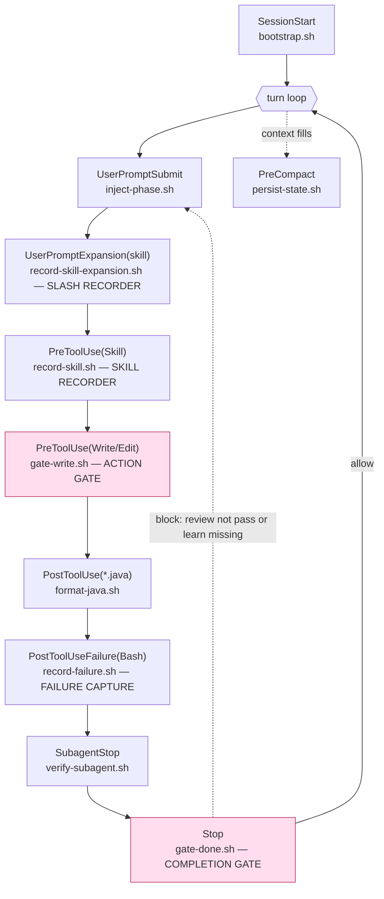

# ClaudeHut Design — 06. Hooks

> Part of the **ClaudeHut** design document set. See [README](./README.md). Hook bindings are fixed in [02 §4.4](./02-architecture.md#44-hooks--see-06).
> **Status:** Design v1 · **Pillar focus:** P1 (enforcement), P5 (persistence), P6 (native). **Native mechanism:** plugin `hooks/hooks.json` + the hook I/O protocol.

Hooks are ClaudeHut's only **deterministic** enforcement — they are code, not model judgment, so they cannot be rationalized away. This document specifies each hook's event, matcher, the JSON it reads, the JSON/exit-code it returns, and — stated honestly — **exactly what it can and cannot enforce**.

## Table of Contents

- [1. The hook I/O protocol (what we rely on)](#1-the-hook-io-protocol-what-we-rely-on)
- [2. hooks.json (the manifest)](#2-hooksjson-the-manifest)
- [3. Hook specs](#3-hook-specs)
  - [bootstrap.sh — SessionStart](#bootstrapsh--sessionstart)
  - [inject-phase.sh — UserPromptSubmit](#inject-phasesh--userpromptsubmit)
  - [record-skill-expansion.sh — UserPromptExpansion (slash skill-rail, P1-3)](#record-skill-expansionsh--userpromptexpansion-slash-skill-rail-p1-3)
  - [gate-write.sh — PreToolUse (action gate)](#gate-writesh--pretooluse-action-gate)
  - [format-java.sh — PostToolUse](#format-javash--posttooluse)
  - [record-failure.sh — PostToolUseFailure (failure capture)](#record-failuresh--posttoolusefailure-failure-capture)
  - [gate-done.sh — Stop (completion gate)](#gate-donesh--stop-completion-gate)
  - [verify-subagent.sh — SubagentStop](#verify-subagentsh--subagentstop)
  - [persist-state.sh — PreCompact](#persist-statesh--precompact)
- [4. What hooks honestly can and cannot do](#4-what-hooks-honestly-can-and-cannot-do)
- [5. Failure modes and escape hatches](#5-failure-modes-and-escape-hatches)

---

## 1. The hook I/O protocol (what we rely on)

Every hook process receives a JSON payload on stdin and signals decisions via **exit code** and/or **structured JSON on stdout**:

| Signal | Meaning |
|--------|---------|
| exit `0` + JSON stdout | success; JSON is processed |
| exit `2` | **blocking** error; for pre-events the action/turn is blocked, stderr is fed to Claude |
| other non-zero | non-blocking; logged only, execution continues |

The structured outputs ClaudeHut uses:

- `PreToolUse` → `hookSpecificOutput.permissionDecision: "deny"` + `permissionDecisionReason` + `additionalContext`.
- `Stop` / `SubagentStop` → `decision: "block"` + `reason`.
- `SessionStart` / `UserPromptSubmit` → `hookSpecificOutput.additionalContext` (and for SessionStart: `watchPaths`, `reloadSkills`); `systemMessage` (top-level, user-visible) for bootstrap prompts.

All scripts live in `${CLAUDE_PLUGIN_ROOT}/scripts/` and read project state from the **per-session** file `${CLAUDE_PROJECT_DIR}/.claude/claudehut/state/<session_id>.json`, where `<session_id>` comes from the hook-input `session_id` field — this per-session keying is the concurrency fix in [01 §4.1](./01-agentic-workflow.md#41-concurrency-and-worktree-isolation-collision-safe-state). They **never write the state file** — the only writer is `bin/claudehut-state` ([01 §4](./01-agentic-workflow.md#4-the-phase-state-machine)).

Where each hook fires across the session/turn lifecycle:



## 2. hooks.json (the manifest)

```json
{
  "hooks": {
    "SessionStart": [
      { "matcher": "startup|clear|compact",
        "hooks": [{ "type": "command", "command": "${CLAUDE_PLUGIN_ROOT}/scripts/bootstrap.sh", "timeout": 15 }] }
    ],
    "UserPromptSubmit": [
      { "hooks": [{ "type": "command", "command": "${CLAUDE_PLUGIN_ROOT}/scripts/inject-phase.sh", "timeout": 10 }] }
    ],
    "UserPromptExpansion": [
      { "matcher": "implement|discover|brainstorm",
        "hooks": [{ "type": "command", "command": "${CLAUDE_PLUGIN_ROOT}/scripts/record-skill-expansion.sh" }] }
    ],
    "PreToolUse": [
      { "matcher": "Write|Edit|MultiEdit",
        "hooks": [{ "type": "command", "command": "${CLAUDE_PLUGIN_ROOT}/scripts/gate-write.sh" }] },
      { "matcher": "Skill",
        "hooks": [{ "type": "command", "command": "${CLAUDE_PLUGIN_ROOT}/scripts/record-skill.sh" }] }
    ],
    "PostToolUse": [
      { "matcher": "Write|Edit",
        "hooks": [{ "type": "command", "command": "${CLAUDE_PLUGIN_ROOT}/scripts/format-java.sh", "async": true }] }
    ],
    "PostToolUseFailure": [
      { "matcher": "Bash",
        "hooks": [{ "type": "command", "command": "${CLAUDE_PLUGIN_ROOT}/scripts/record-failure.sh", "async": true }] }
    ],
    "Stop": [
      { "hooks": [{ "type": "command", "command": "${CLAUDE_PLUGIN_ROOT}/scripts/gate-done.sh" }] }
    ],
    "SubagentStop": [
      { "hooks": [{ "type": "command", "command": "${CLAUDE_PLUGIN_ROOT}/scripts/verify-subagent.sh" }] }
    ],
    "PreCompact": [
      { "hooks": [{ "type": "command", "command": "${CLAUDE_PLUGIN_ROOT}/scripts/persist-state.sh", "timeout": 10 }] }
    ]
  }
}
```

**Auto-discovered**, not referenced from `plugin.json`. The standard `hooks/hooks.json` is loaded automatically;
the manifest must stay **pure metadata** (re-declaring `hooks`/`agents`/`skills` there breaks runtime load — the
P6 over-declare bug, EVAL-REPORT #1, now guarded by the conformance manifest-purity check + CI).

## 3. Hook specs

Each: **Event · Matcher · Reads · Returns · Enforces · Phase · Honest limits**.

### bootstrap.sh — SessionStart
- **Event/Matcher:** `SessionStart` on `startup|clear|compact`.
- **Reads:** `source`, `cwd`; checks for `${CLAUDE_PROJECT_DIR}/.claude/claudehut/` (the prerequisite index); reads `enabledPlugins` from the settings hierarchy (or runs `claude plugin list`) to **detect the `understand-anything` plugin**.
- **Returns:** `additionalContext` = the `claudehut-workflow` orchestrator body **+ top-N learnings** (parsed from `learnings.jsonl`, ranked by confidence×recency) **+ the plugin-detection flag** (`understand-anything: enabled|absent`, which the `claudehut:discover` skill's explore step branches on). Sets `watchPaths` to the `.claude/claudehut/` dir and `reloadSkills: true` (always — idempotent and cheap; a conditional emit saved nothing). **Migrates rule templates (v0.4):** stamps the plugin version at `.claude/claudehut/.plugin-version`; on mismatch runs `claudehut-init --refresh-rules` (rule tree only — `MEMORY.md`/`PROJECT.md`/`LANGUAGE.md` are user-editable and never clobbered; learner-promoted `## Learned pitfalls` sections are carried over). **Arms the gate (opt #1):** also writes an initial `state/<session_id>.json` (`phase=discover`, `reuse_scan=false`, `complexity=full`) for this session if none exists, so `gate-write.sh` is live from turn 1 — without this the write gate fails open until the agent *voluntarily* starts the workflow (measured gap: agents skipped it, see EVAL-REPORT #2). **Auto-bootstraps the plane (opt #3 fallback):** when `.claude/claudehut/` is **absent**, it runs `bin/claudehut-init` directly (stdout suppressed) to generate the project plane deterministically — the skill's `!`backtick`` invocation was measured **flaky (2/3)** in P7, so bootstrap removes the model from invocation entirely. If that fallback could not run, emits a top-level `systemMessage` prompting the user to run `/claudehut:init`.
- **Enforces:** the Workflow is loaded **before turn 1** (non-optional); the agent starts each session primed with this project's learnings (P5 read-path); and the conditional understand-anything integration is resolved **here**, because there is no native runtime cross-plugin branch ([01 §3](./01-agentic-workflow.md#3-prerequisite-the-codebase-index-not-a-phase)).
- **Phase:** all (entry) + the Bootstrap prerequisite.
- **Honest limits:** only affects context at session start; cannot enforce anything later in the session. Plugin detection is a **hook-script read of settings**, not a native declarative dependency.
- **Pseudo-logic:**
  ```bash
  payload=$(cat); dir="$CLAUDE_PROJECT_DIR/.claude/claudehut"
  ctx=$(cat "$CLAUDE_PLUGIN_ROOT/skills/claudehut-workflow/SKILL.md")
  if [ -f "$dir/learnings.jsonl" ]; then
    ctx="$ctx\n\n## Learnings for this project\n$("$CLAUDE_PLUGIN_ROOT/scripts/inject-learnings.sh" --top 12)"
  fi
  # cross-plugin detection (no native runtime branch exists) — read enabledPlugins
  if claude plugin list --json 2>/dev/null | jq -e '.[] | select((.id | startswith("understand-anything@")) and (.enabled // false))' >/dev/null; then
    ctx="$ctx\n\n## understand-anything: enabled — Discover MUST use its query/search skills."
  else
    ctx="$ctx\n\n## understand-anything: absent — Discover uses claudehut-explorer + Grep."
  fi
  # emit systemMessage if deterministic fallback could not run
  need_init=false
  { [ ! -d "$dir" ] && ! $INITED; } && need_init=true
  jq -n --arg ctx "$ctx" --argjson need "$need_init" '
    {hookSpecificOutput:{hookEventName:"SessionStart",additionalContext:$ctx,watchPaths:[$dir],reloadSkills:true}}
    + (if $need then {systemMessage:"ClaudeHut: no codebase index found. Run /claudehut:init to bootstrap this project."} else {} end)'
  ```

### inject-phase.sh — UserPromptSubmit
- **Event/Matcher:** `UserPromptSubmit` (all).
- **Reads:** `prompt`, `state.json`.
- **Returns:** `additionalContext` = "Current phase: `<phase>`. Next allowed step: `<…>`." plus up to ~5 learnings whose `trigger` keyword-matches the prompt (targeted retrieval). **In the entry (`discover`) phase it also adds a Phase-0 triage reminder** (run `set-complexity` — cost lever B.2: keeps trivial/small tasks off the default `full` lane, which runs all 7 phases).
- **Enforces:** every turn re-anchors to the current phase and surfaces relevant prior learnings — keeps the Workflow salient across a long session and feeds the reuse instinct.
- **Phase:** all.
- **Honest limits:** advisory context only; does not block. (Blocking lives in the gate hooks.)

### record-skill-expansion.sh — UserPromptExpansion (slash skill-rail, P1-3)
- **Event/Matcher:** `UserPromptExpansion` on `implement|discover|brainstorm` (matches the bare `command_name`).
- **Reads:** `session_id`, `command_name` (the matched skill; also tolerates `.tool_input.skill` and a leading `/claudehut:<skill>` parsed from `expanded_prompt`/`prompt`).
- **Returns:** nothing (always allow) — a **recorder, not a gate**, mirroring `record-skill.sh`. Calls `claudehut-state mark-skill <name>`.
- **Enforces:** closes the **slash-command bypass** of the skill rail. `record-skill.sh` only fires on `PreToolUse(Skill)` (the model calling the Skill *tool*); a user typing `/claudehut:implement` expands via `UserPromptExpansion` instead, which never hit `PreToolUse` — so the rail stayed closed and wedged slash-invokers (fail-closed). This recorder opens/closes the rail on that path identically.
- **Phase:** all (observes slash skill invocations).
- **Honest limits:** same as `record-skill.sh` — targets drift, not adversarial agents; the matcher relies on the bare-command-name semantics verified against current hooks docs.

### record-skill.sh — PreToolUse (skill recorder, Issue 1)
- **Event/Matcher:** `PreToolUse` on `Skill`.
- **Reads:** `session_id`, `tool_input.skill` (live-probed payload shape: `{"tool_input":{"skill":"<name>"}}`; qualified `claudehut:implement` names tolerated).
- **Returns:** nothing (always allow) — it is a **recorder, not a gate**. Calls `claudehut-state mark-skill <name>`: `implement` → `implement_skill_ok=true`; `discover`/`brainstorm` → reset to `false` (new-task boundary); other skills are no-ops.
- **Enforces:** the *proof* the action gate's skill rail consumes. Because the flag is set by a hook firing on the **actual Skill tool call**, the model cannot satisfy the rail without genuinely loading the implement skill body (Iron Law, rules table, dispatch discipline) into context. Measured pre-fix bypass: **69% (11/16 real tasks)** wrote production code with zero `Skill(implement)` calls.
- **Phase:** all (it observes every skill invocation).
- **Honest limits:** a determined agent can still fake the flag via raw Bash (`claudehut-state mark-skill implement` or editing the state file) — the rail targets **drift, not adversarial agents** (all measured bypasses were drift: every session complied as soon as a gate pushed back). `set-bypass true` remains the single documented escape hatch.

### gate-write.sh — PreToolUse (action gate)
- **Event/Matcher:** `PreToolUse` on `Write|Edit|MultiEdit`.
- **Reads:** `tool_input.file_path`; the per-session state file `state/<session_id>.json` (keyed by the hook-input `session_id`) — fields `reuse_scan`, `reuse_scan_artifact`, `spec_path`, `plan_path`, `phase`, `bypass`, `complexity`, `implement_skill_ok`.
- **Returns:** on violation, `permissionDecision: "deny"` + `permissionDecisionReason` naming what's missing + `additionalContext` telling the agent which skill to run. On pass, no decision (allow).
- **Enforces (the P4 hard gate, tier-aware):** Rail 1 (all tiers): **reuse-scan artifact must exist** (no new production code until `reuse_scan=true` AND artifact file exists under `.claude/claudehut/`). Rail 2 (trivial/small fast lane): if `complexity` is `trivial` or `small` AND the deterministic bound holds (≤2 production files touched in this session, no security/auth/migration path), proceed to the skill rail — Spec and Plan are not required. If the bound is exceeded, **deny and tell the agent to escalate** (`set-complexity full` → Spec + Plan). Rail 3 (full tier): **spec and plan must also exist** (artifact files, not just state flags). **Skill rail (all tiers, Issue 1, checked last in both branches so deny messages arrive in workflow order):** `implement_skill_ok=true` required — i.e. `claudehut:implement` was **invoked for this task** (set only by `record-skill.sh`, reset at every `set-phase discover|brainstorm` task boundary, so multi-task sessions need one invocation **per task**, not per session). This is an **action gate** — it blocks the write keystroke, deterministically.
- **Phase:** boundary of Discover → Implement (and Spec/Plan → Implement in the full tier).
- **Honest limits:** it gates *writes to production paths only*; it deliberately **allows** writes to `.claude/claudehut/**` (so reuse-scan/spec/plan files can be created) and to test paths during TDD's RED step. It cannot force the agent to *think well* — only to have produced the artifacts.
- **Pseudo-logic (tier-aware):**
  ```bash
  in=$(cat); sid=$(jq -r '.session_id' <<<"$in"); fp=$(jq -r '.tool_input.file_path' <<<"$in")
  s=$(cat "$CLAUDE_PROJECT_DIR/.claude/claudehut/state/$sid.json" 2>/dev/null || echo '{}')  # missing → {} → fails open
  case "$fp" in *".claude/claudehut/"*|*"/test/"*|*"Test.java"|*"IT.java") allow ;; esac
  [ "$(jq -r '.bypass' <<<"$s")" = "true" ] && allow
  # exists_canon: recorded path must EXIST under .claude/claudehut/
  tier=$(jq -r '.complexity // "full"' <<<"$s")
  # Rail 1 (all tiers): reuse-scan required
  if [ "$(jq -r '.reuse_scan' <<<"$s")" != "true" ]; then
    deny "Run claudehut:discover first — no reuse-scan artifact for this task."
  elif ! exists_canon "$(jq -r '.reuse_scan_artifact' <<<"$s")"; then
    deny "reuse-scan flag set but no artifact file under .claude/claudehut/ — write it there."
  fi
  # Skill rail (all tiers, Issue 1): implement skill must have been INVOKED for this task
  require_skill() { [ "$(jq -r '.implement_skill_ok // false' <<<"$s")" = "true" ] || deny "Invoke claudehut:implement (one Skill call), then retry."; }
  # Fast lane (trivial|small): skip Spec/Plan, but verify the bound deterministically
  if [ "$tier" = "trivial" ] || [ "$tier" = "small" ]; then
    if fastlane_bound_ok; then require_skill; allow; fi  # ≤2 prod files, no security/auth/migration path
    deny "fast-lane cap exceeded (${FAIL_REASON}) — escalate: set-complexity full → write-spec + write-plan."
  fi
  # Full tier: spec + plan required
  [ "$(jq -r '.spec_path' <<<"$s")" = "null" ] && deny "Write the spec first — run claudehut:write-spec."
  ! exists_canon "$(jq -r '.spec_path' <<<"$s")" && deny "spec recorded but file missing under .claude/claudehut/."
  [ "$(jq -r '.plan_path' <<<"$s")" = "null" ] && deny "Write a plan first — run claudehut:write-plan."
  ! exists_canon "$(jq -r '.plan_path' <<<"$s")" && deny "plan recorded but file missing under .claude/claudehut/."
  require_skill
  allow
  ```
  (`deny`/`allow` emit the `permissionDecision` JSON.)

### format-java.sh — PostToolUse
- **Event/Matcher:** `PostToolUse` on `Write|Edit`, `async: true`. **No `if` condition** (v0.6.0 decision, audit C.2): an `if` would save nothing here — the hook is already `async` (off the critical path) and self-guards on `*.java` internally; a glob mismatch in an `if` could silently *disable* formatting for nested paths. `if` is reserved for sync, critical-path filtering, and the one sync hook (`gate-write`) must inspect every write, so it gets no `if` either (a filter there risks a gate bypass).
- **Reads:** `tool_input.file_path`.
- **Returns:** nothing blocking (async, non-blocking exit).
- **Enforces:** consistent formatting via `google-java-format`/`palantir-java-format` so the reviewer agents never waste signal on style nits.
- **Phase:** Implement.
- **Honest limits:** cosmetic only; runs after the edit, never blocks it.

### record-failure.sh — PostToolUseFailure (failure capture)
- **Event/Matcher:** `PostToolUseFailure` on `Bash`, `async: true`.
- **Reads:** `session_id`, `tool_name`, `tool_input.command`, `tool_error.{exit_code,type,stderr}`.
- **Returns:** nothing (non-blocking — the tool already failed). Appends a compact record to the **session-scoped, ephemeral** `state/<session_id>.failures.jsonl` (deduped against the previous entry, capped at 20).
- **Enforces (P5 signal, not gate):** gives the Learn phase real build/test-failure signal to curate. It deliberately does **NOT** write the curated `learnings.jsonl` directly — many Bash failures are intentional (TDD RED runs, expected non-zero exits), so auto-promotion would pollute the store. `capture-learnings` reads the staging file as *candidate* signal and the learner filters out RED/one-off noise.
- **Phase:** Implement / Review (wherever Bash runs).
- **Honest limits:** captures only what a failed Bash call exposes; cannot tell an intentional RED from a real regression — that judgment is the learner's.

### gate-done.sh — Stop (completion gate)
- **Event/Matcher:** `Stop` (all).
- **Reads:** the per-session state file `state/<session_id>.json` (keyed by the hook-input `session_id`) — fields `review`, `phase`, `bypass` — and the hook input field `stop_hook_active`.
- **Returns:** on violation, `decision: "block"` + `reason` ("Review not passed" or "Learn not run"). Otherwise allow.
- **Enforces (the discipline gate):** **the agent may not end its turn claiming done until `review=pass` AND the Learn pass has run** — but (opt #1 engaged-guard) only once the workflow is **engaged** (reuse-scan done, or a spec/plan recorded, or phase past brainstorm). A freshly *armed* brainstorm session that did no workflow work is not blocked, so non-coding sessions stay usable while the write gate remains armed. This is the superpowers "verification-before-completion" rule made deterministic, extended to the Review compliance loop.
- **Phase:** Review → Learn boundary.
- **Honest limits:** `Stop` fires at **turn end**, not on every intra-turn phase change — so it enforces *completion order*, not *mid-turn* ordering (that's the skills' Iron Laws). It is also **capped natively**: Claude Code blocks at most ~8 consecutive `Stop` hooks (`stop_hook_active`). So the Review loop ([01 §8](./01-agentic-workflow.md#8-the-review-loop-and-its-exit-condition)) cannot block forever — when the cap is hit, this hook **degrades gracefully**: it stops blocking, leaves `review=capped`, and surfaces the remaining `outstanding` items to the user.
- **Pseudo-logic:**
  ```bash
  in=$(cat); sid=$(jq -r '.session_id' <<<"$in")
  s=$(cat "$CLAUDE_PROJECT_DIR/.claude/claudehut/state/$sid.json" 2>/dev/null || echo '{}')
  [ "$(jq -r '.bypass' <<<"$s")" = "true" ] && exit 0
  # honor the native consecutive-Stop cap — never wedge the session
  [ "$(jq -r '.stop_hook_active' <<<"$in")" = "true" ] && exit 0   # cap reached → allow, surface outstanding
  r=$(jq -r '.review' <<<"$s"); p=$(jq -r '.phase' <<<"$s")
  # opt #1 engaged-guard: don't enforce completion on an armed-but-unused session
  engaged=$(jq -r 'if (.reuse_scan==true) or (.spec_path!=null) or (.plan_path!=null)
                   or (.phase|IN("plan","implement","review","learn")) then "y" else "n" end' <<<"$s")
  [ "$engaged" = y ] || exit 0
  if [ "$r" != "pass" ]; then block "Review not passed — run claudehut:review until outstanding is empty (with fresh evidence)."
  elif [ "$p" != "learn" ]; then block "Learn pass not run — run claudehut:capture-learnings before finishing."
  fi
  ```

### verify-subagent.sh — SubagentStop
- **Event/Matcher:** `SubagentStop` (all; can match on `agent_type`). *(The script verifies subagent **output** — it is named for the verb, not the retired phase.)*
- **Reads:** `agent_type`, transcript path.
- **Returns:** `decision: "block"` if a file-producing phase subagent returned without its required artifact: `claudehut-reuse-scanner` must produce `tasks/*/reuse-scan.md` (legacy `reuse-scan-*.md` also accepted); `claudehut-planner` must produce `tasks/*/plan.md` (legacy `plans/*.md` also accepted). Review auditors return findings as text and are not file-checked here.
- **Enforces:** subagents complete their contract — an auditor/scanner/planner can't return empty-handed and let the main thread proceed on a false premise.
- **Phase:** Discover/Plan/Review.
- **Honest limits:** can only check for the artifact's existence/shape, not its quality.

### persist-state.sh — PreCompact
- **Event/Matcher:** `PreCompact` (all), synchronous with `timeout: 10` — the snapshot must complete *before* compaction (an async hook could lose that race).
- **Reads:** `state.json`, in-flight learnings.
- **Returns:** non-blocking.
- **Enforces (P5 durability):** flush any pending learnings to `learnings.jsonl` and snapshot `state.json` before context is compacted, so a long session that compacts mid-task does not lose its phase position or learnings.
- **Phase:** all.
- **Honest limits:** best-effort; relies on the agent having staged learnings.

## 4. What hooks honestly can and cannot do

A consolidated truth table (the advisor's correctness requirement):

| Goal | Right hook | Can it? |
|------|-----------|---------|
| Load the workflow before turn 1 | `SessionStart` `additionalContext` | ✅ yes |
| Block writing new code before reuse-scan (all tiers) + spec+plan (full tier) | `PreToolUse` `deny` | ✅ yes (blocks the action; fast-lane bound verified deterministically) |
| Block writing new code until `claudehut:implement` was **invoked for this task** (skill rail, Issue 1) | `PreToolUse(Skill)` recorder + `PreToolUse(Write\|Edit)` `deny` | ✅ yes — the proof flag is set only by a hook on the real Skill call; per-task reset at `set-phase discover\|brainstorm` (measured pre-fix bypass: 69%, 11/16 tasks) |
| Block "I'm done" before `review=pass` + Learn | `Stop` `block` | ✅ yes (blocks turn end) |
| Loop Review *forever* until compliant | `Stop` `block` | ⚠️ bounded — Claude blocks at most ~8 consecutive `Stop`s (`stop_hook_active`); the loop degrades to "surface remaining items" at the cap |
| Force test-before-code *within* a turn | — (no hook) | ❌ no — that's the `tdd` Iron Law (skill, in-context) |
| Force the agent to *reason well* | — | ❌ no — hooks gate actions, not thought quality |
| Branch on whether another plugin is installed | `SessionStart` hook reading `enabledPlugins` | ⚠️ only via a hook script — no native runtime cross-plugin field exists |
| Persist learnings across sessions | `PreCompact` + Learn-phase writes + `memory: project` | ✅ yes |
| Verify WHO wrote a gate-satisfying artifact (subagent vs inline) | — | ❌ no — `gate-done.sh`/`gate-write.sh` check file content/existence only, not authorship. Deliberate: it is what lets the trivial/small tiers do inline Discover/Learn (Issue 2) without weakening the artifact contract |

Mid-turn phase ordering is **not** a hook capability and the design never claims it is; ordering inside a turn is the job of the orchestrator + Iron-Law skills ([04 §5](./04-skills.md#5-enforcement-skills-iron-laws)).

## 5. Failure modes and escape hatches

- **`jq`/`bash` missing:** scripts probe for `jq` and degrade to non-blocking (exit 0) if absent — gates fail *open*, never wedging the user. (Roadmap [10](./10-build-roadmap.md) hardens this.)
- **Missing / stale / mismatched-key state file:** the gates **fail open** (allow / don't block) when `state/<session_id>.json` is absent, stale (each entry carries `ts`; state older than a configurable window = "no task in progress"), or keyed under a session id that doesn't match. This is deliberate — never wedge the user — but it means a writer/reader `session_id` mismatch would *silently disable enforcement*; the enforcement-critical gates run on the main thread (same session as the writer) so they agree by construction, and the build gate-tests assert key agreement ([01 §4.1](./01-agentic-workflow.md#41-concurrency-and-worktree-isolation-collision-safe-state)). **Since opt #1**, the SessionStart hook arms an initial state file, so within a ClaudeHut session the write gate is active *by construction* rather than relying on the agent to start the workflow; fail-open now covers only genuine missing/torn-state and non-ClaudeHut sessions, not the "agent skipped the workflow" case (which previously slipped through — EVAL-REPORT #2).
- **Explicit bypass:** `state.json.bypass=true` (set only via `/claudehut:phase --force` → `bin/claudehut-state`) disables the two gate hooks for the session; recorded for audit.
- **Review-loop cap (native):** the `Stop` consecutive-block cap (`stop_hook_active`) is itself a safety valve — `gate-done.sh` honors it and surfaces remaining `outstanding` items rather than blocking forever ([01 §8](./01-agentic-workflow.md#8-the-review-loop-and-its-exit-condition)).
- **Global off switch:** the user's `disableAllHooks` setting turns everything off — ClaudeHut does not fight native settings (P6).

---

**Prev:** [← 05. Rules](./05-rules.md) · **Next:** [07. Memory Architecture →](./07-memory-architecture.md)
