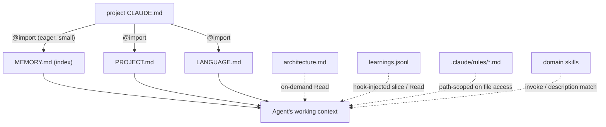
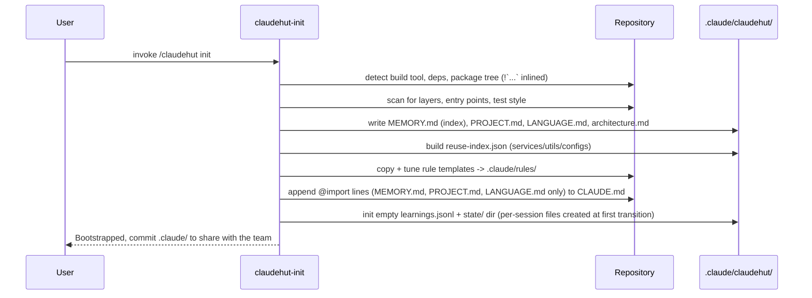
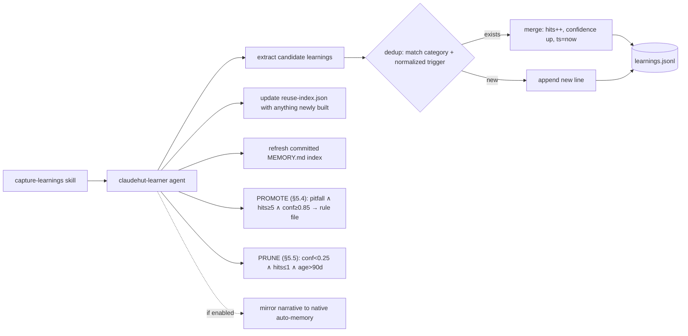
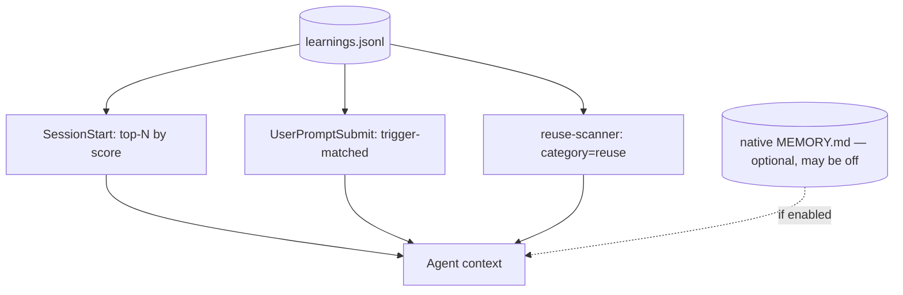
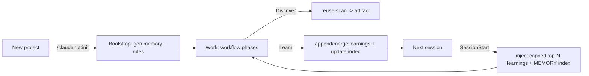

# ClaudeHut Design — 07. Memory Architecture

> Part of the **ClaudeHut** design document set. See [README](./README.md). Memory bindings: [02 §2](./02-architecture.md#2-the-three-planes).
> **Status:** Design v1 · **Pillar focus:** P3 (project-adaptive), P4 (reuse-before-build), P5 (cross-session RL). **Native mechanism:** CLAUDE.md hierarchy + selective `@import` (always-load slice only) + `.claude/rules/` path-scoping + skills progressive disclosure + `${CLAUDE_PROJECT_DIR}`; native auto-memory used only as an optional, non-authoritative mirror (§1.1).

This document defines the three memory behaviors that make ClaudeHut more than a static skill pack: it **adapts to each project**, **reuses before building**, and **learns across sessions**. Each behavior is built on a named native feature; where a structured layer is added on top of a native one, the delta is justified explicitly (P6).

## Table of Contents

- [1. Memory layout (plugin vs project)](#1-memory-layout-plugin-vs-project)
- [2. P3 — Project-adaptive context](#2-p3--project-adaptive-context)
- [3. Bootstrapping a new project](#3-bootstrapping-a-new-project)
- [4. P4 — Reuse before build](#4-p4--reuse-before-build)
- [5. P5 — Cross-session reinforcement learning](#5-p5--cross-session-reinforcement-learning)
- [6. Native auto-memory vs the structured learnings store](#6-native-auto-memory-vs-the-structured-learnings-store)
- [7. Scoping: same plugin, different project](#7-scoping-same-plugin-different-project)
- [8. Lifecycle summary](#8-lifecycle-summary)

---

## 1. Memory layout (plugin vs project)

| Lives in                                                       | Path                                       | What                                                                                                            | Mutable at runtime?               |
| -------------------------------------------------------------- | ------------------------------------------ | --------------------------------------------------------------------------------------------------------------- | --------------------------------- |
| **Plugin (static)**                                            | `${CLAUDE_PLUGIN_ROOT}/templates/`         | rule + memory templates (universal Java/Spring knowledge)                                                       | no (replaced on update)           |
| **Project (generated)**                                        | `${CLAUDE_PROJECT_DIR}/.claude/claudehut/` | this project's context, index, learnings, state, specs, plans                                                   | yes                               |
| **Project (rules)**                                            | `${CLAUDE_PROJECT_DIR}/.claude/rules/`     | generated path-scoped rules ([05](./05-rules.md))                                                               | yes                               |
| **Project CLAUDE.md**                                          | `${CLAUDE_PROJECT_DIR}/CLAUDE.md`          | `@import` lines pointing at the **small always-load slice** only (§1.2)                                         | yes                               |
| **Native auto-memory** _(optional mirror — not authoritative)_ | `~/.claude/projects/<project>/memory/`     | machine-local, user-scoped, **not committable**; may be disabled (`CLAUDE_CODE_DISABLE_AUTO_MEMORY`) — see §1.1 | yes (via `memory: project` agent) |

The generated tree:

```
.claude/claudehut/
├── MEMORY.md             # concise COMMITTED index (always-loaded; names what's stored where) — §1.2
├── PROJECT.md            # stack, build tool, module map, entry points, conventions summary (always-loaded)
├── LANGUAGE.md           # Vocabulary lock — term -> meaning (always-loaded)
├── architecture.md       # package/layer map, dependency direction (ON-DEMAND — not @import-ed)
├── reuse-index.json      # catalog of reusable components — part of the prerequisite index (P4, on-demand)
├── learnings.jsonl       # structured cross-session learnings (P5, on-demand + hook-injected slices)
├── state/                # per-session phase-state files (Item-1 fix) — see [01 §4](./01-agentic-workflow.md#4-the-phase-state-machine)
│   └── <session_id>.json # one file per session/task; gitignored, ephemeral
└── tasks/                # one dir per task (NNNN-<slug>/)
    ├── reuse-scan.md     # Discover artifact (P4)
    ├── spec.md           # implementation spec from Spec phase (subsumes ADR)
    ├── plan.md           # executable plan from Plan phase (T-xxx breakdown; durable source of truth)
    └── review.md         # merged auditor findings + final verdict from Review phase
```

> The `state/` directory is **per-session** to avoid collisions when concurrent tasks/worktree-isolated agents run at once; the scheme and its concurrency guarantees are defined authoritatively in [01 §4](./01-agentic-workflow.md#4-the-phase-state-machine).

**Why here and not `${CLAUDE_PLUGIN_DATA}`?** Project memory is project-shareable team knowledge — it belongs in the repo's `.claude/`, committed to git, where teammates and CI see it. `${CLAUDE_PLUGIN_DATA}` is per-machine plugin state and is the right place only for machine-local caches, not shared project memory.

**The codebase index is the Workflow's prerequisite.** `reuse-index.json` + `architecture.md` (plus `PROJECT.md`) are exactly the **codebase index** the Workflow requires _before_ it runs ([01 §3](./01-agentic-workflow.md#3-prerequisite-the-codebase-index-not-a-phase)). They are built once by Bootstrap and refreshed on the Learn pass — never by a workflow "Explore" phase (there is none). When the `understand-anything` plugin is enabled, its knowledge graph augments this base index; **Discover** (phase 1) _queries_ the index via explorer + reuse-scanner, it does not build it.

### 1.1 Where memory lives — and why not native auto-memory

Claude Code ships a **native auto-memory** directory, but it is the wrong home for ClaudeHut's canonical memory:

- It lives at `~/.claude/projects/<project>/memory/` — **user-scoped and machine-local** (the docs: _"Each project gets its own memory directory at `~/.claude/projects/<project>/memory/` … all worktrees and subdirectories within the same repo share one auto memory directory"_; it is machine-local). It is **never committed to the repo**.
- It is **on by default but can be disabled** (`autoMemoryEnabled: false` / `CLAUDE_CODE_DISABLE_AUTO_MEMORY=1`) — and is disabled in some environments, so a plugin cannot depend on it.

ClaudeHut's P5 requires learnings to _"propagate to every agent in every later session of the same project"_ — **including teammates and CI**. Machine-local memory cannot do that. **Therefore the canonical store is the committed, project-local `.claude/claudehut/` tree, not native auto-memory.** (Citations: `code.claude.com/docs/en/memory.md`.)

What native auto-memory _does_ get right is its **loading discipline**: a concise always-loaded index (`MEMORY.md`, capped at **the first 200 lines or 25 KB**) plus topic files read **on demand**. ClaudeHut **replicates that discipline** over its committed store using native lazy primitives (§1.2). Native auto-memory is used only as an **optional, non-authoritative mirror** (via `claudehut-learner` `memory: project`, [§6](#6-native-auto-memory-vs-the-structured-learnings-store)) for the local developer; the design never reads from it as a source of truth and works fully when it is off.

**Decision:** committed `.claude/claudehut/` (team-shared, queryable, version-controlled) **+** native loading discipline (selective, cost-aware) **≫** native auto-memory alone (machine-local, uncommittable, optional).

### 1.2 Cost-aware context loading

`@import` is **eager** — every imported byte sits in context on _every request_ (docs: _"Imported files are expanded and loaded into context at launch … splitting into `@path` imports … does not reduce context, since imported files load at launch"_). So `@import`-ing the whole `.claude/claudehut/` tree would dump all memory every turn. ClaudeHut therefore imports **only a small always-load slice** and loads everything else **on demand** via native lazy mechanisms. The always-load slice is capped to mirror native auto-memory's discipline (**≤ ~25 KB / ~200 lines total**).

**Always-loaded (small, capped):**

| Item                                                                                 | Native mechanism                                                         | Budget           |
| ------------------------------------------------------------------------------------ | ------------------------------------------------------------------------ | ---------------- |
| `MEMORY.md` — committed index naming what exists + where (points to on-demand files) | CLAUDE.md `@import`                                                      | ≤ ~150 lines     |
| `PROJECT.md` — stack / build / layers                                                | CLAUDE.md `@import`                                                      | ≤ ~40 lines      |
| `LANGUAGE.md` — vocabulary lock                                                      | CLAUDE.md `@import`                                                      | ≤ ~40 lines      |
| top-N learnings (ranked `confidence × recency × hits`)                               | `SessionStart` `additionalContext` (`bootstrap.sh`, [06](./06-hooks.md)) | top ≈12, ≤ ~6 KB |

**On-demand (lazy — loaded only when its trigger fires):**

| Item                                      | Native mechanism                                              | Trigger                                                      |
| ----------------------------------------- | ------------------------------------------------------------- | ------------------------------------------------------------ |
| `architecture.md` (detailed map)          | agent `Read` (named in `MEMORY.md`)                           | agent explores structure                                     |
| per-layer conventions                     | `.claude/rules/*.md` path-scoped                              | agent touches a matching file ([05](./05-rules.md))          |
| domain playbooks                          | skills (progressive disclosure)                               | skill invoked / `description` match ([04](./04-skills.md))   |
| full `learnings.jsonl`                    | `UserPromptSubmit` injects prompt-matched slice; agent `Read` | prompt keyword match; `reuse-scanner` reads `category=reuse` |
| `reuse-index.json`                        | agent `Read`                                                  | Discover reuse scan                                          |
| `tasks/NNNN-<slug>/` (spec, plan, review) | agent `Read`                                                  | Plan/Implement/Review reference the current task's files     |

The committed `MEMORY.md` plays the same role native `MEMORY.md` does — a concise index that _names what is stored where_ so the agent knows which on-demand file to read for depth (the native index→topic-file pattern, applied to the committed store). Every loading choice maps to a named native mechanism (`@import`, `.claude/rules/` path-scoping, skills, `SessionStart`/`UserPromptSubmit` `additionalContext`, agent `Read`) — there is no bespoke loader.

> **Filename note:** `.claude/claudehut/MEMORY.md` is the **committed project index** — it deliberately echoes native auto-memory's `MEMORY.md` naming and discipline, but it is a _different file_ from native auto-memory's `~/.claude/projects/<project>/memory/MEMORY.md`. Do not conflate the two.

## 2. P3 — Project-adaptive context

The agent must follow _this_ project's architecture, structure, and style — without the plugin shipping any project-specific content. The mechanism:

1. **Generated context files** describe the project (see tree above).
2. **The small always-load slice is surfaced natively via the CLAUDE.md hierarchy + `@import`.** Bootstrap appends to the project `CLAUDE.md` **only the capped always-load set** (§1.2) — _not_ the whole tree, because `@import` is eager:
   ```markdown
   <!-- ClaudeHut: project-adaptive memory (always-load slice only; see 07 §1.2) -->

   @.claude/claudehut/MEMORY.md # committed index — names what's stored where
   @.claude/claudehut/PROJECT.md # stack / build / layers
   @.claude/claudehut/LANGUAGE.md # vocabulary lock
   ```
   `@import` (max depth 4) loads these at session start, so the agent always has the project's index, stack and vocabulary in context. **`architecture.md`, `learnings.jsonl`, `reuse-index.json` are deliberately NOT imported** — the index `MEMORY.md` names them and the agent reads them on demand (§1.2).
3. **Path-scoped rules** ([05](./05-rules.md)) apply the project's per-layer standards exactly when editing matching files.
4. **The `implement` skill + path-scoped `.claude/rules/`** ([04 §6](./04-skills.md#6-tech-stack-depth-rules--implement-references), [05](./05-rules.md)) pull the project's specific values from `LANGUAGE.md`/rules, so "follow Spring conventions" means _this project's_ conventions.



`PROJECT.md` shape:

```markdown
# Project: acme-payments

- Build: Gradle (Kotlin DSL) · verify: `./gradlew test integrationTest`
- Java 17, Spring Boot 3.2, WebFlux + R2DBC (Postgres), Kafka, Redis
- Base package: com.acme.payments
- Layers: web (inbound adapters) -> service -> domain -> persistence (R2DBC repos)
- Entry points: PaymentApplication, 6 @RestController, 3 @KafkaListener
- Test strategy: slice tests + Testcontainers (Postgres, Redis, Kafka)
```

## 3. Bootstrapping a new project

`claudehut-init` ([04 §3](./04-skills.md#claudehut-init)) runs once per project (triggered by the user or auto-suggested by `bootstrap.sh` when `.claude/claudehut/` is absent — [06](./06-hooks.md)). It is **script-backed and deterministic**: the skill runs `bin/claudehut-init`, which _writes_ the plane — the file generation is not left to model judgment (measured: the model otherwise treated init as "analyze" and produced no files, EVAL-REPORT #3) — then the skill _optionally enriches_ the seeded `TBD` stubs. **Reliable invocation:** because the skill's `!`backtick``call proved flaky in headless (P7: 2/3),`bootstrap.sh`(SessionStart) also runs`bin/claudehut-init`directly when`.claude/claudehut/` is absent — so the plane is generated **with zero model reliance** on the first session, whether or not the skill is invoked.



**Idempotency / human authority:** `bin/claudehut-init` is **non-interactive**, so it does not prompt — it **skips** any plugin-owned file that already exists (regenerate explicitly with `--refresh`) and **never** clobbers `learnings.jsonl`. Enrichment edits and any hand-edits live under the provenance comment and are preserved on re-run. This keeps humans in control of their own conventions (matches the global "surgical changes" guideline) without the script needing to ask.

## 4. P4 — Reuse before build

Two artifacts + one gate (the mechanism, fully wired to [01 §10](./01-agentic-workflow.md#10-think-and-reuse-the-hard-gate) and [06](./06-hooks.md)):

**`reuse-index.json`** — generated at Bootstrap, updated each Learn pass:

```json
{
  "components": [
    {
      "id": "RequestKeyFilter",
      "kind": "filter",
      "path": "com/acme/web/RequestKeyFilter.java:18",
      "purpose": "extracts and validates idempotency keys from request headers",
      "tags": ["idempotency", "filter", "web"],
      "signature": "OncePerRequestFilter"
    },
    {
      "id": "RedisTemplateConfig",
      "kind": "config",
      "path": "com/acme/cache/RedisConfig.java:30",
      "purpose": "shared StringRedisTemplate bean",
      "tags": ["redis", "cache"]
    }
  ],
  "updated": "2026-06-02T10:40:00Z"
}
```

**`tasks/NNNN-<slug>/reuse-scan.md`** — per-task proof the index + project were checked:

```markdown
# Reuse scan: add idempotency key to PaymentController

- Searched reuse-index tags: [idempotency, filter, redis]
- Grep: "Idempoten", "OncePerRequestFilter", "@Cacheable"
- FOUND: RequestKeyFilter (com/acme/web/RequestKeyFilter.java:18) — already extracts keys.
- DECISION: **extend** RequestKeyFilter with a Redis-backed store. No new filter.
- New code justification: only a RedisIdempotencyStore (no existing equivalent).
```

**The gate:** `gate-write.sh` (`PreToolUse`) denies any production Write/Edit until the artifact exists and `state.json.reuse_scan=true` — in **every complexity tier** (the fast lane never skips this rail). The agent _cannot_ build new before scanning. This is P4 enforced as a precondition, not a suggestion.

## 5. P5 — Cross-session reinforcement learning

The agent records learnings during work; they persist and propagate to **every agent in every later session of the same project**.

### 5.1 Storage format — `learnings.jsonl`

One JSON object per line (append-only; mergeable):

```json
{"id":"lrn-7f3","ts":"2026-06-02T10:41:00Z","project":"acme-payments","phase":"spec","category":"convention","trigger":"idempotency|dedup|request key","learning":"This project does idempotency via servlet Filters (RequestKeyFilter), not @Around interceptors.","evidence":"com/acme/web/RequestKeyFilter.java:18","confidence":0.9,"hits":3}
{"id":"lrn-8a1","ts":"2026-06-02T10:42:00Z","project":"acme-payments","phase":"review","category":"pitfall","trigger":"r2dbc|reactive|blocking","learning":"Never call repository.block() on the WebFlux path — fails the BlockHound check in tests.","evidence":"PaymentServiceTest:104","confidence":0.95,"hits":5}
```

Schema:

| Field        | Meaning                                                                                                                                               |
| ------------ | ----------------------------------------------------------------------------------------------------------------------------------------------------- |
| `id`         | stable id (for merge/dedup)                                                                                                                           |
| `ts`         | last update time (recency)                                                                                                                            |
| `project`    | scope key (matches `PROJECT.md`)                                                                                                                      |
| `phase`      | phase that produced it (enables phase-targeted retrieval)                                                                                             |
| `category`   | `convention` \| `pitfall` \| `reuse` \| `perf` \| `test` \| `decision`                                                                                |
| `trigger`    | pipe-separated keywords for matching against prompts/files                                                                                            |
| `learning`   | the one-sentence lesson                                                                                                                               |
| `evidence`   | `file:line` or command proving it                                                                                                                     |
| `confidence` | 0–1, raised on repeated confirmation — **merge formula: `min(confidence + 0.5.0, 1.0)`** (deterministic, specified — the model does not pick a delta) |
| `hits`       | times re-observed (drives ranking + dedup)                                                                                                            |
| `promoted`   | `true` once the entry has been promoted into a rule file (§5.4) — kept as audit trail; skipped by injection                                           |

**Trigger normalization (deterministic — the dedup key, v0.4):** lowercase → split on `|`, space, comma,
hyphen → drop empties → sort tokens alphabetically → rejoin with `|`. `"R2DBC|reactive|Blocking"` ≡
`"blocking, reactive, r2dbc"` → `blocking|r2dbc|reactive`. Previously "normalized" was undefined and left
to model judgment — reversed token order created silent duplicates that split `hits` across twin entries
and kept both below every promotion/ranking threshold.

### 5.2 Write protocol (Learn phase)



- **Dedup** prevents the store from bloating: a re-observed lesson increments `hits`/`confidence` instead of adding a duplicate line.
- **The learner refreshes the committed `MEMORY.md` index** whenever a Learn pass adds a new topic/category or artifact, so the always-loaded index keeps _naming what's stored where_ — otherwise an on-demand file (`architecture.md`, a new learning topic) would be unreachable because nothing points the agent to it. The index is also regenerated on re-Bootstrap. This keeps the index→topic pattern ([§1.2](#12-cost-aware-context-loading)) correct over time.
- The `claudehut-learner` agent carries `memory: project`, so **if native auto-memory is enabled** it _also_ mirrors a human-readable narrative there — a convenience, not the source of truth (see [§1.1](#11-where-memory-lives--and-why-not-native-auto-memory), [§6](#6-native-auto-memory-vs-the-structured-learnings-store)).

### 5.3 Read protocol (every session, every agent)

1. **SessionStart** (`bootstrap.sh`): `inject-learnings.sh` parses `learnings.jsonl`, ranks by `confidence × recency × hits`, and injects the **capped top-N** (≈12, ≤ ~6 KB — §1.2) as `additionalContext`. The committed `MEMORY.md` index + `PROJECT.md` + `LANGUAGE.md` load via `@import`. _(If native auto-memory is enabled, its own `MEMORY.md` first-200-lines also loads — but ClaudeHut does not depend on it; it may be disabled, §1.1.)_ The full `learnings.jsonl` is **not** loaded here — only the capped slice.
2. **UserPromptSubmit** (`inject-phase.sh`): selects learnings whose `trigger` keyword-matches the current prompt — **targeted** retrieval, so a payment task surfaces payment learnings.
3. **Discover phase**: `claudehut-reuse-scanner` (dispatched by `claudehut:discover`) reads learnings tagged `reuse` to find known reuse points fast.
4. **Path-scoped**: promoted `pitfall` learnings (§5.4) live inside the relevant generated rule file and auto-load whenever a matching file is edited — always-applied, zero injection cost.

### 5.4 Promotion pipeline (episodic → semantic — what makes memory COMPOUND, v0.4)

Previously this was one aspirational sentence with **zero implementation** (measured sync gap). Now it is a
specified learner step (`agents/claudehut-learner.md` step 5):

- **Threshold:** `category=pitfall` ∧ `hits ≥ 5` ∧ `confidence ≥ 0.85` ∧ not yet `promoted`. A pitfall
  confirmed across ≥5 observations is no longer episodic memory — it is a project fact, and the cheapest
  place for a project fact is the **path-scoped rule file** that auto-loads exactly when a matching file is
  edited (native mechanism; no injection budget spent ever again).
- **Routing:** a **static trigger-keyword → rule-file table embedded in the learner's instructions**
  (auditable, no file-discovery needed — the learner has no Glob/Bash; an unmatched trigger stays
  unpromoted rather than guessing a wrong file).
- **Write:** append under a `## Learned pitfalls` section in the rule file, one imperative sentence + an
  HTML comment carrying trigger/ts/evidence. Mark the JSONL entry `promoted: true`.
- **Read-side dedup:** `inject-learnings.sh` filters `promoted==true` — knowledge is paid for once
  (rule-file load on matching edits), never twice (injection + rule).

This is the Reflexion-style episodic→semantic consolidation (verbal lessons → durable policy), done with
files + hooks only — no vector store, no external memory service (P6 native-first).

### 5.5 Pruning (bounded store, v0.4)

The store was append-only with **no cap** (measured). The learner's final step now rewrites
`learnings.jsonl` dropping `confidence < 0.25 ∧ hits ≤ 1 ∧ age > 90d` (noise the decay already buried and
nothing ever reinforced). Never dropped: `promoted` entries (audit trail) or anything with `hits ≥ 2`.
The ranking-injection cap (§1.2) bounds the _read_ cost; pruning bounds the _store_ so ranking quality and
dedup scans stay sharp over years of accumulation.



Because every agent in the session shares the main context (and subagents can read the files), a learning recorded by one session's `claudehut-learner` reaches the explorer, brainstormer, and reviewers of every future session — closing the reinforcement loop.

## 6. Native auto-memory vs the structured learnings store

Per P6 ("no custom mechanism where a native one exists"), this split is justified, not incidental.

| Capability                             | Native auto-memory (`MEMORY.md`, `memory: project`) | `learnings.jsonl` (structured)       |
| -------------------------------------- | --------------------------------------------------- | ------------------------------------ |
| Cross-session persistence              | ✅ native                                           | ✅ (file in repo `.claude/`)         |
| Auto-load at SessionStart              | ✅ native (first 200 lines)                         | via `bootstrap.sh` injection         |
| Human-readable narrative               | ✅                                                  | partly                               |
| **Machine-queryable / filterable**     | ❌ free-form prose                                  | ✅ by `category`, `phase`, `trigger` |
| **Dedup + confidence weighting**       | ❌                                                  | ✅ `hits`/`confidence`               |
| **Targeted retrieval per prompt/file** | ❌ (loads a fixed prefix)                           | ✅ trigger-matched top-N             |
| **Joinable with `reuse-index.json`**   | ❌                                                  | ✅ shared tags/ids                   |
| **Promotable into path-scoped rules**  | ❌                                                  | ✅ (category=`pitfall` → rule)       |

**Decision (reconciled with §1.1):** the **canonical** store is the committed `learnings.jsonl` — because P5 must reach teammates and CI, which machine-local native auto-memory cannot (§1.1). Native auto-memory is an **optional, non-authoritative mirror**: when enabled, `claudehut-learner` (`memory: project`) also writes a free-form narrative there for the local developer's convenience, but nothing in the design _reads_ it as a source of truth, and everything works when it is off. The structured `learnings.jsonl` is the source of truth precisely because it adds the capabilities native auto-memory lacks (query, dedup/confidence, targeted retrieval, index/rule join) **and** is committable. Both are native-compatible: the JSONL is an ordinary repo file read by hook scripts and the learner agent — no bespoke runtime, no daemon. This satisfies P6 while delivering the team-shared reinforcement-learning behavior the pillar requires.

> Optional: a knowledge-graph memory MCP is offered as an opt-in recommendation (the _memory_ bucket) by `claudehut-init`, but it is **not** the default — native auto-memory + a flat JSONL keeps the system dependency-free and inspectable, matching the simplicity constraint. See [08](./08-mcp-integration.md).

## 7. Scoping: same plugin, different project

Every project-mutable artifact is keyed to `${CLAUDE_PROJECT_DIR}`:

- Generated memory lives under that project's `.claude/claudehut/`.
- Rules live under that project's `.claude/rules/`.
- `@import`s are in that project's `CLAUDE.md`.
- Native auto-memory is keyed by project path (`~/.claude/projects/<project>/`).
- `learnings.jsonl` carries a `project` field as a second guard.

So the identical installed plugin, opened in repo A vs repo B, loads A's architecture/vocabulary/rules/learnings in A and B's in B — **with no shared bleed**. The static plugin plane carries only universal knowledge; all specificity is project-local. This _is_ P3.

## 8. Lifecycle summary



Each loop makes the next session start with more of this project's hard-won context — the compounding effect that distinguishes ClaudeHut from a static template pack.

---

**Prev:** [← 06. Hooks](./06-hooks.md) · **Next:** [08. MCP Integration →](./08-mcp-integration.md)
