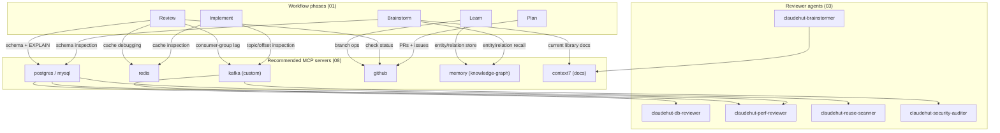

# ClaudeHut Design — 08. MCP Integration

> Part of the **ClaudeHut** design document set. See [README](./README.md). MCP bindings are fixed in [02 §4.5](./02-architecture.md#45-mcp--see-08).
> **Status:** Design v1 · **Pillar focus:** P6 (native integration), P2 (satellites). **Native mechanism:** no plugin `.mcp.json`; init-emitted `claude mcp add` recommendations; auditors degrade gracefully when servers are absent.

ClaudeHut gives the agentic workflow **live inspection of the running stack** — real database schemas, real cache state, real topic partitions, real pull requests — through MCP. Static code reading tells the agent what the code says; MCP tells the agent what the system contains right now. This document specifies which servers ClaudeHut recommends, how the suggestion mechanism works, what the custom Kafka server exposes, and what ClaudeHut deliberately does not recommend.

## Table of Contents

- [1. Why MCP (and where it sits in the workflow)](#1-why-mcp-and-where-it-sits-in-the-workflow)
- [2. Recommended servers](#2-recommended-servers)
- [3. The custom Kafka MCP](#3-the-custom-kafka-mcp)
- [4. How suggestions are delivered](#4-how-suggestions-are-delivered)
- [5. Servers ClaudeHut does not recommend](#5-servers-claudehut-does-not-recommend)
- [6. Security & failure posture](#6-security--failure-posture)

---

## 1. Why MCP (and where it sits in the workflow)

Each specialist reviewer agent ([03](./03-agents.md)) must answer questions that cannot be answered from source files alone:

- Does this JPA mapping match the actual column types and nullability constraints? (`claudehut-db-reviewer`)
- Are these query plans acceptable on live data volumes? (`claudehut-perf-reviewer`)
- Is there a runaway consumer group falling behind on a topic? (`claudehut-security-auditor`, `claudehut-perf-reviewer`)
- Is this feature blocked on an open PR or a failing check? (Plan phase, `github`)

MCP is the native Claude Code mechanism for granting an agent **structured, tool-callable access to external systems**. It is the right primitive for this: the alternative (having agents run raw shell commands against the database or call `curl` against the GitHub API) bypasses the permission model, leaks credentials into shell history, and produces unstructured text the agent must then parse. MCP addresses all three problems natively.

The recommended servers map to phases and agents as follows:



In the three-plane model ([02 §2](./02-architecture.md#2-the-three-planes)), the plugin no longer ships a `.mcp.json`. Recommended servers reside in the **project plane** — a developer who accepts a suggestion runs `claude mcp add --scope project …`, which writes the *project's own* `.mcp.json` (not a plugin file). Tools invoked against those servers produce output that lives only in the **session plane** — it is never written to disk unless an agent explicitly records a finding. Only the `bin/kafka-mcp` binary stub remains in the static plugin plane, offered as an optional recommendation.

---

## 2. Recommended servers

The authoritative phase/agent binding is in [02 §4.5](./02-architecture.md#45-mcp--see-08). This section adds per-server purpose, exposed tools, and the suggestion command the developer runs to add it. Servers are grouped into three recommendation buckets emitted by `claudehut-init` based on detected project stack.

### 2.1 Bucket 1 — Tech-stack servers

Emitted when `claudehut-init` detects the corresponding dependency in the project's build files.

| Server | Phase(s) | Type | Package / binary | Primary agents | Trigger |
|--------|----------|------|-----------------|----------------|---------|
| `postgres` | Brainstorm, Review | stdio | `@modelcontextprotocol/server-postgres` | `claudehut-db-reviewer`, `claudehut-perf-reviewer` | Postgres driver detected |
| `mysql` | Brainstorm, Review | stdio | `mcp-server-mysql` | `claudehut-db-reviewer`, `claudehut-perf-reviewer` | MySQL driver detected |
| `redis` | Implement, Review | stdio | `redis-mcp-server` | orchestrator, auditors | Redis client detected |
| `kafka` | Implement, Review | stdio | `${CLAUDE_PLUGIN_ROOT}/bin/kafka-mcp` | `claudehut-perf-reviewer`, `claudehut-security-auditor` | Kafka client detected |
| `github` | Plan, Review, Learn | http | `@modelcontextprotocol/server-github` | `claudehut-planner`, `claudehut-reviewer` | git remote is GitHub |

#### 2.1.1 `postgres`

**Purpose.** Exposes the live Postgres schema and allows executing read-only SQL. During Brainstorm, agents query `information_schema` to confirm column types, nullability, and foreign-key constraints so the candidate solution adapts to the real schema. During Review, `claudehut-db-reviewer` re-checks the mappings and `claudehut-perf-reviewer` runs `EXPLAIN (ANALYZE, BUFFERS)` on the queries the implementation issues.

**Key tools exposed.** `list_tables`, `describe_table`, `query` (read-only; see [§6](#6-security--failure-posture)).

**Suggestion command:**

```sh
claude mcp add --scope project postgres -- \
  npx -y @modelcontextprotocol/server-postgres "$POSTGRES_URL"
```

#### 2.1.2 `mysql`

**Purpose.** Identical role to `postgres` for MySQL-backed projects. A project declares which database it uses in `PROJECT.md`; only the relevant server needs to be added.

**Suggestion command:**

```sh
claude mcp add --scope project mysql -- \
  npx -y mcp-server-mysql --url "$MYSQL_URL"
```

#### 2.1.3 `redis`

**Purpose.** Allows agents to inspect cache keys, TTLs, and data structures during Implement and Review. The `implement` skill and the `framework/redis.md` rule ([04](./04-skills.md), [05](./05-rules.md)) instruct the agent to confirm a `@Cacheable` result materialised correctly. During Review, `claudehut-perf-reviewer` can check cache hit ratios by reading Redis `INFO stats`.

**Key tools exposed.** `get`, `keys`, `ttl`, `hgetall`, `info`.

**Suggestion command:**

```sh
claude mcp add --scope project redis -e REDIS_URL="$REDIS_URL" -- \
  npx -y redis-mcp-server
```

#### 2.1.4 `kafka` (custom — see [§3](#3-the-custom-kafka-mcp))

**Purpose.** Exposes topic metadata, consumer-group lag, partition offsets, and message peek. The binary ships in `bin/kafka-mcp` (see [§3](#3-the-custom-kafka-mcp)) — it is offered as a suggestion, not auto-wired.

**Suggestion command:**

```sh
claude mcp add --scope project kafka \
  -e KAFKA_BOOTSTRAP_SERVERS="$KAFKA_BOOTSTRAP_SERVERS" \
  -e KAFKA_SECURITY_PROTOCOL="${KAFKA_SECURITY_PROTOCOL:-PLAINTEXT}" -- \
  "$CLAUDE_PLUGIN_ROOT/bin/kafka-mcp"
```

#### 2.1.5 `github`

**Purpose.** Enables agents to query PRs, issues, branch protection rules, and CI check statuses without leaving the Claude Code session. During Plan, `claudehut-planner` checks for open PRs that touch the same modules before committing to a change strategy. During Review, `claudehut-reviewer` confirms the implementation's CI checks pass before allowing a done-claim. During Learn, branch ops (create/merge) can be performed as part of the delivery handoff.

**Key tools exposed.** `list_pull_requests`, `get_pull_request`, `create_issue`, `create_branch`, `get_pull_request_status`, `add_pull_request_review`.

**Suggestion command:**

```sh
claude mcp add --scope project github \
  -e GITHUB_PERSONAL_ACCESS_TOKEN="$GITHUB_TOKEN" -- \
  npx -y @modelcontextprotocol/server-github
```

The `http` transport variant (`https://api.githubcopilot.com/mcp/`) is also viable for teams with GitHub Copilot entitlements; the stdio form above works with a personal access token and no subscription dependency.

### 2.2 Bucket 2 — Memory server

Recommended unconditionally for any project; complements ClaudeHut's committed `.claude/claudehut/` memory ([07](./07-memory-architecture.md)).

**Purpose.** A knowledge-graph memory MCP (`@modelcontextprotocol/server-memory`) stores entities and relations that persist across sessions as a queryable graph. This is richer than `learnings.jsonl` for cross-session entity recall: during Brainstorm, the agent can ask "what did we learn about the payment service's retry strategy?" and receive structured graph output rather than scanning flat JSONL. During Learn, the agent records new entities (domain concepts, architectural decisions, known constraints) as nodes and edges. The two memory systems are complementary — the committed JSONL is inspectable by humans, the graph is queryable by agents.

**Key tools exposed.** `create_entities`, `create_relations`, `add_observations`, `search_nodes`, `open_nodes`.

**Suggestion command:**

```sh
claude mcp add --scope project memory -- \
  npx -y @modelcontextprotocol/server-memory
```

### 2.3 Bucket 3 — Research server

Recommended for projects that benefit from up-to-date library documentation; used by `claudehut-brainstormer`.

**Purpose.** A documentation-fetching MCP (context7) resolves library IDs and returns current API documentation, including recent version changes. This is useful during Brainstorm (confirming a Spring Boot API contract is still valid) and Implement (checking library-specific configuration options). Absence does not impair any workflow phase — agents fall back to training knowledge — but the context7 recommendation is made unconditionally because the quality benefit is material and the cost of adding it is one command.

**Key tools exposed.** `resolve-library-id`, `get-library-docs`.

**Suggestion command:**

```sh
claude mcp add --scope project context7 -- \
  npx -y @upstash/context7-mcp
```

---

## 3. The custom Kafka MCP

### 3.1 Justification

As of this writing, no production-ready public MCP server for Apache Kafka exists in the `@modelcontextprotocol` catalog or in the widely-cited community catalogs. The closest alternatives are generic shell-command bridges or project-specific scripts that bypass the permission model and return unstructured text. For a Java-backend plugin that explicitly targets Spring Boot + Kafka projects (the `framework/kafka-consumer.md`/`kafka-producer.md` rules in [05](./05-rules.md) and the `implement` skill in [04](./04-skills.md) confirm this is a first-class concern), the gap is material: agents cannot diagnose consumer-group lag, inspect partition offsets, or verify DLQ behaviour without it. ClaudeHut fills the gap by shipping a minimal, read-biased Kafka MCP at `${CLAUDE_PLUGIN_ROOT}/bin/kafka-mcp`.

The binary is the only plugin-shipped component that is not sourced from a public package registry, and it is justified solely by the absence of a viable alternative. It is offered as a recommendation in bucket 1, not auto-wired — the developer runs `claude mcp add --scope project kafka …` to enable it.

### 3.2 Tools the Kafka MCP exposes

| Tool | Description | Destructive? |
|------|-------------|-------------|
| `list_topics` | List all topics on the broker, with partition count and replication factor | No |
| `describe_topic` | Partition leaders, replicas, ISR, config overrides for one topic | No |
| `consumer_group_lag` | Per-partition lag (current offset vs end offset) for a named consumer group | No |
| `list_consumer_groups` | All consumer groups and their states | No |
| `get_offsets` | Current and end offsets for each partition of a topic | No |
| `peek_messages` | Fetch up to N messages from a topic-partition from a given offset (for debugging DLQs) | No |
| `reset_offsets` | Reset a consumer group's offsets to earliest/latest/specific | **Yes — gated** |

`reset_offsets` is the only destructive operation. Developers are advised to configure a `permissions.ask` rule in their project settings for `mcp__kafka__reset_offsets` so Claude Code prompts before execution. All other tools are unconditionally read-only.

### 3.3 Interface contract

The binary at `${CLAUDE_PLUGIN_ROOT}/bin/kafka-mcp` communicates over stdio using the standard MCP JSON-RPC protocol. It reads `KAFKA_BOOTSTRAP_SERVERS` and `KAFKA_SECURITY_PROTOCOL` from the environment (supplied via `-e` flags when the developer runs `claude mcp add`). It exposes the seven tools above as its `tools/list` response. Error responses (broker unreachable, topic not found, insufficient ACLs) are returned as MCP error objects, not stderr noise, so the agent receives structured failure information and can include it in its diagnostic report.

The implementation language and library choice for the binary are deferred to [09](./09-plugin-structure.md); this document specifies only the interface.

---

## 4. How suggestions are delivered

### 4.1 The suggestion model — why no plugin `.mcp.json`

Research confirms that a plugin's `.mcp.json` servers **auto-connect when the plugin is enabled** — there is no native "suggest" API for plugin MCP servers (source: code.claude.com/docs/en/mcp + plugins reference). The only way to make MCP a *per-project suggestion* rather than a forced connection is to stop shipping servers in the plugin and instead recommend them.

ClaudeHut therefore ships **no** active `.mcp.json`. The `mcpServers` reference and the entire `userConfig` block were removed from `plugin.json`. When the developer runs `claude mcp add --scope project …`, Claude Code writes the *project's own* `.mcp.json` — a file in the project repository, not in the plugin. This file is the developer's to own, commit, and share with teammates.

### 4.2 The catalog — `templates/mcp-recommendations.md`

ClaudeHut ships a human-readable catalog at `templates/mcp-recommendations.md`. It lists all recommended servers, their purpose, the `claude mcp add` command to install them, and the required environment variables. This file is the reference that both humans and the `claudehut-init` Bootstrap skill read.

### 4.3 `claudehut-init` bootstrap flow

When `claudehut-init` runs on a new project, it:

1. Reads the project's build files (`pom.xml`, `build.gradle`, `package.json`, etc.) to detect the tech stack.
2. Reads `templates/mcp-recommendations.md`.
3. **Emits `claude mcp add --scope project …` suggestions** in three buckets, one command per server:
   - **Bucket 1 (tech-stack):** postgres, mysql, redis, kafka, or github, emitted per detected dependency.
   - **Bucket 2 (memory):** `@modelcontextprotocol/server-memory` — always emitted.
   - **Bucket 3 (research):** context7 — always emitted.
4. The developer **chooses which commands to run**. Each accepted server is added to the project's `.mcp.json` with project scope and requires per-server approval from Claude Code.

The principle is "suggest, don't force." A project that uses only Postgres and GitHub adds only those two. A project that has no Kafka dependency never sees the Kafka suggestion.

### 4.4 Secrets and connection strings

Because the plugin no longer manages `userConfig`, connection strings are the developer's responsibility. The standard pattern for project-scoped secrets is:

- Pass the value via an environment variable at add-time using the `-e KEY="$VALUE"` flag (the value is stored in the project's MCP config, not in a keychain).
- Alternatively, reference an environment variable that is set in the shell (e.g., via `.env` loaded by `direnv`) — Claude Code will inherit it when launching the server subprocess.

Developers must ensure the project's `.mcp.json` does not contain resolved secrets if the file is committed to source control. The recommended pattern is to use `$ENV_VAR` references in the stored config rather than literal values.

### 4.5 Security guidance for project-scoped servers

Since servers are project-scoped rather than plugin-managed, the permission rules are the developer's to configure. ClaudeHut recommends the following posture in the project's `.claude/settings.json`:

```json
{
  "permissions": {
    "allow": [
      "mcp__postgres__list_tables",
      "mcp__postgres__describe_table",
      "mcp__postgres__query",
      "mcp__mysql__list_tables",
      "mcp__mysql__describe_table",
      "mcp__mysql__query",
      "mcp__redis__get",
      "mcp__redis__keys",
      "mcp__redis__ttl",
      "mcp__redis__hgetall",
      "mcp__redis__info",
      "mcp__kafka__list_topics",
      "mcp__kafka__describe_topic",
      "mcp__kafka__consumer_group_lag",
      "mcp__kafka__list_consumer_groups",
      "mcp__kafka__get_offsets",
      "mcp__kafka__peek_messages",
      "mcp__github__.*",
      "mcp__memory__.*",
      "mcp__context7__.*"
    ],
    "ask": [
      "mcp__kafka__reset_offsets",
      "mcp__postgres__query_write",
      "mcp__mysql__query_write"
    ]
  }
}
```

Read-only tools are pre-allowed; destructive operations are in `ask` so the user is prompted before execution. The wildcard `mcp__github__.*` is intentional: GitHub operations are non-destructive in the context of the workflow (branch creation and PR review comments do not modify production data), and pre-allowing them prevents friction on the Plan/Review/Learn path.

---

## 5. Servers ClaudeHut does not recommend

ClaudeHut chooses not to recommend certain MCP servers that might seem natural additions. Each exclusion is a deliberate design decision, not an oversight.

### 5.1 RabbitMQ / NATS MCP

No production-ready public MCP server exists for RabbitMQ or NATS at the time of this design. Unlike Kafka — where the gap is critical enough to justify shipping a custom binary because Kafka is an explicit first-class target (see the `framework/kafka-consumer.md`/`kafka-producer.md` rules in [05](./05-rules.md)) — RabbitMQ and NATS are secondary messaging options that ClaudeHut supports through the `framework/rabbitmq.md` and `framework/nats.md` path-scoped rules. When a mature community MCP for either broker appears in the public catalog, it can be added to the recommendations catalog following the same suggestion model without structural changes to the plugin. This is a roadmap candidate.

### 5.2 General principle

The selection criterion is: **a server is worth recommending only if it gives the workflow a live-data capability that (a) cannot be approximated by static code reading, (b) maps directly to a named phase + reviewer agent in the master matrix ([02 §4.5](./02-architecture.md#45-mcp--see-08)), and (c) has a viable implementation available (public package or justifiable custom binary).** Any server that fails one of these three tests is excluded from the catalog.

---

## 6. Security & failure posture

### 6.1 Read-only defaults

All database MCP servers (`postgres`, `mysql`) should be connected with read-only credentials where possible. The `@modelcontextprotocol/server-postgres` server exposes a `query` tool that executes arbitrary SQL; the recommended permission posture (see [§4.5](#45-security-guidance-for-project-scoped-servers)) pre-allows `mcp__postgres__query` but places write variants in `ask`. Agents are instructed in their system prompts ([03](./03-agents.md)) to use only `SELECT`, `EXPLAIN`, and schema-inspection queries. The same principle applies to `redis`: `SET`, `DEL`, and flush commands are not in the pre-allowed list.

The custom Kafka MCP enforces read-only behavior at the binary level for all tools except `reset_offsets`, which should be placed in `ask` as described in [§3.2](#32-tools-the-kafka-mcp-exposes).

### 6.2 Secrets in project `.mcp.json`

When a developer runs `claude mcp add --scope project …` with `-e KEY="$VALUE"`, the resolved value is written into the project's `.mcp.json`. Before committing this file, developers should verify it contains only `$ENV_VAR` references, not literal secrets. The catalog at `templates/mcp-recommendations.md` shows the reference pattern for each server. The plugin's own files contain no secret placeholders.

### 6.3 Graceful degradation when a server is unavailable

MCP enriches the workflow but is not required for it to run. Every phase can complete on static code reading alone; MCP servers add precision, not enablement. The failure contract:

| Server unavailable | Effect |
|-------------------|--------|
| `postgres` / `mysql` | `claudehut-db-reviewer` runs on JPA annotations + migration files only; notes in its output that live schema was unavailable. |
| `redis` | Cache-related review in Review is skipped with a logged notice; code review continues. |
| `kafka` | Consumer-group lag and offset inspection are unavailable; `claudehut-perf-reviewer` notes this and limits analysis to code patterns. |
| `github` | Plan phase proceeds without open-PR context; Review cannot confirm CI check status — `claudehut:review` records it as an outstanding item for the user to confirm manually ([06](./06-hooks.md)). |
| `memory` | Agents fall back to `learnings.jsonl` and `MEMORY.md` for cross-session recall. |
| `context7` | Brainstormer and other agents fall back to training knowledge for library documentation. |

An MCP server that is not installed or fails to connect is reported via `/mcp` and logged in the session, but it does not cause a hook `deny` or a workflow abort. This matches the native behavior: Claude Code continues to run with the tools that are available.

---

**Prev:** [← 07. Memory Architecture](./07-memory-architecture.md) · **Next:** [09. Plugin Structure →](./09-plugin-structure.md)
