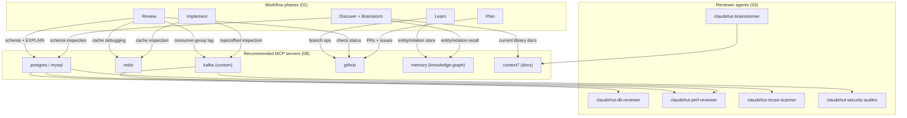

# ClaudeHut Design — 08. MCP Integration

> Part of the **ClaudeHut** design document set. See [README](./README.md). MCP bindings are fixed in [02 §4.5](./02-architecture.md#45-mcp--see-08).
> **Status:** Design v1 · **Pillar focus:** P6 (native integration), P2 (satellites). **Native mechanism:** no plugin `.mcp.json`; init-emitted `claude mcp add` recommendations; auditors degrade gracefully when servers are absent.

ClaudeHut gives the agentic workflow **live inspection of the running stack** — real database schemas, real cache state, real topic partitions, real pull requests — through MCP. Static code reading tells the agent what the code says; MCP tells the agent what the system contains right now. This document specifies which servers ClaudeHut recommends, how the suggestion mechanism works, what the custom Kafka server exposes, and what ClaudeHut deliberately does not recommend.

## Table of Contents

- [1. Why MCP (and where it sits in the workflow)](#1-why-mcp-and-where-it-sits-in-the-workflow)
- [2. Recommended servers](#2-recommended-servers)
- [3. Kafka MCP](#3-kafka-mcp)
- [4. How suggestions are delivered](#4-how-suggestions-are-delivered)
- [5. Servers ClaudeHut does not recommend](#5-servers-claudehut-does-not-recommend)
- [6. Security & failure posture](#6-security--failure-posture)

---

## 1. Why MCP (and where it sits in the workflow)

Each specialist reviewer agent ([03](./03-agents.md)) must answer questions that cannot be answered from source files alone:

- Does this JPA mapping match the actual column types and nullability constraints? (`claudehut-db-reviewer`)
- Are these query plans acceptable on live data volumes? (`claudehut-perf-reviewer`)
- Is there a runaway consumer group falling behind on a topic? (`claudehut-security-auditor`, `claudehut-perf-reviewer`)
- Is this feature blocked on an open PR or a failing check? (Plan phase, `github`)

MCP is the native Claude Code mechanism for granting an agent **structured, tool-callable access to external systems**. It is the right primitive for this: the alternative (having agents run raw shell commands against the database or call `curl` against the GitHub API) bypasses the permission model, leaks credentials into shell history, and produces unstructured text the agent must then parse. MCP addresses all three problems natively.

The recommended servers map to phases and agents as follows:


```mermaid
flowchart TB
    subgraph PHASES["Workflow phases (01)"]
        EX["Discover + Brainstorm"]
        PL["Plan"]
        IM["Implement"]
        VE["Review"]
        LN["Learn"]
    end

    subgraph SERVERS["Recommended MCP servers (08)"]
        PG["postgres / mysql"]
        RD["redis"]
        KF["kafka (custom)"]
        GH["github"]
        MEM["memory (knowledge-graph)"]
        CTX["context7 (docs)"]
    end

    subgraph AGENTS["Reviewer agents (03)"]
        DBR["claudehut-db-reviewer"]
        PR["claudehut-perf-reviewer"]
        RS["claudehut-reuse-scanner"]
        SA["claudehut-security-auditor"]
        BR["claudehut-brainstormer"]
    end

    EX -->|schema inspection| PG
    VE -->|schema + EXPLAIN| PG
    PG --> DBR
    PG --> PR
    PG --> RS

    IM -->|cache inspection| RD
    VE -->|cache debugging| RD

    IM -->|topic/offset inspection| KF
    VE -->|consumer-group lag| KF
    KF --> PR
    KF --> SA

    PL -->|PRs + issues| GH
    VE -->|check status| GH
    LN -->|branch ops| GH

    EX -->|entity/relation recall| MEM
    LN -->|entity/relation store| MEM

    EX -->|current library docs| CTX
    BR --> CTX
```

In the three-plane model ([02 §2](./02-architecture.md#2-the-three-planes)), the plugin no longer ships a `.mcp.json`. Recommended servers reside in the **project plane** — a developer who accepts a suggestion runs `claude mcp add --scope project …`, which writes the *project's own* `.mcp.json` (not a plugin file). Tools invoked against those servers produce output that lives only in the **session plane** — it is never written to disk unless an agent explicitly records a finding. Since v0.10.0 the plugin plane holds no MCP binary at all: the Kafka stub was removed in favour of a maintained third-party server.

---

## 2. Recommended servers

The authoritative phase/agent binding is in [02 §4.5](./02-architecture.md#45-mcp--see-08). This section adds per-server purpose, exposed tools, and the suggestion command the developer runs to add it. Servers are grouped into three recommendation buckets emitted by `claudehut-init` based on detected project stack.

### 2.1 Bucket 1 — Tech-stack servers

Emitted when `claudehut-init` detects the corresponding dependency in the project's build files.

| Server | Phase(s) | Type | Package / binary | Primary agents | Trigger |
|--------|----------|------|-----------------|----------------|---------|
| `postgres` | Discover + Review | stdio | `postgres-mcp` (crystaldba) | `claudehut-db-reviewer`, `claudehut-perf-reviewer` | Postgres driver detected |
| `mysql` | Discover + Review | stdio | `mcp-server-mysql` | `claudehut-db-reviewer`, `claudehut-perf-reviewer` | MySQL driver detected |
| `kafka` | Implement, Review | stdio | `@confluentinc/mcp-confluent` | `claudehut-perf-reviewer`, `claudehut-security-auditor` | Kafka client detected |
| `github` | Plan, Review, Learn | http | `@modelcontextprotocol/server-github` | `claudehut-planner`, `claudehut-reviewer` | git remote is GitHub |

#### 2.1.1 `postgres`

**Purpose.** Exposes the live Postgres schema and allows executing read-only SQL. During **Discover**, the explorer agent queries `information_schema` to confirm column types, nullability, and foreign-key constraints so the grounding adapts to the real schema. During Review, `claudehut-db-reviewer` re-checks the mappings and `claudehut-perf-reviewer` runs `EXPLAIN (ANALYZE, BUFFERS)` on the queries the implementation issues.

**Key tools exposed.** `list_tables`, `describe_table`, `query` (read-only; see [§6](#6-security--failure-posture)).

**Suggestion command:**

```sh
claude mcp add --scope project postgres -- \
  uvx postgres-mcp --access-mode=restricted     # DATABASE_URI in the environment
```

#### 2.1.2 `mysql`

**Purpose.** Identical role to `postgres` for MySQL-backed projects. A project declares which database it uses in `PROJECT.md`; only the relevant server needs to be added.

**Suggestion command:**

```sh
claude mcp add --scope project mysql -- \
  npx -y mcp-server-mysql --url "$MYSQL_URL"
```

#### 2.1.3 `kafka` (see [§3](#3-kafka-mcp))

**Purpose.** Exposes topic metadata, consumer groups and lag, and message reads. Provided by Confluent's `@confluentinc/mcp-confluent` (see [§3](#3-kafka-mcp)) — offered as a suggestion, never auto-wired.

**Suggestion command:**

```sh
claude mcp add --scope project kafka \
  -e KAFKA_BOOTSTRAP_SERVERS="$KAFKA_BOOTSTRAP_SERVERS" \
  -e KAFKA_SECURITY_PROTOCOL="${KAFKA_SECURITY_PROTOCOL:-PLAINTEXT}" -- \
  npx -y @confluentinc/mcp-confluent --config ./config.yaml --allow-tools list-topics,list-consumer-groups,describe-consumer-group,get-consumer-group-lag,consume-messages
```

#### 2.1.4 `github`

**Purpose.** Enables agents to query PRs, issues, branch protection rules, and CI check statuses without leaving the Claude Code session. During Plan, `claudehut-planner` checks for open PRs that touch the same modules before committing to a change strategy. During Review, `claudehut-reviewer` confirms the implementation's CI checks pass before allowing a done-claim. During Learn, branch ops (create/merge) can be performed as part of the delivery handoff.

**Key tools exposed.** `list_pull_requests`, `get_pull_request`, `create_issue`, `create_branch`, `get_pull_request_status`, `add_pull_request_review`.

**Suggestion command:**

```sh
claude mcp add --scope project github \
  -e GITHUB_PERSONAL_ACCESS_TOKEN="$GITHUB_TOKEN" -- \
  npx -y @modelcontextprotocol/server-github
```

The `http` transport variant (`https://api.githubcopilot.com/mcp/`) is also viable for teams with GitHub Copilot entitlements; the stdio form above works with a personal access token and no subscription dependency.

### 2.2 Bucket 2 — Research server

Recommended for projects that benefit from up-to-date library documentation; used by `claudehut-brainstormer`.

**Purpose.** A documentation-fetching MCP (context7) resolves library IDs and returns current API documentation, including recent version changes. This is useful during Brainstorm (confirming a Spring Boot API contract is still valid) and Implement (checking library-specific configuration options). Absence does not impair any workflow phase — agents fall back to training knowledge — but the context7 recommendation is made unconditionally because the quality benefit is material and the cost of adding it is one command.

**Key tools exposed.** `resolve-library-id`, `get-library-docs`.

**Suggestion command:**

```sh
claude mcp add --scope project context7 -- \
  npx -y @upstash/context7-mcp
```

---

## 3. Kafka MCP

ClaudeHut shipped a custom `bin/kafka-mcp` stub here. It was never implemented — a real one needs a
Kafka client outside this package's build — so it was a recommendation nobody could act on. Removed in
v0.10.0 in favour of Confluent's maintained server, `@confluentinc/mcp-confluent`.

That server is **not** read-only: unfiltered it exposes `create-topics`, `delete-topics` and
`produce-message`. It is pinned with its own `--allow-tools` flag to the five read-only tools the
reviewers declare (see `templates/mcp-recommendations.md`). `claude mcp add` itself has no tool filter,
so the pin must be passed to the server binary after the `--`.

There is no `reset_offsets` tool under any spelling, so the `permissions.ask` rule this section used to
recommend for `mcp__kafka__reset_offsets` matched nothing. `consume-messages` is safe for a read-only
reviewer: it uses a random consumer group per call and never commits, so it cannot move an
application group's offsets.

## 4. How suggestions are delivered

### 4.1 The suggestion model — why no plugin `.mcp.json`

Research confirms that a plugin's `.mcp.json` servers **auto-connect when the plugin is enabled** — there is no native "suggest" API for plugin MCP servers (source: code.claude.com/docs/en/mcp + plugins reference). The only way to make MCP a *per-project suggestion* rather than a forced connection is to stop shipping servers in the plugin and instead recommend them.

ClaudeHut therefore ships **no** active `.mcp.json`. The `mcpServers` reference and the entire `userConfig` block were removed from `plugin.json`. When the developer runs `claude mcp add --scope project …`, Claude Code writes the *project's own* `.mcp.json` — a file in the project repository, not in the plugin. This file is the developer's to own, commit, and share with teammates.

### 4.2 The catalog — `templates/mcp-recommendations.md`

ClaudeHut ships a human-readable catalog at `templates/mcp-recommendations.md`. It lists all recommended servers, their purpose, the `claude mcp add` command to install them, and the required environment variables. This file is the reference that both humans and the `claudehut-init` Bootstrap skill read.

### 4.3 `claudehut-init` bootstrap flow

When `claudehut-init` runs on a new project, it:

1. Reads the project's build files (`pom.xml`, `build.gradle`, `package.json`, etc.) to detect the tech stack.
2. Reads `templates/mcp-recommendations.md`.
3. **Emits `claude mcp add --scope project …` suggestions** in three buckets, one command per server:
   - **Bucket 1 (tech-stack):** postgres, mysql, redis, kafka, or github, emitted per detected dependency.
   - **Bucket 2 (research):** context7 — always emitted.
4. The developer **chooses which commands to run**. Each accepted server is added to the project's `.mcp.json` with project scope and requires per-server approval from Claude Code.

The principle is "suggest, don't force." A project that uses only Postgres and GitHub adds only those two. A project that has no Kafka dependency never sees the Kafka suggestion.

### 4.4 Secrets and connection strings

Because the plugin no longer manages `userConfig`, connection strings are the developer's responsibility. The standard pattern for project-scoped secrets is:

- Pass the value via an environment variable at add-time using the `-e KEY="$VALUE"` flag (the value is stored in the project's MCP config, not in a keychain).
- Alternatively, reference an environment variable that is set in the shell (e.g., via `.env` loaded by `direnv`) — Claude Code will inherit it when launching the server subprocess.

Developers must ensure the project's `.mcp.json` does not contain resolved secrets if the file is committed to source control. The recommended pattern is to use `$ENV_VAR` references in the stored config rather than literal values.

### 4.5 Security guidance for project-scoped servers

Since servers are project-scoped rather than plugin-managed, the permission rules are the developer's to configure. ClaudeHut recommends the following posture in the project's `.claude/settings.json`:

```json
{
  "permissions": {
    "allow": [
      "mcp__postgres__list_tables",
      "mcp__postgres__describe_table",
      "mcp__postgres__execute_sql",
      "mcp__mysql__list_tables",
      "mcp__mysql__describe_table",
      "mcp__mysql__query",
      "mcp__redis__get",
      "mcp__redis__keys",
      "mcp__redis__ttl",
      "mcp__redis__hgetall",
      "mcp__redis__info",
      "mcp__kafka__list-topics",
      "mcp__kafka__list-consumer-groups",
      "mcp__kafka__describe-consumer-group",
      "mcp__kafka__get-consumer-group-lag",
      "mcp__kafka__consume-messages",
      "mcp__github__.*",
      "mcp__memory__.*",
      "mcp__context7__.*"
    ],
    "ask": [
      "mcp__postgres__execute_sql_write",
      "mcp__mysql__query_write"
    ]
  }
}
```

Read-only tools are pre-allowed; destructive operations are in `ask` so the user is prompted before execution. The wildcard `mcp__github__.*` is intentional: GitHub operations are non-destructive in the context of the workflow (branch creation and PR review comments do not modify production data), and pre-allowing them prevents friction on the Plan/Review/Learn path.

---

## 5. Servers ClaudeHut does not recommend

ClaudeHut chooses not to recommend certain MCP servers that might seem natural additions. Each exclusion is a deliberate design decision, not an oversight.

### 5.1 RabbitMQ / NATS MCP

No production-ready public MCP server exists for RabbitMQ or NATS at the time of this design. Unlike Kafka — where the gap is critical enough to justify shipping a custom binary because Kafka is an explicit first-class target (see the `framework/kafka-consumer.md`/`kafka-producer.md` rules in [05](./05-rules.md)) — RabbitMQ and NATS are secondary messaging options that ClaudeHut supports through the `framework/rabbitmq.md` and `framework/nats.md` path-scoped rules. When a mature community MCP for either broker appears in the public catalog, it can be added to the recommendations catalog following the same suggestion model without structural changes to the plugin. This is a roadmap candidate.

### 5.2 General principle

The selection criterion is: **a server is worth recommending only if it gives the workflow a live-data capability that (a) cannot be approximated by static code reading, (b) maps directly to a named phase + reviewer agent in the master matrix ([02 §4.5](./02-architecture.md#45-mcp--see-08)), and (c) has a viable implementation available (public package or justifiable custom binary).** Any server that fails one of these three tests is excluded from the catalog.

---

## 6. Security & failure posture

### 6.1 Read-only defaults

All database MCP servers (`postgres`, `mysql`) should be connected with read-only credentials where possible. The `postgres-mcp` server exposes an `execute_sql` tool that runs arbitrary SQL, so it MUST be started with `--access-mode=restricted` (the default is `unrestricted`, i.e. full write); the recommended posture (see [§4.5](#45-security-guidance-for-project-scoped-servers)) pre-allows `mcp__postgres__execute_sql` under that flag. Agents are instructed in their system prompts ([03](./03-agents.md)) to use only `SELECT`, `EXPLAIN`, and schema-inspection queries.

The Kafka server is constrained by its own `--allow-tools` pin to read-only tools ([§3](#3-kafka-mcp)); the destructive ones are never exposed to Claude Code at all.

### 6.2 Secrets in project `.mcp.json`

When a developer runs `claude mcp add --scope project …` with `-e KEY="$VALUE"`, the resolved value is written into the project's `.mcp.json`. Before committing this file, developers should verify it contains only `$ENV_VAR` references, not literal secrets. The catalog at `templates/mcp-recommendations.md` shows the reference pattern for each server. The plugin's own files contain no secret placeholders.

### 6.3 Graceful degradation when a server is unavailable

MCP enriches the workflow but is not required for it to run. Every phase can complete on static code reading alone; MCP servers add precision, not enablement. The failure contract:

| Server unavailable | Effect |
|-------------------|--------|
| `postgres` / `mysql` | `claudehut-db-reviewer` runs on JPA annotations + migration files only; notes in its output that live schema was unavailable. |
| `kafka` | Consumer-group lag and offset inspection are unavailable; `claudehut-perf-reviewer` notes this and limits analysis to code patterns. |
| `github` | Plan phase proceeds without open-PR context; Review cannot confirm CI check status — `claudehut:review` records it as an outstanding item for the user to confirm manually ([06](./06-hooks.md)). |
| `memory` | Agents fall back to `learnings.jsonl` and `MEMORY.md` for cross-session recall. |
| `context7` | Brainstormer and other agents fall back to training knowledge for library documentation. |

An MCP server that is not installed or fails to connect is reported via `/mcp` and logged in the session, but it does not cause a hook `deny` or a workflow abort. This matches the native behavior: Claude Code continues to run with the tools that are available.

---

**Prev:** [← 07. Memory Architecture](./07-memory-architecture.md) · **Next:** [09. Plugin Structure →](./09-plugin-structure.md)
