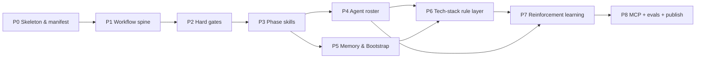

# ClaudeHut Design — 10. Build Roadmap

> Part of the **ClaudeHut** design document set. See [README](./README.md). This plan implements the design in [01](./01-agentic-workflow.md)–[09](./09-plugin-structure.md).
> **Status:** Design v1 · **Audience:** plugin engineers · **Scope:** phased build plan (not implementation).

ClaudeHut's value is entirely in its enforcement: the seven-phase workflow is worthless if an agent can rationalize its way around it. The roadmap is therefore structured enforcement-spine-first — manifest, orchestrator, state writer, and hard gates ship before any agent, domain skill, or MCP server. Later milestones layer satellite intelligence on top of an already-working enforcement skeleton. Each milestone is independently verifiable and each subsequent milestone adds capability without replacing what came before.

## Table of Contents

- [1. Build principles](#1-build-principles)
- [2. Milestone overview](#2-milestone-overview)
- [3. Phased plan](#3-phased-plan)
  - [P0 Skeleton & manifest](#p0-skeleton--manifest)
  - [P1 Workflow spine](#p1-workflow-spine)
  - [P2 Hard gates](#p2-hard-gates)
  - [P3 Phase skills & Iron-Law enforcement](#p3-phase-skills--iron-law-enforcement)
  - [P4 Agent roster](#p4-agent-roster)
  - [P5 Project-adaptive memory & Bootstrap](#p5-project-adaptive-memory--bootstrap)
  - [P6 Tech-stack rule layer & implement references](#p6-tech-stack-rule-layer--implement-references)
  - [P7 Reinforcement learning](#p7-reinforcement-learning)
  - [P8 MCP servers, evals & marketplace publish](#p8-mcp-servers-evals--marketplace-publish)
- [4. Testing & evaluation strategy](#4-testing--evaluation-strategy)
- [5. Risks & mitigations](#5-risks--mitigations)
- [6. Definition of done (v1)](#6-definition-of-done-v1)

---

## 1. Build principles

**Enforcement-spine-first.** The three-tier enforcement system — orchestrator skill (instruction layer), Iron-Law skills (intra-turn ordering), and hooks (hard deterministic gates) — must ship as a working unit before any agent or domain skill is added. A plugin that has agents but no gates only adds noise; a plugin with gates but no agents still guarantees the workflow fires. Build in this order: manifest → orchestrator → state writer → gates → satellites.

**Every milestone is independently testable.** No milestone depends on an unbuilt one for its verification step. A gate test does not require agents; an agent test does not require domain skills. This makes it possible to ship incrementally and catch regressions at the layer they belong to.

**Dogfood ClaudeHut's own workflow to build ClaudeHut.** Once milestone P1 is working, all subsequent work — adding agents, writing domain skills, wiring MCP — is done *through* the plugin in a scratch Spring Boot repo. This surfaces gate friction early, validates the agent roster against real tasks, and ensures the plugin is always tested against representative work rather than synthetic stubs.

**Native-only.** Every capability must be grounded in a named Claude Code native feature (Pillar P6). No workarounds, no external orchestration, no custom runtimes. If a feature cannot be expressed with `plugin.json`, subagents, skills, hooks, `.mcp.json`, or the CLAUDE.md hierarchy, it does not belong in v1.

---

## 2. Milestone overview

| Milestone | Goal | Key deliverables | Exit / verify criteria |
|-----------|------|------------------|------------------------|
| P0 | Loadable plugin | `plugin.json`, `marketplace.json`, dir scaffold | `claude --plugin-dir .` loads without error |
| P1 | Workflow spine | `claudehut-workflow` skill, `bootstrap.sh`, `bin/claudehut-state`, `state.json` schema | Session-start injects workflow; `claudehut-state set-phase` writes state |
| P2 | Hard gates | `gate-write.sh`, `gate-done.sh`, `verify-subagent.sh` | Write denied before reuse-scan+spec+plan; Stop blocked before review-pass+learn |
| P3 | Phase skills | `brainstorm, write-spec, write-plan, implement, review, capture-learnings` + Iron Laws | Iron-Law skills refuse to skip enforced ordering |
| P4 | Agent roster | 11 subagent markdown specs; all dispatched via Agent tool from main-thread skills | Each agent invoked, returns required artifact |
| P5 | Memory & Bootstrap | `claudehut-init` skill, memory templates, `@import` wiring | Fresh project bootstraps; idempotent re-run is safe |
| P6 | Tech-stack rule layer | Domain-organized rule templates (reuse committed rules) + `implement/references/` | Path-scoped rules auto-load on matching Java files; implement references injected on demand |
| P7 | Reinforcement learning | `learnings.jsonl` write/dedup, `inject-learnings.sh`, `persist-state.sh` | Second session receives top learnings from first |
| P8 | MCP + evals + publish | 5 MCP servers, eval harness, marketplace listing | All gates fire on eval scenarios; publish passes schema check |

---

## 3. Phased plan

### P0 Skeleton & manifest

**Goal:** produce a loadable plugin with the correct directory structure and a valid manifest. No behavior yet — only the scaffolding that `claude --plugin-dir` can parse.

**Deliverables:**
- `.claude-plugin/plugin.json` (name, version, hooks reference, skills/agents/commands dirs)
- `.claude-plugin/marketplace.json`
- Empty top-level directories: `agents/`, `skills/`, `scripts/`, `bin/`, `templates/rules/`, `templates/`
- `hooks/hooks.json` stub (event declarations, placeholder commands)

**How to verify:** Run `claude --plugin-dir .` in any directory. The CLI must not emit a manifest parse error, and the plugin name should appear in plugin listings.

**Dependencies:** none.

---

### P1 Workflow spine

**Goal:** ensure the `claudehut-workflow` orchestrator skill loads at session start and that `bin/claudehut-state` can write and read `state.json` reliably. These two components are the skeleton everything else hangs on — ([01 §4](./01-agentic-workflow.md#4-the-phase-state-machine), [02 §3](./02-architecture.md#3-control-flow-how-a-request-moves-through-the-planes)).

**Deliverables:**
- `skills/claudehut-workflow/SKILL.md` — the orchestrator skill describing all seven phases, Phase-0 tier triage, and the skill-first + 1% laws
- `scripts/bootstrap.sh` — `SessionStart` hook: injects orchestrator body as `additionalContext`; emits a top-level `systemMessage` if project memory is absent and the deterministic fallback could not run
- `bin/claudehut-state` — the sole writer of the **per-session** `state/<session_id>.json` (takes `--session`, atomic temp+rename); subcommands: `set-phase`, `set-reuse-scan`, `set-enforcement`, `set-spec`, `set-plan`, `set-review`, `set-outstanding`, `set-bypass` (schema + concurrency: [01 §4](./01-agentic-workflow.md#4-the-phase-state-machine), [§4.1](./01-agentic-workflow.md#41-concurrency-and-worktree-isolation-collision-safe-state))
- `state.json` schema (documented; enforced by `bin/claudehut-state` validation)
- `scripts/inject-phase.sh` — `UserPromptSubmit` hook: reads `state.json`, appends current phase as `additionalContext`

**How to verify:** Open a new Claude Code session with the plugin. Confirm (a) the workflow appears in context before the first user message, and (b) running `bin/claudehut-state --session <id> set-phase brainstorm` writes `state/<id>.json` in the project directory, and (c) **the session id the writer uses equals the `session_id` the gate hooks receive** (the per-session keying in [01 §4.1](./01-agentic-workflow.md#41-concurrency-and-worktree-isolation-collision-safe-state) depends on this — a mismatch silently disables the gates).

**Dependencies:** P0 (loadable manifest).

---

### P2 Hard gates

**Goal:** make the two hard gates — the action gate and the completion gate — deterministic and functional. After this milestone the enforcement spine is complete: no code can be written without reuse-scan+spec+plan, and no turn can end without review-pass+learn. ([06 §3](./06-hooks.md#3-hook-specs))

**Deliverables:**
- `scripts/gate-write.sh` — `PreToolUse` on `Write|Edit|MultiEdit`: reads `state.json`; returns `permissionDecision: deny` if `reuse_scan ≠ true` (all tiers), or if fast-lane bound exceeded (trivial/small), or if `spec_path`/`plan_path` unset (full tier only); allows writes to `.claude/claudehut/**`, test paths, and `bypass=true`
- `scripts/gate-done.sh` — `Stop`: reads `state.json` + `stop_hook_active`; returns `decision: block` if `review ≠ pass` or `phase ≠ learn`; degrades gracefully (surfaces outstanding items) when the consecutive-Stop cap is reached
- `scripts/verify-subagent.sh` — `SubagentStop`: blocks if a phase subagent returns without its required artifact file
- `scripts/format-java.sh` — `PostToolUse` async: runs `google-java-format` on written `.java` files (non-blocking)
- Updated `hooks/hooks.json` with real matchers and commands for all four hooks

**How to verify:** In a scratch Spring Boot repo with the plugin loaded, manually set `state/<session_id>.json` to `{reuse_scan: false}` then attempt a `Write` tool call → gate must deny with the reason. Set `review` to anything other than `"pass"` then let the agent try to stop → `Stop` hook must block (until the `stop_hook_active` cap). Confirm format-java fires without blocking a write.

**Dependencies:** P1 (`bin/claudehut-state` and `bootstrap.sh` provide `state.json`).

---

### P3 Phase skills & Iron-Law enforcement

**Goal:** add the eight workflow skills that cover each phase's intra-turn ordering. Enforcement skills carry Iron Laws — explicit rationalization tables so that once loaded, they constrain the agent's action ordering within a turn even when the gates cannot fire. ([04](./04-skills.md))

**Deliverables:**
- `skills/discover/SKILL.md` — Discover phase (NEW v0.4); Reuse Iron Law; dispatches `claudehut-explorer` ∥ `claudehut-reuse-scanner` in one message; writes reuse-scan artifact; `set-reuse-scan`; every tier
- `skills/brainstorm/SKILL.md` — Brainstorm phase; generic ideation; consumes Discover output; dispatches `claudehut-brainstormer`; builds enforcement set via `claudehut-state set-enforcement`
- `skills/write-spec/SKILL.md` — Spec phase; writes the implementation spec to `tasks/NNNN-<slug>/spec.md` (from template); `AskUserQuestion` approval before `bin/claudehut-state set-spec`
- `skills/write-plan/SKILL.md` — Plan phase; dispatches `claudehut-planner` via Agent tool to write `tasks/NNNN-<slug>/plan.md`; `AskUserQuestion` approval before `bin/claudehut-state set-plan`; `TaskCreate` mirror on approval
- `skills/implement/SKILL.md` — **Iron Law**: no production code before a failing test; RED step allowed to `.../test/` paths before `plan_path` is set; domain depth via `implement/references/`
- `skills/review/SKILL.md` — **Iron Law** (inline, main-thread): dynamically selects and spawns auditors (test-runner + reviewer always; security/perf/db by enforcement-set + diff), loops until `outstanding == []` with fresh evidence; folds in test-matrix guidance; no done-claim otherwise
- `skills/capture-learnings/SKILL.md` — Learn phase; dispatches `claudehut-learner` via Agent tool; main thread triggers `bin/claudehut-state set-phase learn`

**How to verify:** Use the superpowers RED-GREEN method: run `discover` against a scenario without the skill loaded and observe the model writing new code immediately; then load the skill and confirm it refuses to proceed without the reuse-scan artifact. Repeat for `implement` (model writes prod code first without skill; refuses with skill). Both Iron-Law skills must emit their rationalization tables when challenged.

**Dependencies:** P2 (gates validate artifacts these skills produce).

---

### P4 Agent roster

**Goal:** add all 11 subagent specifications so the orchestrator can dispatch heavy work out of the main thread. Each agent definition fixes its tool list, model, effort, and output contract. ([03](./03-agents.md))

**Deliverables (11 agent files in `agents/`):**
- `claudehut-explorer.md` — `tools: Read,Grep,Glob,Bash`, read-only; outputs module map + touch-points
- `claudehut-brainstormer.md` — `model: opus`, `effort: high`; outputs 2–3 options + tradeoffs
- `claudehut-reuse-scanner.md` — `tools: Read,Grep,Glob`; outputs reuse-scan artifact file
- `claudehut-planner.md` — `tools: Read,Grep,Glob,Write`; outputs plan file
- `claudehut-implementer.md` — `skills:[implement,...]`, `isolation: worktree` for risky changes; outputs code + tests
- `claudehut-test-runner.md` — `tools: Bash,Read,Grep`; outputs test results + failure diagnosis
- `claudehut-reviewer.md` — read-only; outputs general findings
- `claudehut-security-auditor.md` — MCP-aware; outputs OWASP/JWT findings
- `claudehut-perf-reviewer.md` — MCP-aware (DB); outputs JVM/query findings
- `claudehut-db-reviewer.md` — uses DB MCP; outputs schema/JPA findings
- `claudehut-learner.md` — `memory: project`; outputs learnings + reuse-index update

**How to verify:** In a dogfood session, give the agent a real task in the scratch Spring repo. Each agent must be dispatched via the Task tool, run in its own context window, and return its required artifact. `verify-subagent.sh` must block any agent that returns empty-handed.

**Dependencies:** P3 (skills dispatch agents via Agent tool from main thread; `verify-subagent.sh` from P2 enforces artifact contracts).

---

### P5 Project-adaptive memory & Bootstrap

**Goal:** implement the project-plane memory layout and the `claudehut-init` Bootstrap so the same plugin works correctly in any Java project — generating that project's context files, rules, and `@import` wiring. ([07](./07-memory-architecture.md))

**Deliverables:**
- `skills/claudehut-init/SKILL.md` — the `/claudehut:init` skill: generates `.claude/claudehut/` tree, writes the committed `MEMORY.md` index, `PROJECT.md`, `LANGUAGE.md`, `architecture.md`, `reuse-index.json`, and empty `learnings.jsonl`; appends `@import` lines for **only the always-load slice** (`MEMORY.md`, `PROJECT.md`, `LANGUAGE.md` — not `architecture.md`/`learnings.jsonl`, which are on-demand, [07 §1.2](./07-memory-architecture.md#12-cost-aware-context-loading)); idempotent (safe to re-run)
- `templates/MEMORY.md.tmpl`, `templates/PROJECT.md.tmpl`, `templates/LANGUAGE.md.tmpl`, `templates/architecture.md.tmpl` — Bootstrap memory templates
- `templates/rules/` — rule template stubs for all 9 path-scoped rules (populated in P6)
- Updated `scripts/bootstrap.sh` — emits a top-level `systemMessage` if `.claude/claudehut/` is absent and the deterministic fallback could not run, prompting the user to run `/claudehut:init`

**How to verify:** Run `/claudehut:init` in a fresh Spring Boot repo. Verify that all memory files exist, the `@import` block lists **only** `MEMORY.md`/`PROJECT.md`/`LANGUAGE.md` (not `architecture.md`/`learnings.jsonl`), and all rule files appear in `.claude/rules/`. Confirm the always-loaded slice stays under the ~25 KB/200-line budget. Run `/claudehut:init` a second time — no duplicate `@import` lines, no overwritten learnings.

**Dependencies:** P1 (`bootstrap.sh` reads the generated directory); P3 (`claudehut-init` is itself a skill).

---

### P6 Tech-stack rule layer & implement references

**Goal:** populate the domain-organized rule templates (reusing committed rules from `templates/rules/`) and fill `implement/references/` with the eight domain deep-dive files so the Implement phase loads exactly the right conventions when the agent touches specific Java files. ([04 §4](./04-skills.md), [05](./05-rules.md))

**Deliverables:**
- `templates/rules/architecture/*.md` — reuse committed architecture rules (package-layout, hexagonal, ddd, cqrs, adr-format); stack-gated
- `templates/rules/coding/*.md` — reuse committed coding rules (naming, exception, null-safety, optional-stream, immutability, records-sealed, logging-mdc)
- `templates/rules/framework/*.md` — reuse committed framework rules (spring-mvc, webflux, jpa, r2dbc, kafka-{consumer,producer}, rabbitmq, nats, redis, jackson, mapstruct, flyway-naming, migration-safety, lombok-{annotations,builder,jpa-safety}); `stack:` tagged
- `templates/rules/performance/*.md` — reuse committed performance rules (n-plus-one, indexing, connection-pool, caching, backpressure)
- `templates/rules/security/*.md` — reuse committed security rules (spring-security, owasp-top10, input-validation, deserialization, secret-mgmt, actuator)
- `templates/rules/testing/*.md` — reuse committed testing rules (junit5, mockito, given-when-then, tdd-cycle, testcontainers, wiremock, stepverifier, coverage)
- `skills/implement/references/web.md` — Spring MVC patterns (context7-researched best-practice; preloaded at CREATE-time)
- `skills/implement/references/jpa.md` — JPA/Hibernate persistence playbook (fetch, N+1, equals/hashCode, locking)
- `skills/implement/references/reactive.md` — WebFlux + R2DBC + Reactor (backpressure, error handling)
- `skills/implement/references/messaging.md` — Kafka / RabbitMQ / NATS (DLQ wiring, exactly-once semantics)
- `skills/implement/references/caching.md` — Redis + Spring Cache (cache-aside, TTL, eviction)
- `skills/implement/references/security.md` — Spring Security + OWASP (method security, JWT, CSRF)
- `skills/implement/references/persistence-ops.md` — Flyway migrations, indexing, connection-pool sizing
- `skills/implement/references/testing.md` — JUnit 5 / Mockito / Testcontainers / WireMock / StepVerifier
- `skills/implement/references/java-lang.md` — records, sealed classes, Optional, MapStruct, Lombok
- `skills/review/references/test-matrix.md` — slice-test decision matrix

**How to verify:** In a dogfood session, open a `*Controller.java` file. Confirm the framework/spring-mvc rule is injected without requiring the agent to request it. Open a `*Repository.java` — confirm framework/jpa rule loads instead. Invoke the `implement` skill on a Kafka producer task and confirm it surfaces DLQ/exactly-once guidance from `implement/references/messaging.md`.

**Dependencies:** P5 (Bootstrap copies rule templates into the project `.claude/rules/` directory).

---

### P7 Reinforcement learning

**Goal:** close the cross-session learning loop: learnings written during one session must reach every agent in every subsequent session of the same project, making the plugin progressively smarter. ([07 §5](./07-memory-architecture.md#5-p5--cross-session-reinforcement-learning))

**Deliverables:**
- `learnings.jsonl` write path via `capture-learnings` skill + `claudehut-learner` agent (uses `memory: project` for native auto-memory in parallel)
- `scripts/inject-learnings.sh` — reads `learnings.jsonl`, ranks entries by `confidence × recency`, returns top-N as text blocks for `bootstrap.sh` and `inject-phase.sh`
- Dedup logic in `claudehut-learner`: before appending, check for semantic near-duplicates by `trigger` field; merge rather than append
- `scripts/persist-state.sh` — `PreCompact` hook (async): flushes staged learnings to `learnings.jsonl` and snapshots `state.json` before context compaction
- Updated `scripts/bootstrap.sh` — calls `inject-learnings.sh --top 12` and appends output to `additionalContext`
- Updated `scripts/inject-phase.sh` — calls `inject-learnings.sh --filter "<prompt keywords>" --top 5` for targeted per-turn retrieval

**How to verify:** Complete a full task cycle (Discover→Brainstorm→Learn) in the scratch Spring repo; confirm a new entry appears in `learnings.jsonl`. Start a second session; confirm the `SessionStart` `additionalContext` contains the learning. Trigger a compact mid-session; confirm `persist-state.sh` fires and `state.json` survives.

**Dependencies:** P4 (`claudehut-learner` agent writes the entries); P5 (memory directory exists).

---

### P8 MCP servers, evals & marketplace publish

**Goal:** wire the five MCP servers, build a scenario-based eval harness to regression-test enforcement, and produce a marketplace-ready package. ([08](./08-mcp-integration.md))

**Deliverables:**
- `.mcp.json` — `postgres` (stdio, `${user_config.pg_url}`), `mysql`, `redis`, `github` (http) entries
- `bin/kafka-mcp` — custom stdio MCP server: topics, consumer-groups, offsets, lag (fills the gap in existing catalogs)
- Eval harness: `evals/run.sh`, `evals/tasks/` (≥3 scenario directories each with a `task.md`, a scratch Spring repo, and an oracle check)
- `evals/score.sh` — parses session transcripts to assert: gates fired, artifacts produced, phases advanced in order
- `evals/worktree-tests.sh` — 11 deterministic shell tests for `bin/claudehut-worktree` (no Claude needed): check-disjoint pass/overlap, sweep scope-guard + clean/dirty/unmerged/outside-root, reconcile merge + conflict-abort + red-test rollback + green-test kept, dirty-main-tree refused [11 §6](./11-execution-model-and-artifacts.md#6-parallel-execution--worktree-lifecycle)
- Marketplace `README.md` (installation, quick-start, bypass reference)
- Version bump to `1.0.0` in `plugin.json` + `marketplace.json`

**How to verify:** Run `evals/run.sh` against the full scenario suite. Every scenario must: (a) have the write gate fire at least once, (b) produce a plan file and a reuse-scan artifact, (c) have the `Stop` gate block at least once, and (d) end with a `learnings.jsonl` entry. Run `claude --plugin-dir . --validate-manifest` (or equivalent) against the final package; no schema errors.

**Dependencies:** all prior milestones (eval harness exercises the full stack).

---

## 4. Testing & evaluation strategy

**Scenario harness (system-level).** The primary test vehicle is a scratch Spring Boot repo and a set of task scenarios that exercise the full enforcement loop. Each scenario describes a task ("add rate-limiting to `OrderController`"), sets up an initial codebase state, and defines oracle checks: did `gate-write.sh` deny at least once? Does a plan file exist? Does `learnings.jsonl` have a new entry? `evals/score.sh` parses the session transcript to answer these questions mechanically. Scenarios should cover: a clean first-time run, a re-run where `reuse-index.json` already has a relevant component, and a deliberate shortcut attempt (agent tries to `Write` immediately).

**Iron-Law skills — RED-GREEN pressure test.** Because Iron-Law skills rely on model compliance rather than deterministic code, they require a different test: the superpowers RED-GREEN method. Run the tempting scenario *without* the skill loaded and record what the model does (it will rationalize: "this is a trivial change, I'll skip the reuse scan"). Then load the skill and re-run. The skill must: (a) cause the agent to produce the required artifact before proceeding, and (b) emit a rationalization table when challenged ("but this is simple…"). Run at least one RED-GREEN pair for `brainstorm`, `implement`, and `review`.

**Gate unit tests.** Each gate script (`gate-write.sh`, `gate-done.sh`, `verify-subagent.sh`) can be tested independently by feeding crafted `state.json` payloads and simulated hook stdin. A small shell test suite (e.g. `evals/gate-tests.sh`) asserts: deny on missing `reuse_scan`, `spec_path`, or `plan_path`, allow on `bypass=true`, block on `review ≠ pass`, allow at the `stop_hook_active` cap, allow once all flags are set, **fail open on a missing/mismatched per-session state file**, and (critically) that the writer's `--session ${CLAUDE_SESSION_ID}` and the gate's hook-input `session_id` resolve to the **same** `state/<session_id>.json` path ([01 §4.1](./01-agentic-workflow.md#41-concurrency-and-worktree-isolation-collision-safe-state)).

**Regression.** After any change to a hook script or a phase skill, the gate unit tests and at least the clean-first-run scenario must pass before merging.

---

## 5. Risks & mitigations

| Risk | Impact | Mitigation |
|------|--------|------------|
| Gates too aggressive — blocks valid work | Workflow friction becomes a cage; engineers disable the plugin | (a) `bypass=true` escape hatch via `bin/claudehut-state`; (b) gates fail *open* (exit 0) on any script error; (c) test paths and `.claude/claudehut/**` are always allowed through `gate-write.sh` |
| `jq` not installed on engineer's machine | All gate scripts fail; plugin broken silently | Hook scripts probe for `jq` on startup; if absent, emit a warning via stderr and exit 0 (fail open, not wedge); `bootstrap.sh` emits a diagnostic |
| Subagent drift — agent returns wrong artifact format | `verify-subagent.sh` blocks; developer confused | Artifact schema is simple (file existence check + top-level JSON key); agent descriptions specify exact output format; `verify-subagent.sh` emits a clear error naming the missing field |
| `learnings.jsonl` bloat over many sessions | Injection token budget exceeded; `bootstrap.sh` payload too large | `inject-learnings.sh` caps at top-N; `claudehut-learner` deduplicates by `trigger` field before appending; a `/claudehut:prune-learnings` escape command prunes entries below a confidence threshold |
| MCP connection secrets leak into `state.json` or learnings | Secrets committed to repo | Secrets never pass through the plugin — ClaudeHut ships no `userConfig` and no `.mcp.json`; any MCP a developer opts into via `claude mcp add` keeps its credentials in the project's own `.mcp.json` ([08 §6.2](./08-mcp-integration.md#62-secrets-in-project-mcpjson)), never in a ClaudeHut memory file; `claudehut-learner` is instructed never to record connection strings; the per-session `state/<session_id>.json` is gitignored (ephemeral), while `MEMORY.md`, `learnings.jsonl` and the generated rules are committed as shared team memory ([07 §1](./07-memory-architecture.md#1-memory-layout-plugin-vs-project)) |

---

## 6. Definition of done (v1)

The plugin ships when all six pillars have a passing acceptance test:

- [ ] **Pillar P1 — Agentic workflow as the core.** In a clean session on a bootstrapped Spring Boot project (codebase already indexed), the agent completes a full Discover→Brainstorm→Spec→Plan→Implement→Review→Learn cycle on a real coding task without manual phase prompting.

- [ ] **Pillar P2 — Agents / Skills / Rules / Hooks as satellites.** All 11 agents are dispatched during at least one eval scenario and return their required artifacts. All 9 workflow skills load at the correct phase. All 7 hooks fire on their triggering events.

- [ ] **Pillar P3 — Project-adaptive memory.** Running `/claudehut:init` in two different Spring Boot projects produces two distinct `PROJECT.md` and `LANGUAGE.md` files; the agent uses project-specific vocabulary in both. Re-running `init` on either project is idempotent.

- [ ] **Pillar P4 — Think-and-reuse before acting.** In a scenario where a matching component exists in `reuse-index.json`, the agent's plan references the existing component rather than writing a new one. In a scenario with no matching component, a new reuse-scan artifact is written and `plan_path` is set before any `Write` tool call is allowed.

- [ ] **Pillar P5 — Continuous reinforcement learning across sessions.** A learning written to `learnings.jsonl` in session N appears in `additionalContext` at the start of session N+1. A `PreCompact` event mid-session does not cause the learning to be lost.

- [ ] **Pillar P6 — Native Claude Code integration.** `claude --plugin-dir . --validate-manifest` (or equivalent) reports no errors. Every enforcement point cites a specific native mechanism (hook event, Agent tool dispatch from main thread, `memory: project`, `@import`, path-scoped rule) with no custom runtimes or non-native workarounds.

---

**Prev:** [← 09. Plugin Structure](./09-plugin-structure.md) · **Next:** [README →](./README.md)
