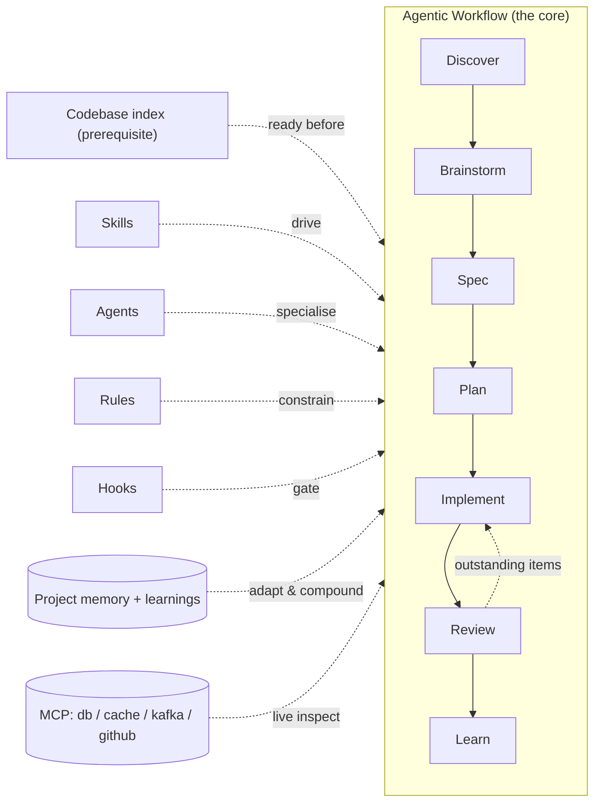
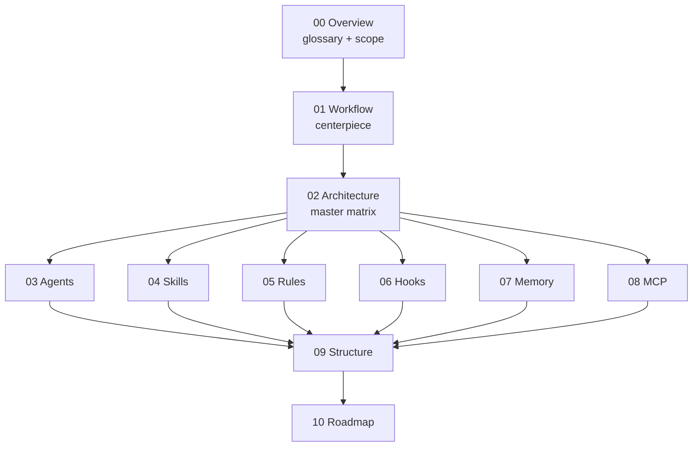

# ClaudeHut — Design Document Set

**ClaudeHut** is a Claude Code plugin for Java backend engineers whose core is an **agentic workflow**: against a pre-indexed codebase, the agent autonomously discovers (grounds the task + reuse-scan), brainstorms options, writes a spec, plans, implements test-first, reviews for full compliance, and learns — with every phase auto-enforced by native Claude Code mechanisms. This folder is the **design deliverable**: a coherent set of technical documents from high-level vision down to low-level component specs.

> **Status:** Design v1 · **Scope:** design only — no plugin implementation code is shipped here. The build plan lives in [10. Build Roadmap](./10-build-roadmap.md).

## What ClaudeHut is, in one diagram

## The six pillars (the acceptance contract)

| # | Pillar | Where it's designed |
|---|--------|---------------------|
| P1 | Agentic workflow as the core | [01](./01-agentic-workflow.md) |
| P2 | Agents / Skills / Rules / Hooks as satellites | [02](./02-architecture.md), [03](./03-agents.md), [04](./04-skills.md), [05](./05-rules.md), [06](./06-hooks.md) |
| P3 | Project-adaptive memory | [07](./07-memory-architecture.md) |
| P4 | Think-and-reuse before acting | [01 §10](./01-agentic-workflow.md#10-think-and-reuse-the-hard-gate), [07 §4](./07-memory-architecture.md#4-p4--reuse-before-build) |
| P5 | Continuous reinforcement learning across sessions | [07 §5](./07-memory-architecture.md#5-p5--cross-session-reinforcement-learning) |
| P6 | Native Claude Code integration | all documents |

## Reading order

The set flows **high-level → low-level**. Read in order on a first pass; jump via the index afterwards.

| # | Document | Read it for | Primary pillars |
|---|----------|-------------|-----------------|
| 00 | [Overview](./00-overview.md) | vision, target user, scope, and the **canonical glossary** every other doc reuses | all |
| 01 | [Agentic Workflow](./01-agentic-workflow.md) | **the centerpiece** — the 7 phases and the enforcement loop | P1, P4 |
| 02 | [Architecture](./02-architecture.md) | the component map and the **master matrix** (every component → phase → native mechanism) | P2, P6 |
| 03 | [Agents](./03-agents.md) | the 11 specialist subagents and how they're dispatched | P2 |
| 04 | [Skills](./04-skills.md) | the skill catalog, triggers, and Iron-Law enforcement | P1, P2, P4 |
| 05 | [Rules](./05-rules.md) | path-scoped coding standards and why they're project-generated | P3, P6 |
| 06 | [Hooks](./06-hooks.md) | the deterministic gates and exactly what each can/cannot enforce | P1, P5, P6 |
| 07 | [Memory Architecture](./07-memory-architecture.md) | project-adaptive memory, reuse-scan index, cross-session learning | P3, P4, P5 |
| 08 | [MCP Integration](./08-mcp-integration.md) | the MCP servers (db/cache/kafka/github) and why each | P6, P2 |
| 09 | [Plugin Structure](./09-plugin-structure.md) | directory layout, manifest, and the file-by-file map | P6 |
| 10 | [Build Roadmap](./10-build-roadmap.md) | the phased plan to implement this design | all |
| 11 | [Execution Model + Artifacts](./11-execution-model-and-artifacts.md) | v0.3 redesign: task-dir layout, main-thread orchestration rule, approval gates, native task mirror, templates | P1, P2, P4, P6 |

## How the documents fit together

- **00** fixes vocabulary; **01** defines the loop; **02** binds everything in one authoritative matrix.
- **03–08** each expand one slice of that matrix (agents, skills, rules, hooks, memory, MCP) without re-deciding the bindings.
- **09** shows where every file physically lives; **10** sequences the build.

## Key design decisions (quick reference)

- **Enforcement over instruction** — three tiers: orchestrator skill (instruction) → Iron-Law skills (intra-turn ordering) → hooks (hard, deterministic gates). See [01 §2](./01-agentic-workflow.md#2-design-principle-enforcement-over-instruction).
- **Honest gates** — `PreToolUse` deny = action gate (no new code before reuse-scan + spec + plan); `Stop` block = completion gate (no done before `review=pass` + Learn, honoring the native `stop_hook_active` cap). Neither claims to enforce mid-turn ordering. See [06 §4](./06-hooks.md#4-what-hooks-honestly-can-and-cannot-do).
- **Discover grounds + reuse-scans; Brainstorm builds the enforcement set; Review audits it** — Discover (phase 1, every tier) runs explorer ∥ reuse-scanner and produces the reuse-scan artifact. Brainstorm (phase 2, full tier) then applies the superpowers **1% rule** (*"even a 1% chance a skill applies → you MUST invoke it"*) to list every applicable skill/rule — this list also drives **dynamic reviewer selection** in Review. Review spawns selected auditor subagents (from the main thread) and **loops until the outstanding set is empty**. See [01 §7–§8](./01-agentic-workflow.md#7-the-enforcement-set-applying-the-1-rule).
- **`understand-anything` is conditional, detected natively** — **Discover** uses that plugin's query/search skills only when it's enabled; there's no native runtime cross-plugin branch, so a `SessionStart` hook reads `enabledPlugins` and injects the flag. See [06](./06-hooks.md) · [01 §3](./01-agentic-workflow.md#3-prerequisite-the-codebase-index-not-a-phase).
- **Rules are project-generated, not plugin-shipped** — a plugin can't ship `.claude/rules/`, so ClaudeHut ships templates and Bootstrap generates tuned, path-scoped rules per project. See [05 §1](./05-rules.md#1-the-native-constraint-that-shapes-everything).
- **Memory = committed store + native loading discipline (cost-aware)** — native auto-memory is machine-local/uncommittable/disablable, so it can't carry team-shared P5 learnings; the canonical store stays the committed `.claude/claudehut/`. ClaudeHut *replicates* native's loading discipline: `@import` only a small capped always-load slice (`MEMORY.md` index + `PROJECT.md` + `LANGUAGE.md`, ≤ ~25 KB/200 lines), and everything else loads on-demand via native lazy primitives (path-scoped rules, skills, hook-injected learning slices, agent `Read`). Native auto-memory is an optional, non-authoritative mirror. See [07 §1.1–§1.2](./07-memory-architecture.md#11-where-memory-lives--and-why-not-native-auto-memory).
- **State is per-session, collision-safe under concurrent worktrees** — the phase-state file is `state/<session_id>.json` (not one project-wide file), written atomically by `bin/claudehut-state`; gate hooks key off the hook-input `session_id`. Concurrent tasks = distinct sessions = distinct files → no clobber. Worktree-`${CLAUDE_PROJECT_DIR}` behavior and writer/reader key-equality are marked `[uncertain]` and the design is safe under both. See [01 §4.1](./01-agentic-workflow.md#41-concurrency-and-worktree-isolation-collision-safe-state).
- **Same plugin, different project** — all specificity lives in the project plane keyed to `${CLAUDE_PROJECT_DIR}`; the static plugin plane holds only universal Java/Spring knowledge. See [02 §2](./02-architecture.md#2-the-three-planes).

## Conventions used across the set

- Terms are defined once in [00 §6](./00-overview.md#6-glossary-canonical-terms) and used identically everywhere.
- Every component maps to **one workflow phase** and **one native Claude Code mechanism** (the master matrix, [02 §4](./02-architecture.md#4-the-master-matrix)).
- Every design choice cites the native feature it relies on (pillar P6).
- Mermaid diagrams clarify flows; tables fix specs.

---

*This is a design deliverable. To turn it into a working plugin, follow [10. Build Roadmap](./10-build-roadmap.md).*
