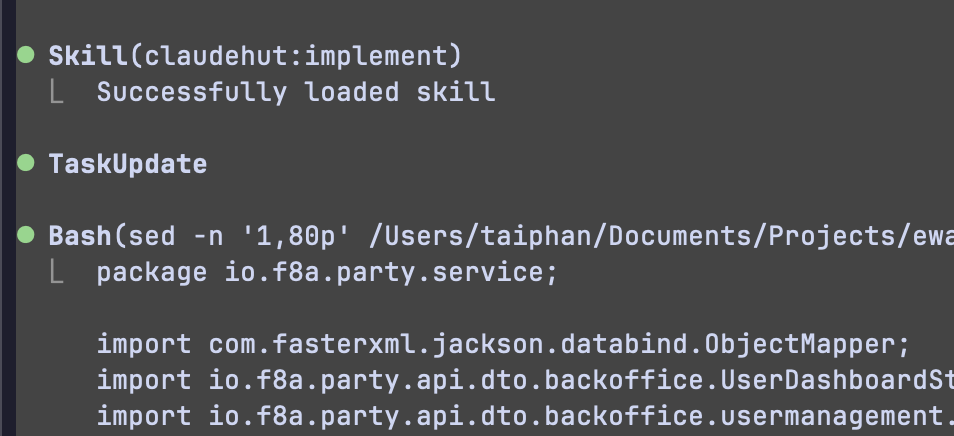

# Task: Design plugin ClaudeHut Plugin - Agentic AI plugin

> Mục tiêu: build 1 plugin claude code standard dành cho Java Backend Engineer với Agentic workflow

## Tài liệu tham khảo

- Superpowers plugin: https://github.com/obra/superpowers
- Engineer Skills: https://github.com/mattpocock/skills
- Repo skills, agents, mcp: https://www.aitmpl.com

## Techstack:

- Lang: Java(11+)
- Framework: Spring MVC, Spring webflux, Spring boot
- ORM: Hibernate, R2DBC
- Database: Postgresql, MySQL
- Messaging: Kafka, RabitMQ, NATS,
- Caching: Redis
- Tesing: Wiremock, JUnit5, Unit Test, Integration Test, blackbox test

## Yêu cầu design:

- Plugin tiêu chuẩn nhất dành cho backend engineer
- Đưa ra design workflow Agentic AI làm core principal cho plugin, bộ standard các agents, skills, rules, hooks sẽ được build làm vệ tinh cho workflow để AI agent enforce khi thực hiện workflow
- Tham khảo các tài liệu được đề cập ở trên để đưa ra 1 design plugin tối ưu mà ở đó phải đáp ứng được các yêu cầu sau:
  - Plugin bắt buộc phải có workflow Agentic, nơi mà ở đó AI Agent tự explore, brainstorming để make decision được output cao nhất, best practice nhất, nơi mà ở đó AI Agents auto enforce skills, load rules phù hợp để sử dụng
  - Tổ chứ được bộ agents, skills, rules, hooks đầy đủ và standard nhất cho workflow Agentic nói chung và AI Agents nói riêng
  - Plugin phải quy hoạch, tổ chức được memory cho AI Agents 1 các tối ưu nhất, compatiaple với project mà AI Agents đang involve, cụ thể như sau:
    - Cùng 1 plugin nhưng khi AI Agents làm việc trên từ project khác nhau, thì AI Agents phải có được context, memory của project đó, phải follow theo architecture, structure, coding style,... của chỉnh project và AI Agents đang involve vào
    - AI Agents phải luôn suy nghĩ, thinking, brainstorming trước khi thưc hiện 1 điều gì đó, luôn xem xét rằng có thể reuse/tái sử dụng được implementation gì trước đó của project hiện tại hay không?
    - Plugin phải tổ chức được khả năng tự học tăng cường liên tục cho AI Agents khi làm việc trong dự án -> điều này phải adapt được cho toàn bộ agent ở nhiều session khác nhau của dự án
- Plugin tương tác với claude code, agents 1 cách natvie
- Tham khảo các document từ chính claude code https://code.claude.com/docs để sử dụng tối da các tính năng mà claude code support cho plugin

## Output:

- Design 1 bộ tài liệu từ thiết kế high-level -> low-level
- Tài liệu có cấu trúc, bố cục 1 cách liền mạch, chuẩn tài liệu danh cho technical
- Tài liệu được tổ chức ở folder /Users/taiphan/Documents/Projects/lab/claudehut/docs/design

---

Review document:

- Workflow:
  - Với phase explore này thật sự không cần thiết, việc index codebase thông thường được diễn ra trước đó
  - Phase brainstorming: Agent không chỉ đơn giản là scan reuse mà mục đính chính ở đây là việc brainstorm các solution để adapt với codebase hiện tại 1 các best practice nhất, ít change nhất nhưng output với quality và perfomance cao nhất, đồng thời xác đinh được skills rules mà agents phải enforce cho việc implement - với principal từ superpowers plugin "Cho dù chỉ match 1% dùng phải thực thi skills, rules". ngoài ra để tối ưu việc explore, query, search codebase agent có thể enforce skill trong plugin understand-anything nếu plugin được install một cách native
  - Phase Decide: ở đây nên xác định đây là spec phase sẽ đúng với principal hơn
  - Phase verify: nên đổi thành phase review, expected ở phase này sẽ thực hiện spawns các agents enforec các rules, skills, memory từ plugin, project để verify, review, audit lại implement task đảm bảo việc implement tuân thủ đầy đủ các skills, rules, memory. Phase này cần thực hiện loop đảm bảo không missing bất kỳ rules, memory nào mà agents implement không tuân theo
  - Với tương ứng mỗi phase sẽ có các skills và agents thì điều quan trọng cần thể hiện được các convention, instruction, flow trong các file skills, agents markdown để đảm bảo việc các sub-agents, main agents có context 1 cách native và thực hiện flow 1 cách native với claude code
- Plugin hướng tới việc tương tác với agents claude code 1 cách native nhất, do đó cần research về các tool calls từ claude code document một cách deep dive, nhận tư vấn từ các advisor để có decision design phù hợp và best practice nhất

---

Review document:

- 01: với file json ${CLAUDE_PROJECT_DIR}/.claude/claudehut/state.json, khi multiple task <=> multiple agents thực hiện isolate worktree thì các file này có được tạo isolate không? hay sẽ overlap?
- 07: memory đang được tổ chức chủ yếu ở .claude/claudehut và import vào CLAUDE.md đây cũng là 1 design tốt, nhưng với local project claude dường như support native memory với việc tổ chức trong .claude/memory, đồng thời phải đảm bảo việc load memorry vào context window của agents khi working một các thông minh nhầm mục đích vừa giúp agents có đủ context vừa tối ưu và cost. Nghiên cứu deep dive hơn vào document claude code anthropic cũng như nhờ tư vấn từ advisor để đưa ra best practive solution

---

# Task: Build plugin

## Contex: follow design document

- `/Users/taiphan/Documents/Projects/lab/claudehut/docs/design`

## Yêu cầu:

- Sử dụng skill creator cho việc tạo các skills đảm bảo tuân thủ, best practice nhất
- Đối với agents, skills nghiên cứu tham khảo superpowers plugin để implement agents, skills chuẩn pattern best practice nhất
- Việc implement phải tuân thủ design docuement, đảm bảo workflow agentic ai
- Nếu có bất kỳ issue hoặc chưa clear tiến hành hỏi user hoặc nhận tư vấn từ advisor không build, implement khi chưa clear

---

Review document & implement:

- Review docs:
  - Với reuse scan là 1 step trong flow brainstorming cưa phase brainstorm, không build các quá nhiều skills không đúng với trọng tâm, expected với mỗi phase chỉ cần 1 skill, nhưng cần đảm bảo instruction đầy đủ để agents thực thi đúng context, đúng expected. do đó việc build skill cần đảm bảo best practice để đảm bảo tương tác với agents claude code natvie nhất
  - Các skills, rules cần focus vào vào domain tech stack
  - MCP: cần brainstoming suggest các MCP phù hợp theo từng project thay vì hard config MCP, và các mcp ưu tiên tới tech stack của project, mcp quản lí mempry, research,...
- Review implement:
  - hiện tại các rules chưa được implement best practice nhất để instruction cho agents khi làm việc, có thể tái sử dụng lại các rules được implement trước đó, hoặc dựa vào đó enhance, upgrade lên
  - Các skills đang được tổ chức, build rất sơ xài chưa tối ưu, đáp ứng best practice pattern từ docs claude code anthropic như tổ chức scripts, references, examples,... và các instructions khác phù hợp với best practice của skills đó
  - Agents: cũng đang được tổ chứ rất simple, chưa đủ context, best practice instruction để native tool call thực hiện spawns agents. Cần advisor tư vấn cũng như research document anthropic, tham khảo cách tổ chức của superpowers plugin, chẳng hạn như các flow digram detail cho từng phase, các instrutions best practice cho từng agents theo từng phase, từng techstack
  - MCP: cần brainstoming suggest các MCP phù hợp theo từng project thay vì hard config MCP, và các mcp ưu tiên tới tech stack của project, mcp quản lí mempry, research,...

---

# Task: Testing & Eval plugin với Objective đã đặt ra cho plugin

## Requirements:

- Thực hiện testing, benchmark & đánh giá plugin 1 cách chuyên sâu nhầm tối ưu plugin theo mục tiêu đã đề ra
- Tham khảo cách mà superpowers thực hiện test plugin, cũng như nhờ tư vấn từ advisor, các tài liệu offical từ anthropic để có strategy testing phù hợp nhất

---

# Task: Enhance plugin với parallel agents

## Hiện trạng:

- Hiện tại các agnets được spawns 1 cách tuần tự -> việc implement 1 task rất lâu
- Các agents quản lí git worktree chưa tốt dẫn tới bị treo khi implement

## Yêu cầu:

- Tham khảo cách mà plugin superpowers tổ chức việc spawns agents prallel
- Cần nghiên cứu deep dive về các khía cạnh khác nhau:
  - Research deep dive về các mistake phổ biết trong việc tổ chức spawns agents parallel để từ đó có đầy đủ context cho việc improve
  - Research deep dive về các best practice, các top plugin khác tổ chức và quản lí multiple agents parallel
  - 1 Vấn rất cần thiết trong việc spawn agents parallel là tổ chức git worktree, đây cũng là 1 vấn đề rất dễ dẫn tới mistake, agent rất dễ bỏ qua và mất sai lầm trong việc implement
- Đây là 1 feature rất quan trọng, cần research deep dive từ nhiều nguồn khác nhau, nhờ tư vấn từ advisor để có quyết định đúng đắn
- Think carefully and step-by-step before starting.

---

# Review sử dụng plugin

- Phase brainstorm:
  - Skill & agent brainstorm nên được build theo hướng common để có thể thực hiện brainstorming giải quyết nhiều vấn đề hơn. Hệnn tại đang fit với project bằng việc luôn thực hiện explore và scan reuse trong phase này dẫn tới việc skill, agent mất khả năng sáng tạo trong việc brainstorming
    -> Cần thực hiện tách việc explore và scan reuse thành 1 phase riêng trong workflow
- Ở phase review: hiện tại đang hard trong việc spawns agents để thực hiện review, ví dụ 1 task không có effect tới database nhưng luôn spawn agent db-reviewer để thực hiện review -> điều nay gây tăng cose, tăng time thực hiện task
  -> ở đây cần thực hiện spawn agents 1 cách native, dynamic hơn cho từng task
- Ở phase planning và implement: đã có thực hiện break task và sử dụng tool native để thực hiện tạo và tracking task native claude code. Nhưng hiện có issues với việc agent parallel với task đó:
  - Agents đang không spawns parallel để thực hiện task mà ở đây main agents efforce skill 
  - Các task hiện tại chưa thật sự là được thực hiện parallel do chỉ có main agents thưc hiện task
    -> Ở đây cần đảm bảo việc spawns agent parallel để speed up quá trình thực hiện task, đông thời cần integrate quá trình parallel đó với việc tracking status một cách native.
- Với các task nhỏ hiện tại đang khá strictly theo workflow dẫn tới việc thời gian thực hiện task rất lâu, cũng như cost bỏ ra rất nhiều. Cần có cơ chế reasoning yêu cần từ user để make decision được độ phức tạp của yêu cầu từ user từ đó biết được có thật sự áp dụng full workflow hay sẽ speed up bằng việc skip 1 số phase không cần thiết

# Yêu cầu:

- Dựa vào các issue từ review, thực hiện nghiên cứu 1 cách deep dive, research các tài liệu offical từ claude code anthropic, các top tier plugins, nhờ tư vấn từ advisor để đưa ra các solution cho các issue trên
- Research plugin luôn luôn ưu tiên việc tương tác với agents, LLM một cách native nhất
- Think carefully and step-by-step before starting.
