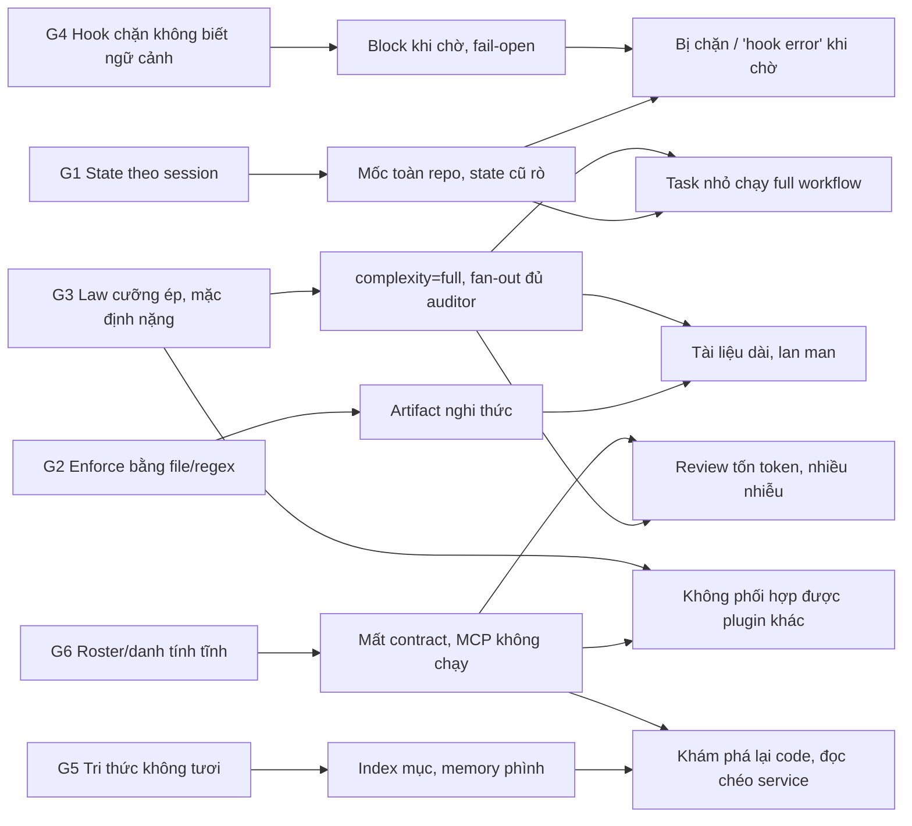

# Báo cáo audit ClaudeHut v0.11.0

Phiên bản: 0.12.0-draft · Ngày: 2026-09-29 · Trạng thái: Đề xuất

## Tóm tắt

Audit đo ClaudeHut v0.11.0 trên ewallet-workspace (production): 60 finding thuộc sáu cụm A–F; sau kiểm chứng đối kháng còn 59 (32 confirmed, 27 weakened), E10 bị bác bỏ và đã loại. Triệu chứng: task nhỏ chạy trọn quy trình, hook chặn khi agent đang chờ, tài liệu phình, agent khám phá lại code, review tốn kém và nhiễu. Sáu nguyên nhân gốc G1–G6 giải thích cả 59 finding ([xem dưới](#nguyên-nhân-gốc-hệ-thống)). Khắc phục: [03-architecture.md](03-architecture.md) và 04–08; mục lục: [README.md](README.md).

## Phương pháp

| Nguồn | Phạm vi |
|---|---|
| Mã nguồn plugin | v0.11.0, HEAD `0128b37`; cơ chế trích theo `file:line` |
| Task dir ewallet | 244 dir: 92 brainstorm, 200 spec, 202 plan, 118 plan-review (~7,3 MB) |
| Transcript | 22 transcript main thread; 163 transcript subagent (62 typed, 101 teammate) để đo token |
| State và plane | 158 `state/<sid>.json` trên 12 service; 13 plane memory |
| Prior art | `.claude/reviews/v0.10.0-verified-plan.md`, `v0.10-research-audit.md`, `plugin-audit-v0.8.md` |

Kiểm chứng đối kháng: một agent độc lập đo lại từng finding; weakened là cơ chế đúng nhưng phải sửa số liệu hoặc phạm vi, bảng dùng số đã sửa. Giá trị `complexity` v0.11 (`trivial|small|full`) giữ dạng identifier; v0.12 thay bằng route (`direct|light|full`, [04-routing-harness.md](04-routing-harness.md)).

## A — Quy trình quá chặt: fast lane không hoạt động

Mọi tín hiệu đều nghiêng về `full`; chọn mức nhẹ thì fast-lane gate lại đo toàn working tree, và gate regex khiến artifact được viết cho có. Khắc phục: [04-routing-harness.md](04-routing-harness.md).

| ID | Mức độ/verdict | Vấn đề | Bằng chứng | Nguyên nhân gốc |
|---|---|---|---|---|
| A1 | critical/weakened | Fast-lane cap đếm cả working tree bẩn | ~8 deny trên 4 transcript (343 ×2, 14 ×3, 40, 34, 10 file); sửa 1 file ở core-ledger-ms tính thành 343 (326 ở `graphify-out/`) | `gate-write.sh:142-143` lấy `git diff` ∪ `ls-files --others` toàn repo; `:177` chỉ cho escalate |
| A2 | medium (hạ từ high)/weakened | Regex vùng nhạy cảm khớp chuỗi con `/auth` | auth-ms 773/789 file `src/main` khớp; state 21 `full`, 0 `small`; 0 deny (tác hại tiềm ẩn) | `grep -Ein` không neo theo thành phần path (`gate-write.sh:147`) |
| A3 | high/confirmed | `complexity` do model chọn, mặc định `full` | `full` 61, `small` 12, `trivial` 2 (81% `full`); task 2 T-row sinh 44.187 B artifact | `claudehut-state:281` khởi tạo `full`; "Unsure → full", "1% rule" (`digest.md:16-20,32`) |
| A4 | low–medium/weakened | Tiêu chí `small` mơ hồ | `SKILL.md:17-20,46,50`; model chọn `small` nhưng A1 đẩy lên | `small` là "one obvious approach" mà phải nêu ≥2 cách |
| A5 | high/confirmed | Không có lối thoát tường minh | 09a5aa8a:5001 "not allowed to run `set-bypass`"; auto-mode classifier từ chối dù user đồng ý; 19 state bypass=true | Chỉ người bật bypass (`claudehut-state:356`); digest không nhắc |
| A6 | medium/confirmed | State task cũ rò sang task mới | Spec/plan task 0033 thỏa gate cho 0034; `review="pass"` cũng rò | `claudehut-state:375` chỉ reset `implement_skill_ok`, `plan_review*`, `findings_path` |
| A7 | high/weakened | Stop gate chặn khi agent đang chờ | 162 block định dạng v0.11: 95 ngay sau câu chờ, 50 ở phase=plan | Chặn khi engaged ∧ review≠pass (`gate-done.sh:112-118,186-192`) |
| A8 | high/confirmed | `trivial` vẫn nặng, sinh artifact nghi thức | Task 2 dòng `build.gradle`: brainstorm/spec/plan viết trong ~30 s, `sed` sửa heading cho khớp regex | Fast lane chỉ bỏ Brainstorm/Spec/Plan; rail khác vẫn gate (`claudehut-state:385-387,485-507`) |
| A9 | medium/confirmed | Write gate chặn file ngoài repo | report-service: 2 deny (scratchpad, `.understand-anything/tmp`), agent chuyển sang Bash heredoc | `bootstrap.sh:62-65` arm mọi session; path ngoài project rơi vào `*)` (`gate-write.sh:94`) |
| A10 | medium/weakened | Nudge "Untriaged" mọi prompt | 1.204 inject, 259 "Untriaged"; câu hỏi RCA bị ép chạy learner; additionalContext SessionStart trung bình 7.833 B (digest 4.331 B) | Nudge chỉ dựa profile rỗng (`inject-phase.sh:48-49`) |

## B — Hook gắn với phase chặn cả việc ngoài workflow

Hook coi "file state tồn tại" là workflow đang chạy, không tách chờ hợp lệ khỏi kết thúc sớm; các nhánh bash đọc chung state nên điều kiện lệch nhau. Khắc phục: [05-hooks.md](05-hooks.md).

| ID | Mức độ/verdict | Vấn đề | Bằng chứng | Nguyên nhân gốc |
|---|---|---|---|---|
| B1 | critical/confirmed | `gate-done.sh` in 2 object JSON, gate Learn thành fail-open | 356 `hook_non_blocking_error` ("not valid JSON"); 354 "Learn pass not run"; 0 block được áp dụng | Không exit sau systemMessage (`:94`) nên chạy tới `block()` (`:193`) |
| B2 | high/weakened | Write gate không kiểm workflow có chạy thật | 50/158 state chỉ được arm; deny `build.gradle`, `Dockerfile`, `/tmp`; 8/25 deny vào file không phải production | `[ -f STATE ] \|\| allow` (`gate-write.sh:100`) hầu như không chạy; gate-done kiểm engaged |
| B3 | high/weakened | Stop gate chặn lượt chờ hợp lệ | 383/482 chuỗi block dài 1: cap `stop_hook_active` chạy, nhưng mỗi notification mở lượt mới | Không tách chờ subagent khỏi chờ duyệt |
| B4 | high/weakened | Session "engaged" mãi sau task đầu | d2ef3c19 "`review=pass` is stale"; 4 state mang review/spec_path cũ; chặn sai ở Stop, write gate không mở sai | `claudehut-state:375` không reset review, reuse_scan, spec_path, plan_path |
| B5 | medium/confirmed | Cùng cơ chế A1 | 8 learnings ở 5 service ghi cùng pitfall; L-0072 "use set-bypass… around edits" | `gate-write.sh:128` hứa "this session", `:142` đếm toàn repo |
| B6 | medium/confirmed | Bypass thành lối thoát mặc định | Model tự chạy 5 lần `set-bypass true`; 14/158 state còn bypass=true | Chỉ có lời khuyên (`claudehut-state:356`); bypass tắt mọi gate |
| B7 | medium/weakened | Lệch session id giữa CLI và gate | party-ms L062; payment-orchestrator L-0027 "phantom state file" | `digest.md:18,63` dùng `${CLAUDE_SESSION_ID}`, rỗng trong Bash |
| B8 | medium/confirmed | Gate theo tên tool, Bash vẫn ghi được | 70 lệnh Bash ghi vào `src/main`; 1 ca né gate rõ ràng | Matcher chỉ có `Write\|Edit\|MultiEdit` (`hooks.json:27-32`) |
| B9 | medium/weakened | Gate phải vá liên tục | 101 block mang thông điệp cũ; trên 210 commit: gate-write 12, gate-done 8, claudehut-state 16 | Chỉ báo xu hướng; phần lớn đã vá, trùng B1/B4 |
| B10 | low/confirmed | Chi phí cố định mỗi lượt | `gate-done.sh` chạy 1.686 lần, p95 352 ms, tổng 284,7 s | Hook không lọc theo trạng thái workflow |

## C — Tài liệu brainstorm/spec/plan dài và lan man

Độ phình do diễn giải lại và code nhúng, không do copy (overlap 5-gram spec↔plan 1–3%). Khắc phục: [06-artifact-standards.md](06-artifact-standards.md).

| ID | Mức độ/verdict | Vấn đề | Bằng chứng | Nguyên nhân gốc |
|---|---|---|---|---|
| C1 | high/confirmed | Gate chỉ kiểm section có mặt | Decision Record >80 từ ở 174/197 spec; ô "Test first" >60 ký tự ~42% | `tmpl()` là `grep -qE` (`claudehut-state:322-326,411-433`) |
| C2 | high/weakened | Không có ngân sách cấp tài liệu | Plan p90/max 39.519/157.178 B; va-ms 0008 plan 19.271 từ; right-size ✓ 60/60 | Lint chỉ quét prompt plugin (`lint-prompt-length.sh:57-58`); reviewer chỉ có chỉ dẫn định tính |
| C3 | high/weakened | Không có giao thức supersede | va-ms 0024: D1 (dòng 6) mâu thuẫn AMENDMENT 2 (dòng 234); plan "revision 5"; 2 vòng REVISE, APPROVE do main thread tự ghi | 0 chỉ dẫn amend/supersede |
| C4 | high/confirmed | Sketch bắt buộc biến plan thành code | Code chiếm 41% dòng plan; 58 block ≥40 dòng; sketch lỗi thời ở po-ms 0004 | `plan-template.md:57-61` "sketch every behavior task", không trần |
| C5 | medium/confirmed | Không có chỗ cho diagram | Mermaid ở 0/200 spec, 0/92 brainstorm, 44/202 plan | Template chỉ có văn bản; `plan-template.md:41` mâu thuẫn `:43` |
| C6 | medium/weakened | Output plan-reviewer không được enforce | Median 772 từ; pg 0098 review 6.125 từ ≈ độ dài plan; 18/118 file có ≥2 verdict | `claudehut-state:469` chỉ cần 1 dòng bảng khớp regex |
| C7 | medium/weakened | Brainstormer nặng thủ tục | Max 4.681 từ; 44/87 có bảng Criterion/Weight | ≥6 ứng viên, ≥3 lens; gate chỉ đếm ≥3 dòng bảng bất kỳ (`claudehut-state:396-402`) |
| C8 | medium/confirmed | Right-size theo `type` không kiểm được | 108/200 spec thiếu `type:`; 16/22 spec bugfix/refactor có >5 heading | `set-spec` không đọc `type` |

## D — Memory và codebase index phân mảnh

Memory chỉ có phạm vi `$CLAUDE_PROJECT_DIR`, không neo theo git, không có index xuyên service. Khắc phục: [07-index-memory.md](07-index-memory.md).

| ID | Mức độ/verdict | Vấn đề | Bằng chứng | Nguyên nhân gốc |
|---|---|---|---|---|
| D1 | critical/confirmed | `MEMORY.md` vượt ngân sách ~12,9 lần | party-ms 105.333 B (ngân sách 8192 B); vẫn tăng sau cảnh báo ngày 09-22 | Ngân sách chỉ có trong prompt; `--audit` chỉ đọc; không ai gọi `--migrate-memory` |
| D2 | high/weakened | Index không được làm tươi | Path chết ở auth-ms 10/85; graph payment-gateway-ms lệch HEAD 374 commit | Chỉ refresh khi version plugin đổi (`bootstrap.sh:81-95`) |
| D3 | high/confirmed | Explorer/reuse-scanner không dùng index | 22 lần chạy, 691 call, chỉ 4 lần mở reuse-index | SubagentStop chỉ kiểm `reuse-scan.md` tồn tại (`verify-subagent.sh:80-82`) |
| D4 | high/weakened | Explorer không thực thi được cờ UA | Cờ inject 64 lần ở va-ms; explorer không có tool Skill; Discover nhắc UA 0 lần | Cờ chỉ ở context main thread; Discover không yêu cầu |
| D5 | high/confirmed | Learning rỗng lọt quality gate | 40 entry `learning:""` | qscore 0,66 > 0,4 mà không cần learning (`merge-learnings.sh:121,132-137`) |
| D6 | medium/weakened | `learnings.jsonl` bão hoà | pg 400/400 entry, 312 KB; 317 entry hits≤1; 0 trigger trùng | Dedup khoá chính xác; SessionStart bơm top-12 (~3%), phần còn lại chỉ nổi qua lọc từ khoá top-5 mỗi prompt |
| D7 | medium/confirmed | `reuse-index.json` không có schema | party-ms 24/43 path hợp lệ | Template `components: []`; learner ghi tự do |
| D8 | medium/confirmed | Không hỗ trợ microservice | 575 lần đọc chéo service (va-ms 329); federation chưa bật | Path cố định (`inject-learnings.sh:36`); federation opt-in, chỉ cho learnings |
| D9 | medium/weakened | Plane root chỉ được nạp một phần | Memory root nạp cùng service; 33/35 learnings root mang `project:"unknown"` | Script chỉ đọc project dir; root nạp được nhờ `CLAUDE.md` tổ tiên |
| D10 | low/confirmed | `MEMORY.md` bị git-ignore | party-ms `.gitignore:41:.claude/` | Init không kiểm `check-ignore` |

## E — Review fan-out

Tổng 208 dispatch, 892M input token (~95% cache read), 5,9M output token. Khắc phục: [08-review.md](08-review.md).

| ID | Mức độ/verdict | Vấn đề | Bằng chứng | Nguyên nhân gốc |
|---|---|---|---|---|
| E1 | high/weakened | `complexity=full` chạy gần đủ auditor | 28/52 đợt có ≥4 auditor, 7 đợt đủ cả 7 (`trivial`/`small` đã skip từ v0.11) | `skills/review/SKILL.md:65-68` "default ON", "when in doubt, run it" |
| E2 | high/weakened | File untracked đẩy task lên `full` | core-ledger 0007 tự khai "false positive", nhưng diff cuối chạm 4 file, tự vượt cap 2 | Cùng cơ chế A1 |
| E3 | high/weakened | Hàng coverage cho mọi rule | security-auditor 76 hàng (18 n-a); db-reviewer 60 hàng (20 n-a) | `review-rigor.md:24-28` không lọc theo lane |
| E4 | high/confirmed | Không paste diff hunk | 2/54 prompt auditor typed có hunk (4/183 trên mọi prompt); auditor tự chạy 119 lệnh `git diff` | "MUST" chỉ là văn xuôi (`SKILL.md:78-80`) |
| E5 | medium/confirmed | db/observability reviewer không có Bash | "could not run `git diff`" ×3 | Frontmatter `tools:` thiếu Bash |
| E6 | medium/confirmed | Nhánh live-schema không bao giờ chạy | 0 lời gọi `execute_sql`/`list_schemas`; `mcp__postgres__query` 32 lần, đều từ teammate | Allowlist tĩnh khác server thật |
| E7 | medium/weakened | Effort tối đa cộng `ultrathink` | `ultrathink` ở 41/54 prompt; output trung bình 18,9k–30,6k token; 11 lần nâng model thật | Effort bị ép qua ba lớp; không có `maxTurns` |
| E8 | medium/weakened | Re-spawn không dựa vào diff | po-ms: perf/observability đã PASS vẫn bị dispatch lại; va-ms lọc từ 7 xuống 4 | `SKILL.md:43-44` mâu thuẫn `:146-147`; không có state ghi auditor đã PASS |
| E9 | low/weakened | Test chạy trùng | Reviewer tự chạy test 6/18 lần (một phần đúng thiết kế fast-lane fold); test-runner trung bình 518k input | Reviewer có Bash, không bị cấm chạy test |

## F — Kết hợp với plugin khác và tư duy harness

Prompt và gate chỉ biết ClaudeHut; danh tính agent và tên MCP cố định; bản vá trước chỉ xử lý triệu chứng. Khắc phục: [03-architecture.md](03-architecture.md).

| ID | Mức độ/verdict | Vấn đề | Bằng chứng | Nguyên nhân gốc |
|---|---|---|---|---|
| F-1 | critical/confirmed | Dispatch có `name` làm mất danh tính agent | 333/544 (61%) dispatch có `name`; 173/239 (72%) dispatch có contract bị bỏ qua | `verify-subagent.sh:76` chỉ bỏ tiền tố `claudehut:`; rơi vào nhánh `*)` (`:123-125`) |
| F-2 | high/confirmed | Cờ UA "MUST use" không kèm năng lực | Discover gọi UA 0/12 lần; lời gọi UA đều do user yêu cầu hoặc là bước cuối pipeline `/understand` | Xem D4 |
| F-3 | high/weakened | Law chỉ tính skill ClaudeHut | 156 lần gọi Skill `claudehut:*`; chỉ 2 skill khác được tự chọn, đều ở phiên không ClaudeHut (n=1) | `digest.md:31-33,65` |
| F-4 | high/confirmed | Tên MCP gõ cứng; không có context7 | 0 lần gọi đúng tên khai báo; server thật chỉ có `query` | Allowlist theo server khuyến nghị (`mcp-recommendations.md:20`), khác máy user |
| F-5 | medium/confirmed | Stop block ở lượt máy sinh | 225/292 (77%) | `gate-done.sh:16-21` không xét nguồn của lượt |
| F-6 | medium/confirmed | Inject ở lượt máy sinh | ~51% (614/1.204) lượt inject do teammate/task-notification | `inject-phase.sh:17-18` không lọc theo nguồn |
| F-7 | medium/confirmed | Lint bỏ qua context luôn được nạp | Additionalcontext SessionStart median 8.999 B, digest 4.331 B; lint vẫn báo "ok" | Chỉ quét `SKILL.md`/`agents` |
| F-8 | low/weakened | Roster auditor cố định | `ewallet-query-audit` được gọi 0 lần | Không khám phá agent/skill từ nguồn khác |
| F-PA-1 | high/confirmed | Vá v0.10 chỉ xử lý dạng `claudehut:`; agent teams bị loại | `v0.10.0-verified-plan.md:407` | Quyết định chỉ nằm trong tài liệu research |
| F-PA-2 | medium/confirmed | Lệch MCP đã nêu ở v0.10; context7 chưa được nối | 0 agent có context7 | Sửa tên tĩnh thay vì phát hiện server |
| F-PA-3 | medium/weakened | Nhánh UA bị xoá khỏi sơ đồ | `ultraflow-design.md:57` gọi nhánh này là "tautological" | Xoá nhánh thay vì trao năng lực |
| F-PA-4 | low/confirmed | Linter vá hai lần, phạm vi không đổi | `v0.10.0-verified-plan.md:43` | Vá trong phạm vi cũ |

## Nguyên nhân gốc hệ thống

| # | Nguyên nhân gốc | Cơ chế | Finding |
|---|---|---|---|
| G1 | State gắn với session, không với task | Một state cho cả session; reset thiếu; không mốc theo task; sid lệch; không ghi auditor đã PASS | A1, A6, B4, B5, B7, B9, E2, E8 |
| G2 | Enforcement dựa trên file tồn tại và regex | Grep section/header/dòng bảng; template không quy định sửa đổi hay diagram; gate theo tên tool | A2, A8, B2, B8, C1, C2, C3, C5, C6, C7, C8, D3, D5, E4 |
| G3 | Law trong prompt cưỡng ép, mặc định nặng | "1% rule", "Unsure → full", "MUST" không kèm năng lực; "default ON"; hàng cho mọi rule; effort tối đa; không lối thoát tường minh | A3, A4, A5, A10, B6, C4, D4, E1, E3, E7, F-2, F-3 |
| G4 | Hook chặn mà không biết ngữ cảnh lượt | deny/block không phân biệt chờ, lượt máy sinh hay session không làm code | A7, A9, B1, B3, B10, F-5, F-6 |
| G5 | Tri thức nhốt trong repo, không tươi, ngân sách không thực thi | Ngân sách chỉ trong prompt; không neo git; không index xuyên service | D1, D2, D6, D7, D8, D9, D10, F-7, F-PA-4 |
| G6 | Roster và danh tính tĩnh | Chuỗi `agent_type`; tên MCP và danh sách auditor cố định | E5, E6, E9, F-1, F-4, F-8, F-PA-1, F-PA-2, F-PA-3 |

Lựa chọn khắc phục: [09-adr.md](09-adr.md); dữ liệu nền: [02-research.md](02-research.md).

