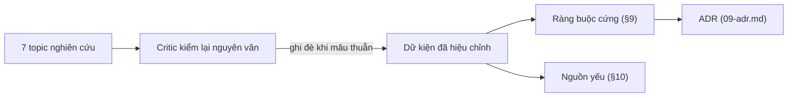

# Tổng hợp nghiên cứu

Phiên bản: 0.12.0-draft · Ngày: 2026-09-29 · Trạng thái: Đề xuất

## Tóm tắt

Tài liệu gom dữ kiện bên ngoài làm căn cứ cho v0.12 theo bảy chủ đề. Mỗi mục nêu dữ kiện có nguồn, rồi hệ quả mà thiết kế đã chọn. Khi bản kiểm lại nguyên văn mâu thuẫn với bản tổng hợp ban đầu, bản kiểm lại được ưu tiên. Ràng buộc cứng ánh xạ sang [09-adr.md](09-adr.md); hiện trạng v0.11 ở [01-audit.md](01-audit.md).

## 1. Chính sách nguồn và kiểm chứng

|Hạng|Loại nguồn|Cách dùng|
|---|---|---|
|1|Docs chính thức của Anthropic (code.claude.com, platform.claude.com)|Căn cứ chính; ưu tiên bản `.md` đọc nguyên văn|
|2|Repo GitHub từ 1.000 sao trở lên, đọc source|Căn cứ về pattern. Số sao kiểm qua GitHub search API ngày 2026-09-29|
|3|Source local (`claudehut`, plugin cache)|Mô tả hiện trạng, trích `path:line`|
|4|Blog, GitHub issue, bản tóm tắt WebFetch|Hạ một bậc tin cậy, gắn nhãn "(tóm tắt)"; xem [§10](#10-nguồn-yếu--chưa-xác-minh)|

## 2. Ngữ nghĩa hook

- Chỉ exit 2 hoặc JSON decision hợp lệ mới chặn được; exit 1, exit 127 (script thiếu hoặc không thực thi được), JSON hỏng và timeout đều fail open ([hooks](https://code.claude.com/docs/en/hooks#exit-code-output), [#94362](https://github.com/anthropics/claude-code/issues/94362)).
- Mọi hook khớp chạy song song; một hook deny không ngăn hook anh em chạy; `additionalContext` của mọi hook đều tới Claude ([hooks-guide](https://code.claude.com/docs/en/hooks-guide#combine-results-from-multiple-hooks)).
- `stop_hook_active=true` ngay từ lần tiếp tục đầu tiên; cap 8 lần áp cho cả Stop lẫn SubagentStop (`CLAUDE_CODE_STOP_HOOK_BLOCK_CAP=0` tắt cap) ([hooks](https://code.claude.com/docs/en/hooks#stop-input), [env-vars](https://code.claude.com/docs/en/env-vars)). Do đó `gate-done.sh:17` chỉ chặn một lần mỗi chuỗi (B3).
- `additionalContext`, `systemMessage`, stdout: tối đa 10.000 ký tự mỗi field, mọi event, không nâng được ([hooks](https://code.claude.com/docs/en/hooks#json-output)).
- Matcher có ký tự như `:` thành regex không neo, nên phải viết `^claudehut:…$`. SubagentStop bắn cả cho agent nội bộ với `agent_type` rỗng ([hooks](https://code.claude.com/docs/en/hooks#matcher-patterns), [#87065](https://github.com/anthropics/claude-code/issues/87065)).
- `async` chỉ có ở `type: "command"`; hook async không điều khiển được gì, output tới ở lượt sau ([hooks](https://code.claude.com/docs/en/hooks#run-hooks-in-the-background)).
- `MultiEdit` không có trong [tools-reference](https://code.claude.com/docs/en/tools-reference); matcher `Write|Edit|MultiEdit` bỏ sót `NotebookEdit` (`hooks.json:27-32`; B8).

**Hệ quả cho thiết kế**
- Hook chỉ advisory: exit 0, tối đa 1 JSON, không deny/block (ADR-H2, ADR-H4). Bỏ hẳn Stop hook thay vì thêm bộ đếm (ADR-R3; B3, B10). Ma trận handler: [05-hooks.md](05-hooks.md).
- Hook plugin đăng ký ngay khi plugin được load ([manifest-reference](https://code.claude.com/docs/en/plugins/manifest-reference#hooks)), nên handler tự thoát khi không có plane hoặc task (ADR-H1, ADR-H7).

## 3. Skill, subagent, plugin

- Listing skill có ngân sách 1% context window tính theo ký tự, mỗi entry tối đa 1.536 ký tự; không có cơ chế ưu tiên khi description giữa các plugin chồng lấn ([skills](https://code.claude.com/docs/en/skills)).
- Issue [#80802](https://github.com/anthropics/claude-code/issues/80802) (open, v2.1.218): plugin skill gọi qua Skill tool có thể không được inject thân SKILL.md; gọi tên trần có thể lỗi ([#97043](https://github.com/anthropics/claude-code/issues/97043)).
- Plugin agent bỏ qua `hooks`, `mcpServers`, `permissionMode`, `initialPrompt` ([components](https://code.claude.com/docs/en/plugins/components)). Subagent mất `AskUserQuestion`, `EnterPlanMode`, `Workflow` ([sub-agents](https://code.claude.com/docs/en/sub-agents)).
- `CLAUDE.md` ở gốc plugin không được nạp; `bin/` ở gốc khiến claude.ai và Cowork không cài plugin ([plugins-reference](https://code.claude.com/docs/en/plugins-reference)).
- `@import` nạp ngay lúc khởi động, không giảm context ([memory](https://code.claude.com/docs/en/memory)). Compaction giữ 5.000 token đầu mỗi skill, tổng 25.000 ([context-window](https://code.claude.com/docs/en/context-window)).
- obra/superpowers (292.573 sao) inject skill bootstrap qua SessionStart ([hooks.json](https://github.com/obra/superpowers/blob/main/hooks/hooks.json)).

**Hệ quả cho thiết kế**
- Chỉ dẫn luôn cần đi qua SessionStart `additionalContext`, ngân sách đo bằng byte (ADR-R6); không dựa vào model tự gọi skill (ADR-R5; F-3).
- Agent read-only dùng allowlist `tools:` không có `mcp__*`; dữ liệu sống do main truy vấn (ADR-V5; F-4).
- Giữ `bin/`, chấp nhận không cài được trên claude.ai/Cowork (ADR-H10).

## 4. Thiết kế agent harness

- Dùng giải pháp đơn giản nhất, chỉ tăng độ phức tạp khi cần; routing phân loại input rồi chuyển sang luồng chuyên biệt ([building-effective-agents](https://www.anthropic.com/engineering/building-effective-agents)).
- "If you could describe the diff in one sentence, skip the plan" ([best-practices](https://code.claude.com/docs/en/best-practices)).
- Chỉ hỏi khi các cách hiểu dẫn tới khối lượng việc khác hẳn; không dùng subagent để tự verify ([Opus 5](https://platform.claude.com/docs/en/build-with-claude/prompt-engineering/prompting-claude-opus-5)).
- Ngôn ngữ cưỡng chế ("CRITICAL: You MUST", "If in doubt, use") gây overtrigger trên model mới ([prompting](https://platform.claude.com/docs/en/build-with-claude/prompt-engineering/claude-prompting-best-practices)); v0.11 dùng kiểu này qua "1% rule" (A3, F-3).
- BMAD leo thang theo rủi ro và độ rõ ý định, không theo số file ([BMAD](https://docs.bmad-method.org/plan/choose-a-planning-path/), tóm tắt). spec-kit clarify hỏi tối đa 5 câu, xếp theo Impact × Uncertainty ([spec-kit](https://github.com/github/spec-kit)).
- Hệ đa agent tốn khoảng 15× token so với chat ([multi-agent](https://www.anthropic.com/engineering/multi-agent-research-system), tóm tắt).

**Hệ quả cho thiết kế**
- Ba route `direct | light | full` do main thread chọn, không mặc định `full`, một AskUserQuestion khi mơ hồ (ADR-R1); xem [04-routing-harness.md](04-routing-harness.md).
- Best-practices khuyên review đối kháng bằng subagent, Opus 5 cấm subagent verify; thiết kế chọn main kiểm chứng, subagent chỉ tie-break (ADR-V7).

## 5. Chuẩn tài liệu kỹ thuật

- ADR Nygard: 5 phần, 1–2 trang, số tăng dần, supersede thay vì sửa ([Nygard](https://www.cognitect.com/blog/2011/11/15/documenting-architecture-decisions), [ADR repo](https://github.com/architecture-decision-record/architecture-decision-record), 17.044 sao). MADR thêm Considered Options, Consequences, Confirmation ([MADR](https://github.com/adr/madr/blob/develop/template/adr-template.md)).
- spec-kit (139.297 sao): spec chỉ WHAT/WHY, ID ổn định FR/SC; plan tham chiếu thay vì chép; task song song đánh `[P]` ([spec-kit](https://github.com/github/spec-kit)).
- EARS có 6 mẫu câu ([EARS](https://alistairmavin.com/ears/)); Gherkin 3–5 bước mỗi kịch bản ([Gherkin](https://cucumber.io/docs/gherkin/reference/)).
- C4: System Context và Container đủ cho đa số team ([C4](https://c4model.com/diagrams)); GitHub render Mermaid, phiên bản có thể trễ ([GitHub](https://docs.github.com/en/get-started/writing-on-github/working-with-advanced-formatting/creating-diagrams)).
- Ngân sách độ dài có nguồn chỉ gồm ADR 1–2 trang, mini design doc 1–3 trang ([industrialempathy](https://www.industrialempathy.com/posts/design-docs-at-google/), nguồn yếu), Gherkin 3–5 bước.

**Hệ quả cho thiết kế**
- Template là schema; luật cấu trúc chặn ở `set-*`, độ dài chỉ đo và hiển thị (ADR-D1; C1, C2).
- Revise tại chỗ kèm Changelog, supersede quyết định (ADR-D4; C3); plan không chứa code, dùng bảng và diagram (ADR-D3; C4, C5); yêu cầu EARS + GWT, ID `AC-xxx` (ADR-D7). Xem [06-artifact-standards.md](06-artifact-standards.md).

## 6. understand-anything: năng lực và giới hạn

- Upstream là [Egonex-AI/Understand-Anything](https://github.com/Egonex-AI/Understand-Anything) (84.579 sao); `main` 2.9.7, local 2.7.5.
- Chỉ một `PROJECT_ROOT` mỗi lần chạy, kể cả trên `main` ([extract-import-map.mjs](https://github.com/Egonex-AI/Understand-Anything/blob/main/understand-anything-plugin/skills/understand/extract-import-map.mjs)); `merge-subdomain-graphs.py` (2.7.5) dedup node theo id, bản sau thắng, không namespace repo.
- Resolver Java khớp hậu tố đường dẫn trên toàn cây, không xét module Gradle/Maven; trên ewallet sinh khoảng 480 cạnh `imports` liên service giả do `io.f8a.summer` vendored.
- Graph ewallet (jq trên `knowledge-graph.json`): 6.747 node, 96% cạnh là `imports`, 0 cạnh `publishes`/`routes`, 0 node endpoint; 963 node sai tiền tố id, 3.293 summary placeholder.
- Incremental dựa vào `git rev-parse HEAD` tại root; workspace không phải git repo nên `gitCommitHash='HEAD_UNKNOWN'`.
- Không có MCP hay CLI truy vấn; skill chat/diff chỉ grep JSON.

**Hệ quả cho thiết kế**
- UA không làm index hay nguồn topology, chỉ là lớp hiển thị tuỳ chọn cho graph mức service ở hub (ADR-IDX-1, ADR-IDX-4; D4, F-2).
- Cạnh liên service lấy tất định từ contract HTTP/Kafka (ADR-IDX-3).

## 7. Phương án thay thế cho index code

|Công cụ|Sao|Phương pháp|Incremental|Đa repo|Giao diện agent|Java|Phù hợp|
|---|---|---|---|---|---|---|---|
|`LSP` + [jdtls-lsp](https://code.claude.com/docs/en/plugins/code-intelligence)|chính thức|LSP|server tự lo|theo workspace|tool built-in|có|Tuỳ chọn cho truy vấn symbol; không chạy trong cloud session|
|[CodeGraph](https://github.com/colbymchenry/codegraph)|72.303|tree-sitter + SQLite|watcher, hash|`projectPath`|MCP|đầy đủ|MIT; loại vì thêm MCP và daemon|
|[codebase-memory-mcp](https://github.com/DeusData/codebase-memory-mcp)|45.402|tree-sitter + SQLite|watcher|cạnh `CROSS_*`|MCP|LSP lai|License và khả năng hiểu Spring/Kafka chưa xác minh|
|[GitNexus](https://github.com/abhigyanpatwari/GitNexus)|47.637|tree-sitter + graph DB|`--watch`|`group` (route, AsyncAPI)|MCP|có|PolyForm Noncommercial, không dùng được cho ewallet|
|[Serena](https://github.com/oraios/serena)|29.883|LSP|chưa rõ|1 project|MCP|có|Không hợp đa repo|
|[aider](https://aider.chat/docs/repomap.html)|49.253|tree-sitter + PageRank|cache mtime|—|sinh mỗi lượt|có|Mượn ý xếp hạng theo ngân sách token|
|[claude-context](https://github.com/zilliztech/claude-context)|12.574|embedding|Merkle|chưa rõ|MCP|có|Cần vector DB|
|[code-graph-rag](https://github.com/vitali87/code-graph-rag)|5.188|tree-sitter + Memgraph|realtime|graph chung|MCP|có|Cần Docker|
|[zoekt](https://github.com/sourcegraph/zoekt)|1.937|trigram|định kỳ|`local-sync`|CLI|qua ctags|Chỉ search|
|[ctags](https://docs.ctags.io/en/latest/man/ctags.1.html)|7.288|tag định nghĩa|`--append` thủ công|không|CLI|có|Không có tham chiếu|
|[SCIP](https://github.com/scip-code/scip)|815|theo compiler|—|—|định dạng|scip-java|Dưới ngưỡng sao, chỉ để tham chiếu|
|understand-anything|84.579|tree-sitter + LLM|git tại root|không|grep JSON|resolver hậu tố|Xem §6|
|[MCP memory](https://github.com/modelcontextprotocol/servers/tree/main/src/memory)|90.651|entity/relation|—|—|MCP|—|Không index code|

**Hệ quả cho thiết kế**
- Index do script tất định sinh, đóng dấu commit, truy vấn qua Bash CLI `claudehut-index` chỉ đọc (ADR-IDX-1, ADR-IDX-2). Không dùng MCP vì tên tool phải khai đúng trong `tools:`, kiểu lỗi từng chết âm thầm (F-4, F-PA-2).
- Độ tươi: so HEAD từng repo, cập nhật nền, git hook opt-in; `git pull --rebase` kích hoạt `post-rewrite`, không phải `post-merge` ([githooks](https://git-scm.com/docs/githooks)) (ADR-IDX-5, ADR-H8; D2). Xem [07-index-memory.md](07-index-memory.md).

## 8. Chi phí và chất lượng review

- Plugin code-review hiện hành: 4 reviewer song song (2 Sonnet cho CLAUDE.md, 2 Opus tìm bug), mỗi issue một subagent kiểm chứng; đã bỏ chấm 0–100 ngưỡng 80; loại pre-existing, nitpick, lỗi linter bắt được ([code-review.md](https://github.com/anthropics/claude-code/blob/main/plugins/code-review/commands/code-review.md)).
- claude-security (local, `plugins/claude-security/workflows/scan.js`): dedup bằng code theo (file, line, CWE) trước verify; panel 3 verifier, giữ khi có ít nhất 2 TRUE_POSITIVE.
- Code Review managed: severity Important/Nit/Pre-existing, trung bình $15–25 mỗi review; REVIEW.md cap số Nit, bắt buộc `file:line` ([code-review](https://code.claude.com/docs/en/code-review)).
- pr-agent tự phản tư cả lô trong 1 call ([pr-agent](https://github.com/The-PR-Agent/pr-agent/blob/main/docs/docs/core-abilities/self_reflection.md)).
- Giá: Opus 5.5 $4/$20, Sonnet 5.x $2/$10, Haiku 4.5 $1/$5 mỗi MTok ([pricing](https://platform.claude.com/docs/en/about-claude/pricing)). Opus/Sonnet 5.5 mặc định effort medium; max "prone to overthinking" ([model-config](https://code.claude.com/docs/en/model-config)). Tối đa 20 subagent đồng thời ([sub-agents](https://code.claude.com/docs/en/sub-agents)).

**Hệ quả cho thiết kế**
- Lane chọn bằng script tất định theo diff, mỗi lane một pack ghim SHA (ADR-V1, ADR-V2; E1, E4).
- Model/effort theo lane, bỏ ultrathink (ADR-V4; E7); main dedup và kiểm chứng, pre-existing là verdict (ADR-V7). Xem [08-review.md](08-review.md).

## 9. Ràng buộc cứng

|Ràng buộc|Nguồn|Ảnh hưởng tới ADR|
|---|---|---|
|Chỉ exit 2 hoặc JSON decision chặn được; mọi lỗi khác fail open|[hooks](https://code.claude.com/docs/en/hooks#exit-code-output)|ADR-H4|
|`stop_hook_active=true` từ lần tiếp tục đầu; cap 8 lần|[hooks](https://code.claude.com/docs/en/hooks#stop-input), [env-vars](https://code.claude.com/docs/en/env-vars)|ADR-R3, ADR-H2|
|Output hook tối đa 10.000 ký tự mỗi field|[hooks](https://code.claude.com/docs/en/hooks#json-output)|ADR-R6|
|Hook plugin đăng ký ngay khi plugin được load|[manifest-reference](https://code.claude.com/docs/en/plugins/manifest-reference#hooks)|ADR-H1, ADR-H7|
|Matcher có `:` là regex không neo; `agent_type` có thể rỗng|[hooks](https://code.claude.com/docs/en/hooks#matcher-patterns), [#87065](https://github.com/anthropics/claude-code/issues/87065)|ADR-H7, ADR-R4|
|Plugin agent bỏ qua `hooks`, `mcpServers`|[components](https://code.claude.com/docs/en/plugins/components)|ADR-V5, ADR-IDX-2|
|Thân plugin skill có thể không được inject|[#80802](https://github.com/anthropics/claude-code/issues/80802)|ADR-R5, ADR-R6|
|Subagent không có `AskUserQuestion`|[sub-agents](https://code.claude.com/docs/en/sub-agents)|ADR-R1|
|`bin/` ở gốc chặn claude.ai/Cowork|[plugins-reference](https://code.claude.com/docs/en/plugins-reference)|ADR-H10|
|`@import` không giảm context|[memory](https://code.claude.com/docs/en/memory)|ADR-IDX-6|
|UA chỉ một root, resolver hậu tố|[extract-import-map.mjs](https://github.com/Egonex-AI/Understand-Anything/blob/main/understand-anything-plugin/skills/understand/extract-import-map.mjs)|ADR-IDX-1, ADR-IDX-3|
|GitNexus theo PolyForm Noncommercial|[GitNexus](https://github.com/abhigyanpatwari/GitNexus)|ADR-IDX-3|
|Git hook không đi theo clone; `post-merge` không chạy khi conflict|[githooks](https://git-scm.com/docs/githooks)|ADR-IDX-5|
|Tối đa 20 subagent đồng thời; effort max giảm lợi ích|[sub-agents](https://code.claude.com/docs/en/sub-agents), [model-config](https://code.claude.com/docs/en/model-config)|ADR-V1, ADR-V4|

## 10. Nguồn yếu / chưa xác minh

- industrialempathy.com là blog cá nhân, không phải tài liệu của Google.
- Kiro, BMAD, adr.github.io, CodeRabbit chỉ đọc qua bộ tóm tắt; CodeRabbit closed-source.
- Số liệu anthropic.com/engineering (4×/15× token, 90,2%, 80% phương sai) và [blog Code Review](https://claude.com/blog/code-review) (16%→54%, dưới 1% sai) chưa đọc nguyên văn.
- Bài Nygard là nguồn gốc nhưng không phải repo; arc42-template (1.302 sao) vừa qua ngưỡng; SCIP (815) dưới ngưỡng.
- Claim từ GitHub issue là báo cáo người dùng, không phải xác nhận của Anthropic.
- Chưa kiểm: `hooks:` trong frontmatter plugin SKILL có được đăng ký; `command_name` của UserPromptExpansion có prefix `claudehut:`; `MultiEdit` còn trong runtime; agent plugin `Explore` có override built-in.
- UA `main` dùng PostToolUse(Bash) chạy `post-tool-use-auto-update.mjs` ([hooks.json](https://raw.githubusercontent.com/Egonex-AI/Understand-Anything/main/understand-anything-plugin/hooks/hooks.json)), mâu thuẫn README ("post-commit hook"); mô tả hook bản 2.7.5 đã cũ. Luật cấm prefix project trong node ID chưa thấy lại trên `main`.
- Claim "SessionStart không hỗ trợ `async`" (topic index) không khớp [hooks](https://code.claude.com/docs/en/hooks#run-hooks-in-the-background), nơi `async` chỉ giới hạn ở `type: "command"`; cần đưa vào nhóm probe runtime trước M1 ([10-rollout-eval.md](10-rollout-eval.md)) vì `maintain.sh` async của ADR-H8 phụ thuộc điểm này.
- Mâu thuẫn review đối kháng ([best-practices](https://code.claude.com/docs/en/best-practices)) và cấm subagent verify (Opus 5) cần eval trên model đích.

## Nguồn

1. https://code.claude.com/docs/en/hooks
2. https://code.claude.com/docs/en/hooks-guide
3. https://code.claude.com/docs/en/env-vars
4. https://code.claude.com/docs/en/tools-reference
5. https://code.claude.com/docs/en/skills
6. https://code.claude.com/docs/en/plugins/components
7. https://code.claude.com/docs/en/sub-agents
8. https://code.claude.com/docs/en/plugins-reference
9. https://code.claude.com/docs/en/memory
10. https://code.claude.com/docs/en/context-window
11. https://code.claude.com/docs/en/best-practices
12. https://code.claude.com/docs/en/plugins/code-intelligence
13. https://code.claude.com/docs/en/code-review
14. https://code.claude.com/docs/en/model-config
15. https://platform.claude.com/docs/en/build-with-claude/prompt-engineering/prompting-claude-opus-5
16. https://platform.claude.com/docs/en/build-with-claude/prompt-engineering/claude-prompting-best-practices
17. https://platform.claude.com/docs/en/about-claude/pricing
18. https://www.anthropic.com/engineering/building-effective-agents
19. https://www.anthropic.com/engineering/multi-agent-research-system
20. https://claude.com/blog/code-review
21. https://github.com/anthropics/claude-code/issues/80802
22. https://github.com/anthropics/claude-code/issues/97043
23. https://github.com/anthropics/claude-code/issues/87065
24. https://github.com/anthropics/claude-code/issues/94362
25. https://github.com/obra/superpowers/blob/main/hooks/hooks.json
26. https://docs.bmad-method.org/plan/choose-a-planning-path/
27. https://github.com/github/spec-kit
28. https://www.cognitect.com/blog/2011/11/15/documenting-architecture-decisions
29. https://github.com/architecture-decision-record/architecture-decision-record
30. https://github.com/adr/madr/blob/develop/template/adr-template.md
31. https://alistairmavin.com/ears/
32. https://cucumber.io/docs/gherkin/reference/
33. https://c4model.com/diagrams
34. https://docs.github.com/en/get-started/writing-on-github/working-with-advanced-formatting/creating-diagrams
35. https://www.industrialempathy.com/posts/design-docs-at-google/
36. https://github.com/Egonex-AI/Understand-Anything
37. https://github.com/Egonex-AI/Understand-Anything/blob/main/understand-anything-plugin/skills/understand/extract-import-map.mjs
38. https://raw.githubusercontent.com/Egonex-AI/Understand-Anything/main/understand-anything-plugin/hooks/hooks.json
39. https://github.com/colbymchenry/codegraph
40. https://github.com/DeusData/codebase-memory-mcp
41. https://github.com/abhigyanpatwari/GitNexus
42. https://github.com/oraios/serena
43. https://aider.chat/docs/repomap.html
44. https://github.com/zilliztech/claude-context
45. https://github.com/vitali87/code-graph-rag
46. https://github.com/sourcegraph/zoekt
47. https://docs.ctags.io/en/latest/man/ctags.1.html
48. https://github.com/scip-code/scip
49. https://github.com/modelcontextprotocol/servers/tree/main/src/memory
50. https://git-scm.com/docs/githooks
51. https://github.com/anthropics/claude-code/blob/main/plugins/code-review/commands/code-review.md
52. https://github.com/The-PR-Agent/pr-agent/blob/main/docs/docs/core-abilities/self_reflection.md
53. https://code.claude.com/docs/en/plugins/manifest-reference
