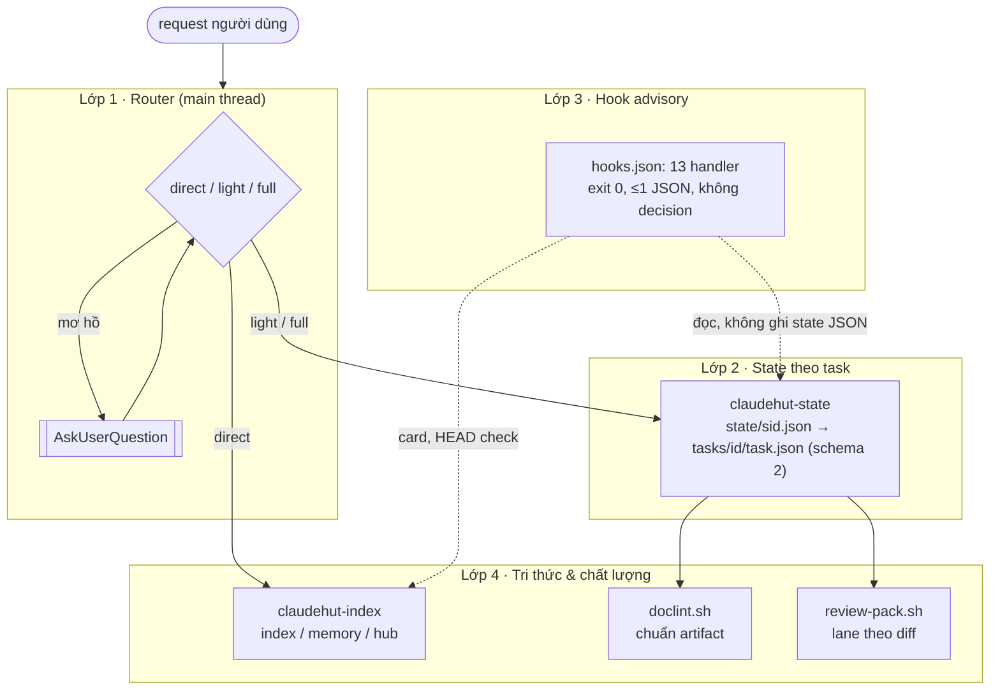
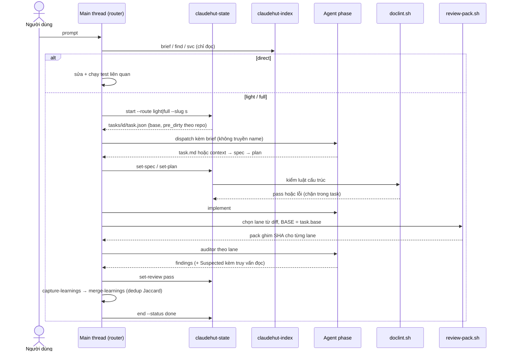
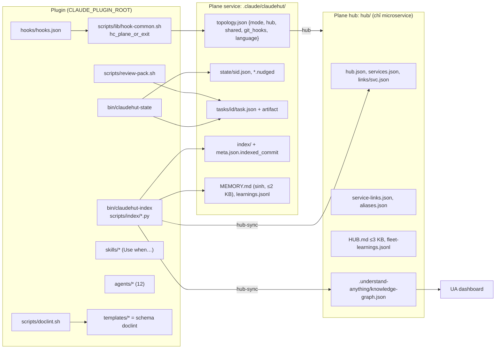

# Kiến trúc tổng thể ClaudeHut v0.12

Phiên bản: 0.12.0-draft · Ngày: 2026-09-29 · Trạng thái: Đề xuất

## Tóm tắt

v0.12 chia plugin thành bốn lớp: Router, State theo task, Hook advisory và Tri thức & chất lượng (index/memory, chuẩn tài liệu, review). Lớp nào không được dùng thì không để lại dấu vết: tuyến `direct` không tạo state hay artifact; hook tự thoát khi không có plane và chỉ quan sát khi không có task. Không hook nào chặn; kiểm tra cấu trúc chỉ còn ở `set-*` bên trong task đã opt-in. Dữ kiện về code, lane review và độ tươi index do script tất định tính ra, không do LLM ghi.

## 1. Nguyên tắc

| # | Nguyên tắc | Hệ quả kiến trúc | Căn cứ |
|---|---|---|---|
| P1 | Opt-in, vô hình khi không dùng | `direct` không ghi gì; SessionStart không arm; hook thoát khi không có plane | ADR-H1, ADR-R2 (A9, B2, B10) |
| P2 | Advisory, không chặn | Hook exit 0, tối đa 1 JSON, không `decision`/`permissionDecision`/`updatedInput`; bỏ Stop | ADR-R3, ADR-H2, ADR-H4 (A7, B1, B8) |
| P3 | Định tuyến theo ngữ nghĩa, hỏi khi mơ hồ | Main thread chọn route, không mặc định `full`; hai tuyến kề nhau có khối lượng khác hẳn thì gọi 1 AskUserQuestion | ADR-R1 (A3, A4, A10) |
| P4 | State gắn với task, không gắn với session | `tasks/<id>/task.json` tạo mới ở `start`; session chỉ giữ con trỏ | ADR-R2, ADR-H6 (A6, B4, B7) |
| P5 | Dữ kiện do máy trích | Index, lane review và độ tươi do script tính; LLM không ghi index | ADR-IDX-1, ADR-IDX-5, ADR-V1 (D2, D7, E1) |
| P6 | Context just-in-time, đo trên payload thực | Chỉ nạp con trỏ. Ngân sách: digest ≤2.500 B, phần ClaudeHut ≤4.000 B, MEMORY.md sinh ra ≤2 KB | ADR-R6, ADR-IDX-6 (F-7, D1) |
| P7 | Cùng tồn tại, không độc quyền | Chọn skill/agent qua description; không ghi vào dữ liệu của plugin khác | ADR-H7, ADR-R5, ADR-IDX-4 (F-2, F-3) |

P2 có một ngoại lệ: `set-*` chặn khi artifact vi phạm luật cấu trúc của doclint (xem [§6](#6-quyết-định-xuyên-vùng)).

## 2. Bốn lớp

| Lớp | Thành phần chính | Khi nào hoạt động | Chi tiết |
|---|---|---|---|
| Router | `skills/claudehut-workflow/references/digest.md` (≤2.500 B, tự đủ vì [#80802](https://github.com/anthropics/claude-code/issues/80802)) | Mỗi request mới, chỉ ở main thread | [04](04-routing-harness.md) |
| State theo task | `bin/claudehut-state`, schema 2; sid qua `CLAUDE_ENV_FILE` (B7) | Chỉ với `light`/`full` | [04](04-routing-harness.md), [05](05-hooks.md) |
| Hook advisory | `hooks/hooks.json`, `scripts/lib/hook-common.sh` | Mọi phiên; tự thoát khi không có plane | [05](05-hooks.md) |
| Tri thức & chất lượng | `bin/claudehut-index`, `scripts/doclint.sh`, `scripts/review-pack.sh`, 12 agent | Theo nhu cầu, ở mọi tuyến | [06](06-artifact-standards.md), [07](07-index-memory.md), [08](08-review.md) |

## 3. Vòng đời request

| Route | State | Artifact | Review |
|---|---|---|---|
| `direct` | Không có | Không có | Không, trừ khi user yêu cầu |
| `light` | `task.json` | `task.md` (Approach + Tasks, ngân sách 600 từ) | Một reviewer; test fold vào reviewer |
| `full` | `task.json` | `context.md` → [brainstorm] → spec → plan → [plan-review] | reviewer + test-runner + các lane có tín hiệu |

Audit và investigation đi tuyến `direct` (A10). Tiêu chí phân tuyến: [04](04-routing-harness.md); chuẩn artifact: [06](06-artifact-standards.md).

## 4. Thành phần và plane

| CLI | Lệnh | Ai gọi | Ghi vào |
|---|---|---|---|
| `claudehut-state` | `start`, `set-route`, `set-phase`, `set-spec`, `set-plan`, `set-plan-review`, `set-brainstorm`, `set-review`, `end`, `resume`, `status` | Main thread qua Bash | `state/`, `tasks/<id>/task.json` |
| `claudehut-index` | Đọc: `status\|brief\|find\|svc\|links`. Ghi: `update\|hub-sync\|hub-scan\|memory\|install-git-hooks\|uninstall-git-hooks` | Agent chỉ dùng lệnh đọc; lệnh ghi do hook, git hook, init, merge-learnings gọi | `index/`, `hub/`, `MEMORY.md` |
| `doclint.sh` | Kiểm artifact theo template | `set-*` (chặn); `doclint-advise.sh` (advisory) | Không ghi |
| `review-pack.sh` | Chọn lane; pack ≤1.500 dòng mỗi lane; round 2 tất định | Skill review | `state/<sid>.review-pack.r<N>.<lane>.md` |

Phân giải plane: plane cục bộ, nếu không có thì `topology.json.hub` (override bằng `CLAUDEHUT_HUB`); không walk ngược cây (ADR-H9). Topology và độ tươi index: [07](07-index-memory.md).

## 5. Khác biệt v0.11 → v0.12

| Khía cạnh | v0.11 | v0.12 |
|---|---|---|
| Kích hoạt | bootstrap arm `phase=discover` ở mọi session (B2, A9) | Chỉ khi chạy `claudehut-state start` |
| Phân loại việc | `complexity` mặc định `full`, luật "1% rule"; 61/75 lần chọn full (A3) | 3 route; hỏi khi mơ hồ; override bằng lời |
| State | Một file theo session; field của task cũ rò sang task mới (A6, B4) | Schema 2; file không có `schema:2` được coi là không có task |
| Lối thoát | `bypass`; 14–19 file state còn `bypass=true` (B6) | Tuyến `direct`; bỏ bypass |
| Hook | 16 handler; deny ghi file, Stop block, in 2 JSON (A7, A9, B1) | 13 handler advisory; không Stop |
| Chi phí SessionStart | Median 8.999 B; spawn `claude plugin list` 1–5 s (F-7, B10) | ≤4.000 B; phần bảo trì chạy trong `maintain.sh` async |
| Tài liệu | Gate chỉ grep sự có mặt; không ngân sách; 41% dòng plan là code (C1, C2, C4) | Luật cấu trúc của doclint chặn ở `set-*`; ngân sách chỉ advisory; plan không chứa Java |
| Review | "default ON" ở full; 28/52 đợt có ≥4 agent; auditor tự chạy `git diff` (E1, E4) | Lane do script chọn; pack ghim SHA; roster 7 → 5 |
| Tool của agent | Tên `mcp__*` khai báo sai, 0 lần gọi đúng tên đã khai báo (F-4, E6) | Allowlist không có MCP; main thread chạy truy vấn Suspected |
| Index | reuse-index do LLM ghi; party-ms 24/43 path hợp lệ; không gắn với git (D7, D2) | `claudehut-index` tất định, đóng dấu commit |
| Memory | MEMORY.md 105 KB; 40 learning rỗng (D1, D5) | MEMORY.md sinh ra ≤2 KB; learnings có schema và dedup |
| Microservice | Federation chưa bật; 575 lần đọc chéo service (D8) | Plane cho từng service cộng hub do user chọn |
| understand-anything | Lệnh "MUST use" nhưng không có năng lực đi kèm (F-2) | Digest chỉ nêu dữ kiện; hub có graph cho dashboard |
| Agent | 14 | 12 (db-reviewer gộp perf, contract-reviewer gộp observability) |

Migration từ v0.11: [10](10-rollout-eval.md).

## 6. Quyết định xuyên vùng

Bảng này thắng thiết kế của từng vùng khi mâu thuẫn.

| Vấn đề | Giải pháp chốt | Căn cứ |
|---|---|---|
| Ba mô hình state không tương thích | Lấy mô hình của Hooks làm nền, dùng verb của Router. `task.json` gồm `route, profile, phase, plan_approved, review, plan_review_round, base{repo:sha}, pre_dirty{repo:[f]}, scope[], enforcement_set[]`. Bỏ `pause`, `set-bypass`, `set-complexity`, `mark-skill`, `doc_schema` | A5, A6, B4, B6 |
| Dữ liệu legacy v0.11 | File không có `schema:2` được coi là không có task; task dở không resume được. Bỏ nhánh legacy trong doclint và gate-tests | A9, B2, B6, B9 |
| Bốn bộ từ vựng cho cỡ việc | Một trục `route`; header doclint và review-pack cùng đọc `route` | A3, A4, E9 |
| Bề mặt tool của agent chỉ đọc | Auditor: `Read, Grep, Glob, Bash` (test-runner `Bash, Read, Grep`). Explorer thêm `LSP`. reuse-scanner: `Read, Grep, Glob, Write, LSP`. Không tên `mcp__*` | F-4, F-PA-2, E6 |
| Giữ hay bỏ Stop | Bỏ; task treo bị superseded khi `start` mới | A7, B1, B3, F-5 |
| CLI có kiểm nội dung không | Có, chỉ luật cấu trúc ở `set-*`; ngân sách chỉ advisory; `set-review pass` giữ gate hiện có; bỏ content-regex cũ | A8, C1, C3–C8 |
| Danh tính teammate | Giữ `record-agent-dispatch` và `resolve-agent`. SubagentStop không matcher, chỉ ghi ledger | F-1, [#87065](https://github.com/anthropics/claude-code/issues/87065) |
| Tìm hub | `topology.json` trong mọi plane service; bỏ file `.link` | ADR-H9 |
| Trigger làm tươi index | `maintain.sh` async, so HEAD trong `inject-phase.sh`, banner ở `brief/svc`, git hook opt-in. Bỏ PostToolUse Bash | D2 |
| Ngân sách SessionStart | Đo theo byte bằng `lint-prompt-length.sh --payload`: digest ≤2.500 B, phần ClaudeHut ≤4.000 B, index card ≤500 B | F-7, F-PA-4 |
| Lọc lượt máy sinh | Regex hợp `teammate-message\|task-notification\|agent-message\|Another Claude session…` | F-6 |
| Số handler | 13, tính cả `doclint-advise` và `hint-explore` (chỉ microservice) | [05](05-hooks.md) |
| Predicate của write hook | plane ∧ task schema 2 ∧ `route=full` ∧ `!plan_approved` ∧ path ∈ `scope` ∧ chưa nhắc; dedupe bằng `state/<sid>.nudged` | B9 |
| Nguồn diff cho review | Có task: `task.base[repo]`, loại `pre_dirty`. Không có task: merge-base | A1, B5, E2 |
| Mã ADR bị trùng | ADR-R* cho Router, ADR-V* cho Review | [09](09-adr.md) |
| Việc ghi nặng trong SessionStart | Chuyển sang `maintain.sh` async; hiệu lực từ phiên sau | D1, B10 |

## 7. Cùng tồn tại với plugin khác

### Hook

Hook từ mọi nguồn (user, project, plugin, frontmatter) được gộp và chạy song song ([hooks-guide](https://code.claude.com/docs/en/hooks-guide#combine-results-from-multiple-hooks)). Hợp đồng của ClaudeHut suy ra từ ngữ nghĩa gộp (ADR-H7):

| Ngữ nghĩa | Hợp đồng ClaudeHut |
|---|---|
| Quyết định PreToolUse lấy mức chặt nhất: `deny > defer > ask > allow` | Không trả `permissionDecision` hay `continue`, nên không đổi quyết định của plugin khác |
| Nhiều `updatedInput` thì hook xong sau cùng thắng ([limitations](https://code.claude.com/docs/en/hooks-guide#limitations), [#83353](https://github.com/anthropics/claude-code/issues/83353)) | Không trả `updatedInput`, không tranh chấp với rtk (rewrite Bash) |
| `additionalContext` cộng dồn, trần 10.000 ký tự mỗi field ([hooks](https://code.claude.com/docs/en/hooks#json-output)) | Chỉ viết câu sự thật; tuân ngân sách ở P6 |
| Matcher chứa `:` được hiểu là regex không neo ([matcher](https://code.claude.com/docs/en/hooks#matcher-patterns)) | Matcher là danh sách chính xác hoặc neo `^…$`; `"${CLAUDE_PLUGIN_ROOT}"` có quote |
| UA có hook PostToolUse Bash riêng | Không thêm hook Bash cho git; không làm tươi graph của UA |

### Skill và agent

Claude chọn skill theo description; docs chỉ nói description chồng lấn có thể gây nạp nhầm, không định nghĩa thứ tự ưu tiên giữa các plugin ([skills](https://code.claude.com/docs/en/skills)). Vì vậy:

- Digest chỉ nêu dữ kiện năng lực (graph/hub ở đâu), không mệnh lệnh "MUST" (F-2, F-3); description phase skill dạng "Use when…".
- Hướng dẫn user gọi bằng tên có prefix `/claudehut:<name>`, vì tên trần có thể lỗi ([#97043](https://github.com/anthropics/claude-code/issues/97043)).
- Dispatch agent ClaudeHut không truyền `name`: có `name` thì mất danh tính agent và frontmatter không được áp (F-1).
- Reviewer của plugin khác chạy như lane opt-in `ext:<tên>`, findings chuẩn hoá vào `review.md` (ADR-V10, F-8).
- Giữ tên `db-reviewer`, `test-runner` để `ewallet-query-audit` vẫn dispatch được (ADR-V3).

### understand-anything (UA)

| Việc | Quy tắc |
|---|---|
| Ghi dữ liệu | Không ghi vào `.understand-anything/` của repo hay root, vì UA chỉ nhận một PROJECT_ROOT. Graph mức service nằm ở `hub/.understand-anything/` (ADR-IDX-4) |
| Đọc graph | Explorer đọc bằng Read hoặc `jq`; skill UA chỉ là đường phụ (F-2) |
| Dashboard | `/understand-anything:understand-dashboard <HUB>/.claude/claudehut/hub`; graph ghi đủ field mà zod bắt buộc |
| Graph root 7,5 MB | Giữ nguyên; `status` báo đây là nguồn không đáng tin (D9) |

Câu hỏi mở đã chốt (2026-09-29): không có strict opt-in; hub ở repo tri thức riêng; probe runtime đã chạy, kết quả ở [10 §3](10-rollout-eval.md#3-probe-runtime-trước-m1m2); ngôn ngữ chọn khi init (ADR-R7). Danh sách đầy đủ: [10 §7](10-rollout-eval.md#7-câu-hỏi-mở).
