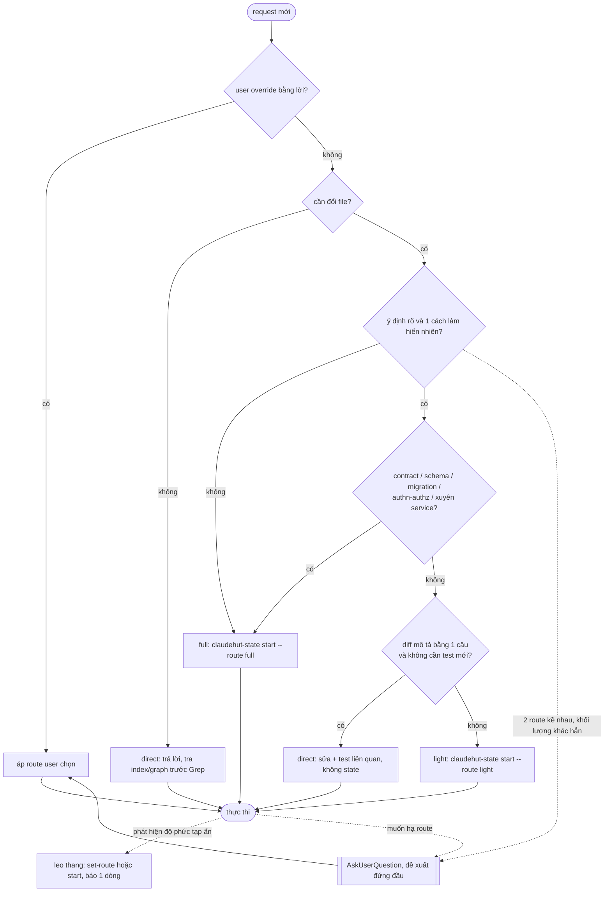
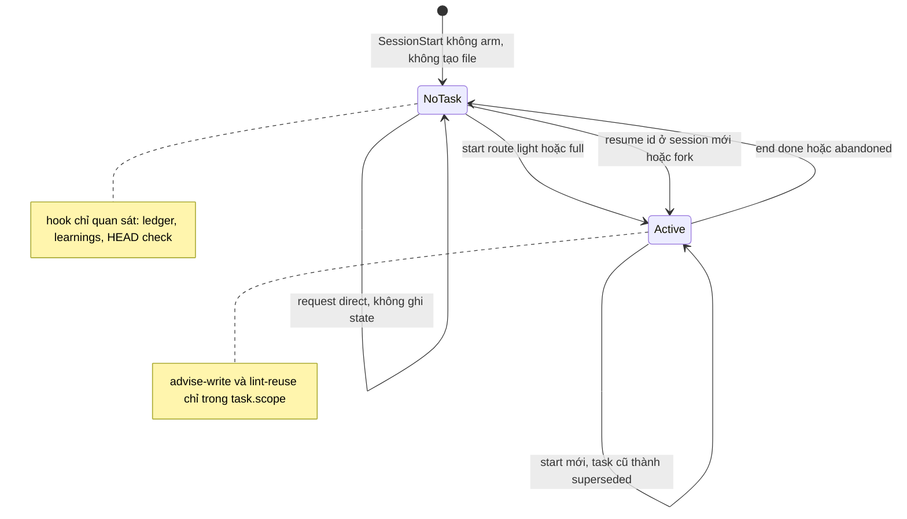
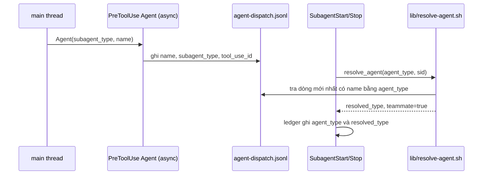

# Router, task state và harness

Phiên bản: 0.12.0-draft · Ngày: 2026-09-29 · Trạng thái: Đề xuất

## Tóm tắt

Main thread xếp request vào route `direct | light | full` theo độ rõ ý định và rủi ro ngữ nghĩa, và hỏi một câu AskUserQuestion khi hai route kề nhau đều hợp lý. Chỉ `light`/`full` tạo task: `tasks/<id>/task.json` schema 2 được tạo mới ở `start`, còn session chỉ giữ con trỏ `active_task`. Không có task thì plugin im lặng. Skill, agent và MCP của mọi plugin được chọn qua description; auditor dùng allowlist hẹp, dữ liệu sống do main thread truy vấn.

Liên quan: [ADR-R1..R7](09-adr.md), [03-architecture.md](03-architecture.md), [05-hooks.md](05-hooks.md), [06-artifact-standards.md](06-artifact-standards.md).

## 1. Vấn đề

Chi tiết và số liệu ở [01-audit.md](01-audit.md).

| Nhóm | Hiện trạng v0.11 | Id |
|---|---|---|
| Phân loại | Mọi tín hiệu nghiêng về full (61/75 lần) | A3, A4 |
| Gate đẩy ngược | Đếm cả working tree bẩn, deny rồi đẩy lên full | A1, B5 |
| Nghi thức | Artifact chỉ để qua gate; gate bị lách qua Bash | A8, B8 |
| Không lối thoát | `set-bypass` bị chặn; 14–19 file còn `bypass=true` | A5, B6 |
| Vòng đời state | Arm mọi phiên, rò trường của task cũ, sid sai | A9, B2, A6, B4, B7 |
| Lượt thừa | Stop fail-open, chặn lượt chờ và lượt máy sinh | B1, A7, B3, F-5 |
| Inject thừa | Inject trên lượt máy sinh, "Untriaged" khi chỉ hỏi | A10, F-6, B10 |
| Harness | Law đóng, MCP sai tên, mất danh tính teammate, payload không được đo | F-1..F-4, F-7, F-PA-1..4 |

## 2. Rubric định tuyến

Quy trình chỉ tăng khi có tín hiệu ([building effective agents](https://www.anthropic.com/engineering/building-effective-agents)); diff mô tả được bằng một câu thì bỏ qua plan ([best practices](https://code.claude.com/docs/en/best-practices)); triage dựa trên ý định và rủi ro ([BMAD](https://docs.bmad-method.org/plan/choose-a-planning-path/)). Không dùng số file, regex đường dẫn hay luật "≥2 approaches" (A1, A2, A4).

| Tín hiệu | Route | Hệ quả |
|---|---|---|
| Không đổi file: hỏi, giải thích, RCA, audit | `direct` | Không task, artifact, review (trừ khi user yêu cầu) (A10) |
| Diff mô tả được bằng một câu, trong một module, không có tín hiệu rủi ro | `direct` | Sửa, chạy test liên quan; tra index/hub/graph trước Grep |
| Ý định rõ, một cách làm hiển nhiên, cần test mới hoặc vài file trong một service | `light` | `task.md` (Approach + Tasks), một reviewer |
| Ý định chưa rõ, hoặc có ≥2 cách làm khác nhau thực chất | `full` | Chuỗi phase đầy đủ, xem [06](06-artifact-standards.md) |
| Đổi contract API/Kafka, schema/migration, authn/authz, hoặc xuyên service | `full` | Như trên; review theo lane, xem [08](08-review.md) |

**Quy tắc hỏi.** Khi hai route kề nhau đều hợp lý và khối lượng khác hẳn, main thread gọi đúng một AskUserQuestion với 2–3 lựa chọn; route đề xuất đứng đầu kèm lý do một dòng ([prompting Opus 5](https://platform.claude.com/docs/en/build-with-claude/prompt-engineering/prompting-claude-opus-5)). Mọi subagent đều không có AskUserQuestion nên router nằm ở main thread ([sub-agents](https://code.claude.com/docs/en/sub-agents)).

**Leo thang / hạ route.**

| Chiều | Hành động |
|---|---|
| Lên (`direct`→`light`/`full`, `light`→`full`) | Tự thực hiện (`start` hoặc `set-route`), báo user một dòng |
| Xuống | Phải hỏi bằng AskUserQuestion |

**Override bằng lời.** "skip workflow" hoặc "làm nhanh" chuyển sang `direct`; nếu đang có task thì gọi `end --status abandoned`. "làm đủ quy trình" chuyển sang `full`. Override chỉ áp dụng cho request hiện tại và không cần bypass (A5). Phạm vi override — Đã chốt (2026-09-29): chỉ request hiện tại, chưa thêm slash command ([10](10-rollout-eval.md#7-câu-hỏi-mở), câu 7).



## 3. State theo task (schema 2)

Dùng mô hình state của Hooks và verb của Router (ADR-R2, ADR-H6). Cả hai file nằm trong plane `$CLAUDE_PROJECT_DIR/.claude/claudehut/`.

```jsonc
// state/<sid>.json — chỉ là con trỏ
{ "schema": 2, "active_task": "0042-fix-ilike" }

// tasks/0042-fix-ilike/task.json
{
  "schema": 2,
  "id": "0042-fix-ilike",
  "route": "light",
  "profile": "bugfix",
  "phase": "implement",
  "plan_approved": false,
  "review": "pending",
  "plan_review_round": 0,
  "base": { "core-ledger": "a1b2c3d" },
  "pre_dirty": { "core-ledger": ["docs/notes.md"] },
  "scope": ["src/main/*", "*/src/main/*"],
  "enforcement_set": [],
  "created": "2026-09-29T08:00:00Z"
}
```

| Quy tắc | Căn cứ |
|---|---|
| `schema:2` trong `task.json` là dấu v2 duy nhất; bỏ trường `doc_schema` | ADR-R2 |
| File thiếu `schema:2` (kể cả 14–19 file `bypass=true`) = không có task; task dở của v0.11 không resume được | A9, B2, B6; ADR-R2 |
| `base`/`pre_dirty` chụp theo repo lúc `start` để review-pack loại file bẩn sẵn | A1, B5; [08](08-review.md) |
| Hook chỉ đọc state; dedupe ở sidecar `state/<sid>.nudged` | B9 |
| Giữ khoá advisory (0128b37) | — |

### CLI `bin/claudehut-state`

| Verb | Tác dụng | Ghi chú |
|---|---|---|
| `start --route light\|full --slug s [--profile p] [--repo path]…` | Tạo `tasks/NNNN-s/task.json` mới; task đang mở → superseded | `--slug` bắt buộc (A6, B4) |
| `set-route light\|full` | Đổi route | Không cờ xác nhận |
| `set-phase <p>` | Ghi phase | `--spec/--plan` chạy doclint cấu trúc ([06](06-artifact-standards.md)) |
| `set-spec`, `set-plan-review`, `set-brainstorm` | Ghi đường dẫn artifact | Doclint cấu trúc chặn trong task đã opt-in |
| `set-plan` | Đặt `plan_approved` | Doclint cấu trúc |
| `set-review` | Ghi trạng thái review | Giữ gate `pass` hiện có ([08](08-review.md)) |
| `end --status done\|abandoned` | Đóng task, `active_task=null` | — |
| `resume <id>` | Gắn task vào session mới hoặc fork | — |
| `status` | In JSON một dòng | — |

Bỏ: `pause` (Stop đã bỏ nên không còn gì để tạm dừng), `set-bypass`, `set-complexity`, `set-profile`, `mark-skill`, `route --confirmed`, `rename` (A5, B6). Content-regex cũ ở `claudehut-state:440-441` và `:485-507` được doclint thay thế (A8).

### Vòng đời



### Session id

| Bước | Cơ chế |
|---|---|
| Kênh chính | `bootstrap.sh` append `export CLAUDEHUT_SESSION_ID=<sid>` vào `$CLAUDE_ENV_FILE` ([hooks#sessionstart](https://code.claude.com/docs/en/hooks#sessionstart)) |
| Dự phòng | additionalContext luôn có dòng `Session id: <sid>` và, khi có task, dòng `Task đang mở: <id> (<route>, phase <p>)` |
| CLI | `--session` mặc định lấy `$CLAUDEHUT_SESSION_ID`; thiếu cả hai thì báo lỗi kèm danh sách sid gần nhất |

B7: digest được `cat` nguyên văn nên `${CLAUDE_SESSION_ID}` rỗng khi chạy Bash. Probe P1 đã chạy và pass: `CLAUDE_ENV_FILE` hoạt động với SessionStart của plugin ([10 §3](10-rollout-eval.md#3-probe-runtime-trước-m1m2)).

## 4. Lọc lượt máy sinh

`inject-phase.sh` thoát với stdout rỗng khi prompt khớp regex sau (ADR-R4):

```regex
^\s*(<\\?(teammate-message|task-notification|agent-message)|Another Claude session sent a message)
```

Regex là siêu tập của hai prefix đo được trên transcript ewallet (974 và 340 lần) và của `<\agent-message` (F-6: 51% lượt inject là lượt máy sinh). Không có trường chính thức; nếu định dạng đổi thì chỉ inject thừa. Script cũng bỏ "Untriaged", phase-line và mặc định `phase='discover'` (A10).

## 5. Danh tính teammate

61% dispatch `claudehut:*` kèm `name` nên chạy dạng teammate: `agent_type` là tên tự đặt, `tools`/`skills` bị bỏ qua, nhánh `*)` của `verify-subagent.sh` nuốt dispatch (F-1, F-PA-1).



| Trường hợp | Kết quả `resolve_agent` |
|---|---|
| `agent_type` rỗng (agent nội bộ, [#87065](https://github.com/anthropics/claude-code/issues/87065)) | Rỗng; caller exit 0 |
| Có prefix `claudehut:` | Giữ nguyên |
| Khớp `name` và `subagent_type` là `claudehut:*` | `subagent_type`, `teammate=true` |
| Không khớp | Giữ nguyên |

SubagentStop không matcher, chỉ ghi ledger async; không bắn cho subagent nền hoặc bị kill ([#82249](https://github.com/anthropics/claude-code/issues/82249), [#92716](https://github.com/anthropics/claude-code/issues/92716)), nên ledger là cận dưới. SubagentStart chỉ chạy sync với teammate `claudehut-implementer`: một dòng trỏ `skills/implement/SKILL.md` để bù preload. Digest hướng dẫn không kèm `name` khi dispatch agent `claudehut:*` (ADR-R4).

## 6. Khám phá năng lực và kết hợp plugin

| Năng lực | Cơ chế v0.12 | Id |
|---|---|---|
| Skill/agent của mọi plugin | Chọn qua description ([skills](https://code.claude.com/docs/en/skills)); phase skill dạng "Use when … for a ClaudeHut full-route task"; bỏ law đóng | F-3, A10 |
| MCP trong auditor | Allowlist hẹp `tools: Read, Grep, Glob, Bash`; test-runner dùng `Bash, Read, Grep`; không khai tên `mcp__*` nào | F-4, F-PA-2, E6 |
| MCP cho dữ liệu sống | Auditor ghi `Suspected` kèm truy vấn chỉ đọc; main thread chạy qua permission system khi phiên có MCP DB | ADR-R5 |
| Explorer | `tools: Read, Grep, Glob, Bash, LSP`; thứ tự nguồn: index/hub → `knowledge-graph.json` qua Read/`jq` → skill UA → Grep/Glob có đích | F-2, F-PA-3 |
| understand-anything (UA) | Bootstrap nêu đường dẫn graph + mtime; skill UA là đường phụ vì [#80802](https://github.com/anthropics/claude-code/issues/80802); không ghi vào `.understand-anything/`; graph mức service ở [07](07-index-memory.md) | F-2 |
| Lane review bên ngoài | Opt-in, xem [08](08-review.md) | F-8 |

Không kế thừa MCP qua `disallowedTools` vì phiên thật có MCP phá huỷ (`mcp__github__delete_repository`, `merge_pull_request`, `push_files`, Drive `trash_file`) và wildcard của `disallowedTools` chưa được kiểm chứng ([plugins/components](https://code.claude.com/docs/en/plugins/components)). Kế thừa MCP opt-in — Đã chốt (2026-09-29): không có trong v0.12; xem lại khi wildcard `disallowedTools` được kiểm chứng (ADR-V5).

### Dàn ý digest (`skills/claudehut-workflow/references/digest.md`, ≤2.500 B)

Giọng khẳng định, không MUST, "1%", "REQUIRED NEXT"; tự đủ để định tuyến vì [#80802](https://github.com/anthropics/claude-code/issues/80802) (ADR-R6).

| # | Mục | Nội dung |
|---|---|---|
| 1 | Route | Bảng `direct/light/full` và các tín hiệu ngữ nghĩa của §2 |
| 2 | Hỏi / leo thang | Một AskUserQuestion; leo thang thì báo; hạ route thì hỏi |
| 3 | Override | Chỉ cho request hiện tại; "skip workflow" khi đang có task dẫn tới `end --status abandoned` |
| 4 | Công cụ | Dùng skill/agent/MCP của mọi plugin khi description khớp; tra tri thức theo thứ tự index/hub/graph → Grep |
| 5 | Dispatch | Dùng `subagent_type` qualified, không kèm `name` trừ khi user muốn teammate; chép nguyên dòng ngôn ngữ (mục 7) vào prompt dispatch, vì subagent không có digest |
| 6 | Lệnh state | `start`, `set-phase`, `set-route`, `end`, `status` với đường dẫn CLI tuyệt đối |
| 7 | Ngôn ngữ (ADR-R7) | Không nằm trong `digest.md`: `bootstrap.sh` sinh đúng một dòng từ `language` ([07 §4.1](07-index-memory.md#41-init)), ví dụ `Ngôn ngữ: vi — phản hồi và artifact viết bằng tiếng Việt; identifier, code, lệnh giữ nguyên` (114 B) hoặc `Language: en — reply and write artifacts in English; identifiers, code, commands unchanged` (92 B). Tính vào additionalContext ≤4.000 B, không tính vào digest ≤2.500 B |

## 7. Ngân sách context

Đơn vị byte, đo bằng `scripts/lint-prompt-length.sh --payload` chạy chính `bootstrap.sh` và `inject-phase.sh` (ADR-R6).

| Thành phần | Trần | Baseline |
|---|---|---|
| Digest | ≤2.500 B | 4.331 B (A10) |
| additionalContext của ClaudeHut (digest, sid, dòng task, dòng ngôn ngữ ≤120 B, index card, con trỏ Summer KB/learnings) | ≤4.000 B | median 8.999 B (F-7, F-PA-4) |
| Index card | ≤500 B | — |
| Tổng description của skill model-invocable | ≤3.000 ký tự | — |
| Trần cứng hệ thống | 10.000 ký tự | — |

## 8. Thay đổi file

| Thành phần | Thay đổi | Chi tiết | Sửa finding |
|---|---|---|---|
| `skills/claudehut-workflow/references/digest.md` | sửa | Viết lại theo §6, ≤2.500 B | A3, A4, A5, A10, F-1, F-3, F-7, B7 |
| `skills/claudehut-workflow/SKILL.md` | sửa | Description "Use when a Java/Spring change needs a planned multi-step task…"; bảng phase theo route; xoá tier, profile, 7 law | A3, A4, A10, F-1, F-3 |
| `bin/claudehut-state` | sửa | Schema 2 và bảng verb §3; bỏ skeleton `complexity:"full"` (:281) | A6, B4, B6, B7, A8, B9, A3 |
| `scripts/bootstrap.sh` | sửa | Bỏ arm (:62-65), snapshot, `claude plugin list` (:123-139), auto-init; thêm `CLAUDE_ENV_FILE`, dòng sid/task/graph/ngôn ngữ | A9, B2, B7, B10, F-2, F-7, F-PA-3 |
| `scripts/inject-phase.sh` | sửa | Lọc lượt máy sinh (§4); bỏ Untriaged, phase-line | A10, F-6, F-5, B10 |
| `scripts/gate-write.sh` → `advise-write.sh` | đổi tên | Predicate chung, nhắc một lần; xem [05](05-hooks.md) | A1, B5, A2, A9, B8 |
| `scripts/gate-done.sh`, `record-skill.sh`, `record-skill-expansion.sh`, `persist-state.sh` | xoá | Kèm Stop, UserPromptExpansion, PreToolUse `Skill`, PreCompact | B1, A7, B3, F-5, F-3, B9, B10 |
| `hooks/hooks.json` | sửa | 13 handler advisory, xem [05](05-hooks.md) | B1, B2, B10, A9, F-5, F-6 |
| `scripts/record-agent-dispatch.sh` | sửa | Ghi thêm `name`; không trả updatedInput | F-1, F-PA-1 |
| `scripts/lib/resolve-agent.sh` | thêm | Join theo §5 | F-1, F-PA-1 |
| `scripts/record-dispatch.sh`, `verify-subagent.sh` | sửa | Dùng `resolve_agent`; SubagentStop chỉ ghi ledger, bỏ contract `decision:block` | F-1, A8, B4 |
| `agents/claudehut-explorer.md` | sửa | `tools: Read, Grep, Glob, Bash, LSP`; thứ tự nguồn §6 | F-2, F-PA-3, F-3 |
| Agent auditor | sửa | `tools: Read, Grep, Glob, Bash`, không `mcp__*`; roster ở [08](08-review.md) | F-4, F-PA-2 |
| `skills/{discover,brainstorm,write-spec,write-plan,implement,review,capture-learnings}` | sửa description | Dạng "Use when…"; refresh `evals/trigger-eval/*.json` | F-3, A10 |
| `scripts/lint-prompt-length.sh` | sửa | Thêm `--payload` (§7) | F-7, F-PA-4 |
| `evals/gate-tests.sh` → `hook-tests.sh`, `evals/trigger-eval.sh` (router cases), `evals/conformance.sh` | sửa | ~20 prompt ewallet có nhãn route; bỏ nhánh legacy; xoá khối set-bypass/gate-done (:474, :535-539, :917-919, :1006-1009, :1116) | A3, A4, B1, B9 |

## 9. Tiêu chí chấp nhận

1. **Given** không có `active_task`, **When** replay Edit của core-ledger 2e70d1d8 (343 file bẩn), **Then** `advise-write.sh` stdout rỗng, exit 0 (A1, B5).
2. **Given** task `full` có `plan_approved=false`, **When** Edit liên tiếp hai file `*/src/main/*` thuộc `scope`, **Then** chỉ lần đầu có additionalContext, không lần nào có `permissionDecision`.
3. **Given** report-service 652fab55 không có task, **When** Write vào scratchpad và `.understand-anything/tmp/`, **Then** stdout rỗng (A9).
4. **Given** một task `light` đã end, **When** chạy `start --route full --slug x`, **Then** `task.json` mới không mang trường nào của task trước (A6, B4).
5. **Given** đang có task `light`, **When** chạy `start --route full --slug y`, **Then** task cũ thành superseded.
6. **Given** state legacy có `bypass=true` và không có `schema`, **When** `status` hoặc `advise-write.sh` đọc, **Then** coi là không có task (B6).
7. **Given** phiên chỉ có request `direct`, **When** kết thúc, **Then** không có `state/<sid>.json` (B2).
8. **Given** prompt khớp regex §4, **When** `inject-phase.sh` chạy, **Then** stdout rỗng (F-6).
9. **Given** `agent-dispatch.jsonl` có `{name:"planner-0099", subagent_type:"claudehut:claudehut-planner"}`, **When** SubagentStop nhận `agent_type="planner-0099"`, **Then** ledger có `resolved_type="claudehut:claudehut-planner"` và stdout rỗng (F-1).
10. **Given** fixture có learnings, Summer KB, graph, **When** chạy `lint-prompt-length.sh --payload`, **Then** đạt ngân sách §7, có dòng `Session id:`, không spawn `claude plugin list` (F-7, B7).
11. **Given** router cases chạy trên cùng model với digest v0.11 và v0.12, **Then** 0 prompt nhãn `full` rơi vào route không tạo task, và số prompt `direct`/`light` bị đẩy lên `full` giảm so với v0.11 (A3; baseline 61/75).
12. **Given** prompt "explore & change nhanh - skip workflow claudehut" (va-ms 09a5aa8a), **Then** không có `claudehut-state start` và không có lời xin bypass (A5).
13. **Given** phiên có MCP postgres và db-reviewer ghi `Suspected` kèm truy vấn đọc, **Then** main thread chạy truy vấn đó; frontmatter agent không chứa `mcp__*` (F-4, ADR-R5).
14. **Given** plane có `topology.json.language="vi"` (hoặc thiếu trường và `hub/hub.json.language="vi"`), **When** chạy `lint-prompt-length.sh --payload`, **Then** additionalContext có đúng một dòng khớp `^(Ngôn ngữ|Language): (vi|en) — ` và là `vi`, tổng vẫn ≤4.000 B; thiếu cả hai → dòng `en` (ADR-R7).
15. **Given** phiên có dòng ngôn ngữ `vi`, **When** skill phase dispatch một agent claudehut (chạy qua `trigger-eval.sh`), **Then** `tool_input.prompt` của PreToolUse `Agent` chứa nguyên dòng đó (ADR-R7).
