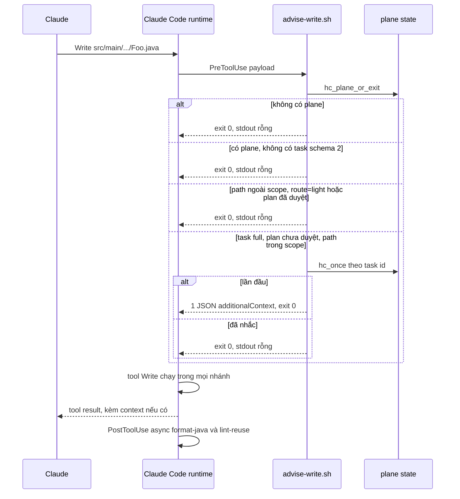
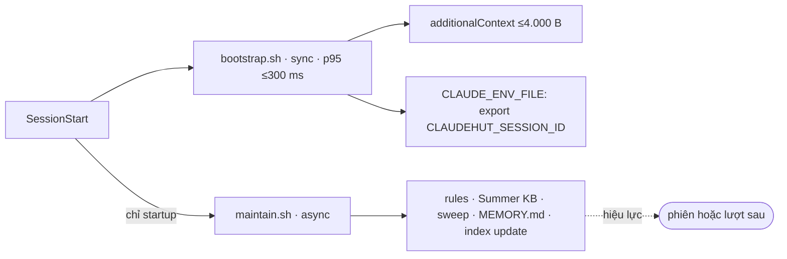

# Thiết kế hook

Phiên bản: 0.12.0-draft · Ngày: 2026-09-29 · Trạng thái: Đề xuất

## Tóm tắt

Hook của v0.12 chỉ advisory: mọi script exit 0, in tối đa một JSON và không trả `decision`, `permissionDecision`, `updatedInput` hay `continue` (ADR-H2, ADR-H4). Chỉ `advise-write.sh` nhắc quy trình, và chỉ khi có task `full` chưa duyệt plan và path nằm trong scope; mọi hook khác chỉ ghi ledger, nêu dữ kiện hoặc im lặng (ADR-H1). `hooks.json` còn 13 handler; Stop, UserPromptExpansion, PreToolUse `Skill` và PreCompact bị gỡ. SessionStart tách thành `bootstrap.sh` (sync, chỉ ghép context ≤4.000 B) và `maintain.sh` (async, bảo trì).

Liên quan: schema state và `route` ở [04](04-routing-harness.md); doclint ở [06](06-artifact-standards.md); độ tươi index và `hint-explore` ở [07](07-index-memory.md); nguồn diff của review ở [08](08-review.md); nội dung ADR ở [09](09-adr.md); M1 và `hook-tests.sh` ở [10](10-rollout-eval.md).

## 1. Luồng: Write trong và ngoài task



## 2. Hợp đồng hook

| # | Luật | Hiện thực | Căn cứ |
|---|---|---|---|
| K1 | Luôn exit 0 | `trap hc_exit EXIT` trả 0 trong mọi nhánh. Không `set -e`/`set -u`, vì lỗi unbound không kích hoạt trap ERR và thoát với exit 1, hiện thành "hook error" | B1, [exit code](https://code.claude.com/docs/en/hooks#exit-code-output) |
| K2 | Tối đa 1 JSON trên stdout | Single emitter trong `scripts/lib/hook-common.sh`: `hc_ctx`/`hc_sysmsg` chỉ gán biến, giá trị đầu tiên thắng; chỉ `hc_exit` in | B1 (2 object → 356 "hook error") |
| K3 | Lỗi thì im lặng | Khi `$?≠0` hoặc `HC_FAILED`, emitter bị xoá, ghi một dòng ≤300 B vào `state/hook-errors.log`, stdout rỗng | ADR-H4 |
| K4 | Không có trường quyết định | Lib không có hàm nào sinh `decision`, `permissionDecision`, `updatedInput`, `continue` hay exit 2 | B8, [permission modes](https://code.claude.com/docs/en/hooks-guide#hooks-and-permission-modes) |
| K5 | Quote đường dẫn plugin | Shell form `"\"${CLAUDE_PLUGIN_ROOT}/scripts/x.sh\""`; `claude plugin validate` cảnh báo khi thiếu quote | [troubleshooting](https://code.claude.com/docs/en/plugins/troubleshooting#failed-to-load-hooks-from-and-hooks-that-dont-fire) |
| K6 | Matcher chính xác | Danh sách chính xác (`Write\|Edit\|NotebookEdit`) hoặc regex neo `^…$`. Bỏ `MultiEdit` (không có trong docs), thêm `NotebookEdit`. Không đặt matcher trên UserPromptSubmit, vì runtime lờ đi | [matcher](https://code.claude.com/docs/en/hooks#matcher-patterns) |
| K7 | Tự thoát khi không có plane | `hc_plane_or_exit` chỉ dùng bash thuần, chạy trước jq | B10, [plugin hooks](https://code.claude.com/docs/en/plugins/components#when-plugin-hooks-fire) |
| K8 | Hook không ghi state JSON | Chỉ CLI ghi state. Hook dedupe bằng cách append vào sidecar `state/<sid>.nudged` | B9 (xu hướng; 0128b37) |
| K9 | Ngân sách output | SessionStart theo [§5](#5-sessionstart-bootstrap-và-maintain); các hook khác ≤500 ký tự; chỉ câu sự thật, không MUST | F-2, F-3, [best practices](https://code.claude.com/docs/en/best-practices#set-up-hooks) |

API của lib:

```bash
hc_init              # đọc stdin 1 lần → $HC_IN; PROJECT_DIR=${CLAUDE_PROJECT_DIR:-$PWD}; set -o pipefail
                     # trap hc_exit EXIT; trap 'HC_FAILED=1; exit' ERR
hc_plane_or_exit     # PLANE=$PROJECT_DIR/.claude/claudehut (dir) hoặc exit 0   (bash thuần)
                     # command -v jq || exit 0 ; exec 2>>"$PLANE/state/hook-errors.log"
                     # HUB=${CLAUDEHUT_HUB:-$(jq -r .hub "$PLANE/topology.json")} ; rỗng → HUB=$PLANE
hc_active_task       # state/<sid>.json .active_task → tasks/<id>/task.json; thiếu schema:2 hoặc JSON hỏng → return 1
hc_rel <path>        # canonical hoá, bỏ tiền tố $PROJECT_DIR/; path ngoài project → return 1
hc_in_scope <rel>    # [[ $rel == $glob ]] với glob ∈ task.scope
hc_once <key>        # grep -qxF trong state/<sid>.nudged; chưa có thì append, return 0
hc_head <repo>       # đọc .git/HEAD → ref → packed-refs; theo gitdir: nếu là worktree; không spawn git
hc_ctx <event> <txt> | hc_sysmsg <txt>   # chỉ gán biến
hc_exit              # lỗi → xoá emitter, log, exit 0 ; có trường → in đúng 1 object, cắt theo ngân sách, exit 0
```

Phân giải plane không walk ngược cây thư mục (ADR-H9, theo quyết định xuyên vùng ở [03 §6](03-architecture.md#6-quyết-định-xuyên-vùng): `topology.json` thay cho file `.link`). Mỗi service luôn có một plane mỏng chứa `topology.json`. Task/state đọc từ PLANE, metadata index đọc từ HUB ([07](07-index-memory.md)).

## 3. Predicate kích hoạt

Predicate đầy đủ, đặt trong `hook-common.sh`:

```text
plane ∧ active_task(schema 2) ∧ route=full ∧ plan_approved=false ∧ path ∈ task.scope ∧ chưa nhắc
task.scope mặc định: ["src/main/*", "*/src/main/*"]      dedupe: state/<sid>.nudged
```

`requires[]` bị bỏ vì kiểm tra artifact là việc của CLI `set-*` ([06](06-artifact-standards.md)). Nhờ scope dương, `build.gradle`, `docs/`, `.understand-anything/`, `.claude/` và scratchpad luôn nằm ngoài predicate (A9, B2 phần write gate). State không có `schema:2` được coi là không có task (A9, B6).

Các hook khác dùng tập con của predicate:

| Mức | Điều kiện | Handler |
|---|---|---|
| P-plane | plane | ledger (record-*), `verify-subagent`, `maintain`, `bootstrap` |
| P-prompt | plane ∧ prompt do người gõ | `inject-phase` |
| P-task | plane ∧ active_task ∧ path ∈ scope | `lint-reuse` |
| P-path | plane ∧ path khớp pattern cố định | `doclint-advise`, `hint-explore` (thêm mode=microservice) |
| P-full | predicate đầy đủ ở trên | `advise-write` |

## 4. Ma trận hook cuối

Đơn vị đếm là cặp (event, matcher, script), nên có 13 handler. `hooks.json` có 16 entry, vì `format-java`, `lint-reuse` và `doclint-advise` mỗi script cần hai entry: mỗi trường `if` chỉ chứa một rule ([common fields](https://code.claude.com/docs/en/hooks#common-fields)).

| # | Event | Matcher / `if` | Script | Chế độ | Timeout (s) | Output | Điều kiện kích hoạt | Sửa finding |
|---|---|---|---|---|---|---|---|---|
| 1 | SessionStart | `startup\|resume\|clear\|compact\|fork` | `bootstrap.sh` | sync | 5 | additionalContext ≤4.000 B | P-plane | B2, B7, B10, F-2, F-7, A9 |
| 2 | SessionStart | `startup` | `maintain.sh` | async | — | systemMessage (rule drift), lượt sau | P-plane | B10, D1 |
| 3 | UserPromptSubmit | — | `inject-phase.sh` | sync | 5 ¹ | learnings top 3 ≤500 ký tự; 1 fact mỗi (repo, HEAD) lệch | P-prompt | A10, F-6, B10, D2 |
| 4 | PreToolUse | `Write\|Edit\|NotebookEdit` | `advise-write.sh` (từ `gate-write.sh`) | sync | 5 | additionalContext 1 lần mỗi task | P-full | A1, A2, A9, B2, B4, B5, B8 |
| 5 | PreToolUse | `Agent` | `record-agent-dispatch.sh` | sync ³ | 5 | không | P-plane; ghi `name`↔`subagent_type` | F-1, F-PA-1 |
| 6 | PostToolUse | `Write\|Edit`; `Write(*.java)`, `Edit(*.java)` | `format-java.sh` | async | — | không | có formatter | — |
| 7 | PostToolUse | như #6 | `lint-reuse.sh` | async | — | suspects vào `state/<task>.suspects.jsonl` | P-task | A8 |
| 8 | PostToolUse | `Write\|Edit`; `Write(*.md)`, `Edit(*.md)` | `doclint-advise.sh` | sync | 5 (engine bị kill sau 3) | 1 dòng doclint | P-path: `tasks/*/{spec,plan,brainstorm,plan-review,task,context}.md` | C1, C3–C8 |
| 9 | PostToolUse | `Read\|Grep\|Glob` | `hint-explore.sh` | sync | 2 | 1 fact mỗi (session, agent, svc) | P-path ∧ mode=microservice ∧ path thuộc service khác | D8, D3 |
| 10 | PostToolUseFailure | `Bash` | `record-failure.sh` | async | — | không | P-plane | B10 |
| 11 | SubagentStart | — | `record-dispatch.sh` | sync ² | 5 ² | 1 dòng chỉ khi implementer chạy dạng teammate | P-plane | F-1 |
| 12 | SubagentStop | — (không matcher) | `verify-subagent.sh` | async | — | không; chỉ ghi ledger | P-plane ∧ `agent_type` khác rỗng | F-1, #87065 |
| 13 | InstructionsLoaded | — | `record-rules-loaded.sh` | async | — | không (event bỏ output) | P-plane | — |

¹ Chọn 5 s; Đã chốt (2026-09-29), xem [§10](#10-mục-mở).
² Handler phải sync, vì output của hook async đến ở lượt kế tiếp và lỡ thời điểm subagent bắt đầu ([async](https://code.claude.com/docs/en/hooks#run-hooks-in-the-background)). Mặc định 600 s của command hook là quá lớn; timeout Đã chốt (2026-09-29): 5 s, xem [§10](#10-mục-mở).

³ Lệch so với bản thiết kế đầu (async), sửa ở M1 (HC2-3): PreToolUse async không giữ tool Agent lại, nên SubagentStart (#11, sync) có thể đọc ledger `name`↔`subagent_type` trước khi dòng được ghi, và teammate rơi về tên tự đặt (đúng ca F-1). Hook không in gì và tốn ~16 ms mỗi lần gọi Agent, nên chạy sync với timeout 5 s.

`record-dispatch` và `verify-subagent` dùng `lib/resolve-agent.sh` để nối tên teammate về `subagent_type` qua ledger của #5, vì 61% dispatch có `name` và khi đó `agent_type` là tên tự đặt (F-1).

## 5. SessionStart: bootstrap và maintain



| Phần | bootstrap.sh (sync) | maintain.sh (async) |
|---|---|---|
| Việc | Ghép context; ghi sid vào `CLAUDE_ENV_FILE` (kênh chính), kèm dòng `Session id:` dự phòng (B7) và một dòng ngôn ngữ từ `language` (ADR-R7) | Refresh `.claude/rules` khi `.plugin-version` lệch; cài/self-heal Summer KB; sweep sidecar và state cũ >7 ngày; cắt `hook-errors.log` >64 KB; migrate/sinh MEMORY.md; `claudehut-index update` với mkdir-lock |
| Đã gỡ | Arm `set-phase discover` (A9, B2); restore snapshot; spawn `claude plugin list` 1–5 s (B10); auto-init; dòng "MUST use" (F-2) | `nohup` từng nằm trong bootstrap sync |
| Lý do tách (ADR-H8) | Câu trả lời đầu tiên phải đợi SessionStart sync ([sessionstart](https://code.claude.com/docs/en/hooks#sessionstart)) | Hook async không có timeout và bị kill khi chạy `-p`, nên mọi bước phải idempotent và ghi meta sau cùng |

Ngân sách byte, đo bằng `lint-prompt-length.sh --payload` chạy chính `bootstrap.sh` (F-7, F-PA-4):

| Thành phần | Trần |
|---|---|
| digest | ≤2.500 B |
| index card | ≤500 B |
| Toàn bộ additionalContext của ClaudeHut (digest + sid + dòng task + dòng ngôn ngữ ≤120 B + card + con trỏ Summer KB/learnings) | ≤4.000 B |
| Trần hệ thống cho mỗi field ([json-output](https://code.claude.com/docs/en/hooks#json-output)) | 10.000 ký tự |
| Baseline v0.11 | median 8.999 B |

## 6. Hook bị gỡ

| Handler v0.11 | Script | Lý do gỡ | Căn cứ |
|---|---|---|---|
| Stop | `gate-done.sh` | Xem [§7](#7-vì-sao-bỏ-stop) | B1, B3, B10, F-5, A7 |
| UserPromptExpansion `(claudehut:)?(…)` | `record-skill-expansion.sh` | Chỉ phục vụ skill rail; matcher không neo | F-3 |
| PreToolUse `Skill` | `record-skill.sh` | Rail chỉ nhận tên `implement` (kể cả `other:implement`). Gọi `claudehut-state` ở mọi lần gọi Skill gây tranh chấp lock. Gọi skill không chứng minh đã nạp chỉ dẫn ([#80802](https://github.com/anthropics/claude-code/issues/80802)) | F-3, B9 |
| PreCompact | `persist-state.sh` | Snapshot không bao giờ được đọc trên đường compaction; consumer duy nhất trong bootstrap cũng bị xoá | [precompact](https://code.claude.com/docs/en/hooks#precompact) |
| PreToolUse `Write\|Edit\|MultiEdit` (deny) | `gate-write.sh`, thay bằng `advise-write.sh` | Bash vẫn ghi được `src/main` (70 lệnh), nên deny chỉ gây ma sát. Fast lane đếm cả working tree bẩn (343 file). Regex `/auth` khớp base package | B8, A1, B5, A2 |

Không đưa vào v0.12: handler UPS `index-refresh.sh` riêng và PostToolUse `Bash` cho git. HEAD check đã nằm trong `inject-phase.sh`, còn pull thường diễn ra ở terminal ngoài Claude ([07](07-index-memory.md)).

## 7. Vì sao bỏ Stop

| Dữ kiện | Hệ quả |
|---|---|
| `stop_hook_active=true` ngay từ lần tiếp tục đầu tiên; cap 8 lần áp cho cả Stop lẫn SubagentStop (`CLAUDE_CODE_STOP_HOOK_BLOCK_CAP`) ([stop-input](https://code.claude.com/docs/en/hooks#stop-input)) | `gate-done.sh:17` chỉ block một lần mỗi chuỗi; comment "~8 blocks" sai (B3) |
| Mỗi task-notification hoặc tin nhắn teammate mở một lượt mới, và lượt đó lại bị block: 225/292 block rơi vào lượt máy sinh (F-5), gồm agent/teammate và task-notification | Wedge thực nằm ở lượt máy sinh, không phải ở cap. 95/162 block v0.11 rơi ngay sau câu chờ subagent (A7) |
| `gate-done.sh` in 2 object JSON → 356 "hook error"; block Learn không được áp dụng (B1) | Cổng hoàn tất fail-open âm thầm |
| Chạy 1.686 lần, p50 156 ms, p95 352 ms (B10); Stop hook tính tiền cả lượt khi background agent đang chạy ([#93745](https://github.com/anthropics/claude-code/issues/93745)) | Chi phí cố định ở mọi lượt |
| Không còn điều kiện completion để cưỡng chế. Task treo tự thành `superseded` khi `start` mới; trạng thái task đã hiện ở SessionStart và `claudehut-state status` | Stop không còn việc gì để làm |

Cả `decision:block` lẫn `additionalContext` ở Stop đều làm hội thoại chạy tiếp ([stop decision](https://code.claude.com/docs/en/hooks#stop-decision-control)). Nếu sau này cần nhắc, chỉ được dùng `systemMessage` theo K4. ADR-H3 (Stop chỉ gửi systemMessage) được thay bằng quyết định gỡ ([09](09-adr.md)).

## 8. Chung sống với plugin khác

Ngữ nghĩa gộp hook giữa các plugin xem [03](03-architecture.md). Hợp đồng riêng của ClaudeHut (ADR-H7):

| Mục | Quy định |
|---|---|
| Quyết định | Không trả `allow`, `deny`, `ask`, `updatedInput` hay `continue`, nên không tranh chấp với rtk (rewrite Bash) hay guard của plugin khác |
| Matcher | Theo K6. SubagentStop không đặt matcher mà guard `agent_type` rỗng trong script, vì matcher bị bỏ qua với agent nội bộ ([#87065](https://github.com/anthropics/claude-code/issues/87065)) |
| Context | Chỉ câu sự thật trong ngân sách K9; không "REQUIRED NEXT", không nêu tên skill bắt buộc (F-3) |
| Ghi file | Không ghi vào `.understand-anything/`, không tự tạo plane; init phải hỏi mono hay microservice |
| Lượt máy sinh | `inject-phase` im lặng khi prompt khớp regex bên dưới — siêu tập của hai prefix đo được và `<\agent-message` (F-6); nếu sai thì chỉ inject thừa |
| Git | Không có hook PostToolUse `Bash`, vì UA đã có hook Bash riêng |

```text
^\s*(<\\?(teammate-message|task-notification|agent-message)|Another Claude session sent a message)
```

Trong bash, viết `[[:space:]]` thay cho `\s`, vì `\s` không thuộc POSIX ERE.

## 9. Chế độ lỗi

| Lỗi | Hành vi | Giảm thiểu |
|---|---|---|
| Script thiếu hoặc thiếu bit executable (exit 127) | Non-blocking, action vẫn chạy, hook im lặng ([#94362](https://github.com/anthropics/claude-code/issues/94362)) | CI kiểm bit executable |
| Một entry hỏng tắt mọi hook của event đó ([#82618](https://github.com/anthropics/claude-code/issues/82618)) | `inject-phase` mất tác dụng | `claude plugin validate` trong CI |
| State JSON hỏng, hoặc state v0.11 không có `schema:2` | Coi như không có task; ghi log | — |
| Biến unbound, lệnh lỗi giữa chừng | Trap xoá emitter, stdout rỗng, exit 0 | K1–K3 |
| Timeout | Output bị bỏ; PreToolUse không bị chặn ([timeouts](https://code.claude.com/docs/en/hooks#timeouts)) | p95 ≤50 ms trên đường không task |
| UPS không bắn hoặc mất context ([#90296](https://github.com/anthropics/claude-code/issues/90296), [#90784](https://github.com/anthropics/claude-code/issues/90784)) | Thiếu learnings hoặc fact HEAD | `claudehut-state status` là nguồn chân lý |
| SubagentStop không bắn với subagent nền hoặc bị kill ([#82249](https://github.com/anthropics/claude-code/issues/82249), [#92716](https://github.com/anthropics/claude-code/issues/92716)) | Ledger thiếu dòng | Không cổng nào phụ thuộc SubagentStop; artifact do `set-*` kiểm |
| Resume phát lại context UPS cũ ([add-context](https://code.claude.com/docs/en/hooks#add-context-for-claude)) | SHA trong fact có thể đã cũ | SessionStart(resume) ghi lại trạng thái đúng |

## 10. Mục mở

- Timeout của `record-dispatch.sh` (#11) — Đã chốt (2026-09-29): 5 s.
- Có cần chế độ strict (deny hoặc block một lần) cho team nào không? — Đã chốt (2026-09-29): không có strict mode trong v0.12 (ADR-H2).
- Scope mặc định có nên tính `build.gradle`, `application*.yml`, `db/migration` không? — Đã chốt (2026-09-29): không.

## 11. Tiêu chí chấp nhận

Mọi tiêu chí chạy bằng `evals/hook-tests.sh` (M1), trừ khi ghi khác. Ngoại lệ: AC11 chạy từ M5 (cần `indexed_commit`), AC13 từ M2 (xem hàng M1 của [10](10-rollout-eval.md#1-milestone)); AC12 là benchmark `evals/hook-bench.sh`, không gate (xem hàng AC12).

| # | Given / When | Then |
|---|---|---|
| AC1 | Repo không có plane; bất kỳ hook nào | exit 0, stdout rỗng, không tạo file |
| AC2 | Có plane, không có task; Write vào `src/main/.../Foo.java` | stdout rỗng |
| AC3 | Task `full`, `plan_approved=false`; Edit lần 1 trong scope, rồi lần 2 | Lần 1: đúng 1 object chỉ có `hookSpecificOutput.additionalContext`. Lần 2: rỗng |
| AC4 | Task `light`, hoặc plan đã duyệt; Edit trong scope | stdout rỗng |
| AC5 | Task active; Write vào scratchpad, `.understand-anything/tmp/x.cjs`, `build.gradle`, `docs/x.md`, `.claude/rules/x.md` | stdout rỗng |
| AC6 | Mọi hook × mọi case, kể cả tiêm lỗi (JSON hỏng, jq lỗi) | `jq -s 'length<=1'` đúng; exit 0 |
| AC7 | Grep toàn bộ output fixture | Không có `permissionDecision`, `"decision"`, `updatedInput`, `"continue"` |
| AC8 | Prompt bắt đầu bằng `<\teammate-message`, `<\agent-message`, `<\task-notification`, `Another Claude session sent a message` | `inject-phase` in stdout rỗng |
| AC9 | Có plane, không có task, prompt do người gõ | Output không có "Untriaged" hay "Phase 0" (A10) |
| AC10 | SubagentStop với `agent_type` rỗng hoặc tên teammate | stdout rỗng; ledger ghi `resolved_type` cho teammate |
| AC11 | HEAD lệch `indexed_commit`; 2 prompt liên tiếp | Tối đa 1 update nền (lock); fact đúng 1 lần mỗi (repo, HEAD) |
| AC12 | 100 lần chạy trên đường không task | p95 ≤50 ms cho `advise-write`, `inject-phase`; `bootstrap` p95 ≤300 ms. **Benchmark, không gate:** `evals/hook-bench.sh` báo p95 từng hook, p95 chuẩn hoá theo baseline và tỉ lệ hook/baseline, luôn exit 0 (CI chạy dạng này), vì thời gian wall phụ thuộc máy và tải. `HOOK_BENCH_STRICT=1` bật gate: phải đạt CẢ bound tuyệt đối đã chuẩn hoá theo baseline LẪN trần tỉ lệ CPU hook/baseline theo từng hook (V3-1: bound chuẩn hoá nới theo tải nên một hồi quy CPU trốn được ngay ở tải vừa); `--self-test` chứng minh bản chậm 3× CPU và bản `sleep 0.05` bị gate strict đánh FAIL |
| AC13 | `lint-prompt-length.sh --payload` | digest ≤2.500 B; ClaudeHut ≤4.000 B; card ≤500 B; không "MUST"/"REQUIRED NEXT" |
| AC14 | `hooks.json` | 13 handler theo §4 (16 entry); không có Stop, UserPromptExpansion, PreToolUse `Skill`, PreCompact, `MultiEdit`; mọi command có `"${CLAUDE_PLUGIN_ROOT}"` được quote; `claude plugin validate` sạch; mọi `scripts/*.sh` có bit executable |
| AC15 | Replay payload core-ledger 2e70d1d8 (343 file) và report-service 652fab55 | stdout rỗng (A1, A9) |
