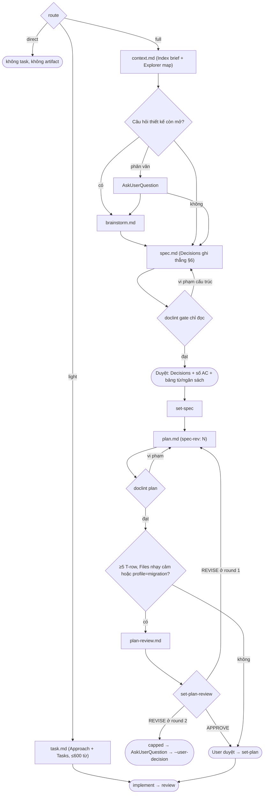
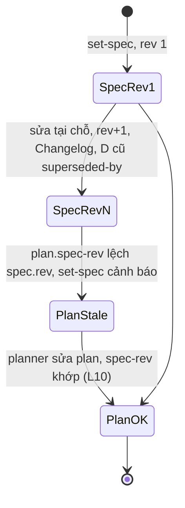

# Chuẩn artifact

Phiên bản: 0.12.0-draft · Ngày: 2026-09-29 · Trạng thái: Đề xuất

## Tóm tắt

Mỗi template trở thành schema máy đọc được, và `scripts/doclint.sh` đọc chính schema đó để kiểm artifact (C1). Luật cấu trúc chặn ở `claudehut-state set-*`, tức chỉ trong task đã opt-in. Ngân sách độ dài chỉ được đo, trả cho người viết và hiện ở bước duyệt, không bao giờ chặn. Tuyến quyết định bộ artifact: direct không có artifact; light có một `task.md` ≤600 từ; full đi qua `context.md` → [brainstorm tuỳ chọn] → spec → plan → [plan-review]. Spec giữ WHAT/WHY, plan giữ HOW và không có Java; tài liệu được sửa tại chỗ theo `rev:`; plan-review chỉ có một người ghi và cap 2 vòng nằm trong state.

## 1. Phạm vi và quan hệ với tài liệu khác

| Nội dung | Ở đâu |
|---|---|
| Chọn tuyến, schema `task.json`, lệnh `start`/`set-*` | [04-routing-harness.md](04-routing-harness.md) |
| Hook `doclint-advise.sh` (PostToolUse, `if` `Write(*.md)`/`Edit(*.md)`); hooks.json hiện 12 handler / 15 entry, ma trận cuối 13 handler / 16 entry khi `hint-explore` vào ở M6 | [05-hooks.md](05-hooks.md) |
| Cách sinh `context.md` (`claudehut-index brief`) | [07-index-memory.md](07-index-memory.md) |
| `review.md`: giữ nguyên gate `set-review pass`, không có chuẩn mới | [08-review.md](08-review.md) |
| Quyết định ADR-D1..D7 | [09-adr.md](09-adr.md) |
| Milestone M3, replay và eval độ dài | [10-rollout-eval.md](10-rollout-eval.md) |

## 2. Artifact theo tuyến



Brainstorm chỉ chạy khi có ≥2 cơ chế khả thi, chi phí/rủi ro khác hẳn, mà Discover chưa giải quyết (ADR-D2, C7); main thread quyết định vì subagent không có AskUserQuestion ([sub-agents](https://code.claude.com/docs/en/sub-agents)). Audit/investigation đi tuyến direct, không phải task (A10).

## 3. Chuẩn được áp dụng

| Chuẩn | Lấy gì | Không lấy gì | Nguồn |
|---|---|---|---|
| ADR (Nygard) | Status, `superseded-by`, ID không tái sử dụng; độ dài 1–2 trang | File ADR riêng cho mọi quyết định cục bộ | [cognitect](https://www.cognitect.com/blog/2011/11/15/documenting-architecture-decisions), [adr repo](https://github.com/architecture-decision-record/architecture-decision-record) |
| MADR / Y-statement | Một dòng Decisions: Y-statement, phương án bị loại, Confirmation | Các mục Pros/Cons dài | [madr](https://github.com/adr/madr/blob/develop/template/adr-template.md), [adr-templates](https://adr.github.io/adr-templates/) |
| EARS + Gherkin GWT | Câu `WHEN … THE SYSTEM SHALL …` và kiểm chứng GWT 3–5 bước trong cùng một dòng (ADR-D7) | Tách FR/AC thành hai section (C8) | [EARS](https://alistairmavin.com/ears/), [Gherkin](https://cucumber.io/docs/gherkin/reference/) |
| C4 + Mermaid | Mức context/container vẽ bằng flowchart; sequence/state cho luồng | Cú pháp C4-in-Mermaid (chưa kiểm được render) | [c4model](https://c4model.com/diagrams), [GitHub diagrams](https://docs.github.com/en/get-started/writing-on-github/working-with-advanced-formatting/creating-diagrams) |
| spec-kit | Tách WHAT/WHY khỏi HOW; ≤3 `[NEEDS CLARIFICATION]`; coverage requirement→task kiểu `analyze`; "Use links or references … instead of duplicating them" | Spec không-công-nghệ, test tuỳ chọn, không giới hạn độ dài | [specify](https://github.com/github/spec-kit/blob/main/templates/commands/specify.md), [plan](https://github.com/github/spec-kit/blob/main/templates/commands/plan.md), [analyze](https://github.com/github/spec-kit/blob/main/templates/commands/analyze.md) |
| Design doc (nguồn yếu) | Goals & Non-Goals; mini doc 1–3 trang; không viết khi không có trade-off | Tài liệu 10–20 trang | [industrialempathy](https://www.industrialempathy.com/posts/design-docs-at-google/) |

spec-kit, Kiro và Rust RFC không đặt giới hạn độ dài; ngoài các con số có nguồn trong bảng, mọi ngân sách là hiệu chỉnh riêng, chốt sau replay (C2, [02-research.md](02-research.md)).

## 4. Hai loại luật và ba điểm chạy (ADR-D1)

| Loại | Ví dụ | Hệ quả khi vi phạm |
|---|---|---|
| Cấu trúc (blocking) | heading, fence, diagram, coverage, `spec-rev`, Verdict | `set-*` exit≠0, in mỗi vi phạm một dòng |
| Ngân sách (advisory) | số từ theo section, tổng, cap ô | In `từ/ngân sách`; exit 0 |

| Điểm chạy | Chế độ | Ai thấy |
|---|---|---|
| PostToolUse `Write\|Edit` trên `tasks/*/{spec,plan,brainstorm,plan-review,task,context}.md` | `advise`: một dòng `additionalContext` dạng `<L-id> <section>: <message ≤90 ký tự>` (tối đa 2, blocking trước) `— N blocking, M advisory in <file>`, không kèm lệnh (planner không có Bash); engine bị kill sau 3 s; luôn exit 0 | Người viết, kể cả planner (không có Bash) |
| Main thread, trước AskUserQuestion | `gate` chỉ đọc + `report` | User nhận bảng từ/ngân sách trong tóm tắt duyệt |
| `set-spec`, `set-plan`, `set-plan-review`, `set-brainstorm`, `set-phase --spec/--plan` | `gate` | CLI từ chối nếu vi phạm cấu trúc; `set-phase` không còn là đường né doclint |

Chặn ở `set-*` không ảnh hưởng việc ngoài workflow, vì lệnh chỉ chạy trong task schema 2 ([04](04-routing-harness.md)). Theo [features-overview](https://code.claude.com/docs/en/features-overview), "If a rule must hold every time, make it a hook rather than a prompt instruction". Luật cấu trúc là loại phải luôn đúng; con số ngân sách không có nguồn nên để người duyệt quyết (C1).

## 5. Template

Mỗi template mở đầu bằng một khối `<!-- ch:schema … -->`, mỗi dòng dạng `Heading | req=<profile/route> | budget=W | diagram=required | cells=Col:Nw,Col:Nc`. doclint đọc khối này từ `$ROOT/skills/*/references/<kind>-template.md`, với `ROOT` lấy như `scripts/lint-prompt-length.sh:14`, nên bash không hard-code con số nào (C1). Artifact không mang khối này; heading tiếng Anh là định danh máy đọc. Prompt dispatch truyền đường dẫn template để agent Read tường minh, vì thân plugin skill có thể không được inject ([#80802](https://github.com/anthropics/claude-code/issues/80802)). Mọi ngân sách dưới đây là số khởi điểm.

### 5.1 `context.md` (full)

Mục đích: cache dẫn chứng codebase; spec §1 dẫn node/file:line từ đây thay vì kể lại. Discover sinh file ([07](07-index-memory.md)); doclint chỉ kiểm heading (L2) theo khối `ch:schema` của `skills/discover/references/context-template.md`, và chỉ qua hook advise: không có `set-*` nào gate `context.md`.

```markdown
# Context: <slug>
## Index brief        <!-- output `claudehut-index brief … --budget 3000` -->
## Explorer map       <!-- explorer append; file:line, index_miss: -->
```

### 5.2 `task.md` (light)

Mục đích: plan rút gọn khi có một cách làm hiển nhiên; lấy phần Approach + Tasks của plan-template.

```markdown
<!-- ch:schema kind=task total.light=600
1. Approach | req=light | budget=80
2. Tasks    | req=light | cells=Goal:12w,Test first:60c
-->
# Task: <title>
> id: NNNN-slug · route: light · profile: feature|bugfix|migration · rev: 1 · status: draft|approved
## 1. Approach                       <!-- 80 từ; reuse anchor -->
## 2. Tasks
| ID | Goal | Files | Test first | Verify | Depends |
## Changelog                         <!-- chỉ khi rev>1 -->
```

### 5.3 `brainstorm.md` (full, tuỳ chọn)

Mục đích: khoá tiêu chí trước, rồi so 2–4 cơ chế khác nhau thực chất; hai thư viện cho cùng một cơ chế tính là một option (C7).

```markdown
<!-- ch:schema kind=brainstorm total=600 -->
# Brainstorm: <title>
> id · route: full · rev: 1
## 1. Frame            <!-- câu hỏi 1 câu; ràng buộc owner; | Criterion | Weight | 3–5 dòng; lệch Discover: 1 dòng -->
## 2. Options          <!-- | # | Mechanism | Score | Pros | Cons | Risk | 2–4 dòng; #0 = adopt/extend -->
## 3. Premortem        <!-- option chọn ≤3 dòng; runner-up 1 dòng -->
## 4. Recommendation   <!-- 1 câu → thành D-n trong spec §6 -->
```

Bỏ ≥6 ứng viên, ≥3 lens, wildcard, premortem cả hai finalist, enforcement set. Main thread ghi file từ dữ liệu brainstormer trả về.

### 5.4 `spec.md` (full)

Mục đích: WHAT/WHY quan sát được từ bên ngoài; bean, transaction, DDL, entity thuộc plan (C8).

```markdown
<!-- ch:schema kind=spec total.feature=1200 total.bugfix=500 total.migration=700
1. Context             | req=feature,bugfix,migration | budget=120
2. Goals & Non-Goals   | req=- (cho phép)             | budget=100
3. Requirements        | req=feature,bugfix,migration | cells=Requirement (EARS):40w,Acceptance (GWT):60w
4. Flow                | req=feature                  | budget=80 | diagram=required
5. Contracts           | req=feature                  | budget=150
6. Decisions           | req=feature,bugfix,migration | cells=Decision (Y-statement):80w,Rejected options:40w
7. Open Questions      | req=- (cho phép)             | budget=60
Rollback               | req=migration
-->
# Spec: <title>
> id: NNNN-slug · profile: feature|bugfix|migration · route: full · rev: 1 · status: draft|approved · date: YYYY-MM-DD
> options: tasks/NNNN-slug/brainstorm.md   (chỉ khi có)
## 1. Context          <!-- vấn đề, vì sao bây giờ, reuse; dẫn file:line/node từ context.md. Bugfix: triệu chứng, tái hiện, nghi vấn gốc -->
## 2. Goals & Non-Goals
## 3. Requirements
| ID | Requirement (EARS) | Acceptance (GWT) |
| AC-001 | WHEN … THE SYSTEM SHALL … | GIVEN … WHEN … THEN <HTTP/DB/event/metric> |
## 4. Flow             <!-- mermaid; ≥2 service → thêm flowchart mức container; hoặc `n/a — <lý do>` -->
## 5. Contracts        <!-- method+path, schema, mã lỗi, tương thích ngược; payload ≤12 dòng; hoặc `none` -->
## 6. Decisions
| ID | Decision (Y-statement) | Rejected options | Confirmation | Status |
## 7. Open Questions   <!-- ≤3 [NEEDS CLARIFICATION: …], có owner -->
## Rollback
## Changelog           <!-- rev N — thay đổi — lý do (owner|defect|discovery) -->
```

Giữ ID `AC-xxx` vì consumer hiện tại grep chuỗi này. Bỏ: User Story, NFR riêng (viết thành câu EARS ubiquitous trong §3), Data Model, Out of Scope riêng, Enforcement Manifest. Review đọc enforcement set từ state; `set-enforcement` chuyển sang write-spec.

### 5.5 `plan.md` (full, ADR-D3)

Mục đích: HOW. Plan chỉ tham chiếu `AC-xxx`/`D-n` của spec, không kể lại.

```markdown
<!-- ch:schema kind=plan total.full=1500
1. Approach          | req=full | budget=80
2. Design            | req=full | budget=200 | diagram=required
3. Interfaces & Data | req=full | cells=Contract:25w
4. Tasks             | req=full | cells=Goal:12w,Test first:60c
5. Risks & Rollback  | req=full
-->
# Plan: <title>
> id · spec-rev: N · route: full · rev: 1 · status
## 1. Approach            <!-- tham chiếu D-n, reuse anchor; không kể lại Context -->
## 2. Design              <!-- sequenceDiagram (+ stateDiagram nếu có trạng thái); prose chỉ cho race/transaction/idempotency -->
## 3. Interfaces & Data
| Element | Change | Contract (`Type#method(args): Ret`, field:type, DDL tóm tắt) | Req |
## 4. Tasks
### Phase 1 — <tên>
| ID | Goal | Files | Test first | Verify | Depends | Req |
<!-- Task notes tuỳ chọn, ≤40 từ/task; giữ [P] -->
## 5. Risks & Rollback    <!-- ≤5 dòng -->
## Changelog
```

Hình dạng interface vào §3, control flow vào §2 hoặc Task notes (C4). Implementer coi §1 và §3 là hợp đồng (`agents/claudehut-implementer.md:55`). Files phải là cột thứ 3 (field `$4`) vì `claudehut-worktree check-disjoint` đọc ô này. Bỏ: Technical Context (đã có trong PROJECT.md), Implementation Flow, Sketch, Execution Order, Done Definition (chuyển vào skills/implement), cột Minimal change. Xoá câu tự mâu thuẫn về Mermaid trong template cũ (C5) và các chữ "migration"/"security" trong prose template, vì predicate cũ quét toàn văn.

### 5.6 `plan-review.md` (full, khi predicate đúng)

Mục đích: cho biết plan có đạt hay không mà không phải đọc một tài liệu dài ngang plan (C6).

```markdown
<!-- ch:schema kind=plan-review total=400
Findings | cells=Gap:30w,Fix:30w
-->
# Plan review
> id: NNNN-slug · plan-rev: N · round: 1|2
Verdict: APPROVE|REVISE
## Findings
| ID | Sev | Locus | Gap | Fix |     <!-- ≤10 dòng (advisory, L11: báo, không chặn); Sev ∈ CRIT|HIGH|MED; APPROVE → có thể rỗng -->
## Notes
```

## 6. Luật doclint

"Từ" là token chứa ≥1 chữ cái hoặc chữ số; bỏ qua `|`, dòng `|---|`, mermaid, `<!-- -->`. `\|` và `|` trong backtick không tách ô. Cap `c` đếm byte UTF-8, chỉ dùng cho cột ASCII như `Test first`.

| L-id | Luật | Loại | Sửa |
|---|---|---|---|
| L1 | `profile:`/`route:` khớp giá trị authoritative (`--profile`/`--route`, rồi `task.json` qua `--state`); bỏ qua khi không có giá trị nào. Có giá trị (gate `set-*` luôn truyền `--route`/`--profile`) thì header thiếu key mà ví dụ trong template cùng kind khai báo cũng vi phạm. Thông báo ghi nguồn: `expected X (from --profile\|task.json)` | blocking | C8 |
| L2 | Đủ heading bắt buộc theo `req`; không có heading ngoài allowlist (lỗi liệt kê allowlist); cấm `/amend\|round [0-9]\|revision [0-9]/i` | blocking | C3, C8 |
| L3 | Số từ mỗi section có `budget` | advisory | C1 |
| L4 | Tổng số từ theo profile/route | advisory | C1, C2 |
| L5 | Cấm fence `java\|kotlin`; fence khác ≤12 dòng; mermaid mở đầu bằng `flowchart\|graph\|sequenceDiagram\|stateDiagram(-v2)?` | blocking | C4, C5 |
| L6 | Cap ô (`w` = từ, `c` = byte) | advisory | C1 |
| L7 | `diagram=required` ⇒ có ≥1 mermaid hoặc dòng `n/a — <≥3 từ>` | blocking | C5 |
| L8 | `[NEEDS CLARIFICATION` ≤3; ở gate phải =0, trừ mục gắn `non-blocking` trong §7 | blocking | C8 |
| L9 | Decisions: Status ∈ {`accepted`, `superseded-by D-k`}, D-k tồn tại, ID không trùng | blocking | C3 |
| L10 | Plan: `spec-rev` == `rev` của spec; mọi `AC-xxx` có trong ≥1 ô Req; mọi ID trong Req tồn tại trong spec. Spec lấy từ `--spec` (gate `set-plan` truyền `spec_path` đã ghi), không thì `spec.md` cùng thư mục; không tìm thấy spec: blocking khi route authoritative là full (gate), advisory khi chạy standalone | blocking | C3, C6 |
| L11 | plan-review: đúng một dòng `Verdict:`; bảng Findings đúng cột; Sev ∈ CRIT\|HIGH\|MED. Findings >10 dòng chỉ advisory (cap, như §4) | blocking | C6 |

Không có L0 (nhánh legacy `doc_schema`): file thiếu `schema:2` được coi là không có task ([04](04-routing-harness.md)).

CLI: `doclint.sh [--json] [--kind task|spec|plan|brainstorm|plan-review|context] [--route R] [--profile P] [--language en|vi] [--state <task.json>] [--spec <spec.md>] [--verdict APPROVE|REVISE] [--mode gate|advise|report] FILE…`, và `doclint.sh --self-test`; kind suy từ tên file khi thiếu `--kind`, `--advise`/`--report` là dạng ngắn của `--mode`. `gate` exit 1 khi có vi phạm blocking, in ngân sách dưới mục `budget:`; `report` chỉ in bảng section|từ|ngân sách. Thiếu template: `gate` báo lỗi, `advise` im lặng. Hook `doclint-advise.sh` fail-open, không bao giờ exit 2 ([hooks](https://code.claude.com/docs/en/hooks#exit-code-output)).

## 7. Sửa đổi và thay thế (ADR-D4)



| Quy tắc | Nội dung |
|---|---|
| Living doc | Sửa tại chỗ, `rev` tăng, thêm dòng Changelog; cấm heading Amendment/Round/Revision (L2) |
| Quyết định | ID `D-n` vĩnh viễn; đổi thì Status `superseded-by D-k`: dòng bất biến như ADR, tài liệu vẫn sống |
| Ghim | Plan ghi `spec-rev`. `set-plan` từ chối khi lệch (L10); `set-spec` chỉ in note ra stderr khi plan (`plan_path` đã ghi, không thì `plan.md` cùng thư mục) ghim rev cũ hơn (`note: plan <path> pins spec-rev N, spec is now rev M — re-plan …`), exit 0, không lưu cờ vào state |
| plan-review | Bị ghi đè mỗi vòng; số vòng nằm trong state |
| Giới hạn | Protocol chỉ làm quyết định hiện hành hiển thị rõ, không ngăn owner đổi yêu cầu (va-ms 0024 amendment 2/3, C3) |

## 8. Hợp đồng plan-review (ADR-D5)

| Mục | Quy định |
|---|---|
| Người ghi | Chỉ `claudehut-plan-reviewer`, ghi đè file; main thread không sửa file, không tự ghi APPROVE (C6: 0024 có 2 REVISE rồi APPROVE do main thread tự ghi) |
| Kích hoạt | Chỉ tuyến full, khi ≥5 T-row, hoặc cột Files của T-row chạm đường dẫn nhạy cảm, hoặc `profile=migration`. Không quét toàn văn |
| Phạm vi phán đoán | §2/§3 khớp D-n và AC; Test first đủ bắt AC; tôn trọng reuse anchor; task `[P]` an toàn; rủi ro correctness chưa nêu. Không báo style. Coverage do L10 tính |
| Agent | Bỏ `ultrathink`, "insufficient until you prove otherwise" và right-size định tính |
| `set-plan-review` | Verdict trong file phải khớp tham số (L11); `plan_review_round` tăng 1 |
| Cap | REVISE ở round 2 → `capped`, lệnh bị từ chối kèm hướng dẫn AskUserQuestion. Khi capped, lệnh cần `--user-decision "<text>"`: text lưu vào `task.json`, round reset về 0 |
| Giới hạn | Không chống được main thread giả `--user-decision`, chỉ làm nó hiện rõ trong state |

Không dùng stamp qua SubagentStop: hook fail-open (exit 127) sẽ khiến APPROVE bị chặn cứng, trái hợp đồng advisory ([05](05-hooks.md)).

## 9. Right-size theo profile × route (ADR-D6)

| Route | Profile | Artifact bắt buộc | Tuỳ chọn | Tổng khởi điểm (từ) |
|---|---|---|---|---|
| direct | — | không có | — | — |
| light | feature, bugfix, migration | `task.md` | — | 600 |
| full | feature | `context.md`, spec (§1,3,4,5,6), plan | brainstorm, plan-review (theo predicate) | spec 1200, plan 1500, brainstorm 600, plan-review 400 |
| full | bugfix | `context.md`, spec (§1,3,6), plan | brainstorm, plan-review | spec 500, plan 1500 |
| full | migration | `context.md`, spec (§1,3,6, Rollback), plan, plan-review | brainstorm | spec 700, plan 1500, plan-review 400 |

Tập heading theo profile là luật blocking (L1, L2); các con số là advisory. Mốc so sánh là median audit: spec 994 từ, plan 1.086 từ; p90 mỗi task 8.775 từ (C2, [01-audit.md](01-audit.md)).

## 10. Đơn vị ngôn ngữ và ngân sách

Ngôn ngữ artifact — Đã chốt (2026-09-29): theo `language` chọn khi init (ADR-R7, [07 §4.1](07-index-memory.md#41-init)); phương án (c) "quy định artifact viết tiếng Anh" bị loại. Heading template giữ tiếng Anh vì là định danh máy đọc; thân viết theo `language`. Prompt dispatch truyền cả đường dẫn template lẫn dòng ngôn ngữ, vì subagent không có digest.

Đơn vị ngân sách — Đã chốt (2026-09-29): phương án (a), giữ đơn vị từ; khi `language=vi`, doclint nhân mọi ngân sách tính bằng từ (`budget=W` và ô `Col:Nw`) với 1,4; ô `Col:Nc` tính bằng ký tự, hệ số chốt sau replay (tiếng Việt đơn âm tiết phình khoảng 1,3–1,5× so với corpus audit tiếng Anh). Không đổi sang byte (b), vì ngân sách trong khối `ch:schema` và mốc audit C2 đều tính bằng từ. doclint đọc `language` theo thứ tự phân giải của 07; output ghi rõ hệ số, ví dụ `900/840 (600×1,4)`. Con số khởi điểm và hệ số chốt sau `doclint-replay.sh` ở M3. Ngân sách chỉ đo và hiển thị — Đã chốt (2026-09-29): advisory (ADR-D1).

Ngân sách sau replay — Đã chốt (2026-09-30, M3): giữ nguyên các con số khởi điểm trong khối `ch:schema` (spec 1200/500/700 theo profile, plan 1500, brainstorm 600, plan-review 400, task 600; ô `Decision (Y-statement)` 80w, `Test first` 60c). `evals/doclint-replay.sh` trên 613 artifact v0.11 (207/244 task dir) cho p50/p90 số từ: spec 900/2342, plan 921/3870, brainstorm 655/1864, plan-review 611/1910; L4 vượt ngân sách ở spec 87/200, plan 66/203, brainstorm 56/92, plan-review 101/118. Corpus là định dạng v1 (sketch Java, amendment, bảng coverage trong plan-review), nên p50 của nó cao hơn kích thước v2: brainstorm 600 và plan-review 400 nằm dưới p50 là có chủ ý, vì v2 bỏ phần chấm điểm dài và coverage đã chuyển sang L10; vì ngân sách chỉ advisory (ADR-D1), không nâng số theo corpus cũ. Cap `c` đếm byte (như §6, không phải ký tự); hệ số `vi` cho `c` là 1,0 vì các cột có cap `c` là định danh ASCII (replay: 2709 byte / 2685 ký tự ở party-ms 0002). Engine hiện dùng python3 stdlib nhúng trong bash thay vì awk POSIX dự kiến ban đầu (§11 đã ghi theo cây hiện tại): gate `set-*` từ chối (exit 1) nếu máy không có python3, hook advise thì im lặng.

Lệnh gate `task.md` của tuyến light ([03 §6](03-architecture.md#6-quyết-định-xuyên-vùng) không nêu) — Đã chốt (2026-09-29): `set-plan` nhận `task.md` khi `route=light`; hiện thực ở M3.

## 11. Thành phần thay đổi (M3)

| Thành phần | Thay đổi |
|---|---|
| `scripts/doclint.sh`, `scripts/doclint-advise.sh`, `hooks/hooks.json` | Thêm mới (bash + python3 stdlib nhúng, jq; thay awk POSIX dự kiến ban đầu, xem §10); đăng ký PostToolUse `Write\|Edit` với `if` `Write(*.md)`/`Edit(*.md)` |
| `skills/{write-spec,write-plan,brainstorm}/references/*-template.md` | Viết lại; thêm `plan-review-template.md` và template `task.md` |
| `bin/claudehut-state` | Gate doclint ở `set-*`, `set-phase --spec/--plan`; bỏ grep `Implementation Flow`/`[Ss]ketch` và content-regex cũ; thêm `plan_review_round`, `--user-decision` |
| `agents/claudehut-{planner,plan-reviewer,brainstormer,implementer}.md` | Planner `effort: xhigh`→`high`; còn lại như §5, §8 |
| `skills/write-spec`, `write-plan`, `brainstorm`, `claudehut-workflow` SKILL.md | `set-enforcement` chuyển sang write-spec; brainstorm tuỳ chọn; chuỗi REQUIRED-NEXT mới |
| `evals/*` (hook-tests, conformance, artifact-checks, artifact-oracle-tests, parallel-dispatch-*, worktree-tests), `evals/doclint-replay.sh` | Fixture đạt/không đạt cho mỗi luật; replay chỉ đọc |

## 12. Tiêu chí chấp nhận

1. GIVEN corpus ewallet (244 task dir) WHEN chạy `evals/doclint-replay.sh` (chỉ đọc) THEN bảng luật × kind có: L4 đánh dấu plan va-ms 0008, L2 bắt AMENDMENT brainstorm va-ms 0024, L6 bắt ô Test first 2.685 ký tự party-ms 0002; ngân sách chốt sau đó.
2. GIVEN spec có ô Decision 120 từ WHEN `set-spec` THEN exit 0 và output có `§6 Decisions: cell Decision — 120w/80w (budget)`; `--mode report` in cùng số đó.
3. GIVEN fence `java` hoặc fence `json` 20 dòng WHEN `set-spec`/`set-plan` THEN từ chối (L5); mermaid `sequenceDiagram` thì qua.
4. GIVEN spec feature thiếu cả mermaid lẫn dòng `n/a — <lý do>` ở §4 WHEN `set-spec` THEN từ chối (L7).
5. GIVEN plan `spec-rev: 1`, spec `rev: 2`, hoặc AC-003 không có trong ô Req nào WHEN `set-plan` THEN từ chối (L10), thông báo nêu nguyên nhân.
6. GIVEN task schema 2 WHEN `set-phase implement --spec <spec vi phạm L2>` THEN bị từ chối giống `set-spec`.
7. GIVEN plan-review.md có hai dòng `Verdict:` hoặc Verdict khác tham số WHEN `set-plan-review` THEN từ chối (L11).
8. GIVEN 2 lần REVISE WHEN gọi lần 3 không có `--user-decision` THEN `capped`, từ chối; có cờ này thì round reset, text được lưu.
9. GIVEN heading `## Decision Record (MADR-lite)` WHEN `set-spec` THEN từ chối, liệt kê allowlist.
10. GIVEN Write `src/main/java/Foo.java` THEN `doclint-advise.sh` exit 0, không output; GIVEN planner Write `tasks/*/plan.md` vi phạm THEN `additionalContext` ≤10 dòng, exit 0.
11. GIVEN task light có `task.md` 900 từ WHEN doclint `--mode report` THEN in `900/600` và exit 0.
12. GIVEN plan 4 T-row, "migration" chỉ ở §5, Files không có `db/migration`, `profile=feature` WHEN `set-plan` THEN không yêu cầu plan-review.
13. GIVEN plan v2 WHEN `claudehut-worktree check-disjoint` THEN đọc đúng cột Files (field `$4`) và các `### Phase N`.
14. GIVEN ví dụ điền sẵn trong template WHEN CI chạy `doclint.sh --self-test`, `conformance.sh`, `lint-prompt-length.sh` THEN đều xanh.
15. GIVEN write-spec/write-plan tới AskUserQuestion THEN gate chỉ đọc đã sạch, tóm tắt có bảng từ/ngân sách, `set-*` sau duyệt không bị từ chối.
16. GIVEN task light có `task.md` 900 từ, plane có `language=vi` WHEN doclint `--mode report` THEN in `900/840 (600×1,4)` và exit 0 (ADR-R7).
