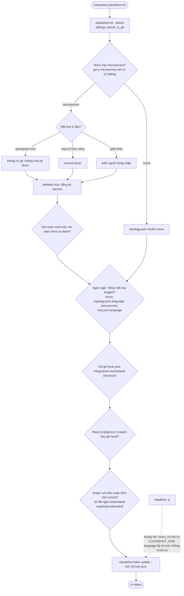
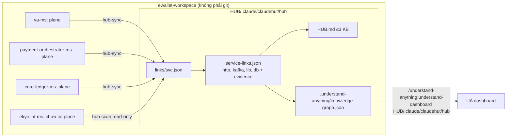
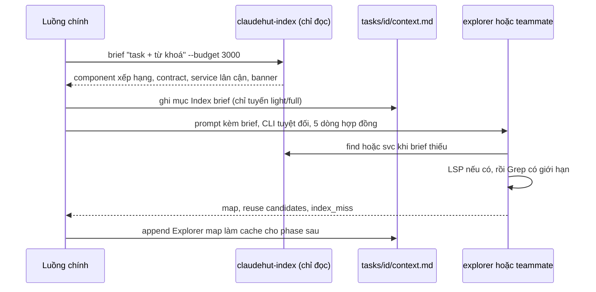
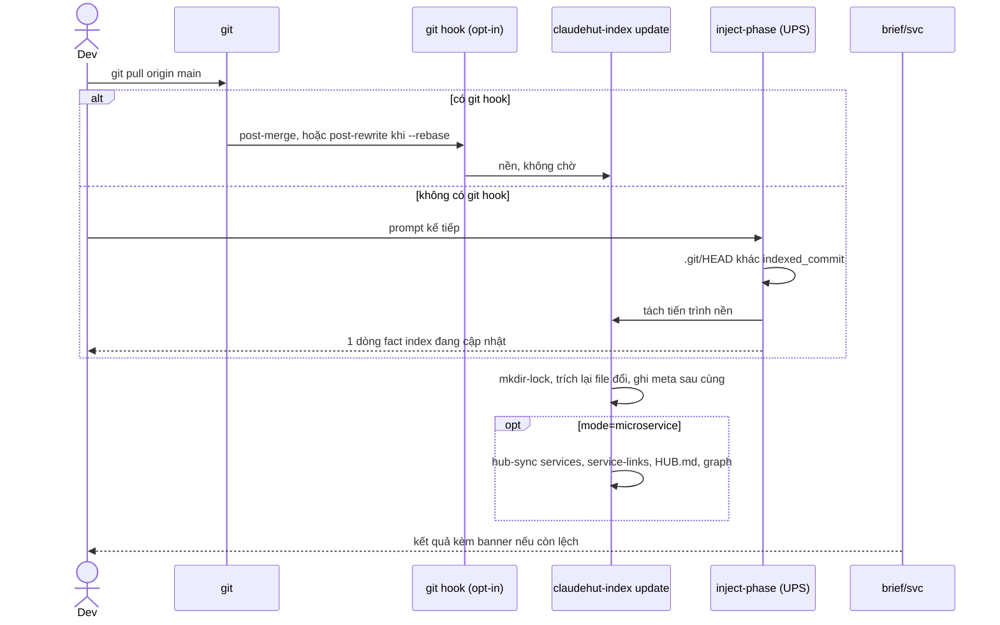

# Index codebase và memory

Phiên bản: 0.12.0-draft · Ngày: 2026-09-29 · Trạng thái: Đề xuất

## Tóm tắt

Index của v0.11 do LLM tự ghi, không có schema, không gắn commit và chỉ phục vụ một `$CLAUDE_PROJECT_DIR`; hậu quả là MEMORY.md phình tới 105.333 B, path mục dần và agent grep lại code, kể cả ở repo khác (D1–D10). v0.12 thay bằng index do script tất định sinh, đóng dấu commit, truy vấn qua CLI `claudehut-index` mà các lệnh dành cho agent đều chỉ đọc. Ở chế độ microservice, init hỏi nơi đặt hub; hub nối các service bằng cạnh contract có evidence và sinh graph mức service để mở bằng dashboard UA. MEMORY.md do máy sinh (≤2 KB), learnings có schema và dedup mờ. Mọi hook đều advisory, việc nặng chạy nền.

## 1. Vấn đề

Số liệu đo trên ewallet-workspace (15+ repo service, root không phải git repo); verdict adversarial xem [01-audit.md](01-audit.md).

| ID | Hiện trạng đo được |
|----|--------------------|
| D1 | MEMORY.md party-ms 105.333 B (~12,9 lần ngân sách 8.192 B), `@import` mọi lượt, vẫn tăng sau cảnh báo; migrate chỉ opt-in |
| D2 | Graph UA payment-gateway-ms lệch HEAD 374 commit; reuse-index auth-ms mất 10/85 path. So commit chỉ có ở Summer KB và worktree, chưa có cho index service |
| D3 | reuse-index chỉ được mở ở 4/22 lần chạy explorer/scanner (691 tool call, một phần là bước REFUTE hợp lệ); Discover không truyền index vào prompt |
| D4 | Cờ "UA ENABLED — MUST use" không thực thi được ở explorer (không có Skill); Discover không nhắc UA (F-2) |
| D5 | 40 learning rỗng vì candidate dùng khoá `text` |
| D6 | Store bão hoà ở cap 400; dedup chính xác không bao giờ khớp; 79% entry hits≤1; khoảng 3% được inject vô điều kiện |
| D7 | reuse-index không có schema; party-ms chỉ 24/43 path là một file hợp lệ |
| D8 | 575 lần Read/Grep sang repo khác (va-ms 329); federation chưa bật; không có bản đồ contract |
| D9 | Root chỉ nạp MEMORY/PROJECT/LANGUAGE qua CLAUDE.md tổ tiên; learnings, reuse-index, graph root là dữ liệu chết. PROJECT.md root bổ sung, không mâu thuẫn |
| D10 | `.gitignore:41:.claude/` che MEMORY.md ở party-ms, trong khi template ghi "committed index" |

## 2. Phương án đã so sánh

| Phương án | Dữ kiện đã kiểm | Đánh giá |
|-----------|-----------------|----------|
| Vá tại chỗ | — | Sửa D1, D5, D6; index vẫn do LLM ghi (gốc D2/D3 còn), không có hub (D8) |
| Chỉ dùng UA | Một PROJECT_ROOT; merge trùng id "later wins"; resolver sinh ~480 cạnh `imports` giả xuyên service; không có API truy vấn; graph root mang `HEAD_UNKNOWN` ([UA](https://github.com/Egonex-AI/Understand-Anything)) | Chỉ làm lớp hiển thị |
| Serena / tool `LSP` | Serena là MCP stateful, "only one coding project can be active at a time" ([Serena](https://github.com/oraios/serena)). `LSP` cần code intelligence plugin, không chạy trong cloud session ([tools-reference](https://code.claude.com/docs/en/tools-reference)); jdtls tốn RAM ([code-intelligence](https://code.claude.com/docs/en/plugins/code-intelligence)) | Loại Serena; `LSP` là đường tuỳ chọn cho symbol |
| aider repo-map | tree-sitter def/ref, PageRank, `--map-tokens` mặc định 1k, cache theo mtime ([aider](https://aider.chat/docs/repomap.html)) | Mượn xếp hạng + ngân sách cho `brief` |
| SCIP | Chính xác theo compiler, cần binary; `scip-code/scip` 815 sao, dưới ngưỡng 1k ([SCIP](https://github.com/scip-code/scip)) | Loại |
| Graph MCP ngoài | GitNexus PolyForm Noncommercial ([GitNexus](https://github.com/abhigyanpatwari/GitNexus)); codebase-memory-mcp chưa xác minh license và Spring/Kafka ([repo](https://github.com/DeusData/codebase-memory-mcp)); bộ cài đăng ký MCP và chèn khối vào CLAUDE.md ([CodeGraph](https://github.com/colbymchenry/codegraph)); `tools:` tường minh phải ghi đúng tên `mcp__…` (F-4, F-PA-2) | Loại |
| **Chọn: index tất định + hub contract + CLI chỉ đọc** | Mẫu `base-url: ${…_URL}`, `topic(s): ${…}`, `r2dbc:postgresql://…/<db>`, `io.f8a.summer` đã kiểm trên đĩa | Đủ yêu cầu; giữ tươi không tốn token; Bash chạy được ở luồng chính, subagent và teammate (F-1) |

Quyết định chi tiết: ADR-IDX-1..8 trong [09-adr.md](09-adr.md).

## 3. Nguyên tắc

Dữ kiện do máy trích, LLM không ghi index (D7). Context luôn nạp chỉ giữ con trỏ, chi tiết lấy qua CLI khi cần ([context engineering](https://www.anthropic.com/engineering/effective-context-engineering-for-ai-agents)). Hook advisory theo [05-hooks.md](05-hooks.md). Agent chỉ gọi lệnh đọc; việc ghi thuộc hook, git hook, init và merge-learnings. Không ghi vào dữ liệu của plugin khác; không sửa `.gitignore`, CLAUDE.md hay git hook khi người dùng chưa đồng ý.

## 4. Topology

### 4.1 Init



Câu hỏi dùng AskUserQuestion ở luồng chính. Init không tự chạy `/understand` vì Phase 0.5 của UA dừng chờ người dùng.

**Ngôn ngữ (ADR-R7).** Init hỏi Tiếng Việt hay English và ghi `language: "vi"|"en"`. Giá trị này quyết định ngôn ngữ agent phản hồi user và viết artifact (brainstorm, spec, plan, review, `task.md`, learnings); identifier, code, lệnh, heading template giữ nguyên. Thứ tự phân giải: `topology.json.language` của plane → `hub/hub.json.language` (microservice) → `en`. Service kế thừa hub khi không có trường, có trường thì override. `LANGUAGE.md` là vocabulary lock, không chứa cài đặt này.

### 4.2 Plane mono

```text
<repo>/.claude/claudehut/
├── topology.json        {schema:1, mode:"mono", service, hub:null, shared, git_hooks, language:"vi"|"en"}
├── index/               sinh ra, gitignored
│   ├── components.jsonl
│   ├── contracts.json
│   ├── files.json       {path:sha1} + dirty[] cho update tăng dần
│   └── meta.json        ghi SAU dữ liệu, nhỏ (hook đọc 1 KB đầu)
├── MEMORY.md            phần máy sinh ≤2 KB
├── PROJECT.md
├── LANGUAGE.md
├── learnings.jsonl
└── reuse-index.json     v0.11, chỉ đọc, không migrate
```

Thiếu `topology.json` thì mặc định mono.

| File | Schema (rút gọn) |
|------|------------------|
| `components.jsonl` | `{id:"<svc>:<fqn>", svc, fqn, name, kind, path, line, annotations[], methods[≤12], tags[], purpose, sha1}`; `path` luôn là một file tồn tại; `purpose` là câu đầu Javadoc |
| `kind` | controller, service, repository, listener, producer, client, config, entity, router; suy từ annotation hoặc kiểu (ví dụ `@KafkaListener` → listener) |
| `contracts.json` | `{http_exposed[{method,path,handler_id,at}], http_clients[{env,default_url,at}], kafka_consume[{topic,env,at}], kafka_produce[{topic\|null,prefix\|null,at}], db[{name,at}], libs[{coord}]}` |
| `meta.json` | `{schema:1, indexed_commit, indexed_at, tool_version, counts, svc, extractor, …}`; `indexed_commit` đứng thứ hai vì hook chỉ đọc 1 KB đầu (05 AC12) |
| `files.json` | `{schema:1, files:{path:sha1}, dirty:[path]}`: chỉ `update`/`status` đọc; tách khỏi meta.json để fast path của hook không đọc map 100+ KB |

reuse-index.json cũ giữ nguyên checksum; `find` và `brief` chỉ đọc `purpose`/`tags` của entry có path hợp lệ (party-ms 24/43, D7).

### 4.3 Microservice: plane mỏng cho từng service + hub

Mỗi service giữ plane như mono, chỉ khác `topology.json` trỏ tới hub. `hc_plane_or_exit` đọc plane cục bộ rồi `topology.json.hub` (override bằng `CLAUDEHUT_HUB`), không walk ngược cây (ADR-H9).

```text
<service>/.claude/claudehut/
├── topology.json        {schema:1, mode:"microservice", service:"va-ms", hub:"<tương đối>", shared, git_hooks, language?}  thiếu language → kế thừa hub
└── index/meta.json      indexed_commit của service   (+ các file như mono)

<HUB>/.claude/claudehut/hub/
├── hub.json             {schema:1, language:"vi"|"en"}  mặc định cho mọi service
├── services.json        {"<svc>":{path, remote, indexed_commit, synced_at, has_plane}}
├── aliases.json         {env:{}, topic_owner:{}, db_owner:{}}  người dùng sửa
├── links/<svc>.json     contracts từng service; repo chưa có plane được hub-scan read-only
├── service-links.json   cạnh xuyên service
├── HUB.md               ≤3 KB, path tính từ gốc hub
├── fleet-learnings.jsonl
└── .understand-anything/
    ├── knowledge-graph.json   graph mức service, schema UA
    └── meta.json
```

`service-links.json` (ví dụ theo fixture 3 repo của AC-8; `:NN` là số dòng do extractor ghi):

```json
{
  "schema": 1,
  "edges": [
    {"from": "a-ms", "to": "b-ms", "type": "http", "via": "B_SERVICE_URL",
     "evidence": ["a-ms/src/main/resources/application.yml:NN"], "confidence": "high"},
    {"from": "a-ms", "to": "c-ms", "type": "kafka", "via": "x.v1",
     "evidence": ["a-ms/src/main/java/…/Producer.java:NN", "c-ms/src/main/resources/application.yml:NN"], "confidence": "high"},
    {"from": "a-ms", "to": "java-common-ms", "type": "lib", "via": "io.f8a.summer:*",
     "evidence": ["a-ms/build.gradle:NN"], "confidence": "high"},
    {"from": "b-ms", "to": "c-ms", "type": "db", "via": "shared_db",
     "evidence": ["b-ms/src/main/resources/application.yml:NN", "c-ms/src/main/resources/application.yml:NN"], "confidence": "medium"}
  ],
  "unresolved": [{"svc": "c-ms", "kind": "kafka_produce", "prefix": "<topic-prefix>", "at": "c-ms/…:NN"}]
}
```

| Loại cạnh | Luật join | Confidence |
|-----------|-----------|------------|
| http | `client.env` → service; `aliases.env` thắng, nếu không thì bỏ `_SERVICE_URL\|_BASE_URL\|_URL`, `_MS`, đổi kebab | `<x>`/`<x>-ms`: high; chuỗi con duy nhất: medium; không khớp: `unresolved`; host ngoài: `external:<host>` |
| kafka | `producer.topic == consumer.topic` | chính xác: high; prefix: medium; thiếu producer: `unresolved` |
| lib | `io.f8a.summer:*` → java-common-ms | high |
| db | cùng DB ở ≥2 service → shared-db; owner theo `aliases.db_owner` hoặc service có migration | chỉ phản ánh default trong repo |

`knowledge-graph.json` ghi đủ field zod bắt buộc để `sanitizeGraph` không phải tự điền:

```json
{"version": "1", "kind": "codebase",
 "project": {"name": "ewallet-hub", "languages": ["java"], "frameworks": ["spring-boot"],
             "description": "…", "analyzedAt": "…", "gitCommitHash": "multi"},
 "nodes": [{"id": "service:a-ms", "type": "service", "name": "a-ms", "summary": "…", "tags": [], "complexity": "simple"},
           {"id": "topic:x.v1", "type": "topic", "name": "x.v1", "summary": "…", "tags": [], "complexity": "simple"}],
 "edges": [{"source": "service:a-ms", "target": "topic:x.v1", "type": "publishes", "direction": "forward", "weight": 1}],
 "layers": [], "tour": []}
```

Node: `service:`, `topic:`, `table:`, `module:summer`, `resource:external:*`. Edge: `calls`, `publishes`, `subscribes`, `reads_from`, `depends_on`. Weight: high = 1, medium = 0,6.



Dashboard UA mỗi lần đọc một `GRAPH_DIR/.understand-anything/knowledge-graph.json`; muốn xem sâu một service thì mở dashboard trên repo đó. Không gộp graph. Căn cứ: skill `understand-dashboard` nhận `argument-hint: [project-path]` và đọc `<project-path>/.understand-anything/knowledge-graph.json` (`understand-anything/2.7.5/skills/understand-dashboard/SKILL.md:4,14-17`), nên truyền thư mục hub làm project-path là đủ, không cần ghi vào `.understand-anything/` của repo service.

| Vị trí hub | Chia sẻ qua git | Nạp vào context |
|-----------|-----------------|-----------------|
| Workspace root | Không | `<root>/CLAUDE.md` chỉ `@import` `PROJECT.md` và `hub/HUB.md`, bỏ MEMORY/LANGUAGE root (D9); hỏi trước khi sửa |
| Repo tri thức riêng | Có (xem §8.3) | Không `@import`; index card mang đường dẫn hub |

## 5. CLI `claudehut-index`

Wrapper bash gọi python3 stdlib, không pip. Output giới hạn byte; lỗi thì exit 0 kèm một dòng; thiếu python3 thì in `index: unavailable`. Luôn gọi bằng đường dẫn tuyệt đối vì thực tế `bin/` không có trên PATH.

| Lệnh | Loại | Output / hành vi |
|------|------|------------------|
| `status [--fast] [--json]` | đọc | `{indexed_commit, head, behind, dirty, updating, ua:{dir,behind}, hub:{path,services,stale[]}}`; dò cả `.ua/` lẫn `.understand-anything/`; `--fast` <300 ms |
| `brief "<text>" [--budget 3000] [--json]` | đọc | `--json` → `{budget, bytes, sections:[{name, lines, rows?}], markdown}` (shared contract; `sections` là đúng các dòng `markdown` giữ lại). Không `--json` → Markdown ≤ budget: banner, top 12 `kind fqn path:line — purpose` (ưu tiên controller/handler/service), contract liên quan (listener/producer chỉ nằm ở Contracts), service lân cận. `--task <id>` không tồn tại → một dòng `task <id> not found — generic brief`. Ở hub/root thì tìm trên mọi service |
| `find <term\|glob> [--svc S]` | đọc | Danh sách component |
| `svc <service>` | đọc | ≤2,5 KB: vai trò, endpoint, topic pub/sub, client, DB, top component. Repo lệch thì gắn `[lệch N commit — đang cập nhật nền]` và tách update, không chờ |
| `links [--service S] [--type http\|kafka\|lib\|db]` | đọc | Cạnh từ `service-links.json`; Review dùng để ước blast radius ([08-review.md](08-review.md)) |
| `update [--full\|--incremental] [--hub-sync] [--repo PATH]` | ghi | mkdir-lock `index/.lock` (stale sau 120 s). Tập file = `git diff --name-only <indexed_commit>..HEAD` ∪ dirty, lọc `*.java`, `*.kt`, `application*.y*ml`, `*.gradle*`, `pom.xml`. Chạy full khi mất `indexed_commit` hoặc >30% file đổi. Ghi tmp+mv, `meta.json` sau cùng |
| `memory` | ghi | Sinh lại phần máy sinh của MEMORY.md (§8.1) |

Lệnh ghi phụ trợ: `hub-sync`, `hub-scan`, `install-git-hooks`, `uninstall-git-hooks`.

## 6. Hợp đồng chống vòng khám phá



| Thành phần | Quy tắc |
|-----------|---------|
| Theo tuyến | `direct`: luồng chính tự gọi `brief`/`find` thay cho Grep, không ghi file. `light`/`full`: Discover chạy `brief` một lần, ghi `tasks/<id>/context.md`, dán vào mọi prompt dispatch ([04-routing-harness.md](04-routing-harness.md)) |
| Hợp đồng explorer | (1) Đọc brief trong prompt. (2) `find` cho component, `svc` cho service khác, `LSP` (nếu có) cho định nghĩa/tham chiếu. (3) Graph UA đọc bằng jq khi `status` báo tươi. (4) Grep chỉ cho phần index thiếu, ghi vào `index_miss:`. (5) Không Read repo khác khi `svc` đã đủ; có banner lệch thì REFUTE path được trích |
| Tools | explorer `Read, Grep, Glob, Bash, LSP`; reuse-scanner `Read, Grep, Glob, Write, LSP` (không Bash, dựa vào brief). Không tên `mcp__*` |
| Teammate | Frontmatter không áp cho teammate (F-1), nên prompt lặp lại CLI tuyệt đối và hợp đồng |
| Hint xuyên service | `hint-explore.sh` (PostToolUse `Read\|Grep\|Glob`, timeout 2, chỉ microservice): một dòng fact lần đầu mỗi (session, agent, svc) chạm repo service khác trong hub. Không đếm, không deny; chỉ bash+jq |
| Skill UA | Chỉ luồng chính gọi `understand-chat`, khi graph tươi; explorer không có Skill (D4) |

## 7. Độ tươi

`index/meta.json.indexed_commit` được ghi sau dữ liệu, nên lỗi giữa chừng chỉ để lại trạng thái "lệch", không bao giờ thành "tươi giả". Mọi đường cập nhật dùng mkdir-lock, idempotent, no-op khi `indexed == HEAD` và không có file dirty.

| Trigger | Handler | Cách chạy | Phủ tình huống |
|---------|---------|-----------|----------------|
| SessionStart `startup` | `maintain.sh` | async: so HEAD, `update --incremental --hub-sync` | Pull trước khi mở phiên |
| SessionStart | `bootstrap.sh` | sync: index card ≤500 B (`Index <svc>@<sha7> (lệch N)`, hub hoặc `mono`, CLI tuyệt đối, độ lệch graph UA) | Model biết index tươi tới đâu |
| UserPromptSubmit | `inject-phase.sh` | sync: so `.git/HEAD` bằng bash (hub: từng repo); lệch → tách update, một dòng fact mỗi (repo, HEAD) | Pull ở terminal giữa phiên |
| `brief`/`svc` gặp lệch | CLI | banner, tách update | Pull trong cùng lượt |
| `post-merge`, `post-rewrite`, `post-checkout` (branch=1) | git hook opt-in | nền, không `exit` | Ngay sau pull ([githooks](https://git-scm.com/docs/githooks)) |

Các handler thuộc hooks.json 13 handler ([05-hooks.md](05-hooks.md)); không có PostToolUse Bash. Cơ chế async của `maintain.sh`: ADR-H8. Graph UA không bao giờ bị chạy lại tự động, chỉ được báo độ lệch.

Git hook: có `core.hooksPath` hoặc husky/lefthook thì chỉ in khối cần thêm. Ngược lại, khối `# >>> claudehut-index >>>` được chèn ngay sau shebang (để `exit` sớm của hook sẵn có không bỏ qua nó), gọi shim bền trong `${CLAUDE_PLUGIN_DATA}/bin/` và bỏ qua worktree phụ. Cần `post-rewrite` vì `pull --rebase` không kích hoạt `post-merge`.



## 8. Memory

### 8.1 MEMORY.md

| Mục | Thiết kế |
|-----|----------|
| Phần máy sinh | Giữa `<!-- claudehut:generated:start/end -->`, ≤2.048 B: đường dẫn tuyệt đối tới plane (D9), topology, CLI, top 8 `category(trigger) → learnings.jsonl (n)`, `chia sẻ: <shared>` thay "committed index" (D10) |
| Phần người viết | Ngoài marker, giữ nguyên, vẫn tính vào ngân sách. Ngoại lệ: block per-task của learner v0.11 (`## Reuse additions (`, `## Topics (`) nằm ngoài marker được chuyển sang MEMORY-history.md (trừ khi `--no-migrate`). `claudehut-init --migrate-memory` gọi đúng lệnh này (một đường migrate) |
| Ai ghi | Chỉ `claudehut-index memory` (gọi từ `maintain.sh` và merge-learnings). Learner thôi ghi MEMORY.md và reuse-index |
| Vượt 8.192 B | `maintain.sh` chuyển khối máy sinh sang MEMORY-history.md rồi sinh lại; hiệu lực từ phiên sau (D1) |

Mô hình giống auto memory: chỉ mục nhỏ cộng topic file đọc khi cần ([memory](https://code.claude.com/docs/en/memory)).

### 8.2 learnings

Candidate do learner ghi (tools giữ `Read, Write`):

```json
{"category": "pitfall", "trigger": "2–5 token, không chứa tên service",
 "learning": "một câu ≥20 ký tự", "evidence": "file:line",
 "confidence": 0.8, "scope": "service | fleet"}
```

| Bước trong `merge-learnings.sh` | Quy tắc |
|-------------------------------|---------|
| Chuẩn hoá | `.learning = (.learning // .text // .lesson // "") \| trim` (D5) |
| Cổng | learning ≥20 ký tự, khác evidence; vi phạm → `state/<sid>.rejected.jsonl` |
| Trigger | bỏ stopword, tên service, `ms`; tối đa 5 token. Nếu có token tên service bị bỏ thì entry mới giữ `trigger_src` = trigger đã lưu + token bị bỏ, chỉ dùng cho promote map sang rule file (auth-ms: `auth` vẫn map `security/spring-security.md`) |
| Dedup | cùng category và Jaccard(trigger ∪ top-8 token learning) ≥0,5 → merge (hits++, evidence ≤3). Giữ token số để không gộp nhầm SQLSTATE; khoá chính xác cũ là nhánh nhanh (D6) |
| Cap | Giữ 400 |
| Repair | Chạy một lần, idempotent: entry `learning==""` → `learnings.rejected.jsonl` (D5) |
| Fleet | `scope=fleet` (microservice) → `<hub>/fleet-learnings.jsonl` dưới lock hub; inject với confidence ×0,7, nhãn `[fleet]`. `CLAUDEHUT_FEDERATION_ROOT` còn là alias trong một phiên bản (D8) |

### 8.3 Chia sẻ và gitignore

Init chạy `git check-ignore -v` rồi hỏi; plugin không tự sửa `.gitignore`. Chọn chia sẻ thì init in patch để người dùng tự áp. Với dòng `.claude/`, negation `!` không re-include được, nên patch dùng `.claude/*`:

```gitignore
.claude/*
!.claude/claudehut/
!.claude/rules/
.claude/claudehut/state/
.claude/claudehut/ledger/
.claude/claudehut/index/
# bỏ dòng này nếu chọn chia sẻ task
.claude/claudehut/tasks/
```

| Commit (khi `shared:true`) | Không commit |
|----------------------------|--------------|
| `topology.json`, `MEMORY.md`, `PROJECT.md`, `LANGUAGE.md`, `learnings.jsonl`; ở hub: `hub.json`, `services.json`, `aliases.json`, `HUB.md`, `fleet-learnings.jsonl` | `index/`, `state/`, `ledger/`; ở hub: `links/`, `service-links.json`, `.understand-anything/` |
| | `tasks/` (task.json + artifact): không commit (câu hỏi 6, đã chốt 2026-09-29) |

Chọn giữ local thì init ghi `shared:false`. `state/`, `ledger/` và `index/` mỗi thư mục có `.gitignore` chứa `*` do plugin ghi, nên không lọt vào `git status` dù `.gitignore` của project chưa có dòng nào; init in kết quả `git check-ignore -v` và patch trên, không ghi vào `.gitignore`.

## 9. Ranh giới với understand-anything

| UA làm | ClaudeHut làm | ClaudeHut không bao giờ làm |
|--------|---------------|------------------------------|
| Graph mức code trong một repo; dashboard; `understand-chat`/`-diff` | Báo `ua:{dir, behind}` trong `status` và index card; ghi graph mức service vào `hub/.understand-anything/` (GRAPH_DIR riêng của hub); explorer đọc graph repo bằng jq | Ghi vào `.understand-anything/` hay `.ua/` của repo hoặc root; tự chạy `/understand`; gộp graph; xoá graph root 7,5 MB (`HEAD_UNKNOWN`, chỉ bị báo là nguồn không đáng tin) |

Bootstrap bỏ dò `claude plugin list` (B10) và dòng "MUST use" (F-2). Graph UA có dữ liệu lệch schema (963 node sai tiền tố id), nên phía đọc phải chịu lỗi ([02-research.md](02-research.md)).

## 10. Tiêu chí chấp nhận

Milestone và lệnh kiểm tra: [10-rollout-eval.md](10-rollout-eval.md) (M5 mono + memory, M6 hub).

Trạng thái (2026-10-01): M5 đạt AC-1..AC-7 và AC-15 phần mono; AC-13 đạt cả vế `core.hooksPath`/husky/lefthook, headless và gitignore (init không sửa `.gitignore`, in `check-ignore -v` + patch; test F5 viết lại theo §8.3). M6 (2026-10-01) đạt AC-8..AC-11 và AC-15 phần microservice. AC-12 chỉ đạt vế `brief` nhiều service; vế `@import` HUB.md chỉ áp cho hub ở workspace root và bị hoãn, vì ewallet dùng repo tri thức riêng ([10 §M6](10-rollout-eval.md)). AC-14 đo ở M7. `components.jsonl` dùng khoá `file` (không phải `path` như §4.2) và thêm kind `endpoint`, `migration`, `component`.

| # | Tiêu chí | Audit |
|---|----------|-------|
| AC-1 | party-ms MEMORY.md → ≤8.192 B, khối đã chuyển nằm ở MEMORY-history.md, phần người viết không đổi; plane mới ≤2.048 B | D1 |
| AC-2 | Candidate khoá `text` → `learning` có nội dung; <20 ký tự → rejected; sau repair 0 entry rỗng | D5 |
| AC-3 | Trigger `code\|completeitem\|dead\|multipart\|proof` và `multipart\|proof\|settlement\|dead` cùng category → 1 entry, hits=2; cap 400 | D6 |
| AC-4 | 100% `components.jsonl` qua `test -f`; checksum reuse-index.json không đổi | D7 |
| AC-5 | Pull 2 commit sửa 3 file java → `indexed_commit` = HEAD ≤10 s (có git hook) hoặc ở lượt/phiên kế tiếp, `reextracted=3`; worktree phụ không kích hoạt | D2 |
| AC-6 | Index card ≤500 B, phần ClaudeHut ≤4.000 B (`lint-prompt-length.sh --payload`); không có plane → phần index không output | D2, F-7 |
| AC-7 | `brief` ≤ budget, có banner khi lệch; lệnh đọc không đổi mtime; `svc` repo lệch trả ≤1 s | D3, D8 |
| AC-8 | Fixture 3 repo: A→B http high, A→C kafka high, B↔C shared-db; prefix-only vào `unresolved[]` | D8 |
| AC-9 | ewallet: cạnh lib chỉ tới java-common-ms; mọi cạnh http/kafka có evidence tồn tại; `LEDGER_SERVICE_URL` → core-ledger-ms medium hoặc theo alias | D8 |
| AC-10 | Dashboard HTTP 200; `sanitizeGraph` 0 cảnh báo; checksum graph root không đổi | D8, D9 |
| AC-11 | hint-explore p95 ≤30 ms/1.000 payload; không `permissionDecision`/exit 2; ≤1 lần mỗi (session, agent, svc); mono → rỗng | D8 |
| AC-12 | Phiên party-ms không nạp MEMORY/LANGUAGE root, vẫn nạp PROJECT.md + HUB.md (InstructionsLoaded); phiên ở root: `brief` trả nhiều service | D9 |
| AC-13 | `.claude/` bị ignore → chỉ in patch; `core.hooksPath` → chỉ in hướng dẫn; headless không hỏi | D10 |
| AC-14 (ước tính) | 10 task: trung vị call explorer giảm ≥40% (baseline ~23); Read chéo service giảm ≥50% (va-ms 329) | D3, D8 |
| AC-15 | Init mono chọn Tiếng Việt → `topology.json.language="vi"`; microservice → `hub/hub.json.language` có giá trị, service không có trường thì kế thừa, service ghi `"en"` thì override; headless không hỏi; thiếu cả hai → `en` | ADR-R7 |

## 11. Rủi ro và câu hỏi mở

| Rủi ro | Giảm thiểu |
|--------|------------|
| Regex bỏ sót (Kotlin, RouterFunction, topic dựng động, base-url dựng trong code) | `unresolved[]`, `aliases.json`, `index_miss` |
| Heuristic env → service gắn nhầm | Tối đa medium; alias thắng |
| Tiến trình nền bị kill (`-p`, thoát sớm) hoặc tranh lock | Idempotent; lock stale sau 120 s; mất lock thì bỏ qua lượt |
| Dashboard UA hiển thị kém với node không có filePath (chưa chạy thử) | HUB.md vẫn là nguồn chính cho agent |

Câu hỏi mở của vùng, tất cả đã chốt (2026-09-29) theo mặc định đề xuất ở [10-rollout-eval.md](10-rollout-eval.md):

- Vị trí hub ewallet — Đã chốt (2026-09-29): repo tri thức riêng.
- Chia sẻ qua git — Đã chốt (2026-09-29): giữ local; init chỉ in patch; git hook chỉ cài khi user đồng ý (ADR-IDX-8).
- husky/lefthook — Đã chốt (2026-09-29): chỉ in hướng dẫn.
- Hub-scan 6 repo chưa có plane — Đã chốt (2026-09-29): hỏi ở init.
- jdtls/LSP — Đã chốt (2026-09-29): tuỳ chọn; dùng `LSP` nếu có.
- Bash cho reuse-scanner — Đã chốt (2026-09-29): không.
- Ngôn ngữ phản hồi và artifact — Đã chốt (2026-09-29): hỏi ở init (ADR-R7).
