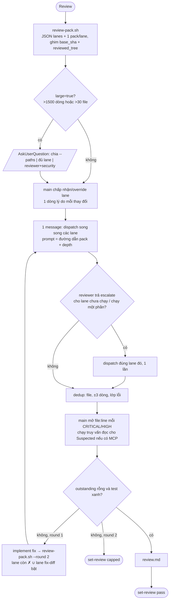

# Review động theo diff

Phiên bản: 0.12.0-draft · Ngày: 2026-09-29 · Trạng thái: Đề xuất

## Tóm tắt

v0.11 chọn auditor bằng văn xuôi nghiêng về "cứ chạy": 54% đợt review có ≥4 agent, auditor tự dựng lại diff, output 19–31k token mỗi auditor (E1, E4, E7). v0.12 giao phần cơ học cho `scripts/review-pack.sh`: chọn lane từ path/hunk/enforcement và ghi mỗi lane một pack ghim SHA. Roster gộp 7→5, giữ tên; effort theo lane; main dedup, kiểm chứng và chạy truy vấn dữ liệu sống. Round 2 chỉ chạy lane còn lỗi hoặc bị fix chạm, tối đa 2 round. Quyết định: ADR-V1..V10 ([09-adr.md](09-adr.md)); milestone M4 ([10-rollout-eval.md](10-rollout-eval.md)).

## 1. Baseline v0.11

Chỉ dùng số của subagent typed; số teammate chưa tái lập. Nguyên nhân chi tiết: [01-audit.md](01-audit.md).

| Chỉ số | Giá trị | Nguồn |
|---|---|---|
| Đợt fan-out | 52 đợt / 208 dispatch; 28 đợt ≥4 agent; 7 đợt đủ 7 loại | E1 |
| Chi phí median đợt ≥4 agent | 22,1M input (~95% cache_read) · 118k output · 12,7 phút; M0 đo lại trên 8/28 đợt đủ transcript: 22,58M · 118k · 12,7 phút (`evals/review-cost.sh`) | E1 |
| Diff trong prompt | 2/54 prompt auditor typed có hunk (4/183 trên mọi prompt, E4); auditor tự chạy 119 `git diff`; db/observability không có Bash | E4, E5 |
| Coverage | security 76 hàng/18 n-a; db 60 hàng/20 n-a | E3 |
| Output mỗi auditor | 18,9k (perf) – 30,6k (db) | E7 |
| Ép suy nghĩ | `ultrathink` 41/54 prompt; 11 lần nâng model thật | E7 |
| MCP | 0 lời gọi tới tên khai báo trong frontmatter | E6, F-4 |

## 2. Luồng tổng thể



Script quyết phần cần đúng mọi lần, model quyết phần phán đoán ([features-overview](https://code.claude.com/docs/en/features-overview)). Script không chặn dispatch; main được lệch khỏi selector nếu ghi lý do (ADR-V1).

## 3. Chọn lane

### 3.1 Mặc định theo route

Route đọc từ `task.json.route` ([04-routing-harness.md](04-routing-harness.md)).

| Route | Lane mặc định | Nguồn test | `set-review` |
|---|---|---|---|
| direct | không review, trừ khi người dùng yêu cầu; khi đó chạy như review ngoài workflow, findings trả trong chat | như review ngoài workflow | không |
| light | reviewer | fold vào reviewer | có |
| full | reviewer + test-runner | test-runner | có |

Mọi route: lane chuyên biệt chỉ bật khi có tín hiệu; không lane nào "default ON" (E1).

### 3.2 Tín hiệu → lane

Grep trên đường dẫn và dòng `+`/`-` của hunk, không grep toàn file; `Mono`/`Flux` đơn thuần không còn là tín hiệu (E1). Mỗi lane mang `reasons[]`, ví dụ `hunk:@KafkaListener OrderConsumer.java`.

| Lane → agent | Path | Hunk (+/-) | Prefix enforcement (gợi ý + định tuyến, không bật lane) |
|---|---|---|---|
| security → `security-auditor` | `security/**`, `auth/**`, `*SecurityConfig*`, `*Filter.java` | `@PreAuthorize`, `@Secured`, `SecurityFilterChain`, `permitAll`, `JwtDecoder`, `PasswordEncoder`, `activateDefaultTyping`, secret trong `application*.yml` | `security/*` |
| db → `db-reviewer` | `db/migration/**`, `*.sql`, `*Repository` | `@Entity`, `@Table`, `@Query`, `DatabaseClient`, `JdbcTemplate`, `@Transactional`, `TransactionalOperator`, `@Cacheable`, `.block(`, `Thread.sleep` | `performance/*`, `framework/{jpa,r2dbc,flyway,migration,lombok-jpa}` |
| contract → `contract-reviewer` | `*.avsc`, `*.proto`, `openapi*`, `asyncapi*`; dưới `src/main`: `*/kafka/*Config*.java`, `*ConsumerConfig*.java`, `*ProducerConfig*.java`, `*KafkaConfig*.java` | `@KafkaListener`, `KafkaTemplate`, `@RabbitListener`, `@*Mapping`, `WebClient`, `RestClient`, `@FeignClient`, `@Scheduled`, `MeterRegistry`, `@Timed`, `@Observed` | `framework/contract*`, `framework/kafka*`, `observability/*`, `coding/logging-mdc` |
| `uncovered` | ngoài Java/Kotlin/SQL/YAML/properties/schema/build | — | — |

`uncovered` không tự bật lane; main cân nhắc lane ngoài (mục 8).

Đã chốt (2026-10-01, user quyết định, phương án (a)): prefix enforcement chỉ định tuyến item vào pack của lane và hiện trong `hints` của `lanes.json`; không tự bật lane. Lane chuyên biệt chỉ bật theo path/hunk. Item của lane không chạy vào `## Enforcement` của reviewer kèm nhãn `escalate: <lane>`. Lý do: replay M4 đầu tiên cho thấy enforcement set (11–31 item cả task) đẩy core-ledger 0007 (9 file/158 dòng) từ 3 lên 5 lane; bộ rule của task không nói gì về diff này. Kèm theo: đo lại trên mẫu phân tầng ~20 task (nhỏ/vừa/lớn), mục tiêu fan-out tính trên mọi đợt (§9). Số đo ở [10-rollout-eval.md](10-rollout-eval.md) hàng M4.

Tín hiệu `kafka-config` — Đã chốt (2026-10-01, main session): cấu hình consumer/producer Kafka bật lane contract theo path. Lý do: PO 0004 CON-9 (CRITICAL) đổi topic/group chỉ qua `kafka/config/*ConsumerConfig.java`, không có `@KafkaListener`/`KafkaTemplate` trong hunk, nên bị bỏ lỡ.

Lane chạy một phần — Đã chốt (2026-10-01, main session): hướng (a). Lane bật theo tín hiệu chỉ nhận file có tín hiệu; file nguồn còn lại của diff nằm trong `partial:[{lane, uncovered:[files]}]` của `lanes.json`, và `## Escalate` của pack reviewer có dòng "Lanes run on a subset" in vế ngắn hơn: ≤20 file không phủ → `- <lane> not covered: …`; nếu không, ≤20 file đã phủ → `- <lane> covered only: …; every other file in this diff is uncovered for <lane>`; cả hai >20 → 20 file không phủ (`src/main` trước) + `(+N more — see lanes.json partial)`. Reviewer escalate lớp của lane đó trên các file này; main dispatch lane một lần như với lane không chạy. Lý do: giữ chi phí, khôi phục đường escalate, không phình pack. Lane mang sang round 2 hoặc bật qua `--only` mà không có tín hiệu nhận mọi file, nên không partial.

Câu hỏi 4 — Đã chốt (2026-09-29): chỉ bật security lane khi hunk chạm auth/filter/secret/deserialization, không bật chỉ vì có `@*Mapping` ([10-rollout-eval.md](10-rollout-eval.md#7-câu-hỏi-mở)). `@*Mapping` vẫn bật lane contract.

### 3.3 Khi nào hỏi người dùng

Chỉ hỏi khi các cách hiểu dẫn tới khối lượng việc khác hẳn nhau ([prompting-claude-opus-5](https://platform.claude.com/docs/en/build-with-claude/prompt-engineering/prompting-claude-opus-5)); subagent không có AskUserQuestion ([sub-agents](https://code.claude.com/docs/en/sub-agents)):

1. `large=true`: chia bằng `--paths` | đủ lane | chỉ reviewer+security.
2. CRITICAL `pre-existing`: xử lý trong task hay ghi riêng.
3. `uncovered` hợp với plugin khác nhưng tốn đáng kể.

## 4. `scripts/review-pack.sh`

```text
review-pack.sh [--session SID] [--base TREE-ISH] [--round N] [--carry-lanes a,b] [--only a,b] [--paths <pathspec>...]
```

| Bước | Hành vi |
|---|---|
| BASE | `--base`; nếu không: có active_task thì `task.base[repo]` và loại `pre_dirty[repo]`, ngoài workflow thì chuỗi merge-base `@{u}` → `origin/HEAD` → `origin/main` → `HEAD~1` ([03-architecture.md](03-architecture.md)) |
| FILES | `git diff --name-only BASE` ∪ untracked chỉ khi khớp `**/src/**`, `*.gradle*`, `pom.xml`, `*.avsc`, `*.proto`, `openapi*`; loại `.claude/**`, `docs/**`, `**/build/**`, `**/target/**`, lockfile, generated. Thay `git status --porcelain` ở `skills/review/SKILL.md:58`, cùng lớp lỗi E2 |
| Snapshot | index tạm: `read-tree HEAD` → `add -A -- FILES` → `write-tree` = `reviewed_tree`; lỗi submodule/LFS → `reviewed_tree=HEAD`, `degraded:true` |
| Tín hiệu | bảng 3.2 (path/hunk); enforcement = `jq '.enforcement_set[]?'` trên `task.json`, chỉ định tuyến item + `hints` |
| `--only` | chỉ thu hẹp; alias `perf`→db, `observability`→contract |
| Pack | `state/<SID>.review-pack.r<N>.<lane>.md` (gitignored, tự dọn sau 7 ngày). **Trạng thái M4 (2026-09-30):** bản cài đặt theo shared contract: `<plane>/tasks/<id>/review/r<N>.<lane>.md` + `lanes.r<N>.json`/`lanes.json` (thư mục tự ghi `.gitignore` `*`; không có task → thư mục tạm), không có sweep 7 ngày; CLI là superset (thêm `--json`, `--prev`, `--route`, `--task`, `--head`) |
| Stdout | một dòng JSON, luôn exit 0; thiếu `jq`/state → `lanes=[reviewer]`, `degraded:true` |

```json
{"round":1,"lanes":[{"name":"db","reasons":["path:db/migration/V21__x.sql"],"pack":"state/<SID>.review-pack.r1.db.md"}],
 "skipped":[{"name":"security","why":"không có tín hiệu"}],"partial":[{"lane":"db","uncovered":["src/main/java/x/OrderService.java"]}],
 "uncovered":[],"large":false,"degraded":false}
```

| Mục trong pack | Lane |
|---|---|
| Header YAML: `base_sha`, `head_sha`, `reviewed_tree`, `round`, `route`, `lane`, `reasons`, `files` | mọi lane |
| `## Rigor`, `## Known pitfalls` (`inject-learnings.sh --filter <files lane> --top 8 --max-len 200`, [07-index-memory.md](07-index-memory.md)) | mọi lane |
| `## Enforcement` | item có prefix thuộc lane; item không khớp prefix nào, hoặc thuộc lane không chạy (kèm `escalate: <lane>`), vào reviewer |
| `## Vocabulary`, `## Reuse suspects` | reviewer |
| `## Escalate`: "Lanes not run this round" + "Lanes run on a subset" (vế ngắn hơn: `not covered: …` hoặc `covered only: …`, §3.2) | reviewer |
| `## Summer KB` | khi diff chạm `io.f8a.summer`/`summer.*` |
| `## Test command` | test-runner; reviewer ở route light (route full: reviewer nhận `## Tests (not yours)`) |
| `## Diff` | chỉ file của lane; bỏ nhị phân/generated, hunk chỉ-xóa rút thành tên ([pr-agent](https://github.com/The-PR-Agent/pr-agent/blob/main/docs/docs/core-abilities/compression_strategy.md)) |

Trần 1500 dòng mỗi pack vì Read mặc định trả 2000 dòng và tool response bị cap khoảng 25k token ([writing-tools-for-agents](https://www.anthropic.com/engineering/writing-tools-for-agents)); phần vượt chỉ liệt kê tên file, auditor tự `git diff <base_sha> <reviewed_tree> -- <file>` (ghim SHA; file untracked chỉ có trong `reviewed_tree`). Prompt dispatch chỉ gồm đường dẫn pack và `depth: standard|deep` (deep khi lane được chọn mang ≥1 item enforcement hoặc security chạm auth). Không paste diff, không inject qua SubagentStart (ADR-V2).

## 5. Roster 7→5

Giữ tên để `ewallet-query-audit` vẫn dispatch được db-reviewer/test-runner (ADR-V3). Effort khai tường minh để không phụ thuộc effort session (việc kế thừa xhigh chưa kiểm chứng, E7); "Opus 5.5 at medium matches or exceeds Opus 5 at high on coding" ([model-config](https://code.claude.com/docs/en/model-config)). Không truyền `model` khi dispatch (ADR-V4).

| Agent | Model | Effort | Tools | maxTurns | Lane | Thay đổi |
|---|---|---|---|---|---|---|
| `claudehut-reviewer` | opus | medium | Read, Grep, Glob, Bash | 40 | reviewer | high→medium; thêm `escalate`, `mode: verify` |
| `claudehut-security-auditor` | opus | high | Read, Grep, Glob, Bash | 40 | security | xhigh→high; bỏ 3 tên `mcp__*` |
| `claudehut-db-reviewer` | sonnet | medium | Read, Grep, Glob, Bash | 40 | db + perf | thêm Bash (E5); bỏ 4 tên `mcp__*` (E6) |
| `claudehut-contract-reviewer` | sonnet | medium | Read, Grep, Glob, Bash | 40 | contract + observability | gộp floor observability |
| `claudehut-test-runner` | haiku | low | Bash, Read, Grep | 20 | test | thêm maxTurns |
| `claudehut-perf-reviewer` | — | — | — | — | → db | xóa (E3) |
| `claudehut-observability-reviewer` | — | — | — | — | → contract | xóa (E3) |

- **Tool (ADR-V5):** không agent review nào có `mcp__*`. Bỏ `tools:` sẽ để subagent kế thừa MCP phá hủy của session, còn wildcard `disallowedTools` chưa kiểm chứng; plugin agent bỏ qua `mcpServers` ([plugins/components](https://code.claude.com/docs/en/plugins/components)). Bash chỉ để đọc (`git show`, `git log`, `git diff -- <file>`).
- **maxTurns** là lưới an toàn: baseline 19–49 turn/agent, outlier 107 (E4, E7).
- Bỏ `ultrathink` ở mọi agent review.

## 6. Hợp đồng output

### 6.1 Auditor (ADR-V6)

Thứ tự: `Findings` → `Suspected` → `Coverage` → `escalate` → `Verdict`.

| Mục | Quy tắc |
|---|---|
| Findings | chỉ ✗: severity, `file:line`, trích, lý do. "If you are not certain an issue is real, do not flag it" ([code-review plugin](https://github.com/anthropics/claude-code/blob/main/plugins/code-review/commands/code-review.md)). Tối đa 5 LOW, còn lại chỉ đếm ([code-review](https://code.claude.com/docs/en/code-review)) |
| Suspected | ≤3 mục, mỗi mục một bước kiểm cụ thể (câu SQL đọc, lệnh đọc) |
| Coverage | một hàng cho mỗi item enforcement trong pack, không n-a cho item ngoài lane (E3); mỗi ✓ có locus. Reviewer luôn thêm 5 hàng floor (Correctness, Conventions, Duplication, Dead code, Minimalism) và là người duy nhất viết Standards |
| escalate | chỉ reviewer: `escalate: db — File.java:NN` thay vì review lấn lane; cho lane không chạy, hoặc lane `partial` trên file nó không phủ |
| Verdict | thiếu (ví dụ chạm maxTurns) → main ghi lane `incomplete`, không tự re-dispatch |

Bỏ ngôn ngữ cưỡng chế MUST/ALWAYS ([claude-prompting-best-practices](https://platform.claude.com/docs/en/build-with-claude/prompt-engineering/claude-prompting-best-practices)). Chỉ bounce khi thiếu hàng cho item thuộc lane.

### 6.2 `review.md`

Mục: `Lanes` (đã chạy/đã bỏ, mỗi lane một lý do) · `Findings` (severity | file:line | trích | lane | số reporter) · `Coverage` (bắt buộc) · `Pre-existing` · `Tests` (lệnh + số đếm) · `Deferrals` · `Verdict`. Hàng floor có locus của reviewer có ở mọi route, nên review.md route light không finding vẫn qua gate `set-review pass` hiện có (hàng ✓ có locus + dòng Tests) mà không sửa `claudehut-state`.

## 7. Dedup, kiểm chứng, round 2

| Bước | Quy tắc |
|---|---|
| Dedup | khóa (file, ±3 dòng, lớp lỗi); giữ severity cao nhất, ghi số reporter; dedup trước verify (`claude-security/workflows/scan.js`) |
| Verify | main mở `file:line` mỗi CRITICAL/HIGH ([code-review](https://code.claude.com/docs/en/code-review)) |
| `pre-existing` | verdict, không phải bộ lọc: chỉ gắn khi lỗi cũng có ở base (`git show <base>:<path>`). Guard bị diff xóa hoặc nới (`@PreAuthorize`, filter chain) vẫn là finding. Không chặn; CRITICAL thì hỏi |
| Dữ liệu sống | main chạy truy vấn chỉ đọc cho `Suspected` nếu session có MCP phù hợp; nếu không, ghi là suy luận (F-4) |
| Escalate | dòng `escalate: <lane> — File:NN` cho lane không chạy, hoặc lane `partial` trên file trong `uncovered` → main dispatch lane đó một lần, trọng tâm là dòng escalate |
| Tie-break | chỉ khi main không phân xử được: một `claudehut-reviewer` `mode: verify` cho mọi candidate một lần; TRUE/FALSE/PRE-EXISTING kèm `file:line`; tính vào cap round |
| Round 2 (ADR-V8) | `--round 2 --base <reviewed_tree r1> --carry-lanes <lane còn ✗>`: lane = carry ∪ lane bật trên fix-diff (gồm untracked mới đã lọc); test-runner chạy lại nếu fix chạm source. Header pack là bản ghi bền, không thêm state (E8) |
| Cap | round 3 → `set-review capped`; Stop hook đã bỏ ([05-hooks.md](05-hooks.md)) nên đây là giới hạn duy nhất |

Verify ở main, subagent chỉ để tie-break, vì hai tài liệu chính thức mâu thuẫn: [best-practices](https://code.claude.com/docs/en/best-practices) khuyên review đối kháng, còn [prompting-claude-opus-5](https://platform.claude.com/docs/en/build-with-claude/prompt-engineering/prompting-claude-opus-5) bảo không dùng subagent để verify (ADR-V7).

## 8. Test và lane ngoài

- **Một nguồn test mỗi route (ADR-V9):** full dùng test-runner, prompt reviewer ghi "Không chạy build/test"; light fold vào reviewer. Fold là đúng thiết kế, chỉ việc chạy trùng ở full là lỗi (E9).
- **Lane ngoài opt-in (ADR-V10):** main dispatch agent/skill plugin khác cho `uncovered` hoặc theo yêu cầu, gọi bằng tên có namespace; findings vào bảng với `lane=ext:<tên>`, qua dedup/verify. Không lane ngoài mặc định (F-8). Built-in `/code-review` không thay được lane nội bộ vì output không qua gate.

## 9. Chi phí mục tiêu

ƯỚC TÍNH, input gồm cache, đo bằng `evals/review-cost.sh`.

| Lớp | Thành phần | Input | Output | Wall |
|---|---|---|---|---|
| Baseline | đợt ≥4 agent (E1) | 22,1M | 118k | 12,7 phút |
| S | reviewer + test-runner | ≤3,5M | ≤15k | ≤6 phút |
| M | S + 1–2 lane | ≤9M | ≤35k | ≤10 phút |
| L | 4 lane | ≤15M | ≤60k | ≤14 phút |

Lớp S suy từ reviewer đơn 0,3–3M (E2) và test-runner 518k / 1,7 phút (E9). Thêm: đợt ≥4 agent 54% → ≤25% trên mọi đợt; diff lớn tuyến full được dùng ≥4 lane nhưng vẫn nằm trong mẫu số (E1; chốt 2026-10-01); output mỗi auditor 19–31k → ≤8k (E7); `git diff` toàn phạm vi do auditor chạy 119 → 0 (E4).

Đo lại (2026-10-01, `evals/review-replay.sh`, 22 task phân tầng, chỉ round 1, chạy lại sau khi thêm tín hiệu `kafka-config`; lần đo đầu là 5 task khi enforcement còn bật lane, xem [10](10-rollout-eval.md) hàng M4): đợt ≥4 lane 10/22 (45,5%) ở v0.11 → 5/22 (22,7%) với selector. Con số 22,7% chính là tỉ lệ task lớn trong mẫu (tầng gán sau từ file/dòng của pack), vì mọi task lớn có ≥4 lane và mọi task nhỏ/vừa có <4; nó không chứng minh ≤25%. Chiếu lên khung 52 đợt (`review-replay.sh --frame`, mỗi đợt ghép với commit kế tiếp; proxy khớp 12/13 đợt đã biết task): đợt round 1 trên diff lớn 11/52 (21,2%; 12/52 = 23,1% khi sửa tay PO 0001) là cận dưới, mọi đợt trên diff lớn 17/52 (32,7%; 18/52 = 34,6%) là cận trên. Cận dưới cũng gần đúng (commit gộp nhiều task có thể giấu đợt round 1 của task khác), biên tới 25% chỉ một đợt, và round 2 trên diff lớn chưa đo. Chấp nhận có điều kiện (main session, 2026-10-01): ≤25% chưa chứng minh; dải chiếu 21–33% trên khung 52 đợt; đo lại trên đợt thật sau khi phát hành (M7 eval). Theo tầng: nhỏ 1/2 → 0/2 (n=2, 0 MED+: recall diff nhỏ chưa đo); vừa 5/15 → 0/15; lớn 4/5 → 5/5 (được phép). Tổng dispatch 81 → 67 (PO 0004 thêm lane contract), nhưng tuyến light tăng 2 → 5 vì reviewer luôn được dispatch, còn review main-thread của v0.11 không dispatch gì. Recall (sau hướng (a), replay gán nhóm theo file): 53/72 MED+ (73,6%; thông tin) nằm ở lane được chọn mà pack chứa file của finding (15) hoặc sàn reviewer (38); 19 cái chỉ có đường escalate: 4 ở lane không chạy, 15 ở lane chạy một phần (file ngoài pack). Con số giảm so với 86,1% (lần đo trước) và 94,4% (sau `kafka-config`) vì đổi cách đo từ theo lane sang theo file, không phải selector kém đi. File của finding lấy từ `file` (điền tay từ review.md, 13 finding, gồm CON-9 → `VaLedgerCommandConsumerConfig.java` thay vì `spec.md`), nếu không thì `locus`; 1 finding lane không có file (PACT, pre-existing toàn repo). Ở 0013, ba file bị escalate nằm sau vị trí 20 trong 143 file không phủ; dòng pack nay in `contract covered only: <5 file>`, nên reviewer vẫn biết chúng không được phủ (fixture `esc-rs0013-wide-diff`). "100% tính cả escalate" đúng theo cách dựng (mọi finding rơi vào một nhóm; sàn đúng theo định nghĩa), không phải phép đo; phần kiểm được là mỗi ca chỉ-escalate có fixture ghim lane bị bỏ qua hoặc chạy một phần và mục `## Escalate` của reviewer — 19/19 (trường `covers`, xem [10](10-rollout-eval.md) hàng M4).

## 10. Tiêu chí chấp nhận

| # | Given / When | Then |
|---|---|---|
| 1 | sửa service thuần, route full | `lanes=[reviewer,test-runner]`; `skipped` có security/db/contract |
| 2 | hunk chỉ thêm `Mono.just(...)` | db không bật |
| 3 | `docs/*.md`, `sql/tmp.sql` untracked ngoài `src` | không vào FILES |
| 4 | route full, security ✗ round 1; fix chỉ chạm service (commit / chưa commit / untracked mới trong `src`) | round 2 `lanes=[security,reviewer,test-runner]` |
| 5 | ngay sau snapshot; diff 4000 dòng | `git diff <reviewed_tree>` rỗng với path tracked không thuộc `pre_dirty`; file untracked trong FILES bằng nội dung trong cây (so qua index tạm có `add -N`); mọi pack ≤1500 dòng |
| 6 | review.md route light, enforcement rỗng | `set-review pass` chấp nhận |
| 7 | thiếu `jq`/state; `--only perf` | exit 0, `degraded:true`; lane db |
| 8 | `conformance.sh` | 12 agent; 0 `ultrathink`, 0 "default ON"/"when in doubt", 0 `mcp__` trong agent review; mọi agent review có Bash, `effort`, `maxTurns` |
| 9 | `ewallet-query-audit` | dispatch được db-reviewer, test-runner, không sửa |
| 10 | replay mẫu phân tầng ~20 task (nhỏ/vừa/lớn, light và full, có và không có MED+; cách chọn ở header `evals/review-replay.sh`) | ≤25% mọi đợt ≥4 lane (diff lớn tuyến full được ≥4; chốt 2026-10-01); 100% finding MED+ đã xác nhận xuất hiện lại (lane, sàn reviewer hoặc escalate, báo riêng từng nhóm); mỗi ca chỉ-escalate thành fixture |
| 11 | review.md mới; review ngoài workflow | có mục `Lanes`; ngoài workflow exit 0, không gọi `set-review` |
| 12 | hunk chỉ thêm một method `@GetMapping`, không chạm auth/filter/secret/deserialization | contract bật; security nằm trong `skipped` |

Câu hỏi mở của vùng, đã chốt (2026-09-29) theo [10-rollout-eval.md](10-rollout-eval.md#7-câu-hỏi-mở):

- Security cho mọi `@*Mapping` — Đã chốt (2026-09-29): không; chỉ bật khi hunk chạm auth/filter/secret/deserialization (§3.2).
- Effort của reviewer — Đã chốt (2026-09-29): medium.
- CRITICAL pre-existing có chặn không — Đã chốt (2026-09-29): không chặn; hỏi user (§3.3).
- Tín hiệu contract cho `kafka/config/*ConsumerConfig.java` — Đã chốt (2026-10-01, main session): thêm path `kafka-config` (§3.2).
- Lane chạy một phần — Đã chốt (2026-10-01, main session): hướng (a), `partial` + dòng "Lanes run on a subset" (§3.2).
