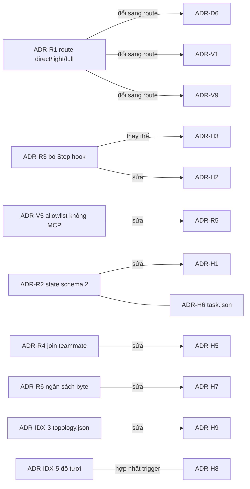

# ClaudeHut v0.12.0 — Nhật ký quyết định (ADR)

Phiên bản: 0.12.0-draft · Ngày: 2026-09-29 · Trạng thái: Đề xuất

## Tóm tắt

Tệp này ghi 42 quyết định của v0.12.0: ADR-R1..R7, ADR-H1..H10, ADR-D1..D7, ADR-IDX-1..8, ADR-V1..V10. Quyết định xuyên vùng trong [03-architecture.md](03-architecture.md) thắng thiết kế vùng. Mã audit tra trong [01-audit.md](01-audit.md), nguồn trong [02-research.md](02-research.md).

Trạng thái: **Đề xuất** = giữ thiết kế vùng; **Đã sửa** = chỉnh theo quyết định xuyên vùng (phần chỉnh nằm trong ô Quyết định); **Thay thế** = hết hiệu lực (ADR-H3, vì Stop hook bị xoá).

## Chỉ mục

| Nhóm | File | Trạng thái theo ADR |
|---|---|---|
| [Routing và harness](#routing-và-harness) | [04](04-routing-harness.md) | R1, R7 Đề xuất; R2–R6 Đã sửa |
| [Hook](#hook) | [05](05-hooks.md) | H1–H2, H5–H9 Đã sửa; H3 Thay thế; H4, H10 Đề xuất |
| [Tài liệu](#tài-liệu) | [06](06-artifact-standards.md) | D1, D3, D4, D7 Đề xuất; D2, D5, D6 Đã sửa |
| [Index và memory](#index-và-memory) | [07](07-index-memory.md) | IDX-1, IDX-4, IDX-7, IDX-8 Đề xuất; IDX-2, IDX-3, IDX-5, IDX-6 Đã sửa |
| [Review](#review) | [08](08-review.md) | V1, V2, V9 Đã sửa; V3–V8, V10 Đề xuất |

## Routing và harness

### ADR-R1 — Router ba tuyến ở main thread

| Trạng thái | Đề xuất |
|---|---|
| Bối cảnh | Model chọn full 61/75 lần; '1% rule' và gate đếm file đẩy lên full (A1, A3, A4). |
| Quyết định | Main thread phân `direct \| light \| full` theo độ rõ ý định và rủi ro ngữ nghĩa. Hai tuyến kề nhau → một AskUserQuestion. Leo thang tự do, hạ tuyến phải hỏi. |
| Phương án loại bỏ | Classifier trong hook (lặp A2); 'in doubt take heavier' (lặp A3). |
| Hệ quả | Ít task full; task xếp thấp được bù bằng leo thang và Review. |
| Bằng chứng | A10; [best-practices](https://code.claude.com/docs/en/best-practices) |

### ADR-R2 — State theo task, schema 2

| Trạng thái | Đã sửa |
|---|---|
| Bối cảnh | State bị arm mọi phiên (A9, B2), rò giữa task (A6, B4), 14 file còn bypass=true (B6). |
| Quyết định | `state/<sid>.json`{schema:2, active_task}; direct không ghi state; `start` tạo `tasks/<id>/task.json` mới, task cũ superseded. Thiếu `schema:2` = không có task. Bỏ `set-bypass`, `set-complexity`, `mark-skill`, `pause`. Sid qua `CLAUDE_ENV_FILE`. |
| Phương án loại bỏ | Reset thêm trường (vẫn sót, B9). |
| Hệ quả | Hết false positive ngoài workflow; task dở v0.11 không resume được. |
| Bằng chứng | A5, B7; [hooks#sessionstart](https://code.claude.com/docs/en/hooks#sessionstart) |

### ADR-R3 — Không hook chặn; bỏ Stop hook

| Trạng thái | Đã sửa (thay thế ADR-H3) |
|---|---|
| Bối cảnh | Stop chặn lượt chờ subagent và checkpoint (A7, B3, F-5); 2 JSON gây fail-open (B1); deny bị lách qua Bash (B8). |
| Quyết định | Xoá Stop. `advise-write.sh` nhắc một lần khi route=full ∧ plan_approved=false ∧ path∈scope; dedupe bằng `state/<sid>.nudged`. Không decision/permissionDecision/updatedInput. |
| Phương án loại bỏ | Stop block hoặc systemMessage (chạy mọi lượt, B10). |
| Hệ quả | Mất cưỡng chế completion; kỷ luật chuyển vào skill tuyến full. |
| Bằng chứng | B10; [hooks#stop](https://code.claude.com/docs/en/hooks#stop-decision-control) |

### ADR-R4 — Lọc lượt máy sinh; join teammate

| Trạng thái | Đã sửa |
|---|---|
| Bối cảnh | 51% inject rơi vào lượt máy sinh (F-6); 61% dispatch có `name` (F-1, F-PA-1). |
| Quyết định | Dùng regex hợp `^\s*(<\\?(teammate-message\|task-notification\|agent-message)\|Another Claude session sent a message)`. Giữ PreToolUse `Agent` async và `lib/resolve-agent.sh`. Dispatch agent claudehut không kèm `name`. |
| Phương án loại bỏ | updatedInput xoá `name` (race); deny teammate. |
| Hệ quả | Prefix đổi thì chỉ gây inject thừa. |
| Bằng chứng | [hooks#subagentstart](https://code.claude.com/docs/en/hooks#subagentstart) |

### ADR-R5 — Năng lực động, không law đóng

| Trạng thái | Đã sửa (bề mặt tool theo ADR-V5) |
|---|---|
| Bối cảnh | Law chỉ biết skill ClaudeHut (F-3); lệnh UA không kèm năng lực (F-2); tên MCP gõ cứng (F-4, F-PA-2). |
| Quyết định | Digest chỉ nêu dữ kiện; chọn skill/agent/MCP qua description. Explorer `Read, Grep, Glob, Bash, LSP`, đọc graph bằng jq. Allowlist thay cho `disallowedTools`; bỏ spawn `claude plugin list`. |
| Phương án loại bỏ | Catalog tên MCP (lặp F-PA-2); `mcpServers` trong agent (bị bỏ qua). |
| Hệ quả | Chất lượng chọn công cụ phụ thuộc description của plugin khác. |
| Bằng chứng | [#80802](https://github.com/anthropics/claude-code/issues/80802) |

### ADR-R6 — Ngân sách context đo trên payload thực

| Trạng thái | Đã sửa |
|---|---|
| Bối cảnh | additionalContext median 8.999 B, lint chỉ đo thân skill (F-7, F-PA-4). |
| Quyết định | Đơn vị byte, `lint-prompt-length.sh --payload`: digest ≤2.500 B, ClaudeHut ≤4.000 B, index card ≤500 B. Router nằm trọn trong digest. |
| Phương án loại bỏ | Router trong rule always-on (cộng vào D1). |
| Hệ quả | CI bắt được context phình. |
| Bằng chứng | [hooks#json-output](https://code.claude.com/docs/en/hooks#json-output) |

### ADR-R7 — Ngôn ngữ phản hồi và artifact chọn khi init

| Trạng thái | Đề xuất (user chốt 2026-09-29) |
|---|---|
| Bối cảnh | Ngân sách tính trên corpus audit tiếng Anh (C2); tiếng Việt phình ~1,3–1,5× ([06 §10](06-artifact-standards.md#10-đơn-vị-ngôn-ngữ-và-ngân-sách)). Chưa có cấu hình nào nói agent phản hồi và viết artifact bằng ngôn ngữ nào. |
| Quyết định | `claudehut-init` hỏi Tiếng Việt hay English, ghi `language: "vi"\|"en"` vào `topology.json`; microservice: mặc định ở `hub/hub.json`, service kế thừa hoặc override; thiếu cả hai → `en`. `bootstrap.sh` inject đúng một dòng `Ngôn ngữ: vi — …`/`Language: en — …` (≤120 B, trong additionalContext ≤4.000 B). Main thread chép dòng này vào prompt dispatch. doclint giữ đơn vị từ, nhân 1,4 khi `vi`. |
| Phương án loại bỏ | Bắt buộc artifact tiếng Anh; đổi ngân sách sang byte; ghi vào `LANGUAGE.md` (đó là vocabulary lock). |
| Hệ quả | Identifier, code, lệnh, heading template giữ nguyên; hệ số 1,4 và ngân sách chốt sau `doclint-replay.sh` ở M3. |
| Bằng chứng | C2 (ngân sách theo từ); [04 §6](04-routing-harness.md#6-khám-phá-năng-lực-và-kết-hợp-plugin), [06 §10](06-artifact-standards.md#10-đơn-vị-ngôn-ngữ-và-ngân-sách), [07 §4.1](07-index-memory.md#41-init) |

## Hook

### ADR-H1 — Kích hoạt bằng task tường minh

| Trạng thái | Đã sửa |
|---|---|
| Bối cảnh | bootstrap arm mọi phiên nên nhánh fail-open của write gate không bao giờ chạy (B2 hiệu chỉnh); state rò giữa task (B4, A6). |
| Quyết định | Hook chỉ nhắc khi `start` (thay `start-task`) đã tạo task.json schema 2 và path khớp scope. Không có task thì chỉ quan sát. |
| Phương án loại bỏ | Hook tự phân loại prompt. |
| Hệ quả | Việc ngoài workflow không bị đụng. |
| Bằng chứng | A9; [plugins/components](https://code.claude.com/docs/en/plugins/components#when-plugin-hooks-fire) |

### ADR-H2 — Chỉ advisory, không strict

| Trạng thái | Đã sửa |
|---|---|
| Bối cảnh | 70 lệnh Bash vẫn ghi vào src/main (B8); bypass gây kẹt (A5, B6). |
| Quyết định | PreToolUse chỉ trả additionalContext. Gỡ `set-bypass`; bỏ `requires[]`, `pause` và phần Stop (ADR-R3). |
| Phương án loại bỏ | Strict opt-in (B8 phá bảo đảm); gate Bash phân tích heredoc. |
| Hệ quả | Phép kiểm độc lập với tool là Review; strict mode — Đã chốt (2026-09-29): không có. |
| Bằng chứng | [hooks-guide](https://code.claude.com/docs/en/hooks-guide#hooks-and-permission-modes) |

### ADR-H3 — Stop chỉ gửi systemMessage

| Trạng thái | Thay thế bởi ADR-R3 |
|---|---|
| Bối cảnh | Cap chạy sau 1 block (B3 hiệu chỉnh) nhưng lượt máy sinh vẫn bị chặn (F-5). |
| Quyết định | (Cũ) Stop thoát theo điều kiện, dedupe bằng sidecar, chỉ trả systemMessage. Không triển khai. |
| Phương án loại bỏ | Stop dùng additionalContext hoặc block (vẫn tốn lượt). |
| Hệ quả | Stop chạy mọi lượt (B10) nên bị xoá; task treo tự superseded khi `start` mới. Cần nhắc thì chỉ dùng systemMessage. |
| Bằng chứng | B10; [hooks#stop](https://code.claude.com/docs/en/hooks#stop-decision-control) |

### ADR-H4 — Tối đa một JSON, luôn exit 0

| Trạng thái | Đề xuất |
|---|---|
| Bối cảnh | gate-done.sh in 2 object, gây 356 'hook error' (B1). |
| Quyết định | `hook-common.sh`: trap EXIT in 0–1 object; lỗi thì ghi log, exit 0; không `set -e/-u`. CI: `jq -s 'length<=1'`. |
| Phương án loại bỏ | Vá `exit 0` cục bộ (B9). |
| Hệ quả | Hook hỏng thì im lặng, có log. |
| Bằng chứng | B9; [hooks#exit-code](https://code.claude.com/docs/en/hooks#exit-code-output) |

### ADR-H5 — Gỡ skill rail, PreCompact; SubagentStop chỉ ledger

| Trạng thái | Đã sửa |
|---|---|
| Bối cảnh | Rail chỉ nhận `implement` (F-3); record-skill gây lost update (B9). |
| Quyết định | Xoá UserPromptExpansion, PreToolUse Skill, PreCompact. Giữ PreToolUse `Agent` (ADR-R4). SubagentStop không matcher, guard agent_type rỗng. |
| Phương án loại bỏ | Matcher `^claudehut:…$` (rơi teammate, F-1). |
| Hệ quả | Cổng artifact dời vào CLI `set-*`. |
| Bằng chứng | F-1; [#87065](https://github.com/anthropics/claude-code/issues/87065) |

### ADR-H6 — task.json có base và pre_dirty theo repo

| Trạng thái | Đã sửa |
|---|---|
| Bối cảnh | Working tree bẩn làm sai phép đếm (A1, B5); sid lệch (B7). |
| Quyết định | task.json theo schema tích hợp, gồm `base{repo:sha}`, `pre_dirty{repo:[f]}`, scope. `resume <id>` gắn task vào phiên mới. Hook chỉ đọc. |
| Phương án loại bỏ | Một `base_sha` duy nhất (sai với task đa repo). |
| Hệ quả | File bẩn sẵn mà bị sửa trong task có thể lọt Review. |
| Bằng chứng | A6; [hooks#sessionstart](https://code.claude.com/docs/en/hooks#sessionstart) |

### ADR-H7 — Sống chung với hook plugin khác

| Trạng thái | Đã sửa |
|---|---|
| Bối cảnh | Hook chạy song song; với updatedInput, hook xong sau thắng; máy user có rtk, UA. |
| Quyết định | Không updatedInput/allow/deny/continue; matcher chính xác; `"${CLAUDE_PLUGIN_ROOT}"` có nháy; không ghi `.understand-anything/`. Ngân sách theo ADR-R6. |
| Phương án loại bỏ | Hook Bash bắt `git pull` (sót pull ở terminal). |
| Hệ quả | ClaudeHut không làm tươi graph UA. |
| Bằng chứng | F-2, F-7; [hooks-guide](https://code.claude.com/docs/en/hooks-guide#combine-results-from-multiple-hooks) |

### ADR-H8 — SessionStart sync/async; so HEAD

| Trạng thái | Đã sửa |
|---|---|
| Bối cảnh | `claude plugin list` tốn 1–5 s (B10); context lớn (F-7). |
| Quyết định | `bootstrap.sh` sync; `maintain.sh` async. Bỏ handler `index-refresh.sh`; `inject-phase.sh` so HEAD, lệch thì tách update nền. |
| Phương án loại bỏ | FileChanged trên `.git/HEAD` (chưa nghiên cứu). |
| Hệ quả | Update phải idempotent. |
| Bằng chứng | [hooks#background](https://code.claude.com/docs/en/hooks#run-hooks-in-the-background) |

### ADR-H9 — Phân giải plane không walk ngược

| Trạng thái | Đã sửa (theo ADR-IDX-3) |
|---|---|
| Bối cảnh | Hook cũ không thấy hub đặt ngoài repo. |
| Quyết định | `hc_plane_or_exit` đọc plane cục bộ rồi `topology.json.hub`, override bằng `CLAUDEHUT_HUB`. Bỏ `.claude/claudehut.link`. |
| Phương án loại bỏ | Walk ngược (tốn, dễ nhận nhầm workspace). |
| Hệ quả | Init phải ghi `topology.json`. |
| Bằng chứng | B10; [plugins/components](https://code.claude.com/docs/en/plugins/components#when-plugin-hooks-fire) |

### ADR-H10 — Giữ `bin/` ở gốc plugin

| Trạng thái | Đề xuất |
|---|---|
| Bối cảnh | `bin/` vào PATH của Bash nhưng chặn cài qua Cowork; comment `bootstrap.sh:106` sai (B7). |
| Quyết định | Giữ `bin/`, sửa comment. |
| Phương án loại bỏ | Dời sang `libexec/` (mất PATH). |
| Hệ quả | Cần Cowork thì phải sửa mọi tham chiếu CLI. |
| Bằng chứng | [plugins-reference](https://code.claude.com/docs/en/plugins-reference) |

## Tài liệu

### ADR-D1 — Template là schema; doclint

| Trạng thái | Đề xuất |
|---|---|
| Bối cảnh | Ngân sách chỉ là lời văn, gate chỉ grep sự có mặt (C1, C2). |
| Quyết định | `scripts/doclint.sh` đọc khối `<!-- ch:schema -->`. Luật cấu trúc chặn ở `set-*` (chỉ chạy trong task đã opt-in); ngân sách chỉ đo và hiển thị. |
| Phương án loại bỏ | Chặn theo ngân sách (số không có nguồn); chỉ dựa vào reviewer (60/60 ✓). |
| Hệ quả | Một nguồn sự thật; ngân sách vẫn có thể bị vượt. |
| Bằng chứng | [Gherkin](https://cucumber.io/docs/gherkin/reference/) |

### ADR-D2 — Quyết định trong spec; brainstorm tuỳ chọn

| Trạng thái | Đã sửa (route) |
|---|---|
| Bối cảnh | Brainstorm bắt buộc, không có trần, lặp spec (C7). |
| Quyết định | Mỗi quyết định là một dòng bảng Decisions (Y-statement). Chỉ dispatch brainstormer khi route full có ≥2 cơ chế khả thi chưa giải. |
| Phương án loại bỏ | Giữ bắt buộc; bỏ hẳn. |
| Hệ quả | Phải sửa chuỗi REQUIRED-NEXT. |
| Bằng chứng | [adr-templates](https://adr.github.io/adr-templates/) |

### ADR-D3 — Plan không chứa Java/Kotlin

| Trạng thái | Đề xuất |
|---|---|
| Bối cảnh | ~41–43% dòng plan là code, lỗi thời sau rebase (C4, C5). |
| Quyết định | Cấm fence java/kotlin; fence khác ≤12 dòng; hình dạng đưa vào bảng Interfaces & Data và Mermaid. |
| Phương án loại bỏ | Sketch có trần số dòng; cấm mọi fence. |
| Hệ quả | Plan ngắn; một phần chi tiết dời sang implement. |
| Bằng chứng | [spec-kit plan](https://github.com/github/spec-kit/blob/main/templates/commands/plan.md) |

### ADR-D4 — Sửa tại chỗ, `rev`, supersede

| Trạng thái | Đề xuất |
|---|---|
| Bối cảnh | Agent nối AMENDMENT, header mâu thuẫn với thân (C3). |
| Quyết định | Sửa tại chỗ, tăng `rev`, có Changelog; Decision giữ ID, ghi `superseded-by`. Plan ghim `spec-rev`. |
| Phương án loại bỏ | ADR riêng cho mọi quyết định; `spec-v2.md`. |
| Hệ quả | Lịch sử chi tiết chỉ còn trong git. |
| Bằng chứng | [Cognitect](https://www.cognitect.com/blog/2011/11/15/documenting-architecture-decisions) |

### ADR-D5 — plan-review một người ghi, cap 2 vòng

| Trạng thái | Đã sửa (round trong task.json) |
|---|---|
| Bối cảnh | 18/118 file có ≥2 verdict; cap chỉ nằm trong prose (C6 hiệu chỉnh). |
| Quyết định | plan-reviewer là người ghi duy nhất, đúng một `Verdict:`. REVISE ở round 2 → capped, cần `--user-decision`. Coverage do doclint L10 kiểm. |
| Phương án loại bỏ | Stamp hash qua SubagentStop; cap 3 vòng. |
| Hệ quả | Không chống được `--user-decision` giả. |
| Bằng chứng | [prompting Opus 5](https://platform.claude.com/docs/en/build-with-claude/prompt-engineering/prompting-claude-opus-5) |

### ADR-D6 — Right-size theo profile × route

| Trạng thái | Đã sửa (đổi sang route) |
|---|---|
| Bối cảnh | `type:` không bắt buộc, bugfix vẫn 12 section (C8). |
| Quyết định | Header `profile:` và `route:` (chặn). Light chỉ có `task.md` 600 từ. Audit/investigation là direct (A10). Ngân sách khởi điểm là advisory. |
| Phương án loại bỏ | Không giới hạn (C2); một ngân sách chung. |
| Hệ quả | Ngưỡng phải chốt sau replay (M3). |
| Bằng chứng | C2, A10; [spec-kit specify](https://github.com/github/spec-kit/blob/main/templates/commands/specify.md) |

### ADR-D7 — EARS + GWT cùng dòng

| Trạng thái | Đề xuất |
|---|---|
| Bối cảnh | FR và AC tách rời gây lặp (C8). |
| Quyết định | Bảng `AC-xxx` \| EARS \| GWT 3–5 bước. |
| Phương án loại bỏ | Chỉ EARS; chỉ GWT. |
| Hệ quả | Ô dài hơn. |
| Bằng chứng | [EARS](https://alistairmavin.com/ears/) |

## Index và memory

### ADR-IDX-1 — Index do script tất định sinh

| Trạng thái | Đề xuất |
|---|---|
| Bối cảnh | reuse-index do LLM ghi, chỉ 24/43 path hợp lệ (D7); ít được đọc (D3); graph UA lệch schema (D4). |
| Quyết định | Regex tất định (python3 stdlib), đóng dấu commit. reuse-index cũ chỉ đọc. |
| Phương án loại bỏ | LLM kèm validator; tree-sitter/SCIP; graph UA. |
| Hệ quả | Phải bảo trì regex. |
| Bằng chứng | D2; [aider](https://aider.chat/docs/repomap.html) |

### ADR-IDX-2 — CLI chỉ đọc; brief dán vào prompt

| Trạng thái | Đã sửa (tool list) |
|---|---|
| Bối cảnh | Explorer không có Skill (D4); teammate bỏ qua frontmatter (F-1). |
| Quyết định | `claudehut-index status\|brief\|find\|svc\|links` gọi qua đường dẫn tuyệt đối. Discover dán `brief` vào prompt. Explorer, reuse-scanner thêm LSP. |
| Phương án loại bỏ | MCP cấp plugin (lặp F-4). |
| Hệ quả | Thiếu python3 → `unavailable`. |
| Bằng chứng | D3, F-4; [large-codebases](https://code.claude.com/docs/en/large-codebases) |

### ADR-IDX-3 — Plane từng service + hub

| Trạng thái | Đã sửa (topology.json) |
|---|---|
| Bối cảnh | 575 lần đọc chéo service (D8); root plane chỉ được nạp một phần (D9). |
| Quyết định | Init hỏi mode, vị trí hub, ghi `topology.json`. Hub gộp `service-links.json`, mỗi cạnh có evidence và confidence. |
| Phương án loại bỏ | Gộp graph UA (không có cạnh HTTP/Kafka). |
| Hệ quả | Hub đặt ở root thì không chia sẻ được. |
| Bằng chứng | [UA](https://github.com/Egonex-AI/Understand-Anything) |

### ADR-IDX-4 — Graph hub theo schema UA

| Trạng thái | Đề xuất |
|---|---|
| Bối cảnh | User muốn xem hub qua UI; dashboard UA đọc một `GRAPH_DIR`. |
| Quyết định | Ghi `hub/.understand-anything/knowledge-graph.json` đủ field zod. Không ghi graph của repo hay root. |
| Phương án loại bỏ | Tự viết dashboard; ghi đè graph root. |
| Hệ quả | Eval kiểm HTTP 200 (M6). |
| Bằng chứng | D8, F-2; [UA](https://github.com/Egonex-AI/Understand-Anything) |

### ADR-IDX-5 — Độ tươi theo commit, cập nhật nền

| Trạng thái | Đã sửa (bốn trigger) |
|---|---|
| Bối cảnh | Không có cơ chế làm mới gắn với git (D2). |
| Quyết định | `indexed_commit` ghi sau cùng. Trigger: `maintain.sh`, so HEAD ở `inject-phase.sh`, banner `brief/svc`, git hook opt-in. Bỏ PostToolUse Bash. |
| Phương án loại bỏ | Watcher thường trú; update đồng bộ. |
| Hệ quả | Không có git hook vẫn có lưới an toàn. |
| Bằng chứng | [githooks](https://git-scm.com/docs/githooks) |

### ADR-IDX-6 — MEMORY.md máy sinh; learnings có schema

| Trạng thái | Đã sửa (migrate async) |
|---|---|
| Bối cảnh | MEMORY.md 105.333 B (D1); 40 learning rỗng (D5); dedup chính xác không bao giờ khớp (D6). |
| Quyết định | `claudehut-index memory` sinh ≤2 KB; migrate trong `maintain.sh`. Dedup Jaccard ≥0,5. |
| Phương án loại bỏ | Chỉ cảnh báo (D1); embedding. |
| Hệ quả | Merge mờ có thể gộp nhầm. |
| Bằng chứng | [memory](https://code.claude.com/docs/en/memory) |

### ADR-IDX-7 — Chống vòng khám phá

| Trạng thái | Đề xuất |
|---|---|
| Bối cảnh | ~23 call mỗi lần chạy explorer (347/15; tính cả reuse-scanner là 691/22 ≈ 31), một phần là REFUTE hợp lệ (D3); đọc chéo service (D8). |
| Quyết định | Brief trong prompt; `context.md` làm cache; `hint-explore.sh` báo một fact, chỉ ở mode microservice. |
| Phương án loại bỏ | Deny sau N lần Grep. |
| Hệ quả | Không có rủi ro treo phiên. |
| Bằng chứng | [hooks#posttooluse](https://code.claude.com/docs/en/hooks#posttooluse-decision-control) |

### ADR-IDX-8 — Chia sẻ plane có hỏi

| Trạng thái | Đề xuất |
|---|---|
| Bối cảnh | Trạng thái ignore khác nhau giữa các repo (D10). |
| Quyết định | `git check-ignore -v` rồi hỏi; in patch `.claude/*` để user tự áp dụng. |
| Phương án loại bỏ | Tự sửa `.gitignore`; commit index. |
| Hệ quả | Chỉ chia sẻ khi user chọn. |
| Bằng chứng | D10 (không có nguồn ngoài) |

## Review

### ADR-V1 — Lane do script chọn

| Trạng thái | Đã sửa (route, base) |
|---|---|
| Bối cảnh | Bảng chọn văn xuôi nghiêng về 'cứ chạy' ở full (E1 hiệu chỉnh); file untracked lọt vào tín hiệu (E2). |
| Quyết định | `review-pack.sh` tính lane từ path, hunk, prefix enforcement và `.route`. Light: reviewer; full: reviewer + test-runner + lane có tín hiệu; direct không review trừ khi user yêu cầu. Main thêm/bớt lane, mỗi thay đổi một dòng lý do. |
| Phương án loại bỏ | Chỉ sửa văn xuôi (MUST bị bỏ qua, E4); hook chặn dispatch lệch (trái advisory). |
| Hệ quả | Thêm script có fixture; false negative bù bằng escalate và override. |
| Bằng chứng | E4; [Claude code review](https://claude.com/blog/code-review) |

### ADR-V2 — Mỗi lane một pack ghim SHA

| Trạng thái | Đã sửa (BASE) |
|---|---|
| Bối cảnh | Chỉ 2/54 prompt auditor typed có hunk (4/183 trên mọi prompt, E4); auditor tự chạy `git diff`, có lần trên HEAD đã dịch (E4, E5). |
| Quyết định | Có active_task: BASE=`task.base[repo]`, loại `pre_dirty`; không có: merge-base. Mỗi lane một pack ≤1.500 dòng, header ghim base_sha + reviewed_tree. |
| Phương án loại bỏ | Paste hunk vào prompt (tốn output của main); pack chung (vượt giới hạn Read). |
| Hệ quả | Mỗi auditor tốn một Read cho context. |
| Bằng chứng | A1, B5; [writing tools](https://www.anthropic.com/engineering/writing-tools-for-agents) |

### ADR-V3 — Roster 7→5, giữ tên

| Trạng thái | Đề xuất |
|---|---|
| Bối cảnh | db↔perf, contract↔observability trùng trigger và tập file (E3); `ewallet-query-audit` gọi `db-reviewer`/`test-runner`. |
| Quyết định | Còn reviewer, security-auditor, db-reviewer (gộp perf), contract-reviewer (gộp observability), test-runner. Alias `perf`/`observability` chỉ trong `$ARGUMENTS` của skill review. |
| Phương án loại bỏ | Đổi tên thành data/integration-reviewer (gãy consumer); giữ 7 agent. |
| Hệ quả | Thân agent gộp phải vừa lint ≤100 dòng/6.800 B. |
| Bằng chứng | E1; [sub-agents](https://code.claude.com/docs/en/sub-agents) |

### ADR-V4 — Model/effort theo lane; bỏ ultrathink

| Trạng thái | Đề xuất |
|---|---|
| Bối cảnh | security opus/xhigh, ultrathink trong 41/54 prompt, không có maxTurns (E4, E7 hiệu chỉnh). |
| Quyết định | reviewer opus/medium; security opus/high; db/contract sonnet/medium; test-runner haiku/low. maxTurns 40 (test-runner 20). Không truyền `model` khi dispatch. |
| Phương án loại bỏ | Giữ xhigh (dễ overthinking); maxTurns 20–25 (cắt lần chạy bình thường). |
| Hệ quả | Có thể giảm recall; nâng lại bằng một dòng frontmatter. |
| Bằng chứng | [model-config](https://code.claude.com/docs/en/model-config) |

### ADR-V5 — Allowlist hẹp, không MCP

| Trạng thái | Đề xuất (tích hợp chọn, sửa ADR-R5) |
|---|---|
| Bối cảnh | Tên MCP sai nên live-schema không chạy (E6); db thiếu Bash (E5); phiên thật có MCP phá huỷ (`delete_repository`, `push_files`). |
| Quyết định | Auditor `tools: Read, Grep, Glob, Bash` (test-runner `Bash, Read, Grep`), không `mcp__*`. Cần schema/EXPLAIN thì ghi `Suspected` kèm truy vấn đọc; main chạy qua permission system. |
| Phương án loại bỏ | `disallowedTools` để kế thừa MCP (wildcard chưa kiểm chứng); `mcpServers` ở plugin agent (bị bỏ qua). |
| Hệ quả | Auditor chỉ review tĩnh; kế thừa MCP opt-in — Đã chốt (2026-09-29): không có trong v0.12. |
| Bằng chứng | F-4; [plugins/components](https://code.claude.com/docs/en/plugins/components) |

### ADR-V6 — Output findings-first

| Trạng thái | Đề xuất |
|---|---|
| Bối cảnh | `review-rigor.md:24` buộc hàng coverage cho mọi item (E3); output 19–31k token mỗi auditor (E7). |
| Quyết định | Thứ tự: Findings → Suspected ≤3 → Coverage (item của lane, reviewer thêm hàng floor) → escalate → Verdict. Tối đa 5 LOW. |
| Phương án loại bỏ | Bỏ coverage (gate `set-review` từ chối); chấm confidence 0–100. |
| Hệ quả | Output ước tính ≤8k token; gate hiện có không đổi. |
| Bằng chứng | [code-review](https://code.claude.com/docs/en/code-review) |

### ADR-V7 — Main dedup và kiểm chứng

| Trạng thái | Đề xuất |
|---|---|
| Bối cảnh | Finding lặp giữa các auditor (E3); một CRITICAL ngoài diff ở core-ledger 0007 (E2 hiệu chỉnh). |
| Quyết định | Dedup theo (file, ±3 dòng, lớp lỗi); main mở file:line cho CRITICAL/HIGH. `pre-existing` chỉ gắn khi lỗi có ở base_sha, không chặn; nếu CRITICAL thì hỏi user. Tie-break: một reviewer mode=verify. |
| Phương án loại bỏ | Validator cho mỗi issue hoặc panel 3 verifier (N–3N call). |
| Hệ quả | Main tốn vài Read cho mỗi finding chặn. |
| Bằng chứng | [best-practices](https://code.claude.com/docs/en/best-practices) |

### ADR-V8 — Round 2 tất định, tối đa 2 round

| Trạng thái | Đề xuất |
|---|---|
| Bối cảnh | Cạnh `fix --> fan` mâu thuẫn với văn xuôi, không có state ghi lane đã PASS (E8 hiệu chỉnh). |
| Quyết định | `review-pack.sh --round 2 --carry-lanes …`: lane còn ✗ ∪ lane bị fix-diff chạm. Sang round 3 → `set-review capped`. |
| Phương án loại bỏ | Thêm `lanes_passed` vào state (trùng header pack); chạy lại mọi lane. |
| Hệ quả | Vẫn đúng khi fix chưa commit. |
| Bằng chứng | [multi-agent research](https://www.anthropic.com/engineering/multi-agent-research-system) |

### ADR-V9 — Một nguồn test mỗi route

| Trạng thái | Đã sửa (đổi sang route) |
|---|---|
| Bối cảnh | reviewer chạy test 6/18 lần; trùng thật chỉ khi test-runner chạy song song (E9 hiệu chỉnh). |
| Quyết định | Full: test-runner là nguồn duy nhất, reviewer không build/test. Light: test fold vào reviewer. Direct: không review trừ khi user yêu cầu. |
| Phương án loại bỏ | Luôn dispatch test-runner (không có bằng chứng lợi ích). |
| Hệ quả | Hết build trùng và tranh lock `build/`. |
| Bằng chứng | [costs](https://code.claude.com/docs/en/costs) |

### ADR-V10 — Reviewer plugin khác là lane opt-in

| Trạng thái | Đề xuất |
|---|---|
| Bối cảnh | Roster cố định, không có chỗ cho reviewer ngoài (F-8). |
| Quyết định | Main dispatch agent/skill ngoài cho mục `uncovered` hoặc theo yêu cầu user; findings vào lane `ext:<tên>`, qua dedup/verify. Không có lane ngoài mặc định. |
| Phương án loại bỏ | Externalize toàn bộ review. |
| Hệ quả | Chất lượng lane ngoài phụ thuộc plugin đó. |
| Bằng chứng | [#80802](https://github.com/anthropics/claude-code/issues/80802) |

Triển khai và eval: [10-rollout-eval.md](10-rollout-eval.md) · Mục lục: [README.md](README.md)
