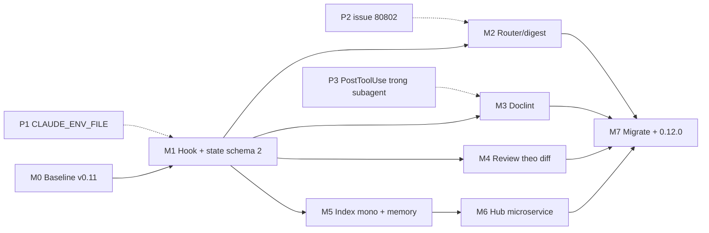
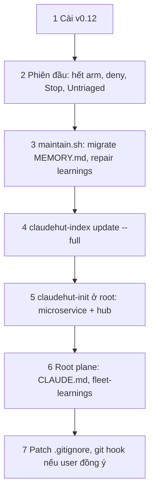

# Rollout, migration và đánh giá

Phiên bản: 0.12.0-draft · Ngày: 2026-09-29 · Trạng thái: Đề xuất

## Tóm tắt

v0.12 được phát hành qua tám milestone M0–M7, mỗi milestone có tiêu chí verify chạy được bằng script trong `evals/`. M0 đo baseline trên v0.11 mà không đổi hành vi; M7 chạy lại đúng bộ đo đó trên v0.12 để so sánh. Ba probe runtime chạy cuối M0, trước M1/M2. Migration ewallet-workspace không có script chuyển state: file thiếu `schema:2` bị coi là không có task. Kiến trúc đích xem [03-architecture.md](03-architecture.md), quyết định xem [09-adr.md](09-adr.md).

## 1. Milestone

| M | Phạm vi | Phụ thuộc | Tiêu chí verify | Script eval |
|---|---|---|---|---|
| M0 · Baseline v0.11 | Thêm `lint-prompt-length.sh --payload`, `evals/review-cost.sh`, ~20 router case ewallet có nhãn tuyến; lưu vào `evals/results/baseline-v011/` | — | Khớp audit: SessionStart median ≈8.999 B (F-7), 28/52 đợt ≥4 agent (E1), full 61/75 (A3); `conformance.sh`, `gate-tests.sh` xanh | `lint-prompt-length.sh`, `review-cost.sh`, `trigger-eval.sh` |
| M1 · Hook advisory + state schema 2 | `hook-common.sh`, `claudehut-state` schema 2, bootstrap bỏ arm/`claude plugin list`, `maintain.sh` async, gỡ Stop/gate-done/record-skill*: [05-hooks.md](05-hooks.md), [04-routing-harness.md](04-routing-harness.md) | M0 | Mọi hook × case (kể cả tiêm lỗi): `jq -s 'length<=1'`, exit 0, 0 `decision`/`permissionDecision`/`updatedInput`. Replay core-ledger 2e70d1d8, report-service 652fab55 → stdout rỗng (A1, A9). Độ trễ: [§5](#5-kế-hoạch-eval). **Hoãn khỏi M1 (ghi rõ):** AC11 của [05](05-hooks.md#11-tiêu-chí-chấp-nhận), `hc_head` và fact so HEAD ở `inject-phase` → M5, vì cần `indexed_commit` của index; AC13 (payload SessionStart ≤4.000 B) → M2 cùng digest; `hint-explore.sh` (#9) → M6, vì predicate của nó cần mode=microservice và biết path thuộc service nào, cả hai chỉ có khi `claudehut-init --mode/--hub` của M6 tồn tại; tác dụng phụ của `maintain.sh` → `claudehut-init --refresh-rules` trên plane chưa init (thêm @import vào CLAUDE.md, sửa `.gitignore`, `.worktreeinclude`, `settings.json`) → M5, nơi init/topology được viết lại, vì hành vi này có từ v0.11 chứ không do M1 sinh ra; `evals/tasks/shortcut-attempt` (đánh dấu STALE, oracle quan sát write gate đã bỏ) → M2; câu "write gate" còn sót trong frontmatter `description` của `discover` → M2, vì fixture trigger-eval ghim nguyên văn description và chỉ refresh fixture M2 mới chạy lại model arm; AC12 (độ trễ) thành benchmark `hook-bench.sh` không gate, strict là opt-in (xem [§5](#5-kế-hoạch-eval)) | `hook-tests.sh` (thay `gate-tests.sh`; `--fast` chỉ hợp đồng + hành vi), `hook-bench.sh` (báo cáo), `bootstrap-acceptance.sh`, `conformance.sh`, `claude plugin validate` |
| M2 · Router, digest, harness | `digest.md` ≤2.500 B với ba tuyến; description dạng "Use when…" (gồm câu "write gate" còn sót trong description của `discover`, M1 giữ nguyên vì fixture trigger-eval ghim nó); tool cho explorer; refresh fixture trigger-eval | M1 | Bất biến tuyến ở [§5](#5-kế-hoạch-eval); "skip workflow claudehut" (va-ms 09a5aa8a) không sinh `start`. **Hoãn khỏi M2 (ghi rõ):** roster MCP của agent reviewer (db-reviewer, perf-reviewer, security-auditor còn khai `mcp__*`) → M4 cùng roster 7→5; dòng task tiếng Việt cứng trong bootstrap và việc đo index card ≤500 B bằng `--payload` → M5 cùng dòng ngôn ngữ ADR-R7 và card; xoá các verb legacy no-op (`set-bypass`, `mark-skill`, `pause`, `rename`, `route`, `set-complexity`) → M7; hiệu chỉnh `CPU_CEIL` cho Linux (`evals/lib/hook-latency.py`, ubuntu-latest) → backlog; làm tươi `router-cases.jsonl` đã lệch khỏi cây va-ms hiện tại (rc-09, rc-15, rc-16, rc-17, rc-21) → M3, trước lần eval live kế tiếp. `set-profile` được giữ là verb sống, xem quyết định M2 ở [04 §3](04-routing-harness.md#3-state-theo-task-schema-2) | `trigger-eval.sh`, `lint-prompt-length.sh` |
| M3 · Chuẩn tài liệu + doclint | `doclint.sh`, template mới, gate trong `set-*`, `plan_review_round`, `doclint-advise.sh`: [06-artifact-standards.md](06-artifact-standards.md) | M1 | Replay 244 task dir bắt va-ms 0008 (L4), AMENDMENT va-ms 0024 (L2), ô 2.685 ký tự party-ms 0002 (L6); rồi chốt ngân sách. **Trạng thái M3 (2026-09-30):** replay PASS cả ba mục tiêu, ngân sách giữ con số khởi điểm ([06 §10](06-artifact-standards.md#10-đơn-vị-ngôn-ngữ-và-ngân-sách)); `router-cases.jsonl` rc-09/15/16/17/21 đã làm tươi rationale (nhãn giữ nguyên); template, skill brainstorm/write-spec/write-plan và agent brainstormer/planner/plan-reviewer không còn tier/1% rule/Iron Law/NEVER. **Hoãn khỏi M3 (ghi rõ):** description của `brainstorm`/`write-spec` còn nhắc enforcement set/manifest vì fixture trigger-eval ghim nguyên văn → lần refresh model arm kế tiếp; khối `Index brief` của `context.md` ghi `n/a — index not built` → M5; `doclint-replay.sh` chỉ chạy tay vì cần corpus ewallet cục bộ (`doclint-tests.sh` đã chạy trong `hook-tests.sh`, tức CI); `ultrathink` còn trong `skills/implement`, agent `claudehut-implementer` và `review-rigor` → M4 (implement/review, ngoài phạm vi M3). **Chấp nhận (không sửa):** `set-plan` bị doclint từ chối không xoá `plan_approved=true` của lần duyệt trước. Đúng với spec: `set-plan` chỉ đặt `plan_approved` khi thành công ([04 §3](04-routing-harness.md)); lệnh bị từ chối thoát trước khi ghi state (`doclint_gate` chạy trước `tset` trong `bin/claudehut-state`), còn `set-plan` thành công kế tiếp ghi lại cờ. Cờ cũ chỉ làm `advise-write` bớt nhắc (advisory, M1), không mở khoá gate nào | `doclint.sh --self-test`, `doclint-replay.sh`, `artifact-oracle-tests.sh` |
| M4 · Review theo diff | `review-pack.sh`, roster 7→5, frontmatter effort/maxTurns, bỏ `mcp__*`: [08-review.md](08-review.md) | M1 | Replay mẫu phân tầng ~20 task đạt mục tiêu fan-out/recall ở [§5](#5-kế-hoạch-eval); `ewallet-query-audit` vẫn dispatch db-reviewer/test-runner. **Trạng thái M4 (2026-10-01):** `review-pack.sh` + `evals/regress/review-pack-tests.sh` (chạy trong `hook-tests.sh`, mutant tắt); roster còn 5 agent review, 12 agent tổng, 0 `mcp__`/`ultrathink` trong agent review, `implement` và `claudehut-implementer`; `ewallet-query-audit` vẫn gọi được db-reviewer/test-runner/reviewer theo tên. Replay (`evals/review-replay.sh`, chỉ đọc repo ewallet; không file nào dưới `.git` bị ghi). Đo lần đầu trên 5 task với enforcement prefix bật lane: 25 → 25 lượt dispatch, 5/5 task ≥4 lane; core-ledger 0007 (9 file/158 dòng, không LARGE) bị enforcement set 18 item đẩy từ 3 lên 5 lane. **Đã chốt (2026-10-01, user quyết định):** phương án (a) — enforcement prefix chỉ định tuyến item vào pack và hiện trong `hints`, không bật lane ([08 §3.2](08-review.md#32-tín-hiệu--lane)); đo lại trên mẫu phân tầng; mục tiêu ≤25% tính trên mọi đợt, diff lớn tuyến full được ≥4 lane. **Đo lại (2026-10-01), 22 task, chạy lại sau khi thêm tín hiệu `kafka-config`** (5 cũ + 17 mới; cách chọn, ngưỡng tầng và task bị loại ở header script; tầng gán sau từ file/dòng của pack, không theo quota): đợt ≥4 lane v0.11 10/22 (45,5%) → selector 5/22 (22,7%); dispatch 81 → 67 (PO 0004 thêm lane contract). Mọi task lớn ≥4 lane, mọi task nhỏ/vừa <4, nên 22,7% chỉ là tỉ lệ task lớn của mẫu (thêm một task lớn là 6/23 = 26,1%). Theo tầng: nhỏ (≤3 file, ≤150 dòng) n=2: 1/2 → 0/2, dispatch 5 → 3; vừa n=15: 5/15 → 0/15, 51 → 41; lớn (`large`: >1500 dòng hoặc >30 file) n=5: 4/5 → 5/5, 25 → 23 (được phép; va-ms 0008 tăng 2 → 5). Tuyến light n=3: 0/3 → 0/3, nhưng dispatch **tăng** 2 → 5 (party 0016 0 → 2, va 0033 0 → 1): selector luôn dispatch reviewer, còn review main-thread của v0.11 không dispatch gì — chấp nhận như chi phí sàn, không phải lỗi. Full n=19: 10/19 → 5/19, 79 → 62. **Chiếu lên khung 52 đợt** (`review-replay.sh --frame` trên output `review-cost.sh --json`; mỗi đợt ghép với commit đầu tiên sau giờ bắt đầu, đợt cùng commit sau đợt đầu tính là round 2+; proxy khớp 12/13 đợt có task trong manifest, lệch PO 0001 — proxy 1 file, task thật lớn): đợt trên diff lớn round 1 11/52 (21,2%; 12/52 = 23,1% nếu sửa PO 0001) là cận dưới, mọi đợt trên diff lớn 17/52 (32,7%; 18/52 = 34,6%) là cận trên. Cận dưới 21,2–23,1% cũng chỉ gần đúng: commit gộp nhiều task có thể xếp đợt round 1 của task khác vào round 2+ (vd. nhóm va `c5a25e7` 140 file, PG `784aad6`, party `fbff8a52`), nên biên tới 25% chỉ còn một đợt (13/52 = 25,0%); hành vi round 2 trên diff lớn chưa đo; commit gộp làm cận trên bị thổi phồng. Chấp nhận có điều kiện (main session, 2026-10-01): ≤25% chưa chứng minh; dải chiếu 21–33% trên khung 52 đợt; đo lại trên đợt thật sau khi phát hành (M7 eval). Recall MED+ trong phạm vi diff (72; 9 out-of-diff để riêng), sau hướng (a) với replay gán nhóm **theo file**: lane 15 · sàn reviewer 38 · chỉ-escalate 19 (4 lane không chạy, 15 lane chạy một phần) → lane hoặc sàn 73,6% (thông tin, phân loại thủ công ±1–2 mỗi nhóm; AC10 không đặt ngưỡng cho số này). Giảm so với 86,1% (lần đo trước) và 94,4% (sau `kafka-config`, vẫn gán theo lane) vì đổi cách đo, không phải selector kém đi: finding chỉ tính "lane" khi file của nó nằm trong pack của lane (không nằm trong `partial[].uncovered`). File lấy từ `file` trong `replay.json` (điền tay từ review.md và diff chỉ đọc, 13 finding: CON-9 → `VaLedgerCommandConsumerConfig.java` thay vì `spec.md`; OBS-1/2, OBS-3, CON-3, GEN-F2 → `VaRefundSagaOrchestrator.java`; OBS-4 → `VaRefundSagaEvent.java`; F-4 → `VaService.java`; F-7 → V23; 0013 #1/#2 → `Bc02TtTransactionStatsQuery.java`; 0031 V26-LOCK/V26-VER → V26, IDX-2 → `WebhookDeliveryRepository.java`; party 0021 IDX → `MerchantAmlCaseMonitorHandler.java`), nếu không thì `locus`; 1 finding lane không có file (0031 PACT, pre-existing toàn repo); `VaRefundPhase` (CON-3) nằm ở SDK, ngoài range, nên CON-3 gắn vào guard trong orchestrator. OBS-3 (`ignoreLateFailure`) chỉ xuất hiện ở commit sửa `dcd175c` sau range; theo file nó vẫn rơi vào orchestrator. "Tính cả escalate 100%" đúng theo cách dựng: mọi finding rơi vào lane, sàn hoặc escalate, và sàn đúng theo định nghĩa vì reviewer luôn chạy — không phải phép đo. Phần đo được là fixture: 19/19 ca chỉ-escalate có fixture trong `evals/tasks/review-pack/cases/` (trường `covers`, nay nhận chuỗi hoặc mảng; replay in "escalate-only without a fixture: none"). Lane không chạy: va-ms 0020 F-8 (`prod-id-in-test`), core-ledger 0005 SEC-1, 0006 DEFER-1, 0008 FIX-1. Lane chạy một phần: payment-orchestrator 0004 OBS-1/2, OBS-3, OBS-4, CON-3, GEN-F2 (năm fixture `esc-po0004-*`, nay có thêm `VaLedgerCommandConsumerConfig.java` nên contract bật trên file đó và file saga nằm ở dòng "Lanes run on a subset"), 0001 #1/HIGH-1/contract-MED (`esc-po0001-intent-emitter`), va-ms 0020 F-4 (`esc-va0020-f4-sync-throw`), report 0013 #9/#15/#16 (`esc-rs0013-obs-collectors`), pg 0100 #2/#3 (`esc-pg0100-batch-service`), party 0021 IDX (`esc-pa0021-idx-handler`). CON-9 nay là lane (`esc-po0004-con9-consumer-config`: contract bật với `path:kafka-config …`, file còn lại ở dòng partial). Fixture chứng minh reviewer được báo lane nào không chạy hoặc chỉ chạy một phần, không chứng minh LLM viết dòng escalate. **Giới hạn 20 file của dòng pack:** dòng partial in vế ngắn hơn (`not covered` hoặc `covered only`; cả hai >20 thì 20 file không phủ + `(+N more — see lanes.json partial)`); ở report 0013 ba file bị escalate đứng sau vị trí 20 trên 143 file không phủ, nay pack in `contract covered only: <5 file>` (fixture `esc-rs0013-wide-diff`, đã kiểm chỉ đọc trên range thật). Tầng nhỏ n=2, 0 MED+: thiếu cỡ mẫu, recall của diff nhỏ chưa đo. **M4 đạt tiêu chí verify (2026-10-01); chưa commit.** AC10: mệnh đề fan-out chấp nhận có điều kiện (ở trên), mệnh đề fixture đạt 19/19. Tín hiệu `kafka-config` và lane chạy một phần hướng (a) đã chốt (2026-10-01, main session; [08 §3.2](08-review.md#32-tín-hiệu--lane)); phần SDK wire shape của CON-9 ở repo khác `java-common-ms` `bb43adb`, range một repo không chọn được. Giới hạn của phép đo: replay chỉ mô phỏng round 1, còn baseline 28/52 tính cả đợt round 2; ranh giới "sàn reviewer" trong `replay.json` được phân loại thủ công; một số range là commit gộp của cả task nên có thể chứa luôn fix round 1. **Hoãn / chấp nhận:** `evals/review-cost.sh` và `replay.json` giữ tên perf/observability vì đọc transcript v0.11; `claudehut-reuse-scanner` còn `ultrathink` (ngoài lane review, conformance G2 ghim nó); pack dir tự ghi `.gitignore` `*` thay vì sửa `claudehut-init`; package Java tên `build`/`target`/`generated` dưới `src/` vẫn bị loại vì khớp nguyên văn glob `**/build/**` của [08 §4](08-review.md#4-scriptsreview-packsh) → backlog (đổi glob là đổi spec), nay hiện trong `excluded` của `lanes.json` nên không mất im lặng; output build IDE/Gradle trong `evals/tasks/contract-review/repo/bin/` nay bị `.gitignore` (`evals/tasks/*/repo/bin/`), xoá hay không do user quyết | `review-cost.sh`, fixture `evals/tasks/review-pack/*`, `conformance.sh` |
| M5 · Index mono + memory | `claudehut-index`, `topology.json`, init hỏi ngôn ngữ và ghi `topology.json.language` cùng dòng ngôn ngữ trong bootstrap (ADR-R7), index card, MEMORY.md sinh ≤2 KB, merge-learnings: [07-index-memory.md](07-index-memory.md) | M1; độc lập với M3/M4 | Path, dedup, card, độ tươi đạt [§5](#5-kế-hoạch-eval); lệnh đọc không đổi mtime; ngôn ngữ đạt AC-15 của [07](07-index-memory.md#10-tiêu-chí-chấp-nhận) và AC 14 của [04](04-routing-harness.md#9-tiêu-chí-chấp-nhận) | `init-tests.sh`, `merge-learnings-tests.sh`, `bootstrap-acceptance.sh` |
| M6 · Hub microservice | `claudehut-init --mode/--hub` (hỏi ngôn ngữ một lần, ghi `hub/hub.json.language`; service kế thừa hoặc override), `hub.py`, `aliases.json`, `hint-explore.sh`, fleet-learnings | M5 | Fixture 3 repo cho đúng cạnh http/kafka/shared-db; `sanitizeGraph` 0 cảnh báo; dashboard HTTP 200; hint-explore p95 ≤30 ms | `init-tests.sh`, `hook-tests.sh` |
| M7 · Migrate + phát hành | Áp [§4](#4-migration-ewallet-workspace-từ-v011) cho root và 15+ service; `plugin.json` 0.12.0; cập nhật EVAL-REPORT | M2, M3, M4, M6 | Bộ M0 chạy lại trên v0.12 đạt mục tiêu ở [§5](#5-kế-hoạch-eval); `hooks.json` cuối đủ 13 handler; mọi script trên đều xanh | toàn bộ |

## 2. Đồ thị phụ thuộc

Nét đứt: probe quyết định phương án. Sau M1, M2/M3/M4 và nhánh M5→M6 chạy song song; chuỗi dài nhất M0→M1→M5→M6→M7.

## 3. Probe runtime trước M1/M2

Chạy cuối M0 trên phiên bản Claude Code mục tiêu, khi user cho phép (câu hỏi 8). Probe thất bại không dừng milestone; phương án dự phòng thành đường chính.

| # | Probe | Cách kiểm | Nếu thất bại | Ảnh hưởng |
|---|---|---|---|---|
| P1 | `CLAUDE_ENV_FILE` hoạt động với SessionStart của plugin và `CLAUDEHUT_SESSION_ID` vào được Bash của model ([hooks#sessionstart](https://code.claude.com/docs/en/hooks#sessionstart)) | SessionStart ghi biến; model chạy `echo $CLAUDEHUT_SESSION_ID` | Dòng "Session id:" trong additionalContext thành nguồn chính (B7) | M1 |
| P2 | [#80802](https://github.com/anthropics/claude-code/issues/80802): thân SKILL.md của plugin không được inject khi gọi qua Skill tool. Issue OPEN, nhãn stale, báo trên v2.1.218 | Gọi `claudehut:write-plan`, kiểm tool_result | Digest phải tự đủ; phase skill của tuyến full chỉ là tham chiếu để Read | M2 |
| P3 | PostToolUse của plugin có bắn cho tool call của subagent (planner) | Subagent Write `tasks/x/plan.md`, kiểm output của `doclint-advise.sh` | Planner mất feedback sớm; gate doclint ở `set-*` trên main thread vẫn đúng | M3 |

**Kết quả probe (2026-09-29, Claude Code 2.1.284, model haiku, plugin thử trong scratchpad):**

| # | Kết quả | Hệ quả |
|---|---|---|
| P1 | Pass: `CLAUDEHUT_SESSION_ID` ghi qua `CLAUDE_ENV_FILE` hiện đúng trong Bash của model | Nguồn sid chính; dòng "Session id:" chỉ là dự phòng (B7) |
| P2 | Pass: thân SKILL.md của plugin được inject qua Skill tool; #80802 không tái hiện ở bản này | Phase skill dùng Skill tool được; vẫn giữ digest tự đủ vì issue còn OPEN |
| P3 | Pass: PostToolUse của plugin bắn cho Write của subagent, `additionalContext` vào context subagent | `doclint-advise.sh` phản hồi sớm cho planner |
| P4 | Một phần: event `FileChanged` tồn tại nhưng chỉ bắn khi SessionStart trả `watchPaths` (đường dẫn tuyệt đối); matcher `.git/HEAD` đơn thuần không bắn | Ứng viên trigger "pull" tự nhiên cho [07](07-index-memory.md); chưa dùng làm đường chính |

## 4. Migration ewallet-workspace từ v0.11

Root không có git, có `.claude/claudehut` và `.understand-anything`; 15+ service, mỗi service một repo và một plane. Không bước nào tự sửa `.gitignore`, CLAUDE.md hay git hook khi user chưa đồng ý.

**Quy tắc schema:2.** `state/*.json` hoặc `task.json` không có `schema:2` bị coi là không có task: hook im lặng, không chặn. Không có script chuyển đổi, không có nhánh legacy trong doclint/hook-tests (giảm ma trận test, B9); 14 file state `bypass=true` tự mất hiệu lực (B6).

| Bước | Hành động | Tự động / hỏi |
|---|---|---|
| 1 | Cài v0.12. `maintain.sh` dọn sidecar và state cũ hơn 7 ngày | Tự động |
| 2 | Không còn arm, deny ngoài workflow, Stop block, "Untriaged" (A9, B1, A7, A10) | Tự động, ngay phiên đầu |
| 3 | MEMORY.md > 8.192 B (D1): khối máy sinh sang `MEMORY-history.md`, phần generated sinh lại ≤2 KB. `merge-learnings.sh --repair` (idempotent) chuyển 40 entry `learning:""` sang `learnings.rejected.jsonl` (D5) | Tự động; hiệu lực từ phiên sau |
| 4 | `claudehut-index update --full` sinh `index/`, được thêm vào guard ignore giống `state/` | Tự động |
| 5 | `/claudehut:claudehut-init` hỏi ngôn ngữ (mặc định ở `hub/hub.json`), ghi `topology.json` vào plane từng service; hub-scan read-only các repo chưa có plane (ekyc-int-ms, growth-marketing-ms, refdata-ms, wincommerce-int-ms, mocking-bird-ms, neo-flagd) | Hỏi |
| 6 | Hub ở root thì `<root>/CLAUDE.md` chỉ @import `PROJECT.md` và `hub/HUB.md` (D9). Learnings hợp lệ của root chuyển sang `hub/fleet-learnings.jsonl`, file cũ đổi tên `.migrated` | Hỏi |
| 7 | Repo có `.claude/` bị ignore (party-ms, auth-ms, wallet-ms, va-ms): chỉ in patch `.claude/*` kèm negation. Repo dùng husky/lefthook/`core.hooksPath`: chỉ nhận hướng dẫn | Hỏi |

| Đối tượng | Xử lý trong v0.12 |
|---|---|
| `tasks/NNNN-*` cũ | Giữ làm tài liệu tham chiếu; task dở không resume được, user chạy `claudehut-state start --route … --slug …` và dẫn link tới artifact cũ |
| `reuse-index.json` | Giữ read-only; chỉ đọc entry có path hợp lệ (party-ms 24/43, D7) |
| Graph UA 7,5 MB ở root (HEAD_UNKNOWN, D2) | Không đụng tới; `status` báo nguồn không đáng tin. Graph hub ghi vào `hub/.understand-anything/` |
| `bypass`, `complexity`, `profile-cmd`, `mark-skill` | Bỏ; riêng verb `set-profile` được giữ (quyết định M2, [04 §3](04-routing-harness.md#3-state-theo-task-schema-2)) |
| Lời gọi `claudehut:claudehut-db-reviewer`/`test-runner` (`ewallet-query-audit`) | Vẫn chạy |
| Lời gọi `perf-reviewer`/`observability-reviewer` | Phải chuyển sang db/contract; alias chỉ có trong `$ARGUMENTS` của skill review |
| `CLAUDEHUT_FEDERATION_ROOT` | Còn là alias trong một phiên bản |
| `.claude/rules/*` | Tự refresh khi `.plugin-version` lệch |

## 5. Kế hoạch eval

Baseline từ [01-audit.md](01-audit.md), đã áp verdict. Mục tiêu "ƯỚC TÍNH" chốt sau replay.

| Metric | Baseline v0.11 | Mục tiêu v0.12 | Đo bằng |
|---|---|---|---|
| Phân bố tuyến | full 61/75 (81%, A3) | Bất biến: 0 prompt nhãn full vào tuyến không tạo task; ít prompt direct/light bị đẩy lên full hơn v0.11 (cùng model) | `trigger-eval.sh` với router case |
| Deny ngoài workflow | ~8 deny fast lane, có lần 343 file (A1, B5); deny ghi scratchpad trong phiên không làm code (A9) | 0 `decision`/`permissionDecision` trên mọi fixture và replay | `hook-tests.sh` |
| Lỗi hook | 356 "hook error", 354 block Learn bị bỏ (B1) | 0; mọi output thoả `jq -s 'length<=1'` | `hook-tests.sh` |
| Lượt thừa do Stop | 292 block, ~77% trên lượt máy sinh (F-5); 95/162 ngay khi đang chờ subagent (A7) | 0 (không còn Stop hook) | `conformance.sh` grep `hooks.json` |
| Inject UserPromptSubmit | ~1,15 MB, 51% trên lượt máy sinh (F-6) | Stdout rỗng với 100% prompt máy sinh; learnings ≤500 ký tự/lượt người gõ | `hook-tests.sh`, `lint-prompt-length.sh --payload` |
| Context SessionStart | median 8.999 B (F-7) | ClaudeHut ≤4.000 B, digest ≤2.500 B, card ≤500 B | `lint-prompt-length.sh --payload` |
| Độ trễ hook | bootstrap spawn `claude plugin list` 1–5 s; gate-done p50 156 ms, 1.686 lần (B10) | p95 ≤50 ms trên đường không task; bootstrap p95 ≤300 ms. **Benchmark, không gate** (AC12 của [05](05-hooks.md#11-tiêu-chí-chấp-nhận)): thời gian wall phụ thuộc máy và tải, nên `hook-tests.sh` không đo độ trễ; `evals/hook-bench.sh` báo cáo và luôn exit 0. Đo chuẩn hoá theo tải: mỗi lần chạy hook ghép với một baseline (bash + 1 jq) ngay trước nó. `HOOK_BENCH_STRICT=1` gate cả ba: (1) p95 ≤ max(bound, bound × baseline p95 / 8 ms), tức bound tuyệt đối đã chuẩn hoá; (2) tỉ lệ CPU hook/baseline ≤ trần theo OS và theo từng hook (V3-1: gate (1) nới theo tải nên một hồi quy CPU trốn được ngay ở tải vừa; tỉ lệ CPU gần như không đổi theo tải, trần đặt ≥1,35 lần tỉ lệ khoẻ cao nhất và dưới 3 lần tỉ lệ thấp nhất); (3) thời gian chờ off-CPU ≤ min(45 ms, 25 ms + baseline p50). Ở chế độ strict, script tự kiểm thêm: bản sao `advise-write` chậm 3× CPU và bản `sleep 0.05` phải FAIL; `hook-bench.sh --self-test` chứng minh điều đó cho cả bốn probe (đã đo ở tải yên và tải ~12 trên 10 CPU trên Mac, và trong docker ubuntu). **Lệch đã biết:** trần Linux hiệu chuẩn trên docker arm64 trên Mac (tải VM tối đa ~9), chưa từng đo trên ubuntu-latest x86; CI chạy dạng báo cáo nên không đỏ vì điều này, còn muốn gate strict trên Linux thì hiệu chuẩn lại bảng `CPU_CEIL` trong `evals/lib/hook-latency.py` | `hook-bench.sh` (báo cáo; strict là opt-in) |
| MEMORY.md | party-ms 105.333 B, gấp ~12,9 lần ngân sách (D1) | ≤8.192 B sau migrate; plane mới ≤2.048 B | `init-tests.sh`, `bootstrap-acceptance.sh` |
| Learnings | 40 entry rỗng (D5); payment-gateway-ms 317/400 entry hits≤1 (D6) | 0 entry rỗng; cặp trigger gần trùng được merge; đo lại hits sau 30 ngày | `merge-learnings-tests.sh` |
| Path index | reuse-index party-ms 24/43; auth-ms mất 10/85 (D7, D2) | 100% `components.jsonl` qua `test -f` | `init-tests.sh` |
| Độ tươi index | graph payment-gateway-ms lệch 374 commit (D2) | `indexed_commit=HEAD` ≤10 s sau pull (có git hook), hoặc ở lượt kế | `init-tests.sh` |
| Khám phá lặp | explorer ~23 call/lần chạy (347/15); explorer+reuse-scanner 691/22, reuse-index chỉ mở 4/22 (D3); 329 lần đọc chéo service ở va-ms (D8) | ƯỚC TÍNH: trung vị call giảm ≥40%, đọc chéo giảm ≥50% trên cùng 10 task | `review-cost.sh` mở rộng cho explorer |
| Độ dài tài liệu | p90 số từ: plan 4.611, spec 2.747, brainstorm 2.038 (C2) | ƯỚC TÍNH: p90 plan full ≤1.500, spec ≤1.200, brainstorm ≤600 trên 20 task đầu | `doclint-replay.sh` |
| Cấu trúc tài liệu | 41% dòng plan là code (C4); 0/200 spec có Mermaid (C5); 18/118 plan-review có ≥2 verdict (C6); 7–11 file có AMENDMENT (C3) | 0 fence java/kotlin; 100% spec feature có mermaid hoặc `n/a — lý do`; 0 file nhiều verdict/Amendment | `doclint.sh`, `doclint-replay.sh` |
| Fan-out review | 28/52 đợt ≥4 agent; 7 đợt đủ 7 loại (E1) | ≤25% mọi đợt ≥4 lane; diff lớn tuyến full được ≥4 nhưng vẫn trong mẫu số. Enforcement không bật lane (đã chốt 2026-10-01, user quyết định, [08 §3.2](08-review.md#32-tín-hiệu--lane)). Đo 2026-10-01 trên 22 task: 45,5% → 22,7% (bằng đúng tỉ lệ task lớn trong mẫu, chưa chứng minh); nhỏ/vừa 6/17 → 0/17; tuyến light dispatch 2 → 5 (reviewer luôn chạy). Khung 52 đợt (`--frame`): 21,2% (cận dưới) – 32,7% (cận trên). Chấp nhận có điều kiện (main session, 2026-10-01): ≤25% chưa chứng minh; dải chiếu 21–33% trên khung 52 đợt; đo lại trên đợt thật sau khi phát hành (M7 eval) | `review-cost.sh`, `review-replay.sh` |
| Chi phí review | Output 19–31k/auditor (E7); auditor tự chạy 119 `git diff` (E4); median đợt ≥4 auditor 22,1M input, chủ yếu cache_read (E1; M0 đo lại 22,58M trên 8/28 đợt) | ƯỚC TÍNH: S ≤3,5M/15k/6 phút, M ≤9M/35k/10 phút, L ≤15M/60k/14 phút; ≤8k output/auditor; 0 `git diff` toàn phạm vi | `review-cost.sh` |
| Recall review | Các finding MED+ đã xác nhận trong review.md cũ của mẫu phân tầng (22 task, 72 MED+ trong phạm vi diff) | 100% xuất hiện lại (lane, sàn reviewer hoặc escalate, báo riêng). Đo 2026-10-01 (sau `kafka-config` và hướng (a), gán theo file): lane hoặc sàn 73,6% (thông tin; 94,4% nếu gán theo lane — đổi cách đo, không phải hồi quy); "tính cả escalate 100%" đúng theo cách dựng, không phải phép đo; 19 ca chỉ-escalate (4 lane không chạy, 15 lane chạy một phần), 19/19 có fixture (`covers`) | `review-replay.sh`, fixture selector |
| Danh tính agent | 61% dispatch có `name` (F-1) | 100% dòng ledger có `resolved_type`; tỉ lệ có `name` giảm | `hook-tests.sh`, ledger |
| MCP | 0 lời gọi MCP đúng tên trong agent typed (F-4, E6) | 0 tên `mcp__*` trong frontmatter; mục `Suspected` do main chạy khi phiên có MCP DB | `conformance.sh`, review.md |

## 6. Rủi ro

| Rủi ro | Xác suất | Tác động | Giảm thiểu |
|---|---|---|---|
| Model xếp thay đổi rủi ro (migration nhỏ) vào direct; mất cưỡng chế cứng (B8) | TB | Cao | Tín hiệu ngữ nghĩa trong digest; bất biến "không full→direct"; review diff theo `task.base`; câu hỏi 2 |
| Viết lại state/hook làm đỏ `gate-tests.sh`/`conformance.sh` | Cao | TB | Thay bằng `hook-tests.sh` ngay trong M1 |
| Một entry hỏng tắt mọi hook của event ([#82618](https://github.com/anthropics/claude-code/issues/82618)) | Thấp | Cao | `claude plugin validate` và kiểm bit executable trong CI |
| Selector review bỏ sót (security ngoài controller) | TB | Cao | Reviewer luôn chạy, có escalate; mỗi lần sót thành fixture |
| Hạ effort làm giảm recall | TB | TB | Đo recall trong M4; nâng lại bằng một dòng frontmatter |
| Ngân sách chỉ advisory nên tài liệu vẫn dài | TB | TB | Số đo hiện ở bước duyệt; chỉ chặn khi có dữ liệu replay |
| Artifact tiếng Việt phình ~1,3–1,5× so với ngân sách tính cho tiếng Anh | Cao | Thấp | ADR-R7: đơn vị từ, ×1,4 khi `language=vi`; hệ số chốt sau `doclint-replay.sh` |
| Regex index trượt (Kotlin, topic qua biến, base-url dựng trong code) | TB | TB | `confidence`/`unresolved[]`, `aliases.json`, `index_miss` |
| Ledger thiếu dòng do SubagentStop không bắn với subagent nền ([#82249](https://github.com/anthropics/claude-code/issues/82249)) | Cao | Thấp | Không cổng nào phụ thuộc ledger; số cost chỉ là cận dưới |

## 7. Câu hỏi mở

Danh sách chuẩn; [README.md](README.md) chỉ tóm tắt.

| # | Câu hỏi | Mặc định đề xuất | Ảnh hưởng |
|---|---|---|---|
| 1 | Hub ewallet đặt ở workspace root (không git) hay ở repo tri thức riêng? | Đã chốt (2026-09-29): repo tri thức riêng | M6, M7 bước 5–6 |
| 2 | Có cần strict mode opt-in (deny ghi `src/main` khi task full chưa duyệt plan)? | Đã chốt (2026-09-29): không có strict mode | M1 |
| 3 | Phiên mở ở gốc workspace nhưng task chỉ chạm một service: artifact đặt ở plane nào? | Đã chốt (2026-09-29): chỉ đặt ở plane workspace khi task xuyên service | M2, M6 |
| 4 | Security lane có luôn bật với mọi dòng `@*Mapping`? | Đã chốt (2026-09-29): chỉ bật security lane khi hunk chạm auth/filter/secret/deserialization, không bật chỉ vì có `@*Mapping` ([08 §3.2](08-review.md#32-tín-hiệu--lane)) | M4 (mục tiêu ≤25%) |
| 5 | Artifact viết tiếng Anh hay tiếng Việt; hệ số ×1,4 hay đổi sang byte? Ngân sách có chỉ advisory? | Đã chốt (2026-09-29): init hỏi Tiếng Việt/English, lưu `topology.json.language` (ADR-R7); đơn vị từ, ×1,4 khi `vi`; ngân sách chỉ advisory (ADR-D1); con số chốt sau replay | M3, M5, M6 |
| 6 | Có chia sẻ plane qua git (patch `.gitignore`, commit `task.json`/topology/learnings, git hook)? | Đã chốt (2026-09-29): giữ local; init chỉ in patch; git hook chỉ cài khi user đồng ý (ADR-IDX-8) | M5–M7 |
| 7 | Override bằng lời áp dụng cho request hiện tại hay cả phiên? Có cần slash command? | Đã chốt (2026-09-29): chỉ request hiện tại; chưa thêm slash command | M2 |
| 8 | Có cho phép chạy probe P1–P3? | Đã chốt (2026-09-29): có; đã chạy, kết quả ở [§3](#3-probe-runtime-trước-m1m2) | M1–M3 |
| 9 | Có cho auditor kế thừa MCP của session theo kiểu opt-in không? | Đã chốt (2026-09-29): không có trong v0.12; xem lại khi wildcard `disallowedTools` được kiểm chứng (ADR-V5) | M4 |

### Câu hỏi mở cấp vùng (chốt trong milestone)

| Câu hỏi | Mặc định | Milestone |
|---|---|---|
| Timeout của `record-dispatch.sh` ([05](05-hooks.md#10-mục-mở)) | Đã chốt (2026-09-29): 5 s | M1 |
| Scope mặc định có tính `build.gradle`, `application*.yml`, `db/migration` ([05](05-hooks.md#10-mục-mở)) | Đã chốt (2026-09-29): không | M1 |
| Lệnh `set-*` nào gate `task.md` của tuyến light ([06](06-artifact-standards.md#10-đơn-vị-ngôn-ngữ-và-ngân-sách)) | Đã chốt (2026-09-29): `set-plan` nhận `task.md` khi `route=light` | M3 |
| Repo dùng husky/lefthook ([07](07-index-memory.md#11-rủi-ro-và-câu-hỏi-mở)) | Đã chốt (2026-09-29): chỉ in hướng dẫn | M5 |
| Hub-scan 6 repo chưa có plane ([07](07-index-memory.md#11-rủi-ro-và-câu-hỏi-mở)) | Đã chốt (2026-09-29): hỏi ở init | M6 |
| jdtls/LSP ([07](07-index-memory.md#11-rủi-ro-và-câu-hỏi-mở)) | Đã chốt (2026-09-29): tuỳ chọn | M5 |
| Bash cho reuse-scanner ([07](07-index-memory.md#11-rủi-ro-và-câu-hỏi-mở)) | Đã chốt (2026-09-29): không | M5 |
| Effort của reviewer: medium hay high ([08](08-review.md)) | Đã chốt (2026-09-29): medium | M4 |
| CRITICAL pre-existing có chặn không ([08](08-review.md)) | Đã chốt (2026-09-29): không chặn; hỏi user | M4 |
| Tín hiệu contract cho consumer đổi qua `kafka/config/*ConsumerConfig.java` ([08 §3.2](08-review.md#32-tín-hiệu--lane); PO 0004 CON-9) | Đã chốt (2026-10-01, main session): thêm path `kafka-config` (`*/kafka/*Config*.java`, `*ConsumerConfig*.java`, `*ProducerConfig*.java`, `*KafkaConfig*.java` dưới `src/main`) → lane contract; fixture `esc-po0004-con9-consumer-config` ghim lane contract bật | M4 |
| Chấp nhận ≤25% khi khung 52 đợt cho 21,2–32,7% ([08 §9](08-review.md#9-chi-phí-mục-tiêu)) | Đã chốt — Chấp nhận có điều kiện (main session, 2026-10-01): ≤25% chưa chứng minh; dải chiếu 21–33% trên khung 52 đợt; đo lại trên đợt thật sau khi phát hành (M7 eval) | M4, M7 |
| Lane chạy một phần: lane bật theo tín hiệu chỉ nhận file có tín hiệu, và reviewer chỉ escalate lane không chạy (PO 0004: OBS-1/2, OBS-3, OBS-4, CON-3, GEN-F2 ở file saga ngoài pack contract) | Đã chốt (2026-10-01, main session): hướng (a) — `lanes.json` có `partial:[{lane, uncovered}]`, pack reviewer có dòng "Lanes run on a subset" (in vế ngắn hơn: `not covered` hoặc `covered only`), reviewer escalate lớp của lane đó trên các file này ([08 §3.2](08-review.md#32-tín-hiệu--lane)) | M4 |
