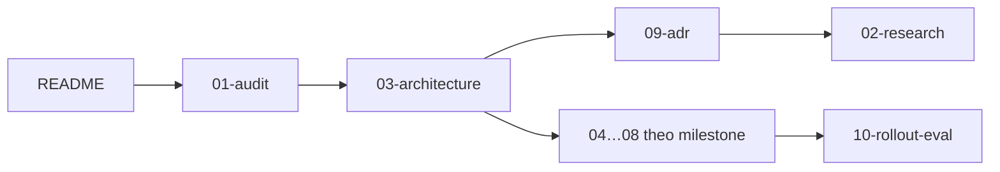

# ClaudeHut v0.12.0 — Bộ tài liệu thiết kế

Phiên bản: 0.12.0-draft · Ngày: 2026-09-29 · Trạng thái: Đề xuất

## Tóm tắt

v0.11 ép quy trình nặng lên hầu hết mọi việc: model chọn full 61/75 lần (81%, A3), còn Stop hook chặn 292 lần, 77% trong số đó rơi vào lượt do máy sinh (F-5). Hook hỏng âm thầm: 356 lỗi JSON khiến gate Learn bị bỏ qua 354 lần (B1); MEMORY.md nạp mọi lượt phình tới 105.333 B, gấp ~12,9 lần ngân sách (D1). v0.12 thay cơ chế cưỡng chế bằng router ba tuyến `direct | light | full`, state schema 2 gắn với task và `hooks.json` 13 handler chỉ advisory. Index tất định cùng MEMORY.md do máy sinh thay cho việc khám phá lặp lại; review chọn lane theo diff thay cho bảng chọn auditor gần như luôn bật (E1). Baseline và lệnh đo từng mục tiêu nằm trong [10-rollout-eval.md](10-rollout-eval.md).

## Bảng mục lục

| File | Nội dung | Đối tượng đọc |
|------|----------|---------------|
| [01-audit.md](01-audit.md) | Finding A1…F-PA-4 theo cụm A–F, kèm verdict | Mọi người |
| [02-research.md](02-research.md) | Nghiên cứu có nguồn: docs Claude Code, harness, chuẩn tài liệu, index, code review, understand-anything | Reviewer kiến trúc |
| [03-architecture.md](03-architecture.md) | Bốn lớp, `hooks.json` 13 handler, state schema 2, giải quyết xung đột | Mọi người |
| [04-routing-harness.md](04-routing-harness.md) | Router, digest, CLI `claudehut-state`, compose với plugin khác | Implementer M1–M2 |
| [05-hooks.md](05-hooks.md) | Hợp đồng hook advisory, predicate kích hoạt, `hook-common.sh` | Implementer M1 |
| [06-artifact-standards.md](06-artifact-standards.md) | Template làm schema, `doclint.sh`, ngân sách độ dài | Implementer M3 |
| [07-index-memory.md](07-index-memory.md) | `claudehut-index`, plane/hub, độ tươi, MEMORY.md, learnings | Implementer M5–M6 |
| [08-review.md](08-review.md) | `review-pack.sh`, lane, roster 7→5, allowlist tool | Implementer M4 |
| [09-adr.md](09-adr.md) | Toàn bộ ADR: R1–R7, H1–H10, D1–D7, IDX-1..8, V1–V10 | Reviewer kiến trúc |
| [10-rollout-eval.md](10-rollout-eval.md) | Milestone M0–M7, migration từ v0.11, kế hoạch eval | Mọi người |

## Thứ tự đọc đề xuất theo vai trò

| Vai trò | Thứ tự | Mục đích |
|---------|--------|----------|
| Reviewer kiến trúc | 01 → 03 → 09 → 02 → 10 | Kiểm căn cứ của từng quyết định |
| Implementer | 03 → 10 (milestone phụ trách) → file vùng 04–08 → 01 khi cần căn cứ | Nắm phạm vi và lệnh verify |

## Quyết định chính

| Quyết định | ADR |
|------------|-----|
| **Khác ý tưởng ban đầu:** understand-anything (UA) không làm engine index chính, chỉ dùng để xem dashboard. Index do `claudehut-index` sinh tất định, vì UA chỉ nhận một `PROJECT_ROOT`, sinh ~480 cạnh import giả với Java, graph payment-gateway-ms lệch HEAD 374 commit và chỉ được truy vấn 4 lần (D2, D4, D8) | [ADR-IDX-1, ADR-IDX-4](09-adr.md) |
| Router ba tuyến `direct \| light \| full` do main thread phân loại; mơ hồ thì hỏi; không mặc định full (A3, A4) | [ADR-R1](09-adr.md) |
| State theo task: `state/<sid>.json {active_task}` + `tasks/<id>/task.json` schema 2, có `base`/`pre_dirty` theo repo; bỏ bypass và arm theo session (A1, A6, B4) | [ADR-R2, ADR-H1, ADR-H6](09-adr.md) |
| Mọi hook advisory: exit 0, tối đa 1 JSON, không deny/block; xoá Stop hook (B1, A7, F-5) | [ADR-R3, ADR-H2, ADR-H4](09-adr.md) |
| Lọc lượt máy sinh ở UserPromptSubmit; phân giải teammate bằng join (F-6, F-1) | [ADR-R4](09-adr.md) |
| Ngân sách context tính bằng byte, đo trên payload thực: phần ClaudeHut ≤4.000 B, digest ≤2.500 B (F-7) | [ADR-R6, ADR-H8](09-adr.md) |
| Template là schema; luật cấu trúc chặn ở `set-*`, ngân sách độ dài chỉ advisory; plan không chứa Java/Kotlin (C1–C8) | [ADR-D1, ADR-D3](09-adr.md) |
| Index do script tất định sinh; agent truy vấn qua Bash CLI chỉ đọc (D3, D7) | [ADR-IDX-1, ADR-IDX-2](09-adr.md) |
| Plane cho từng service + hub do user chọn; graph mức service theo schema UA (D8) | [ADR-IDX-3, ADR-IDX-4](09-adr.md) |
| MEMORY.md do máy sinh, ≤2 KB; learnings có schema và dedup (D1, D5, D6) | [ADR-IDX-6](09-adr.md) |
| Review chọn lane theo diff, mỗi lane một pack ghim SHA; roster 7→5; auditor không có tool `mcp__*` (E1, E4, E6, F-4) | [ADR-V1, ADR-V2, ADR-V3, ADR-V5](09-adr.md) |
| Ngôn ngữ phản hồi và artifact (`vi`/`en`) chọn khi init, lưu `topology.json.language` (hub có mặc định, service override được); bootstrap inject một dòng trong ngân sách ≤4.000 B; doclint giữ đơn vị từ, nhân 1,4 khi `vi` | [ADR-R7](09-adr.md) |

Kết quả tích hợp thắng ADR vùng khi mâu thuẫn: ADR-H3 (Stop gửi systemMessage), phần gỡ recorder dispatch của ADR-H5 và phần kế thừa MCP của ADR-R5 đã bị thay thế ([03-architecture.md](03-architecture.md)).

## Các câu hỏi cần user quyết định

Đã chốt thêm ngày 2026-09-29: đồng ý dùng understand-anything chỉ cho dashboard (ADR-IDX-4); probe runtime đã chạy (kết quả ở [10 §3](10-rollout-eval.md#3-probe-runtime-trước-m1m2)); mọi câu dưới đây đã chốt.

1. **Vị trí hub của ewallet**: workspace root (không có git) hay repo tri thức riêng? Migration hỗ trợ cả hai ([10-rollout-eval.md](10-rollout-eval.md)). **Đã chốt (2026-09-29): repo tri thức riêng.**
2. **Chế độ strict opt-in** (deny ghi `src/main` khi task full chưa duyệt plan)? Đề xuất: không có trong v0.12; thêm ở v0.12.x nếu có nhu cầu thật (ADR-H2). **Đã chốt (2026-09-29): không có strict mode.**
3. **Task mở từ gốc workspace nhưng chỉ chạm một service** đặt ở plane nào? Đề xuất: plane workspace chỉ khi task xuyên service. **Đã chốt (2026-09-29): plane workspace chỉ khi task xuyên service.**
4. **Security lane cho `@*Mapping`**: luôn bật, hay chỉ khi diff chạm auth/filter/secret/deserialization? Lựa chọn này quyết định phần lớn tỉ lệ đợt ≥4 agent (mục tiêu ≤25%, E1). **Đã chốt (2026-09-29): chỉ bật security lane khi hunk chạm auth/filter/secret/deserialization, không bật chỉ vì có `@*Mapping`** ([08 §3.2](08-review.md#32-tín-hiệu--lane)).
5. **Ngôn ngữ artifact và ngân sách**: tiếng Anh hay tiếng Việt; nếu tiếng Việt thì nhân ×1,4 hay đổi sang byte? **Đã chốt (2026-09-29):** init hỏi Tiếng Việt hay English, lưu `topology.json.language` (ADR-R7); ngân sách chỉ đo và hiển thị (ADR-D1), giữ đơn vị từ, nhân 1,4 khi `vi`, con số chốt sau `doclint-replay.sh` (M3).
6. **Chia sẻ plane qua git** (patch `.gitignore`, commit `task.json`/topology/learnings, git hook)? Đề xuất: giữ local; init chỉ in patch; git hook chỉ cài khi user đồng ý (ADR-IDX-8). **Đã chốt (2026-09-29): giữ local; init chỉ in patch; git hook chỉ cài khi user đồng ý.**
7. **Phạm vi override bằng lời**? Đề xuất: chỉ request hiện tại, chưa thêm slash command. **Đã chốt (2026-09-29): chỉ request hiện tại, chưa thêm slash command.**
8. **Probe runtime trước M1/M2**: `CLAUDE_ENV_FILE` với SessionStart của plugin; [#80802](https://github.com/anthropics/claude-code/issues/80802) còn tái hiện không; PostToolUse có bắn cho tool call của subagent không. Đề xuất: chạy probe trước khi bắt đầu M1. **Đã chốt (2026-09-29): đã chạy cuối M0; P1–P3 pass, P4 một phần ([10 §3](10-rollout-eval.md#3-probe-runtime-trước-m1m2)).**

## Phạm vi ngoài v0.12

| Không làm | Lý do / nơi ghi |
|-----------|-----------------|
| Chế độ strict (deny, block) và Stop hook dưới mọi hình thức | Câu hỏi 2; ADR-H2, [05-hooks.md](05-hooks.md) |
| Auditor kế thừa MCP của session | Wildcard `disallowedTools` chưa kiểm chứng; câu hỏi 9 đã chốt (2026-09-29): không có trong v0.12; ADR-V5 |
| Gộp graph mức code ở hub | UA chỉ nhận một PROJECT_ROOT; ADR-IDX-4 |
| Resume task dở của v0.11, script chuyển state | File thiếu `schema:2` = không task ([10-rollout-eval.md](10-rollout-eval.md)) |
| Cài qua claude.ai/Cowork (dời `bin/`) | ADR-H10 |
| Tự sửa `.gitignore`, CLAUDE.md, git hook; ghi vào `.understand-anything/` hiện có | ADR-IDX-8, ADR-IDX-4 |
