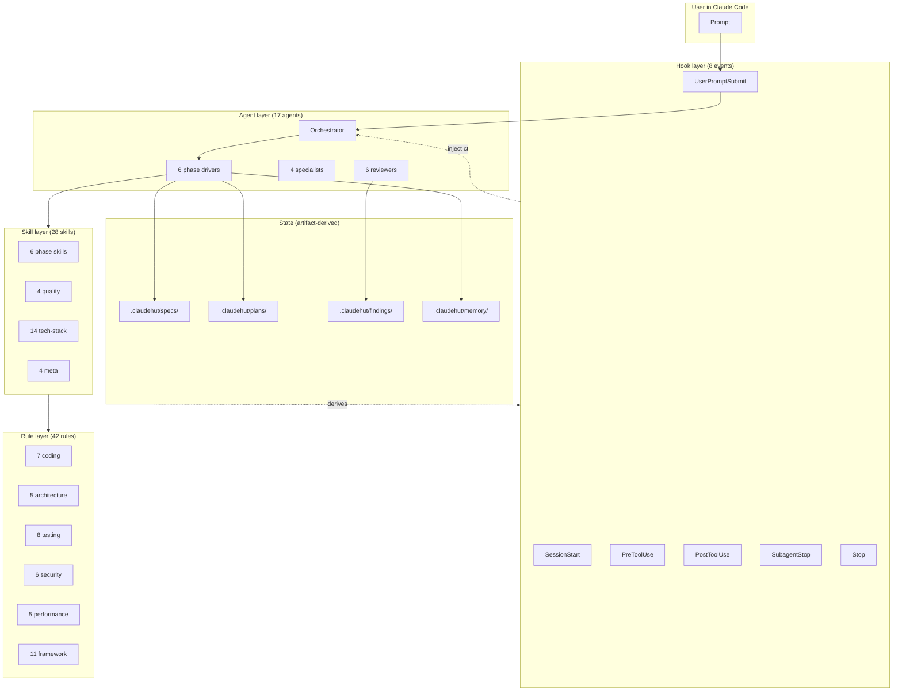

<p align="center">
  
</p>

<p align="center">
  
  
</p>

<p align="center">
  
  
</p>

<p align="center">
  <strong>ClaudeHut</strong> is a Claude Code plugin that turns AI-assisted Java backend development into a deterministic, auditable, six-phase workflow.<br>
  Built for senior engineers who want <em>workflow discipline</em>, <em>project-aware context</em>, and <em>provable code quality</em> — without manual policing.
</p>

<p align="center">
  <a href="#quick-start">Quick Start</a> ·
  <a href="#how-it-works">How It Works</a> ·
  <a href="#features">Features</a> ·
  <a href="#performance">Performance</a> ·
  <a href="#plugin-source-tour">Source Tour</a> ·
  <a href="https://github.com/taipt1504/claudehut">Repository</a>
</p>

---

## Table of Contents

- [Why ClaudeHut](#why-claudehut)
- [Quick Start](#quick-start)
- [How It Works](#how-it-works)
- [Features](#features)
  - [Phase Enforcement](#1-phase-enforcement)
  - [Reuse-Detection](#2-reuse-detection)
  - [Stack-Aware Rule Auto-Loading](#3-stack-aware-rule-auto-loading)
  - [Project-Scoped Memory + Reinforcement Learning](#4-project-scoped-memory--reinforcement-learning)
  - [Parallel Reviewer Subagents](#5-parallel-reviewer-subagents)
  - [Strict TDD](#6-strict-tdd)
- [Architecture](#architecture)
- [Installation](#installation)
- [Project Layout](#project-layout)
- [Performance](#performance)
- [Security](#security)
- [Compatibility](#compatibility)
- [Plugin Source Tour](#plugin-source-tour)
- [Testing](#testing)
- [Optional Integrations](#optional-integrations)
- [Roadmap](#roadmap)
- [FAQ](#faq)
- [Contributing](#contributing)
- [Acknowledgements](#acknowledgements)
- [License](#license)

---

## Why ClaudeHut

Generic AI coding assistants generate plausible-looking code that ignores your project's stack, conventions, prior implementations, and quality bar. ClaudeHut enforces a deterministic workflow that makes the AI a disciplined senior engineer, not a one-shot code generator.

| Problem with vanilla AI coding | ClaudeHut solution |
|---|---|
| Generates code without project context | Stack signals + project memory injected at every session |
| Repeats implementations already in codebase | Mandatory reuse-scan; new file write blocked without it |
| Skips spec / planning for "small" tasks | Hooks enforce phase gates; cannot reach `build` without `design.md` + `contract.md` + `plan.md` |
| Ignores team conventions | 42 rules auto-load per file pattern (Spring MVC vs WebFlux, JPA vs R2DBC, MapStruct, Jackson) |
| Each session starts from scratch | Append-only `learnings.jsonl`; signatures recurring ≥3 projects promoted to global tier |
| No quality gate before declaring done | Loop phase: 6 reviewer subagents in parallel; bounded 3-retry; can refuse the AI's own output |
| Surreptitious scope creep | Surgical scope enforced — file must be in current plan task or hook denies write |
| Hard to audit AI's reasoning | Every phase produces a markdown artifact committed to git |

---

## Quick Start

### Prerequisites

```bash
claude --version    # ≥ 2.1.126
java --version      # ≥ 17
jq --version        # ≥ 1.6
git --version       # any modern
```

### 1. Install the plugin

Install directly from GitHub (recommended):

```
> /plugin marketplace add taipt1504/claudehut
> /plugin install claudehut@claudehut
```

Claude Code clones the repo into your plugins directory and registers all components. See [Installation](#installation) for alternative methods.

### 2. Initialize the project

In the Claude Code session:

```
> /plugin enable claudehut
> /claudehut:init
```

This scaffolds `.claudehut/` (committed runtime state) and augments `.claude/CLAUDE.md` (native Claude memory) with a ClaudeHut hint section.

### 3. Start a feature

```bash
git checkout -b feature/add-user-endpoint    # branch name = task id
```

In the Claude session:

```
> Add an endpoint to fetch user purchase history.

[claudehut] task=feature-add-user-endpoint phase=brainstorm

Reuse-scan first. Top candidate:
  PurchaseRepository#findByUserId (score=0.87, layer=Repository)

Reuse, adapt, or refuse? Then I'll ask: who calls this (mobile / admin)?
```

The plugin will refuse to write production code until you have approved `design.md`, `contract.md`, and `plan.md` (in that order). At each gate, it will block source-code edits with a clear deny reason and corrective action.

### 4. Inspect plugin state anytime

```bash
claudehut-state phase           # which of the 6 phases you're in
claudehut-state task-id         # current branch's task id
claudehut-state docs            # paths to current artifacts
claudehut-state stack web_stack # detected stack signals
```

---

## How It Works

ClaudeHut decomposes every backend task into six artifact-driven phases. The phase is **derived** from which artifacts exist on disk — there is no mutable state file, no race condition, no manual phase transition.

```
┌──────────────┐   ┌──────┐   ┌──────┐   ┌──────┐   ┌────────────────────┐   ┌───────┐
│  Brainstorm  │──▶│ Spec │──▶│ Plan │──▶│ Build│──▶│ Loop(Verify↔Review │──▶│ Learn │
│  +reuse-scan │   │      │   │      │   │ TDD  │   │    ↔Refactor)      │   │       │
└──────────────┘   └──────┘   └──────┘   └──────┘   └────────────────────┘   └───────┘
   design.md       contract     plan      code         findings.json       learnings.jsonl
```

| Artifact present in `.claudehut/` | Phase | Hook behavior |
|------------------------------------|-------|---------------|
| (none) | `brainstorm` | Source edits in `src/` blocked. Brainstormer agent asks one Socratic question per turn. |
| `specs/<task>-design.md` | `spec` | Source edits still blocked. Spec writer agent fills binary Given/When/Then. |
| `+ specs/<task>-contract.md` | `plan` | Source edits still blocked. Planner agent decomposes contract into 2–5 min tasks. |
| `+ plans/<task>-plan.md` with `- [ ]` items | `build` | Source edits allowed for files listed in current task only. TDD strict. |
| All plan items `- [x]` | `loop` | Verifier dispatches 6 reviewers in parallel. |
| `findings/<task>-findings.json` `decision=pass` | `learn` | Learner appends patterns to `learnings.jsonl`. |
| `learnings.jsonl` contains task entry | `done` | Suggest `claudehut-finish` to archive. |

Branch name = task id. Multi-task = multi-worktree (Superpowers pattern). No lock files, no per-task state directory, no merge conflicts on phase state.

---

## Features

### 1. Phase Enforcement

Every Claude Code hook is wired to enforce the workflow:

| Hook | Enforcement |
|------|-------------|
| `SessionStart` | Inject task + phase + stack + recent learnings as `additionalContext` |
| `UserPromptSubmit` | Block prompts that try to skip phases ("just write the code", "no need for spec") |
| `PreToolUse(Write\|Edit)` | Deny `src/` writes outside `build` phase; deny new Java files without fresh reuse-scan; deny files not in current plan task |
| `PreToolUse(Bash)` | Deny destructive commands (`rm -rf /`, `git push --force`, `DROP DATABASE`) |
| `PostToolUse(Write\|Edit)` | Run `spotlessApply` async on Java files |
| `SubagentStop` | Aggregate reviewer findings into `findings.json` |
| `Stop` | Suggest next-phase action based on derived phase |
| `PreCompact` | Surface current task + phase before context compaction |

**Real evidence (from E2E test):** prompt `"Just write the code, skip the spec phase"` against an initialized project results in `0 turns, 0 input tokens, 0 output tokens, $0.00 cost, 78ms duration` — Claude Code never even reached the model.

### 2. Reuse-Detection

Before any new Java class is created, ClaudeHut routes the topic + nouns through whichever knowledge graph plugin you have installed:

```
                  ┌── Understand-Anything (Lum1104) ── parse .understand-anything/knowledge-graph.json
                  │                                     OR invoke /understand-chat
ClaudeHut router ─┼── Graphify (safishamsi)         ── `graphify query "<topic>"`
                  │                                     OR `graphify global query` cross-project
                  └── grep + heuristic fallback     ── token overlap + recency + memory hits
```

Output: top-5 candidates with `{path, class, purpose, score, source, layer}`. User decides `reuse | adapt | refuse` for each. PreToolUse hook denies new file write if the reuse-scan is missing or stale (>10 min).

ClaudeHut does **not** wrap or re-implement the backends. It detects, invokes the native command, normalizes output. Both plugins are optional.

### 3. Stack-Aware Rule Auto-Loading (native `.claude/rules/`)

ClaudeHut detects your stack at `SessionStart` (Spring MVC vs WebFlux, JPA vs R2DBC, MapStruct vs manual, Jackson, Kafka/RabbitMQ/NATS) and persists to `.claudehut/memory/stack-signals.md`. `/claudehut:init` then copies the plugin's 42 rule files into the project's `.claude/rules/`, where Claude Code's **native loader** picks them up. Each rule carries a `paths:` frontmatter and is auto-loaded only when Claude reads a matching file — no custom hook injection:

```yaml
---
paths:
  - "**/*Controller.java"
  - "**/*Handler.java"
stack: "web=webflux"      # init copies this rule only when web=webflux is detected
---
# WebFlux Handler Rules
…
```

42 rules total in 6 categories: coding, architecture, testing, security, performance, framework. Override any rule by editing the file directly inside `.claude/rules/` — init records SHA256s in `.claude/rules/.checksums.json` so `claudehut:init --refresh` leaves your edits alone (use `--force` to overwrite).

### 4. Project-Scoped Memory + Reinforcement Learning

Four memory tiers:

```
~/.claude/claudehut/                  ← Global tier (cross-project promoted patterns)
└── memory/patterns.jsonl

<repo>/.claude/CLAUDE.md              ← Native memory entry-point (thin, @imports the files below)
<repo>/.claude/rules/                 ← Native rules (copied from plugin, paths:-scoped)
<repo>/.claudehut/                    ← Plugin-managed state (committed, team-shared)
└── memory/
    ├── conventions.md                ← @imported by CLAUDE.md
    ├── stack-signals.md              ← @imported by CLAUDE.md
    ├── learnings-recent.md           ← @imported by CLAUDE.md (regenerated by Learn phase)
    ├── learnings.jsonl               ← append-only state
    └── index.md                      ← reusable impl map

~/.claude/projects/<sid>/             ← Session tier (Claude Code harness)

(in-context)                          ← Task tier (current phase state in prompt)
```

After every successful task, the Learner agent extracts patterns / anti-patterns / decisions / gotchas / commands and appends them to `learnings.jsonl`. When a signature appears in ≥3 distinct projects (configurable threshold + opt-in), it's promoted to the global tier.

Privacy: every entry passes through a secret-scan (AWS keys, OpenAI/Anthropic keys, PEM blocks, JWTs, DB connection strings) before append. No personally identifiable information.

### 5. Subagent-Driven Workflow (per-phase model fit + isolated context)

ClaudeHut binds every phase to a dedicated subagent. The main thread acts as the **orchestrator** (context, memory, advisor, task tracking, user dialog); each workflow skill instructs the main thread to `Task(subagent_type=..., prompt=<dispatch-prompt>)`. Per Anthropic's docs, each subagent runs in a **fresh, isolated context** — it does NOT inherit the main thread's loaded skills or files. Every phase agent therefore preloads its phase skill via `skills:` frontmatter, so the skill content is in the subagent's context at startup. The dispatch-prompt.sh script composes the rest (user intent + stack signals + conventions + prior artifacts).

| Phase | Subagent | Preloaded skill(s) | Model |
|-------|----------|---------------------|-------|
| Brainstorm | `claudehut-brainstormer` | `claudehut:brainstorm`, `claudehut:reuse-scan` | Opus |
| Spec | `claudehut-spec-writer` | `claudehut:spec` | Sonnet |
| Plan | `claudehut-planner` | `claudehut:plan`, `claudehut:tdd-cycle` | Opus |
| Build | `claudehut-builder` | `claudehut:build`, `claudehut:tdd-cycle` | Sonnet |
| Loop (verify-review) | `claudehut-verifier` + 6 reviewers | `claudehut:verify-review` (verifier); domain skills per reviewer | Sonnet/Haiku mix |
| Learn | `claudehut-learner` | `claudehut:learn` | Haiku |

The Loop phase dispatches up to 6 read-only reviewer subagents in a single message:

| Reviewer | Scope | Model |
|----------|-------|-------|
| `claudehut-reviewer-security` | OWASP Top 10, Spring Security, SpEL, deserialization, secrets, actuator | Sonnet |
| `claudehut-reviewer-perf` | N+1, blocking calls in WebFlux, allocation hotspots, missing indexes | Sonnet |
| `claudehut-reviewer-db` | Migration safety, schema delta, EXPLAIN via Postgres MCP | Sonnet |
| `claudehut-reviewer-reactive` | `.block()` detection, scheduler choice, backpressure, context propagation | Sonnet (skip if not WebFlux) |
| `claudehut-reviewer-style` | Naming, Java 17+ idioms, SOLID, comment hygiene | Haiku |
| `claudehut-reviewer-mapping` | MapStruct config, Jackson polymorphism whitelist, DTO smells | Haiku (skip if not used) |

Findings aggregated into `findings.json`. Decision rule: `0 Critical AND 0 High → pass`; otherwise inject a refactor task back into the plan. Bounded to 3 retries; on the third failure, escalate to user.

### 6. Strict TDD

The Builder agent enforces RED → GREEN → REFACTOR per plan task with the `watch-test-fail.sh` script:

- Exit 0 only if the test command exited non-zero **and** the failure type was the expected one (NoSuchMethodError / AssertionFailedError).
- Exit 1 if the test passed immediately → forces test deletion + restart.
- Exit 2 if the test errored on setup → forces fixture fix, not production code.

This makes the canonical anti-pattern ("write the code, then write a test that happens to pass") provably impossible.

---

## Architecture



Run `bash tests/run-all.sh` for a full self-test (222 assertions across 11 layers).

---

## Installation

Three install paths — pick by use case.

### A. From GitHub marketplace (recommended)

Repo ships `.claude-plugin/marketplace.json`, so Claude Code treats it as a single-plugin marketplace. Inside any Claude Code session:

```
> /plugin marketplace add taipt1504/claudehut
> /plugin install claudehut@claudehut
> /plugin enable claudehut
> /claudehut:init
```

Defaults to `main` branch. To pin a tagged version:

```
> /plugin marketplace add taipt1504/claudehut@v0.1.0
> /plugin install claudehut@claudehut
```

Update later:

```
> /plugin marketplace update claudehut
> /reload-plugins
```

### B. One-shot trial via plugin URL

No marketplace registration. Plugin loaded for the current session only.

```bash
claude --plugin-url https://github.com/taipt1504/claudehut/archive/refs/heads/main.zip
```

Inside session:

```
> /plugin enable claudehut
> /claudehut:init
```

### C. Local dev (clone + --plugin-dir)

For modifying the plugin or contributing.

```bash
git clone git@github.com:taipt1504/claudehut.git ~/dev/claudehut
# or HTTPS:
git clone https://github.com/taipt1504/claudehut.git ~/dev/claudehut

cd /path/to/your/java/project
claude --plugin-dir ~/dev/claudehut
```

Re-run `/reload-plugins` after editing local source.

### D. From community marketplace (after listing)

```
> /plugin marketplace add anthropics/claude-plugins-community
> /plugin install @claude-community/claudehut
```

(Listing pending submission.)

### Troubleshooting

| Symptom | Cause | Fix |
|---------|-------|-----|
| `/claudehut:*` skills don't appear | Plugin not loaded | `/reload-plugins` |
| `claudehut-state` command not found | `bin/` not on PATH | Plugin auto-prepends; check `echo $PATH` |
| Hook output missing | `.claudehut/` not initialized | `/claudehut:init` |
| `reuse-scan stale` errors during Build | Scan > 10 min old | Re-run `/claudehut:reuse-scan <topic>` |
| Phase stuck on `brainstorm` | `design.md` not saved | Verify `.claudehut/specs/<task>-design.md` exists + non-empty |
| Multiple branches in one session | Not supported | Use git worktrees: `git worktree add ../wt-feature feature/x` |

---

## Project Layout

After `claudehut:init`:

```
your-project/
├── .claude/
│   └── CLAUDE.md                     ← native Claude memory (augmented)
├── .claudehut/                       ← plugin runtime state (committed)
│   ├── claudehut-config.json         ← per-project config
│   ├── memory/
│   │   ├── conventions.md            ← project conventions
│   │   ├── index.md                  ← reusable impl map
│   │   ├── stack-signals.md         ← detected stack (markdown, @imported by CLAUDE.md)
│   │   ├── learnings.jsonl           ← append-only reinforcement log
│   │   └── integrations.json         ← UA/Graphify detection cache
│   ├── specs/<task>-design.md        ← Phase 1 artifact
│   ├── specs/<task>-contract.md      ← Phase 2 artifact
│   ├── plans/<task>-plan.md          ← Phase 3 artifact
│   ├── findings/<task>-findings.json ← Phase 5 artifact
│   └── reuse-scans/<task>.json       ← cache (gitignored)
└── .gitignore                        ← ephemeral patterns appended
```

Branch name → task id (slashes → dashes). One task = one branch = one set of artifacts.

---

## Performance

p95 latency per hook, measured over 20 runs against a real fixture project (`bash tests/perf/hook-benchmark.sh`):

| Hook | p95 latency | Design budget | Headroom |
|------|-------------|---------------|----------|
| `SessionStart` | 151ms | 2000ms | **92%** |
| `UserPromptSubmit` | 56ms | 200ms | **72%** |
| `PreToolUse` (bash) | 26ms | 300ms | **91%** |
| `PreToolUse` (edit) | 131ms | 300ms | **56%** |
| `PostToolUse` | 27ms | 500ms | **95%** |
| `Stop` | 54ms | 1000ms | **95%** |
| `PreCompact` | 52ms | 500ms | **90%** |
| `FileChanged` | 26ms | 200ms | **87%** |
| `SubagentStop` | 44ms | 500ms | **91%** |

All hooks pure bash + `jq`. No background processes. No network calls (except optional MCP). No daemon.

**Cost saved by enforcement** (from real Claude E2E):
- Skip-attempt prompt → blocked before API call → **$0.00**
- Vs. allowing the prompt → ~$0.40-0.50 per prompt + risk of bad code

---

## Security

| Concern | Mitigation |
|---------|-----------|
| Secrets leaking into memory | Every learning entry passes through `secret-scan.sh` (12+ regex patterns: AWS/OpenAI/Anthropic keys, PEM, JWTs, DB URLs) before append |
| Destructive bash commands | PreToolUse hook denies `rm -rf /`, `git push --force`, `DROP DATABASE`, `kubectl delete`, `--no-verify` |
| Unsafe migrations | Migration validator denies `ADD COLUMN NOT NULL` without DEFAULT, `CREATE INDEX` without CONCURRENTLY on large tables, `R__` containing DDL |
| Jackson RCE via deserialization | Reviewer-mapping flags `enableDefaultTyping()` / `activateDefaultTyping()` as Critical |
| Spring Security misconfig | Reviewer-security flags blanket `permitAll()`, Actuator exposure, hardcoded credentials |
| Hook scripts elevation | Run as user, no setuid; no sandbox escape vectors |
| MCP server access | Read-only role enforced for Postgres MCP; write tools require explicit user approval |
| Memory commit privacy | `learnings.jsonl` content abstracted; no PII; large string literals stripped |

Found a security issue? Email maintainer directly — do not file a public issue.

---

## Compatibility

| Component | Minimum | Tested |
|-----------|---------|--------|
| Claude Code | 2.1.126 | 2.1.126 |
| Java | 17 | 17, 21 |
| Spring Boot | 3.x | 3.3.4 |
| Gradle | 8.x | 8.10 |
| Maven | 3.9+ | 3.9.6 |
| Bash | 3.2 (macOS default) | 3.2.57, 5.x |
| `jq` | 1.6+ | 1.7 |
| OS | macOS, Linux | macOS 14, Ubuntu 22.04 |

CI matrix: `ubuntu-latest` (test job) + `macos-latest` (bash-compat job).

---

## Plugin source tour

Source is self-describing. Read the in-repo files to learn each layer:

| Path | Content |
|------|---------|
| `agents/*.md` | 17 agent system prompts (orchestrator + 6 phase drivers + 4 specialists + 6 reviewers) |
| `skills/*/SKILL.md` | 28 skills, each in 3-bucket layout (SKILL.md + references/ + scripts/ + assets/) |
| `rules/{coding,architecture,testing,security,performance,framework}/*.md` | 42 rules with DO/DON'T + examples |
| `hooks/hooks.json` + `hooks/*.sh` | 8 hook events + Bash handlers |
| `.mcp.json` | 5 MCP server configurations (Postgres, GitHub, Context7, Memory, Sequential-Thinking) |
| `.claude-plugin/plugin.json` | Plugin manifest (name, version, userConfig) |
| `bin/claudehut-state` | Read-only CLI for inspecting plugin state |
| `templates/` | Initial scaffolding for `.claudehut/` per project |
| `tests/run-all.sh` | 11-layer self-test (222 assertions) |
| `tests/e2e/` | Simulated + real-Claude E2E |

---

## Testing

```bash
# Full self-test (11 layers, 222 assertions)
bash tests/run-all.sh

# Layer breakdown:
#  L1 Static validation (JSON, bash, Mermaid, frontmatter, refs)
#  L2 Unit tests (state.sh, validators, secret-scan)
#  L3 Integration (hook scripts with mock JSON)
#  L4 Coverage (rules indexed, agent/skill counts)
#  L5 Pattern compliance (G+G+G+H per agent)
#  L6 E2E simulated workflow (32 sub-steps, full 6 phases)
#  L7 Bash 3.2 compatibility
#  L8 Bidirectional reference integrity
#  L9 Snapshot tests (golden hook outputs)
#  L10 Hook performance (p95 within budget)
#  L11 Reviewer dispatch (parallel + aggregation)

# Real Claude E2E (requires claude CLI, ~$1 in API cost)
bash tests/e2e/run-real-claude.sh
```

CI: `.github/workflows/test.yml` runs full suite on push/PR. Two jobs: `ubuntu-latest` (canonical) and `macos-latest` (bash 3.2 compat).

---

## Optional Integrations

ClaudeHut auto-detects these at `SessionStart` and uses them when present. All are optional — grep heuristic is the always-available fallback.

| Plugin | Purpose | Install |
|--------|---------|---------|
| [Understand-Anything](https://github.com/Lum1104/Understand-Anything) | Semantic reuse-scan via tree-sitter + LLM knowledge graph | `/plugin marketplace add Lum1104/Understand-Anything` then `/understand` |
| [Graphify](https://github.com/safishamsi/graphify) | Cross-project reuse-scan via community-clustered graph | Per Graphify docs, then `graphify install` + `/graphify .` |

When both are installed, ClaudeHut invokes them in parallel and merges results.

---

## Roadmap

| Version | Theme | Status |
|---------|-------|--------|
| **0.1.0** | MVP — 6-phase workflow, 17 agents, 28 skills, 42 rules, 8 hooks | **shipped** |
| 0.2.0 | Federated memory across same-org private repos | planned |
| 0.2.0 | LSP server for `application.yml` live-validation | planned |
| 0.2.0 | Private marketplace template repo | planned |
| 0.3.0 | Multi-language: Kotlin first-class, then Scala | planned |
| 0.3.0 | Cost-aware model routing (Opus only when stakes justify) | planned |
| 1.0.0 | Stable schema for memory + state files | planned |

Issues + RFCs welcome at <https://github.com/taipt1504/claudehut/issues>.

---

## FAQ

**Q: Does this work with non-Java projects?**
A: It's optimized for Java/Spring. The 6-phase workflow + memory + reuse-scan are language-agnostic, but the 42 rules and 14 tech-stack skills are Java/Spring. Kotlin (JVM) is supported; Scala/Go/Python on the roadmap.

**Q: Can I disable a phase for a quick fix?**
A: No — that defeats the value. The plugin assumes every "quick fix" deserves design+contract+plan, because production incidents come from skipped steps. If you genuinely need a one-line typo fix, do it outside the plugin scope.

**Q: How does this compare to GitHub Copilot / Cursor?**
A: Different layer. Copilot/Cursor are inline completion. ClaudeHut is workflow orchestration on top of Claude Code (full agentic CLI). Use Copilot for keystroke acceleration; use ClaudeHut for feature-scale work.

**Q: Does the plugin write to my `.claude/` directory?**
A: Only on `init`, it appends a marked section to `.claude/CLAUDE.md` (creating it if absent) pointing Claude at `.claudehut/` runtime state. Idempotent. Removes cleanly by deleting the marked section.

**Q: What if I have an existing CLAUDE.md?**
A: Preserved. ClaudeHut appends its section with HTML comment markers; existing content untouched.

**Q: How is memory privacy handled?**
A: Every memory entry passes a regex scan for AWS/OpenAI/Anthropic keys, PEM blocks, JWTs, DB connection strings. Matches → entry rejected, only the pattern type is logged (never the value). Global promotion requires explicit opt-in per project.

**Q: Can I customize rules per project?**
A: Yes — `/claudehut:init` copies the plugin's 42 rules into `.claude/rules/`. Edit any file there to customize. `claudehut:init --refresh` leaves user-edited rules alone (SHA256-tracked in `.claude/rules/.checksums.json`); pass `--force` to overwrite. Each rule's `paths:` frontmatter controls when Claude auto-loads it.

**Q: What's the cost overhead?**
A: SessionStart hook ≤ 151ms p95. Per-prompt overhead negligible. Reviewer subagents in Loop phase cost ~$0.40-0.50 per task (run in parallel). Skip-attempt prompts blocked at $0.

**Q: Does it work offline?**
A: Plugin enforcement (hooks + state + validators) works offline. Claude Code itself needs API access. MCP servers are optional; only Postgres MCP requires a connection.

---

## Contributing

Contributions welcome. Workflow:

1. Fork `taipt1504/claudehut`
2. Create a feature branch: `git checkout -b feature/<slug>`
3. Run the full test suite: `bash tests/run-all.sh` — must pass 222/222
4. Open PR against `main`
5. CI runs ubuntu + macOS bash-compat + simulated E2E

Adding a skill / agent / rule? See `skills/write-skill/` for scaffold + validator. New tech-stack skill must include: `SKILL.md` + `references/anti-patterns.md` + `assets/templates/*.java.tmpl`.

### Reporting issues

- Bug reports: <https://github.com/taipt1504/claudehut/issues/new?template=bug.md>
- Feature requests: <https://github.com/taipt1504/claudehut/issues/new?template=feature.md>
- Security issues: email maintainer directly; do not file a public issue.

---

## Acknowledgements

Pattern + inspiration from:

- [Superpowers](https://github.com/obra/superpowers) (Jesse Vincent) — mandatory workflow + TDD enforcement + skill-triggering test pattern
- [Engineer Skills](https://github.com/mattpocock/skills) (Matt Pocock) — failure-mode-driven skill design
- [AITMPL](https://www.aitmpl.com) — component taxonomy + Stack Builder model
- [Understand-Anything](https://github.com/Lum1104/Understand-Anything) (Lum1104) — knowledge graph reuse-detection
- [Graphify](https://github.com/safishamsi/graphify) (safishamsi) — cross-project graph
- [Anthropic Claude Code](https://code.claude.com/docs) — plugin / skill / agent / hook / MCP specification

---

## License

[MIT](LICENSE) © 2025 [Phan Tài](https://github.com/taipt1504)
