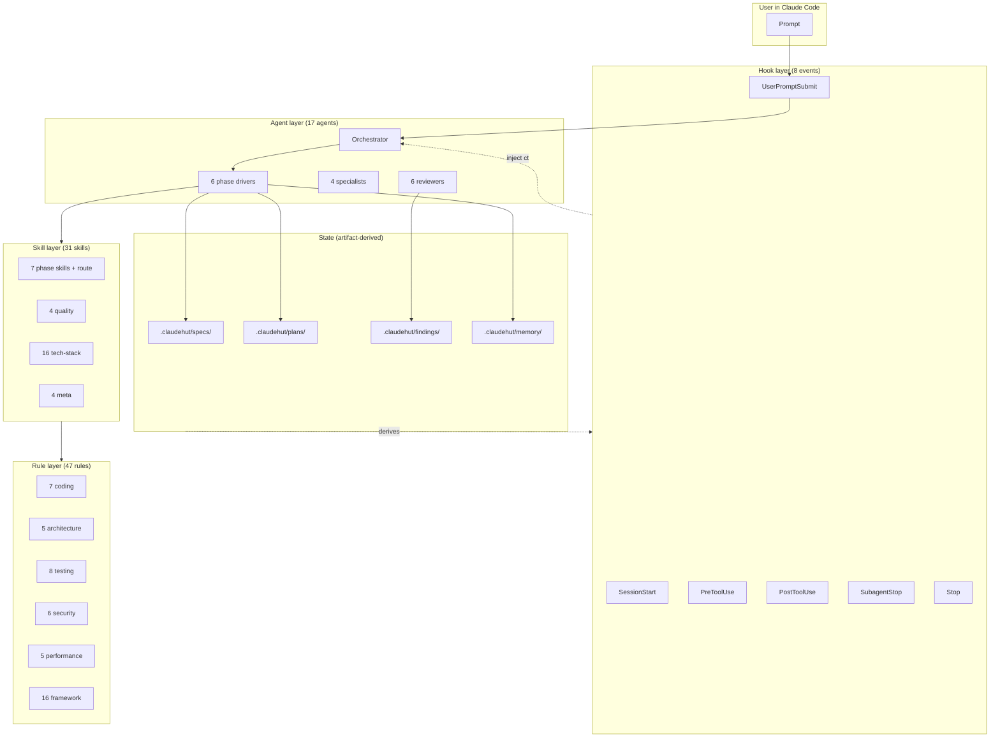

<p align="center">
  
</p>

<p align="center">
  
  
</p>

<p align="center">
  
  
</p>

<p align="center">
  <strong>ClaudeHut</strong> is a Claude Code plugin that turns AI-assisted Java backend development into a deterministic, auditable, <strong>adaptive-depth</strong> agentic workflow — a triage step routes each task to <code>quick</code> (build + verify) or <code>full</code> (six phases), so ceremony is matched to risk, never silently skipped.<br>
  Built for senior engineers who want <em>workflow discipline</em>, <em>project-aware context + retrieval</em>, <em>cost/budget control</em>, and <em>provable code quality</em> — without manual policing.
</p>

<p align="center">
  <a href="#quick-start">Quick Start</a> ·
  <a href="docs/GUIDE.md">Detailed Guide</a> ·
  <a href="#how-it-works">How It Works</a> ·
  <a href="#features">Features</a> ·
  <a href="#performance">Performance</a> ·
  <a href="#plugin-source-tour">Source Tour</a> ·
  <a href="https://github.com/taipt1504/claudehut">Repository</a>
</p>

---

## Table of Contents

- [Why ClaudeHut](#why-claudehut)
- [Quick Start](#quick-start)
- [How It Works](#how-it-works)
- [Features](#features)
  - [Phase Enforcement](#1-phase-enforcement)
  - [Reuse-Detection](#2-reuse-detection)
  - [Stack-Aware Rule Auto-Loading](#3-stack-aware-rule-auto-loading)
  - [Project-Scoped Memory + Retrieval Reinforcement](#4-project-scoped-memory--retrieval-reinforcement)
  - [Subagent-Driven Workflow](#5-subagent-driven-workflow-per-phase-model-fit--isolated-context)
  - [Strict TDD](#6-strict-tdd)
  - [Adaptive-Depth Routing](#7-adaptive-depth-routing)
  - [Cost Telemetry + Budget Gate](#8-cost-telemetry--budget-gate)
  - [Programmatic Orchestrator (Agent SDK)](#9-programmatic-orchestrator--agent-sdk-optional-experimental)
- [Architecture](#architecture)
- [Installation](#installation)
- [Project Layout](#project-layout)
- [Performance](#performance)
- [Security](#security)
- [Compatibility](#compatibility)
- [Plugin Source Tour](#plugin-source-tour)
- [Testing](#testing)
- [Optional Integrations](#optional-integrations)
- [Roadmap](#roadmap)
- [FAQ](#faq)
- [Contributing](#contributing)
- [Acknowledgements](#acknowledgements)
- [License](#license)

---

## Why ClaudeHut

Generic AI coding assistants generate plausible-looking code that ignores your project's stack, conventions, prior implementations, and quality bar. ClaudeHut enforces a deterministic workflow that makes the AI a disciplined senior engineer, not a one-shot code generator.

| Problem with vanilla AI coding | ClaudeHut solution |
|---|---|
| Generates code without project context | Stack signals + project memory injected at every session |
| Repeats implementations already in codebase | Mandatory reuse-scan; new file write blocked without it |
| Skips spec / planning for "small" tasks **or** over-ceremonies a one-liner | **Adaptive routing**: a deterministic triage step picks `quick` (build + verify) for trivial fixes and `full` (6-phase, gated on `design.md` + `contract.md` + `plan.md`) for real features — ceremony matched to risk, conservatively (ambiguous → full) |
| Ignores team conventions | 47 rules auto-load per file pattern (Spring MVC vs WebFlux, JPA vs R2DBC, MapStruct, Jackson, Kafka/RabbitMQ/NATS) |
| Each session starts from scratch | Append-only `learnings.jsonl` + **JIT relevance retrieval** (top-K most relevant past learnings injected per task) + outcome-signal usefulness prior; signatures recurring ≥3 projects promoted to global tier |
| No quality gate before declaring done | Loop phase: 6 reviewer subagents in parallel; bounded 3-retry; can refuse the AI's own output |
| Runaway token spend on parallel workers | **Cost telemetry + a worker-pool budget gate** (skip-not-kill, exit 3) cap real `$` spend per run |
| Surreptitious scope creep | Surgical scope enforced — file must be in current plan task or hook denies write |
| Hard to audit AI's reasoning | Every phase produces a markdown artifact committed to git |

---

## Quick Start

### Prerequisites

```bash
claude --version    # ≥ 2.1.126
java --version      # ≥ 17
jq --version        # ≥ 1.6
git --version       # any modern
```

### 1. Install the plugin

Install directly from GitHub (recommended):

```
> /plugin marketplace add taipt1504/claudehut
> /plugin install claudehut@claudehut
```

Claude Code clones the repo into your plugins directory and registers all components. See [Installation](#installation) for alternative methods.

### 2. Initialize the project

In the Claude Code session:

```
> /plugin enable claudehut
> /claudehut:init
```

This scaffolds `.claudehut/` (committed runtime state) and augments `.claude/CLAUDE.md` (native Claude memory) with a ClaudeHut hint section.

### 3. Start a feature

```bash
git checkout -b feature/add-user-endpoint    # branch name = task id
```

In the Claude session:

```
> Add an endpoint to fetch user purchase history.

[claudehut] task=feature-add-user-endpoint phase=brainstorm

Reuse-scan first. Top candidate:
  PurchaseRepository#findByUserId (score=0.87, layer=Repository)

Reuse, adapt, or refuse? Then I'll ask: who calls this (mobile / admin)?
```

The plugin will refuse to write production code until you have approved `design.md`, `contract.md`, and `plan.md` (in that order). At each gate, it will block source-code edits with a clear deny reason and corrective action.

### 4. Inspect plugin state anytime

```bash
claudehut-state phase           # current phase (route|brainstorm|…|build|loop|learn|done)
claudehut-state task-id         # current branch's task id
claudehut-state docs            # paths to current artifacts
claudehut-state stack web       # a detected stack field (web|orm|db|messaging|mapper|serialization)
```

---

## How It Works

Every task first hits a **triage** step (`/claudehut:route`, Phase 0.5) that classifies intent and records a *route* in `.claudehut/state/route-<task>.json`: **`quick`** (just `build` + `loop`) for trivial fixes, or **`full`** (all six phases) for real features. The classifier is conservative by construction — anything ambiguous routes `full`, so it can never silently strip the design gate from a real feature. ClaudeHut then walks **only the phases the route declares**. The phase is **derived** from the artifacts on disk + the route — no mutable state file, no race condition, no manual transition.

```
                          ┌─ quick ─────────────────────────────┐
                          │                                     ▼
┌───────┐   ┌──────────┐  │ ┌──────┐  ┌──────┐  ┌──────┐  ┌────────────────────┐  ┌───────┐
│ Route │──▶│Brainstorm│──┼▶│ Spec │─▶│ Plan │─▶│ Build│─▶│ Loop(Verify↔Review │─▶│ Learn │
│triage │   │+reuse-scan│ full │      │  │      │  │ TDD  │  │    ↔Refactor)      │  │       │
└───────┘   └──────────┘    └──────┘  └──────┘  └──────┘  └────────────────────┘  └───────┘
route.json    design.md     contract    plan     code        findings.json      learnings.jsonl
```

> **`quick` route** skips brainstorm/spec/plan/learn and goes straight to `build` → `loop` (verify). A trivial one-line fix no longer pays the full 6-phase tax (the empirical motivation: an early eval showed full ceremony on a 1-line bug burned ~9× a baseline fix and never reached the fix). **`full` route** is the original waterfall, byte-for-byte.

| Artifact present in `.claudehut/` | Phase | Hook behavior |
|------------------------------------|-------|---------------|
| (fresh task, no route) | `route` | Triage first. `src/` edits blocked until the route is recorded. |
| `state/route-<task>.json` = `quick` | `build` | Skips brainstorm/spec/plan. `src/` edits allowed for the task; TDD strict. Verify runs at `loop`; pass → done (no learn). |
| `route` = `full`, no `design.md` | `brainstorm` | Source edits in `src/` blocked. Brainstormer agent asks one Socratic question per turn. |
| `+ specs/<task>-design.md` | `spec` | Source edits still blocked. Spec writer agent fills binary Given/When/Then. |
| `+ specs/<task>-contract.md` | `plan` | Source edits still blocked. Planner agent decomposes contract into 2–5 min tasks. |
| `+ plans/<task>-plan.md` with `- [ ]` items | `build` | Source edits allowed for files listed in current task only. TDD strict. |
| All plan items `- [x]` | `loop` | Verifier dispatches 6 reviewers in parallel. |
| `findings/<task>-findings.json` `decision=pass` | `learn` | Learner appends patterns to `learnings.jsonl`. |
| `learnings.jsonl` contains task entry | `done` | Suggest `claudehut-finish` to archive. |

Branch name = task id. Multi-task = multi-worktree (Superpowers pattern). No lock files, no per-task state directory, no merge conflicts on phase state.

---

## Features

### 1. Phase Enforcement

Every Claude Code hook is wired to enforce the workflow:

| Hook | Enforcement |
|------|-------------|
| `SessionStart` | Inject task + phase + stack + recent learnings as `additionalContext` |
| `UserPromptSubmit` | Block prompts that try to skip phases ("just write the code", "no need for spec") |
| `PreToolUse(Write\|Edit)` | Deny `src/` writes outside `build` phase; deny new Java files without fresh reuse-scan; deny files not in current plan task |
| `PreToolUse(Bash)` | Deny destructive commands (`rm -rf /`, `git push --force`, `DROP DATABASE`) |
| `PostToolUse(Write\|Edit)` | Run `spotlessApply` async on Java files |
| `SubagentStop` | Aggregate reviewer findings into `findings.json` |
| `Stop` | Suggest next-phase action based on derived phase |
| `PreCompact` | Surface current task + phase before context compaction |

**Real evidence (from E2E test):** prompt `"Just write the code, skip the spec phase"` against an initialized project results in `0 turns, 0 input tokens, 0 output tokens, $0.00 cost, 78ms duration` — Claude Code never even reached the model.

### 2. Reuse-Detection

Before any new Java class is created, ClaudeHut routes the topic + nouns through whichever knowledge graph plugin you have installed:

```
                  ┌── Understand-Anything (Lum1104) ── parse .understand-anything/knowledge-graph.json
                  │                                     OR invoke /understand-chat
ClaudeHut router ─┼── Graphify (safishamsi)         ── `graphify query "<topic>"`
                  │                                     OR `graphify global query` cross-project
                  └── grep + heuristic fallback     ── token overlap + recency + memory hits
```

Output: top-5 candidates with `{path, class, purpose, score, source, layer}`. User decides `reuse | adapt | refuse` for each. PreToolUse hook denies new file write if the reuse-scan is missing or stale (>10 min).

ClaudeHut does **not** wrap or re-implement the backends. It detects, invokes the native command, normalizes output. Both plugins are optional.

### 3. Stack-Aware Rule Auto-Loading (native `.claude/rules/`)

ClaudeHut detects your stack at `SessionStart` (Spring MVC vs WebFlux, JPA vs R2DBC, MapStruct vs manual, Jackson, Kafka/RabbitMQ/NATS) and persists to `.claudehut/memory/stack-signals.md`. `/claudehut:init` then copies the plugin's 47 rule files into the project's `.claude/rules/`, where Claude Code's **native loader** picks them up. Each rule carries a `paths:` frontmatter and is auto-loaded only when Claude reads a matching file — no custom hook injection:

```yaml
---
paths:
  - "**/*Controller.java"
  - "**/*Handler.java"
stack: "web=webflux"      # init copies this rule only when web=webflux is detected
---
# WebFlux Handler Rules
…
```

47 rules total in 6 categories: coding, architecture, testing, security, performance, framework. Override any rule by editing the file directly inside `.claude/rules/` — init records SHA256s in `.claude/rules/.checksums.json` so `claudehut:init --refresh` leaves your edits alone (use `--force` to overwrite).

### 4. Project-Scoped Memory + Retrieval Reinforcement

Four memory tiers:

```
~/.claude/claudehut/                  ← Global tier (cross-project promoted patterns)
└── memory/patterns.jsonl

<repo>/.claude/CLAUDE.md              ← Native memory entry-point (thin, @imports the files below)
<repo>/.claude/rules/                 ← Native rules (copied from plugin, paths:-scoped)
<repo>/.claudehut/                    ← Plugin-managed state (committed, team-shared)
└── memory/
    ├── conventions.md                ← @imported by CLAUDE.md
    ├── stack-signals.md              ← @imported by CLAUDE.md
    ├── learnings-recent.md           ← @imported by CLAUDE.md (regenerated by Learn phase)
    ├── learnings.jsonl               ← append-only state
    └── index.md                      ← reusable impl map

~/.claude/projects/<sid>/             ← Session tier (Claude Code harness)

(in-context)                          ← Task tier (current phase state in prompt)
```

After every successful task, the Learner agent extracts patterns / anti-patterns / decisions / gotchas / commands and appends them to `learnings.jsonl`. When a signature appears in ≥3 distinct projects (configurable threshold + opt-in), it's promoted to the global tier.

**JIT relevance retrieval (not a static dump).** Instead of pasting the latest N learnings into every dispatch, each phase prompt retrieves the **top-K most relevant** past learnings for *this* task: `score = 0.45·path + 0.30·tag + 0.10·title + 0.15·prior` (intrinsic-Jaccard similarity, a relevance floor before the prior, K=5, deterministic tiebreak). The `prior` is an **outcome-signal usefulness** term — a learning that was retrieved and the task *passed* gains weight `(useful+1)/(used+2)` (Laplace); one retrieved before a *failed/abandoned* task loses weight. So memory gets *more relevant with use*, not just larger. When no plan exists (e.g. a `quick` verify), the query falls back to the files touched in `git diff`. Optionally mirrors to the **memory MCP** graph (read path is deterministic + CI-tested; accepts the server's `memory.jsonl` or a configured `mcp-graph.json`).

Privacy: every entry passes through a secret-scan (AWS keys, OpenAI/Anthropic keys, PEM blocks, JWTs, DB connection strings) before append. No personally identifiable information.

### 5. Subagent-Driven Workflow (per-phase model fit + isolated context)

ClaudeHut binds every phase to a dedicated subagent. The main thread acts as the **orchestrator** (context, memory, advisor, task tracking, user dialog); each workflow skill instructs the main thread to `Task(subagent_type=..., prompt=<dispatch-prompt>)`. Per Anthropic's docs, each subagent runs in a **fresh, isolated context** — it does NOT inherit the main thread's loaded skills or files. Every phase agent therefore preloads its phase skill via `skills:` frontmatter, so the skill content is in the subagent's context at startup. The dispatch-prompt.sh script composes the rest (user intent + stack signals + conventions + prior artifacts).

| Phase | Subagent | Preloaded skill(s) | Model |
|-------|----------|---------------------|-------|
| Brainstorm | `claudehut-brainstormer` | `claudehut:brainstorm`, `claudehut:reuse-scan` | Opus |
| Spec | `claudehut-spec-writer` | `claudehut:spec` | Sonnet |
| Plan | `claudehut-planner` | `claudehut:plan`, `claudehut:tdd-cycle` | Opus |
| Build | `claudehut-builder` | `claudehut:build`, `claudehut:tdd-cycle` | Sonnet |
| Loop (verify-review) | `claudehut-verifier` + 6 reviewers | `claudehut:verify-review` (verifier); domain skills per reviewer | Sonnet/Haiku mix |
| Learn | `claudehut-learner` | `claudehut:learn` | Haiku |

The Loop phase dispatches up to 6 read-only reviewer subagents in a single message:

| Reviewer | Scope | Model |
|----------|-------|-------|
| `claudehut-reviewer-security` | OWASP Top 10, Spring Security, SpEL, deserialization, secrets, actuator | Sonnet |
| `claudehut-reviewer-perf` | N+1, blocking calls in WebFlux, allocation hotspots, missing indexes | Sonnet |
| `claudehut-reviewer-db` | Migration safety, schema delta, EXPLAIN via Postgres MCP | Sonnet |
| `claudehut-reviewer-reactive` | `.block()` detection, scheduler choice, backpressure, context propagation | Sonnet (skip if not WebFlux) |
| `claudehut-reviewer-style` | Naming, Java 17+ idioms, SOLID, comment hygiene | Haiku |
| `claudehut-reviewer-mapping` | MapStruct config, Jackson polymorphism whitelist, DTO smells | Haiku (skip if not used) |

Findings aggregated into `findings.json`. Decision rule: `0 Critical AND 0 High → pass`; otherwise inject a refactor task back into the plan. Bounded to 3 retries; on the third failure, escalate to user.

### 6. Strict TDD

The Builder agent enforces RED → GREEN → REFACTOR per plan task with the `watch-test-fail.sh` script:

- Exit 0 only if the test command exited non-zero **and** the failure type was the expected one (NoSuchMethodError / AssertionFailedError).
- Exit 1 if the test passed immediately → forces test deletion + restart.
- Exit 2 if the test errored on setup → forces fixture fix, not production code.

This makes the canonical anti-pattern ("write the code, then write a test that happens to pass") provably impossible.

### 7. Adaptive-Depth Routing

Not every task deserves six phases. A triage step (`/claudehut:route`, the first thing on any new task) classifies intent with a **deterministic, conservative classifier** and records a profile in `.claudehut/state/route-<task>.json`:

| Profile | Phases walked | When |
|---------|---------------|------|
| `quick` | `build` → `loop` | An explicit trivial signal (typo, off-by-one, rename) AND no complexity/migration signal |
| `full`  | all six | Features, migrations, anything ambiguous (conservative default — never silently strips the design gate) |

The phase gate is route-aware: in `quick` the build+loop window is the one editable phase (fix inline at verify-fail); `full` is the original waterfall byte-for-byte. This is the concrete answer to "stop paying a 15× ceremony tax on a one-line fix" — measured motivation, not a guess.

### 8. Cost Telemetry + Budget Gate

Parallel build workers spend real money. ClaudeHut instruments and caps it:

- Every headless build/scaffold worker writes a `.cost` (`total_cost_usd`) sidecar; in-process Task subagents are already in `total_cost_usd`. A per-run **run-summary** row records cost + tokens + `terminal_status` + `is_error`.
- A **worker-pool budget gate** sums cumulative real spend before each launch and computes a per-worker cap = `min(max_worker, remaining/n)`. On breach it **skips remaining workers (exit 3) — never kills mid-write** — and drops a `budget-breach.json`. Configurable in `claudehut-config.json` (`budget.{max_worker_pool_usd, max_worker_usd, worker_budget_floor}`; `0` = unlimited).
- **Model-tier per role**: `agents.builder_model` + `agents.reviewer_models` (e.g. cheap Haiku for style/mapping reviewers) — `env > config > sonnet` with a bad-id fallback.

### 9. Programmatic Orchestrator — Agent SDK *(optional, experimental)*

Beyond the Claude Code plugin, ClaudeHut ships an **optional** programmatic orchestrator on the [Claude Agent SDK](https://platform.claude.com/docs/en/agent-sdk/typescript) (`sdk/orchestrator.mjs`). It replaces model-interpreted prose orchestration with a **deterministic JS control loop** (walks the route's phase sequence; retry cap; budget gate) and **wraps** the existing runtime — same state machine, `dispatch-prompt.sh` enrichment, and bash build workers behind it. Subagent tools/permissions are declared programmatically in `sdk/agent-config.json` (the SDK ignores filesystem `allowed-tools`).

> **Measured parity** (trivial-sum-bug, k=3, MCP-neutralized): the SDK orchestrator matched the bash pipeline on **pass@1 (1.0/1.0)** at **~half the cost** ($0.88 vs $1.68 mean) and **~half the wall** (208s vs 391s), with **0/3 budget breaches vs 1/3**. Small sample (1 task, n=3) — directional, not a benchmark. The CC plugin path remains primary; this is for headless/programmatic use. See `sdk/README.md`.

---

## Architecture



Run `bash tests/run-all.sh` for a full self-test (479 assertions across 27 layers).

---

## Installation

Three install paths — pick by use case.

### A. From GitHub marketplace (recommended)

Repo ships `.claude-plugin/marketplace.json`, so Claude Code treats it as a single-plugin marketplace. Inside any Claude Code session:

```
> /plugin marketplace add taipt1504/claudehut
> /plugin install claudehut@claudehut
> /plugin enable claudehut
> /claudehut:init
```

Defaults to `main` branch. To pin a tagged version:

```
> /plugin marketplace add taipt1504/claudehut@v0.1.1
> /plugin install claudehut@claudehut
```

Update later:

```
> /plugin marketplace update claudehut
> /reload-plugins
```

### B. One-shot trial via plugin URL

No marketplace registration. Plugin loaded for the current session only.

```bash
claude --plugin-url https://github.com/taipt1504/claudehut/archive/refs/heads/main.zip
```

Inside session:

```
> /plugin enable claudehut
> /claudehut:init
```

### C. Local dev (clone + --plugin-dir)

For modifying the plugin or contributing.

```bash
git clone git@github.com:taipt1504/claudehut.git ~/dev/claudehut
# or HTTPS:
git clone https://github.com/taipt1504/claudehut.git ~/dev/claudehut

cd /path/to/your/java/project
claude --plugin-dir ~/dev/claudehut
```

Re-run `/reload-plugins` after editing local source.

### D. From community marketplace (after listing)

```
> /plugin marketplace add anthropics/claude-plugins-community
> /plugin install @claude-community/claudehut
```

(Listing pending submission.)

### Troubleshooting

| Symptom | Cause | Fix |
|---------|-------|-----|
| `/claudehut:*` skills don't appear | Plugin not loaded | `/reload-plugins` |
| `claudehut-state` command not found | `bin/` not on PATH | Plugin auto-prepends; check `echo $PATH` |
| Hook output missing | `.claudehut/` not initialized | `/claudehut:init` |
| `reuse-scan stale` errors during Build | Scan > 10 min old | Re-run `/claudehut:reuse-scan <topic>` |
| Phase stuck on `brainstorm` | `design.md` not saved | Verify `.claudehut/specs/<task>-design.md` exists + non-empty |
| Multiple branches in one session | Not supported | Use git worktrees: `git worktree add ../wt-feature feature/x` |

---

## Project Layout

After `claudehut:init`:

```
your-project/
├── .claude/
│   └── CLAUDE.md                     ← native Claude memory (augmented)
├── .claudehut/                       ← plugin runtime state (committed)
│   ├── claudehut-config.json         ← per-project config
│   ├── memory/
│   │   ├── conventions.md            ← project conventions
│   │   ├── index.md                  ← reusable impl map
│   │   ├── stack-signals.md         ← detected stack (markdown, @imported by CLAUDE.md)
│   │   ├── learnings.jsonl           ← append-only reinforcement log
│   │   └── integrations.json         ← UA/Graphify detection cache
│   ├── state/route-<task>.json       ← Phase 0.5 route (quick|full + phase list)
│   ├── specs/<task>-design.md        ← Brainstorm artifact (full route)
│   ├── specs/<task>-contract.md      ← Spec artifact (full route)
│   ├── plans/<task>-plan.md          ← Plan artifact (full route)
│   ├── findings/<task>-findings.json ← Loop/verify artifact (decision pass|fail)
│   ├── logs/{run-summary.jsonl,*.cost} ← Phase-5 cost telemetry (gitignored)
│   └── reuse-scans/<task>.json       ← cache (gitignored)
└── .gitignore                        ← ephemeral patterns appended
```

Branch name → task id (slashes → dashes). One task = one branch = one set of artifacts.

---

## Performance

p95 latency per hook, measured over 20 runs against a real fixture project (`bash tests/perf/hook-benchmark.sh`):

| Hook | p95 latency | Design budget | Headroom |
|------|-------------|---------------|----------|
| `SessionStart` | 151ms | 2000ms | **92%** |
| `UserPromptSubmit` | 56ms | 200ms | **72%** |
| `PreToolUse` (bash) | 26ms | 300ms | **91%** |
| `PreToolUse` (edit) | 131ms | 300ms | **56%** |
| `PostToolUse` | 27ms | 500ms | **95%** |
| `Stop` | 54ms | 1000ms | **95%** |
| `PreCompact` | 52ms | 500ms | **90%** |
| `FileChanged` | 26ms | 200ms | **87%** |
| `SubagentStop` | 44ms | 500ms | **91%** |

All hooks pure bash + `jq`. No background processes. No network calls (except optional MCP). No daemon.

**Cost saved by enforcement** (from real Claude E2E):
- Skip-attempt prompt → blocked before API call → **$0.00**
- Vs. allowing the prompt → ~$0.40-0.50 per prompt + risk of bad code

---

## Security

| Concern | Mitigation |
|---------|-----------|
| Secrets leaking into memory | Every learning entry passes through `secret-scan.sh` (12+ regex patterns: AWS/OpenAI/Anthropic keys, PEM, JWTs, DB URLs) before append |
| Destructive bash commands | PreToolUse hook denies `rm -rf /`, `git push --force`, `DROP DATABASE`, `kubectl delete`, `--no-verify` |
| Unsafe migrations | Migration validator denies `ADD COLUMN NOT NULL` without DEFAULT, `CREATE INDEX` without CONCURRENTLY on large tables, `R__` containing DDL |
| Jackson RCE via deserialization | Reviewer-mapping flags `enableDefaultTyping()` / `activateDefaultTyping()` as Critical |
| Spring Security misconfig | Reviewer-security flags blanket `permitAll()`, Actuator exposure, hardcoded credentials |
| Hook scripts elevation | Run as user, no setuid; no sandbox escape vectors |
| MCP server access | Read-only role enforced for Postgres MCP; write tools require explicit user approval |
| Memory commit privacy | `learnings.jsonl` content abstracted; no PII; large string literals stripped |

Found a security issue? Email maintainer directly — do not file a public issue.

---

## Compatibility

| Component | Minimum | Tested |
|-----------|---------|--------|
| Claude Code | 2.1.126 | 2.1.156 |
| Java | 17 | 17, 21 |
| Spring Boot | 3.x | 3.3.4 |
| Gradle | 8.x | 8.10 |
| Maven | 3.9+ | 3.9.6 |
| Bash | 3.2 (macOS default) | 3.2.57, 5.x |
| `jq` | 1.6+ | 1.7 |
| OS | macOS, Linux | macOS 14, Ubuntu 22.04 |

CI matrix: `ubuntu-latest` (test job) + `macos-latest` (bash-compat job).

---

## Plugin source tour

Source is self-describing. Read the in-repo files to learn each layer:

| Path | Content |
|------|---------|
| `agents/*.md` | 17 agent system prompts (orchestrator + 6 phase drivers + 4 specialists + 6 reviewers) |
| `skills/*/SKILL.md` | 31 skills, each in 3-bucket layout (SKILL.md + references/ + scripts/ + assets/) |
| `rules/{coding,architecture,testing,security,performance,framework}/*.md` | 47 rules with DO/DON'T + examples |
| `hooks/hooks.json` + `hooks/*.sh` | 8 hook events + Bash handlers |
| `.mcp.json` | 5 MCP server configurations (Postgres, GitHub, Context7, Memory, Sequential-Thinking) |
| `.claude-plugin/plugin.json` | Plugin manifest (name, version, userConfig) |
| `bin/claudehut-state` / `bin/claudehut-finish` | Read-only state CLI; finish/`--abandon` task closer |
| `skills/route/`, `skills/build/scripts/{run-parallel-group,budget-gate,…}.sh` | Routing triage; Phase-5 telemetry/budget helpers |
| `sdk/` | Optional Agent-SDK orchestrator (`orchestrator.mjs`, `agent-config.json`, `lib/`, `test/`) — see `sdk/README.md` |
| `modularization/modules.json` | Logical core/spring/messaging/quality partition + proof (`tests/static/module-coupling.sh`) |
| `templates/` | Initial scaffolding for `.claudehut/` per project |
| `tests/run-all.sh` | 27-layer self-test (479 assertions) |
| `tests/e2e/` | Simulated + real-Claude E2E |

---

## Testing

```bash
# Full self-test (27 layers, 479 assertions)
bash tests/run-all.sh

# Layer breakdown (all deterministic — NO model calls; static fixtures):
#  L1  Static validation (JSON, bash, frontmatter, refs) + L1.9 path->rule resolver
#       + L1.10 stack-conditional rule SELECTION (init reaches a project)
#  L2  Unit tests (state.sh route-aware derivation, validators, secret-scan)
#  L3  Integration (hook scripts with mock JSON)        L4  Coverage / counts
#  L5  Pattern compliance (G+G+G+H per agent)           L6  E2E simulated workflow
#  L7  Bash 3.2 compatibility                           L8  Reference integrity
#  L9  Snapshot (golden hook outputs)                   L10 Hook performance (p95)
#  L11 Reviewer dispatch        L12/L16 dispatch contract + parallel build
#  L14 Bootstrap skill (relaxed invocation rule)        L17 Eval scorer + variance
#  L18 Adaptive routing         L19 JIT retrieval + usefulness    L20 retrieval eval
#  L21 capability fixture       L22 cost telemetry + budget + model-tier
#  L23 guardrail floor-invariant  L24 1%-rule relaxation + desc budget
#  L25 phase-dispatch stays bespoke (6.4)  L26 SDK orchestrator  L27 module partition

# Real Claude E2E (opt-in, costs tokens, NOT in CI)
bash tests/e2e/run-real-claude.sh
# Opt-in eval harness (real Claude, --max-budget-usd capped):
bash evals/run.sh <task> <baseline|claudehut|sdk>      # then evals/compare.sh --variance
node --test sdk/test/                                  # SDK control-flow unit tests (no $)
```

CI: `.github/workflows/test.yml` runs full suite on push/PR. Two jobs: `ubuntu-latest` (canonical) and `macos-latest` (bash 3.2 compat).

---

## Optional Integrations

ClaudeHut auto-detects these at `SessionStart` and uses them when present. All are optional — grep heuristic is the always-available fallback.

| Plugin | Purpose | Install |
|--------|---------|---------|
| [Understand-Anything](https://github.com/Lum1104/Understand-Anything) | Semantic reuse-scan via tree-sitter + LLM knowledge graph | `/plugin marketplace add Lum1104/Understand-Anything` then `/understand` |
| [Graphify](https://github.com/safishamsi/graphify) | Cross-project reuse-scan via community-clustered graph | Per Graphify docs, then `graphify install` + `/graphify .` |

When both are installed, ClaudeHut invokes them in parallel and merges results.

---

## Roadmap

Shipped releases are detailed in [CHANGELOG.md](CHANGELOG.md). Current version: **0.1.1**.

| Version | Theme | Status |
|---------|-------|--------|
| **0.1.0** | MVP — 6-phase workflow, 17 agents, 31 skills, 47 rules, 8 hooks | **shipped** |
| **0.1.1** | **Adaptive-depth routing** (`quick`/`full` triage) | **shipped** |
| **0.1.1** | **Memory & retrieval reinforcement** (JIT relevance retrieval + usefulness prior + memory-MCP read) | **shipped** |
| **0.1.1** | **Cost telemetry + worker-pool budget gate + per-role model tiers** | **shipped** |
| **0.1.1** | **Native-primitive polish** — `paths:`-activated rules incl. nats/rabbitmq; relaxed skill-invocation rule; guardrail floor-invariant; module-partition manifest | **shipped** |
| **0.1.1** | **Programmatic Agent-SDK orchestrator** (optional; parity-measured) | **shipped (experimental)** |
| 0.2.x | Federated memory across same-org private repos; `application.yml` LSP; private marketplace template | planned |
| 0.3.0 | Multi-language: Kotlin first-class, then Scala | planned |
| 0.3.0 | Multi-plugin distribution (core/spring/messaging/quality) — partition proven; blocked on CC plugin-deps [#9444](https://github.com/anthropics/claude-code/issues/9444) | blocked-on-platform |
| 1.0.0 | Stable schema for memory + state files | planned |

Issues + RFCs welcome at <https://github.com/taipt1504/claudehut/issues>.

---

## FAQ

**Q: Does this work with non-Java projects?**
A: It's optimized for Java/Spring. The 6-phase workflow + memory + reuse-scan are language-agnostic, but the 47 rules and 16 tech-stack skills are Java/Spring. Kotlin (JVM) is supported; Scala/Go/Python on the roadmap.

**Q: Can I skip the heavy phases for a genuinely trivial fix?**
A: Yes — that's exactly what **adaptive routing** is for. The triage step routes a trivial fix (typo, off-by-one, rename) to `quick` = `build` + `loop` only, skipping brainstorm/spec/plan/learn. It's *conservative*: anything that smells like a feature or a migration routes `full`, so the design gate is never silently skipped on real work. You don't disable phases by hand — the route decides, deterministically, and records why in `route-<task>.json`. (Override the suggestion only deliberately.)

**Q: How does this compare to GitHub Copilot / Cursor?**
A: Different layer. Copilot/Cursor are inline completion. ClaudeHut is workflow orchestration on top of Claude Code (full agentic CLI). Use Copilot for keystroke acceleration; use ClaudeHut for feature-scale work.

**Q: Does the plugin write to my `.claude/` directory?**
A: Only on `init`, it appends a marked section to `.claude/CLAUDE.md` (creating it if absent) pointing Claude at `.claudehut/` runtime state. Idempotent. Removes cleanly by deleting the marked section.

**Q: What if I have an existing CLAUDE.md?**
A: Preserved. ClaudeHut appends its section with HTML comment markers; existing content untouched.

**Q: How is memory privacy handled?**
A: Every memory entry passes a regex scan for AWS/OpenAI/Anthropic keys, PEM blocks, JWTs, DB connection strings. Matches → entry rejected, only the pattern type is logged (never the value). Global promotion requires explicit opt-in per project.

**Q: Can I customize rules per project?**
A: Yes — `/claudehut:init` copies the plugin's 47 rules into `.claude/rules/`. Edit any file there to customize. `claudehut:init --refresh` leaves user-edited rules alone (SHA256-tracked in `.claude/rules/.checksums.json`); pass `--force` to overwrite. Each rule's `paths:` frontmatter controls when Claude auto-loads it.

**Q: What's the cost overhead?**
A: SessionStart hook ≤ 151ms p95. Per-prompt overhead negligible. Reviewer subagents in Loop phase cost ~$0.40-0.50 per task (run in parallel). Skip-attempt prompts blocked at $0.

**Q: Does it work offline?**
A: Plugin enforcement (hooks + state + validators) works offline. Claude Code itself needs API access. MCP servers are optional; only Postgres MCP requires a connection.

---

## Contributing

Contributions welcome. Workflow:

1. Fork `taipt1504/claudehut`
2. Create a feature branch: `git checkout -b feature/<slug>`
3. Run the full test suite: `bash tests/run-all.sh` — must pass 479/479
4. Open PR against `main`
5. CI runs ubuntu + macOS bash-compat + simulated E2E

Adding a skill / agent / rule? See `skills/write-skill/` for scaffold + validator. New tech-stack skill must include: `SKILL.md` + `references/anti-patterns.md` + `assets/templates/*.java.tmpl`.

### Reporting issues

- Bug reports: <https://github.com/taipt1504/claudehut/issues/new?template=bug.md>
- Feature requests: <https://github.com/taipt1504/claudehut/issues/new?template=feature.md>
- Security issues: email maintainer directly; do not file a public issue.

---

## Acknowledgements

Pattern + inspiration from:

- [Superpowers](https://github.com/obra/superpowers) (Jesse Vincent) — mandatory workflow + TDD enforcement + skill-triggering test pattern
- [Engineer Skills](https://github.com/mattpocock/skills) (Matt Pocock) — failure-mode-driven skill design
- [AITMPL](https://www.aitmpl.com) — component taxonomy + Stack Builder model
- [Understand-Anything](https://github.com/Lum1104/Understand-Anything) (Lum1104) — knowledge graph reuse-detection
- [Graphify](https://github.com/safishamsi/graphify) (safishamsi) — cross-project graph
- [Anthropic Claude Code](https://code.claude.com/docs) — plugin / skill / agent / hook / MCP specification

---

## License

[MIT](LICENSE) © 2025 [Phan Tài](https://github.com/taipt1504)
