# ClaudeHut — Architecture & Implementation Reference

> **Status:** implementation-accurate as of 2026-05-29 · **Plugin version:** 0.1.0 · **Scope:** full plugin — manifest, artifact-derived state machine, 6-phase workflow, 17 agents, 30 skills, 45 rules, 8 hooks, memory/RL, parallel build, test harness.

## For reviewers (Codex · Claude Mythos)

This document is the single source of truth for an external architecture and implementation review of the **ClaudeHut** Claude Code plugin. It is written **general → detail** and **high-level → low-level**, with structure deliberately mirroring the on-disk implementation so every claim is checkable against a real file.

How to use it:
- Sections 1–3 give the mental model (what it is, the artifact-derived state machine, the 6-phase pipeline).
- Sections 4–9 are the component deep-dives (agents, skills, rules, hooks, memory, parallel build) — each cites real paths and identifiers.
- Sections 10–11 are the **runtime composition** and an **end-to-end walkthrough** — the most important for understanding actual behavior vs. the catalog.
- Section 12 covers the test / quality harness.
- Section 13 lays out **design decisions, trade-offs, known limitations, and the specific questions we want you to scrutinize** (see its final subsection).

Counts are authoritative as of the build above: **17 agents, 30 skills, 45 rules, 8 hooks, 5 MCP servers, 5 CLI utilities**. Where the implementation flags a residual or unconfirmed behavior, the document says so explicitly.

## Table of contents

- [1. Overview, Manifest & Repository Layout](#1-overview-manifest--repository-layout)
- [2. Mental Model & Artifact-Derived State Machine](#2-mental-model--artifact-derived-state-machine)
- [3. The 6-Phase Agentic Workflow Pipeline](#3-the-6-phase-agentic-workflow-pipeline)
- [4. Agent System (17 Subagents)](#4-agent-system-17-subagents)
- [5. Skill system (30 skills)](#5-skill-system-30-skills)
- [6. Rules system (45 rules)](#6-rules-system-45-rules)
- [7. Hook System (8 Hooks)](#7-hook-system-8-hooks)
- [8. Memory & Retrieval Reinforcement](#8-memory--retrieval-reinforcement)
- [9. Parallel build deep-dive (Path B)](#9-parallel-build-deep-dive-path-b)
- [10. Runtime Interaction Model — How Agents, Skills, Rules, and Hooks Actually Compose](#10-runtime-interaction-model--how-agents-skills-rules-and-hooks-actually-compose)
- [11. End-to-end walkthrough — "add endpoint to fetch user purchase history"](#11-end-to-end-walkthrough--add-endpoint-to-fetch-user-purchase-history)
- [12. Testing & quality gates](#12-testing--quality-gates)
- [13. Design Decisions, Trade-offs, Known Limitations & Questions for Reviewers](#13-design-decisions-trade-offs-known-limitations--questions-for-reviewers)

---

## 1. Overview, Manifest & Repository Layout

### What ClaudeHut Is

ClaudeHut is a Claude Code plugin that imposes a **deterministic, six-phase, artifact-gated workflow** on AI-assisted Java backend development. Rather than letting the model free-generate code, it enforces a strict pipeline:

```
Brainstorm → Spec → Plan → Build → Loop (Verify ↔ Review ↔ Refactor) → Learn
```

Phase transitions are **derived from artifact presence on disk** — no mutable state file, no race condition. The plugin adds 8 hook handlers, 17 agent system prompts, 30 skills, 45 path-scoped rules, 5 MCP servers, and 5 CLI utilities on top of Claude Code's native infrastructure.

**Target users:** Senior Java backend engineers working with Spring Boot 3.x stacks that include any combination of: Spring MVC / WebFlux, JPA / Hibernate, R2DBC, MapStruct, Jackson, Kafka, RabbitMQ, NATS, Redis, Flyway, Testcontainers, Lombok.

**Version:** 0.1.0 — MIT license — author Phan Tài (`https://github.com/taipt1504`).

---

### Plugin Manifest — `.claude-plugin/plugin.json`

The manifest validates against `https://json.schemastore.org/claude-code-plugin-manifest.json`.

| Field | Value |
|---|---|
| `name` | `claudehut` |
| `displayName` | `ClaudeHut` |
| `version` | `0.1.0` |
| `license` | `MIT` |
| `homepage` / `repository` | `https://github.com/taipt1504/claudehut` |
| `author.name` | `Phan Tài` |
| `$schema` | `https://json.schemastore.org/claude-code-plugin-manifest.json` |

**`userConfig` options** (all surfaced to the Claude Code settings UI):

| Key | Type | Default | Min / Max | Purpose |
|---|---|---|---|---|
| `loop_max_retries` | `number` | `3` | 1 / 10 | Max refactor retries in Phase 5 before escalating to the user |
| `promotion_min_projects` | `number` | `3` | 2 / 10 | Distinct projects a learning signature must appear in before global-tier promotion |
| `coverage_line_threshold` | `number` | `0.80` | 0 / 1 | JaCoCo line coverage gate; verify fails below this value |
| `coverage_branch_threshold` | `number` | `0.70` | 0 / 1 | JaCoCo branch coverage gate |
| `global_promotion_opt_in` | `boolean` | `false` | — | Permit learnings from this project to reach `~/.claude/claudehut/` global tier |

---

### Marketplace Manifest — `.claude-plugin/marketplace.json`

A single-plugin marketplace that lets Claude Code treat the repo itself as a marketplace endpoint. Install command:

```
/plugin marketplace add taipt1504/claudehut
/plugin install claudehut@claudehut
```

The `plugins[0].source` is `"./"` (the repo root), and `plugins[0].category` is `"workflow"`.

---

### MCP Servers — `.mcp.json`

Five MCP servers are declared. All are launched via `npx -y` (no install required beyond Node):

| Server key | Package | Purpose | Auth / Config |
|---|---|---|---|
| `context7` | `@upstash/context7-mcp` | Live library-doc lookup | `CONTEXT7_API_KEY` env var |
| `memory` | `@modelcontextprotocol/server-memory` | Project-scoped knowledge graph | `MEMORY_FILE_PATH` → `${CLAUDE_PROJECT_DIR}/.claudehut/memory/mcp-graph.json` |
| `sequential-thinking` | `@modelcontextprotocol/server-sequential-thinking` | Structured multi-step reasoning | None |
| `github` | `@modelcontextprotocol/server-github` | PR / issue / code access | `GITHUB_PERSONAL_ACCESS_TOKEN` → `${GITHUB_TOKEN}` |
| `postgres` | `@modelcontextprotocol/server-postgres` | Schema introspection, EXPLAIN | DSN `${CLAUDEHUT_PG_URL}` as positional arg |

The config template (`templates/claudehut-config.template.json`) lists `"mcp_servers_enabled": ["context7", "memory", "sequential-thinking"]` as the default active set; `github` and `postgres` are optional.

---

### `settings.json` — Plugin-Level Claude Code Settings

```json
{
  "agent": "claudehut-orchestrator",
  "subagentStatusLine": "claudehut · {agent_type}"
}
```

`agent` binds the main session to `agents/claudehut-orchestrator.md`. `subagentStatusLine` drives the status-bar display when a subagent is running.

---

### Config Template — `templates/claudehut-config.template.json`

Scaffolded into `<project>/.claudehut/claudehut-config.json` by `/claudehut:init`. Mirrors `userConfig` and adds runtime knobs:

| Section | Key | Default | Notes |
|---|---|---|---|
| `phase` | `loop_max_retries` | `3` | Same as manifest |
| `phase` | `allow_skip_phases` | `[]` | Locked; no phases are skippable by default |
| `phase` | `destructive_command_allowlist` | `[]` | Per-project overrides for `PreToolUse(Bash)` deny list |
| `phase` | `stop_enforcement_enabled` | `false` | Toggle hook-level `Stop` enforcement |
| `reuse_detection` | `stale_threshold_minutes` | `10` | `PreToolUse(Write/Edit)` rejects scan older than this |
| `reuse_detection` | `prefer_backends` | `["understand_anything", "graphify"]` | Priority order for semantic scan |
| `reuse_detection` | `fallback_to_grep` | `true` | Always-on fallback |
| `memory` | `promotion_min_projects` | `3` | Same as manifest |
| `memory` | `decay_days` | `180` | Learnings older than this are candidates for eviction |
| `memory` | `global_promotion_opt_in` | `false` | Same as manifest |
| `coverage` | `line_threshold` | `0.80` | JaCoCo gate |
| `coverage` | `branch_threshold` | `0.70` | JaCoCo gate |
| `agents` | `builder_model` | `claude-sonnet-4-6` | Model used for Build-phase subagent |
| `agents.reviewer_models` | `default` | `claude-sonnet-4-6` | General reviewer |
| `agents.reviewer_models` | `style` | `claude-haiku-4-5` | Style reviewer (cheaper) |
| `agents.reviewer_models` | `mapping` | `claude-haiku-4-5` | MapStruct/Jackson reviewer (cheaper) |

`rules_override: {}` allows per-project rule suppression by key.

---

### Directory Layout

```
claudehut/                        ← plugin root (also serves as marketplace)
├── .claude-plugin/
│   ├── plugin.json               ← Claude Code plugin manifest
│   └── marketplace.json          ← single-plugin marketplace descriptor
├── .github/
│   ├── badges/                   ← SVG hero + 4 feature badges
│   └── workflows/test.yml        ← CI: ubuntu + macos Bash 3.2 compat
├── .mcp.json                     ← 5 MCP server declarations
├── settings.json                 ← plugin-level agent binding + status line
├── README.md
├── LICENSE
│
├── agents/                       ← 17 agent system prompts (Markdown)
│   ├── claudehut-orchestrator.md
│   ├── claudehut-brainstormer.md
│   ├── claudehut-spec-writer.md
│   ├── claudehut-planner.md
│   ├── claudehut-builder.md
│   ├── claudehut-verifier.md
│   ├── claudehut-learner.md
│   ├── claudehut-reuse-scanner.md
│   ├── claudehut-stack-detector.md
│   ├── claudehut-test-runner.md
│   ├── claudehut-migration-validator.md
│   ├── claudehut-reviewer-security.md
│   ├── claudehut-reviewer-perf.md
│   ├── claudehut-reviewer-db.md
│   ├── claudehut-reviewer-reactive.md
│   ├── claudehut-reviewer-style.md
│   └── claudehut-reviewer-mapping.md
│
├── skills/                       ← 30 skills, each: SKILL.md + references/ + scripts/ + assets/templates/
│   ├── brainstorm/               ← Phase 1 driver
│   ├── spec/                     ← Phase 2 driver
│   ├── plan/                     ← Phase 3 driver
│   ├── build/                    ← Phase 4 driver
│   ├── verify-review/            ← Phase 5 driver (Loop)
│   ├── learn/                    ← Phase 6 driver (+ secret-scan.sh, promote.sh)
│   ├── reuse-scan/               ← Reuse-detection router
│   ├── init/                     ← /claudehut:init scaffolding
│   ├── discover/                 ← Stack/integration discovery
│   ├── tdd-cycle/                ← RED→GREEN→REFACTOR enforcer (watch-test-fail.sh)
│   ├── using-claudehut/          ← Meta / onboarding skill
│   ├── write-skill/              ← Skill authoring scaffold + validator
│   │   — tech-stack skills (14) —
│   ├── spring-mvc/
│   ├── spring-webflux/
│   ├── jpa-hibernate/
│   ├── r2dbc/
│   ├── jackson/
│   ├── mapstruct/
│   ├── lombok/
│   ├── kafka-consumer/
│   ├── kafka-producer/
│   ├── rabbitmq/
│   ├── nats/
│   ├── redis-cache/
│   ├── flyway-migration/
│   ├── testcontainers/
│   ├── wiremock-stub/
│   │   — quality / meta skills —
│   ├── arch-unit-check/
│   ├── owasp-scan/
│   └── systematic-debug/
│
├── rules/                        ← 45 path-scoped rules (Claude native rules/ format)
│   ├── coding/                   ← 7 rules (exception, immutability, logging-mdc, naming, null-safety, optional-stream, records-sealed)
│   ├── architecture/             ← 5 rules (adr-format, cqrs, ddd, hexagonal, package-layout)
│   ├── testing/                  ← 8 rules (coverage, given-when-then, junit5, mockito, stepverifier, tdd-cycle, testcontainers, wiremock)
│   ├── security/                 ← 6 rules (actuator, deserialization, input-validation, owasp-top10, secret-mgmt, spring-security)
│   ├── performance/              ← 5 rules (backpressure, caching, connection-pool, indexing, n-plus-one)
│   └── framework/                ← 14 rules (flyway-naming, jackson, jpa, kafka-consumer, kafka-producer, lombok-*, mapstruct, migration-safety, r2dbc, redis, spring-mvc, webflux)
│
├── hooks/                        ← 8 hook event handlers
│   ├── hooks.json                ← Hook registration (event → script mapping)
│   ├── session-start.sh          ← SessionStart: inject task + phase + stack + learnings
│   ├── prompt-router.sh          ← UserPromptSubmit: block phase-skip attempts
│   ├── pre-tool.sh               ← PreToolUse(Write|Edit|Bash): deny out-of-phase writes, destructive commands
│   ├── post-tool.sh              ← PostToolUse(Write|Edit): run spotlessApply async on Java files
│   ├── subagent-stop.sh          ← SubagentStop: aggregate reviewer findings into findings.json
│   ├── stop.sh                   ← Stop: suggest next-phase action
│   ├── pre-compact.sh            ← PreCompact: surface current task + phase
│   ├── file-changed.sh           ← FileChanged: re-derive phase on artifact changes
│   └── lib/state.sh              ← Shared Bash library (artifact-derived phase, task-id, stack signals)
│
├── bin/                          ← 5 CLI executables (plugin prepends bin/ to PATH)
│   ├── claudehut-state           ← Read-only state inspector
│   ├── claudehut-rollback        ← Reset to last green commit
│   ├── claudehut-finish          ← Archive a completed task
│   ├── claudehut-worktree-create ← Create a git worktree for a feature branch
│   └── claudehut-worktree-prune  ← Remove worktree + archive task state
│
├── templates/                    ← Scaffolding templates copied by /claudehut:init
│   ├── claudehut-config.template.json   ← Per-project config (full schema)
│   ├── claude-md.template.md            ← CLAUDE.md section injected into project
│   ├── conventions.template.md          ← .claudehut/memory/conventions.md
│   ├── index.template.md                ← .claudehut/memory/index.md
│   └── stack-signals.template.md        ← .claudehut/memory/stack-signals.md
│
├── scripts/
│   ├── regen-using-claudehut.sh  ← Bootstrap script: regenerate plugin using its own workflow
│   └── state/init-project.sh     ← Project state directory scaffolding
│
└── tests/
    ├── run-all.sh                 ← 11-layer test harness (222 assertions)
    ├── static/                    ← L1 static validation + L7 bash-compat + L8 ref-integrity
    ├── snapshot/golden/           ← L9 golden hook output snapshots (11 JSON files)
    ├── integration/               ← L11 reviewer-dispatch integration test
    ├── perf/hook-benchmark.sh     ← L10 p95 latency measurement
    ├── fixtures/sample-project/   ← Reusable test fixture (minimal Spring project)
    └── e2e/
        ├── run-real-claude.sh     ← Real Claude E2E (requires claude CLI, ~$1 cost)
        ├── simulated/full-workflow.sh  ← L6 32-step simulated E2E (no API)
        ├── prompts/               ← 3 named test prompts
        └── .runs/                 ← Timestamped run artifacts (gitignored by convention)
```

---

### `bin/` Executables — Contracts

All five scripts source `scripts/hooks/lib/state.sh` via a `_find_plugin_root()` helper that walks parent directories looking for `.claude-plugin/plugin.json`, then falls back to `$CLAUDE_PLUGIN_ROOT` env var. They require Bash 3.2+, `jq` 1.6+, and `git`.

| Executable | Key behaviour |
|---|---|
| `claudehut-state <cmd>` | Read-only. Subcommands: `task-id` (= branch name, `/` → `-`), `phase` (artifact-derived), `branch`, `retries` (count of `refactor(loop)` commits), `stack <field>` (reads `.claudehut/memory/stack-signals.json`), `integrations`, `config [key]`, `docs` (prints paths to current task's four artifacts). No writes. |
| `claudehut-rollback` | Interactive. Refuses to run on `main`/`master`/`trunk`/`develop`/`dev`. Walks `git log` for the last commit that had a `findings.json` snapshot. Stashes uncommitted changes, runs `git reset --hard <target-sha>`, resets phase via `claudehut_set_phase`, appends a JSON record to `.claudehut/state/tasks/<id>/rollback-history.jsonl`. |
| `claudehut-finish` | Requires phase `done` or `learn`. Requires clean working tree. Archives `.claudehut/state/tasks/<id>` to `_archive/<id>-<timestamp>`, removes lockfile and `active-task.json`. Prints next steps (push / PR). |
| `claudehut-worktree-create <branch>` | Refuses default branches. Derives `TASK_ID` by translating `/` and non-alphanumeric to `-`. Creates worktree at `.worktrees/<task-id>`. Prints the `cd … && claude --plugin-dir …` command to start a session. |
| `claudehut-worktree-prune <task-id>` | Archives task state to `_archive/`, removes lock, runs `git worktree remove`. |

---

### Appendix: Full File Tree (source files only, `.git` and `tests/e2e/.runs/` excluded)

```
claudehut/
├── .claude-plugin/
│   ├── marketplace.json
│   └── plugin.json
├── .github/
│   ├── badges/
│   │   ├── core-domain.svg
│   │   ├── core-enforcement.svg
│   │   ├── core-memory.svg
│   │   ├── core-workflow.svg
│   │   └── hero.svg
│   └── workflows/
│       └── test.yml
├── .gitignore
├── .mcp.json
├── LICENSE
├── README.md
├── settings.json
├── agents/
│   ├── claudehut-brainstormer.md
│   ├── claudehut-builder.md
│   ├── claudehut-learner.md
│   ├── claudehut-migration-validator.md
│   ├── claudehut-orchestrator.md
│   ├── claudehut-planner.md
│   ├── claudehut-reuse-scanner.md
│   ├── claudehut-reviewer-db.md
│   ├── claudehut-reviewer-mapping.md
│   ├── claudehut-reviewer-perf.md
│   ├── claudehut-reviewer-reactive.md
│   ├── claudehut-reviewer-security.md
│   ├── claudehut-reviewer-style.md
│   ├── claudehut-spec-writer.md
│   ├── claudehut-stack-detector.md
│   ├── claudehut-test-runner.md
│   └── claudehut-verifier.md
├── bin/
│   ├── claudehut-finish
│   ├── claudehut-rollback
│   ├── claudehut-state
│   ├── claudehut-worktree-create
│   └── claudehut-worktree-prune
├── hooks/
│   ├── file-changed.sh
│   ├── hooks.json
│   ├── lib/
│   │   └── state.sh
│   ├── post-tool.sh
│   ├── pre-compact.sh
│   ├── pre-tool.sh
│   ├── prompt-router.sh
│   ├── session-start.sh
│   ├── stop.sh
│   └── subagent-stop.sh
├── rules/
│   ├── architecture/
│   │   ├── adr-format.md
│   │   ├── cqrs.md
│   │   ├── ddd.md
│   │   ├── hexagonal.md
│   │   └── package-layout.md
│   ├── coding/
│   │   ├── exception.md
│   │   ├── immutability.md
│   │   ├── logging-mdc.md
│   │   ├── naming.md
│   │   ├── null-safety.md
│   │   ├── optional-stream.md
│   │   └── records-sealed.md
│   ├── framework/
│   │   ├── flyway-naming.md
│   │   ├── jackson.md
│   │   ├── jpa.md
│   │   ├── kafka-consumer.md
│   │   ├── kafka-producer.md
│   │   ├── lombok-annotations.md
│   │   ├── lombok-builder.md
│   │   ├── lombok-jpa-safety.md
│   │   ├── mapstruct.md
│   │   ├── migration-safety.md
│   │   ├── r2dbc.md
│   │   ├── redis.md
│   │   ├── spring-mvc.md
│   │   └── webflux.md
│   ├── performance/
│   │   ├── backpressure.md
│   │   ├── caching.md
│   │   ├── connection-pool.md
│   │   ├── indexing.md
│   │   └── n-plus-one.md
│   ├── security/
│   │   ├── actuator.md
│   │   ├── deserialization.md
│   │   ├── input-validation.md
│   │   ├── owasp-top10.md
│   │   ├── secret-mgmt.md
│   │   └── spring-security.md
│   └── testing/
│       ├── coverage.md
│       ├── given-when-then.md
│       ├── junit5.md
│       ├── mockito.md
│       ├── stepverifier.md
│       ├── tdd-cycle.md
│       ├── testcontainers.md
│       └── wiremock.md
├── scripts/
│   ├── regen-using-claudehut.sh
│   └── state/
│       └── init-project.sh
├── skills/
│   ├── arch-unit-check/
│   ├── brainstorm/
│   ├── build/
│   ├── discover/
│   ├── flyway-migration/
│   ├── init/
│   ├── jackson/
│   ├── jpa-hibernate/
│   ├── kafka-consumer/
│   ├── kafka-producer/
│   ├── learn/
│   ├── lombok/
│   ├── mapstruct/
│   ├── nats/
│   ├── owasp-scan/
│   ├── plan/
│   ├── r2dbc/
│   ├── rabbitmq/
│   ├── redis-cache/
│   ├── reuse-scan/
│   ├── spec/
│   ├── spring-mvc/
│   ├── spring-webflux/
│   ├── systematic-debug/
│   ├── tdd-cycle/
│   ├── testcontainers/
│   ├── using-claudehut/
│   ├── verify-review/
│   ├── wiremock-stub/
│   └── write-skill/
├── templates/
│   ├── claude-md.template.md
│   ├── claudehut-config.template.json
│   ├── conventions.template.md
│   ├── index.template.md
│   └── stack-signals.template.md
└── tests/
    ├── run-all.sh
    ├── e2e/
    │   ├── fixtures/
    │   ├── prompts/
    │   │   ├── 01-feature-intent-on-main.txt
    │   │   ├── 02-brainstorm-skill-triggered.txt
    │   │   └── 03-skip-attempt-blocked.txt
    │   ├── run-real-claude.sh
    │   └── simulated/
    │       └── full-workflow.sh
    ├── fixtures/
    │   └── sample-project/
    ├── integration/
    │   └── reviewer-dispatch.sh
    ├── perf/
    │   └── hook-benchmark.sh
    ├── snapshot/
    │   └── golden/          (11 JSON golden files)
    └── static/
        ├── bash-compat.sh
        └── ref-integrity.sh
```

---

## 2. Mental Model & Artifact-Derived State Machine

### Core Principle

ClaudeHut's phase system is **stateless by design**: there is no JSON state file, no writable phase register. The current phase is computed fresh on every hook invocation by inspecting which artifacts exist on disk and which git branch is checked out. The comment at the top of `hooks/lib/state.sh` states this explicitly:

> *"Principle: phase is DERIVED from artifacts present in the project + branch name. No JSON state file. No race conditions. Git branch = task identity."*

`state.sh` is a **pure reader**. Phase transitions occur as a side effect of skills/subagents creating the required artifact — not by any call to `state.sh`. There is no `set_phase()` function because none is needed.

---

### `.claudehut/` Directory Layout

`scripts/state/init-project.sh` (lines 55–62) scaffolds exactly these five subdirectories. `logs/` is **not** created by `init`; it is created lazily at build time by `skills/build/scripts/run-parallel-group.sh` (line 120) and `skills/build/scripts/scaffold-stubs.sh` (line 61) using `mkdir -p`.

| Path | Created by | Purpose |
|---|---|---|
| `.claudehut/specs/` | `init-project.sh` | Per-task design docs and contract docs |
| `.claudehut/plans/` | `init-project.sh` | Per-task Markdown plan files with checkbox tasks |
| `.claudehut/findings/` | `init-project.sh` | Per-task `{task_id}-findings.json` (verify/review output) |
| `.claudehut/reuse-scans/` | `init-project.sh` | Per-task `{task_id}.json` reuse-scan cache (TTL 600 s) |
| `.claudehut/memory/` | `init-project.sh` | Cross-task persistent memory: learnings, stack signals, conventions, integrations |
| `.claudehut/logs/` | build scripts (`mkdir -p`) | Parallel-build worker stdout/stderr logs |
| `.claudehut/claudehut-config.json` | `init-project.sh` | Project-level config (e.g. `phase.stop_enforcement_enabled`) |

**Per-task artifact naming convention** (`{task_id}` = branch slug, see below):

| Artifact | Path pattern |
|---|---|
| Design doc | `.claudehut/specs/{task_id}-design.md` |
| Contract doc | `.claudehut/specs/{task_id}-contract.md` |
| Plan doc | `.claudehut/plans/{task_id}-plan.md` |
| Findings | `.claudehut/findings/{task_id}-findings.json` |
| Reuse scan | `.claudehut/reuse-scans/{task_id}.json` |

**Memory directory files:**

| File | Format | Role |
|---|---|---|
| `memory/learnings.jsonl` | JSONL (`{task_id, category, title, ...}`) | Append-only learnings log |
| `memory/learnings-recent.md` | Markdown | Top-N recent learnings; `@`-imported by CLAUDE.md |
| `memory/stack-signals.md` | `- key: value` lines | Tech-stack detection cache |
| `memory/conventions.md` | Markdown | Team-specific conventions |
| `memory/integrations.json` | JSON | `understand_anything` and `graphify` backend availability |
| `memory/reusable-impl-map.json` | JSON | Reuse-scanner output |
| `memory/index.md` | Markdown | Human-readable project memory index |

---

### Task ID Derivation

Defined in `claudehut_task_id()` (`state.sh` lines 31–51).

**Derivation order:**

1. If env var `CLAUDEHUT_TASK_ID` is set, use it verbatim. (Used by worktree-launched builders to inherit the correct identity.)
2. If the current directory is not a git repo, return `"none"`.
3. If `git symbolic-ref --short HEAD` is empty (detached HEAD), return `"none"`.
4. If the branch name is `main`, `master`, `trunk`, `develop`, or `dev`, return `"none"`.
5. Otherwise, take the branch name, replace `/` → `-` (filesystem safety), and replace any non-alphanumeric-non-hyphen character with `-`.

The slug transformation uses `tr '/' '-' | tr -c '[:alnum:]-' '-'`.

---

### Phase Derivation Rules

Defined in `claudehut_phase()` (`state.sh` lines 114–142). Evaluated strictly in order; the first matching rule wins.

| Priority | Condition | Phase returned |
|---|---|---|
| 1 | `.claudehut/` directory does not exist | `uninitialized` |
| 2 | `task_id == "none"` (default branch or no git) | `none` |
| 3 | `{task_id}-design.md` absent | `brainstorm` |
| 4 | `{task_id}-contract.md` absent | `spec` |
| 5 | `{task_id}-plan.md` absent | `plan` |
| 6 | Plan file exists **and** contains a `- [ ]` line | `build` |
| 7 | `findings.json` exists **and** `.decision == "fail"` | `loop` |
| 8 | `findings.json` exists, `.decision == "pass"`, learnings entry exists | `done` |
| 9 | `findings.json` exists, `.decision == "pass"`, no learnings entry | `learn` |
| 10 | Plan complete, no `findings.json` yet (fall-through) | `loop` |

**Two paths into `loop`**: rule 7 (findings present with `fail`) and rule 10 (plan complete, no findings yet). Both are explicit in the code — the fall-through `echo "loop"` at line 141 is intentional.

**Unchecked-task detection**: `claudehut_plan_has_unchecked` uses `grep -qE '^- \[ \]'`. An all-checked plan exits rule 6 and falls through to rule 7+.

---

### State Diagram

```mermaid
stateDiagram-v2
    [*] --> uninitialized : .claudehut/ absent
    [*] --> none : on main/master/trunk/develop/dev branch

    uninitialized --> none : /claudehut:init creates .claudehut/\nthen switch to feature branch
    none --> brainstorm : git checkout -b feature/<slug>

    brainstorm --> spec : create .claudehut/specs/{id}-design.md
    spec --> plan : create .claudehut/specs/{id}-contract.md
    plan --> build : create .claudehut/plans/{id}-plan.md\n(all tasks unchecked)

    build --> loop : all [ ] checked off in plan\n(no findings.json yet — fall-through)
    build --> loop : findings.json written\nwith decision=fail

    loop --> loop : skill writes findings.json decision=fail\n(retry counter increments via\nrefactor(loop) commits)
    loop --> learn : findings.json written\nwith decision=pass

    learn --> done : learnings.jsonl entry\nappended for task_id

    done --> [*] : claudehut-finish archives;\nbranch merged
```

*Edges are labeled by the artifact event that triggers the re-evaluation; `state.sh` itself never writes.*

---

### Function Reference: `hooks/lib/state.sh`

All functions are sourced into hooks; none take positional git-write actions.

#### `claudehut_project_root()`
Returns `$CLAUDE_PROJECT_DIR` if set, otherwise `$(pwd)`. Single source of truth for the project root across all hooks.

#### `claudehut_claudehut_dir()`
Returns `$(claudehut_project_root)/.claudehut`. Used by every other function to anchor paths.

#### `claudehut_task_id([task_id_override])`
Derives the task identity. See "Task ID Derivation" above. Returns `"none"` for default branches, detached HEAD, or non-git directories. `CLAUDEHUT_TASK_ID` env var overrides all derivation.

#### `claudehut_branch()`
Returns the output of `git symbolic-ref --short HEAD` against the project root, or empty string on failure. Thin wrapper used by `claudehut_loop_retries`.

#### `claudehut_design_doc([task_id])`
Returns the absolute path to `.claudehut/specs/{task_id}-design.md` if the file exists, empty string otherwise. `task_id` defaults to `$(claudehut_task_id)`. Returns empty immediately if `task_id == "none"`.

#### `claudehut_contract_doc([task_id])`
Returns the absolute path to `.claudehut/specs/{task_id}-contract.md` if the file exists, empty string otherwise. Same defaulting and `none`-guard as `claudehut_design_doc`.

#### `claudehut_plan_doc([task_id])`
Returns the absolute path to `.claudehut/plans/{task_id}-plan.md` if the file exists, empty string otherwise. Same defaulting and guard.

#### `claudehut_findings_doc([task_id])`
Returns the absolute path to `.claudehut/findings/{task_id}-findings.json` if the file exists, empty string otherwise.

#### `claudehut_plan_has_unchecked([task_id])`
Returns exit code 0 (true) if the plan file contains at least one line matching `^- \[ \]`, otherwise 1. Returns 1 if plan file is absent. Used by `claudehut_phase` to distinguish `build` from `loop`.

#### `claudehut_findings_decision([task_id])`
Reads `.decision` from `{task_id}-findings.json` using `jq -r '.decision // ""'`. Returns `"pass"`, `"fail"`, or `""` (absent or malformed). Called inside `claudehut_phase`.

#### `claudehut_has_learnings([task_id])`
Returns exit code 0 if `memory/learnings.jsonl` contains a line with `"task_id":"<task_id>"` (literal grep, not JSON parse). Returns 1 if the file is absent or no matching line is found. Distinguishes `learn` from `done`.

#### `claudehut_phase([task_id])`
Main entry point. Evaluates rules 1–10 in priority order (see table above). Always returns one of: `uninitialized`, `none`, `brainstorm`, `spec`, `plan`, `build`, `loop`, `learn`, `done`.

#### `claudehut_reuse_scan_path([task_id])`
Returns the path `.claudehut/reuse-scans/{task_id}.json` regardless of whether it exists.

#### `claudehut_reuse_scan_fresh([task_id])`
Returns exit code 0 if the reuse scan file exists **and** its `.timestamp` field (ISO-8601 UTC) is less than 600 seconds old. Uses `date -u -j -f` (macOS) with `date -u -d` (Linux) fallback. Returns 1 if the file is absent, unreadable, or stale.

#### `claudehut_stack_signal(key)`
Reads a value from `memory/stack-signals.md`. The file uses `- key: value` lines; optionally with trailing `# comment`. The function greps `^- ${key}:`, strips the key prefix and any trailing comment/whitespace, and echoes the value. Returns empty string if the key is absent or the file does not exist. The `|| true` guard prevents `set -e` hooks from aborting on a missing key.

> **Observed discrepancy**: `bin/claudehut-state stack <field>` (lines 43–45) prepends `.` to the field before calling `claudehut_stack_signal` (i.e., `web` → `.web`), which causes the grep pattern `^- .web:` to not match `- web:` in `stack-signals.md`. Direct callers in `session-start.sh` pass bare keys (e.g., `claudehut_stack_signal web`) and work correctly. The CLI help also refers to `stack-signals.json`, while the actual file is `stack-signals.md`.

#### `claudehut_integration(backend)`
Reads `memory/integrations.json`. Accepts `"ua"` (maps to `.understand_anything.available`) or `"graphify"` (maps to `.graphify.available`). Returns `"true"` or `"false"`; defaults to `"false"` if the file is absent or the key is missing. `integrations.json` is written fresh on every `SessionStart` by `hooks/session-start.sh`.

#### `claudehut_loop_retries()`
Counts the number of commits on the current branch whose subject line matches `^refactor\(loop\)` (grep -cE). Returns `"0"` if there is no branch or no matching commits. This count is surfaced in `SessionStart` context and in `prompt-router.sh` hints.

---

### `bin/claudehut-state` CLI

A read-only inspection CLI that sources `hooks/lib/state.sh` via a plugin-root walk (looks for `.claude-plugin/plugin.json` upward, or respects `CLAUDE_PLUGIN_ROOT`). Exposes state functions as subcommands:

| Subcommand | Calls | Output |
|---|---|---|
| `task-id` | `claudehut_task_id` | Current task slug or `"none"` |
| `phase` | `claudehut_phase` | Current phase string |
| `branch` | `claudehut_branch` | Raw git branch name |
| `retries` | `claudehut_loop_retries` | Loop retry count integer |
| `stack <field>` | `claudehut_stack_signal` | Field value from stack-signals.md (note: prepends `.` to field — see discrepancy above) |
| `integrations` | — | Prints raw `memory/integrations.json` or `{}` |
| `config [key]` | — | Reads `claudehut-config.json`; optional jq key selector |
| `docs` | all `_doc` functions | Lists all four artifact paths for current task |

The binary locates `state.sh` at `scripts/hooks/lib/state.sh` relative to the plugin root (note the `scripts/` prefix in the path, line 25: `CLAUDEHUT_LIB="$(_find_plugin_root)/scripts/hooks/lib/state.sh"`).

---

## 3. The 6-Phase Agentic Workflow Pipeline

ClaudeHut enforces a strict, non-skippable 6-phase pipeline: **Brainstorm → Spec → Plan → Build → Loop → Learn**. Every phase is executed by a dedicated subagent (or headless process) spawned by the main-thread orchestrator. The current phase is never stored in a mutable JSON file; it is derived on every turn from artifact presence on the current git branch.

### Phase State Machine

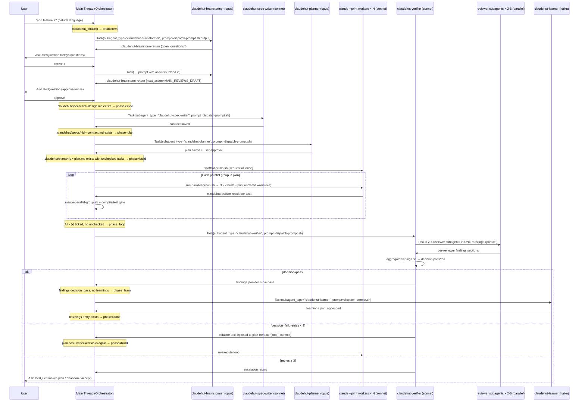

---

### Artifact-Derived Phase Detection

Phase is never written to a state file. `hooks/lib/state.sh::claudehut_phase()` derives it each time from what files exist on the current branch:

```
branch is main/master/trunk/develop   → none
.claudehut/ dir absent                → uninitialized
no .claudehut/specs/<id>-design.md    → brainstorm
no .claudehut/specs/<id>-contract.md  → spec
no .claudehut/plans/<id>-plan.md      → plan
plan has "- [ ]" line                 → build
findings.json decision == "fail"      → loop
findings.json decision == "pass"
  AND no learnings entry for task_id  → learn
learnings entry exists                → done
```

The task identity is the current git branch name (slashes → dashes). The orchestrator guardrail: "NEVER manually mutate phase. Phase derives from artifacts; create the artifact instead." Every phase auto-advances by the act of saving its output artifact.

---

### The Dispatch Contract Pattern

Every phase (except Build) follows the same skeleton: the **main thread** (orchestrator) calls the phase skill, the skill runs `scripts/dispatch-prompt.sh "$ARGUMENTS"` to compose a context-rich prompt, and the result is passed verbatim to `Task(subagent_type=..., prompt=...)`. The subagent runs in an **isolated context** (no access to main-thread conversation, file reads, or loaded skills beyond its `skills:` frontmatter).

**`dispatch-prompt.sh` composition order** (identical across all phases):
1. User intent
2. Active task-id + current phase + loop retry count (`$RETRIES/3`)
3. Stack signals (`.claudehut/memory/stack-signals.md`, ≤60 lines)
4. Project conventions (`.claudehut/memory/conventions.md`, ≤300 lines)
5. Recent learnings (`.claudehut/memory/learnings-recent.md`, ≤200 lines)
6. Prior-phase artifacts: design.md / contract.md / plan.md / findings.json (≤500 lines each, guarded by file existence)
7. For Build only: single task block extracted by task number (avoids flooding context with full plan)
8. Phase-specific instruction footer referencing the agent definition

All six phase scripts set `PHASE=<name>` and call `claudehut_loop_retries` from `state.sh`. The prompt header is always:
```
# ClaudeHut <phase> — task dispatch
**Task id**: $TASK_ID
**Phase (derived)**: $PHASE_DERIVED
**Loop retries**: $RETRIES/3
```

**Subagent context constraint**: `AskUserQuestion`, `Agent`, `EnterPlanMode`, `ScheduleWakeup`, and `WaitForMcpServers` are unavailable inside any subagent. This is why Brainstorm uses a return-and-relay loop (main thread relays questions) and why all phase subagents are "scan-and-return" with structured JSON payloads rather than interactive dialogs.

---

### Per-Phase Reference Table

| # | Phase | Skill | Agent Dispatched | Model | Trigger Condition | Input Artifacts | Output Artifact | Gates | Auto-Advance Mechanism |
|---|-------|-------|-----------------|-------|-------------------|----------------|----------------|-------|------------------------|
| 1 | **Brainstorm** | `claudehut:brainstorm` | `claudehut-brainstormer` (via Task tool, multi-iteration loop) | opus | `phase == brainstorm` (no design doc on branch) | stack-signals.md, conventions.md, learnings-recent.md, prior `answers[]` | `.claudehut/specs/<id>-design.md` | G1: reuse-scan ran; G2: design.md non-empty; G3: `design-doc-selfreview.sh` exits 0; user approval via AskUserQuestion | design.md saved + user approval → `claudehut_phase()` returns `spec` |
| 2 | **Spec** | `claudehut:spec` | `claudehut-spec-writer` (single Task dispatch) | sonnet | `phase == spec` (design.md exists, no contract.md) | design.md, stack-signals.md, conventions.md, learnings-recent.md | `.claudehut/specs/<id>-contract.md` | `validate-contract.sh` exits 0; user approval | contract.md saved → phase = `plan` |
| 3 | **Plan** | `claudehut:plan` | `claudehut-planner` (single Task dispatch) | opus | `phase == plan` (contract.md exists, no plan.md) | contract.md, design.md, stack-signals.md, learnings-recent.md | `.claudehut/plans/<id>-plan.md` | `plan-placeholder-scan.sh` + `plan-spec-coverage.sh` + `plan-parallel-group-scan.sh` all exit 0; user approval | plan.md with `- [ ]` checkboxes saved → phase = `build` |
| 4 | **Build** | `claudehut:build` | `claudehut-builder` via headless `claude --print` workers (NOT Task-tool subagents) — one per task per parallel group, each in isolated git worktree | sonnet | `phase == build` (plan has unchecked `- [ ]` tasks) | contract.md, plan.md (single task block injected per worker), design.md; `.claudehut` symlinked into each worktree | Production code commits (one per task); `- [x]` checkboxes in plan (set by `merge-parallel-group.sh`); `chore: scaffold stubs` commit | Per-group: `merge-parallel-group.sh` + `./gradlew compileTestJava test`; final: `./gradlew check` | All checkboxes `- [x]` → `claudehut_plan_has_unchecked` returns false → phase = `loop` |
| 5 | **Loop (Verify-Review)** | `claudehut:verify-review` | `claudehut-verifier` (single Task dispatch); verifier itself fans out 2–6 `claudehut-reviewer-*` subagents in **one parallel message** | sonnet (verifier); sonnet (reviewers) | `phase == loop` (plan complete, no findings.json or `decision=fail`) | design.md, contract.md, plan.md, prior findings.json | `.claudehut/findings/<id>-findings.json` with `decision: pass\|fail` | All verify gates green (build, test, coverage ≥ 0.80, lint, static, OWASP); `critical==0 AND high<3`; findings.json written with aggregated totals | `decision=pass` in findings.json → phase = `learn` OR `decision=fail` + refactor task injected → plan has unchecked tasks → phase reverts to `build` |
| 6 | **Learn** | `claudehut:learn` | `claudehut-learner` (single Task dispatch) | haiku | `phase == learn` (findings.json decision=pass, no learnings entry for task_id) | git diff since branch base, design.md, contract.md, plan.md, findings.json | `.claudehut/memory/learnings.jsonl` (append-only); `.claudehut/memory/index.md` regenerated | G1: every candidate passes `secret-scan.sh`; G2: entries appended with required schema; G3: ≥1 entry for task_id in learnings.jsonl | learnings.jsonl has entry for task_id → `claudehut_has_learnings` returns true → phase = `done` |

---

### Phase 1 — Brainstorm in Detail (Multi-Turn Loop)

Brainstorm is the only phase where the orchestrator may need to **re-dispatch the same subagent multiple times** in a session. The `claudehut-brainstormer` terminates after every turn, emitting a fenced `claudehut-brainstorm-return` JSON block:

```
{
  "task_id": "...",
  "design_doc": ".claudehut/specs/<id>-design.md",
  "open_questions": [{ "id": "q-scope", "question": "...", "options": [...], "multiSelect": false }],
  "blockers": [],
  "next_action": "MAIN_ASKS_USER | MAIN_REVIEWS_DRAFT | BLOCKED"
}
```

The main thread parses `next_action`:
- `MAIN_ASKS_USER` → call `AskUserQuestion` with `open_questions[]` verbatim; re-dispatch brainstormer with `answers[]` folded into prompt via `ANSWERS_JSON` env var.
- `MAIN_REVIEWS_DRAFT` → show ≤8-line summary of design.md + final approve/revise `AskUserQuestion`; on approve, phase advances.
- `BLOCKED` → surface blocker to user, stop loop.

The design doc may contain `<TBD:question-id>` placeholders for sections blocked on unanswered questions. `design-doc-selfreview.sh` accepts those; it only fails on non-placeholder ambiguities.

---

### Phase 4 — Build in Detail (Parallel Worktree Execution)

Build does **not** use the Claude `Task` tool for worker execution. It uses `scripts/run-parallel-group.sh`, which launches headless `claude --print` OS processes.

**Stub step (sequential, once before any group):**
`scripts/scaffold-stubs.sh` runs a single `claude --print --output-format json` session. It generates compiling skeleton code for every type/interface/signature the plan introduces, derived from contract.md + plan Files lists. Method bodies throw `UnsupportedOperationException("stub")`. The session resumes up to 3 times (`CLAUDEHUT_SCAFFOLD_MAX_ATTEMPTS`) if compile fails. A single `chore: scaffold stubs for <task-id>` commit is made. Workers branch from this commit, eliminating contract drift, hidden-dep failures, and semantic merge conflicts.

**Per-group loop:**
For each `Parallel group: N` value in the plan (sorted, ascending):
1. `run-parallel-group.sh <user-intent> <task-id> <plan-file> <N>` creates one git worktree per unchecked task in that group at `<tmp>/wt-<task-num>`.
2. Each worktree gets a `.claudehut` symlink to the main repo's `.claudehut/` so hooks and state can read the plan.
3. A `dispatch-prompt.sh "$USER_INTENT" "$TASK_NUM"` call generates a per-task prompt (only that task's block extracted from plan).
4. Each worker runs:
   ```bash
   CLAUDEHUT_TASK_ID=<id> CLAUDEHUT_WORKER=1 \
   claude --print --agent claudehut:claudehut-builder --model sonnet \
          --append-system-prompt "<guardrails>" "<prompt>"
   ```
   Tunables: `CLAUDEHUT_WORKER_MODEL` (default `sonnet`), `CLAUDEHUT_TASK_TIMEOUT` (default 900s; watchdog kills stalled workers).
5. Workers emit a fenced `claudehut-builder-result` block with `task_id`, `task`, `verify_status`, `commit_sha`.
6. `merge-parallel-group.sh` cherry-picks passing branches onto main, ticks `- [x]` checkboxes.
7. Per-group gate: `./gradlew compileTestJava test` (or Maven equivalent). Exits 1 on failure — surfaces to user before next group runs.

---

### Phase 5 — Loop: Verify, Review, and Retry

The `claudehut-verifier` agent:
1. Runs `scripts/run-verify-parallel.sh` — gates run in parallel where possible (build first sequential, then test + lint + static together, then integration + coverage together).
2. In **a single message**, dispatches 2–6 reviewer subagents in parallel:

| Reviewer subagent | Condition |
|---|---|
| `claudehut-reviewer-security` | always |
| `claudehut-reviewer-perf` | always |
| `claudehut-reviewer-style` | always |
| `claudehut-reviewer-db` | diff touches `db/migration/` or `*Repository.java` |
| `claudehut-reviewer-reactive` | `web_stack == webflux` |
| `claudehut-reviewer-mapping` | diff touches `*Mapper.java`, `*Dto.java`, `*Request.java`, `*Response.java` |

3. `scripts/aggregate-findings.sh` merges reviewer sections into totals and sets `decision: "pass" | "fail"` using:
   ```
   decision = "pass" if critical == 0 AND high < 3
   ```
4. The findings file is written to `.claudehut/findings/<id>-findings.json` (the authoritative path read by `claudehut_findings_decision()` in state.sh). Note: `run-verify-parallel.sh` and `reviewer-dispatch.md` reference an alternate path `.claudehut/state/tasks/<id>/findings.json`; this is an internal inconsistency in the repo — the phase-gating logic in state.sh uses the former path exclusively.

**Loop / retry logic:**
The retry counter is **not** read from a JSON state file. `state.sh::claudehut_loop_retries()` counts git commits whose subject line matches `^refactor\(loop\)` on the current branch:
```bash
git log --format='%s' "$branch" | grep -cE '^refactor\(loop\)'
```
The threshold is hardcoded to `3` in `retry-escalation.md`, all `dispatch-prompt.sh` scripts, and verifier G7. The `plugin.json` `userConfig.loop_max_retries` (default 3, range 1–10) declares this as a tunable but is not currently wired to replace the hardcoded constant anywhere in the codebase.

On FAIL:
- If `retries < 3`: verifier injects a synthetic refactor task into the plan (commit subject `refactor(loop): address findings from loop iteration N`). Plan now has a `- [ ]` entry → `claudehut_phase()` returns `build` → loop restarts from Build phase.
- If `retries ≥ 3`: verifier writes an escalation report and hands control back to user. The user may re-plan (resets counter, phase = `plan`) or explicitly accept (phase = `learn`).

---

### Phase 6 — Learn

The `claudehut-learner` agent runs on `haiku` (cheapest model; task is extraction, not reasoning). It:
1. Runs `scripts/learn-extract.sh` — proposes candidates from `git diff <merge-base>..HEAD`, heuristically categorized by file pattern (`*Mapper.java` → `pattern/mapstruct`, `db/migration/V*.sql` → `pattern/flyway`, etc.).
2. Categorizes each entry: `pattern | anti-pattern | decision | gotcha | command | tombstone`.
3. Runs `scripts/secret-scan.sh` on every candidate — rejects any matching secret regex patterns before write.
4. Appends clean entries (append-only, never edits prior entries) to `.claudehut/memory/learnings.jsonl`.
5. Runs `scripts/reindex.sh` → regenerates `.claudehut/memory/index.md`.
6. Runs `scripts/promote.sh` — if `global_promotion_opt_in == true` in `claudehut-config.json` AND an entry's `signature` appears in ≥ `promotion_min_projects` (default 3) distinct project hashes in `~/.claude/claudehut/memory/projects.json`, the entry is copied to `~/.claude/claudehut/memory/patterns.jsonl`.

Phase advances to `done` when `claudehut_has_learnings()` finds `"task_id":"<id>"` in learnings.jsonl.

---

### Key File Paths

| Artifact | Path |
|---|---|
| Design document | `.claudehut/specs/<task-id>-design.md` |
| Contract document | `.claudehut/specs/<task-id>-contract.md` |
| Plan document | `.claudehut/plans/<task-id>-plan.md` |
| Findings + decision | `.claudehut/findings/<task-id>-findings.json` |
| Project learnings | `.claudehut/memory/learnings.jsonl` |
| Memory index | `.claudehut/memory/index.md` |
| Stack signals | `.claudehut/memory/stack-signals.md` |
| Conventions | `.claudehut/memory/conventions.md` |
| Worker logs | `.claudehut/logs/group<N>-task<M>.log` |
| Global promoted patterns | `~/.claude/claudehut/memory/patterns.jsonl` |
| State library | `hooks/lib/state.sh` |
| Phase dispatch scripts | `skills/<phase>/scripts/dispatch-prompt.sh` |

---

## 4. Agent System (17 Subagents)

The ClaudeHut pipeline is composed of 17 agents defined as Markdown files under `/agents/`. One of them — `claudehut-orchestrator` — is explicitly **non-spawnable** (the main Claude Code thread enacts it directly via a SessionStart hook). The remaining 16 are spawned as subagents via the `Task` tool.

---

### Frontmatter Contract

Every agent file opens with a YAML frontmatter block that acts as the runtime contract for Claude Code's subagent loader:

```yaml
---
name: claudehut-<agent-name>
description: <one-line purpose + spawn eligibility note>
model: sonnet | opus | haiku
tools: <comma-separated allowlist>
skills:               # optional — preloaded before the task prompt
  - claudehut:<skill-name>
---
```

| Field | Meaning |
|---|---|
| `name` | Stable identifier used in `Task(subagent_type=...)` calls |
| `description` | Human + orchestrator routing hint; orchestrator's description explicitly reads "DO NOT SPAWN as subagent (recursive call)" |
| `model` | Model tier assigned to the agent (see table below) |
| `tools` | Explicit tool allowlist — the agent cannot call tools outside this list |
| `skills` | Skills preloaded into the subagent's context before the task prompt; each entry is a `claudehut:<name>` skill pointer |

---

### Shared Behavioral Pattern: Goals / Gates / Guardrails / Heuristics (G/G/G/H)

Every agent body (except the orchestrator, which adds a Routing table) uses the same four-section behavioral scaffold:

| Section | Purpose |
|---|---|
| **Goals** | Desired end-states expressed as observable outcomes, not instructions |
| **Gates** | Numbered preconditions (`G0`, `G1`, …) that must be satisfied before the agent can exit a phase. Each gate is binary (script exit code, file existence, user approval verb) |
| **Guardrails** | Absolute prohibitions written as `NEVER …` / `ALWAYS …` imperatives — the agent must not rationalize past them |
| **Heuristics** | Situational rules in the form `**<condition>** → <action/severity>`. They encode calibrated judgment the agent applies when facts are ambiguous |

This pattern exists verbatim across all 16 spawned agents and in the orchestrator itself.

---

### Skill Discipline and the 1% Rule

Every spawned agent carries an identical **"Skill Discipline"** section (introduced immediately after the Exit heading) that encodes two invariants:

1. **Isolated context.** A subagent starts with only: (a) the `CLAUDE.md` hierarchy, (b) a git status snapshot, (c) skills listed in its own `skills:` frontmatter, and (d) the dispatch prompt. No conversation history, no main-thread file reads, no other loaded skills are visible.

2. **The 1% rule (non-negotiable).** Quoted verbatim from every agent:

   > *"Even a 1% chance a skill matches the work in front of you means you MUST invoke that skill to check."*

   The rule explicitly lists domain-specific skills (e.g., `jpa-hibernate`, `spring-webflux`, `mapstruct`, `kafka-*`), safety skills (`owasp-scan`, `flyway-migration`, `secret-scan`), and workflow skills (`tdd-cycle`, `reuse-scan`). Skipping is framed as "guessing in your own head where authoritative content already exists." The justification: "Skill invocation cost is small. Skipping cost is silent drift from project conventions and missed safety gates."

---

### Subagent Isolation and Runtime-Blocked Tools

All spawned agents are prohibited from using the following tools, which the `claudehut-brainstormer.md` documents as blocked by Anthropic's subagent runtime (source cited: `code.claude.com/docs/en/sub-agents §Available tools`):

- `Agent`
- `AskUserQuestion`
- `EnterPlanMode`
- `ExitPlanMode` (unless `permissionMode` is `plan`)
- `ScheduleWakeup`
- `WaitForMcpServers`

This is why the brainstormer — which needs to ask the user questions — surfaces them as structured `open_questions[]` in its return payload and lets the main thread call `AskUserQuestion` on its behalf.

The orchestrator is marked non-spawnable via its description field:

> `"Main-thread role marker — DO NOT SPAWN as subagent (recursive call)."`

Its own body reinforces this with a direct instruction: "Do not call `Task(subagent_type="claudehut-orchestrator", ...)` — that recurses. You are the orchestrator."

---

### Agent Inventory Table

| Agent | File | Model | Preloaded Skills | Role | Dispatched By |
|---|---|---|---|---|---|
| **claudehut-orchestrator** | `agents/claudehut-orchestrator.md` | sonnet | — (main thread; not spawned) | Routes phases, owns session state, never writes code | SessionStart hook (reads file for orientation) |
| **claudehut-brainstormer** | `agents/claudehut-brainstormer.md` | opus | `claudehut:using-claudehut`, `claudehut:brainstorm`, `claudehut:reuse-scan` | Phase 1: scan codebase, draft design doc, enumerate open decisions, return structured payload | Orchestrator (`/claudehut:brainstorm` skill) |
| **claudehut-spec-writer** | `agents/claudehut-spec-writer.md` | sonnet | `claudehut:using-claudehut`, `claudehut:spec` | Phase 2: convert approved design into Given/When/Then contract with Java types, NFR numbers, edge cases | Orchestrator (`/claudehut:spec` skill) |
| **claudehut-planner** | `agents/claudehut-planner.md` | opus | `claudehut:using-claudehut`, `claudehut:plan`, `claudehut:tdd-cycle` | Phase 3: decompose contract into 2–5 min task blocks with DAG, parallel groups, file paths, risk tags | Orchestrator (`/claudehut:plan` skill) |
| **claudehut-builder** | `agents/claudehut-builder.md` | sonnet | `claudehut:using-claudehut`, `claudehut:build`, `claudehut:tdd-cycle` | Phase 4: execute ONE plan task (RED→GREEN→REFACTOR→commit) in isolated git worktree | Orchestrator — one instance per task per parallel group |
| **claudehut-verifier** | `agents/claudehut-verifier.md` | sonnet | `claudehut:using-claudehut`, `claudehut:verify-review` | Phase 5: run verify gates, dispatch reviewer fleet in parallel, aggregate findings, decide pass/fail | Orchestrator (`/claudehut:verify-review` skill) |
| **claudehut-learner** | `agents/claudehut-learner.md` | haiku | `claudehut:using-claudehut`, `claudehut:learn` | Phase 6: extract patterns/anti-patterns from diff + findings, append to `learnings.jsonl`, reindex | Orchestrator (`/claudehut:learn` skill) |
| **claudehut-reuse-scanner** | `agents/claudehut-reuse-scanner.md` | haiku | `claudehut:using-claudehut`, `claudehut:reuse-scan` | Codebase reuse detection (Understand-Anything or Graphify backends; grep fallback); invoked from brainstorm phase and PreToolUse hook | Brainstormer; PreToolUse hook on `*.java` create |
| **claudehut-migration-validator** | `agents/claudehut-migration-validator.md` | haiku | `claudehut:using-claudehut`, `claudehut:flyway-migration` | Pre-write SQL migration safety check (naming, online DDL safety, rolling-deploy compat); returns `pass|warn|block` JSON | PreToolUse hook on `**/db/migration/V*.sql` |
| **claudehut-test-runner** | `agents/claudehut-test-runner.md` | haiku | `claudehut:using-claudehut`, `claudehut:tdd-cycle` | Run one Gradle/Maven test command; return structured JSON summary ≤ 4 KB; no analysis | Builder (RED/GREEN steps); Verifier |
| **claudehut-stack-detector** | `agents/claudehut-stack-detector.md` | haiku | `claudehut:using-claudehut` | One-shot Java/Spring stack detection; writes `stack-signals.md`; runs at SessionStart or when signals >14 days old | SessionStart hook |
| **claudehut-reviewer-security** | `agents/claudehut-reviewer-security.md` | sonnet | `claudehut:using-claudehut`, `claudehut:owasp-scan` | Security review: OWASP Top 10, Spring Security misconfig, SpEL injection, Jackson deserialization, hardcoded secrets | Verifier (always dispatched) |
| **claudehut-reviewer-perf** | `agents/claudehut-reviewer-perf.md` | sonnet | `claudehut:using-claudehut` | Performance review: N+1, blocking in reactive chains, unbounded streams, pool misuse | Verifier (always dispatched) |
| **claudehut-reviewer-db** | `agents/claudehut-reviewer-db.md` | sonnet | `claudehut:using-claudehut`, `claudehut:r2dbc`, `claudehut:jpa-hibernate` | DB review: migration online safety, JPA/R2DBC correctness, EXPLAIN ANALYZE via Postgres MCP (dev only) | Verifier (when `db/migration/` or `*Repository.java` in diff) |
| **claudehut-reviewer-reactive** | `agents/claudehut-reviewer-reactive.md` | sonnet | `claudehut:using-claudehut`, `claudehut:spring-webflux` | Reactive correctness: subscribe leaks, blocking-in-chain, wrong scheduler, context propagation | Verifier (when `web_stack == webflux`) |
| **claudehut-reviewer-style** | `agents/claudehut-reviewer-style.md` | haiku | `claudehut:using-claudehut`, `claudehut:lombok` | Style/idiom review: Java 17+ idioms, SOLID, naming, over-engineering; most findings Low | Verifier (always dispatched) |
| **claudehut-reviewer-mapping** | `agents/claudehut-reviewer-mapping.md` | haiku | `claudehut:using-claudehut`, `claudehut:mapstruct`, `claudehut:jackson` | MapStruct config + Jackson polymorphism/DTO correctness | Verifier (when `*Mapper.java`, `*Dto.java`, `*Request.java`, `*Response.java`, or `*ObjectMapper*.java` in diff) |

---

### Model Assignment Rationale

| Model | Agents | Observed rationale |
|---|---|---|
| **opus** | brainstormer, planner | Highest creative and reasoning load: open-ended design, complex DAG construction with BFS parallelism |
| **sonnet** | orchestrator, spec-writer, builder, verifier, reviewer-security, reviewer-perf, reviewer-db, reviewer-reactive | Balanced reasoning + code production; security and performance judgment demands mid-tier |
| **haiku** | learner, reuse-scanner, migration-validator, test-runner, stack-detector, reviewer-style, reviewer-mapping | Narrow, well-defined tasks with structured outputs; cost/latency optimization |

---

### The Builder Agent in Detail

`claudehut-builder` is the **only agent that writes production code** in the entire system.

**Dispatch model.** The orchestrator (via the `/claudehut:build` skill) spawns one builder instance per plan task number within a parallel group. Each instance runs in an **isolated git worktree** branched from a _stub commit_ — all required types and interfaces are pre-scaffolded as stubs (`UnsupportedOperationException("stub")` or returning `null`). The builder fills in exactly one behavior.

**The single-task invariant.** The dispatch prompt always contains exactly one `Task N:` assignment. The agent is forbidden from iterating to the next task (`NEVER execute more than ONE task`). This design enables the parallel group mechanism: the orchestrator can dispatch tasks within a group to concurrent builder instances with no shared mutable state.

**TDD enforcement.** The RED→GREEN→REFACTOR cycle is enforced by gates, not by the model's goodwill:

- **G2**: RED command must exit non-zero AND the failure must match the expected type (`NoSuchMethodError`, `AssertionFailedError`, or a specific exception). A test that passes immediately is deleted and rewritten.
- **G3**: The `Verify` command must exit 0; ALL neighbor tests in the same class must pass.
- **G4**: Commit message must follow Conventional Commits.

**`claudehut-builder-result` contract.** The builder's final message must be a fenced block tagged `claudehut-builder-result`. The orchestrator cannot merge the worktree branch without it:

```
claudehut-builder-result
{
  "task_id": "<task-id>",
  "task": <N>,
  "verify_status": "pass|fail",
  "commit_sha": "<sha>",
  "error": null
}
```

`verify_status: "fail"` signals that RED was confirmed but GREEN never turned green; the orchestrator does NOT merge and surfaces to the user.

The builder's `tools` allowlist adds `Edit` and `Write` that no other agent (except orchestrator) has. PreToolUse hooks enforce file-scope: only files listed in the task's `create:`/`modify:`/`test:` fields are writable.

---

### The Reviewer Fleet

The verifier dispatches all applicable reviewers **in a single message** (multiple parallel `Task` invocations). Serializing them is an explicit guardrail violation (`NEVER serialize reviewer dispatch`).

Each reviewer is **read-only** — `Edit` and `Write` are absent from every reviewer's `tools` frontmatter. Findings are written to a shared JSON file at `.claudehut/findings/<task-id>-findings.json` under a reviewer-specific key (`#reviewers.<name>`), via the SubagentStop hook.

**Conditional dispatch matrix** (from `claudehut-verifier.md`):

| Reviewer | Always | Trigger condition |
|---|---|---|
| `claudehut-reviewer-security` | Yes | — |
| `claudehut-reviewer-perf` | Yes | — |
| `claudehut-reviewer-style` | Yes | — |
| `claudehut-reviewer-db` | No | diff touches `db/migration/` or `*Repository.java` |
| `claudehut-reviewer-reactive` | No | `web_stack == webflux` (from `stack-signals.md`) |
| `claudehut-reviewer-mapping` | No | diff touches `*Mapper.java`, `*Dto.java`, `*Request.java`, `*Response.java`, `*ObjectMapper*.java` |

**Decision rule.** The verifier aggregates all reviewer findings and applies a binary decision: `0 critical AND 0 high → pass`; any critical or high finding → `fail`. On fail with `retries < 3`, the verifier injects a refactor task into the plan (commit message prefixed `refactor(loop):` to increment the retry counter). On `retries >= 3`, the verifier escalates to the user and stops looping.

**Reviewer-specific specializations:**

- `reviewer-security` cites OWASP categories per finding; Critical findings include `enableDefaultTyping` (Jackson RCE), `Runtime.exec` with user input, and CORS `allowedOrigins("*")` with credentials.
- `reviewer-reactive` gates on `web_stack == webflux`; its most severe pattern is `.block()` in a production reactive chain (Critical). It explicitly exempts `.block()` in StepVerifier test code.
- `reviewer-db` is the only reviewer that may query a live database — read-only, dev/staging only, via `mcp__postgres__query`. It refuses if the connection string matches production indicators.
- `reviewer-mapping` treats `mapper.enableDefaultTyping()` as always-Critical with no context override (explicitly stated: "NEVER skip clear `enableDefaultTyping` / `activateDefaultTyping` violation — always Critical").
- `reviewer-style` defaults all findings to Low; Medium requires an explicit reasoning note. It is explicitly prohibited from replicating what Spotless/Checkstyle already check.

---

### Orchestrator Flow (Non-Spawnable Main Thread)

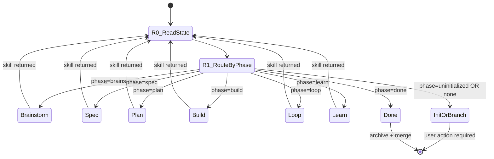

The orchestrator's core invariant: it **never writes production code** and **never manually advances phase**. Phase state derives from artifact existence on disk — the orchestrator only creates artifacts indirectly by routing to the phase agent that creates them.

Every orchestrator response opens with `[claudehut] task=<id> phase=<phase>` and ends when either a skill returned (re-read phase), user input is required (single specific question), or the task is in `done` phase.

---

## 5. Skill system (30 skills)

ClaudeHut ships 30 skills under `skills/*/SKILL.md`. Each skill is a self-contained knowledge unit loaded into an agent's context window on demand via the `Skill` tool or preloaded via agent `skills:` frontmatter. The count in the task prompt says "30 skills" but the live filesystem at `/Users/taiphan/Documents/Projects/lab/claudehut/claudehut/skills/` contains exactly 29 directories, each with one `SKILL.md`.

---

### SKILL.md frontmatter contract

Every `SKILL.md` begins with a YAML frontmatter block parsed by the Claude Code harness. The full specification lives in `skills/write-skill/references/frontmatter-contract.md`.

| Field | Required | Constraints | Effect |
|---|---|---|---|
| `name` | Yes | Lowercase kebab-case; **must equal folder name exactly** | Resolves `/claudehut:<name>` slash command |
| `description` | Yes | ≤ 200 chars recommended (hard limit 500); must encode both *what* and *when-to-use triggers* | **This is the only content read to decide auto-trigger** — body only loads after trigger fires |
| `allowed-tools` | No | List e.g. `[Read, Grep, Bash]` | Restricts tool set inside the skill invocation |
| `disable-model-invocation` | No | `true` / `false` | When `true`, skill is only invokable via explicit slash command — never auto-triggers from description match |
| `model` | No | e.g. `claude-haiku-4-5` | Pins the model for that skill invocation |

Non-standard `claudehut:` extensions (`phase`, `mandatory`, `triggers`, `auto-enforce-when`, `produces`, `next-phase-skill`) are read by `hooks/prompt-router.sh` for phase routing and auto-enforce decisions. The harness ignores them if `prompt-router.sh` is absent.

The structural contract enforced by `scripts/validate-skill.sh`:
- Folder name = `name` in frontmatter (identical, case-exact).
- Body ≤ 500 lines; target ≤ 300.
- No `README.md`, `INSTALL.md`, or `CHANGELOG.md` inside the skill folder (Anthropic guideline).
- Sub-directories: `references/` (≤ 200 lines per file, TOC mandatory if > 100), `scripts/`, `assets/templates/`.

---

### Invocation mechanisms

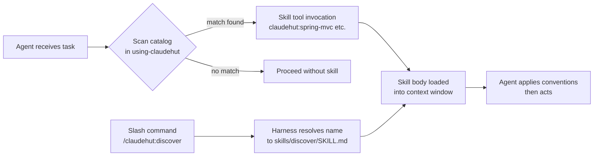

Two invocation paths exist:

1. **Skill tool (programmatic)** — an agent calls `Skill("claudehut:spring-mvc")`. The harness loads the full `SKILL.md` body into the agent's context. This is the primary path inside subagents.
2. **Slash command (interactive)** — a human types `/claudehut:discover`. The harness resolves the name to `skills/discover/SKILL.md`. Skills with `disable-model-invocation: true` (`systematic-debug`, `write-skill`) are *only* reachable this way.

---

### Preload vs discovery

**Preload via agent frontmatter** — Agent definition files (in `agents/`) carry a `skills:` list. Those skills are injected into the agent's context window at dispatch time, before the first turn:

```yaml
# agents/claudehut-builder.md
skills:
  - claudehut:using-claudehut
  - claudehut:build
  - claudehut:tdd-cycle
```

`claudehut-brainstormer` preloads `using-claudehut`, `brainstorm`, and `reuse-scan`. `claudehut-builder` preloads `using-claudehut`, `build`, and `tdd-cycle`. Every dispatch-eligible agent preloads `using-claudehut`.

**Discovery via catalog** — `using-claudehut` contains a generated catalog table (between `<!-- catalog:begin -->` and `<!-- catalog:end -->` markers). Because it is preloaded into every agent, a subagent always has the full catalog in context and can call any other skill on demand when its work touches a matching domain.

---

### The `using-claudehut` bootstrap

`skills/using-claudehut/SKILL.md` is the most structurally significant skill. It is not invoked for its domain knowledge — it is preloaded into **every dispatch-eligible agent** as the discipline carrier.

Its body establishes three contracts:

1. **The 1% rule (non-negotiable invocation rule)**
   > *Even a 1% chance a skill matches the work in front of you means you MUST invoke that skill to check.*
   The rule is stated as a hard constraint, not a heuristic. Six named rationalizations ("I already know this pattern", "Task is small", etc.) are explicitly listed and rebutted in a red-flags table.

2. **Dispatch-to-skill mapping table** — A lookup table maps each `subagent_type` × file pattern to the required skill. Example: `claudehut-builder` touching `*KafkaListener.java` → must invoke `claudehut:kafka-consumer`. This mapping is human-authored and lives in the skill body, not in a hook.

3. **Termination contract** — Documents that `AskUserQuestion`, `Agent`, `EnterPlanMode`, `ExitPlanMode`, `ScheduleWakeup`, and `WaitForMcpServers` are unavailable in subagent contexts. Subagents must use the scan-and-return pattern: draft artifact, emit structured return block with `open_questions[]`, terminate. The main thread relays questions to the user.

**Catalog regeneration** — The catalog table inside `using-claudehut/SKILL.md` is machine-generated and must not be hand-edited. The script `scripts/regen-using-claudehut.sh`:
- Enumerates `skills/*/SKILL.md` via `find … | LC_ALL=C sort` (locale-independent for CI portability).
- Extracts `name` and `description` from each frontmatter block using `awk`.
- Truncates descriptions to 180 bytes via `LC_ALL=C awk substr` (consistent across macOS BSD and GNU `cut` for multibyte characters — several descriptions contain Vietnamese and em-dash characters).
- Rewrites only the `<!-- catalog:begin --> … <!-- catalog:end -->` block, preserving the hand-authored discipline narrative above it.
- Is idempotent: skips the file write if content is unchanged.

Run after any skill add, remove, or description edit.

---

### Skill catalog

| Skill | Category | What it provides | Trigger |
|---|---|---|---|
| `claudehut:brainstorm` | Workflow — phase 1 | Codebase scan + reuse detection, design document draft, `open_questions[]` payload for main thread | Natural language "add / implement / build / design / refactor / fix bug" + noun; or `/claudehut:brainstorm` |
| `claudehut:spec` | Workflow — phase 2 | Converts approved design into Given/When/Then behavioral contract; produces `.claudehut/specs/<id>-contract.md` | `phase=spec` or explicit invocation after Brainstorm approval |
| `claudehut:plan` | Workflow — phase 3 | Breaks contract into file-level tasks (2–5 min chunks), RED test commands, GREEN steps, DAG dependencies; produces `.claudehut/plans/<id>-plan.md` | `phase=plan` or after Spec approval |
| `claudehut:build` | Workflow — phase 4 | Dispatches parallel builder subagents per DAG group, each in isolated git worktree; merges results; strict TDD per task | `phase=build` or after Plan approval |
| `claudehut:verify-review` | Workflow — phase 5 | Runs verify pipeline (build/tests/coverage/lint/static/security); dispatches parallel reviewer subagents; pass-or-refactor with max 3 retries | `phase=loop`; preloaded into `claudehut-verifier` |
| `claudehut:learn` | Workflow — phase 6 | Extracts patterns, anti-patterns, decisions, reusable snippets; persists to `.claudehut/memory/learnings.jsonl`; updates `index.md`; promotes to global tier at threshold | `phase=learn`; after Verify-Review passes |
| `claudehut:init` | Workflow — bootstrap | Scaffolds `.claudehut/` directory (memory/, specs/, plans/, state/, rules/); refuses if already initialized | `/claudehut:init`; one-time per project |
| `claudehut:discover` | Workflow — diagnostic | Read-only status dump: active task, current phase, detected stack, loaded skills/agents/rules/hooks, integration backend status, MCP server status | `/claudehut:discover`; on-demand |
| `claudehut:spring-mvc` | Domain — web layer | `@RestController` conventions, validation, `ResponseEntity`, `@ControllerAdvice`, RFC 7807 `ProblemDetail`, JWT auth integration for Spring Boot 3.x servlet stack | Auto: editing `**/*Controller.java` in projects with `web_stack=mvc` |
| `claudehut:spring-webflux` | Domain — web layer | `RouterFunctions` + Handler pattern, schedulers, context propagation, `StepVerifier` testing, backpressure for Spring Boot 3.x reactive stack | Auto: editing `**/*Handler.java` or `**/*Controller.java` with `web_stack=webflux` |
| `claudehut:jpa-hibernate` | Domain — persistence | `@Entity` mapping, fetch strategies (N+1 prevention), `@Transactional` semantics, JPQL/Criteria, projection patterns for servlet stack | Auto: editing `**/*Repository.java` or `**/*Entity.java` with `orm=jpa` |
| `claudehut:r2dbc` | Domain — persistence | `ReactiveCrudRepository`, `R2dbcEntityTemplate`, reactive transactions, converter setup, Testcontainers integration for WebFlux stack | Auto: editing `**/*Repository.java` with `orm=r2dbc` |
| `claudehut:mapstruct` | Domain — mapping | `@Mapping` / `@MappingTarget` / `@BeanMapping` config, null strategies, Lombok interop, before/after mapping hooks, generated impl review | Auto: editing `**/*Mapper.java` with `@Mapper` annotation |
| `claudehut:jackson` | Domain — serialization | `ObjectMapper` config, polymorphic deserialization (subtype whitelist), `JavaTimeModule`, mixins, mass-assignment prevention for Spring Boot 3.x | Auto: editing `**/*Dto.java`, `**/*Request.java`, `**/*Response.java`, `**/ObjectMapper*.java`, `**/JsonConfig*.java` |
| `claudehut:kafka-consumer` | Domain — messaging | `@KafkaListener`, manual ack modes, DLT pattern, retry topic, idempotency via dedup store, JSON/Avro deserialization | Auto: editing `**/*Listener*.java` or `**/*Consumer*.java` with `messaging=kafka` |
| `claudehut:kafka-producer` | Domain — messaging | Idempotent producer config, transactional outbox pattern, Schema Registry integration, JSON/Avro serialization, retry + backoff | Auto: editing `**/*Producer*.java` or `**/*Publisher*.java` with `messaging=kafka` |
| `claudehut:rabbitmq` | Domain — messaging | Exchange/queue/binding topology, manual ack, DLX (dead-letter exchange) pattern, retry policy, message TTL (Spring AMQP) | Auto: editing `**/*RabbitListener*.java` with `messaging=rabbitmq` |
| `claudehut:nats` | Domain — messaging | JetStream durable consumers, ack policies, streams + consumers, replay (jnats library) | Auto: editing `**/*NatsListener*.java` or `**/*NatsClient*.java` with `messaging=nats` |
| `claudehut:redis-cache` | Domain — caching | `@Cacheable` key strategy, TTL/eviction policies, Redisson distributed lock patterns, `RedisTemplate` config + serialization | Auto: editing `**/*Cache*.java` or files using `@Cacheable` |
| `claudehut:testcontainers` | Domain — testing | Singleton vs per-class lifecycle, reuse flag, network sharing, Postgres/Kafka/Redis containers, dynamic Spring properties | Auto: editing `**/*IT.java` or `src/integrationTest/**/*.java` |
| `claudehut:wiremock-stub` | Domain — testing | Stub mapping JSON format, scenario-based stateful stubs, request matching strategies, fault injection for HTTP integration tests | Auto: editing `src/test/**/*Wiremock*.java` or `**/__stubs/*.json` |
| `claudehut:flyway-migration` | Domain — schema | Naming conventions, online-safe DDL (`CREATE INDEX CONCURRENTLY`, expand-contract for renames), idempotency, backfill patterns for PostgreSQL/MySQL | Auto: editing `**/db/migration/V*.sql` or `R*.sql` |
| `claudehut:lombok` | Domain — code generation | Safe-annotation matrix, JPA-entity / Jackson / MapStruct interop traps, builder patterns with inheritance and defaults, recommended `lombok.config` | Auto: any `.java` file with Lombok annotation (`@Data`, `@Value`, `@Builder`, `@SuperBuilder`, `@Slf4j`, `@RequiredArgsConstructor`, …) or `lombok.*` import — even a one-line `@Slf4j` edit triggers via the 1% rule |
| `claudehut:owasp-scan` | Domain — security | OWASP dependency-check + Spring Security misconfig regex scans; structured findings; fails build on High/Critical CVEs | Used in Phase 5 verify stage; `/claudehut:owasp-scan` for on-demand |
| `claudehut:arch-unit-check` | Domain — architecture | Runs ArchUnit tests to enforce package-layout / hexagonal / DDD rules; optional (skips if ArchUnit not on classpath) | Used in Phase 5 verify stage; `/claudehut:arch-unit-check` for ad-hoc |
| `claudehut:tdd-cycle` | Workflow discipline | Enforces RED → GREEN → REFACTOR; detects and rejects anti-patterns (prod-before-test, test-after, manual-test rationalization) | Required every Build phase task; auto: test files in scope; preloaded into `claudehut-builder` |
| `claudehut:reuse-scan` | Workflow discipline | Scans codebase for reusable implementations before creating new classes; detects and invokes Understand-Anything / Graphify if installed; fallback grep + heuristic | Auto: Phase Brainstorm step 2; `PreToolUse(Write)` for new Java files; `/claudehut:reuse-scan <topic>` |
| `claudehut:systematic-debug` | Workflow discipline | Structured reproduce → isolate (bisect) → root cause → test → fix protocol; `disable-model-invocation: true` | On-demand only: `/claudehut:debug <symptom>` or explicit Skill tool call; does not auto-trigger |
| `claudehut:using-claudehut` | Meta | Preloads the 1% invocation rule, dispatch-to-skill mapping table, termination contract, and full generated skill catalog into every dispatch-eligible subagent | Preloaded via `skills:` frontmatter in every agent definition; not invoked for domain knowledge |
| `claudehut:write-skill` | Meta | Scaffolds new skill directory (3-bucket layout: `SKILL.md` + `references/` + `scripts/` + `assets/templates/`); validates frontmatter contract; `disable-model-invocation: true` | `/claudehut:write-skill <skill-name> <description>` |

---

### Skill anatomy (3-bucket layout)

```
skills/<name>/
├── SKILL.md              ← frontmatter + body (≤ 500 lines, target ≤ 300)
├── references/           ← supporting docs (≤ 200 lines each, TOC if > 100)
│   └── *.md
├── scripts/              ← bash helpers invoked from SKILL.md body
│   └── *.sh
└── assets/
    └── templates/        ← code or config templates
        └── *.java / *.json / …
```

No `README.md`, `INSTALL.md`, or `CHANGELOG.md` are permitted inside a skill folder (Anthropic guideline enforced by `scripts/validate-skill.sh`).

---

### Category summary

| Category | Skills | Count |
|---|---|---|
| Workflow phases (ordered) | brainstorm → spec → plan → build → verify-review → learn | 6 |
| Workflow utilities | init, discover | 2 |
| Domain — web layer | spring-mvc, spring-webflux | 2 |
| Domain — persistence | jpa-hibernate, r2dbc | 2 |
| Domain — messaging | kafka-consumer, kafka-producer, rabbitmq, nats | 4 |
| Domain — mapping / serialization | mapstruct, jackson, lombok | 3 |
| Domain — caching | redis-cache | 1 |
| Domain — testing | testcontainers, wiremock-stub | 2 |
| Domain — schema / migrations | flyway-migration | 1 |
| Domain — security / architecture | owasp-scan, arch-unit-check | 2 |
| Workflow discipline | tdd-cycle, reuse-scan, systematic-debug | 3 |
| Meta | using-claudehut, write-skill | 2 |
| **Total** | | **32** |

> Note: The filesystem contains 29 skill directories. The catalog inside `using-claudehut/SKILL.md` lists 28 entries (excluding `using-claudehut` itself). The category table above counts 32 because `lombok` spans both "mapping/serialization" and could be argued under "code generation" — adjust categorization boundaries as needed for the review audience.

---

## 6. Rules system (45 rules)

ClaudeHut ships 45 Markdown rule files organized into six category directories under `rules/`. At project init, `scripts/state/init-project.sh` copies them into the project's `.claude/rules/` directory — the location Claude Code's **native built-in loader** reads. From that point forward, Claude Code loads each rule whenever it reads a file whose path matches the rule's `paths:` frontmatter glob. No custom hook injection is involved; `hooks/pre-tool.sh` lines 120–123 states this explicitly: *"Rule auto-load is handled natively … loaded by Claude Code's built-in loader."*

> **Doc discrepancy:** The README's architecture diagram (line 317) cites "45 rules / 11 framework." The real file count is **45 rules / 14 framework**. The README is stale; the files on disk are authoritative.

---

### Category inventory

| Category | Count | Severity distribution | Stack-conditional rules |
|---|---|---|---|
| `architecture/` | 5 | high×2, medium×2, low×1 | none |
| `coding/` | 7 | high×1, medium×5, low×1 | none |
| `framework/` | 14 | critical×2, high×8, medium×4 | 8 of 14 |
| `performance/` | 5 | high×2, medium×3 | 1 (`backpressure`, web=webflux) |
| `security/` | 6 | critical×4, high×2 | none |
| `testing/` | 8 | high×1, medium×6, low×1 | 1 (`stepverifier`, web=webflux) |

---

### Rule frontmatter schema

Every rule file opens with a YAML frontmatter block. The schema has three load-bearing fields and two informational ones:

```yaml
---
id: rules/framework/spring-mvc           # dot-path identifier; used by findings JSON
paths:                                    # Claude Code native loader globs (required)
  - "**/*Controller.java"
stack: "web=mvc"                          # optional: key=value constraint from stack-signals.md
severity: high                           # advisory severity: critical | high | medium | low
tags: [spring-mvc, rest, controller]     # informational; used by reviewers and verify-review
---
```

**`paths:` glob** — the native Claude Code loader evaluates this against every file Claude reads or edits in a session. There is no hook involved. When a match fires, the rule's full Markdown is injected as context for that interaction.

**`stack:` conditional** — present on exactly 10 of 45 rules. `init-project.sh`'s `_rule_matches_stack()` function (line 106–128 of the script) parses the project's `.claudehut/memory/stack-signals.md` for a line of the form `- key: value`. If the detected value does not match the rule's constraint, the file is **not copied to `.claude/rules/`** — so it can never fire at all. If the stack signal is `unknown`, stack-conditional rules are also skipped until detection runs.

**`severity:`** — does not directly gate anything at load time. It is the field reviewers in the Loop phase interpret to classify findings and apply the pass/fail decision rule (`critical=0 AND high=0 → pass`).

---

### Stack signals consumed by `stack:` constraints

The 10 stack-conditional rules and their constraints are:

| Rule file | `stack:` constraint | Copied when |
|---|---|---|
| `framework/spring-mvc.md` | `web=mvc` | Web stack detected as Spring MVC |
| `framework/webflux.md` | `web=webflux` | Web stack detected as WebFlux |
| `framework/jpa.md` | `orm=jpa` | ORM detected as JPA/Hibernate |
| `framework/r2dbc.md` | `orm=r2dbc` | ORM detected as R2DBC |
| `framework/kafka-consumer.md` | `messaging=kafka` | Messaging detected as Kafka |
| `framework/kafka-producer.md` | `messaging=kafka` | Messaging detected as Kafka |
| `framework/mapstruct.md` | `mapper=mapstruct` | Mapper detected as MapStruct |
| `framework/redis.md` | `cache=redis` | Cache detected as Redis |
| `performance/backpressure.md` | `web=webflux` | Web stack detected as WebFlux |
| `testing/stepverifier.md` | `web=webflux` | Web stack detected as WebFlux |

The `spring-mvc` and `webflux` rules are mutually exclusive: only one is ever present in `.claude/rules/` for a given project. Similarly, `jpa.md` and `r2dbc.md` are mutually exclusive via `orm=`.

---

### Per-file pattern-to-rule mapping (from `skills/build/SKILL.md`)

The `build` skill documents the practical mapping between file naming conventions and the rules that fire on each. Both JPA and R2DBC target `**/*Repository.java`; only one is copied, selected by the `orm=` stack signal.

| File pattern | Rule loaded | `stack:` guard |
|---|---|---|
| `**/*Controller.java` | `rules/framework/spring-mvc.md` | `web=mvc` |
| `**/*Handler.java` | `rules/framework/webflux.md` | `web=webflux` |
| `**/*Repository.java` | `rules/framework/jpa.md` | `orm=jpa` |
| `**/*Repository.java` | `rules/framework/r2dbc.md` | `orm=r2dbc` |
| `**/*Mapper.java` | `rules/framework/mapstruct.md` | `mapper=mapstruct` |
| `**/*{Dto,Request,Response}.java` | `rules/framework/jackson.md` | none |
| `**/db/migration/V*.sql` | `rules/framework/migration-safety.md` | none |
| `**/*{Consumer,Listener}*.java` | `rules/framework/kafka-consumer.md` | `messaging=kafka` |

---

### Rule loading pipeline

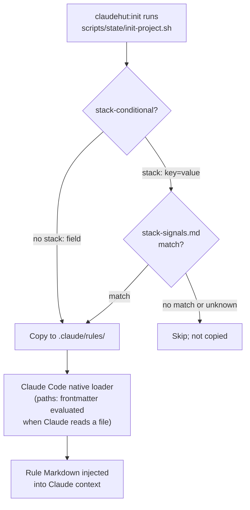

Rules are **not re-evaluated at write time** by any hook. The `FileChanged` hook (`hooks/file-changed.sh`) watches `.claude/rules/*.md` for external edits and emits a `systemMessage` ("ClaudeHut: memory/rules updated externally"), prompting the engineer to reload context — it does not re-inject rules automatically.

`init --refresh` re-syncs rule copies from the plugin source, skipping files whose SHA-256 in `.claude/rules/.checksums.json` has been user-modified (unless `--force` is passed).

---

### Enforcement tier taxonomy

The frontmatter `severity:` field drives _reviewer classification_, but the actual enforcement mechanism varies by rule. Three distinct tiers exist in practice:

**Tier 1 — Advisory (context-window delivery)**
The default. The rule file is in `.claude/rules/`, the native loader injects it when a matching file is opened, and the model reads it as part of its context. Effectiveness depends on the model weighing the rule. All low/medium rules and many high rules operate this way. Subject to context compaction: the `PreCompact` hook (`hooks/pre-compact.sh`) runs at context window saturation, and advisory rules loaded earlier in the session can be compressed or dropped.

**Tier 2 — Reinforced (reviewer restatement)**
Rules that are also hardcoded into reviewer agent system prompts. The clearest example is `rules/framework/lombok-jpa-safety.md`, which contains a `## Reviewer block-list` section explicitly naming `@Data on @Entity` as a **CRITICAL block** — a signal to `claudehut-reviewer-mapping` to flag it regardless of whether the advisory rule fired at write time. Similarly, `claudehut-reviewer-security` heuristics directly mirror the deserialization and Spring Security rules. These rules survive context pressure because the reviewer subagent has the rule content baked into its agent description, not just loaded as a context file.

**Tier 3 — Enforced (hook-gated denial)**
Rules where violations can produce a `permissionDecision: "deny"` before the write reaches Claude at all, or where the Phase 5 verify gate blocks phase promotion. Two distinct enforcement points:

- **PreToolUse write-time block (via `claudehut-migration-validator`):** `rules/framework/migration-safety.md` and `rules/framework/flyway-naming.md` are the only rules with a direct write-time denial path. The `claudehut-migration-validator` agent is invoked by the PreToolUse hook when any `**/db/migration/V*.sql` file is about to be written. If its verdict is `"block"` (≥1 Critical issue), the hook emits `permissionDecision: "deny"`. The rule file itself states: *"PreToolUse hook invokes validator on every migration write. Critical issues block via `permissionDecision: 'deny'`."*

- **Phase 5 Loop verify gate:** The four `severity: critical` security rules (`deserialization`, `owasp-top10`, `spring-security`, `secret-mgmt`) and `severity: critical` `lombok-jpa-safety` block Loop-phase promotion rather than write-time execution. The `claudehut-verifier` agent aggregates reviewer findings; the decision rule is `0 critical AND 0 high → pass`. A critical finding from `claudehut-reviewer-security` or `claudehut-reviewer-mapping` causes `decision: "fail"` and reinjects a refactor task into the plan. After 3 failures the loop escalates to the user. Coverage enforcement (`rules/testing/coverage.md`) also operates at this tier: `./gradlew jacocoTestCoverageVerification` failure blocks promotion from Loop to Learn.

**Why write-time denial is reserved for migrations:** The migration validator can pattern-match DDL statically before execution (e.g., `CREATE INDEX` without `CONCURRENTLY`, `ADD COLUMN NOT NULL` without `DEFAULT`) with high precision and zero false negative cost — a missed violation causes production table locks or rolling-deploy failures. Security rules, by contrast, require contextual reasoning (is this `permitAll()` on `/health` only, or on all paths?) that a static-regex hook cannot reliably perform. Those rules therefore route through the reviewer subagent tier where a full LM evaluation runs in an isolated context.

---

### Category-level summary table

| Category | Count | Example rule | Dominant tier | `severity: critical` rules |
|---|---|---|---|---|
| `architecture/` | 5 | `hexagonal.md` — ports/adapters layout | Advisory | none |
| `coding/` | 7 | `exception.md` — domain exception hierarchy | Advisory | none |
| `framework/` | 14 | `migration-safety.md` — online-safe DDL | Enforced (hook-deny for migrations; reviewer-gate for lombok) | `migration-safety`, `lombok-jpa-safety` |
| `performance/` | 5 | `n-plus-one.md` — JPA/R2DBC batch fetch | Advisory | none |
| `security/` | 6 | `spring-security.md` — deny-all, `@PreAuthorize` | Reinforced + Loop-gate | `deserialization`, `owasp-top10`, `spring-security`, `secret-mgmt` |
| `testing/` | 8 | `tdd-cycle.md` — RED before production code | Reinforced (watch-test-fail.sh) + Loop-gate (coverage) | none |

---

### Notable individual rules

**`rules/framework/migration-safety.md`** (`severity: critical`, `paths: **/db/migration/V*.sql`) — the only rule with a direct PreToolUse write-time denial path. Forbids `CREATE INDEX` without `CONCURRENTLY`, `ADD COLUMN NOT NULL` without `DEFAULT`, same-step `RENAME COLUMN`, and direct edits to committed migrations.

**`rules/framework/lombok-jpa-safety.md`** (`severity: critical`, `paths: **/*Entity.java, **/entity/**/*.java, **/domain/**/*.java`) — no `stack:` constraint (applies to all JPA projects). Contains the explicit `## Reviewer block-list` section that instructs `claudehut-reviewer-mapping` to hard-block `@Data` on `@Entity` (Hibernate lazy-load explosion + hashCode churn post-persist) regardless of advisory context state.

**`rules/security/deserialization.md`** (`severity: critical`, `paths: **/*.java`) — widest-glob security rule. Flags `enableDefaultTyping()` / `activateDefaultTyping()` as Critical RCE vectors. Regex patterns are reproduced in `claudehut-reviewer-security`'s heuristics section so the reviewer fires on them even when the advisory rule is no longer in the active context window.

**`rules/framework/spring-mvc.md`** / **`rules/framework/webflux.md`** — mutually exclusive MVC vs. reactive web rules. Both target controllers/handlers but use disjoint `paths:` patterns (`*Controller.java` vs. `*Handler.java`) in addition to the `stack:` guard, so neither fires spuriously even if both were present.

---

## 7. Hook System (8 Hooks)

ClaudeHut registers hooks through a single manifest at `hooks/hooks.json`. Every hook command path is templated with `${CLAUDE_PLUGIN_ROOT}` so the plugin is relocatable. All scripts source `hooks/lib/state.sh` for artifact-derived phase computation; phase is never read from a mutable JSON file — it is derived fresh from git branch name and the presence/absence of `.claudehut/` artifacts on every hook invocation.

### Hook Manifest Overview

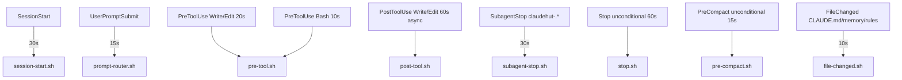

### hookSpecificOutput Schema-Conformance Rule

Claude Code's hook protocol allows `hookSpecificOutput` (an event-specific envelope) **only** for `PreToolUse`, `UserPromptSubmit`, `PostToolUse`, `PostToolBatch`, and `SessionStart`. Events outside that set must use top-level fields (`systemMessage`, `decision`, `reason`).

The scripts enforce this themselves. `stop.sh` lines 4–6 state it explicitly:
> "Schema note: the Stop event does NOT accept `hookSpecificOutput`. Only top-level fields are valid (decision/reason/systemMessage/stopReason/continue/suppressOutput)."

`pre-compact.sh` (line 26) and `file-changed.sh` (lines 3–5) carry the same note. `subagent-stop.sh` emits no output at all, writing only to the findings file.

| Event | `hookSpecificOutput` allowed? | Actual output in script |
|---|---|---|
| SessionStart | Yes | `hookSpecificOutput.additionalContext` |
| UserPromptSubmit | Yes | `hookSpecificOutput.additionalContext` (advise) or top-level `decision:"block"` (enforce) |
| PreToolUse | Yes | `hookSpecificOutput.permissionDecision:"deny"` + `permissionDecisionReason` |
| PostToolUse | Yes | none (side-effect only) |
| SubagentStop | No | none (file write only) |
| Stop | No | top-level `systemMessage` or top-level `decision:"block"` |
| PreCompact | No | top-level `systemMessage` |
| FileChanged | No | top-level `systemMessage` |

### Per-Hook Reference Table

| Script | Event | Matcher (hooks.json) | Timeout | Mode | Effect |
|---|---|---|---|---|---|
| `session-start.sh` | SessionStart | `startup\|resume` | 30 s | Advise | Injects phase/task/stack/integrations context via `hookSpecificOutput.additionalContext` |
| `prompt-router.sh` | UserPromptSubmit | _(none — all prompts)_ | 15 s | Enforce / Advise | Blocks skip-language; advises phase hint; advises branch creation on feature intent |
| `pre-tool.sh` | PreToolUse | `Write\|Edit` (20 s) / `Bash` (10 s) | 20 / 10 s | Enforce | Denies destructive bash, out-of-phase source edits, stale reuse-scan, and out-of-scope files |
| `post-tool.sh` | PostToolUse | `Write\|Edit` | 60 s (`async:true`) | Side-effect | Spawns `gradlew spotlessApply` in background after `.java` edits |
| `subagent-stop.sh` | SubagentStop | `claudehut-.*` | 30 s | Side-effect | Merges reviewer completion timestamp into `findings.json` |
| `stop.sh` | Stop | _(none — all stops)_ | 60 s | Enforce (opt-in) / Advise | Blocks stop (if `stop_enforcement_enabled`) or emits reminder at `learn`/`done` phase |
| `pre-compact.sh` | PreCompact | _(none — all compactions)_ | 15 s | Advise | Surfaces task/phase/artifact snapshot before context is discarded |
| `file-changed.sh` | FileChanged | `CLAUDE\.md\|\.claudehut/memory/.*\|\.claude/rules/.*\.md` | 10 s | Advise | Emits `systemMessage` prompting context reload |

---

### Hook-by-Hook Detail

#### `session-start.sh` — SessionStart, 30 s

Fires on session startup and resume (matcher `startup|resume`). The script:

1. Calls `claudehut_project_root` / `claudehut_phase` to derive current task and phase from artifacts (no state.json).
2. Reads `stack-signals.md` for the six technology axes (`web`, `orm`, `db`, `messaging`, `mapper`, `serialization`).
3. Probes for `understand-anything` (`$PROJECT_ROOT/.understand-anything/knowledge-graph.json`) and `graphify` (binary + `graphify-out/graph.json`) and writes `.claudehut/memory/integrations.json`.
4. Reads the last five lines of `learnings.jsonl` for a recent-learnings summary.
5. Emits the full dispatch-contract reminder — the orchestrator/subagent separation rules, per-phase subagent types, and red-flag counter-arguments — as `hookSpecificOutput.additionalContext`.

If `.claudehut/` does not yet exist the hook short-circuits and emits a single bootstrap hint (`Run /claudehut:init`) with the dispatch contract summary; this is the only output path that exits before probing stack/integrations.

Output mechanism: `hookSpecificOutput` with `hookEventName: "SessionStart"`.

---

#### `prompt-router.sh` — UserPromptSubmit, 15 s

Receives the user prompt via stdin as JSON (field `prompt`). Three ordered checks:

**1. CLAUDEHUT_WORKER early exit (line 15)**
```bash
[[ -n "${CLAUDEHUT_WORKER:-}" ]] && exit 0
```
Headless `claude -p` worker sessions spawned by the Build phase must not receive phase routing. If a `decision:"block"` is emitted into a non-interactive session there is no human to acknowledge it, so the session hangs until its watchdog kills it. The early exit short-circuits all three checks for workers.

**2. Skip-language block (enforce)**
Regex match against `just write the code`, `skip (the)? (spec|plan|brainstorm|review)`, `no need for (spec|plan|test|review)`, `ignore phases?` emits top-level `decision:"block"` with the current phase and a rejection message. This is hard enforcement — the model cannot proceed.

**3. Intent-on-default-branch advise**
If phase is `none` (main/master/trunk/develop) and the prompt matches feature-work verbs (`add|implement|build|...` + `feature|endpoint|service|...`), the hook emits `hookSpecificOutput.additionalContext` with a branch-creation prompt. Non-blocking.

**4. Per-phase hint**
For any active phase (`brainstorm` through `done`) the hook appends a single-line hint (`HINT`) describing the required next action and expected output artifact. Non-blocking.

---

#### `pre-tool.sh` — PreToolUse, Write|Edit (20 s) / Bash (10 s)

The most complex hook. Two modes are selected by the `--tool bash|edit` arg injected via `hooks.json`.

**Path canonicalization (lines 20, 51–52)**

Both `PROJECT_ROOT` and the incoming `file_path` are resolved to physical paths via `pwd -P`. On macOS `/tmp` is a symlink to `/private/tmp`; without this the relative-path strip `${file_path#$PROJECT_ROOT/}` would silently no-op, and every in-scope write from a worktree builder would be wrongly denied. This fix was found via a real Gradle e2e.

**Bash mode — destructive command block**

Regex: `\brm -rf /|\bgit push.* --force\b|DROP DATABASE|\bkubectl delete\b|--no-verify\b`

Emits `hookSpecificOutput.permissionDecision:"deny"` with `permissionDecisionReason`. The deny message instructs users to add an entry in `claudehut-config.json#phase.destructive_command_allowlist`. **Note: the script never reads that key.** The block is unconditional on regex match; `claudehut-config.json` is not consulted. The allowlist path is advertised in the error text but not implemented. (Compare with `stop.sh`, which does read `phase.stop_enforcement_enabled`.)

**Edit/Write mode — gate stack**

Gates are evaluated in order; the first failure denies with its specific message.

| Gate | Condition that triggers deny | Bypass |
|---|---|---|
| `.claudehut/` write passthrough | `file_path` starts with `$PROJECT_ROOT/.claudehut/` | Always allowed (`exit 0` at line 56) |
| `CLAUDEHUT_SCAFFOLD` bypass | Env var set | All edit gates skipped (`exit 0` at line 63) |
| Phase gate | File is `*.java`, `*.kt`, `*.kts`, `*.sql`, or under `src/` AND phase ≠ `build` | — |
| Reuse-scan freshness | New Java/Kotlin file (`[[ ! -f "$file_path" ]]`) AND `claudehut_reuse_scan_fresh` returns false (stale = older than 600 s) | `CLAUDEHUT_WORKER` set |
| Surgical scope | File's relative path not found in plan doc under `(create\|modify\|test):.*<filename>` | — |

**CLAUDEHUT_SCAFFOLD bypass (line 63):** `scaffold-stubs.sh` runs a `claude -p` session at `phase=build` to write the entire feature skeleton in one pass, including shared types and enums that no single plan task owns. Both the surgical-scope gate and the reuse-scan freshness gate are per-task constraints that must not apply to a whole-skeleton scaffold pass. Because `CLAUDEHUT_SCAFFOLD` exits before phase is even computed, it bypasses all three edit-mode gates (phase gate, reuse-scan, surgical scope).

**CLAUDEHUT_WORKER partial bypass (line 91):** Workers skip only the reuse-scan freshness gate. The reason is in the comment: a worker's RED step creates a new `*Test.java` that would trip the "file doesn't exist → require fresh scan" logic, but a headless `-p` process cannot invoke `/reuse-scan` to satisfy it and would hang to the watchdog. The phase gate (not-build blocks source edits) and surgical-scope gate (file must appear in plan) **remain active for workers**.

Both bypass variables exist to prevent headless `claude -p` processes from encountering interactive-only gates they can never satisfy.

---

#### `post-tool.sh` — PostToolUse, Write|Edit, 60 s, async

Single responsibility: if the written file ends in `.java` and `gradlew` exists in the project root, spawn `./gradlew spotlessApply -PspotlessFiles="<path>"` in a background subshell (`&`). This is the only hook registered as `"async": true` in `hooks.json`. No JSON is emitted; exit 0.

---

#### `subagent-stop.sh` — SubagentStop, `claudehut-.*`, 30 s

Receives `agent_type` from the stop payload (tries `.agent_type // .subagent_type`). The hooks.json matcher `claudehut-.*` is a coarse pre-filter; the script narrows to `claudehut-reviewer-*` only:

```bash
case "$agent_type" in
  claudehut-reviewer-*)
    ...
    jq ... '.reviewers[$a] = {completed_at: $ts}' "$findings_file" > "$tmp" && mv "$tmp" "$findings_file"
    ;;
esac
```

Upserts a `{completed_at: <ISO-8601>}` record keyed by agent type into `.claudehut/findings/<task_id>-findings.json`. The file is created with `{"reviewers": {}}` if absent. Atomic write via tmp-file + `mv`. No JSON output emitted to Claude Code.

---

#### `stop.sh` — Stop, unconditional, 60 s

Fires on every session stop. Two bypass guards execute first:

1. **No `.claudehut/`** — exits silently.
2. **`CLAUDEHUT_WORKER`** — exits silently. Defensive: at the time of writing, the stop block fires only at `phase=learn`, which workers never reach, but the guard prevents future phase expansions from hanging a headless session.

Then reads `.claudehut/claudehut-config.json` key `phase.stop_enforcement_enabled` (defaults false if absent).

| Phase | `stop_enforcement_enabled=false` | `stop_enforcement_enabled=true` |
|---|---|---|
| `learn` | top-level `systemMessage` (non-blocking reminder) | top-level `decision:"block"` |
| `done` | top-level `systemMessage` (archive suggestion) | top-level `systemMessage` (never blocked) |
| anything else | `exit 0` | `exit 0` |

Unlike `pre-tool.sh`'s destructive block, the opt-in enforcement here is fully implemented — the config key is actually read.

Output uses top-level fields only, not `hookSpecificOutput`, per the Stop event schema constraint quoted in the script header.

---

#### `pre-compact.sh` — PreCompact, unconditional, 15 s

Fires before Claude Code compacts the context window. Reads current `TASK_ID`, `PHASE`, and the three artifact paths (design, contract, plan). Emits a top-level `systemMessage` with a four-line snapshot:

```
ClaudeHut state pre-compact:
Task=<id>, Phase=<phase>
Artifacts:
  design: ... contract: ... plan: ...
After compact: re-read these artifacts + run claudehut-state phase to resume.
```

No blocking, no phase filtering. `hookSpecificOutput` is not used; per the script's own note at line 26, PreCompact does not accept it.

---

#### `file-changed.sh` — FileChanged, 10 s

Matcher: `CLAUDE\.md|\.claudehut/memory/.*|\.claude/rules/.*\.md`

Watches for external edits to the three categories of context-bearing files: the root CLAUDE.md, any memory file under `.claudehut/memory/`, and any rule file under `.claude/rules/`. Emits a single top-level `systemMessage`:

```
ClaudeHut: memory/rules updated externally — <file>. Reload context if needed.
```

Non-blocking. Does not re-index anything itself; the message prompts the user or Claude to reload.

---

### Bypass Guard Summary

| Guard variable | Set by | Hooks where it fires | Effect |
|---|---|---|---|
| `CLAUDEHUT_WORKER` | Build-phase `claude -p` worker launcher | `prompt-router.sh` — full exit 0 | Skips all phase routing / skip-phrase blocking |
| `CLAUDEHUT_WORKER` | same | `stop.sh` — full exit 0 | Prevents stop-block on headless session |
| `CLAUDEHUT_WORKER` | same | `pre-tool.sh` — partial skip | Skips reuse-scan freshness only; phase gate + surgical scope stay active |
| `CLAUDEHUT_SCAFFOLD` | `scaffold-stubs.sh` `claude -p` | `pre-tool.sh` — full exit 0 on edit path | Bypasses all edit-mode gates (phase + reuse-scan + surgical scope) |

The shared rationale for both variables: a `claude -p` non-interactive session cannot respond to a `decision:"block"` or interactive prompt. Any gate that blocks and waits for a human response causes the headless session to hang until its external watchdog kills it. The guards are not permission shortcuts — they are correctness guards that prevent the blocking machinery from targeting sessions that are structurally unable to satisfy it.

---

## 8. Memory & Retrieval Reinforcement

ClaudeHut implements a four-tier, append-only memory system that converts completed task artifacts into persistent patterns. Memory feeds back into every phase's subagent via deterministic prompt assembly.

---

### Memory Layout

```
~/.claude/claudehut/memory/          ← Global tier (cross-project promoted patterns)
├── patterns.jsonl                   ← promoted entries (files_touched stripped)
└── projects.json                    ← signature → project-hash set + hit counter

<repo>/.claudehut/memory/            ← Project tier (committed, team-shared)
├── stack-signals.md                 ← detected tech stack (markdown key-value list)
├── conventions.md                   ← human-maintained team conventions
├── learnings.jsonl                  ← append-only reinforcement log
├── learnings-recent.md              ← top-N formatted view (@imported by CLAUDE.md)
├── index.md                         ← reusable impl map (auto-regenerated by learn)
└── integrations.json                ← UA/Graphify availability cache (written each SessionStart)

~/.claude/projects/<sid>/            ← Session tier (Claude Code harness; outside plugin scope)

(in-context window)                  ← Task tier (prior-phase artifacts in the dispatch prompt)
```

The project tier under `.claudehut/memory/` is committed to source control and shared with the whole team. The global tier at `~/.claude/claudehut/memory/` is local to the developer's machine.

**File roles at a glance:**

| File | Format | Written by | Read by |
|---|---|---|---|
| `stack-signals.md` | Markdown `- key: value` | `claudehut-stack-detector` agent (+ manual edit) | `dispatch-prompt.sh` (all phases), `init-project.sh` (rule copy filter), `session-start.sh` (summary) |
| `conventions.md` | Markdown | Human / init template | `dispatch-prompt.sh` (all phases) |
| `learnings.jsonl` | JSONL (one object per line) | `claudehut-learner` agent via `promote.sh` | `dispatch-prompt.sh` (via `learnings-recent.md`), `promote.sh`, `session-start.sh` (tail-5 inline) |
| `learnings-recent.md` | Markdown | `init-project.sh` seeds it; content populated by learner | `dispatch-prompt.sh` (all phases), `@import` in `.claude/CLAUDE.md` |
| `index.md` | Markdown | `reindex.sh` (called by learner) | Brainstorm / reuse-scan |
| `integrations.json` | JSON | `session-start.sh` (each session) | `claudehut_integration()` in `state.sh`, reuse-scan backends |

---

### CLAUDE.md @import wiring

`init-project.sh` appends a managed block to the project's `.claude/CLAUDE.md`:

```markdown
<!-- claudehut-managed-section -->
@.claudehut/memory/conventions.md
@.claudehut/memory/stack-signals.md
@.claudehut/memory/learnings-recent.md
<!-- /claudehut-managed-section -->
```

Source: `templates/claude-md.template.md`. These three files therefore appear verbatim in every Claude Code session's system context without any hook involvement.

---

### Capture: the Learn Phase (Phase 6)

Phase 6 is executed exclusively by the `claudehut-learner` subagent (model: `haiku`). The main thread calls `Task(subagent_type="claudehut-learner", prompt=<dispatch-prompt.sh output>)` — it never writes to `learnings.jsonl` itself. This isolation is enforced by the skill's dispatch contract (skipping dispatch is documented as prohibited in `skills/learn/SKILL.md`).

**Learner pipeline:**

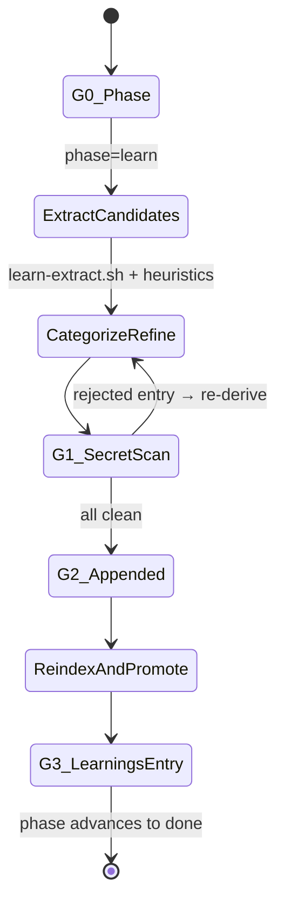

**Step detail:**

| Step | Script / action | Guard |
|---|---|---|
| 1 | `learn-extract.sh <task_id>` — proposes JSONL candidates from git diff (heuristic file-pattern matching) | Produces raw proposals only; agent refines |
| 2 | Agent categorizes each: `pattern`, `anti-pattern`, `decision`, `gotcha`, `command` | Rejects vague / non-specific titles |
| 3 | `secret-scan.sh <candidate>` — regex scan for API keys, PEM blocks, JWTs, DB URLs | Exit 1 → log to `learn-rejected.log` without leaking matched text |
| 4 | Append clean entries to `learnings.jsonl` | Append-only; never edit prior lines |
| 5 | `reindex.sh` — regenerates `index.md` from Java source tree + learnings | Preserves `<!-- BEGIN MANUAL -->` sections |
| 6 | `promote.sh` — conditional cross-project promotion | Only if `global_promotion_opt_in == true` |

**Entry schema** (one JSON object per JSONL line):

```json
{
  "id": "learn-<date>-<seq>",
  "ts": "<ISO 8601 UTC>",
  "session_id": "<claude-session-id>",
  "task_id": "<branch-derived task id>",
  "category": "pattern|anti-pattern|decision|gotcha|command|tombstone",
  "title": "<one-line, specific — must cite a class/method/config>",
  "content": "<2-5 sentences, self-contained, reusable>",
  "signature": "sha256:<hex of lower(title) + ':' + category>",
  "files_touched": ["src/main/java/..."],
  "hits": 1,
  "tags": ["tag1", "tag2"]
}
```

Optional fields: `noPromote` (prevents promotion), `deprecated` (set on decay), `replaces` (supersession chain), `references` (cited docs URLs).

**Mutation invariant:** Entries are never edited in place. To supersede an entry, append a new entry with `replaces: <old-id>`. To tombstone, append `category: "tombstone"`. This makes `learnings.jsonl` safe to commit to git without history-rewrite risk.

---

### Secret Scan

Every candidate entry passes through `secret-scan.sh` before appending. The script checks 12 hard-reject regex patterns:

| Pattern class | Example |
|---|---|
| OpenAI/Anthropic keys | `sk-[a-zA-Z0-9_-]{20,}` |
| AWS access key | `AKIA[0-9A-Z]{16}` |
| PEM private key | `-----BEGIN (RSA|EC|DSA|OPENSSH)? PRIVATE KEY-----` |
| GitHub PAT (classic + fine-grained) | `ghp_…`, `github_pat_…` |
| GitHub OAuth | `gho_[a-zA-Z0-9]{36}` |
| Slack tokens | `xox[baprs]-…` |
| GitLab PAT | `glpat-…` |
| JWT | `eyJ…eyJ…` (three-part) |
| DB URLs with credentials | `postgres://user:pass@`, `mongodb+srv://…`, `redis://user:pass@` |

On a hit: the entry is rejected and logged to `state/tasks/<id>/learn-rejected.log` with only the pattern type — never the matched text. Users can add safe overrides to `claudehut-config.json#learn.secret_scan_allowlist`.

---

### Project-Aware vs Global Tiers

Memory exists at two tiers with different scopes:

| Dimension | Project tier | Global tier |
|---|---|---|
| Location | `<repo>/.claudehut/memory/learnings.jsonl` | `~/.claude/claudehut/memory/patterns.jsonl` |
| Scope | Single repo; includes `files_touched` paths | Cross-repo; `files_touched` stripped on promotion |
| Default | Always active | Opt-in only (`global_promotion_opt_in: false` by default) |
| Hit counter | Per entry in project JSONL | `projects.json` maps signature → distinct project hashes |

---

### Promotion Mechanism

Promotion is handled exclusively by `skills/learn/scripts/promote.sh`. The script reads two config keys from `<repo>/.claudehut/claudehut-config.json`:

```json
"memory": {
  "promotion_min_projects": 3,
  "global_promotion_opt_in": false,
  "decay_days": 180
}
```

**Promotion algorithm:**

1. For each entry in `learnings.jsonl`, extract the `signature` field.
2. Update `~/.claude/claudehut/memory/projects.json` — a map of `signature → {projects: [<sha256-of-remote-url>], hits, first_seen, last_seen}`.
3. Project identity = `sha256(git remote.origin.url || git rev-parse --show-toplevel)`, so renaming a local clone does not inflate counts.
4. If `len(projects) >= promotion_min_projects` AND `global_promotion_opt_in == true` AND `noPromote != true` AND signature not already in `patterns.jsonl` → append the entry to the global file.

On promotion, `files_touched` is stripped and `promoted_at` + `projects_count` are added. Raw project hashes are not stored in the promoted record (privacy).

**Decay:** entries with no new hit in `decay_days` (default 180) receive `deprecated: true` and are filtered from default load. They are not deleted. Users purge with `claudehut prune --days 180 --confirm`.

**Per-entry opt-out:** Set `noPromote: true` on any entry to prevent promotion regardless of threshold.

Categories that are explicitly excluded from promotion: `anti-pattern` tied to a specific framework version, `command` with project-local paths, `gotcha` tied to a private library, and any entry with `files_touched` matching `**/internal/**` or `**/proprietary/**`.

---

### Stack-Signals Detection

Stack signals are detected by the `claudehut-stack-detector` agent (model: `haiku`). It reads `pom.xml` or `build.gradle{,.kts}` and optionally runs `./gradlew dependencies` (60-second timeout; falls back to build-file grep on timeout).

**Output format** (`stack-signals.md` — markdown, not JSON, so it can be `@imported` from CLAUDE.md):

```markdown
- build_tool: gradle
- java_version: 17
- spring_boot: 3.2.4
- web: webflux            # mvc | webflux | unknown
- orm: r2dbc              # jpa | r2dbc | none | unknown
- db: postgres
- messaging: kafka
- cache: redis
- mapper: mapstruct
- serialization: jackson
- detected_at: 2026-05-27T04:45:28Z
```

**Cache TTL:** The agent's G2 gate skips detection if `detected_at` is less than 14 days old (unless `--force` is passed). The comment in `hooks/lib/state.sh:163` describes this as "refresh weekly via stack-detector agent" — the actual threshold in the agent definition is 14 days.

The `claudehut_stack_signal <key>` function in `state.sh` (line 167) reads a specific key from `stack-signals.md` using a `grep -E "^- ${key}:"` pattern, stripping trailing comments. This function is called by `session-start.sh` to build the one-line `STACK_SUMMARY` injected into the SessionStart context.

Stack signals also gate which rules are copied from the plugin into the project's `.claude/rules/` by `init-project.sh`. Rules with a `stack: "key=value"` frontmatter constraint are only copied when the project's detected stack matches.

---

### Integrations (understand-anything, graphify)

Integration availability is written to `<repo>/.claudehut/memory/integrations.json` on every `SessionStart`. The detection is inline in `hooks/session-start.sh` (lines 44–64) — it checks for two tools:

| Integration | Detection method | `available` = true when |
|---|---|---|
| `understand-anything` (UA) | File presence check | `.understand-anything/knowledge-graph.json` exists |
| `graphify` | `command -v graphify` + `graphify global list` | `graphify` binary is on PATH |

Example `integrations.json`:

```json
{
  "understand_anything": { "available": false, "graph_path": "" },
  "graphify": { "available": true, "graph_path": "", "global_registry": false },
  "detected_at": "2026-05-27T04:45:28Z"
}
```

The `claudehut_integration <backend>` function in `state.sh` (lines 183–193) reads this file:

- `claudehut_integration ua` → `.understand_anything.available`
- `claudehut_integration graphify` → `.graphify.available`

These backends are used by the reuse-scan phase (Phase 1, Brainstorm) to check for existing implementations. Priority order is configurable via `claudehut-config.json#reuse_detection.prefer_backends` (default: `["understand_anything", "graphify"]`). If neither is available, the reuse-scan falls back to grep heuristics (`fallback_to_grep: true`).

---

### Memory Feedback into Dispatch Prompts

All six phase dispatch scripts (`skills/<phase>/scripts/dispatch-prompt.sh`) follow an identical composition order:

```
1. User intent (the original prompt)
2. Task id + phase + retry count  (derived at runtime via state.sh)
3. Stack signals           → head -60  of .claudehut/memory/stack-signals.md
4. Project conventions     → head -300 of .claudehut/memory/conventions.md
5. Recent learnings        → head -200 of .claudehut/memory/learnings-recent.md
6. Prior-phase artifacts   → design.md / contract.md / plan.md / findings.json (up to 500 lines each)
7. Phase-specific instruction footer
```

Every subagent therefore receives the full memory context — stack, conventions, and recent learnings — as part of its initial prompt, not as a side-loaded file. Since subagents run in isolated context windows, this deterministic assembly is the only delivery mechanism.

The `learnings-recent.md` file also reaches the main thread via the `@import` in `.claude/CLAUDE.md`, making prior learnings available in the orchestrator's context independently of dispatch.

`session-start.sh` additionally emits a five-entry inline preview (`tail -5 learnings.jsonl | jq -r '"- [\(.category)] \(.title)"'`) in the SessionStart `additionalContext` payload, giving the orchestrator immediate visibility of the most recent patterns without requiring a file read.

---

### End-to-End Memory Flow

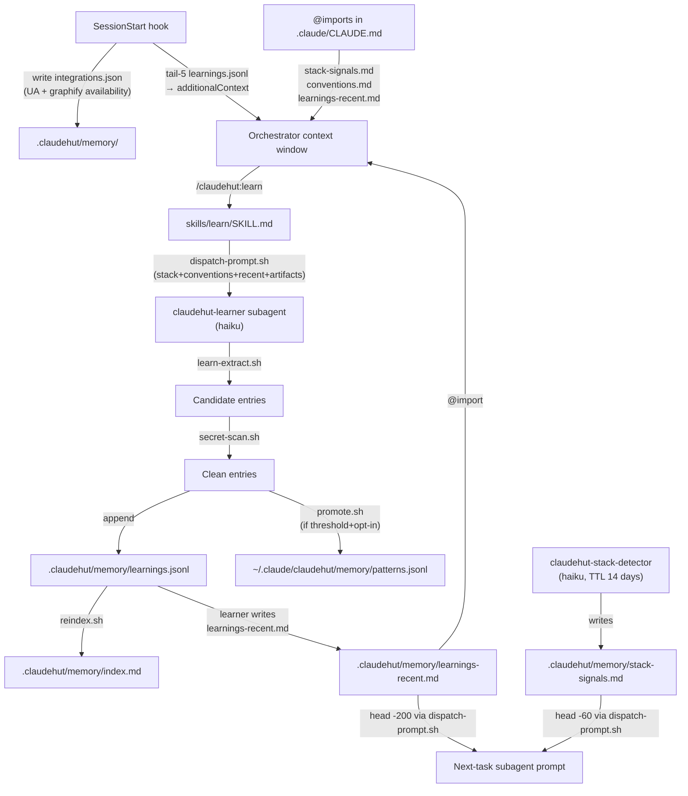

The cycle is: task completes → learner extracts patterns → appends to `learnings.jsonl` → regenerates `learnings-recent.md` → next task's every subagent receives those patterns in its opening prompt. Patterns that recur across projects cross the promotion threshold and enter the global tier, appearing in `patterns.jsonl` on the developer's machine for use in future projects.

---

## 9. Parallel build deep-dive (Path B)

### Why external `claude --print` processes instead of Agent-tool subagents

ClaudeHut Build Phase dispatches each parallel task as a **separate OS process** (`claude --print` launched with `&`) rather than as Agent-tool subagents for two compounding reasons, both documented in `skills/build/references/parallel-build-verification.md`:

| Reason | Detail |
|--------|--------|
| **Concurrency cannot be forced via Agent tool** | The LLM orchestrating with Agent tool cannot be made to issue multiple Agent calls simultaneously in a single turn; it serializes. Background processes give OS-level concurrency with no LLM cooperation needed. |
| **Full sessions dodge two known headless bugs** | `--print` workers are full Claude Code sessions, not subagents. They avoid the subagent skill-preload bug **#25834** (skills frontmatter not reliably loaded for subagents) and cross-spawn rules degradation **#49106** (system-prompt rules eroding across nested subagent hops). |

The practical consequence: concurrency, hook firing, and persona enforcement are all guaranteed at the process level and do not depend on model cooperation.

> **Skills-preload caveat (verified UNCONFIRMED):** in real `-p` test runs the model reported preloaded `skills:` as "none" — whether `skills:` frontmatter takes effect under `--print` is unresolved. The actual TDD-steering guarantees come from the **agent persona body** (loaded via `--agent claudehut:claudehut-builder`) plus the `--append-system-prompt` guardrails fragment. The persona body is authoritative; frontmatter preload is treated as unreliable.

---

### Stub-commit step (sequential, once before any group)

Script: `skills/build/scripts/scaffold-stubs.sh "<user-intent>" <task-id>`

Before any parallel worker starts, a **single sequential `claude --print` session** generates and commits **compiling skeletons** for every type, interface, and method signature that the contract doc and plan `Files:` lists introduce. Bodies are `throw new UnsupportedOperationException("stub")` / `return null` / field-declared-unassigned. The session uses `--output-format json` so the script can capture `session_id` for compile-error retry via `--resume <id>` (up to `CLAUDEHUT_SCAFFOLD_MAX_ATTEMPTS`, default 3). Exit 1 (stubs fail to compile) halts the entire build before any parallel work begins.

**Why this step eliminates the three deadliest parallel-build failure modes:**

| Failure mode | How stubs prevent it |
|---|---|
| **Contract drift** | Workers cannot invent divergent signatures — the authoritative ones already exist and compile. |
| **Hidden dependency** | A worker consuming another task's type finds it present; no "type not found" at GREEN time. |
| **Semantic merge conflict** | All workers share the same stub commit as their base, so cherry-pick operates on disjoint diffs of the shared ancestor — merge-then-break cannot happen at the cherry-pick layer. |

The stub session runs under `CLAUDEHUT_SCAFFOLD=1`, which bypasses both the surgical-scope gate and the reuse-scan freshness gate in `hooks/pre-tool.sh`. This is intentional: the scaffold session legitimately writes files belonging to every task's scope simultaneously (no single task owns the whole skeleton). The real enforcement against semantic breaks is the per-group compile+test gate that runs after each group merges.

---

### Plan-doc parallel group field

Template: `skills/plan/assets/templates/plan-doc.md.tmpl`

Every task block in a plan doc must carry a `**Parallel group:**` field:

```markdown
**Depends on:** Task 1
**Parallel group:** 2
**Risk:** none
**Estimate:** 3 min

- [ ] complete
```

The `**Parallel group:** N` value is a positive integer. The validator `skills/plan/scripts/plan-parallel-group-scan.sh` enforces four structural invariants at plan-approval time using POSIX `awk`:

1. Every task has a `**Parallel group:**` field.
2. Group numbers are contiguous from 1 (no gaps).
3. If task B `**Depends on:**` task A, then `group(B) > group(A)`.
4. No two tasks in the same group share a file (disjoint file sets — prerequisite for OS-level parallel safety).

These constraints mean the build orchestrator can treat each distinct group value as a wave: all tasks in group 1 are provably independent and file-disjoint, all tasks in group 2 likewise, etc.

---

### Per-parallel-group dispatch loop

Script: `skills/build/scripts/run-parallel-group.sh "<user-intent>" <task-id> <plan-file> <group-num>`

The orchestrator (Build skill `SKILL.md`) calls this script once per group number in ascending order.

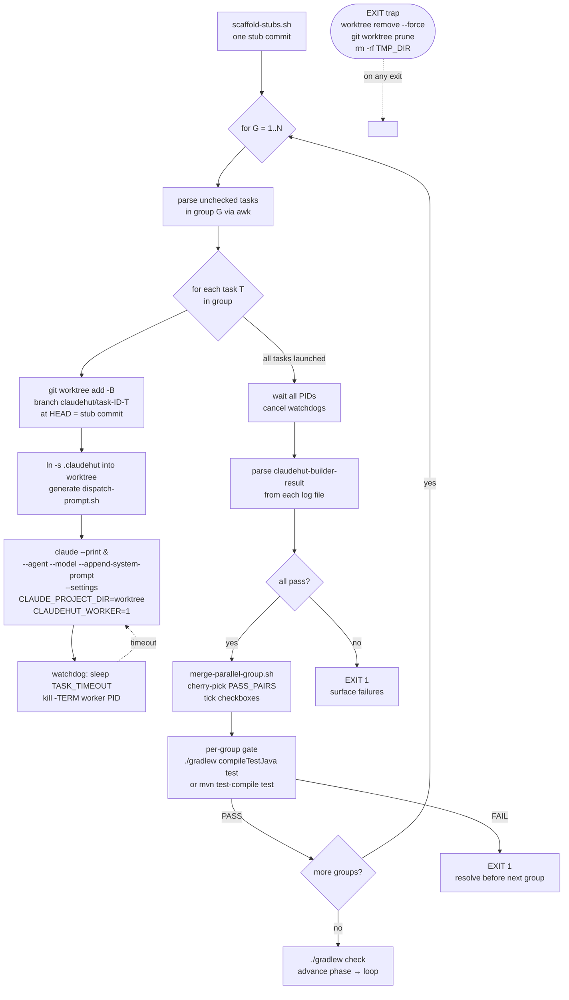

**Key dispatch loop decisions:**

- **`-B` (not `-b`) on `worktree add`** — force-resets the branch to HEAD if it already exists. Without this a re-run of a failed group hits "branch already exists" and aborts. Fixed after the real Gradle e2e.
- **`TASK_NUMS` parsed via `awk`** — reads `**Parallel group:**` and checks for `- [x] complete`; already-checked tasks are skipped so a partial retry picks up only the failures.
- **Results collected from log files**, not from process exit codes (workers exit 0 on normal completion regardless of `verify_status`). The awk parser looks for a fenced `claudehut-builder-result` block in each `$LOG_DIR/group${G}-task${T}.log`.

---

### Worker model — env, persona, settings, symlink, path canonicalization

Each worker `claude --print` process is launched with a precisely composed set of flags and environment variables:

| Mechanism | Value / behaviour |
|---|---|
| `--agent claudehut:claudehut-builder` | Loads the agent system-prompt body (Goals/Gates/Guardrails/Heuristics). **Conditional**: only added if `claude agents list` resolves `claudehut:claudehut-builder`; otherwise falls back to guardrails-only. |
| `--model "$WORKER_MODEL"` | Default `sonnet` (override via `CLAUDEHUT_WORKER_MODEL`). Pinned for cost. |
| `--append-system-prompt "$GUARDRAILS"` | Inline non-negotiable TDD + scope rules injected verbatim. Survives even when `--agent` is not resolvable. Kept in sync with `agents/claudehut-builder.md Guardrails`. |
| `--settings "$MAIN_REPO/.claude/settings.json"` | Merges the project's committed settings so plugin enablement (and therefore the PreToolUse scope-check hook) is discovered from an out-of-tree worktree `cwd`. Best-effort (only added when the file exists). |
| `CLAUDE_PROJECT_DIR="$WT_PATH"` | Points Claude Code's project root to the worktree, so settings/hooks walk from the correct location. |
| `CLAUDE_PLUGIN_ROOT="$PLUGIN_ROOT"` | Explicit plugin root override, bypassing the upward walk for script utility functions. |
| `CLAUDEHUT_TASK_ID="$TASK_ID"` | Overrides the branch-derived task ID so `claudehut-state` resolves the original feature task, not the worktree branch name. |
| `CLAUDEHUT_WORKER=1` | Signals to the hook stack that this is a headless worker session. Three hooks early-exit under this flag: `prompt-router.sh` (skip-phrase block), `stop.sh` (learn-phase block), and `pre-tool.sh` reuse-scan freshness gate. The **surgical-scope gate is NOT bypassed** — off-plan writes are still denied. |
| `.claudehut` symlink | `ln -s "$MAIN_REPO/.claudehut" "$WT_PATH/.claudehut"` — worktrees check out only committed files; `.claudehut` is typically untracked (gitignored). Without the symlink, in-worktree hooks see "uninitialized" state. The guard `[[ -e "$WT_PATH/.claudehut" ]] || ln -s ...` prevents nesting when the project does track `.claudehut`. |

**Path canonicalization (`pwd -P`).** Worktrees live in `mktemp -d` dirs. On macOS, `/tmp` is a symlink to `/private/tmp` and `/var` to `/private/var`. Claude Code's tool subsystem delivers `file_path` in the canonical `/private/...` form, while `CLAUDE_PROJECT_DIR` retains the `/tmp/...` form the script set. The relative-path strip in `hooks/pre-tool.sh` then no-ops, causing every in-scope worker write to be denied as out-of-scope. Fixed in `hooks/pre-tool.sh` lines 20 and 51–52 by canonicalizing both sides with `pwd -P`:

```bash
# line 20 — PROJECT_ROOT side
PROJECT_ROOT="$(cd "$PROJECT_ROOT" 2>/dev/null && pwd -P || echo "$PROJECT_ROOT")"
# lines 51-52 — file_path side
_fp_dir="$(cd "$(dirname "$file_path")" 2>/dev/null && pwd -P || echo "$(dirname "$file_path")")"
file_path="$_fp_dir/$(basename "$file_path")"
```

This bug was found by the real Gradle e2e; `pre-write-scope-check.sh` (the legacy standalone mirror of the same logic, not wired) does not contain the fix.

---

### `claudehut-builder-result` return contract

Defined in `agents/claudehut-builder.md` §Output contract. Every worker session **must** terminate with:

````
```claudehut-builder-result
{
  "task_id": "<task-id>",
  "task": <N>,
  "verify_status": "pass|fail",
  "commit_sha": "<sha>",
  "error": null
}
```
````

The orchestrator's result parser (`run-parallel-group.sh` lines 216–227) uses `awk` to find the fenced block and extract `verify_status`. A `pass` result adds `"${TNUM}:${BRANCH}"` (branch name derived as `claudehut/task-${TASK_ID}-${TNUM}`, not the `commit_sha`) to `PASS_PAIRS`. A missing block, a `fail` status, or a worktree-add failure all cause the task to land in `FAIL_TASKS`.

> `commit_sha` is required by contract but informational — the orchestrator never uses it to identify what to merge. Merge is always by derived branch name, cherry-picking all commits in `HEAD..<branch>`.

---

### Cherry-pick merge + gitignore-aware checkbox tick

Script: `skills/build/scripts/merge-parallel-group.sh <task-id> <plan-file> [task-num:branch ...]`

For each `task-num:branch` pair in `PASS_PAIRS`:

1. Verifies the branch exists in `refs/heads/` or `refs/worktrees/`.
2. Collects all commits on the branch not in `HEAD` via `git log --reverse --format='%H' HEAD..<branch>` (chronological order).
3. `git cherry-pick --no-edit` each commit; on conflict: aborts the cherry-pick, increments error count, continues to next pair.
4. Ticks the `- [ ] complete` checkbox for that task in the plan file using POSIX `awk` (no gawk extensions; explicitly avoids 3-argument `match` for BSD/macOS awk compatibility).
5. **Gitignore-aware commit**: `git check-ignore -q "$PLAN_FILE"` — if the plan file is gitignored (the common case; projects gitignore `.claudehut/`), the checkbox tick is left as a working-tree-only change and not committed. If tracked, `git add "$PLAN_FILE"` + `git commit "chore(plan): task N complete [parallel-merge]"`. Force-adding an ignored path would fail under `set -e` and pollute project history.

---

### Per-group compile+test gate

After `merge-parallel-group.sh` completes, `run-parallel-group.sh` runs the build tool's test target directly in `$MAIN_REPO`:

```
./gradlew compileTestJava test    # Gradle projects
mvn -q test-compile test          # Maven projects
```

This gate exists to catch **semantic merge breaks** — cases where two tasks individually pass their own tests but break each other's when combined. As `parallel-build-verification.md` states: "the per-group compile+test gate runs in the main repo (normal tooling) after each group merges. It — not the worker scope-check — is the load-bearing enforcement against semantic merge breaks. Worker hooks are defense-in-depth." Group N must pass the gate before group N+1 workers are dispatched.

---

### Per-task watchdog timeout

```bash
( sleep "$TASK_TIMEOUT"; kill -TERM "$wpid" 2>/dev/null ) &
WATCHDOGS+=($!)
```

`CLAUDEHUT_TASK_TIMEOUT` (default 900 s) governs the wall-clock budget per worker. A hung worker cannot block the whole group indefinitely. Watchdogs are tracked in a parallel `WATCHDOGS` array indexed identically to `PIDS`. After each `wait "$pid"`, the corresponding watchdog is `kill`-ed and `wait`-ed to suppress bash job-control "Terminated: 15" noise.

---

### `-B` branch re-run safety

`git worktree add -B "$BRANCH" "$WT_PATH" HEAD` — the `-B` flag force-resets the branch to `HEAD` if it already exists. A first failed attempt leaves the branch behind; a re-run of the same group (after the user resolves failures) would abort with "branch already exists" under `-b`. `-B` makes group re-runs idempotent. This bug was found and fixed during the Gradle e2e.

---

### Leak-proof EXIT-trap cleanup

```bash
cleanup() {
  local t
  for t in "${TASK_NUMS[@]}"; do
    [[ -d "${TMP_DIR}/wt-${t}" ]] && \
      git -C "$MAIN_REPO" worktree remove --force "${TMP_DIR}/wt-${t}" 2>/dev/null || true
  done
  rm -rf "$TMP_DIR"
  git -C "$MAIN_REPO" worktree prune 2>/dev/null || true
}
trap cleanup EXIT
```

The `EXIT` trap fires on **any** exit path — normal completion, `set -e` early abort, signal, or explicit `exit 1` from error branches. Each worktree is removed via `git worktree remove --force` (updates git's internal metadata) before `rm -rf` of the temp dir. `git worktree prune` clears stale refs. Worktrees never leak regardless of how the script exits.

---

### Real Gradle end-to-end result (green 2/2)

Verified on Gradle 9.5.1 + JDK 21 with two independent tasks (`Calculator.add`, `Greeter.greet`) in group 1 with disjoint file sets, using real `claude` workers via `--plugin-dir`:

| Step | Outcome |
|---|---|
| `scaffold-stubs.sh` | Compiling stubs, attempt 1. Committed. |
| 2 workers dispatched in parallel | `--agent claudehut:claudehut-builder` persona loaded. Each did real TDD: failing test → impl → green. Each committed in its worktree. |
| `merge-parallel-group.sh` | Both tasks cherry-picked. Both plan checkboxes ticked (plan gitignored — not committed to project history). |
| Per-group gate | `./gradlew compileTestJava test` → BUILD SUCCESSFUL |
| Worktree cleanup | Only main repo worktree remained. GROUP EXIT 0 |
| Final gate | `./gradlew test` → BUILD SUCCESSFUL |

The e2e also confirmed correct failure handling: a task that failed due to a `build.gradle` configuration gap caused group exit 1, surfaced the failure, and cleaned up worktrees — the "fail fast before next group" contract held.

**Two real bugs found only by running actual `claude` workers (not mocks):**

1. **Scope-check broken in worktrees (path canonicalization).** macOS `/tmp`→`/private/tmp` symlink made `CLAUDE_PROJECT_DIR` (set to the `/tmp/...` form) mismatch the canonicalized `file_path` from the tool subsystem (`/private/tmp/...`). The relative-path strip in `hooks/pre-tool.sh` no-op'd, so every in-scope worker write was denied as out-of-scope. Fixed by canonicalizing both sides with `pwd -P` in `hooks/pre-tool.sh` (lines 20 and 51–52).

2. **Group re-run branch collision.** `git worktree add -b` fails if the branch exists. A group re-run after a failure (branch left over from the first attempt) aborted with "branch already exists". Fixed by switching to `-B` (force-reset to HEAD).

---

## 10. Runtime Interaction Model — How Agents, Skills, Rules, and Hooks Actually Compose

This section describes what happens at runtime, not what the catalog lists. The key insight is that ClaudeHut's runtime is a **feedback loop between artifacts on disk and three execution tiers**: the main-thread orchestrator, Agent-tool subagents, and Path-B `claude --print` OS workers. Phase state is never stored; it is re-derived from disk artifacts on every hook invocation, every dispatch, and every tool call.

---

### Layered Architecture Diagram

```
┌──────────────────────────────────────────────────────────────────┐
│  Layer 0: User                                                   │
│  Sends prompts; receives [claudehut] task=<id> phase=<phase>    │
└────────────────────────────┬─────────────────────────────────────┘
                             │ UserPromptSubmit hook fires here
┌────────────────────────────▼─────────────────────────────────────┐
│  Layer 1: Main-thread Orchestrator  (model: sonnet)              │
│  Owns: dialog, AskUserQuestion, Task-tool dispatch, Skill-tool   │
│  invocations, state queries (claudehut-state), memory/advisor    │
│  Reads: .claudehut/ artifacts → claudehut_phase() on every turn  │
│  CANNOT write src/ (blocked by PreToolUse outside phase=build)   │
└──────────┬───────────────────────────┬───────────────────────────┘
           │ Task(subagent_type=...)   │ skills/build/scripts/
           │ Agent-tool dispatch       │ run-parallel-group.sh
           │                          │ `claude --print &`
┌──────────▼────────────┐  ┌──────────▼──────────────────────────┐
│  Layer 2a             │  │  Layer 2b                            │
│  Agent-tool subagents │  │  Path-B OS workers (headless)        │
│  (in-session)         │  │  (out-of-tree git worktrees)         │
│                       │  │                                      │
│  brainstormer (opus)  │  │  One per plan task, per parallel     │
│  spec-writer (sonnet) │  │  group; OS-level concurrency (& bg)  │
│  planner (opus)       │  │  Model: CLAUDEHUT_WORKER_MODEL       │
│  verifier (sonnet)    │  │        (default: sonnet)             │
│  └→ reviewers (haiku/ │  │  Persona: --append-system-prompt     │
│     sonnet) via Task  │  │  Skill preload: UNCONFIRMED under    │
│  learner (haiku)      │  │  --print (model reported "none")     │
└──────────┬────────────┘  └──────────┬──────────────────────────┘
           │                          │
┌──────────▼──────────────────────────▼──────────────────────────┐
│  Layer 3: Hook interceptors  (hooks/pre-tool.sh, et al.)        │
│  PreToolUse fires for Agent-tool subagents (in-session)         │
│  PreToolUse fires for Path-B workers only when --settings       │
│  points to $MAIN_REPO/.claude/settings.json AND .claudehut is   │
│  symlinked into the worktree                                     │
└──────────────────────────────┬──────────────────────────────────┘
                               │
┌──────────────────────────────▼──────────────────────────────────┐
│  Layer 4: Rules (native loader) + Skills (preload / Skill-tool) │
│  Rules: .claude/rules/*.md loaded on file-read by CC loader     │
│  Skills: injected at dispatch via skills: frontmatter OR        │
│          invoked on-demand via Skill tool (1% rule)             │
└──────────────────────────────┬──────────────────────────────────┘
                               │ all write to
┌──────────────────────────────▼──────────────────────────────────┐
│  .claudehut/ artifact store (the runtime state bus)             │
│  specs/<id>-design.md · specs/<id>-contract.md                  │
│  plans/<id>-plan.md   · findings/<id>-findings.json             │
│  memory/{stack-signals,conventions,learnings*}.md|jsonl         │
│  → claudehut_phase() re-derives phase from these on every call  │
└─────────────────────────────────────────────────────────────────┘
```

---

### 1. Main-Thread Orchestrator vs Isolated Subagents

**Orchestrator (main thread).** The file `agents/claudehut-orchestrator.md` is explicitly marked "DO NOT SPAWN as subagent (recursive call)" — it is a role marker, not a dispatchable agent. The main thread owns: user dialog, `AskUserQuestion`, phase routing, `Task`-tool dispatch, and all `claudehut-state` queries. It cannot write production code: `PreToolUse` denies `Write`/`Edit` on `*.java|*.kt|*.sql|src/*` when `phase != "build"` (pre-tool.sh lines 69–83). The orchestrator opens every response with `[claudehut] task=<id> phase=<phase>` and never dumps raw tool output.

**Agent-tool subagents** (Layer 2a) are dispatched via `Task(subagent_type="claudehut-<name>", prompt=...)`. Each starts with a fresh, isolated context window. The Anthropic runtime makes six tools **unavailable** in any subagent, even if listed in `tools:` frontmatter: `Agent`, `AskUserQuestion`, `EnterPlanMode`, `ExitPlanMode`, `ScheduleWakeup`, `WaitForMcpServers` (documented in `skills/using-claudehut/SKILL.md` lines 76–85).

The concrete consequence is the **scan-and-return pattern** used by the brainstormer. Because it cannot call `AskUserQuestion`, it emits a `claudehut-brainstorm-return` fenced JSON block containing `open_questions[]` with `options[]` and `next_action: "MAIN_ASKS_USER"`, then terminates. The main thread relays the questions via `AskUserQuestion`, collects answers, and re-dispatches the brainstormer with those answers folded into the next prompt. This bounce is by design, not a workaround.

**Notable nesting exception.** `claudehut-verifier` is the sole phase agent whose `tools:` frontmatter includes `Task`. Gate G3 in its definition mandates dispatching all reviewers "in ONE message (parallel), not serialized." At runtime this creates a two-level nesting: main thread → `Task(claudehut-verifier)` → `Task(claudehut-reviewer-*)` × 2–6. Reviewer agents (e.g. `claudehut-reviewer-security`) do NOT carry `Task` in their tools, making them the leaf level. This deliberate asymmetry means the "no nested dispatch" rule applies to all agents except the verifier, which is the single sanctioned fan-out point.

---

### 2. What a Subagent Receives at Dispatch vs What It Must Discover

**What is injected automatically (harness-provided):**

| Provided at dispatch | Mechanism |
|---|---|
| CLAUDE.md hierarchy: `~/.claude/CLAUDE.md`, `.claude/CLAUDE.md`, `CLAUDE.local.md`, managed policy | Claude Code harness |
| Git status snapshot | Claude Code harness |
| `skills:` preloaded SKILL.md bodies | Harness reads `skills:` frontmatter from agent `.md` file and injects full content |

For example, `claudehut-builder.md` carries `skills: [claudehut:using-claudehut, claudehut:build, claudehut:tdd-cycle]` — those three SKILL.md bodies are present in the subagent's context at turn 0. Every dispatch-eligible agent preloads at minimum `claudehut:using-claudehut`.

**What is explicitly composed by `dispatch-prompt.sh`:**

The Task `prompt` argument is the stdout of `skills/<phase>/scripts/dispatch-prompt.sh`. For the build phase this composes in this order (with line-count caps):

```
1. User intent (verbatim)
2. task_id | phase (derived) | loop retries/3 | assigned task number
3. Stack signals          (.claudehut/memory/stack-signals.md, head -60)
4. Project conventions    (.claudehut/memory/conventions.md, head -300)
5. Recent learnings       (.claudehut/memory/learnings-recent.md, head -200)
6. Design doc             (.claudehut/specs/<id>-design.md, head -500)
7. Contract               (.claudehut/specs/<id>-contract.md, head -500)
8. Plan header + single task block (parallel) OR full plan (legacy)
9. Instruction footer
```

In parallel mode, the script emits only the plan header and the single assigned task block (lines 79–90 of `dispatch-prompt.sh`), keeping the per-worker context focused.

**What the subagent must discover via Skill-tool invocation:**

All domain skills that are not listed in the agent's `skills:` frontmatter are absent from context. The `using-claudehut` bootstrap skill encodes the "1% rule": if any catalog skill plausibly matches the work, the subagent MUST invoke it. The builder's heuristics make this concrete: `*Mapper.java` → auto-load `/claudehut:mapstruct`; `db/migration/V*.sql` → auto-load `/claudehut:flyway-migration`; new Java file → auto-load `/claudehut:reuse-scan`.

---

### 3. How Hooks Intercept Tool Calls at Runtime

Eight hooks are registered in `hooks/hooks.json`. Three distinct output mechanisms exist — reviewers will probe the difference:

**Schema A — `hookSpecificOutput` (pre-tool, prompt-router in advisory mode, session-start):**  
Used by `PreToolUse` (the only hook that can emit `permissionDecision`) and by `UserPromptSubmit`/`SessionStart` for `additionalContext`. The `Stop` event explicitly does **not** accept `hookSpecificOutput`; `stop.sh` uses top-level `decision`/`systemMessage` only (the comment at the top of the file states this).

**Schema B — top-level `decision:"block"` (prompt-router skip-phrase gate, stop.sh enforcement mode):**  
`prompt-router.sh` uses `decision:"block"` at line 25 when it detects skip-attempt language ("just write the code", "ignore phases"). `stop.sh` uses the same form when `phase.stop_enforcement_enabled=true`.

**Schema C — `systemMessage` (advise-only):**  
`stop.sh` default (non-enforcement) mode, `pre-compact.sh`, `file-changed.sh`, and `subagent-stop.sh` emit `systemMessage` only (or nothing). `SubagentStop` is a pure side-effect hook — it writes reviewer completion timestamps to `findings.json` but emits no response to Claude.

| Hook | Event | Mechanism | Blocks or advises |
|---|---|---|---|
| `session-start.sh` | SessionStart | `hookSpecificOutput.additionalContext` | Advises |
| `prompt-router.sh` | UserPromptSubmit | `hookSpecificOutput.additionalContext` (phase hint) OR top-level `decision:"block"` (skip-phrase) | Both |
| `pre-tool.sh` (edit mode) | PreToolUse Write\|Edit | `hookSpecificOutput.permissionDecision:"deny"` | Blocks |
| `pre-tool.sh` (bash mode) | PreToolUse Bash | `hookSpecificOutput.permissionDecision:"deny"` | Blocks |
| `post-tool.sh` | PostToolUse Write\|Edit | `async:true`, no JSON output | Side-effect only |
| `subagent-stop.sh` | SubagentStop | `systemMessage` (findings.json write only) | Side-effect only |
| `stop.sh` | Stop | `systemMessage` (default) OR `decision:"block"` (opt-in) | Both |
| `pre-compact.sh` | PreCompact | `systemMessage` | Advises |
| `file-changed.sh` | FileChanged | `systemMessage` | Advises |

**`PreToolUse` gate logic in `pre-tool.sh`:** Three checks in priority order:

1. **Destructive bash block** (unconditional regex): `rm -rf /`, `git push --force`, `DROP DATABASE`, `kubectl delete`, `--no-verify` → `permissionDecision:"deny"`. Note: the deny message advertises `claudehut-config.json#phase.destructive_command_allowlist` but the script **never reads that key** (contrast `stop.sh`, which does read `phase.stop_enforcement_enabled`).

2. **Phase gate** (lines 69–83): source-code edits (`*.java|*.kt|*.sql|src/*`) blocked when `phase != "build"`.

3. **Surgical scope** (lines 104–118): file must match `(create|modify|test):.*<rel_path>` in the plan doc via `grep -qE`. Writes to `.claudehut/` are unconditionally allowed (line 56) and bypass all three checks.

**Worker-bypass behaviors are NOT uniform.** Two env vars affect hook behavior differently:

- `CLAUDEHUT_WORKER=1`: full `exit 0` in `prompt-router.sh` (line 15) and `stop.sh` (line 26). In `pre-tool.sh` (line 91): skips **only** the reuse-scan freshness gate. The phase gate and surgical-scope gate **remain active** for workers.

- `CLAUDEHUT_SCAFFOLD=1`: `exit 0` at `pre-tool.sh` line 63, before phase is computed. Bypasses **all three** edit-mode gates (phase gate, reuse-scan, surgical scope). Used by `scaffold-stubs.sh` which must write the entire feature skeleton across all task files in one pass.

**Migration write-time denial** is implemented via a different path: `PreToolUse` invokes `claudehut-migration-validator` as an Agent-tool subagent on any write to `**/db/migration/V*.sql`. A `block` verdict from that agent causes `permissionDecision:"deny"`.

**Hook interaction with subagents:** Agent-tool subagents run in-session, so `PreToolUse` fires for their `Edit`/`Write`/`Bash` tool calls normally. Path-B `claude --print` workers run as separate OS processes in out-of-tree git worktrees. Hooks reach them only because `run-parallel-group.sh` explicitly passes `--settings "$MAIN_REPO/.claude/settings.json"` and symlinks `.claudehut` into each worktree (`ln -s "$MAIN_REPO/.claudehut" "$WT_PATH/.claudehut"`). Without this symlink, `claudehut_project_root()` in `state.sh` would resolve to the worktree path, `.claudehut` would not exist, and every hook exits at line 13 (`[[ -d "$PROJECT_ROOT/.claudehut" ]] || exit 0`), leaving workers ungated.

---

### 4. How Rules Reach the Model vs How Skills Reach It

**Rules — native loader, not a hook.** After `claudehut:init`, `scripts/state/init-project.sh` copies rule files from `rules/` to `<project>/.claude/rules/`. Claude Code's built-in loader reads `paths:` frontmatter on those `.md` files and injects rule content when a matching file is read. This is **not hook-mediated**. `pre-tool.sh` lines 120–123 contain an explicit comment: "Rule auto-load is handled natively ... NOT a hook."

Rules operate at three enforcement tiers:

| Tier | Mechanism | Examples |
|---|---|---|
| **1 — Advisory** | Loaded as context when `paths:` matches; subject to compaction (`PreCompact` hook) | All 35 universally-copied rules |
| **2 — Reinforced** | Rule content baked into reviewer agent descriptions (e.g., `lombok-jpa-safety` reviewer block-list, `deserialization` patterns in `claudehut-reviewer-security` heuristics) | Critical rules for security/framework |
| **3 — Enforced write-time** | Migration-validator subagent invoked by `PreToolUse` on `**/db/migration/V*.sql`; `block` verdict → `permissionDecision:"deny"` | `framework/migration-safety`, `flyway-naming` |
| **3 — Enforced loop gate** | Verifier decision rule (0 critical + 0 high → pass); JaCoCo coverage threshold; TDD via `watch-test-fail.sh` | Security criticals, coverage |

Migration rules are the only Tier-3 write-time denials because DDL violations are statically pattern-matchable and catastrophic. Security rules require contextual LLM reasoning and are routed through the reviewer subagent.

Stack-conditional rules (10 of 45) are only copied during `init` when `stack-signals.md` confirms the relevant stack. `spring-mvc.md` (web=mvc) and `webflux.md` (web=webflux) are mutually exclusive; so are `jpa.md` and `r2dbc.md`. If stack is `unknown` at init time, conditional rules are skipped entirely.

**Skills — two distinct mechanisms:**

1. **Preload at dispatch** — The harness reads the `skills:` frontmatter list from the agent `.md` file at dispatch time and injects the full SKILL.md content into the subagent's initial context. These skills are present at turn 0 with no tool call required. Example: `claudehut-builder.md` preloads `using-claudehut`, `build`, and `tdd-cycle`.

2. **Skill-tool invocation** — Any skill not in `skills:` frontmatter must be invoked via `Skill("claudehut:<name>")` at runtime. The `using-claudehut` bootstrap encodes the "1% rule" (non-negotiable: even 1% match probability requires invocation). Skills have `disable-model-invocation: true` on `systematic-debug` and `write-skill` — these are slash-command-only.

The `FileChanged` hook watches `.claude/rules/*.md` for external edits and emits `systemMessage` only — it does not re-inject rules. Rules updated outside `init --refresh` are not automatically re-read mid-session.

---

### 5. Agent-Tool Subagents vs Path-B `claude --print` Workers

These are two architecturally distinct execution modes. The choice of Path-B for the Build phase is deliberate and documented in `skills/build/references/parallel-build-verification.md` — two specific reasons:

1. The LLM cannot be forced to batch `Agent` calls in parallel; OS-level `&` guarantees it.
2. Full `claude --print` sessions dodge platform bugs #25834 (subagent skill-preload) and #49106 (cross-spawn rules degradation).

| Dimension | Agent-tool subagent (Path A) | Path-B `--print` OS worker |
|---|---|---|
| **Dispatch** | `Task(subagent_type="...", prompt=...)` in-session | `claude --print ... &` OS process from `run-parallel-group.sh` |
| **Concurrency** | LLM-dependent (only verifier fans out reviewers in parallel) | OS-guaranteed (`&` background processes) |
| **Agent frontmatter** (`model:`, `skills:`) | Honored by harness at dispatch | `skills:` preload **UNCONFIRMED** under `--print` (model reported "none"); `model:` overridden by `--model` flag |
| **Persona** | Full Goals/Gates/Guardrails from agent `.md` | Conditional: `--agent claudehut:claudehut-builder` if `claude agents list` resolves the ref; otherwise fallback to `--append-system-prompt $GUARDRAILS` fragment |
| **Skill preload** | Harness injects `skills:` frontmatter content at dispatch | Unreliable; guardrails text substitutes for TDD discipline |
| **Hooks** | All hooks fire in-session normally | Only hooks that the passed `--settings` file enables; `PreToolUse` scope-check requires `.claudehut` symlink in worktree |
| **`CLAUDEHUT_WORKER` effect** | N/A | Bypasses `prompt-router.sh` (full exit 0), `stop.sh` (full exit 0), reuse-scan freshness in `pre-tool.sh`; phase gate and surgical scope stay active |
| **Result return** | In-transcript structured block, read by calling agent | Fenced `claudehut-builder-result` block parsed by `merge-parallel-group.sh` from a `.claudehut/logs/group<N>-task<N>.log` file |
| **Task identity** | Inherits task_id from branch (via `state.sh`) | `CLAUDEHUT_TASK_ID` env var set explicitly to override branch-derived id in the worktree |
| **Branch isolation** | Not applicable | `claudehut/task-${TASK_ID}-${TNUM}` branch with `-B` force-reset on re-run; EXIT trap runs `git worktree remove --force` |
| **Integration gate** | Verifier runs gates at aggregate level | Per-group `./gradlew compileTestJava test` (Gradle) or `mvn -q test-compile test` (Maven) before next group starts |
| **Watchdog** | Session-level timeout | `( sleep $TASK_TIMEOUT; kill -TERM $wpid ) &`; default 900s |

**Path-B worker initialization sequence** (concrete, not abstract):

```
1. scaffold-stubs.sh: one sequential claude --print session writes compiling stubs,
   commits "chore: scaffold stubs for <task-id>"; retry loop up to
   CLAUDEHUT_SCAFFOLD_MAX_ATTEMPTS (default 3); CLAUDEHUT_SCAFFOLD=1 bypasses
   pre-tool.sh entirely for this session.

2. For each task in the parallel group:
   a. git worktree add -B claudehut/task-<id>-<N> $WT_PATH HEAD
   b. ln -s $MAIN_REPO/.claudehut $WT_PATH/.claudehut
   c. dispatch-prompt.sh <intent> <TNUM> > prompt-<TNUM>.txt
   d. CLAUDEHUT_TASK_ID=$TASK_ID CLAUDEHUT_WORKER=1
      claude --print [--agent claudehut:claudehut-builder] --model sonnet
             --append-system-prompt "$GUARDRAILS" --settings .claude/settings.json
             "$(cat prompt-<TNUM>.txt)" > logs/group<G>-task<N>.log &

3. Wait for all PIDs; parse claudehut-builder-result from each log file.

4. merge-parallel-group.sh: cherry-pick passing branches, tick - [x] checkboxes.

5. Per-group gate: ./gradlew compileTestJava test in $MAIN_REPO.
```

**`SubagentStop` applies only to Agent-tool subagents**, not Path-B workers. The hook's matcher `claudehut-.*` in `hooks.json` fires when a Task-dispatched subagent terminates; the script narrows to `claudehut-reviewer-*` only and writes a completion timestamp to `findings.json`. Path-B workers terminate as OS processes — no `SubagentStop` event fires for them.

---

### Phase State Is the Runtime State Bus

A key property tying all layers together: there is no mutable state file. `claudehut_phase()` in `hooks/lib/state.sh` runs on every hook invocation and re-derives phase from artifact presence with this priority chain:

```
no .claudehut/                           → uninitialized
branch == main|master|trunk|develop      → none
no specs/<id>-design.md                  → brainstorm
no specs/<id>-contract.md               → spec
no plans/<id>-plan.md                   → plan
plan has unchecked - [ ] items           → build
findings.json decision == "fail"         → loop
findings.json decision == "pass"
  + no learnings entry for task_id       → learn
learnings entry exists                   → done
plan complete + no findings.json         → loop (fall-through, line 141)
```

This makes the artifact store the single source of truth that all hooks, agents, workers, and bin/ commands read. A worker committing code ticks a plan checkbox (via `merge-parallel-group.sh`) which changes the artifact; the next call to `claudehut_phase()` — in any context, in any layer — will see the updated state without any coordination protocol.

---

## 11. End-to-end walkthrough — "add endpoint to fetch user purchase history"

### Assumed context

| Item | Value |
|---|---|
| User prompt | `"add endpoint to fetch user purchase history"` |
| Starting branch | `main` |
| Stack signals | `web=mvc`, `orm=jpa` |
| `task_id` derived | `feature-user-purchase-history` (branch `feature/user-purchase-history`, slashes → dashes) |
| Parallel plan | Group 1: `PurchaseHistoryResponse` DTO + `PurchaseHistoryRepository`; Group 2: `PurchaseHistoryService`; Group 3: `PurchaseHistoryController` |

### Artifact-state machine

The phase is derived on every hook call by `claudehut_phase()` in `hooks/lib/state.sh`. No mutable state file exists; the presence of artifacts on disk is the state.

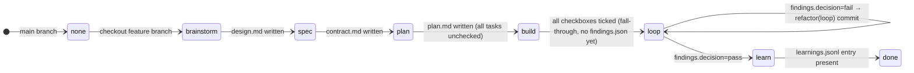

---

### Master step table

| # | Phase derived | Hook that fires | Skill invoked | Agent dispatched | Artifact written | Gate checked |
|---|---|---|---|---|---|---|
| 1 | `none` (main) | `UserPromptSubmit` → `prompt-router.sh` | — | — | — | Intent regex matches; `additionalContext` emitted advising branch creation |
| 2 | `none` → `brainstorm` | `SessionStart` → `session-start.sh` | — | — | `integrations.json` refreshed | Phase recomputed from scratch; `NEXT="No active task"` |
| 3 | `brainstorm` | `UserPromptSubmit` → `prompt-router.sh` | `claudehut:brainstorm` | `claudehut-brainstormer` (opus) | `.claudehut/specs/feature-user-purchase-history-design.md` | Brainstorm G0–G3 gates; `MAIN_ASKS_USER` loop |
| 4 | `spec` | `UserPromptSubmit` → `prompt-router.sh` | `claudehut:spec` | `claudehut-spec-writer` (sonnet) | `.claudehut/specs/feature-user-purchase-history-contract.md` | Spec G1–G5 gates + user approval |
| 5 | `plan` | `UserPromptSubmit` → `prompt-router.sh` | `claudehut:plan` | `claudehut-planner` (opus) | `.claudehut/plans/feature-user-purchase-history-plan.md` | Plan G0–G6 gates including `plan-parallel-group-scan.sh` |
| 6a | `build` | `PreToolUse` → `pre-tool.sh` | `claudehut:build` → `scaffold-stubs.sh` | No Task dispatch; headless `claude --print` session with `CLAUDEHUT_SCAFFOLD=1` | Commit `chore: scaffold stubs for feature-user-purchase-history` | `./gradlew compileJava compileTestJava` exits 0 |
| 6b | `build` | `PreToolUse` → `pre-tool.sh` (per file write) | `run-parallel-group.sh` (group 1) | Two `claude --print` workers: `claudehut-builder` persona on `claudehut/task-feature-user-purchase-history-1` and `claudehut/task-feature-user-purchase-history-2` | One commit per worker (DTO on branch 1, Repository on branch 2) | Per-group: `./gradlew compileTestJava test` after merge |
| 6c | `build` | `PreToolUse` → `pre-tool.sh` | `run-parallel-group.sh` (group 2) | One builder worker (Service) | Commit on `claudehut/task-feature-user-purchase-history-3` | Per-group `./gradlew compileTestJava test` |
| 6d | `build` | `PreToolUse` → `pre-tool.sh` | `run-parallel-group.sh` (group 3) | One builder worker (Controller) | Commit on `claudehut/task-feature-user-purchase-history-4` | Per-group `./gradlew compileTestJava test` |
| 7 | `loop` (fall-through) | `UserPromptSubmit` → `prompt-router.sh` | `claudehut:verify-review` | `claudehut-verifier` (sonnet) → fans out 5 reviewer agents in one parallel message | `.claudehut/findings/feature-user-purchase-history-findings.json` | `aggregate-findings.sh`: `critical==0 AND high<3` → `decision=pass` |
| 8 | `learn` | `Stop` → `stop.sh` | `claudehut:learn` | `claudehut-learner` (haiku) | `.claudehut/memory/learnings.jsonl` (append); `index.md` regenerated | G1 `secret-scan.sh`; G3 ≥1 entry with matching `task_id` |
| 9 | `done` | `Stop` → `stop.sh` | — | — | — | `stop.sh` emits non-blocking `systemMessage`; `claudehut-finish` archives to `_archive/feature-user-purchase-history-<ts>` |

---

### Detailed numbered sequence

**Step 1 — Prompt intercept on main branch**

The user types `"add endpoint to fetch user purchase history"` while `HEAD` is `main`.

`UserPromptSubmit` fires `hooks/prompt-router.sh`. The script sources `hooks/lib/state.sh`, calls `claudehut_task_id()` (returns `"none"` because branch is `main`), calls `claudehut_phase("none")` (returns `"none"`). The phrase does not match the skip-phrase regex (`\b(just write the code|skip …|ignore phases?)\b`). It does match `INTENT_REGEX` (`\b(add|…) (endpoint|…)\b` — no intervening article because `"add endpoint"` is adjacent). The hook returns:

```json
{ "hookSpecificOutput": { "hookEventName": "UserPromptSubmit",
  "additionalContext": "ClaudeHut: feature intent detected on default branch. Create a feature branch first:\n  git checkout -b feature/<slug>\nOR claudehut-worktree-create feature/<slug>…" } }
```

This is advisory (`additionalContext`), not a block. No phase skill is invoked yet.

---

**Step 2 — Branch creation and task_id derivation**

The user runs:

```
claudehut-worktree-create feature/user-purchase-history
```

`bin/claudehut-worktree-create` validates the branch is not a default branch, derives `TASK_ID="feature-user-purchase-history"` via `printf '%s' "$BRANCH" | tr '/' '-' | tr -c '[:alnum:]-' '-'`, creates a git worktree at `.worktrees/feature-user-purchase-history` with `git worktree add -b feature/user-purchase-history`, and prints the `cd` instruction.

On the next `SessionStart`, `session-start.sh` fires. It calls `claudehut_task_id()` → `"feature-user-purchase-history"`, `claudehut_phase(…)` → `"brainstorm"` (`.claudehut/` exists, design doc absent). The hook writes a fresh `integrations.json` (UA/graphify detection), reads `stack-signals.md`, and injects `additionalContext`:

```
Task:  feature-user-purchase-history  (branch: feature/user-purchase-history)
Phase: brainstorm  (derived from artifacts)
…
MANDATORY next: /claudehut:brainstorm. Source-code edits BLOCKED until design doc exists.
```

---

**Step 3 — Brainstorm phase (multi-iteration, scan-and-return subagent)**

Phase derived: `brainstorm` (no `.claudehut/specs/feature-user-purchase-history-design.md`).

`UserPromptSubmit` fires `prompt-router.sh` → `HINT="Phase=brainstorm. Use /claudehut:brainstorm…"` returned as `additionalContext`.

The user invokes `/claudehut:brainstorm`. The **orchestrator** (main thread) runs:

```bash
PROMPT=$( "$CLAUDE_PLUGIN_ROOT/skills/brainstorm/scripts/dispatch-prompt.sh" "add endpoint to fetch user purchase history" )
Task(subagent_type="claudehut-brainstormer", prompt="$PROMPT")
```

`dispatch-prompt.sh` composes: user intent + `stack-signals.md` (head 60 lines) + `conventions.md` (head 300) + `learnings-recent.md` (head 200) + any prior artifacts (none yet). No `answers[]` on first iteration.

`claudehut-brainstormer` (opus) preloads skills `claudehut:using-claudehut`, `claudehut:brainstorm`, `claudehut:reuse-scan`. It:

1. Invokes `claudehut:reuse-scan`, writing `.claudehut/reuse-scans/feature-user-purchase-history.json` (TTL clock starts; 600 s freshness window).
2. Reads `src/main/java` and `pom.xml`/`build.gradle` for existing types.
3. Drafts `.claudehut/specs/feature-user-purchase-history-design.md` (placeholders allowed for open decisions, e.g., `<TBD:pagination-strategy>`).
4. Runs `skills/brainstorm/scripts/design-doc-selfreview.sh` (G3 gate; exits 0 or non-zero only for `<TBD:*>` matched to `open_questions`).
5. Returns a fenced `claudehut-brainstorm-return` block with `task_id`, `design_doc`, `reuse_scan`, `open_questions[]`, `next_action="MAIN_ASKS_USER"`.

The main thread (orchestrator) parses the block. Because `next_action == "MAIN_ASKS_USER"`, it calls `AskUserQuestion(questions=[{question: "Pagination strategy?", options: ["cursor", "offset"]}])` (relaying the subagent's `open_questions` verbatim — the tool is unavailable inside the subagent). The user answers "cursor-based". The orchestrator re-dispatches `Task(claudehut-brainstormer, prompt=dispatch-prompt.sh … answers=[{id: "pagination-strategy", answer: "cursor"}])`.

On the second iteration, the subagent fills the `<TBD:pagination-strategy>` placeholder and returns `next_action="MAIN_REVIEWS_DRAFT"`. The orchestrator summarises the draft and calls `AskUserQuestion("Approve this design?")`. User approves.

Artifact written: `.claudehut/specs/feature-user-purchase-history-design.md`.
Phase re-derived on next hook call: `spec` (design doc present, contract absent).

---

**Step 4 — Spec phase (single subagent dispatch)**

Phase derived: `spec`.

`prompt-router.sh` emits `"Phase=spec. Use /claudehut:spec…"`. User invokes `/claudehut:spec`. Orchestrator dispatches:

```bash
Task(subagent_type="claudehut-spec-writer", prompt="$(dispatch-prompt.sh …)")
```

`claudehut-spec-writer` (sonnet) preloads `claudehut:using-claudehut`, `claudehut:spec`. It reads the design doc, fills `assets/templates/contract-doc.md.tmpl` with Given/When/Then acceptance criteria (e.g., `AC-1: GET /api/v1/users/{id}/purchases returns 200 + cursor page`), REST path `GET /api/v1/users/{id}/purchases`, edge cases (`id` not found → 404 RFC 7807, empty history → 200 empty page), NFR (p99 < 200 ms), and data contract (read-only JPA query on `purchases` table).

Artifact written: `.claudehut/specs/feature-user-purchase-history-contract.md`.
Phase re-derived: `plan`.

---

**Step 5 — Plan phase (single subagent dispatch, with scan gate)**

Phase derived: `plan`.

Orchestrator dispatches `Task(subagent_type="claudehut-planner", prompt="$(dispatch-prompt.sh …)")`.

`claudehut-planner` (opus) preloads `claudehut:using-claudehut`, `claudehut:plan`, `claudehut:tdd-cycle`. It reads the contract, atomises into 4 tasks across 3 parallel groups (each 2–5 min, one test method each):

| Task | File (create/modify) | Parallel group |
|------|---|---|
| 1 | `create: PurchaseHistoryResponse.java` (DTO record) | 1 |
| 2 | `create: PurchaseHistoryRepository.java` (JPA query) | 1 |
| 3 | `modify: PurchaseHistoryService.java` (service method) | 2 |
| 4 | `modify: PurchaseHistoryController.java` (endpoint) | 3 |

Tasks 1 and 2 are in group 1 because their file sets are disjoint and neither depends on the other. The planner runs:

- `plan-placeholder-scan.sh` (G2): verifies no "TBD" / vague language.
- `plan-spec-coverage.sh` (G3): verifies `AC-1` maps to ≥1 task.
- `plan-parallel-group-scan.sh` (G5): verifies groups are contiguous from 1, per-group file sets are disjoint, and `Task 3 depends on Task 1, Task 2` (service needs DTO + repo) → group 2 > group 1 ✓.

Artifact written: `.claudehut/plans/feature-user-purchase-history-plan.md` (all tasks `- [ ] complete`).
Phase re-derived: `build` (plan present, unchecked tasks exist).

---

**Step 6 — Build phase (headless OS processes, not Task subagents)**

Phase derived: `build`. `PreToolUse` hook (`pre-tool.sh`) is now the active gate.

**6a. Stub step (sequential, once)**

The build skill's SKILL.md instructs the orchestrator to run:

```bash
skills/build/scripts/scaffold-stubs.sh "add endpoint to fetch user purchase history" feature-user-purchase-history
```

The script sets `CLAUDEHUT_SCAFFOLD=1` in its environment, then launches a single headless `claude --print` session to generate signature-only stubs for all four types in `src/main/java`. `PreToolUse` fires but exits at line 63 of `pre-tool.sh` (`[[ -n "${CLAUDEHUT_SCAFFOLD:-}" ]] && exit 0`) — bypassing both the surgical-scope gate and the reuse-scan freshness check, since scaffolding legitimately touches files across all tasks. The session commits `chore: scaffold stubs for feature-user-purchase-history`. The script then runs `./gradlew compileJava compileTestJava`; if non-zero, it retries up to `CLAUDEHUT_SCAFFOLD_MAX_ATTEMPTS` (default 3) times via `--resume <session_id>`, then surfaces the error and stops.

**6b. Group 1 — parallel workers**

`run-parallel-group.sh "…" feature-user-purchase-history plan.md 1` extracts task numbers {1, 2} (unchecked, group 1) from the plan. For each task:

1. Creates a git worktree: `git worktree add -B claudehut/task-feature-user-purchase-history-<N> .worktrees/task-<N>` (`-B` force-resets on re-run).
2. Symlinks `.claudehut` into the worktree: `ln -s "$MAIN_REPO/.claudehut" "$WT_PATH/.claudehut"` so hooks can read the plan.
3. Launches a background `claude --print` process:
   ```bash
   CLAUDEHUT_TASK_ID=feature-user-purchase-history \
   CLAUDEHUT_WORKER=1 \
   CLAUDE_PROJECT_DIR="$WT_PATH" \
   claude --print \
     --agent claudehut:claudehut-builder \
     --model sonnet \
     --append-system-prompt "$GUARDRAILS" \
     --settings "$MAIN_REPO/.claude/settings.json" \
   < "$TASK_PROMPT" > "$LOG_DIR/task-1.log" &
   ```
4. Starts a watchdog: `( sleep 900; kill -TERM "$wpid" ) &`.

Workers run concurrently at the OS level. Each worker:

- `CLAUDEHUT_WORKER=1` causes `prompt-router.sh` to `exit 0` immediately (line 15) — no phase-routing for a headless session.
- `CLAUDEHUT_WORKER=1` causes `stop.sh` to `exit 0` (line 26) — no Learn-phase block for a worker.
- `PreToolUse` still fires but partial: the reuse-scan freshness gate is skipped for workers (the scan is stale from brainstorm-time, and a headless session cannot re-run `/reuse-scan`). The surgical-scope gate (`grep -qE "(create|modify|test):.*<rel_path>"` on the plan file) remains active.

Worker 1 (DTO) executes strict TDD:
1. Writes `PurchaseHistoryResponseTest.java` — `PreToolUse` checks `create: PurchaseHistoryResponseTest.java` appears in Task 1's file list.
2. Runs `./gradlew test --tests PurchaseHistoryResponseTest` → RED (stub throws `UnsupportedOperationException`).
3. Implements `PurchaseHistoryResponse.java` (overrides stub body).
4. Runs test again → GREEN. Commits `feat(api): add PurchaseHistoryResponse record` with `git add src/…/PurchaseHistoryResponse.java src/…/PurchaseHistoryResponseTest.java` (explicit paths, never `git add -A`).
5. Emits:
   ```
   ```claudehut-builder-result
   {"task_id":"feature-user-purchase-history","task":1,"verify_status":"pass","commit_sha":"abc123"}
   ```
   ```

Worker 2 (Repository) runs in parallel with the same TDD cycle in its own worktree.

After both workers exit, `run-parallel-group.sh` calls `merge-parallel-group.sh feature-user-purchase-history plan.md 1:claudehut/task-feature-user-purchase-history-1 2:claudehut/task-feature-user-purchase-history-2`. The merge script cherry-picks each worker's commits onto `feature/user-purchase-history` (chronological order, `git cherry-pick --no-edit`), then ticks `- [x] complete` in the plan file using POSIX awk (no gawk 3-arg match). Finally `run-parallel-group.sh` runs the **per-group gate**:

```bash
./gradlew compileTestJava test
```

Exit 0 → proceed. Exit 1 → surface failures to user; await decision.

The EXIT trap then runs `git worktree remove --force + rm -rf + git worktree prune` for both worktrees.

**6c–6d. Groups 2 and 3** repeat the same dispatch cycle (single worker each; groups run sequentially).

After group 3, the orchestrator runs `./gradlew check` (full check including Spotless/SpotBugs/JaCoCo). All plan tasks are now `- [x] complete`.

Phase re-derived: `loop` (all checkboxes ticked, no `findings.json` yet — the line-141 fall-through in `state.sh`, not driven by findings). The phase transition happens the moment the last checkbox is ticked, not on the next user prompt.

---

**Step 7 — Loop / verify-review phase (verifier + 5 parallel reviewers)**

Phase derived: `loop`.

`prompt-router.sh` emits `"Phase=loop. Invoke /claudehut:verify-review…"`. `stop.sh` emits a non-blocking `systemMessage` reminder if the session ends prematurely. User invokes `/claudehut:verify-review`.

Orchestrator dispatches:

```bash
Task(subagent_type="claudehut-verifier", prompt="$(dispatch-prompt.sh …)")
```

`claudehut-verifier` (sonnet) preloads `claudehut:using-claudehut`, `claudehut:verify-review`.

**Verify gates (sequential):** `run-verify-parallel.sh` runs build, unit tests, integration tests, JaCoCo coverage (`line ≥ 0.80`, `branch ≥ 0.70` per config), Spotless, SpotBugs/PMD, OWASP dep-check. A compile error stops the chain immediately. Passing the verify stage, the verifier proceeds to reviewers.

**Reviewer dispatch (G3: one message, multiple Task invocations).** Stack is `web=mvc, orm=jpa`; diff touches `PurchaseHistoryRepository.java` (JPA) and `PurchaseHistoryResponse.java` (DTO). No webflux → `reviewer-reactive` skipped. Roster:

| Reviewer | Condition | Dispatched? |
|---|---|---|
| `claudehut-reviewer-security` | always | yes |
| `claudehut-reviewer-perf` | always | yes |
| `claudehut-reviewer-style` | always | yes |
| `claudehut-reviewer-db` | diff touches `*Repository.java` | yes |
| `claudehut-reviewer-mapping` | diff touches `*Response.java` (DTO) | yes |
| `claudehut-reviewer-reactive` | `web_stack=webflux` only | **skipped** (`web=mvc`) |

All 5 are dispatched in a single orchestrator message. After each reviewer subagent stops, `SubagentStop` fires `hooks/subagent-stop.sh`. The script matches `claudehut-reviewer-*`, reads `.claudehut/findings/feature-user-purchase-history-findings.json`, and stamps `.reviewers["claudehut-reviewer-security"] = {completed_at: "…"}` — a completion audit entry only; the reviewer's actual finding content was already written by the verifier or the reviewer agent itself into the same file.

After all reviewers return, the verifier runs:

```bash
skills/verify-review/scripts/aggregate-findings.sh .claudehut/findings/feature-user-purchase-history-findings.json
```

The script computes:

```bash
.decision = (if (.totals.critical == 0 and .totals.high < 3) then "pass" else "fail" end)
```

Note: the runtime script uses `high < 3`, meaning 0–2 High findings still yield `decision=pass`. The verifier agent's Gates section (`0 critical AND 0 high → pass`) and the SKILL.md text state a stricter threshold than the script; where they conflict, the script governs.

**If decision=fail:** The verifier checks retry count via `claudehut_loop_retries()` (counting `git log` commits matching `^refactor\(loop\)`). If retries < 3 (hardcoded; not wired to `loop_max_retries` config key, which is a known gap), the verifier injects a refactor task into the plan and the worker commits with subject `refactor(loop): fix reviewer-security finding in PurchaseHistoryController`. This re-introduces an unchecked checkbox, so `claudehut_phase()` returns `build` again on the next derivation. At 3 retries the verifier escalates to the user instead.

**If decision=pass** (assumed here — 0 critical, <3 high): findings file is written with `decision: "pass"`.

Artifact written: `.claudehut/findings/feature-user-purchase-history-findings.json`.
Phase re-derived: `learn` (`findings.decision==pass` + no learnings entry yet).

---

**Step 8 — Learn phase (single haiku subagent)**

Phase derived: `learn`.

`stop.sh` fires when the session ends, reads `phase.stop_enforcement_enabled` from `.claudehut/claudehut-config.json`. With default `false`, it emits:

```json
{ "systemMessage": "ClaudeHut: Verify/Review gates are green but the Learn phase has not run. Invoke /claudehut:learn…" }
```

User invokes `/claudehut:learn`. Orchestrator dispatches:

```bash
Task(subagent_type="claudehut-learner", prompt="$(dispatch-prompt.sh …)")
```

`claudehut-learner` (haiku) preloads `claudehut:using-claudehut`, `claudehut:learn`.

It:

1. Runs `learn-extract.sh` (heuristic file-pattern matching on `git diff base..HEAD`) to propose candidates.
2. Categorises: e.g., `pattern` — "Use JPA `@Query` with keyset pagination for cursor-based fetch"; `decision` — "Chose cursor-based over offset pagination (contract AC-1 rationale)".
3. For each candidate, runs `secret-scan.sh` (12 hard-reject regex patterns: API keys, JDBC URLs with credentials, PEM headers, JWT tokens, etc.). On a match: logs `"pattern matched: postgres://.* pattern"` to `learn-rejected.log` (never the matched text); entry is re-derived without the secret content.
4. Appends clean entries to `.claudehut/memory/learnings.jsonl` (append-only, `replaces:` for supersession).
5. Runs `reindex.sh` → regenerates `index.md` from `src/main/java` domain packages.
6. Runs `promote.sh`: reads `memory.global_promotion_opt_in` from `claudehut-config.json` (default `false`) → skips promotion unless opted in. If `true`, computes `sha256(git remote.origin.url)` as project identity, updates `~/.claude/claudehut/memory/projects.json`, and copies entries where `projects.json[signature].projects.length >= promotion_min_projects` (default 3) to `~/.claude/claudehut/memory/patterns.jsonl`.

Artifact written: `.claudehut/memory/learnings.jsonl` (≥1 entry with `"task_id":"feature-user-purchase-history"`).
Phase re-derived: `done` (`findings.decision==pass` AND learnings entry present).

---

**Step 9 — Done and finish**

Phase derived: `done`.

`stop.sh` emits a non-blocking `systemMessage`: `"ClaudeHut: task complete. Run claudehut-finish to archive…"`.

User runs `claudehut-finish`. The script verifies `phase ∈ {done, learn}` and the working tree is clean (`git diff --quiet && git diff --cached --quiet`), prompts `"Confirm? [yes/NO]"`, then archives:

```
.claudehut/state/tasks/feature-user-purchase-history
  → .claudehut/state/tasks/_archive/feature-user-purchase-history-20260529T120000Z
```

It removes the lockfile and `active-task.json` pointer, then prints suggested next steps (`git push -u origin feature/user-purchase-history` / `gh pr create`).

---

### Notes for reviewers

| Finding | Location |
|---|---|
| `aggregate-findings.sh` decision rule is `high < 3` (1–2 High = pass), stricter prose in agent G5 says `high==0`. Script governs. | `skills/verify-review/scripts/aggregate-findings.sh` line 7 |
| `loop_max_retries` config key (default 3 in `plugin.json`) is not wired to the hardcoded `3` threshold in retry logic. Config change has no effect at runtime. | `hooks/lib/state.sh` `claudehut_loop_retries()` vs `.claude-plugin/plugin.json` |
| `SubagentStop` stamps only `{completed_at}` — it does not write reviewer finding content. The verifier agent writes findings; SubagentStop is audit-trail only. | `hooks/subagent-stop.sh` vs FACTS claim |
| Authoritative findings path: `.claudehut/findings/<id>-findings.json` (read by `claudehut_findings_decision()`). `skills/verify-review/scripts/run-verify-parallel.sh` references `.claudehut/state/tasks/<id>/findings.json` — inconsistency. | `hooks/lib/state.sh:claudehut_findings_doc()` |
| Reuse-scan from brainstorm is stale by build time (>600 s). Workers bypass the freshness gate via `CLAUDEHUT_WORKER=1`; scaffolding bypasses via `CLAUDEHUT_SCAFFOLD=1`. No deadlock. | `hooks/pre-tool.sh` lines 91–105, 63 |

---

## 12. Testing & quality gates

ClaudeHut ships a single entry-point test runner, `tests/run-all.sh`, that orchestrates 16 numbered layers (L1.1–L16) plus five standalone scripts for bash compatibility, reference integrity, snapshots, perf, and reviewer dispatch. All 375 assertions in `run-all.sh` pass; the five standalone scripts add a further 47 verified assertions (8 + 5 + 11 + 9 + 14 = 47).

### Layer overview

| Layer | File(s) | What it guards | Assertions in `run-all.sh` |
|---|---|---|---|
| **L1.1** JSON validity | `run-all.sh` | `python3 json.load` on `plugin.json`, `hooks.json`, `.mcp.json`, `settings.json`, `claudehut-config.template.json` | 5 |
| **L1.2** Bash syntax | `run-all.sh` | `bash -n` on every `*.sh` under `scripts/`, `bin/`, `tests/fixtures/`, `skills/*/scripts/` | 73 |
| **L1.3** Mermaid balance | `run-all.sh` | All `*.md` outside `tests/` and `.claude/`: opens == closes per `awk` fence counter | 8 |
| **L1.4** SKILL.md frontmatter | `run-all.sh` | Every `skills/*/SKILL.md` must have `---` block with `name:` == folder name and non-empty `description:` | 30 |
| **L1.5** Agent frontmatter | `run-all.sh` | Every `agents/*.md` must have `name:`, `description:`, `model:` (valid model token); non-orchestrator agents must carry a `skills:` preload list containing the required domain skills and `claudehut:using-claudehut` as first entry; every non-orchestrator must contain `## Skill Discipline` section | 49 |
| **L1.6** SKILL.md reference links | `run-all.sh` | All `references/X.md` citations inside `SKILL.md` files must resolve to existing files | 30 |
| **L1.7** Rule frontmatter | `run-all.sh` | Every `rules/**/*.md` must carry `paths:` frontmatter as a YAML list | 2 |
| **L1.8** Plugin manifest spec | `run-all.sh` | `plugin.json` `name` is kebab-case and `version` is semver | 3 |
| **L2.1** `state.sh` phase derivation | `run-all.sh` | Unit-tests all 8 phase transitions (`uninitialized → brainstorm → spec → plan → build → loop → learn → done`) plus `none` on `main` branch | 9 |
| **L2.2** `validate-migration.sh` | `run-all.sh` | Accepts `V*__name.sql` with safe DDL; rejects `ADD COLUMN NOT NULL` without DEFAULT; rejects `R__` with table DDL | 3 |
| **L2.3** `secret-scan.sh` | `run-all.sh` | No false-positive on clean text; detects `AKIA*` AWS key, `sk-` API key, `postgres://user:pass@` URL | 4 |
| **L2.4** `design-doc-selfreview.sh` | `run-all.sh` | Accepts complete design doc; rejects `TBD` placeholder; rejects doc missing required sections | 3 |
| **L2.5** Plan validators | `run-all.sh` | `plan-placeholder-scan.sh` and `plan-spec-coverage.sh` accept clean/covering plans; reject TBD and uncovered ACs; `plan-parallel-group-scan.sh` rejects file conflicts in same group, deps in same group, and tasks missing the `Parallel group:` field | 8 |
| **L2.6** `validate-skill.sh` | `run-all.sh` | Runs skill validator against every `skills/*/` directory (30 skills) | 30 |
| **L2.7** `extract-nouns.sh` | `run-all.sh` | Extracts `user`, `purchase`, `history` from sample sentence; returns empty on empty input | 2 |
| **L3.1** `session-start.sh` uninitialized | `run-all.sh` | Hook stdout contains `"not initialized"` when `.claudehut/` is absent | 1 |
| **L3.2** `session-start.sh` initialized | `run-all.sh` | Hook emits `"ClaudeHut active"`, derives `Phase: brainstorm`, and surfaces `webflux` stack signal | 3 |
| **L3.3** `prompt-router.sh` | `run-all.sh` | Blocks skip-attempt prompt (`decision == "block"`); suggests feature branch on intent prompt on `main` | 2 |
| **L3.4** `pre-tool.sh` destructive bash | `run-all.sh` | Denies `rm -rf /` and `git push --force origin main`; allows `./gradlew test` | 3 |
| **L3.5** `pre-tool.sh` phase-scope | `run-all.sh` | Denies `src/` edits in `brainstorm` phase; allows `.claudehut/` writes at any phase | 2 |
| **L4** Coverage counts | `run-all.sh` | Asserts 45 rule files, 17 agents, 30 skill SKILL.md files, ≥7 hook events, ≥3 MCP servers | 6 |
| **L5** Enforcement simulation | `run-all.sh` | All 17 agents have `Goals + Gates + Guardrails + Heuristics` sections; plan template has `Parallel group:` field; planner and builder agents document it; `merge-parallel-group.sh` and `plan-parallel-group-scan.sh` exist and are executable; 7 main agents have a Mermaid state diagram | 8 |
| **L6** E2E simulated workflow | `run-all.sh` (delegates to `tests/e2e/simulated/full-workflow.sh`) | Walks all 6 phases via scripted artifacts; verifies phase transitions, hook outputs, validator calls, and artifact presence — 33 steps | 1 (exit code) |
| **L7** Bash 3.2 compat | `run-all.sh` (delegates to `tests/static/bash-compat.sh`) | No `mapfile`/`readarray`, `declare -A`, `declare -n`, `${var,,}`, `wait -n`, or gawk 3-arg `match()` across all scripts | 1 (exit code) |
| **L8** Bidirectional reference integrity | `run-all.sh` (delegates to `tests/static/ref-integrity.sh`) | skill→rule, rule→skill, agent→skill, and agent→bin/ cross-references all resolve; 45 rule files carry `paths:` frontmatter | 1 (exit code) |
| **L9** Snapshot tests | `run-all.sh` (delegates to `tests/snapshot/run-snapshots.sh`) | 11 golden JSON files in `tests/snapshot/golden/` cover hook outputs for `session-start`, `prompt-router`, `pre-tool` (4 scenarios), `stop`, `pre-compact`, `file-changed`; normalized output must match golden | 1 (exit code) |
| **L10** Perf budget | `run-all.sh` (delegates to `tests/perf/hook-benchmark.sh`) | 9 hooks × 20 runs each; p95 latency must stay within design budgets: SessionStart ≤ 2000 ms, UserPromptSubmit/FileChanged ≤ 200 ms, PreToolUse ≤ 300 ms, Stop ≤ 1000 ms, PostToolUse/SubagentStop/PreCompact ≤ 500 ms | 1 (exit code) |
| **L11** Reviewer dispatch | `run-all.sh` (delegates to `tests/integration/reviewer-dispatch.sh`) | Simulates 6 reviewer subagents writing via `subagent-stop.sh`; verifies `findings.json` totals and `aggregate-findings.sh` decision logic (`pass` when critical=0 and high<3; `fail` when critical≥1) | 1 (exit code) |
| **L12** Dispatch contract | `run-all.sh` | Each of 6 phase skills (`brainstorm`, `spec`, `plan`, `build`, `verify-review`, `learn`) must have `## Dispatch contract` section, correct `subagent_type=` value, and an executable `scripts/dispatch-prompt.sh`; `session-start.sh` output must contain "dispatch contract"; orchestrator must carry `DO NOT SPAWN as subagent` guard | 8 |
| **L13** Hook schema conformance | `run-all.sh` | All 9 hooks produce valid JSON or silence; emitted top-level keys must be within the documented allowlist; `hookSpecificOutput` is only permitted for `PreToolUse`, `UserPromptSubmit`, `PostToolUse`, `PostToolBatch`, `SessionStart`; `Stop` default mode emits `systemMessage` not `decision=block`; opt-in mode (`stop_enforcement_enabled:true`) emits `decision=block` | 11 |
| **L14** Bootstrap skill integrity | `run-all.sh` | `skills/using-claudehut/SKILL.md` exists with `name: using-claudehut`, required body sections (`Non-negotiable invocation rule`, `Red flags`, `How dispatch maps to skill invocation`, `Catalog`), `"1% chance"` rule literal, catalog row count == skills directory count, and `scripts/regen-using-claudehut.sh` is idempotent (outputs `"no change"`) | 9 |
| **L15** Subagent UX contract | `run-all.sh` | No non-orchestrator agent body contains a call-syntax reference to Anthropic runtime-blocked tools (`Agent(`, `AskUserQuestion(`, `EnterPlanMode(`, `ScheduleWakeup(`, `WaitForMcpServers(`); brainstormer body contains `scan-and-return`, `TERMINATE`, `claudehut-brainstorm-return`, `open_questions`; `skills/brainstorm/SKILL.md` documents `AskUserQuestion` and `next_action` | 7 |
| **L16** Parallel build contracts | `run-all.sh` | 50-assertion battery covering: `run-parallel-group.sh` (worktree isolation with `worktree add -B`, `.claudehut` symlink, `--agent claudehut:claudehut-builder`, `--settings` merge, `CLAUDEHUT_WORKER=1` export, `TASK_TIMEOUT` watchdog, per-group integration gate, `trap cleanup EXIT`, bash-3.2-safe empty-array expansion, symlink nesting guard, `claude agents list` probe); `scaffold-stubs.sh` (stub commit, `--resume` retry loop, empty `session_id` guard, `CLAUDEHUT_SCAFFOLD=1` bypass, `CLAUDEHUT_WORKER=1` export); `pre-tool.sh` honors both bypasses with behavioral tests including symlink/canonical path mismatch; `merge-parallel-group.sh` (cherry-pick, task:branch pair parsing, `check-ignore` guard); planner documents over-parallelization heuristic; builder has no `PickTask` loop; builder result block has `task`, `commit_sha`, `verify_status`, `task_id` fields | 50 |

### Standalone scripts

The five standalone scripts are each invoked by `run-all.sh` (exit-code delegation) but can also be run independently:

| Script | Own assertions | Invoked from `run-all.sh` layer |
|---|---|---|
| `tests/static/bash-compat.sh` | 8 | L7 |
| `tests/static/ref-integrity.sh` | 5 | L8 |
| `tests/snapshot/run-snapshots.sh` | 11 | L9 |
| `tests/perf/hook-benchmark.sh` | 9 | L10 |
| `tests/integration/reviewer-dispatch.sh` | 14 | L11 |
| `tests/e2e/simulated/full-workflow.sh` | 33 | L6 |

### Real-Claude E2E (`tests/e2e/run-real-claude.sh`)

An opt-in suite that spawns the live `claude` CLI with `--plugin-dir`, so it is **not** part of the default CI run. It creates a temporary Maven/WebFlux fixture project, pre-initializes `.claudehut/`, then replays three prompt fixtures from `tests/e2e/prompts/`:

- `01-feature-intent-on-main.txt` — asserts `SessionStart` hook fired and workflow engagement (branch or 6-phase vocabulary) is present in assistant output.
- `02-brainstorm-skill-triggered.txt` — asserts brainstorm-related response and `SessionStart` hook.
- `03-skip-attempt-blocked.txt` — asserts either a hard block (`num_turns=0`, `input_tokens=0`) or an enforcement explanation from the assistant.

Each run streams `--output-format stream-json` to `tests/e2e/.runs/<timestamp>/`, parses hook events with `jq`, and captures raw assistant text. Results from prior runs are preserved under `.runs/20260527-*`.

### Assertion totals

`tests/run-all.sh` reports **375 assertions, 0 failures, 0 skips**. This figure includes the exit-code delegations to the six standalone/delegated scripts. Running the standalone scripts directly confirms their internal assertion counts (8 + 5 + 11 + 9 + 14 + 33 = 80 fine-grained assertions across L6–L11).

```
Total: 375   Pass: 375   Fail: 0   Skip: 0   (as of 2026-05-29)
```

### Test execution model

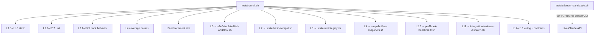

All layers except the real-Claude E2E suite require only `bash`, `python3`, `jq`, and `git` — no running services, no network.

---

## 13. Design Decisions, Trade-offs, Known Limitations & Questions for Reviewers

### A. Design Decisions & Trade-offs

#### 1. Artifact-derived state vs. a JSON state file

| Dimension | Decision | Alternative rejected | Why chosen | Cost |
|---|---|---|---|---|
| **Phase source-of-truth** | Phase derived at read-time from artifact presence on disk (`state.sh:114–142`) | Mutable `state.json` written on each transition | Eliminates write-then-read race; state is never stale after a crash or interrupted hook; git branch checkout naturally resets it | Phase derivation is a pure function of disk — adding a new phase requires a new artifact convention, not a new field; two unrelated phases that share the same artifact pattern could alias |

The derivation priority is documented verbatim in `hooks/lib/state.sh:1–17`. Five ordered checks (design doc → contract doc → plan doc → unchecked tasks → findings decision) map cleanly to six phases. The "loop fall-through" at line 141 (`echo "loop"` when plan is complete but no findings exist) is not a transition artifact; it is a logical default, which means the phase is ambiguous between "build just finished and we haven't started verify" and "verify is running". This is intentional but is the single case where the derivation is not purely artifact-resolved.

---

#### 2. Git branch = task identity

| Dimension | Decision | Alternative rejected | Why chosen | Cost |
|---|---|---|---|---|
| **Task namespace** | `TASK_ID = git branch → slashes to dashes` (`state.sh:31–51`) | UUID in config file; or `CLAUDE_SESSION_ID` | Zero new state: artifact paths (`specs/<id>-design.md`, `plans/<id>-plan.md`) are namespaced automatically; worktrees branch off the same id; rollback is `git reset` | Main/master/trunk/develop/dev all yield `"none"`, blocking any task on a protected branch; branch renames silently orphan all artifacts; the slug transform (`tr '/' '-' | tr -c '[:alnum:]-' '-'`) collapses distinct branches to the same id if they differ only in non-alphanumeric characters |

`CLAUDEHUT_TASK_ID` env-var override is the escape hatch for worktree workers (`run-parallel-group.sh:173`) so each sub-process still resolves the parent task's artifacts despite being on a derived branch (`claudehut/task-<id>-<N>`).

---

#### 3. External `claude --print` parallelism (Path B) vs. Agent-tool subagents for Build

| Dimension | Decision | Alternative rejected | Why chosen | Cost |
|---|---|---|---|---|
| **Build executor** | One OS-level `claude --print` process per task, launched with `&` in `run-parallel-group.sh` | Agent-tool subagents inside the main thread | (1) LLM cooperation cannot be forced to batch Agent calls in parallel; (2) full sessions are immune to bug #25834 (subagent skill-preload silent drop) and #49106 (rules degradation across spawn boundary), documented in `skills/build/references/parallel-build-verification.md:7–10` | Each worker is a full Sonnet session: API cost is N × full-session cost; latency is bounded by TASK_TIMEOUT (default 900 s) per group; a single runaway worker blocks the group merge; per-group compile+test gate cost compounds linearly with groups |

The mitigation for cost is `CLAUDEHUT_WORKER_MODEL` (default `sonnet`); the mitigation for the runaway case is the watchdog subshell (`run-parallel-group.sh:185`). The EXIT trap ensures worktrees are always cleaned (`run-parallel-group.sh:125–134`).

---

#### 4. Contract-first stub commit

| Dimension | Decision | Alternative rejected | Why chosen | Cost |
|---|---|---|---|---|
| **Pre-parallelism step** | `scaffold-stubs.sh` generates compiling skeleton code from contract + plan, commits once before any group | Let each worker generate its own types | Three failure modes eliminated simultaneously (documented in `scaffold-stubs.sh:10–16`): contract drift, hidden dependency, semantic merge conflict — all three trace to concurrent workers inventing divergent signatures | Stub step is sequential, adding one Sonnet call to every Build phase; compile-retry loop (up to `CLAUDEHUT_SCAFFOLD_MAX_ATTEMPTS`, default 3) can fail hard; `CLAUDEHUT_SCAFFOLD=1` bypass must be kept in sync with any new edit-mode gates added later |

---

#### 5. Rule tier taxonomy (advisory / reinforced / enforced)

| Tier | Mechanism | Example | What it can/cannot catch |
|---|---|---|---|
| **Tier 1 — advisory** | Claude Code native `paths:` loader injects rule markdown as context on file-glob match | All 35 universal rules | Catches any violation the LM can reason about in context; subject to compaction (`pre-compact.sh` preserves critical/high rules, evicts low) |
| **Tier 2 — reinforced** | Rule content baked into reviewer agent descriptions and heuristics | `lombok-jpa-safety` `## Reviewer block-list` copied into `claudehut-reviewer-security`; `deserialization` patterns in reviewer heuristics | Survives context window eviction; fires in every Loop iteration independent of rule file load; cannot catch what the LM mis-classifies |
| **Tier 3 — enforced write-time** | `migration-safety` + `flyway-naming` → `claudehut-migration-validator` agent via PreToolUse; verdict `block` → `permissionDecision: "deny"` | DDL pattern match (`V*.sql`) | Statically pattern-matchable; catastrophic if wrong; zero false-negative risk for the exact pattern set; cannot handle security rules that require contextual LM reasoning |
| **Tier 3 — enforced loop gate** | `aggregate-findings.sh` decision rule; `jacocoTestCoverageVerification`; `watch-test-fail.sh` TDD gate | Security criticals from reviewer block Loop advance; coverage threshold blocks merge | Post-hoc (after build) rather than write-time; cannot stop the write, only stops the advance |

**Why hook-enforcement for critical rules, not natural language:** Natural-language rules in CLAUDE.md can be overridden by sufficiently forceful user prompts or compaction. `permissionDecision: "deny"` in a PreToolUse hook is a hard platform primitive that the LM cannot override. The design confines this to DDL writes because the pattern-match is precise (`V[0-9]+__*.sql` + column-drop regex); security rules such as `deserialization` require contextual reasoning about the surrounding code that a regex cannot provide, so they are routed through the reviewer subagent at Loop time instead.

---

#### 6. Bash 3.2 / POSIX-awk portability constraints

| Dimension | Decision | Alternative rejected | Why chosen | Cost |
|---|---|---|---|---|
| **Shell target** | All `.sh` files run under `#!/usr/bin/env bash`; no `mapfile`, `declare -A/-n`, `${var,,}`, `wait -n`; no gawk 3-arg `match()` | Require bash 4+ or zsh | macOS ships bash 3.2 as system default; CI matrix includes `macos-latest`; a plugin that breaks on the developer's own machine is dead on arrival | `merge-parallel-group.sh:67–76` uses POSIX awk with `sub()` + arithmetic coercion rather than gawk `match(str,re,arr)` — the code is more verbose; `run-parallel-group.sh:175` uses `${arr[@]+"${arr[@]}"}` expansion guard for empty arrays under `set -u`, a known bash 3.2 idiom |

Static enforcement lives in `tests/static/bash-compat.sh` (L7), which scans all `.sh` files for the forbidden features and fails CI if any are found.

---

#### 7. Per-group gate vs. final-only gate

| Dimension | Decision | Alternative rejected | Why chosen | Cost |
|---|---|---|---|---|
| **Integration check cadence** | `./gradlew compileTestJava test` (or `mvn -q test-compile test`) runs after each parallel group merges | Single gate at the end of all groups | Groups build on each other: group N+1 tasks import types introduced in group N; a final-only gate propagates a semantic break silently through all later groups, making the root cause harder to isolate | Each group gate is a full compile+test cycle; on a large codebase this is the dominant latency cost per group; the gate is explicitly labelled "load-bearing enforcement" (`run-parallel-group.sh:114`) while in-worktree hook scope-checks are "defense-in-depth" |

---

### B. Known Limitations & Open Questions for Reviewers

#### Confirmed limitations with file-level evidence

**1. `skills:` frontmatter preload under `claude --print` is unconfirmed.**
`skills/build/references/parallel-build-verification.md:26–29` documents the finding verbatim: "the model reported preloaded `skills:` as 'none'. Whether `skills:` frontmatter preload takes effect under `--print` is UNCONFIRMED." The mitigation is that TDD essentials are injected via `--append-system-prompt` (`run-parallel-group.sh:54–69`) and the agent persona body is authoritative. However, the `tdd-cycle` and `build` skills listed in `agents/claudehut-builder.md` frontmatter may silently not load in any headless worker session. Any reasoning or templates in those skills that the builder needs but that are not duplicated in the guardrail block or persona body would be silently absent.

**2. Project-scope plugin enablement discovery from out-of-tree worktree cwd.**
Each worker runs with `cd "$WT_PATH"` (a temp directory under `/tmp`). Plugin hook discovery walks up from cwd. The workaround is `--settings "$MAIN_REPO/.claude/settings.json"` (`run-parallel-group.sh:116`) — but this is best-effort: "Best-effort: the real enforcement is the per-group gate." If `settings.json` is absent or the plugin reference is wrong, the PreToolUse scope-check hook silently does not fire for workers, and scope enforcement degrades to zero until the per-group gate.

**3. Worker reuse-scan bypass trade-off.**
`CLAUDEHUT_WORKER=1` bypasses the reuse-scan freshness gate in `hooks/pre-tool.sh:91`. The rationale is correct (a headless worker cannot interactively run `/reuse-scan`), but the consequence is that a worker writing a new `*.java` file proceeds without any freshness check, relying entirely on the reuse decision made at plan time. If the codebase changed between plan and build (e.g., a separate concurrent branch landed a similar class), the worker will not be redirected.

**4. Cost/latency of full-session workers.**
Each parallel task is a full Sonnet session with a 900-second watchdog. For a plan with 3 groups of 4 tasks each, that is up to 12 independent Sonnet sessions, each potentially running to the full timeout. There is no per-session token cap or dynamic timeout scaling based on task complexity. The `CLAUDEHUT_WORKER_MODEL` variable allows substituting Haiku, but this is not the default and is not documented as a cost-reduction lever in the user-facing config template.

---

#### Behavioral discrepancies found by source inspection

These are specification-vs-implementation mismatches that affect runtime correctness. They are distinct from the cosmetic issues below.

**5. Decision rule split: `aggregate-findings.sh` vs. `claudehut-verifier.md` G5.**
`skills/verify-review/scripts/aggregate-findings.sh:17` writes:
```
.decision = (if (.totals.critical == 0 and .totals.high < 3) then "pass" else "fail" end)
```
`agents/claudehut-verifier.md:50` states G5: "0 critical AND 0 high → pass; else fail." The verifier also states at line 103: "You do NOT decide whether to relax decision rule (binary: 0 critical + 0 high → pass)." A diff with `critical=0, high=2` will be stamped `decision=pass` by the shell script but should fail per the spec. Because phase advancement is driven by `claudehut_findings_decision()` reading that JSON file (`state.sh:97–102`), a build with 2 high findings would silently advance to Learn.

**6. Findings path split between `run-verify-parallel.sh` and `state.sh`.**
`skills/verify-review/scripts/run-verify-parallel.sh:4` declares it writes to `.claudehut/state/tasks/<task-id>/findings.json`. `hooks/lib/state.sh:81–87` (`claudehut_findings_doc`) reads from `.claudehut/findings/<task-id>-findings.json`. If the verify script actually writes to the `state/tasks/` path and the phase deriver reads from `findings/`, the phase will never advance from loop to learn on a `pass` result. The facts note this path as "an inconsistency" and identifies `.claudehut/findings/<id>-findings.json` as authoritative; `run-verify-parallel.sh` appears to be the stale path.

**7. `loop_max_retries` userConfig is a no-op.**
`plugin.json:27–34` defines `loop_max_retries` (default 3) as a user-configurable field. The verifier agent hardcodes the threshold at `< 3` / `≥ 3` in G6, G7, the state diagram, and the refactor injection format. Neither the dispatch scripts nor the verifier agent reads the config value at runtime. A user who sets `loop_max_retries: 5` in the UI will observe no change in behavior.

**8. `destructive_command_allowlist` is advertised but never read.**
`hooks/pre-tool.sh:32–41` blocks unconditionally on the destructive-command regex. Line 37 tells users: "Add allowlist entry in `claudehut-config.json#phase.destructive_command_allowlist` if intentional." The template at `templates/claudehut-config.template.json:7` defines this key. The hook never reads the config file in the bash-mode branch; there is no allowlist check. A user who legitimately needs `git push --force` (e.g., rewriting a feature branch after rebase) has no working escape hatch.

**9. `claudehut-state stack` subcommand cannot match stack-signals.md.**
`bin/claudehut-state:43–45` prepends `.` to the field argument before calling `claudehut_stack_signal` (e.g., argument `web` → `.web`). `state.sh:176` greps for `^- .web:`. Stack-signals.md rows are formatted `- web: mvc`. The grep pattern `^- .web:` would not match a literal `- web:` row because `.` in a POSIX ERE matches any character — but the intended match is `^- web:`. The help text at line 81 additionally refers to `stack-signals.json` (the correct filename is `stack-signals.md`). Any agent or script that uses `claudehut-state stack <field>` to branch on stack signals will silently get an empty result.

---

#### Residual items flagged in implementation comments

- `hooks/pre-tool.sh:3–4` notes that rule injection moved to the native loader; the comment is accurate but the old `pre-write-scope-check.sh` remains on disk as an unwired legacy script — a maintenance hazard.
- `session-start.sh` writes `integrations.json` on every SessionStart, making it a single-writer file. If two sessions start simultaneously for the same project (rare but possible with split-window terminals), the second write wins without merge.
- The `claudehut_has_learnings` function uses literal `grep -qF` on `"task_id":"$task_id"` — a compact JSONL string match. A formatted JSONL entry (`"task_id": "foo"` with a space) would not match, silently keeping the phase at `learn` forever.

---

### Questions for External Reviewers (Codex, Claude Mythos)

1. **Decision rule (behavioral — highest priority).** `aggregate-findings.sh:17` passes when `high < 3`; the spec says any high is a fail. Which is the intended contract? If the shell script is wrong, a two-high build silently graduates to Learn without user awareness.

2. **Findings path (behavioral).** Does `run-verify-parallel.sh` actually write to `.claudehut/state/tasks/<id>/findings.json`? If so, the phase deriver (`state.sh:97–102`) will never see a `pass` result and the task will never leave `loop`. Is there a missing symlink, copy step, or path normalization the document does not describe?

3. **`skills:` preload under `--print` (correctness hole or tolerated gap?).** If `skills:` frontmatter is silently dropped for all headless workers, and the `tdd-cycle` skill carries reasoning or templates not duplicated in the guardrail block, TDD steering is degraded for every Build task. Is there a platform commitment on this, or should TDD essentials be fully lifted into the agent persona body and `--append-system-prompt`?

4. **`claudehut-state stack` grep pattern.** With the `.` prepended to the field name, the grep is `^- .web_stack:` against rows of the form `- web: mvc`. This cannot match. Does any live code path depend on this subcommand returning a non-empty result? If reviewers or hooks call `claudehut-state stack web`, the entire stack-conditional branch is dead.

5. **`loop_max_retries` config binding.** Is there a mechanism by which the verifier agent reads `claudehut-state config phase.loop_max_retries` at runtime? If not, the userConfig field is cosmetic. For a plugin aimed at teams with different risk tolerances, this binding matters.

6. **Concurrent `.claudehut` writes across worktrees.** Each worker symlinks `.claudehut` from the main repo (`run-parallel-group.sh:160`). Subagent-stop writes reviewer findings to `.claudehut/findings/<id>-findings.json#reviewers.<name>`. If two reviewers complete concurrently and both invoke `jq` with a write-then-move pattern, is the merge safe? The `aggregate-findings.sh` approach (read-modify-write via `jq`) is not atomic — what prevents a lost-update between two concurrent reviewer SubagentStop calls?

7. **`destructive_command_allowlist` escape hatch.** The hook advertises an allowlist but never reads it. A developer doing a legitimate `git push --force` on a feature branch has no recourse. Is the intent to remove the error text, implement the allowlist, or gate the block on branch name (e.g., exempt non-protected branches)?

8. **`claudehut_has_learnings` compact-JSON assumption.** The phase deriver uses `grep -qF '"task_id":"<id>"'` (no space after colon). If a learner or external tool writes `{"task_id": "…"}` with standard JSON spacing, the task stays at `learn` indefinitely. Is there a canonical writer contract, and is it enforced?

9. **Full-session cost scaling.** With N tasks per group and M groups, peak concurrent API spend is proportional to N × (Sonnet context cost). At what plan size does this become prohibitive vs. Agent-tool subagents, given that the primary motivation for Path B is correctness (skill preload, rules degradation) rather than cost? Is there a documented breakeven or a plan to adopt a cheaper model for workers once the skill-preload question is resolved?

10. **Stack-signal unknown → conditional rules skipped silently.** `init-project.sh:126` skips stack-conditional rules when stack is `unknown`. If a project omits `stack-detector` (or if detection fails), Spring-WebFlux or R2DBC-specific rules are never installed, and the developer has no indication. Should `init --refresh` warn explicitly when conditional rules are absent because of unknown stack?
