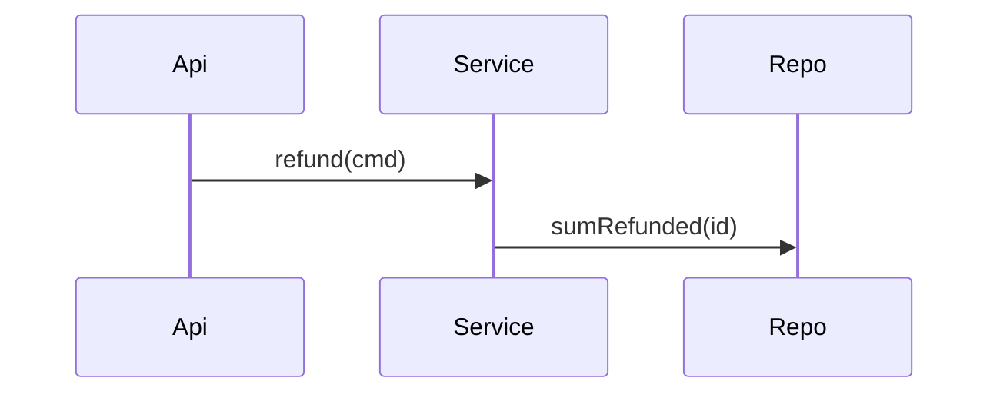

# Plan: Refund ceiling
> id: 0001-refund-ceiling · spec-rev: 1 · route: full · rev: 1 · status: draft

## 1. Approach
Implement D-1 by extending the refund service; reuse anchor RefundService.

## 2. Design

## 3. Interfaces & Data
| Element | Change | Contract | Req |
|---|---|---|---|
| RefundService | modify | `RefundService#refund(cmd): Refund` | AC-001 |

## 4. Tasks
### Phase 1 — ceiling
| ID | Goal | Files | Test first | Verify | Depends | Req |
|---|---|---|---|---|---|---|
| T1 | reject overshoot | src/main/RefundService.java | RefundCeilingTest#over | gradle test | - | AC-001 |
| T2 | record refund | src/main/RefundRepo.java | RefundRepoTest#row | gradle test | T1 | AC-002, D-1 |

## 5. Risks & Rollback
Revert the commit; no schema change.
