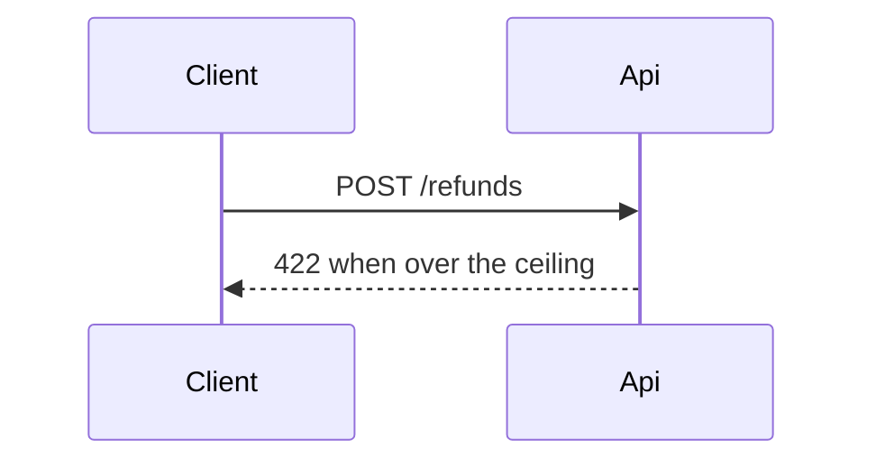

# Spec: Refund ceiling
> id: 0001-refund-ceiling · profile: feature · route: full · rev: 1 · status: draft · date: 2026-09-30

## 1. Context
Partial refunds can exceed the captured amount today (RefundService.java:42 via context.md).

## 2. Goals & Non-Goals
Goal: cap refunds at the captured amount. Non-goal: multi-currency.

## 3. Requirements
| ID | Requirement (EARS) | Acceptance (GWT) |
|---|---|---|
| AC-001 | WHEN a refund exceeds the remaining amount THE SYSTEM SHALL reject it | GIVEN captured 100 WHEN refund 120 THEN HTTP 422 |
| AC-002 | THE SYSTEM SHALL record each refund | GIVEN refund 20 WHEN accepted THEN a refund row exists |

## 4. Flow

## 5. Contracts
`POST /refunds` — 422 `REFUND_OVER_CEILING`; backward compatible.

## 6. Decisions
| ID | Decision (Y-statement) | Rejected options | Confirmation | Status |
|---|---|---|---|---|
| D-1 | In the refund use case, facing overshoot, we derive the ceiling as a SUM | stored counter | RefundCeilingTest | accepted |

## 7. Open Questions
- [NEEDS CLARIFICATION: audit event name] non-blocking, owner: PO
