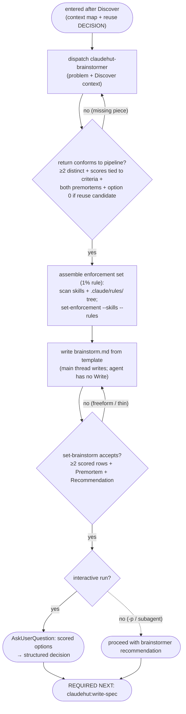

# Brainstorm (phase 2 of 7)

Turn a grounded problem into **≥2 genuinely distinct, well-reasoned approaches** and a recommendation. This is
**general-purpose ideation** — feature, bug, refactor, performance, design, or non-code decision. It does NOT
explore the codebase or run a reuse-scan: that is **Discover** (phase 1), whose context + reuse DECISION this
phase consumes. Decoupling ideation from discovery is deliberate (v0.4 reversal) — forcing explore+reuse here
narrowed the option space; freeing it widens creative breadth.

Run **inline on the main thread** (it owns the state write and the user gate; a forked subagent cannot spawn
subagents).

## Flow



## Inputs (from Discover)

- The explorer's context map (entry points, key types, structure), the **Reuse candidates**, and the
  reuse-scan **DECISION** (adopt / extend / new) — option 0 is always "adopt/extend the existing thing" when
  Discover found a candidate.

## Steps

Dispatch **`claudehut:claudehut-brainstormer`** (Agent tool) — the Flow diagram is the sequence and gates. The load-bearing details:

1. **Persist** the deliberation to `${CLAUDE_PROJECT_DIR}/.claude/claudehut/tasks/NNNN-<slug>/brainstorm.md` by
   **filling `references/brainstorm-template.md`**, then record it:

   ```
   claudehut-state --session ${CLAUDE_SESSION_ID} set-brainstorm .claude/claudehut/tasks/NNNN-<slug>/brainstorm.md
   ```

   `set-brainstorm` REJECTS a freeform note (it requires ≥2 scored option rows + a Premortem + a
   Recommendation) — the fix for "brainstorm docs follow no format". Spec stays terse; the reasoning is linked
   from the spec's `> brainstorm:` header.
2. **Enforcement set (code tasks).** By the **1% rule** — *if there's even a 1% chance a skill or rule applies,
   include it*:

   ```
   claudehut-state --session ${CLAUDE_SESSION_ID} set-enforcement --skills <a,b,c> --rules <framework/jpa.md,security/owasp-top10.md,…>
   ```
   It is the auditable checklist Review enforces — and (v0.4) the **primary source for dynamic reviewer
   selection**: the rules it lists decide which specialist auditors Review spawns. A thin set silently
   under-reviews.
3. **`AskUserQuestion` tool** (interactive only): scored options as choices, not a free-text ask.

## Red flags — STOP

- Only one option ("the obvious way") — the bar is ≥2 genuinely distinct approaches.
- Re-running explore/reuse here — that was Discover; if it didn't run, go back to `claudehut:discover`.
- Enforcement set left empty because "nothing really applies" — re-apply the 1% rule against `.claude/rules/`
  (it also determines which reviewers fire).

**REQUIRED NEXT:** `claudehut:write-spec`.
