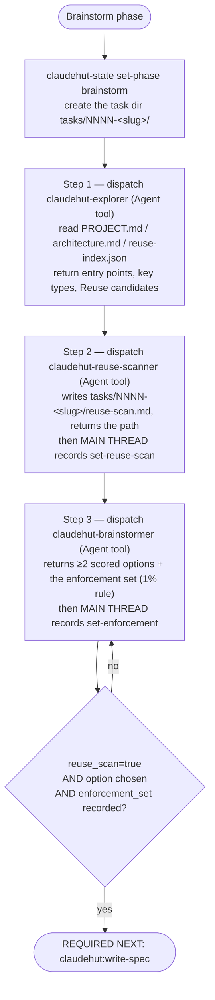

# Brainstorm (phase 1 of 6)

The Brainstorm phase turns a raw request into a **grounded, reuse-checked, scored set of options** and the
**enforcement set** that the rest of the workflow audits against. It folds three steps — explore, reuse-scan,
option generation — into one phase. Run it **inline on the main thread**: it dispatches three subagents in
sequence, and a forked subagent cannot itself spawn subagents.

## Iron Law

```
NO NEW CLASS, SERVICE, UTILITY, CONFIG, OR ENDPOINT BEFORE A REUSE SCAN
```

Wrote new code without a reuse-scan artifact? Delete it and scan first. **Delete means delete** — don't keep
it "as a reference." The `PreToolUse` write gate enforces this: until `reuse_scan=true`, every production
write is denied.

## Flow



## Step 1 — Explore (dispatch `claudehut-explorer`)

Dispatch the explorer with the Agent tool. It loads the pre-built index (`.claude/claudehut/PROJECT.md`,
`architecture.md`, `reuse-index.json`), maps the packages/classes the task touches (cite `file:line`), and
returns entry points, key existing types, and a **"Reuse candidates"** list. It never edits and never
proposes fixes. If `understand-anything` is enabled (flag set by `claudehut:claudehut-workflow` at
SessionStart), the explorer uses its query/search skills for richer navigation; otherwise `Grep`/`Glob`.

## Step 2 — Reuse-scan (dispatch `claudehut-reuse-scanner`)

First create the **task dir** (every artifact of this task lives here): `NNNN` = zero-padded next integer
over `${CLAUDE_PROJECT_DIR}/.claude/claudehut/tasks/`, slug = kebab-case task name.

Dispatch the reuse-scanner. It queries `reuse-index.json` by tag, greps for similar signatures/annotations,
reads learnings tagged `reuse`, then writes the reuse-scan to the **absolute canonical path**
`${CLAUDE_PROJECT_DIR}/.claude/claudehut/tasks/NNNN-<slug>/reuse-scan.md` (NOT a bare `.claudehut/` path —
the state writer and the write gate both require it under `.claude/claudehut/`), containing: searched
tags/terms, **FOUND** (component + `file:line`) or **none**, **DECISION** (adopt / extend / new), and a
justification for any new code. It **returns the artifact path — it does not write state** (it has no Bash).
The **main thread** then records it:

```
claudehut-state --session ${CLAUDE_SESSION_ID} set-reuse-scan --artifact .claude/claudehut/tasks/NNNN-<slug>/reuse-scan.md
```

| Rationalization | Reality |
|--------|---------|
| "Nothing like this exists here" | Then the 60-second scan confirms it and costs nothing. Run it. |
| "It's faster to just write it" | A duplicate you later reconcile is slower. Scan. |
| "I already explored, I know the code" | Exploration ≠ a reuse decision. Produce the artifact. |
| "It's a tiny helper" | Tiny duplicates rot fastest. Scan. |

## Step 3 — Options + enforcement set (dispatch `claudehut-brainstormer`)

Dispatch the brainstormer. It produces **≥2 genuinely distinct, codebase-adapted approaches** scored on
three axes, presented as a table (approach · pros · cons · fit-with-project · footprint · perf) plus a
recommendation:

1. **Most best-practice** — idiomatic for this stack/version.
2. **Smallest change footprint** — adopting/extending the reuse-scan candidate is option 0.
3. **Highest output quality + performance.**

Then it builds the **enforcement set** by the 1% rule — *if there is even a 1% chance a skill or rule
applies, it MUST be included* — scanning the plugin skills and the project's `.claude/rules/` tree. It
**returns the set — it does not write state** (it has no Bash). The **main thread** records it:

```
claudehut-state --session ${CLAUDE_SESSION_ID} set-enforcement --skills <a,b,c> --rules <framework/jpa.md,security/owasp-top10.md,…>
```

The enforcement set is an **auditable checklist** Review will enforce — not a new mechanism. In interactive
use, confirm the chosen approach before leaving Brainstorm by calling the **`AskUserQuestion` tool** with the
scored options as choices (don't ask for a free-text reply) — this records a structured decision before Spec.
Skip the question on a non-interactive run (`-p`) or inside a subagent, where `AskUserQuestion` is unavailable;
there, proceed with the brainstormer's recommended option.

## Red flags — STOP

- About to write production code with no `tasks/NNNN-<slug>/reuse-scan.md` on disk
- Only one option ("the obvious way") — the law requires ≥2 distinct, codebase-adapted approaches
- Enforcement set left empty because "nothing really applies" — re-apply the 1% rule against `.claude/rules/`

**REQUIRED NEXT:** `claudehut:write-spec`.
