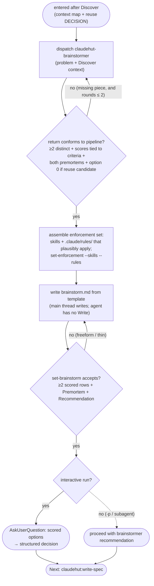

# Brainstorm (phase 2 of 7)

Turn a grounded problem into **≥2 genuinely distinct, well-reasoned approaches** and a recommendation. This is
**general-purpose ideation** — feature, bug, refactor, performance, design, or non-code decision. It does NOT
explore the codebase or run a reuse-scan: that is **Discover** (phase 1), whose context + reuse DECISION this
phase consumes. Decoupling ideation from discovery is deliberate — forcing explore+reuse here
narrowed the option space; freeing it widens creative breadth.

Run **inline on the main thread** (it owns the state write and the user gate; a forked subagent cannot spawn
subagents).

## Flow


```mermaid
flowchart TB
    s(["entered after Discover<br/>(context map + reuse DECISION)"]) --> disp["dispatch claudehut-brainstormer<br/>(problem + Discover context)"]
    disp --> val{"return conforms to pipeline?<br/>≥2 distinct + scores tied to criteria +<br/>both premortems + option 0 if reuse candidate"}
    val -- "no (missing piece, and rounds ≤ 2)" --> disp
    val -- "yes" --> enf["assemble enforcement set:<br/>skills + .claude/rules/ that plausibly apply;<br/>set-enforcement --skills --rules"]
    enf --> write["write brainstorm.md from template<br/>(main thread writes; agent has no Write)"]
    write --> gate{"set-brainstorm accepts?<br/>≥2 scored rows + Premortem + Recommendation"}
    gate -- "no (freeform / thin)" --> write
    gate -- "yes" --> mode{"interactive run?"}
    mode -- "yes" --> ask(["AskUserQuestion: scored options<br/>→ structured decision"])
    mode -. "no (-p / subagent)" .-> auto(["proceed with brainstormer recommendation"])
    ask --> nxt(["Next: claudehut:write-spec"])
    auto --> nxt
```

## Inputs (from Discover)

- The explorer's context map (entry points, key types, structure), the **Reuse candidates**, and the
  reuse-scan **DECISION** (adopt / extend / new) — option 0 is always "adopt/extend the existing thing" when
  Discover found a candidate.

## Steps

Dispatch **`claudehut:claudehut-brainstormer`** (Agent tool) — the Flow diagram is the sequence and gates.
**Cap 2 re-dispatch rounds** — a third non-conforming return means the problem statement is the problem, not the
brainstormer, and this is the one validation loop that re-fires an `opus` subagent. Take the surviving gaps to the
user with `AskUserQuestion` (or, non-interactive, proceed with the best option set returned and note the gap in
brainstorm.md). The load-bearing details:

1. **Persist** the deliberation to `${CLAUDE_PROJECT_DIR}/.claude/claudehut/tasks/NNNN-<slug>/brainstorm.md` by
   **filling `references/brainstorm-template.md`**, then record it:

   ```
   claudehut-state --session ${CLAUDE_SESSION_ID} set-brainstorm .claude/claudehut/tasks/NNNN-<slug>/brainstorm.md
   ```

   `set-brainstorm` REJECTS a freeform note (it requires ≥2 scored option rows + a Premortem + a
   Recommendation) — the fix for "brainstorm docs follow no format". Spec stays terse; the reasoning is linked
   from the spec's `> brainstorm:` header.
2. **Enforcement set (code tasks).** Include every skill and `.claude/rules/` file that plausibly applies to the
   change — err toward including a rule whose path or topic the diff touches:

   ```
   claudehut-state --session ${CLAUDE_SESSION_ID} set-enforcement --skills <a,b,c> --rules <framework/jpa.md,security/owasp-top10.md,…>
   ```
   It is the auditable checklist Review enforces — and the **primary source for dynamic reviewer
   selection**: the rules it lists decide which specialist auditors Review spawns. A thin set silently
   under-reviews.

   **Summer KB (when the project has `.claude/summer-kb/`):** if the task touches Summer (`io.f8a.summer` —
   any `summer-*` dep, `f8a.*`/`summer.*` property, auto-config gate, `Ufid`/`Txid` annotation, Kafka
   contract, or Summer type), the enforcement set includes `--rules summer-kb.md`, and each scored
   option's Summer wiring is grounded in the relevant `.claude/summer-kb/<module>.md` (cite doc + section
   in the option row). An option built on invented Summer properties/gates is not a valid option.
3. **`AskUserQuestion` tool** (interactive only): scored options as choices, not a free-text ask.

## Red flags

- Only one option ("the obvious way") — the bar is ≥2 genuinely distinct approaches.
- Re-running explore/reuse here — that was Discover; if it didn't run, go back to `claudehut:discover`.
- Enforcement set left empty because "nothing really applies" — re-check `.claude/rules/` against the diff's paths and topics
  (it also determines which reviewers fire).

**Next:** `claudehut:write-spec`.
