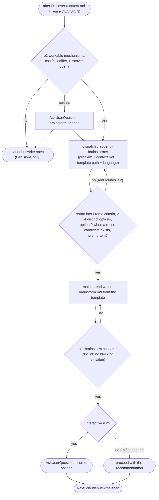

# Brainstorm (optional, full route)

Most full-route tasks skip this phase: when Discover leaves one obvious mechanism, `claudehut:write-spec`
records the choice straight in the spec's §6 Decisions. Run Brainstorm only when **≥2 workable mechanisms
differ materially in cost or risk and Discover did not settle it**. Unsure whether it applies → ask the user
with `AskUserQuestion` (brainstorm or go straight to the spec). It does not re-explore or re-scan: it consumes
Discover's `context.md` and reuse DECISION.

Runs **inline on the main thread**: it owns the state write and the user question, which a subagent cannot do.

## Flow


```mermaid
flowchart TB
    s(["after Discover (context.md + reuse DECISION)"]) --> need{"≥2 workable mechanisms,<br/>cost/risk differ, Discover open?"}
    need -- "no" --> spec(["claudehut:write-spec (Decisions only)"])
    need -- "unsure" --> askq["AskUserQuestion: brainstorm or spec"]
    askq --> spec
    need -- "yes" --> disp["dispatch claudehut-brainstormer<br/>(problem + context.md + template path + language)"]
    askq --> disp
    disp --> val{"return has Frame criteria, 2-4 distinct options,<br/>option 0 when a reuse candidate exists, premortem?"}
    val -- "no (and rounds ≤ 2)" --> disp
    val -- "yes" --> write["main thread writes brainstorm.md from the template"]
    write --> gate{"set-brainstorm accepts?<br/>(doclint: no blocking violation)"}
    gate -- "no" --> write
    gate -- "yes" --> mode{"interactive run?"}
    mode -- "yes" --> ask(["AskUserQuestion: scored options"])
    mode -. "no (-p / subagent)" .-> auto(["proceed with the recommendation"])
    ask --> nxt(["Next: claudehut:write-spec"])
    auto --> nxt
```

## Steps

1. **Dispatch `claudehut:claudehut-brainstormer`** (Agent tool, no `name`). Put in the prompt: the problem,
   the path of `tasks/NNNN-<slug>/context.md` and `reuse-scan.md`, the template path
   `${CLAUDE_PLUGIN_ROOT}/skills/brainstorm/references/brainstorm-template.md`, and one line with the project
   language (headings stay English, the body follows the language). **Cap 2 re-dispatch rounds**: a third
   non-conforming return means the problem statement is the problem. Take the gap to the user with
   `AskUserQuestion` (non-interactive: proceed with the best set returned and note the gap in §1).
2. **Persist**: fill the template into `${CLAUDE_PROJECT_DIR}/.claude/claudehut/tasks/NNNN-<slug>/brainstorm.md`
   (the agent has no Write), then record it:

   ```
   claudehut-state --session ${CLAUDE_SESSION_ID} set-brainstorm .claude/claudehut/tasks/NNNN-<slug>/brainstorm.md
   ```

   `set-brainstorm` runs doclint and refuses on a structural violation (missing or extra heading, bad
   fence); it prints each one as `L<n> blocking <section>: <message>`. Fix and re-run. Word counts are
   advisory and never block.
3. **Ask** (interactive only): `AskUserQuestion` with the scored options as choices. The chosen option
   becomes a `D-n` row in the spec's §6 Decisions; the spec header links `> options: …/brainstorm.md`.
4. **Revision**: when a later finding changes the choice, edit `brainstorm.md` in place, bump `rev`, add a
   `## Changelog` line, and re-run `set-brainstorm`.

The enforcement set (skills + rules Review audits against) is recorded in `claudehut:write-spec`.

## Red flags

- Only one real option, or two libraries for the same mechanism counted as two options.
- Re-running explore/reuse here: that was Discover; if it did not run, go back to `claudehut:discover`.
- Brainstorming a choice Discover already settled: write the decision in the spec instead.

**Next:** `claudehut:write-spec`.
