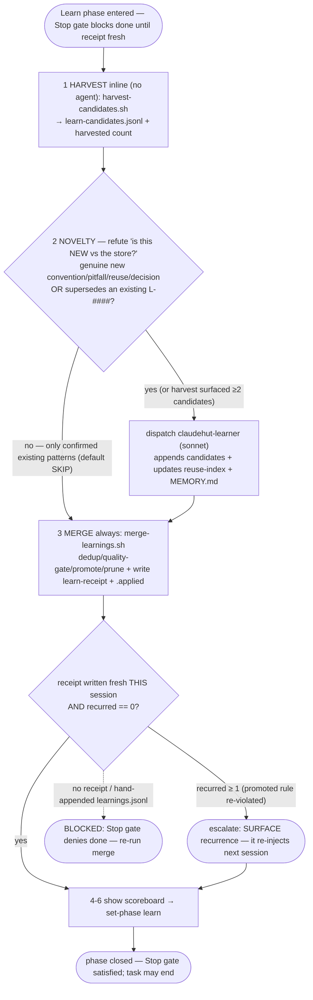

# Capture Learnings (Learn phase)

## Iron Law

```
NO TASK ENDS WITHOUT A LEARN PASS
```

If you learned a project pattern, a pitfall, or a reuse point, record it before stopping. The `Stop` gate
blocks "done" until this runs. Runs **inline on the main thread** — the learner agent does the recording in
isolation; this skill owns the state write (the learner has no Bash).

## Flow



## Process — fast path first; the agent runs only on novelty (WS-6, Issue 5)

v0.8 inverts the old mandatory sonnet round-trip: a deterministic inline harvest runs first (no agent), the
learner is dispatched **only on genuine novelty**, and the merge always runs (it writes the Stop-gate receipt).

1. **Harvest candidates inline (always; no agent).** Run on the main thread:

   ```
   "${CLAUDE_PLUGIN_ROOT}/scripts/harvest-candidates.sh" --session ${CLAUDE_SESSION_ID} --task-dir .claude/claudehut/tasks/NNNN-<slug>
   ```

2. **Dispatch `claudehut:claudehut-learner` ONLY on genuine novelty — default to SKIP.** **Tier does NOT
   force it** — a full-tier task that only confirmed existing patterns records nothing new, so skip the agent
   even on full tier; when in doubt and the harvest already surfaced ≥2 candidates, dispatch. When dispatched,
   the learner **appends** to the same `learn-candidates.jsonl`, **updates `reuse-index.json`**, **refreshes
   `MEMORY.md`**, and never records secrets. It does NOT dedup, assign ids, promote, or prune.

3. **Run the deterministic merge (always — it writes the cross-session store AND the Stop-gate receipt):**

   ```
   "${CLAUDE_PLUGIN_ROOT}/scripts/merge-learnings.sh" \
     --candidates .claude/claudehut/tasks/NNNN-<slug>/learn-candidates.jsonl \
     --session ${CLAUDE_SESSION_ID} \
     --injected .claude/claudehut/state/${CLAUDE_SESSION_ID}.injected.json
   ```

   It writes `state/${SID}.learn-receipt.json` (the Stop gate's proof a Learn pass ran THIS task) and prints
   `{added, merged, promoted, dropped, rejected, recurred, applied}`. `recurred > 0` = a promoted rule is being
   re-violated (it re-injects next session) — surface it. Never hand-append to `learnings.jsonl`: that skips
   the receipt and the Stop gate will block.
4. **Show the learning scoreboard** so memory health is visible this session (measured, not vibes):
   `"${CLAUDE_PLUGIN_ROOT}/scripts/learning-score.sh" --top 5`. Users can re-run it anytime via
   `/claudehut:claudehut-learning-report`.
5. If native auto-memory is enabled, mirror a short narrative there — convenience only, not the source of truth.
6. **Main thread closes the phase** after the merge runs:

   ```
   claudehut-state --session ${CLAUDE_SESSION_ID} set-phase learn
   ```

**REQUIRED NEXT:** the task may now end (the Stop gate is satisfied). The next session's SessionStart will
inject the top of what you recorded.
