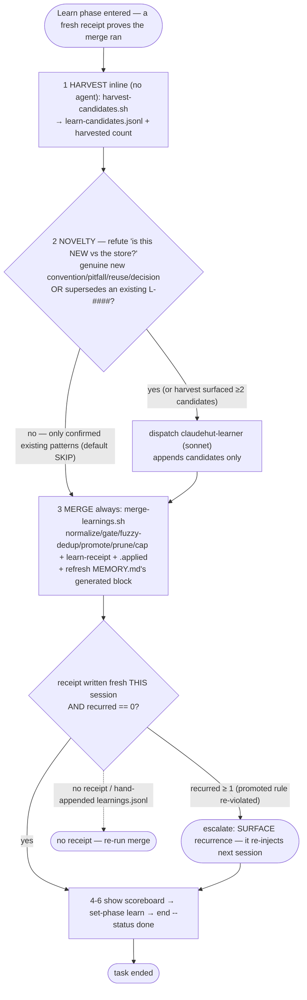

# Capture Learnings (Learn phase)

## When it runs

A full-route task runs a Learn pass before it ends; a light-route task runs one when it surfaced something
novel; a direct-route request has no task and no Learn pass. A project pattern, a pitfall, or a reuse point
learned on the task is recorded before stopping. Runs **inline on the main thread** — the learner agent does the recording in
isolation; this skill owns the state write (the learner has no Bash).

## Flow


```mermaid
flowchart TB
    start(["Learn phase entered — a fresh receipt proves the merge ran"]) --> harvest["1 HARVEST inline (no agent): harvest-candidates.sh<br/>→ learn-candidates.jsonl + harvested count"]
    harvest --> nov{"2 NOVELTY — refute 'is this NEW vs the store?'<br/>genuine new convention/pitfall/reuse/decision<br/>OR supersedes an existing L-####?"}
    nov -- "no — only confirmed existing patterns (default SKIP)" --> merge
    nov -- "yes (or harvest surfaced ≥2 candidates)" --> dispatch["dispatch claudehut-learner (sonnet)<br/>appends candidates only"]
    dispatch --> merge["3 MERGE always: merge-learnings.sh<br/>normalize/gate/fuzzy-dedup/promote/prune/cap + learn-receipt + .applied<br/>+ refresh MEMORY.md's generated block"]
    merge --> rcpt{"receipt written fresh THIS session<br/>AND recurred == 0?"}
    rcpt -- "recurred ≥ 1 (promoted rule re-violated)" --> surf(["escalate: SURFACE recurrence — it re-injects next session"])
    rcpt -. "no receipt / hand-appended learnings.jsonl" .-> blocked(["no receipt — re-run merge"])
    rcpt -- "yes" --> close["4-6 show scoreboard → set-phase learn → end --status done"]
    surf --> close
    close --> done(["task ended"])
```

## Process — fast path first; the agent runs only on novelty

A deterministic inline harvest runs first (no agent), the learner is dispatched only when the task surfaced
something novel, and the merge always runs (it writes the learn receipt).

1. **Harvest candidates inline (always; no agent).** Run on the main thread:

   ```
   "${CLAUDE_PLUGIN_ROOT}/scripts/harvest-candidates.sh" --session ${CLAUDE_SESSION_ID} --task-dir .claude/claudehut/tasks/NNNN-<slug>
   ```

2. **Dispatch `claudehut:claudehut-learner` only when the task surfaced something novel**, on any route: a task
   that only confirmed existing patterns records nothing new, so skip the agent. If unsure, dispatch when the
   harvest surfaced ≥2 candidates. Put the
   task dir and the session's language line (`Language: en — …` or `Ngôn ngữ: vi — …`) in the dispatch brief, so candidates are
   written in the plane language. The learner only **appends** to the same `learn-candidates.jsonl` and never
   records secrets. It does not write `MEMORY.md` (generated by `claudehut-index memory`) or `reuse-index.json`
   (legacy, read-only), and it does not dedup, assign ids, promote, or prune.

3. **Run the deterministic merge (always — it writes the cross-session store AND the learn receipt):**

   ```
   "${CLAUDE_PLUGIN_ROOT}/scripts/merge-learnings.sh" \
     --candidates .claude/claudehut/tasks/NNNN-<slug>/learn-candidates.jsonl \
     --session ${CLAUDE_SESSION_ID} \
     --injected .claude/claudehut/state/${CLAUDE_SESSION_ID}.injected.json
   ```

   It writes `state/${SID}.learn-receipt.json` (the proof a Learn pass ran THIS task) and prints
   `{added, merged, fuzzy, promoted, dropped, rejected, repaired, recurred, applied, unmapped}`. Rejected
   candidates (under 20 chars, equal to their evidence, or low quality) land in
   `state/${SID}.rejected.jsonl` with the reason. It then refreshes the generated block of `MEMORY.md`.
   On a microservice plane with a hub, `scope=fleet` entries are also copied to the hub's
   `fleet-learnings.jsonl` (provenance `{service, id}`) and the report gains `fleet` (hub rows changed).
   `recurred > 0` = a promoted rule is being re-violated (it re-injects next session) — surface it. Never
   hand-append to `learnings.jsonl`: that skips the gate and the receipt.
4. **Show the learning scoreboard** so memory health is visible this session (measured, not vibes):
   `"${CLAUDE_PLUGIN_ROOT}/scripts/learning-score.sh" --top 5`. Users can re-run it anytime via
   `/claudehut:claudehut-learning-report`.
5. If native auto-memory is enabled, mirror a short narrative there — convenience only, not the source of truth.
6. **Main thread closes the phase and the task** after the merge runs:

   ```
   claudehut-state --session ${CLAUDE_SESSION_ID} set-phase learn
   claudehut-state --session ${CLAUDE_SESSION_ID} end --status done
   ```

**Next:** the task has ended. The next session's SessionStart will
inject the top of what you recorded.
