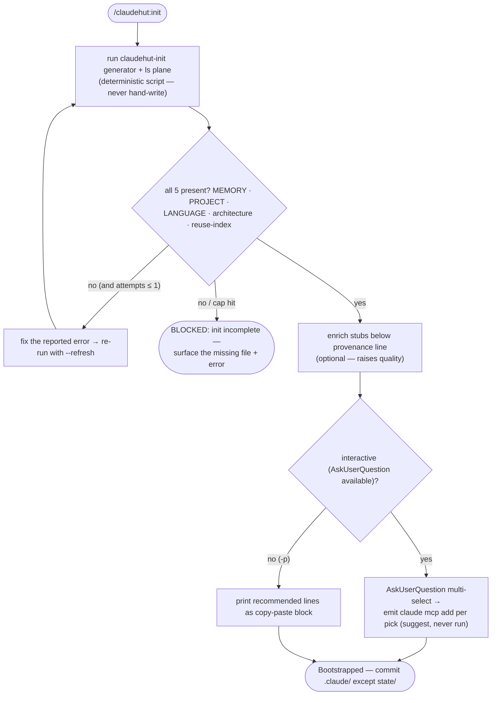

# ClaudeHut Init (Bootstrap prerequisite)

Bootstrap is a **deterministic script**, not a hand-generation task. Run it; it writes the canonical project
plane + stack-gated rules + the `@import` slice with zero guesswork. Then optionally enrich the seeded stubs.
**Do NOT** hand-write these files or emit a JSON analysis instead — the script is the source of the writes.

## Flow



## 1. Generate the project plane + verify (REQUIRED)

**Call the `Bash` tool** to run the generator and list the result in one command (a tracked tool call, not
shell auto-exec at skill-load):

```bash
"${CLAUDE_PLUGIN_ROOT}/bin/claudehut-init" "${CLAUDE_PROJECT_DIR}" && ls "${CLAUDE_PROJECT_DIR}/.claude/claudehut/"
```

The `SessionStart` hook already auto-runs the generator when the plane is absent, so this skill is the explicit / `--refresh` path — run it here so the listing confirms the plane.

It detects the stack from the build files and writes, under `${CLAUDE_PROJECT_DIR}/.claude/claudehut/`:
`MEMORY.md`, `PROJECT.md`, `LANGUAGE.md`, `architecture.md`, `reuse-index.json`, `learnings.jsonl`, `state/` —
plus the **stack-gated** rule tree under `.claude/rules/`, and appends the always-load `@import` slice to
`CLAUDE.md`. Idempotent: it skips existing plugin-owned files (pass `--refresh` to regenerate) and **never**
clobbers `learnings.jsonl`.

Verify-and-retry per the Flow. **Init is not complete until all five judgment files exist** (P3: the binding
prerequisite for project-adaptive memory and cross-session learning).

## 2. Enrich the seeded stubs (best-effort — raises quality, not required for correctness)

The script seeds judgment fields as `TBD — refine`. Improve them by reading the code (keep edits **under** the
provenance line — re-`init` treats them as authoritative and won't overwrite them):

- `architecture.md` / `PROJECT.md`: fill dependency direction, transaction strategy, error mapping, messaging topology.
- `reuse-index.json` `components[]`: catalog existing `@Service`/`@RestController`/`@Repository`/`@Component`
  classes (id, kind, `path`, purpose, tags) so the Brainstorm reuse-scan can find them.
- `LANGUAGE.md`: refine the canonical term meanings to this project's real usage.

## 3. Suggest MCP servers (optional, opt-in — never auto-install)

ClaudeHut ships **no** active MCP config and connects **nothing** automatically. Read the catalog at
`${CLAUDE_PLUGIN_ROOT}/templates/mcp-recommendations.md` and match it against the detected stack to build the
candidate list:

- **tech-stack bucket** — each server whose `detect-when` matches a detected dependency (gives the Review
  auditors live data; without them they review statically).
- **memory bucket** — the knowledge-graph memory MCP.
- **research bucket** — the docs MCP (context7) for current library best-practice.

Interactive vs `-p` selection follows the Flow: emit a `claude mcp add --scope project …` line **only** for
each selected server.

The developer substitutes their own connection string / token — **never** print or store real secrets, and do
**not** run these commands yourself (suggest, don't force).

Finish: "Bootstrapped. Commit `.claude/` (except `state/`) to share with the team."
