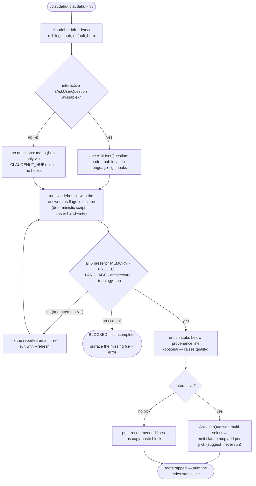

# ClaudeHut Init (Bootstrap prerequisite)

Bootstrap is a **deterministic script**: it writes the project plane, stack-gated rules and the `@import`
slice; then optionally enrich the seeded stubs. **Do NOT** hand-write these files or emit a JSON analysis.

## Flow


```mermaid
flowchart TB
  start(["/claudehut:claudehut-init"]) --> det["claudehut-init --detect<br/>(siblings, hub, default_hub)"]
  det --> ask{"interactive (AskUserQuestion available)?"}
  ask -- "yes" --> q["one AskUserQuestion: mode · hub location · language · git hooks"]
  ask -- "no (-p)" --> dflt["no questions: mono (hub only via CLAUDEHUT_HUB) · en · no hooks"]
  q --> gen["run claudehut-init with the answers as flags + ls plane<br/>(deterministic script — never hand-write)"]
  dflt --> gen
  gen --> verify{"all 5 present? MEMORY · PROJECT ·<br/>LANGUAGE · architecture · topology.json"}
  verify -- "no (and attempts ≤ 1)" --> fix["fix the reported error → re-run with --refresh"]
  fix --> gen
  verify -- "no / cap hit" --> halt(["BLOCKED: init incomplete —<br/>surface the missing file + error"])
  verify -- "yes" --> enrich["enrich stubs below provenance line<br/>(optional — raises quality)"]
  enrich --> mcp{"interactive?"}
  mcp -- "yes" --> askm["AskUserQuestion multi-select →<br/>emit claude mcp add per pick (suggest, never run)"]
  mcp -- "no (-p)" --> block["print recommended lines as copy-paste block"]
  askm --> fin(["Bootstrapped — print the index status line"])
  block --> fin
```

## 1. Ask, generate the project plane, verify (REQUIRED)

**Detect first** (read-only JSON): `"${CLAUDE_PLUGIN_ROOT}/bin/claudehut-init" "${CLAUDE_PROJECT_DIR}" --detect`.

**Ask once, interactive sessions only** — one AskUserQuestion, up to four questions (headless `-p`: skip it;
the script defaults to mono — microservice only when `CLAUDEHUT_HUB` names a hub — no git hooks, the recorded or
hub language, else `en`; a re-run keeps what was recorded):

| Question | Options (recommended first) | Flag |
|---|---|---|
| Mono or microservice? | mono; microservice — recommend it when `siblings` ≥ 2 | `--mode mono\|microservice` |
| Hub location? (microservice; skip when `hub` is set) | knowledge repo at `default_hub` (created, local `git init`, no remote); workspace root (no git); other path | `--hub <dir>` |
| Language? (skip when `hub_language` is set: inherited; a different answer is an override) | Tiếng Việt; English | `--language vi\|en` |
| Git hooks refresh the index after pull/rebase/checkout? | No (the next prompt catches up); Yes | `--git-hooks yes\|no` |

Microservice writes `hub.json` (`{schema:1, language}`, once), `aliases.json` and this service's
`services.json` entry under `<hub>/.claude/claudehut/hub/`, then runs the index update with `--hub-sync`. After
it, when `siblings_without_plane` is non-empty, ask: hub-scan them read-only now (`claudehut-index hub-scan`)?
The service graph opens with `/understand-anything:understand-dashboard <hub>/.claude/claudehut/hub`; no
repo's own `.understand-anything/` is written.

Git hooks are opt-in. With `core.hooksPath`, husky or lefthook the CLI writes nothing and prints the block to
add by hand; show that block to the user.

**Then call the `Bash` tool** to run the generator with the answers and list the result:

```bash
"${CLAUDE_PLUGIN_ROOT}/bin/claudehut-init" "${CLAUDE_PROJECT_DIR}" --language vi --mode mono --git-hooks no \
  && ls "${CLAUDE_PROJECT_DIR}/.claude/claudehut/"   # microservice: --mode microservice --hub "<dir>"
```

No hook creates a plane (ClaudeHut stays silent without one): this skill, or `--refresh`, is the way in.

It writes, under `${CLAUDE_PROJECT_DIR}/.claude/claudehut/`: `MEMORY.md` (generated block ≤2 KB, from
`claudehut-index memory`), `PROJECT.md`, `LANGUAGE.md`, `architecture.md`, `topology.json`, `learnings.jsonl`,
`state/`; the **stack-gated** rules under `.claude/rules/`; the always-load `@import` slice in `CLAUDE.md`; in a
git repo, the codebase index (`claudehut-index update`) and its status. Idempotent (`--refresh` regenerates);
**never** clobbers `learnings.jsonl`.

Verify-and-retry per the Flow. **Init is not complete until all five files exist.**

## 2. Enrich the seeded stubs (best-effort — raises quality, not required for correctness)

The script seeds judgment fields as `TBD — refine`. Improve them by reading the code (keep edits **under** the
provenance line — re-`init` treats them as authoritative and won't overwrite them):

- `architecture.md` / `PROJECT.md`: fill dependency direction, transaction strategy, error mapping, messaging topology.
- Never write the index: `claudehut-index` extracts components from source, and a legacy `reuse-index.json`
  stays read-only.
- `LANGUAGE.md`: refine the canonical term meanings to this project's real usage.

## 3. Suggest MCP servers (optional, opt-in — never auto-install)

ClaudeHut ships **no** active MCP config and connects **nothing** automatically. Match
`${CLAUDE_PLUGIN_ROOT}/templates/mcp-recommendations.md` against the detected stack: **tech-stack** servers whose
`detect-when` matches a dependency (live data for the Review auditors), the **memory** knowledge-graph MCP, and
the **research** docs MCP (context7). Emit a `claude mcp add --scope project …` line **only** per selected
server (interactive vs `-p` per the Flow). The developer substitutes their own connection string / token —
**never** print or store real secrets, and do **not** run these commands yourself (suggest, don't force).

Finish: "Bootstrapped. Commit `.claude/` (except `state/`) to share with the team."
