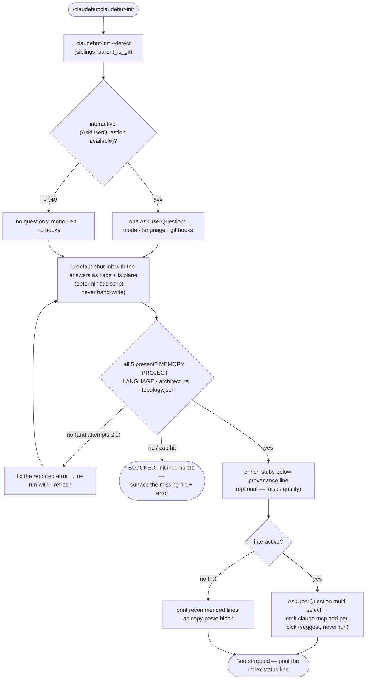

# ClaudeHut Init (Bootstrap prerequisite)

Bootstrap is a **deterministic script**, not a hand-generation task. Run it; it writes the canonical project
plane + stack-gated rules + the `@import` slice with zero guesswork. Then optionally enrich the seeded stubs.
**Do NOT** hand-write these files or emit a JSON analysis instead — the script is the source of the writes.

## Flow


```mermaid
flowchart TB
  start(["/claudehut:claudehut-init"]) --> det["claudehut-init --detect<br/>(siblings, parent_is_git)"]
  det --> ask{"interactive (AskUserQuestion available)?"}
  ask -- "yes" --> q["one AskUserQuestion: mode · language · git hooks"]
  ask -- "no (-p)" --> dflt["no questions: mono · en · no hooks"]
  q --> gen["run claudehut-init with the answers as flags + ls plane<br/>(deterministic script — never hand-write)"]
  dflt --> gen
  gen --> verify{"all 5 present? MEMORY · PROJECT ·<br/>LANGUAGE · architecture · topology.json"}
  verify -- "no (and attempts ≤ 1)" --> fix["fix the reported error → re-run with --refresh"]
  fix --> gen
  verify -- "no / cap hit" --> halt(["BLOCKED: init incomplete —<br/>surface the missing file + error"])
  verify -- "yes" --> enrich["enrich stubs below provenance line<br/>(optional — raises quality)"]
  enrich --> mcp{"interactive?"}
  mcp -- "yes" --> askm["AskUserQuestion multi-select →<br/>emit claude mcp add per pick (suggest, never run)"]
  mcp -- "no (-p)" --> block["print recommended lines as copy-paste block"]
  askm --> fin(["Bootstrapped — print the index status line"])
  block --> fin
```

## 1. Ask, generate the project plane, verify (REQUIRED)

**Detect first** (read-only JSON): `"${CLAUDE_PLUGIN_ROOT}/bin/claudehut-init" "${CLAUDE_PROJECT_DIR}" --detect`.

**Ask once, interactive sessions only** — one AskUserQuestion carrying three questions (headless `-p`: skip it;
the script defaults to mono, `en`, no git hooks, and a re-run keeps what was recorded before):

| Question | Options (recommended first) | Flag |
|---|---|---|
| Mono or microservice? | mono; microservice — recommend it when `siblings` ≥ 2. Microservice needs the hub (M6-pending): the script records `requested_mode` and keeps `mode: mono` | `--mode mono\|microservice` |
| Reply and artifact language? | Tiếng Việt; English | `--language vi\|en` |
| Refresh the index from git hooks after pull/rebase/checkout? | No (the next prompt catches up anyway); Yes | `--git-hooks yes\|no` |

Git hooks are opt-in. With `core.hooksPath`, husky or lefthook the CLI writes nothing and prints the block to
add by hand; show that block to the user.

**Then call the `Bash` tool** to run the generator with the answers and list the result:

```bash
"${CLAUDE_PLUGIN_ROOT}/bin/claudehut-init" "${CLAUDE_PROJECT_DIR}" --language vi --mode mono --git-hooks no \
  && ls "${CLAUDE_PROJECT_DIR}/.claude/claudehut/"
```

No hook creates a plane: without one ClaudeHut stays silent, so this skill is the only way in (and the
`--refresh` path).

It detects the stack from the build files and writes, under `${CLAUDE_PROJECT_DIR}/.claude/claudehut/`:
`MEMORY.md` (its generated block ≤2 KB comes from `claudehut-index memory`), `PROJECT.md`, `LANGUAGE.md`,
`architecture.md`, `topology.json` (`mode`, `language`, `git_hooks`, `shared`), `learnings.jsonl`, `state/` —
plus the **stack-gated** rule tree under `.claude/rules/`, and appends the always-load `@import` slice to
`CLAUDE.md`. In a git repo it then builds the codebase index (`claudehut-index update`, deterministic) and
prints its status. Idempotent: it skips existing plugin-owned files (pass `--refresh` to regenerate) and
**never** clobbers `learnings.jsonl`.

Verify-and-retry per the Flow. **Init is not complete until all five files exist.**

## 2. Enrich the seeded stubs (best-effort — raises quality, not required for correctness)

The script seeds judgment fields as `TBD — refine`. Improve them by reading the code (keep edits **under** the
provenance line — re-`init` treats them as authoritative and won't overwrite them):

- `architecture.md` / `PROJECT.md`: fill dependency direction, transaction strategy, error mapping, messaging topology.
- Never write the index: `claudehut-index` extracts components from source, and a legacy `reuse-index.json`
  stays read-only.
- `LANGUAGE.md`: refine the canonical term meanings to this project's real usage.

## 3. Suggest MCP servers (optional, opt-in — never auto-install)

ClaudeHut ships **no** active MCP config and connects **nothing** automatically. Read the catalog at
`${CLAUDE_PLUGIN_ROOT}/templates/mcp-recommendations.md` and match it against the detected stack to build the
candidate list:

- **tech-stack bucket** — each server whose `detect-when` matches a detected dependency (gives the Review
  auditors live data; without them they review statically).
- **memory bucket** — the knowledge-graph memory MCP.
- **research bucket** — the docs MCP (context7) for current library best-practice.

Interactive vs `-p` selection follows the Flow: emit a `claude mcp add --scope project …` line **only** for
each selected server.

The developer substitutes their own connection string / token — **never** print or store real secrets, and do
**not** run these commands yourself (suggest, don't force).

Finish: "Bootstrapped. Commit `.claude/` (except `state/`) to share with the team."
