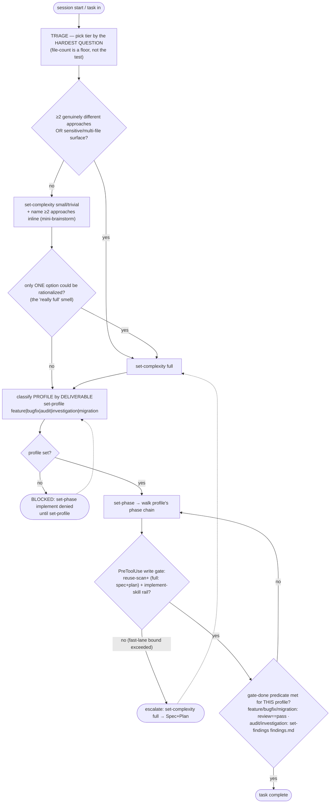

# ClaudeHut Workflow

You are operating under ClaudeHut. The codebase is **pre-indexed** (see `claudehut:claudehut-init`). The full
workflow is **7 phases** — Discover → Brainstorm → Spec → Plan → Implement → Review → Learn — and you are
always in exactly one.

## Flow



## Phase 0 — Triage the request (do this first, every task)

Not every task needs all seven phases. Pick a tier and record it
(`claudehut-state --session ${CLAUDE_SESSION_ID} set-complexity <tier>`). **You propose the tier; the write
gate verifies its bound deterministically — you cannot route a large or security-touching change into a fast
lane.**

| Tier | When (your assessment) | Phases run | Skips |
|------|------------------------|------------|-------|
| **trivial** | comment/doc/rename/config-value; no logic change | Discover (quick) → Implement → Review (min) | Brainstorm, Spec, Plan |
| **small** | ≤2 files, no new component, **no security/auth/migration surface**, **and one obvious approach** | Discover → Implement → Review (dynamic) → Learn | Brainstorm, Spec, Plan |
| **full** (default) | new component, multi-file, architectural, security/auth/migration surface, **OR a non-obvious design choice / ≥2 viable approaches** | all 7 | — |

**Tier by the hardest QUESTION, not the diff size** — *you* escalate on reasoning-complexity. **The fast lane
skips the Brainstorm *dispatch*, never the *deliberation*:** a `small`-tier task still names **≥2 approaches +
the one chosen and why, in one line** (a mini-brainstorm). **Safety rails are never skipped in any tier:** the
reuse-scan (Discover), test-first (Implement Iron Law), and a Review pass. If unsure, default to **full**.

## Phase 0b — classify the task SHAPE (profile), orthogonal to the tier

Size is not shape: same-tier tasks want different phases, deliverables, and auditors. After the tier, classify
the **profile** and record it (`claudehut-state set-profile <…>`). **`set-phase implement` is BLOCKED until a
profile is set.** Decide by the **deliverable** the task must end with:

| Profile | The task is… | Deliverable (the "done" gate checks this) | Phase emphasis | Mandatory auditors |
|---------|--------------|--------------------------------------------|----------------|--------------------|
| **feature** | build new behavior | passing code + tests (review==pass) | all 7 (full) | reviewer + security/perf/db by impact |
| **bugfix** | fix wrong behavior | a failing test that now passes (review==pass) | Discover → Implement → Review (small/full) | reviewer + the specialist for the bug's surface |
| **audit** | assess/inspect, no code change | **`findings.md`** (conclusions + `file:line` evidence) — NOT code | Discover-heavy → Review of findings | security-auditor + the relevant specialist, ALWAYS |
| **investigation** | answer a question / trace a flow | **`findings.md`** (the answer + evidence) | Discover-heavy; Implement usually skipped | reviewer of the findings |
| **migration** | move/restructure, behavior-preserving | migration + rollback note + green tests (review==pass) | full; Plan emphasizes ordering + reversibility | db-reviewer + perf-reviewer, ALWAYS |

Declaring `audit` does not exempt code from test-first; a task that changes shape mid-flow re-runs
`set-profile`. **For `audit`/`investigation` the completion gate requires a recorded `findings.md` (write it,
then `claudehut-state set-findings tasks/NNNN-<slug>/findings.md`) — not a code review** — so the workflow
adapts the *meaning* of "done", not just a label.

## The laws (non-negotiable)

1. **Skill-first.** Before responding or acting, check whether a ClaudeHut skill applies.
2. **1% rule.** *If you think there is even a 1% chance a skill or rule might apply to what you are doing, you ABSOLUTELY MUST invoke it.* This is how the **enforcement set** is built in Brainstorm (and it drives which reviewers Review spawns). This is not negotiable. You cannot rationalize your way out of it.
3. **Reuse-first.** Never write new code before the reuse-scan step in `claudehut:discover` (hook-gated; required in every tier).
4. **Test-first.** Never write production code before a failing test — `claudehut:implement` (Iron Law).
   **The write gate enforces the skill itself (skill rail, every tier):** production writes stay denied until
   `claudehut:implement` is actually invoked for the current task — the `PreToolUse(Skill)` recorder hook is
   the only thing that opens it, and entering Discover/Brainstorm closes it again (one invocation per task).
5. **Compliance-first.** Never claim a task is done before `claudehut:review` reports zero outstanding items (hook-gated).
6. **Canonical store — one dir per task.** Every artifact of a task — reuse-scan, spec, plan, review — lives in that task's dir `${CLAUDE_PROJECT_DIR}/.claude/claudehut/tasks/NNNN-<slug>/` (created in Discover, the first phase; `NNNN` = next integer over `tasks/`; never a bare `specs/`/`plans/` or a `.claudehut/` path). The write gate verifies files exist under `.claude/claudehut/`; off-path artifacts are invisible to the gate, to `@import` memory, and to the next session. Global stores stay at the root: `learnings.jsonl`, `reuse-index.json`, the memory plane, `state/`.
7. **Main thread orchestrates.** Skills run on the main thread and own the user gates (`AskUserQuestion`), the state writes (`claudehut-state`), and the native task mirror (`TaskCreate`/`TaskUpdate`). Subagents do isolated work and **return data** — they never write state and never ask the user (they can't: no `AskUserQuestion`, and most have no Bash).

**Violating the letter of these laws is violating the spirit of them.**

## Phase → skill map

| Phase | Invoke | Heavy work (Agent tool) | Tiers | Produces (in `tasks/NNNN-<slug>/`) |
|-------|--------|------------------------|-------|-------------------------------------|
| 1. Discover | `claudehut:discover` | explorer ∥ reuse-scanner (one message); **trivial tier: inline — ≤3 Greps + inline artifact, no dispatch** | all | `reuse-scan.md` + reuse DECISION |
| 2. Brainstorm | `claudehut:brainstorm` | brainstormer (generic ideation) | full | `brainstorm.md` (≥2 scored options + premortems) → `set-brainstorm` (gate) + enforcement set |
| 3. Spec | `claudehut:write-spec` | — (main writes from template); → `set-spec` (gate: sections + Decision + AC-xxx) | full | `spec.md` |
| 4. Plan | `claudehut:write-plan` | planner drafts from template → **`claudehut-plan-reviewer` APPROVE** → `set-plan-review` → **approve plan** → `set-plan` (gate) + task mirror | full | `plan.md` (T-xxx) + `plan-review.md` |
| 5. Implement | `claudehut:implement` | main thread walks the plan **phase by phase**; within each phase the `[P]`/independent tasks → parallel implementers in ONE message (`check-disjoint`, max 3), dependent tasks → one implementer each, inline if ≤2 files; native task list updated at each phase boundary | all | code + tests (test-first; `.claude/rules/` auto-load) |
| 6. Review | `claudehut:review` | **dynamically selected** auditors in parallel (test-runner + reviewer always; specialists by impact) | all | `review.md`; loops until outstanding empty |
| 7. Learn | `claudehut:capture-learnings` | learner; **small tier: one-line inline record when nothing novel (no dispatch)** | full + small | `learnings.jsonl` records + updated index |

Announce each phase: state *"Using ClaudeHut <skill> (phase N)"* when you invoke it.

**Parallel dispatch convention.** When a phase dispatches multiple subagents with no data dependency between
them (Discover's explorer + reuse-scanner; Review's selected auditors; Implement's disjoint `[P]` group
within a phase after `check-disjoint` passes), issue all those Agent tool calls **in one message** — independent calls in the same
message run concurrently; one call per message runs them serially. Dependent dispatches stay sequential.
Dispatch plugin agents by their qualified type (`claudehut:claudehut-<name>`).

## Recording transitions

State is per-session, recorded **by the main thread only** (hooks read it; subagents never call it):

```
claudehut-state --session ${CLAUDE_SESSION_ID} set-phase <name> [--spec <path> | --plan <path> | ...]
```

The hard gates depend on this (see Flow).

**REQUIRED NEXT:** triage the request (Phase 0), then begin at phase 1 — invoke `claudehut:discover`. Do NOT
jump to Implement.
