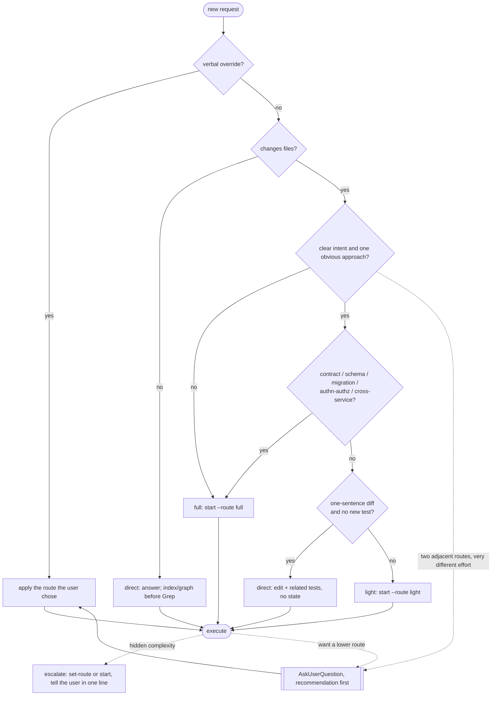

# ClaudeHut Workflow

The SessionStart digest carries the routing rules; this skill is the longer version. You route every new
request on the main thread. Hooks only observe and nudge; none of them blocks a tool call.

## Routes

Route by intent clarity and semantic risk. File count, path patterns and "is there a second approach I could
imagine" are not signals.

| Signal | Route | Consequence |
|---|---|---|
| No file change: question, explanation, RCA, audit | `direct` | No task, no artifact, no review unless the user asks |
| Diff you can state in one sentence, inside one module, no risk signal | `direct` | Edit, run the related tests; look up the index, hub or graph before Grep |
| Clear intent, one obvious approach, needs new tests or several files in one service | `light` | `task.md` (Approach + Tasks), test-first, one reviewer |
| Unclear intent, or 2+ materially different approaches | `full` | Full phase chain below |
| API/Kafka contract, schema/migration, authn/authz, or cross-service change | `full` | Full phase chain; review by lane |


```mermaid
flowchart TB
  req(["new request"]) --> ovr{"verbal override?"}
  ovr -- yes --> set["apply the route the user chose"]
  ovr -- no --> chg{"changes files?"}
  chg -- no --> D["direct: answer; index/graph before Grep"]
  chg -- yes --> clr{"clear intent and one obvious approach?"}
  clr -- no --> F["full: start --route full"]
  clr -- yes --> risk{"contract / schema / migration /<br/>authn-authz / cross-service?"}
  risk -- yes --> F
  risk -- no --> one{"one-sentence diff<br/>and no new test?"}
  one -- yes --> D2["direct: edit + related tests, no state"]
  one -- no --> L["light: start --route light"]
  clr -.->|"two adjacent routes, very different effort"| ask[["AskUserQuestion, recommendation first"]]
  ask --> set
  go(["execute"]) -.->|"hidden complexity"| up["escalate: set-route or start, tell the user in one line"]
  go -.->|"want a lower route"| ask
  set --> go
  D --> go
  D2 --> go
  L --> go
  F --> go
```

**Ask.** When two adjacent routes both fit and their effort differs a lot, call AskUserQuestion once with
2-3 options, your recommendation first with a one-line reason. Subagents have no AskUserQuestion, so routing
stays on the main thread.

**Escalate and de-escalate.** Going up (`direct` to `light`/`full`, `light` to `full`): do it yourself with
`start` or `set-route` and tell the user in one line. Going down: ask first.

**Verbal override.** "skip workflow" or "làm nhanh" means `direct` for the current request: no `start`, no
bypass request, no confirmation; an open task gets `end --status abandoned`. "làm đủ quy trình" means `full`.
An override covers the current request only.

## Phases by route

| Phase | Skill | `direct` | `light` | `full` |
|---|---|---|---|---|
| Discover + reuse-scan | `claudehut:discover` | lookup only | inline | explorer and reuse-scanner in one message |
| Brainstorm | `claudehut:brainstorm` | — | — | optional: ≥2 workable mechanisms Discover left open; else the decision goes in spec §6 |
| Spec | `claudehut:write-spec` | — | — | yes |
| Plan | `claudehut:write-plan` | — | `task.md` (Approach + Tasks) | `plan.md` + plan review + approval |
| Implement | `claudehut:implement` | edit + related tests | test-first | test-first, phase by phase |
| Review | `claudehut:review` | only if asked | one reviewer | selected reviewers by lane |
| Learn | `claudehut:capture-learnings` | — | when something is novel | yes |

Each phase skill names the next one. If a skill call returns no body, Read `skills/<name>/SKILL.md` under
the plugin root that the SessionStart context prints.

## Task state

The CLI path is in the SessionStart context (`claudehut-state` is not on PATH). `--session` defaults to
`$CLAUDEHUT_SESSION_ID`; when that is empty, pass the `Session id:` from the context.

```
claudehut-state start --route light|full --slug <kebab-name> [--profile feature|bugfix|audit|investigation|migration]
claudehut-state set-phase <phase>        claudehut-state set-route light|full
claudehut-state status                   claudehut-state end --status done|abandoned
```

`start` prints the task id (line 1) and the task dir (line 2). Every artifact of the task goes in that dir;
never create or number a task dir yourself. `start` supersedes a task this session still has open. If
`status` already shows the task for this request (after a compact or resume), continue it. A task another
session or a fork opened: `resume <id>`. `direct` requests write no state at all.

**Cross-service tasks (hub).** Pass one `--repo` per service touched (`start … --repo <this> --repo <other>`):
`base` and `pre_dirty` are kept per repo and the task is marked `cross_service`. Only such tasks belong in the
workspace or hub plane; a one-service task belongs to that service's session (`start` notes a mismatch).
Before reading another service's code, ask `claudehut-index svc <name>` or `links [--service S] [--type T]`.

The optional profile names the deliverable: `audit`/`investigation` end with a `findings.md` recorded by
`set-findings`, the others with `review==pass`. A task that changes shape mid-flow runs `set-profile` on the
open task; one that changes shape after it finished (findings recorded, review `pass`, phase `learn`) is a
new request: `start --profile <new>`. Close a completed task with `end --status done`.

## Dispatch

Dispatch ClaudeHut agents by qualified `subagent_type` (`claudehut:claudehut-<name>`) and leave out `name`
unless the user wants a teammate; a named dispatch runs as a teammate and loses the agent's tools and
skills. Dispatches with no data dependency go in one message so they run concurrently. Subagents return data;
they never write state and never ask the user. Copy the SessionStart language line (`Language: vi|en — …`)
verbatim into every dispatch prompt; subagents do not see the session context.

Skills, agents and MCP tools from any plugin are fair to use when their description fits the job. Look up
code in this order: project index or hub (`brief`/`find`; `svc <other>`/`links` for another service), then
`.understand-anything/knowledge-graph.json` (Read or `jq`), then targeted Grep/Glob.
