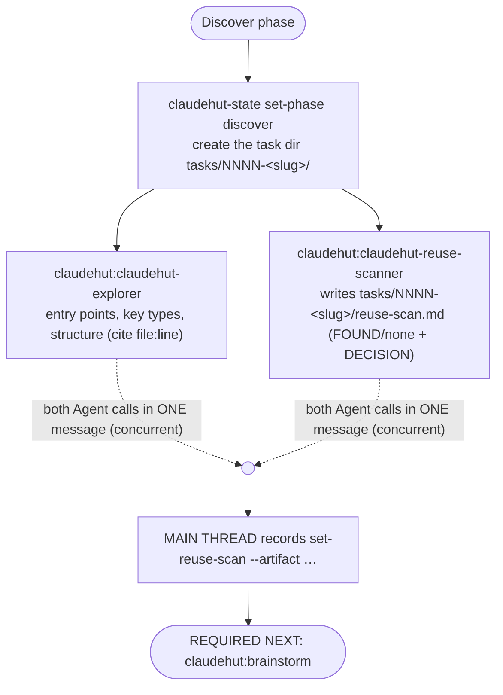

# Discover (phase 1 of 7)

Ground the task in **this codebase** and settle the reuse question before any ideation. This phase was split
out of Brainstorm (decision reversal, v0.4): exploration + reuse-scan are *discovery*, not *ideation* —
folding them into Brainstorm over-fit it and killed creative breadth. Discover does the grounding; Brainstorm
(phase 2) then ideates freely on top of it. Runs **inline on the main thread** (it owns the state write; a
forked subagent cannot spawn subagents).

## Iron Law

```
NO NEW CLASS, SERVICE, UTILITY, CONFIG, OR ENDPOINT BEFORE A REUSE SCAN
```

The `PreToolUse` write gate enforces this: until `reuse_scan=true` (recorded here), every production write is
denied — in **every** complexity tier. Discover is the one phase the fast lane never skips.

## Flow



## Steps

1. **Create the task dir** (every artifact of this task lives here): `NNNN` = zero-padded next integer over
   `${CLAUDE_PROJECT_DIR}/.claude/claudehut/tasks/`, slug = kebab-case task name. Record:
   `claudehut-state --session ${CLAUDE_SESSION_ID} set-phase discover`.

2. **Tier branch — how the scan runs depends on the recorded complexity tier:**

   **`trivial` tier → INLINE DISCOVER (no subagents).** A no-logic change does not justify the ~26s
   2-subagent dispatch floor (measured, BENCH-REPORT). The main thread does the scan itself, ~5 tool calls:
   1. Grep the codebase for components matching what you are about to change (≤3 targeted Grep calls —
      the class, its annotations/signature shape, the config prefix).
   2. Write `tasks/NNNN-<slug>/reuse-scan.md` inline, following the Summary-table format of
      `references/reuse-scan-template.md` (a trivial scan is usually just the table + Recommendation).
   3. Record it (step 3 below) and proceed straight to Implement — **still invoking
      `claudehut:implement` first; the gate's skill rail applies in every tier.**
   The gate still requires the artifact file — inline replaces the *dispatch*, never the *scan*.

   **`small`/`full` tiers → dispatch explorer + reuse-scanner together in ONE message** (two Agent tool
   calls in a single response — the native concurrency mechanism; their inputs are independent). **In these
   tiers BOTH are mandatory — the scanner is not optional**, even when the task "obviously" has nothing to
   reuse (measured miss: a rate-limiting task skipped the scanner; the write gate then denies every
   production write for lack of the artifact):

   | Rationalization | Reality |
   |---|---|
   | "New infra/feature — nothing to reuse here" | Filters, configs, interceptors, utils often exist. The scan proves it either way and the gate requires the artifact. |
   | "The explorer already looked around" | Exploration ≠ a reuse DECISION with an artifact. Both run. |
   - `claudehut:claudehut-explorer` — loads the index (`PROJECT.md`, `architecture.md`, `reuse-index.json`),
     maps the packages/classes the task touches (cite `file:line`), returns entry points, key types, and a
     **Reuse candidates** list. Read-only.
   - `claudehut:claudehut-reuse-scanner` — queries `reuse-index.json` by tag, greps similar signatures/
     annotations, reads learnings tagged `reuse`, then writes
     `${CLAUDE_PROJECT_DIR}/.claude/claudehut/tasks/NNNN-<slug>/reuse-scan.md` (canonical path — the gate
     requires it under `.claude/claudehut/`) **in the summary-first format of
     `${CLAUDE_PLUGIN_ROOT}/skills/discover/references/reuse-scan-template.md` — name this template path in
     the dispatch prompt** (Summary table → Evidence only for questionable rows → one-line Recommendation,
     ≤400 words). It **returns the path — it does not write state** (no Bash).

3. **Main thread records the artifact** (this flips `reuse_scan=true` and arms the gate's first precondition):

   ```
   claudehut-state --session ${CLAUDE_SESSION_ID} set-reuse-scan --artifact .claude/claudehut/tasks/NNNN-<slug>/reuse-scan.md
   ```

## Red flags — STOP

- About to write production code with no `tasks/NNNN-<slug>/reuse-scan.md` on disk.
- Treating "I read some files" as a reuse decision — the artifact with an explicit DECISION is the output.

**REQUIRED NEXT:** `claudehut:brainstorm` (it consumes this phase's context + reuse decision).
