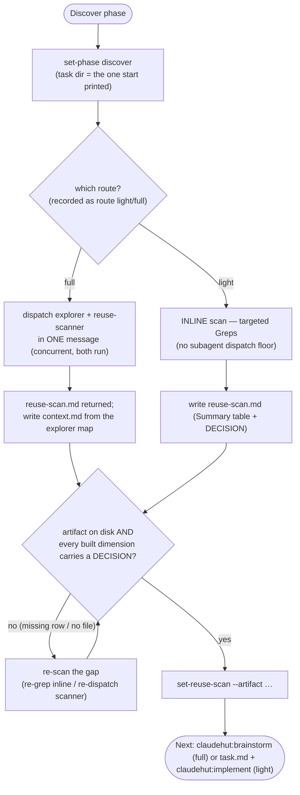

# Discover (phase 1 of 7)

Ground the task in **this codebase** and settle the reuse question before any ideation. This phase was split
out of Brainstorm: exploration + reuse-scan are *discovery*, not *ideation* —
folding them into Brainstorm over-fit it and killed creative breadth. Discover does the grounding; Brainstorm
(phase 2) then ideates freely on top of it. Runs **inline on the main thread** (it owns the state write; a
forked subagent cannot write state or ask the user).

## Why the scan comes first

On the `light` and `full` routes, the reuse question is settled before a new class, service, utility,
config or endpoint is built. `set-reuse-scan` records it (`reuse_scan=true`) and Review checks it. No hook
denies a write (the hooks are advisory). A `direct`-route request runs no Discover: it looks things up
(project index or hub, the understand-anything graph, targeted Grep) and moves on.

## The decision ladder (what the scan decides)

The reuse-scan is not only "does the project already have it?" — it answers the full lazy-senior-dev ladder
for each thing the task would build, **stopping at the first rung that fits** (create-time depth:
`skills/implement/references/minimalism.md`):

```
0. need-to-exist?              → no: DROP it (YAGNI)                         drop
1. JDK / Java stdlib does it?  ┐
2. Spring / installed starter? ├ → use it, write nothing                    framework
3. already-declared dependency?┘   (check build.gradle/pom.xml's classpath)
4. existing PROJECT code?      → adopt as-is | extend it (cite file:line)    adopt | extend
5. nothing fits                → minimum new code, justified                 new
```

**The safety floor is never a rung you skip** — validation, error handling, security, transactions, and
observability are required no matter how lazy the build. Minimalism cuts complexity, never robustness.

## Flow


```mermaid
flowchart TB
    start([Discover phase]) --> ph["set-phase discover<br/>(task dir = the one start printed)"]
    ph --> rt{"which route?<br/>(recorded as route light/full)"}
    rt -- "light" --> inl["INLINE scan — targeted Greps<br/>(no subagent dispatch floor)"]
    rt -- "full" --> fan["dispatch explorer + reuse-scanner<br/>in ONE message (concurrent, both run)"]
    fan --> join["reuse-scan.md returned;<br/>write context.md from the explorer map"]
    inl --> wr["write reuse-scan.md (Summary table + DECISION)"]
    join --> grd{"artifact on disk AND<br/>every built dimension carries a DECISION?"}
    wr --> grd
    grd -- "no (missing row / no file)" --> rescan["re-scan the gap<br/>(re-grep inline / re-dispatch scanner)"]
    rescan --> grd
    grd -- "yes" --> rec["set-reuse-scan --artifact …"]
    rec --> done(["Next: claudehut:brainstorm (full) or task.md + claudehut:implement (light)"])
```

## Steps

1. **Use the task dir `start` printed** (every artifact of this task lives there; `tasks/NNNN-<slug>/` below
   means that dir). Never create or number a task dir yourself. No task for THIS request yet (`claudehut-state
   --session ${CLAUDE_SESSION_ID} status` shows `active_task: null`, or its task already finished — review `pass`,
   phase `learn`, or `findings_path` set: that is a previous request's)?
   Open it first: `claudehut-state --session ${CLAUDE_SESSION_ID} start --route light|full --slug <kebab-name>
   [--profile <p>]` (it supersedes the previous one). Continuing another session's or a fork's task → `claudehut-state
   --session ${CLAUDE_SESSION_ID} resume <id>` instead. Record:
   `claudehut-state --session ${CLAUDE_SESSION_ID} set-phase discover`.

2. **Route branch — how the scan runs depends on the route you chose** (recorded as route `light` or
   `full`; the diagram's `rt` diamond):

   **`light` route → INLINE DISCOVER (no subagents).** A light task does not justify the ~26s
   2-subagent dispatch floor (measured). The main thread does the scan itself (≤3 targeted Grep
   calls — the class, its annotations/signature shape, the config prefix), writes
   `tasks/NNNN-<slug>/reuse-scan.md` following the Summary-table format of `references/reuse-scan-template.md`,
   then writes `task.md` from `${CLAUDE_PLUGIN_ROOT}/skills/write-plan/references/task-template.md`, records it (`claudehut-state --session ${CLAUDE_SESSION_ID} set-plan <task.md>`), then `claudehut:implement`.
   Inline replaces the *dispatch*, never the *scan* — Review still requires the file.
   When the change spans several files, widen the sweep to ~5 Greps and keep the same artifact. If the scan
   turns up a reusable asset that changes the shape of the work, or the task shows hidden complexity,
   escalate: `set-route full`, tell the user in one line, and dispatch properly — inline is a cost decision,
   not a licence to scan less.

   **`full` route → dispatch explorer + reuse-scanner together in ONE message** (two Agent tool
   calls in a single response — the native concurrency mechanism; their inputs are independent), without
   `name`. Both run even when the task "obviously" has nothing to reuse (a skipped scanner leaves Review no artifact):

   | Rationalization | Reality |
   |---|---|
   | "New infra/feature — nothing to reuse here" | Filters, configs, interceptors, utils often exist. The scan proves it either way and Review requires the artifact. |
   | "The explorer already looked around" | Exploration ≠ a reuse DECISION with an artifact. Both run. |
   - `claudehut:claudehut-explorer` — loads the index (`PROJECT.md`, `architecture.md`, `reuse-index.json`),
     maps the packages/classes the task touches (cite `file:line`), returns a **Reuse candidates** list. Read-only.
     The main thread writes its map to `tasks/NNNN-<slug>/context.md` (`references/context-template.md`;
     `## Index brief` is `n/a — index not built` until the project index exists).
     When SessionStart printed an understand-anything graph line, put that path
     (`${CLAUDE_PROJECT_DIR}/.understand-anything/knowledge-graph.json`) in the dispatch prompt.
   - `claudehut:claudehut-reuse-scanner` — writes
     `${CLAUDE_PROJECT_DIR}/.claude/claudehut/tasks/NNNN-<slug>/reuse-scan.md` (canonical path — claudehut-state
     accepts it only under `.claude/claudehut/`) **in the summary-first format of
     `${CLAUDE_PLUGIN_ROOT}/skills/discover/references/reuse-scan-template.md` — name this template path in
     the dispatch prompt**. It **returns the path — it does not write state** (no Bash).

3. **Main thread records the artifact** (this flips `reuse_scan=true`, Implement's first precondition):

   ```
   claudehut-state --session ${CLAUDE_SESSION_ID} set-reuse-scan --artifact .claude/claudehut/tasks/NNNN-<slug>/reuse-scan.md
   ```

## Red flags

- On a light or full task, about to write production code with no `tasks/NNNN-<slug>/reuse-scan.md` on disk.
- Treating "I read some files" as a reuse decision — the artifact with an explicit DECISION is the output.

**Next:** `claudehut:brainstorm` on the full route (it consumes this phase's context + reuse decision);
`task.md` and `claudehut:implement` on the light route.
