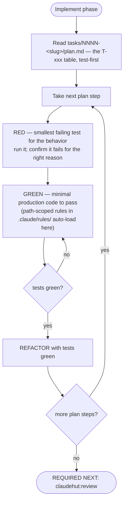
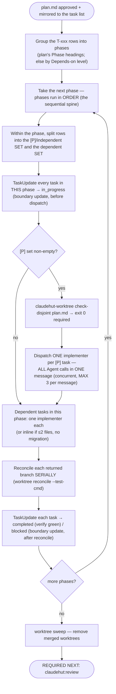

# Implement (phase 5 of 7)

Execute the approved plan **test-first**, producing code that satisfies the spec and passes every applicable
rule. This skill is preloaded into `claudehut-implementer` (which runs in an isolated worktree) and is also
the main thread's playbook when implementing directly. The per-file tech-stack standards live in the
project's `.claude/rules/` tree and **auto-load by path** as you touch matching files — follow them; this
skill carries the workflow discipline and the deeper playbooks.

## Iron Law

```
NO PRODUCTION CODE WITHOUT A FAILING TEST FIRST
```

Wrote production code before the test? Delete it. Start over. **No exceptions** — don't keep it "as
reference," don't "adapt" it while writing the test, don't even look at it. Delete means delete.
**Violating the letter of this law is violating the spirit of it.**

## Preconditions (the write gate — tier-aware)

Production writes are denied by the `PreToolUse` gate until: `reuse_scan=true` (**every tier** — Discover
produces it), plus — **in the `full` tier only** — `spec_path` and `plan_path` set. In the `trivial`/`small`
fast lanes, reuse-scan alone opens the gate **provided** the change stays within the bound (≤2 files, no
security/auth/migration path); exceed it and the gate denies, telling you to escalate
(`set-complexity full` → Spec + Plan). The RED test may be written first — the gate always allows test paths
(`*Test.java`, `*IT.java`, `*/test/*`). If a write is denied, read the reason: you either skipped a phase or
out-grew the fast lane.

## Flow



## Execution — the main thread orchestrates the plan PHASE BY PHASE

**The main thread is the orchestrator. The default for ANY multi-task plan is to WALK THE PLAN PHASE BY
PHASE and fan out within each phase — NEVER hand the whole plan to one implementer.** A real plan is
*phased and mixed* (a sequential setup phase, then a domain phase with several independent tasks, then an
API phase…). Collapsing all of it onto a single implementer is the serial bottleneck this rule exists to
kill (Issue 1): you get one opaque agent, no visible fan-out, and a frozen task list. Don't do it.

Fast-lane tiers (`trivial`/`small`) have no `plan.md` — implement **inline** from the task description and
skip to *The cycle*. For a `full`-tier plan, run this loop on the main thread:



**Who executes a task within a phase** (decide per task, not per plan):
- **≤ 2 files and no migration** → implement **inline** on the main thread (cheap; no worktree).
- **otherwise** → dispatch a `claudehut:claudehut-implementer` (Agent tool; isolated worktree).
- **The phase's `[P]`/independent tasks → a PARALLEL batch.** First run
  `"${CLAUDE_PLUGIN_ROOT}/bin/claudehut-worktree" check-disjoint <plan.md>` — it is **phase-aware** and
  prints the **per-phase batch schedule** (e.g. `phase 1: PARALLEL BATCH [T-002, T-003]`). **Follow that
  schedule — it is the authoritative dispatch plan; don't re-derive batches by eye.** Exit 0 = every phase's
  `[P]` Files are pairwise disjoint. Exit 2 = some phase has a *within-phase* file overlap — run **that
  phase's** listed tasks sequentially; the other phases in the schedule are still parallel-safe. (A file
  reused across *different* phases is fine — those tasks never run concurrently.) For each phase's PARALLEL
  BATCH, dispatch **one implementer per task — all Agent calls in ONE message** (the native concurrency
  mechanism; **max 3** concurrent — a larger batch fans out in successive messages of ≤3). Each dispatch prompt carries: its T-xxx row(s) **verbatim**
  (goal, files, test-first, minimal change, verify), the relevant spec acceptance criteria, the enforcement
  set, and an **exclusive file-ownership list** ("create/edit ONLY these paths"). The worktree **forks from
  the current branch HEAD** (`worktree.baseRef=head`, set by `claudehut-init`), so **committed prior-phase
  code IS present** — a later phase's implementer can and should build on earlier phases' work. Only
  **uncommitted** main-tree files are absent (the in-flight `plan.md`/`spec.md` under `.claude/`), so still
  pass the T-xxx rows + acceptance criteria as **content, not a path**.
- **Reconcile serialized — never batch-merge.** As implementers return `DONE (branch, commit)`, merge **one
  at a time**: `"${CLAUDE_PLUGIN_ROOT}/bin/claudehut-worktree" reconcile <branch> --test-cmd "<verify command
  from PROJECT.md>"`. A conflict aborts cleanly (fix or re-plan that task); red tests roll the merge back.
  Advance to the next phase only after the current phase's batch reconciles. After the last phase:
  `"${CLAUDE_PLUGIN_ROOT}/bin/claudehut-worktree" sweep` — removes only merged/unchanged managed worktrees,
  leaving **zero orphans**.
- **Commit-before-dependent-dispatch (HARD — this is what makes `baseRef=head` work).** A phase's worktrees
  fork from the **current HEAD**, so every prior phase's work must be **committed on the feature branch
  before the next phase dispatches**. Reconcile already commits the worktree branches; **an inline phase you
  do NOT — so after implementing a phase inline (a sequential spine, a ≤2-file task), `git commit` it before
  dispatching the next phase's batch.** Skip this and the next phase's implementers fork from a HEAD missing
  the inline work → they can't build on it → you're forced back to inline (the exact failure this fixes).

**Native task mirror — boundary updates (main thread ONLY).** The plan's T-xxx table was mirrored into
Claude Code's task list at plan approval. **Subagents have no task tools — they cannot update the list; only
the main thread can, and only when it is not blocked.** So keep the list live at **phase-batch boundaries**:
`TaskUpdate` every task in a phase → `in_progress` **before** dispatching that phase's batch, and → `completed`
(its verify command green — from your run or the implementer's returned per-task status block) or `blocked`
**after** the batch reconciles. The list therefore advances at each phase boundary; you will not see a
mid-flight tick *inside* a single parallel batch (a blocking dispatch can't report partials — that is the
accepted trade for not paying background-dispatch overhead). `plan.md` stays the durable source of truth —
on a resumed session, re-mirror still-pending T-xxx rows from `plan.md` with `TaskCreate`.

## The cycle

1. **RED** — write the smallest failing test for the next behavior. Run it; confirm it fails for the *right*
   reason (not a compile error you didn't intend).
2. **GREEN** — write the minimal production code to pass. Run it; confirm green.
3. **REFACTOR** — clean up while tests stay green.

Work the plan's T-xxx tasks in dependency order. Honor the **enforcement set** recorded in Brainstorm — every
listed skill and rule must end up satisfied (Review audits exactly this set).

| Rationalization | Reality |
|--------|---------|
| "Too simple to test" | Simple code breaks. The test takes 30 seconds. |
| "I'll test after" | Tests-after answer "what does this do?", not "what should this do?" |
| "I already manually tested it" | Manual tests don't run in CI and prove nothing tomorrow. |
| "Deleting this code is wasteful" | Sunk cost. Unverified code is debt. |

## Tech-stack conventions — rules (edit-time) + playbooks (create-time)

Two surfaces, split by **measured** behavior (EVAL-REPORT #7):
- **Path-scoped rules** in `.claude/rules/` auto-load when you **read/edit an existing** matching file — terse standards, reliable on edits.
- **They do NOT fire when you CREATE a new file** (creation ≠ a read). **So when creating a new component, READ the matching playbook below FIRST.** These `references/*` playbooks are **context7-researched current best practice**, preloaded with this skill, and carry the create-time standard the path-rule would otherwise supply.

| Creating / editing… | READ this playbook (create-time) | Rule that auto-loads (edit-time) |
|---|---|---|
| MVC controller, DTO, validation, error mapping | `references/web.md` | `framework/spring-mvc`, `framework/jackson`, `security/input-validation` |
| WebFlux handler/router, Mono/Flux, R2DBC | `references/reactive.md` | `framework/webflux`·`r2dbc`, `performance/backpressure` |
| JPA entity / repository | `references/jpa.md` | `framework/jpa`·`lombok-jpa-safety`, `performance/n-plus-one` |
| Kafka/Rabbit/NATS listener/producer | `references/messaging.md` | `framework/kafka-consumer`·`kafka-producer`·`rabbitmq`·`nats` |
| Redis / `@Cacheable` cache code | `references/caching.md` | `framework/redis`, `performance/caching` |
| Security config, authz, deserialization, secrets | `references/security.md` | `security/spring-security`·`owasp-top10`·`secret-mgmt` |
| Flyway migration, index, datasource/pool | `references/persistence-ops.md` | `framework/flyway-naming`·`migration-safety`, `performance/indexing`·`connection-pool` |
| Tests (`*Test`/`*IT`), choosing a test type | `references/testing.md` | `testing/*` |
| Any Java — records, mappers, DI, style | `references/java-lang.md` | `coding/*`, `framework/mapstruct`·`lombok-*` |

**Create-time must-dos (do these even if you don't open the playbook).** Measured (EVAL-REPORT): at create-time
the playbook Read fires 13/15, but a *skipped* read is a real defect where the floor below doesn't carry the
rule — most acutely for security. These non-negotiables are therefore stated here, in the always-loaded skill
body, not only in the playbook file:
- **Security** — deny-by-default: `anyRequest().authenticated()` / `denyAll()`, then explicitly permit. **Never
  `.anyRequest().permitAll()` as the default** (silent open door). Use a `SecurityFilterChain` bean — never
  `WebSecurityConfigurerAdapter` (removed in Security 6). `@Valid` every `@RequestBody`; bind `*Request` DTOs,
  never `@Entity`. (full depth → `references/security.md`)
- **JPA** — set the fetch type explicitly (`@ManyToOne`/`@OneToOne` default to **EAGER** — make it `LAZY`); guard
  N+1 (fetch-join / `@EntityGraph`). No `@Data`/`@Builder`/`@EqualsAndHashCode` on `@Entity`. (→ `references/jpa.md`)
- **Messaging** — idempotent consumer (handlers replay); explicit ack/offset commit, not auto-ack-before-work;
  DLQ/retry for poison messages. (→ `references/messaging.md`)
- **Reactive** — never block the event loop: no `.block()`/blocking I/O inside a `Mono`/`Flux` chain or handler;
  offload blocking calls to a bounded scheduler. (→ `references/reactive.md`)

Cross-cutting Spring conventions that always apply: **constructor injection only** (no field `@Autowired`;
collaborators `final`), **thin controllers** (validate → one service call → map; DTOs not entities),
**services own the transaction boundary** (no web/persistence types leaking across), **externalized config**
via `@ConfigurationProperties`. Match the existing base package, layering, and naming from
`project-structure.md` / `vocabulary.md` — never invent a parallel structure.

## Red flags — STOP and start over

- Production code before a failing test
- "It's about spirit, not ritual" / "this case is different because…"
- A denied write you tried to route around instead of completing the missing phase

**REQUIRED NEXT:** `claudehut:review`.
