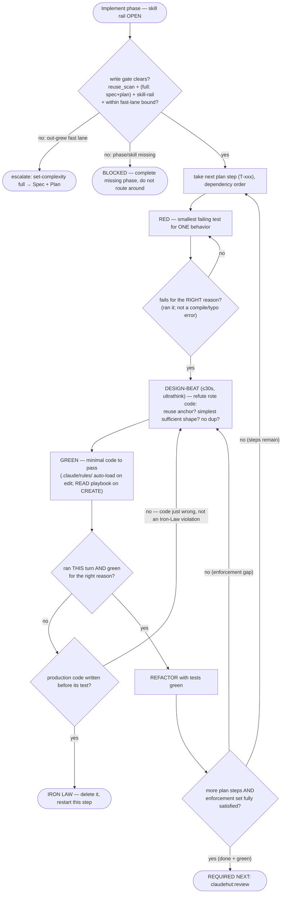

# Implement (phase 5 of 7)

Execute the approved plan **test-first**, producing code that satisfies the spec and passes every applicable
rule. This skill is preloaded into `claudehut-implementer` (which runs in an isolated worktree) and is also
the main thread's playbook when implementing directly. The per-file tech-stack standards live in the
project's `.claude/rules/` tree and **auto-load by path** as you touch matching files — follow them; this
skill carries the workflow discipline and the deeper playbooks.

## Iron Law

```
NO PRODUCTION CODE WITHOUT A FAILING TEST FIRST
```

Wrote production code before the test? Delete it. Start over. **No exceptions** — don't keep it "as
reference," don't "adapt" it while writing the test, don't even look at it. Delete means delete.
**Violating the letter of this law is violating the spirit of it.**

## Preconditions (the write gate — tier-aware)

Production writes are denied by the `PreToolUse` gate until: `reuse_scan=true` (**every tier** — Discover
produces it), plus — **in the `full` tier only** — `spec_path` and `plan_path` set, plus — **every tier,
the skill rail** — *this skill was invoked for this task*. Invoking `claudehut:implement` opens that rail (a
`PreToolUse(Skill)` recorder hook proves the call; entering Discover/Brainstorm closes it for the next task)
— so if the gate sent you here, the rail is now open. In the
`trivial`/`small` fast lanes, reuse-scan + the skill rail open the gate **provided** the change stays
within the bound (≤2 files, no security/auth/migration path); exceed it and the gate denies, telling you
to escalate (`set-complexity full` → Spec + Plan). The RED test may be written first — the gate always
allows test paths (`*Test.java`, `*IT.java`, `*/test/*`). A denied write diagnoses itself (the Flow gate's `no` branches) — complete the missing phase/skill or escalate the fast lane; never route around it.

## Flow


```mermaid
flowchart TB
    start(["Implement phase — skill rail OPEN"]) --> gate{"write gate clears?<br/>reuse_scan + (full: spec+plan) + skill-rail<br/>+ within fast-lane bound?"}
    gate -- "no: out-grew fast lane" --> esc(["escalate: set-complexity full → Spec + Plan"])
    gate -- "no: phase/skill missing" --> esc2(["BLOCKED — complete missing phase, do not route around"])
    gate -- "yes" --> step["take next plan step (T-xxx), dependency order"]
    step --> red["RED — smallest failing test for ONE behavior"]
    red --> rr{"fails for the RIGHT reason?<br/>(ran it; not a compile/typo error)"}
    rr -- "no" --> red
    rr -- "yes" --> beat["DESIGN-BEAT (≤30s, ultrathink) — refute rote code:<br/>reuse anchor? simplest sufficient shape? no dup?"]
    beat --> green["GREEN — minimal code to pass<br/>(.claude/rules/ auto-load on edit; READ playbook on CREATE)"]
    green --> ev{"ran THIS turn AND green<br/>for the right reason?"}
    ev -- "no" --> iron{"production code written before its test?"}
    iron -- "yes" --> del(["IRON LAW — delete it, restart this step"])
    iron -- "no — code just wrong, not an Iron-Law violation" --> beat
    ev -- "yes" --> refactor["REFACTOR with tests green"]
    refactor --> more{"more plan steps AND<br/>enforcement set fully satisfied?"}
    more -- "no (steps remain)" --> step
    more -- "no (enforcement gap)" --> beat
    more -- "yes (done + green)" --> done(["REQUIRED NEXT: claudehut:review"])
```

## Execution — the main thread orchestrates the plan PHASE BY PHASE

**The main thread is the orchestrator. The default for ANY multi-task plan is to WALK THE PLAN PHASE BY
PHASE and fan out within each phase — NEVER hand the whole plan to one implementer.** A real plan is
*phased and mixed* (a sequential setup phase, then a domain phase with several independent tasks, then an
API phase…). Collapsing all of it onto a single implementer is the serial bottleneck this rule exists to
kill: you get one opaque agent, no visible fan-out, and a frozen task list. Don't do it.

Fast-lane tiers (`trivial`/`small`) have no `plan.md` — implement **inline** from the task description and
skip to *The cycle*. **`small` tier first does a one-line mini-brainstorm:** name ≥2 approaches +
the one you chose and why, in a single line, before the first test. If you can only find one approach and it
needs defending, the task was really `full` — escalate (`set-complexity full`). `trivial` (comment/rename)
needs none.

**Main thread only — if you have no Agent tool, skip this section; it is not yours to run.**

**`plan.md` exists → Read `references/orchestration.md` BEFORE dispatching.** It carries the phase walk, the
`check-disjoint` batch schedule, worktree reconcile/sweep, and the task-mirror rules. Dispatching a plan
without reading it produces the single-implementer collapse this phase exists to prevent.

The non-negotiables it expands — summarised so a skipped read is a violation, not a gap:

- **Walk phases in ORDER; fan out within a phase.** One implementer per `[P]` task, all Agent calls in ONE
  message, max 3 concurrent. Never hand a whole plan to one implementer. Within a phase: ≤2 files and no
  migration → inline; otherwise dispatch `claudehut:claudehut-implementer`.
- **Run `claudehut-worktree check-disjoint <plan.md>` first** and follow the per-phase batch schedule it
  prints — it is authoritative; do not re-derive batches by eye.
- **`worktree.baseRef=head`** — worktrees fork from the current HEAD, so committed prior-phase code IS
  present; uncommitted main-tree files are not, so pass T-xxx rows as content, not a path.
- **Commit-before-dependent-dispatch (HARD).** Reconcile commits worktree branches, but an inline phase you
  must `git commit` yourself before dispatching the next phase — else its implementers fork from a HEAD
  missing that work.
- **Reconcile serially, never batch-merge**; `sweep` after the last phase.
- **Native task mirror, IF task tools exist: update at phase-batch boundaries only** (main thread only;
  subagents never have them, and many main-thread sessions do not either — absent, skip it, `plan.md` rules). `in_progress` before a phase dispatches, `completed`/`blocked` after it reconciles.

## The cycle

The Flow diagram above is the cycle; the one beat that stops rote code is before GREEN — `ultrathink` the
**design beat** (≤30s): (a) **reuse?** honor the plan sketch's reuse anchor, don't re-implement what the
project or an installed dep already ships; (b) **simplest sufficient shape** — minimal code, not a speculative
abstraction nor the flimsier algorithm; (c) **don't duplicate** — repeating a sibling-file helper? extract ONE shared util. (For any NEW component, the design ladder is `references/minimalism.md`.)

Work the plan's T-xxx tasks in dependency order, honoring the **enforcement set** recorded in Brainstorm — every listed skill and rule must end up satisfied (Review audits exactly this set).

| Rationalization | Reality |
|--------|---------|
| "Too simple to test" | Simple code breaks. The test takes 30 seconds. |
| "I'll test after" | Tests-after answer "what does this do?", not "what should this do?" |
| "I already manually tested it" | Manual tests don't run in CI and prove nothing tomorrow. |
| "Deleting this code is wasteful" | Sunk cost. Unverified code is debt. |

## Tech-stack conventions — rules (edit-time) + playbooks (create-time)

Two surfaces:
- **Path-scoped rules** in `.claude/rules/` auto-load when you **read/edit an existing** matching file — terse standards, reliable on edits.
- **They do NOT fire when you CREATE a new file** (creation ≠ a read). **So when creating a new component, READ the matching playbook below FIRST** — these `references/*` playbooks carry the create-time standard the path-rule would otherwise supply. **Completion criterion (not optional):** a new file created *without* its playbook read is an unfinished task — the create-time miss is exactly where duplication and missing-security defects enter.

| Creating / editing… | READ this playbook (create-time) | Rule that auto-loads (edit-time) |
|---|---|---|
| **ANY new component — before you build it** | **`references/minimalism.md`** (the decision ladder: drop → stdlib → Spring → dep → one-line → minimal) | — |
| MVC controller, DTO, validation, error mapping | `references/web.md` | `framework/spring-mvc`, `framework/jackson`, `security/input-validation` |
| WebFlux handler/router, Mono/Flux, R2DBC | `references/reactive.md` | `framework/webflux`·`r2dbc`, `performance/backpressure` |
| JPA entity / repository | `references/jpa.md` | `framework/jpa`·`lombok-jpa-safety`, `performance/n-plus-one` |
| Kafka/Rabbit/NATS listener/producer | `references/messaging.md` | `framework/kafka-consumer`·`kafka-producer`·`rabbitmq`·`nats` |
| Redis / `@Cacheable` cache code | `references/caching.md` | `framework/redis`, `performance/caching` |
| Security config, authz, deserialization, secrets | `references/security.md` | `security/spring-security`·`owasp-top10`·`secret-mgmt` |
| Flyway migration, index, datasource/pool | `references/persistence-ops.md` | `framework/flyway-naming`·`migration-safety`, `performance/indexing`·`connection-pool` |
| Tests (`*Test`/`*IT`), choosing a test type | `references/testing.md` | `testing/*` |
| Any Java — records, mappers, DI, style | `references/java-lang.md` | `coding/*`, `framework/mapstruct`·`lombok-*` |
| **Summer Framework wiring** (`io.f8a.summer` — deps, `f8a.*`/`summer.*` properties, gates, `Ufid`/`Txid` annotations, Summer Kafka contracts, Summer types) | **`.claude/summer-kb/<module>.md`** (when the project has `.claude/summer-kb/`) — open the module doc the plan/spec cites BEFORE writing; copy property names, gate defaults, and coordinates from its `Activate`/`Config keys`/`Usage` sections, never from memory. KB can't verify a fact → `[unverified]` + surface it, don't guess | `summer-kb` (always-on pointer) |

**Create-time must-dos — the always-loaded floor for when a create-time playbook read is skipped** (a skipped
read is a real defect, most acutely for security):
- **Security** — deny-by-default: `anyRequest().authenticated()` / `denyAll()`, then explicitly permit. **Never
  `.anyRequest().permitAll()` as the default** (silent open door). Use a `SecurityFilterChain` bean — never
  `WebSecurityConfigurerAdapter` (removed in Security 6). `@Valid` every `@RequestBody`; bind `*Request` DTOs,
  never `@Entity`. (full depth → `references/security.md`)
- **JPA** — set the fetch type explicitly (`@ManyToOne`/`@OneToOne` default to **EAGER** — make it `LAZY`); guard
  N+1 (fetch-join / `@EntityGraph`). No `@Data`/`@Builder` on `@Entity`, and no **naked** `@EqualsAndHashCode` —
  `@EqualsAndHashCode(onlyExplicitlyIncluded = true)` over the business key is the correct form. (→ `references/jpa.md`)
- **Messaging** — idempotent consumer (handlers replay); explicit ack/offset commit, not auto-ack-before-work;
  DLQ/retry for poison messages. (→ `references/messaging.md`)
- **Reactive** — never block the event loop: no `.block()`/blocking I/O inside a `Mono`/`Flux` chain or handler;
  offload blocking calls to a bounded scheduler. (→ `references/reactive.md`)

*The bullets above are the always-loaded floor, not the authoritative depth — the `references/*` playbooks
and the generated `.claude/rules/` files carry the full standard. **If this list and a rule file ever
diverge, the rule file wins** (rules are upgraded independently; this floor is intentionally minimal to
avoid drift).*

Cross-cutting Spring conventions that always apply: **constructor injection only** (no field `@Autowired`;
collaborators `final`), **thin controllers** (validate → one service call → map; DTOs not entities),
**services own the transaction boundary** (no web/persistence types leaking across), **externalized config**
via `@ConfigurationProperties`. Match the existing base package, layering, and naming from
`project-structure.md` / `vocabulary.md` — never invent a parallel structure.

## Symbol navigation — LSP, not grep (Java only)

The plugin ships `jdtls` (`.lsp.json`): for a **Java** symbol use the LSP tool — `findReferences` for
callers, `goToDefinition` for the declaration. grep finds the string, LSP finds the *symbol*, so it does
not miss an implementation reached through an interface nor match the name in a comment. Non-Java: grep.
Diagnostics are **off** in this config — the build and tests stay the only signal for type errors.

## Red flags — STOP and start over

- Production code before a failing test
- "It's about spirit, not ritual" / "this case is different because…"
- A denied write you tried to route around instead of completing the missing phase

**REQUIRED NEXT:** `claudehut:review`.
