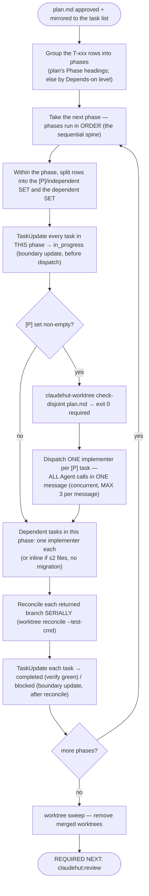

# Implement — plan orchestration (full tier)

Read this BEFORE dispatching any `full`-tier plan. `skills/implement/SKILL.md` carries the non-negotiables in
summary; this file is the mechanism. It lives here rather than in the skill body because the skill is
preloaded into every implementer subagent, and an implementer has no Agent or task tools — none of the
orchestration below is actionable there. The main thread is the only reader that can act on it.

**Who executes a task within a phase** (decide per task, not per plan):
- **≤ 2 files and no migration** → implement **inline** on the main thread (cheap; no worktree).
- **otherwise** → dispatch a `claudehut:claudehut-implementer` (Agent tool; isolated worktree).
- **The phase's `[P]`/independent tasks → a PARALLEL batch.** First run
  `"${CLAUDE_PLUGIN_ROOT}/bin/claudehut-worktree" check-disjoint <plan.md>` — it is **phase-aware** and
  prints the **per-phase batch schedule** (e.g. `phase 1: PARALLEL BATCH [T-002, T-003]`). **Follow that
  schedule — it is the authoritative dispatch plan; don't re-derive batches by eye.** Exit 0 = every phase's
  `[P]` Files are pairwise disjoint **and** no `[P]` task depends on a `[P]` sibling in its own phase. Exit
  2 = some phase fails one of those — the schedule marks it `phase N: SEQUENTIAL (overlap|dependency)` and
  you run its listed tasks in order; every phase still printed as a `PARALLEL BATCH` is parallel-safe, so
  there is nothing to cross-reference or subtract. (A file reused across *different* phases is fine — those
  tasks never run concurrently.) For each phase's PARALLEL
  BATCH, dispatch **one implementer per task — all Agent calls in ONE message** (the native concurrency
  mechanism; **max 3** concurrent — the schedule already chunks a larger phase for you, printing
  `PARALLEL BATCH 1/2 […]`, `2/2 […]`; dispatch one wave per message). Each dispatch prompt carries: its T-xxx row(s) **verbatim**
  (goal, files, test-first, minimal change, verify), the relevant spec acceptance criteria, the enforcement
  set, and an **exclusive file-ownership list** ("create/edit ONLY these paths"). The worktree **forks from
  the current branch HEAD** (`worktree.baseRef=head`, set by `claudehut-init`), so **committed prior-phase
  code IS present** — a later phase's implementer can and should build on earlier phases' work. Only
  **uncommitted** main-tree files are absent (the in-flight `plan.md`/`spec.md` under `.claude/`), so still
  pass the T-xxx rows + acceptance criteria as **content, not a path**.
- **Reconcile serialized — never batch-merge.** As implementers return `DONE (branch, commit)`, merge **one
  at a time**: `"${CLAUDE_PLUGIN_ROOT}/bin/claudehut-worktree" reconcile <branch> --test-cmd "<verify command
  from PROJECT.md>"`. A conflict aborts cleanly (fix or re-plan that task); red tests roll the merge back.
  Advance to the next phase only after the current phase's batch reconciles. After the last phase:
  `"${CLAUDE_PLUGIN_ROOT}/bin/claudehut-worktree" sweep` — removes only merged/unchanged managed worktrees,
  leaving **zero orphans**.
- **Commit-before-dependent-dispatch (HARD — this is what makes `baseRef=head` work).** A phase's worktrees
  fork from the **current HEAD**, so every prior phase's work must be **committed on the feature branch
  before the next phase dispatches**. Reconcile already commits the worktree branches; **an inline phase you
  do NOT — so after implementing a phase inline (a sequential spine, a ≤2-file task), `git commit` it before
  dispatching the next phase's batch.** Skip this and the next phase's implementers fork from a HEAD missing
  the inline work → they can't build on it → you're forced back to inline (the exact failure this fixes).

**Native task mirror — boundary updates (main thread ONLY, and only if task tools exist in this session;
they frequently do not. No task tools → skip every mirror instruction below, including the two mirror nodes
in the diagram above; `plan.md` is the source of truth and the mirror was never a gate).** The plan's T-xxx table was mirrored into
Claude Code's task list at plan approval. **Subagents have no task tools — they cannot update the list; only
the main thread can, and only when it is not blocked.** So keep the list live at **phase-batch boundaries**:
`TaskUpdate` every task in a phase → `in_progress` **before** dispatching that phase's batch, and → `completed`
(its verify command green — from your run or the implementer's returned per-task status block) or `blocked`
**after** the batch reconciles. The list therefore advances at each phase boundary; you will not see a
mid-flight tick *inside* a single parallel batch (a blocking dispatch can't report partials — that is the
accepted trade for not paying background-dispatch overhead). `plan.md` stays the durable source of truth —
on a resumed session, re-mirror still-pending T-xxx rows from `plan.md` with `TaskCreate`.
