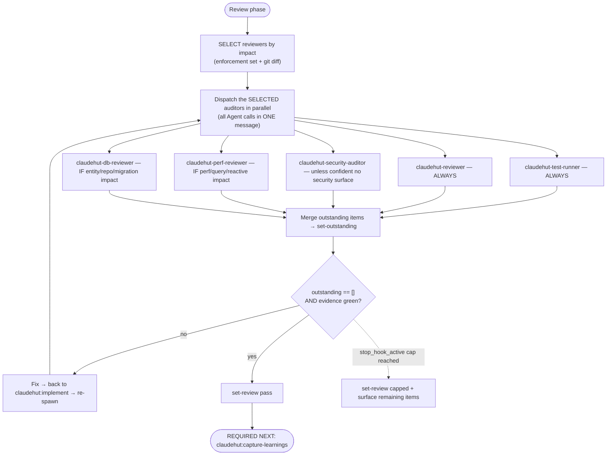

# Review (phase 6 of 7)

Prove the change is done — against the enforcement set, the project rules, and fresh test evidence — before
any completion claim. Run **inline on the main thread**: a subagent cannot spawn subagents, and this phase
dispatches five auditors in parallel.

## Iron Law

```
NO COMPLETION CLAIM WHILE ANY APPLICABLE SKILL, RULE, OR MEMORY ITEM IS UNSATISFIED — AND NONE WITHOUT FRESH REVIEW EVIDENCE
```

If you have not re-run the auditors **in this turn**, you cannot say it passes. This covers paraphrases too —
"should pass," "looks compliant," "probably fine" are all completion claims. The `Stop` gate blocks turn-end
until `review=pass`.

## Flow



## The loop

1. **Select the reviewers this change actually needs, then spawn them in parallel.** Dynamic selection
   (Issue 2): spawning a specialist with nothing to review wastes tokens + time (e.g. db-reviewer on a no-DB
   change). There is no native "reviewer selector" — *you* decide which Agent calls to issue, from two
   signals: the **enforcement set** (recorded in Brainstorm — its rules map to reviewers) and the **changed
   files**. **Fast-lane tasks (trivial/small tier) skipped Brainstorm and have NO enforcement set — select
   from the changed files alone**, applying the same asymmetry below. Get the changed files first:

   ```
   git diff --name-only $(git merge-base HEAD @{u} 2>/dev/null || echo HEAD~1)..HEAD; git status --porcelain
   ```

   | Reviewer | Spawn when | Asymmetry |
   |---|---|---|
   | `claudehut:claudehut-test-runner` | **always** | evidence is non-negotiable |
   | `claudehut:claudehut-reviewer` | **always** | correctness/conventions apply to any change |
   | `claudehut:claudehut-security-auditor` | **full tier:** enforcement has `security/*` **OR** diff touches controllers/auth/security/deserialization/secrets — skip ONLY on a confident no-security-surface read. **trivial/small tier: SKIP by default** — the write gate's fast-lane bound already **deterministically denied** any diff touching a security/auth/migration path (`fastlane_bound_ok`), so a fast-lane diff cannot contain that surface; spawn the auditor only if the diff somehow touches a controller/deserialization path anyway | **full tier over-include**: a false-skip ships a vulnerability (the `permitAll()` precedent); when in doubt, run it. The fast-lane skip is gate-backed, not judgment-backed |
   | `claudehut:claudehut-perf-reviewer` | enforcement has `performance/*` OR diff touches queries/repositories/reactive/hot paths | false-skip = perf regression, not a correctness defect — safe to skip when clearly irrelevant |
   | `claudehut:claudehut-db-reviewer` | enforcement has `framework/jpa`·`flyway`·`migration` OR diff touches `@Entity`/repository/migration files | the acceptance example: a **no-DB change does NOT spawn db-reviewer** |

   Then **issue all the SELECTED Agent calls in ONE message** (native concurrency — same-message calls run
   concurrently; read-only, so conflict-free). Dispatch by **qualified type** (`claudehut:claudehut-…`) —
   unqualified names can fail to resolve and waste a full dispatch round (measured). State which reviewers you
   selected and why (one line each) so any skip is auditable.

   **Every dispatch prompt MUST carry (the subagent inherits `.claude/rules/` via project memory, but these
   two are NOT auto-present in its isolated context):**
   - **Enforcement set, verbatim** —
     `jq -c '.enforcement_set' "${CLAUDE_PROJECT_DIR}/.claude/claudehut/state/${CLAUDE_SESSION_ID}.json"`.
     Auditors check against exactly these items; without it in the prompt they audit blind. (Fast-lane
     trivial/small tasks have an empty set — say so explicitly.)
   - **Vocabulary table** — if `${CLAUDE_PROJECT_DIR}/.claude/claudehut/LANGUAGE.md` exists, read it on the
     main thread and paste it under a `## Project Vocabulary` heading. The `vocabulary.md` rule reaches the
     subagent, but the LANGUAGE.md table it points to does not. If absent, omit (do not block).

   Auditors that can use a database/Kafka MCP **degrade gracefully** when none is connected: they review
   statically (read code, infer query plans) instead of running live queries, and say so in their report.

2. **Merge their outstanding items** (applicable-but-unsatisfied skills ∪ rules ∪ memory):

   ```
   claudehut-state --session ${CLAUDE_SESSION_ID} set-outstanding '["framework/jpa.md: N+1 in OrderService", "…"]'
   ```

3. If outstanding is non-empty → fix (loop back to `claudehut:implement`) → re-spawn the auditors.
4. **Persist the review evidence** to the task dir —
   `${CLAUDE_PROJECT_DIR}/.claude/claudehut/tasks/NNNN-<slug>/review.md`: per-auditor findings (what was
   checked, with citations), the test evidence (suite output summary), the outstanding items resolved across
   loops, and the final verdict. The review leaves an artifact like every other phase.
5. When **outstanding == [] AND evidence is green** → `set-review pass`.

## Test evidence (what the test-runner enforces)

Fresh evidence comes from the suite, picking the **cheapest test that proves the behavior**:

| Need | Use |
|------|-----|
| Pure logic, no Spring | plain JUnit 5 + Mockito (fastest) |
| Web layer only | `@WebMvcTest` (MVC) / `@WebFluxTest` (reactive) |
| Persistence only | `@DataJpaTest` / `@DataR2dbcTest` + Testcontainers |
| Full wiring / cross-cutting | `@SpringBootTest` (slowest — last resort) |
| External HTTP | WireMock (assert the request, not just stub the response) |
| Real DB / Kafka / Redis | Testcontainers — not embedded fakes or shared dev DBs |

No `Thread.sleep` for async — use Awaitility or `StepVerifier`. See `references/test-matrix.md` for the full
decision matrix and snippets.

## Exit condition

Exit when `outstanding == []` and evidence is green → `review=pass`. **OR** the native consecutive-`Stop` cap
is reached (`stop_hook_active`) → `set-review capped` and surface the remaining items to the user, rather than
looping forever.

## Red flags — STOP

- "should pass" / "probably fine" / "looks compliant" before the auditors re-ran this turn
- Claiming done with a non-empty outstanding set
- Trusting an auditor's "looks good" without it citing what it checked (auditors must report evidence)

**REQUIRED NEXT:** `claudehut:capture-learnings` (the Stop gate blocks "done" until Learn runs).
