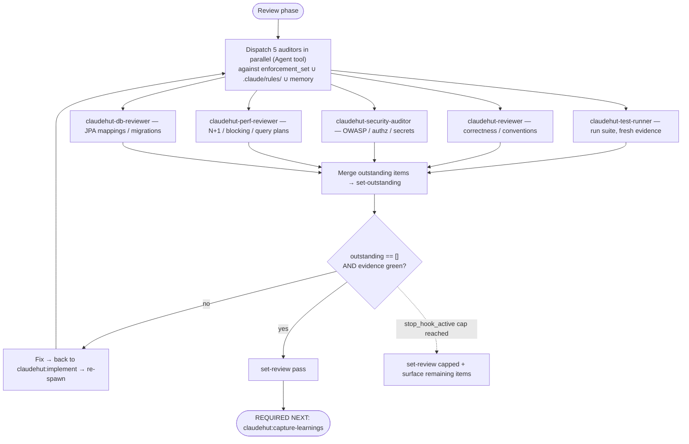

# Review (phase 5 of 6)

Prove the change is done — against the enforcement set, the project rules, and fresh test evidence — before
any completion claim. Run **inline on the main thread**: a subagent cannot spawn subagents, and this phase
dispatches five auditors in parallel.

## Iron Law

```
NO COMPLETION CLAIM WHILE ANY APPLICABLE SKILL, RULE, OR MEMORY ITEM IS UNSATISFIED — AND NONE WITHOUT FRESH REVIEW EVIDENCE
```

If you have not re-run the auditors **in this turn**, you cannot say it passes. This covers paraphrases too —
"should pass," "looks compliant," "probably fine" are all completion claims. The `Stop` gate blocks turn-end
until `review=pass`.

## Flow



## The loop

1. **Spawn the auditors in parallel** — issue **all five Agent tool calls in ONE message** (multiple
   tool_use blocks in a single response). That is the native concurrency mechanism: calls in the same
   message run concurrently; one call per message runs them serially and quintuples wall time. They are
   read-only, so parallel is conflict-free. Each is scoped to the enforcement set + project rules + memory:
   - `claudehut-test-runner` — run the suite; produce fresh pass/fail evidence.
   - `claudehut-reviewer` — general correctness, readability, conventions.
   - `claudehut-security-auditor` — OWASP / authn-authz / secrets / deserialization.
   - `claudehut-perf-reviewer` — N+1 / blocking-on-reactive / query plans.
   - `claudehut-db-reviewer` — JPA mappings / fetch strategy / migration safety.

   Auditors that can use a database/Kafka MCP **degrade gracefully** when none is connected: they review
   statically (read code, infer query plans) instead of running live queries, and say so in their report.

2. **Merge their outstanding items** (applicable-but-unsatisfied skills ∪ rules ∪ memory):

   ```
   claudehut-state --session ${CLAUDE_SESSION_ID} set-outstanding '["framework/jpa.md: N+1 in OrderService", "…"]'
   ```

3. If outstanding is non-empty → fix (loop back to `claudehut:implement`) → re-spawn the auditors.
4. **Persist the review evidence** to the task dir —
   `${CLAUDE_PROJECT_DIR}/.claude/claudehut/tasks/NNNN-<slug>/review.md`: per-auditor findings (what was
   checked, with citations), the test evidence (suite output summary), the outstanding items resolved across
   loops, and the final verdict. The review leaves an artifact like every other phase.
5. When **outstanding == [] AND evidence is green** → `set-review pass`.

## Test evidence (what the test-runner enforces)

Fresh evidence comes from the suite, picking the **cheapest test that proves the behavior**:

| Need | Use |
|------|-----|
| Pure logic, no Spring | plain JUnit 5 + Mockito (fastest) |
| Web layer only | `@WebMvcTest` (MVC) / `@WebFluxTest` (reactive) |
| Persistence only | `@DataJpaTest` / `@DataR2dbcTest` + Testcontainers |
| Full wiring / cross-cutting | `@SpringBootTest` (slowest — last resort) |
| External HTTP | WireMock (assert the request, not just stub the response) |
| Real DB / Kafka / Redis | Testcontainers — not embedded fakes or shared dev DBs |

No `Thread.sleep` for async — use Awaitility or `StepVerifier`. See `references/test-matrix.md` for the full
decision matrix and snippets.

## Exit condition

Exit when `outstanding == []` and evidence is green → `review=pass`. **OR** the native consecutive-`Stop` cap
is reached (`stop_hook_active`) → `set-review capped` and surface the remaining items to the user, rather than
looping forever.

## Red flags — STOP

- "should pass" / "probably fine" / "looks compliant" before the auditors re-ran this turn
- Claiming done with a non-empty outstanding set
- Trusting an auditor's "looks good" without it citing what it checked (auditors must report evidence)

**REQUIRED NEXT:** `claudehut:capture-learnings` (the Stop gate blocks "done" until Learn runs).
