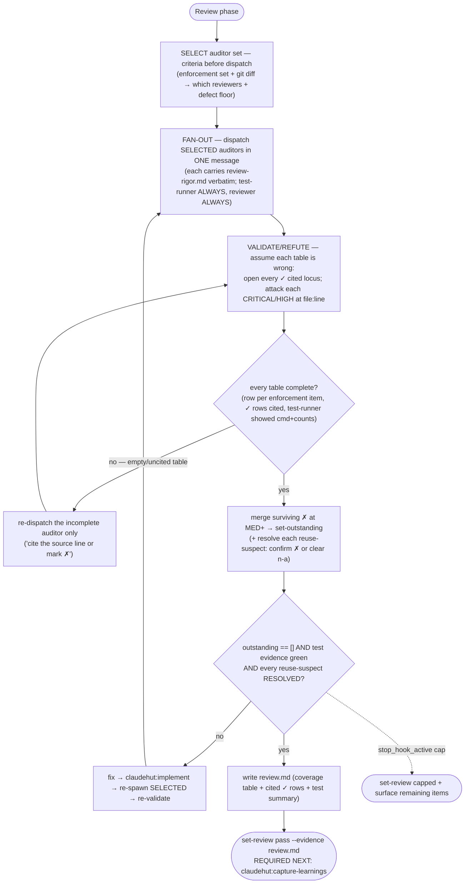

# Review (phase 6 of 7)

Prove the change is done — against the enforcement set, the project rules, and fresh test evidence — before
any completion claim. Runs **inline on the main thread** (a subagent cannot spawn subagents).

## Iron Law

```
NO COMPLETION CLAIM WHILE ANY APPLICABLE SKILL, RULE, OR MEMORY ITEM IS UNSATISFIED — AND NONE WITHOUT FRESH REVIEW EVIDENCE
```

If you have not re-run the auditors **this turn**, you cannot say it passes — paraphrases included ("should
pass", "looks compliant"). The `Stop` gate blocks turn-end until `review=pass`, and `set-review pass` **requires
the `review.md` evidence file**.

## The rigor contract

The rules binding the four code-review auditors live in **`references/review-rigor.md`** (think-first · refute
on the Spec/Enforcement + Standards axes · evidence per claim · coverage-table output · severity scale). **Cat
that file verbatim into each code-review auditor's dispatch prompt** — it is the single source; the auditor
bodies do not restate it. `claudehut-test-runner` is exempt (raw test output, no coverage table). (Forgetting
to cat it is caught downstream: `set-review pass` refuses any `review.md` whose `✓` rows lack a cited locus, so
an uninstructed auditor cannot produce a passing-but-empty review — the cat-instruction is prose, but the gate
makes it safe.)

## Flow



## The loop

1. **Select the reviewers this change needs, then spawn them in ONE message.** Spawning a specialist with
   nothing to review wastes tokens (db-reviewer on a no-DB change). Decide from two signals: the **enforcement
   set** (Brainstorm — its rules map to reviewers) and the **changed files**. Fast-lane tiers have NO
   enforcement set — select from changed files alone. Get the diff:

   ```
   git diff --name-only $(git merge-base HEAD @{u} 2>/dev/null || echo HEAD~1)..HEAD; git status --porcelain
   ```

   | Reviewer | Spawn when |
   |---|---|
   | `claudehut:claudehut-test-runner` | always (full tier) — evidence is non-negotiable |
   | `claudehut:claudehut-reviewer` | always — correctness/conventions apply to any change |
   | `claudehut:claudehut-security-auditor` | enforcement has `security/*` OR diff touches controllers/auth/security/deserialization/secrets. **Full tier: when in doubt, run it** (a false-skip ships a vuln). trivial/small: skip by default (the fast-lane bound already denied any security/auth path) |
   | `claudehut:claudehut-perf-reviewer` | enforcement has `performance/*` OR diff touches ANY repository/`@Query`/entity/`Mono`/`Flux`/`@Cacheable`. **Default ON** — N+1 / EAGER / `.block()` hide in "pure logic" diffs |
   | `claudehut:claudehut-db-reviewer` | enforcement has `framework/jpa`·`flyway`·`migration` OR diff touches `@Entity`/repository/migration files |
   | `claudehut:claudehut-observability-reviewer` | enforcement has `observability/*` OR diff adds/changes an HTTP endpoint, `@KafkaListener`/message handler, `@Scheduled` job, or outbound client. **Full tier: default ON** — a new operation that ships with no metric/trace is undiagnosable in prod. trivial/small: skip |

   **Fast-lane fold (trivial/small):** do NOT spawn a separate test-runner — fold the test run into
   `claudehut-reviewer` (its prompt adds "run the cheapest test that proves the behavior; include the exact
   command + real pass/fail counts"). Full tier keeps the dedicated test-runner.

   Dispatch by **qualified type** (`claudehut:claudehut-…`) — unqualified names can fail to resolve. State
   which reviewers you selected and why (one line each) so any skip is auditable.

   **Every code-review dispatch prompt MUST carry** (none of this is auto-present in the isolated subagent):
   - **`references/review-rigor.md`** verbatim + the auditor's defect-class floor. (test-runner: only "run the
     suite fresh this turn; report the exact command + real pass/fail counts".)
   - **Enforcement set, verbatim** — `jq -c '.enforcement_set' "${CLAUDE_PROJECT_DIR}/.claude/claudehut/state/${CLAUDE_SESSION_ID}.json"`.
     One coverage row per item. (Fast-lane: empty set — say so; the auditor falls back to its defect floor.)
   - **Project pitfalls** — `"${CLAUDE_PLUGIN_ROOT}/scripts/inject-learnings.sh" --filter "<changed files + enforcement keywords>" --top 8`,
     pasted under `## Known pitfalls (check against these)`. The auditor adds a row for each.
   - **Vocabulary** — if `${CLAUDE_PROJECT_DIR}/.claude/claudehut/LANGUAGE.md` exists, paste it under
     `## Project Vocabulary`. If absent, omit.
   - **Known reuse suspects** — if `.claude/claudehut/state/${CLAUDE_SESSION_ID}.suspects.jsonl` exists, paste
     its rows (`jq -c .`) under `## Known reuse suspects (confirm or clear each)`. The reviewer adds a row per
     suspect — **confirm** (a real `✗`) or **clear** (`n-a: <reason>`). **`set-review pass` REFUSES until each
     suspect's row carries a resolution token** — so this is gated, not advisory.

   Auditors with a DB/Kafka MCP **degrade gracefully** when none is connected: review statically and say so.

2. **Validate the reports before trusting them (refute pass).** On the main thread, cheaply, no new dispatch:
   - **Reject incomplete tables:** any code-review auditor missing a row for an enforcement-set item, or whose
     `✓` rows lack a `file:line`+quote, or that returned bare "PASS" → **re-dispatch** it ("cite the source line
     or mark it ✗"). (Validate the test-runner separately: it must show the command it ran this turn + real
     counts, not an assertion.)
   - **Refute blocking findings:** for each CRITICAL/HIGH, open the cited `file:line` and confirm the defect is
     real before it enters outstanding.
   For a large/high-stakes change, run the refute pass as a fresh `claudehut:claudehut-reviewer` told to attack
   the other auditors' findings + passes.
3. **Merge surviving outstanding** (every `✗` at MED+ not justified-and-deferred):

   ```
   claudehut-state --session ${CLAUDE_SESSION_ID} set-outstanding '["framework/jpa.md: N+1 in OrderService — OrderService.java:42", "…"]'
   ```

4. **Persist the evidence** to `${CLAUDE_PROJECT_DIR}/.claude/claudehut/tasks/NNNN-<slug>/review.md`: the merged
   coverage table (every item + defect row → status + `file:line`), the test evidence (exact command + pass
   count), any MED deferrals with written justification, the verdict.
5. **Earned pass.** When outstanding == [] AND evidence is green:

   ```
   claudehut-state --session ${CLAUDE_SESSION_ID} set-review pass --evidence .claude/claudehut/tasks/NNNN-<slug>/review.md
   ```

   `set-review pass` refuses unless the file exists under `.claude/claudehut/`, carries a coverage table (each
   `✓` row cited), a test-run summary, and a resolution for each staged reuse-suspect. `pass` is not a free flag.

## Test evidence (the test-runner enforces this)

Pick the **cheapest test that proves the behavior**:

| Need | Use |
|------|-----|
| Pure logic, no Spring | plain JUnit 5 + Mockito |
| Web layer only | `@WebMvcTest` / `@WebFluxTest` |
| Persistence only | `@DataJpaTest` / `@DataR2dbcTest` + Testcontainers |
| Full wiring | `@SpringBootTest` (slowest — last resort) |
| External HTTP | WireMock (assert the request) |
| Real DB / Kafka / Redis | Testcontainers — not embedded fakes |

No `Thread.sleep` for async — use Awaitility / `StepVerifier`. Full matrix: `references/test-matrix.md`.

## Exit

`outstanding == []` + evidence green → `set-review pass`. **OR** the consecutive-`Stop` cap
(`stop_hook_active`) reached → `set-review capped` + surface the remaining items, rather than loop forever.

## Red flags — STOP

- "should pass" / "looks compliant" before the auditors re-ran this turn
- Done with a non-empty outstanding set
- A `✓ satisfied` row without a `file:line`+quote, or a missing row (silence ≠ pass)
- A behavioral claim inferred from a name instead of a cited line
- `set-review pass` without a `review.md` carrying the coverage table + test evidence
- Downgrading a plausible correctness/perf defect to LOW to avoid blocking (confidence ≠ severity)

**REQUIRED NEXT:** `claudehut:capture-learnings`.
